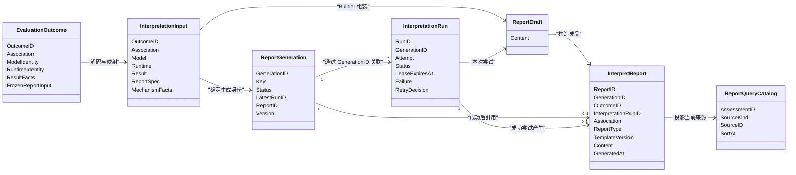
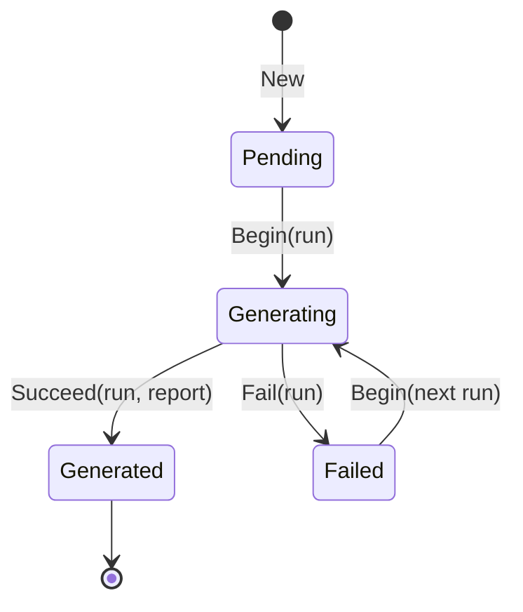
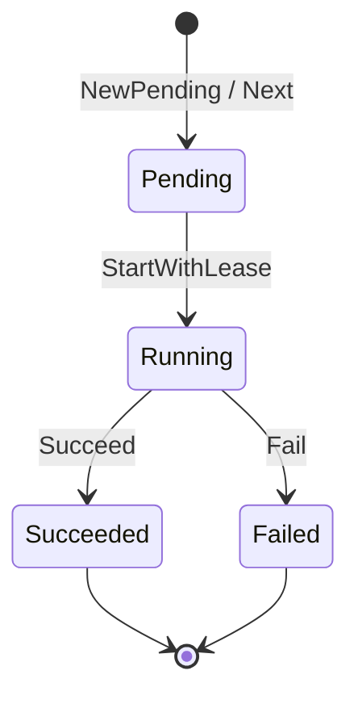
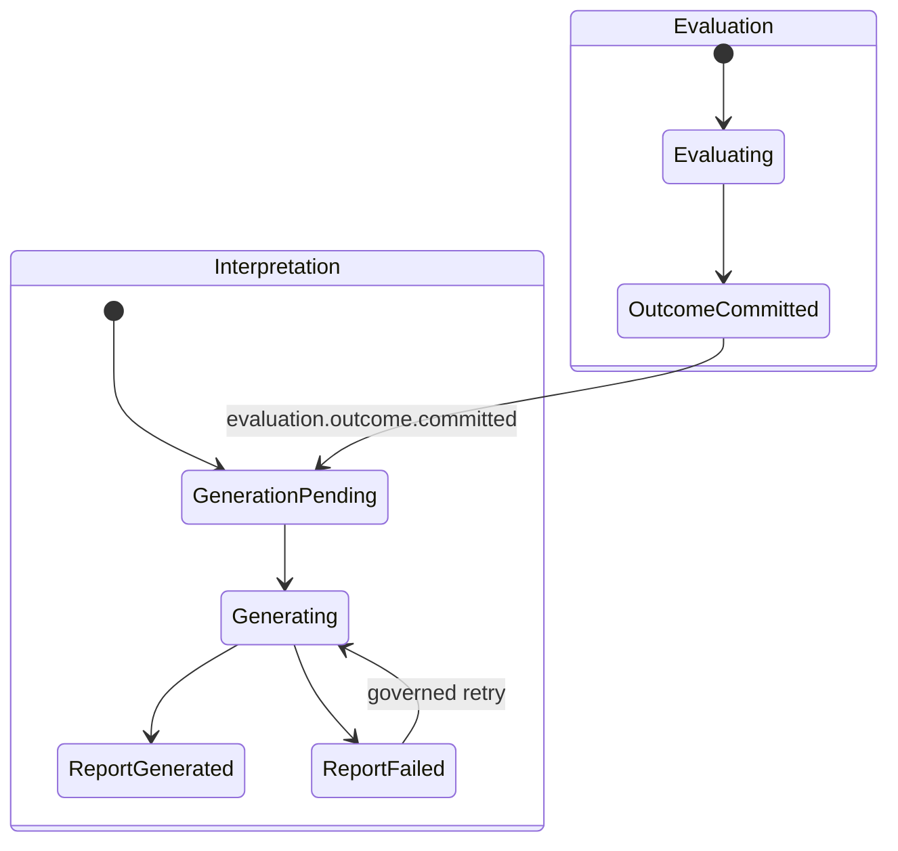

# Interpretation 领域模型

## 1. 本文回答

本文聚焦 Interpretation 的领域概念与聚合边界，回答以下问题：

- 为什么 Interpretation 不能只有一个可变 `Report`；
- `InterpretationInput` 为什么属于 Interpretation，却不是新的业务聚合；
- `ReportGeneration` 为什么是报告生成聚合根；
- `InterpretationRun` 为什么与 Generation 分开持久化；
- `Report Draft` 和 `InterpretReport` 为什么必须分开；
- `InterpretReport` 为什么是独立不可变成品，而不是 Generation 内部的可变内容字段；
- `report_query_catalog` 为什么是读模型，不是第五个领域对象；
- Outcome、Decision、InterpretReport 之间的领域边界在哪里；
- 报告生成失败、重试和查询如何不污染已经成立的测评结果。

## 2. 30 秒结论

Interpretation 将“一份报告”拆成了四个性质完全不同的核心模型：

| 对象 | 回答的问题 | 生命周期 | 是否持久化 |
| --- | --- | --- | --- |
| `ReportGeneration` | 基于这份 Outcome，按某种报告类型和模板版本的生成意图现在怎样 | pending → generating → generated/failed | 是 |
| `InterpretationRun` | 第几次生成尝试发生了什么 | pending → running → succeeded/failed | 是，每次 attempt 独立保留 |
| `Report Draft` | Builder 本次在进程内组装出了什么 | 构建后等待提交，失败即丢弃 | 否 |
| `InterpretReport` | 哪次成功 Run 产生了什么不可变报告成品 | 创建后只读 | 是 |

`InterpretationInput` 是上述模型的冻结输入；`report_query_catalog` 是面向查询的投影。它们都很重要，但不增加生成领域的聚合数量。

一句话概括这个模型：

> Generation 管生成意图，Run 记录执行证据，Draft 承载暂态内容，InterpretReport 保存不可变成品；查询索引只负责让读者高效找到报告。

## 3. 统一语言

在分析模型前，需要先区分几个容易混用的术语。

| 术语 | 本文定义 |
| --- | --- |
| 测评结果事实 | Evaluation 可靠提交的 Outcome，包含分数、等级、类型、维度结果等机器可判定事实 |
| 冻结报告输入 | Evaluation 执行时与 Outcome 一起固化的 ReportInput，用于保护历史解释语义 |
| 解释输入 | Interpretation 将 Outcome 和 ReportInput 解码、映射后得到的 `InterpretationInput` |
| 报告生成意图 | 针对一份 Outcome、一种 ReportType 和一个 TemplateVersion 生成报告的持久化目标 |
| 执行尝试 | 为完成同一生成意图而发起的第 N 次 InterpretationRun |
| 报告机制 | 由 AlgorithmFamily、DecisionKind、ReportType、TemplateVersion 等身份决定的可复用组装方式 |
| Builder | 把 InterpretationInput 确定性组装为 Report Draft 的领域能力 |
| Report Draft | 没有持久化身份和生命周期的进程内报告内容 |
| InterpretReport | 成功 Run 可靠提交后形成的不可变报告成品 |
| Audience 投影 | 在不改变 canonical Report 的前提下，按读者身份决定章节可见性 |
| 当前报告索引 | `report_query_catalog` 中按 Assessment 指向当前 artifact 或 archive 正文的读模型 |

因此，下列表达不是同一件事：

```text
“已经计算出结果”
≠ “Outcome 已经可靠提交”
≠ “报告内容已经构建”
≠ “InterpretReport 已经可靠提交”
≠ “当前读者已被授权查看报告”
```

## 4. 领域边界与模型关系



这张图中有三个必须强调的边界。

### 4.1 EvaluationOutcome 是外部事实，不是 Interpretation 聚合

Interpretation 会通过 Evaluation Fact Port 按 OutcomeID 读取 Outcome Record，但它：

- 不拥有 Outcome Repository 的写权限；
- 不重建 Assessment 或 EvaluationRun；
- 不修改 Outcome payload；
- 不推进 Evaluation 状态。

Outcome 只是已成立的上游事实。Interpretation 在自己的边界内将它转换为 InterpretationInput。

### 4.2 ReportGeneration 与 InterpretationRun 是关联模型，不是一个大文档

ReportGeneration 保存当前生成意图的最小状态；InterpretationRun 保存每次执行尝试的完整证据。

当前它们分别存在 `report_generations` 和 `interpretation_runs` collection，通过 GenerationID、LatestRunID 以及唯一索引保持关系。这种拆分避免每新增一次 attempt 都扩大并重写 Generation 文档。

### 4.3 InterpretReport 是独立成品，不是 Generation 的内嵌子对象

ReportGeneration 成功后会保存 ReportID，InterpretReport 也会保存 GenerationID、OutcomeID 和成功 RunID。但两者的职责不同：

- Generation 的状态可以在 pending、generating、failed 之间推进；
- InterpretReport 只在成功路径出现；
- Generation 不保存报告正文；
- InterpretReport 不保存运行中状态或失败信息；
- InterpretReport 有独立身份、Repository 和 `interpret_report_artifacts` collection。

因此，更准确的定义是：

> ReportGeneration 是生成生命周期聚合根；InterpretReport 是成功生成后形成的独立、不可变领域成品。

## 5. InterpretationInput：冻结的报告生成输入

### 5.1 为什么需要自己的输入模型

Builder 如果直接依赖 EvaluationOutcome Record、Assessment、ModelCatalog Snapshot 和多个 Repository，会带来四个问题：

1. Interpretation 会被 Evaluation 的持久化形状绑定；
2. Builder 可能在生成时读到已经变化的当前模型；
3. 不同 Builder 会重复解码 Outcome 与冻结 payload；
4. 报告生成无法明确回答“它究竟使用了哪些输入事实”。

`InterpretationInput` 将上游事实转换为 Interpretation 自己的稳定、只读输入：

```go
type InterpretationInput struct {
    OutcomeID       meta.ID
    Association     report.Association
    Model           report.ModelIdentity
    Runtime         RuntimeIdentity
    Result          ResultFacts
    Report          ReportSpec
    FactorScoring   *FactorScoringFacts
    PersonalityType *PersonalityTypeFacts
    TraitProfile    *TraitProfileFacts
}
```

### 5.2 六组输入事实

| 分组 | 内容 | 用途 |
| --- | --- | --- |
| Outcome 身份 | `OutcomeID` | 建立 Generation 幂等身份和追溯关系 |
| Association | OrgID、AssessmentID、TesteeID | 报告关联、数据隔离和查询投影 |
| Model | kind、subKind、algorithm、code、version、title 等 | 说明这份报告属于哪个发布模型 |
| Runtime | AlgorithmFamily、DecisionKind、PayloadFormat | 说明上游使用什么机制得到结果 |
| Result | PrimaryScore、ResultLevel | 传递已经成立的主结果事实 |
| ReportSpec | ReportType、TemplateVersion、Algorithm、ProductChannel、ReportProfile、AdapterKey、TemplateID | 确定报告身份和 Builder/模板路由 |
| Mechanism Facts | FactorScoring、PersonalityType 或 TraitProfile | 提供某类 Builder 所需的中性生成事实 |

`Association` 特别容易被误解。它是从 Outcome 复制进报告的冻结关联快照，不是 Assessment 聚合引用，更不授予 Interpretation 修改 Assessment 的权限。

### 5.3 InterpretationInput 不是可持久化聚合

InterpretationInput 没有自己的业务生命周期。它由持久化 Outcome 可重建，只在一次生成调用中使用。

它的价值是“隔离上游形状”和“为 Builder 提供稳定语言”，而不是新增一个需要 Repository 管理的聚合。

### 5.4 历史语义的保护

InterpretationInput 必须从 Outcome 中的冻结 ReportInput 构建，不应在报告生成时默认读取当前已发布模型。否则会出现：

```text
同一 Outcome
  + 第一次生成时的模型配置
  != 失败重试时的当前模型配置
  -> 同一结果产生不同报告
```

当前生产路径通过 `DecodeExecution` 和 `DecodeReportInput` 从 EvaluationOutcome 恢复这些事实，已经建立了正确的历史输入边界。

## 6. ReportGeneration：报告生成生命周期聚合根

### 6.1 Generation 代表什么

ReportGeneration 不是一次 Worker 任务，也不是一份报告正文。它表达一个稳定的业务意图：

> 使用某份已成立 Outcome，按某种 ReportType 和某个 TemplateVersion，生成一份完整报告。

它的业务唯一键为：

```text
OutcomeID + ReportType + TemplateVersion
```

### 6.2 为什么这三个字段共同组成身份

| 字段 | 保护的语义 |
| --- | --- |
| OutcomeID | 同一测评结果的重复事件不创建第二个同版生成意图 |
| ReportType | 为未来同一 Outcome 产生不同用途的报告保留身份空间 |
| TemplateVersion | 新模板或新内容语义产生新 Generation，不覆盖历史报告 |

Audience 不进入这个键。当前系统生成一份 canonical Report，在读取阶段再按 participant、clinician 或 admin 应用投影。如果将 Audience 加入键中，会为同一 Outcome 重复生成多份大量重叠的报告。

### 6.3 Generation 保存的最小事实

| 字段 | 语义 |
| --- | --- |
| ID | 报告生成意图的稳定身份 |
| Key | OutcomeID、ReportType、TemplateVersion |
| Status | 当前生成进度 |
| LatestRunID | 当前或最近一次执行尝试 |
| ReportID | 成功后形成的不可变成品 |
| Version | 聚合乐观并发控制版本 |
| CreatedAt / UpdatedAt | 生成意图创建与最后推进时间 |

Generation 不保存：

- 报告正文；
- 历史 Run 数组；
- 详细失败原因；
- 重试计划详情；
- 读者授权信息。

这些事实分别由 InterpretReport、InterpretationRun 和应用层访问策略拥有。

### 6.4 Generation 状态机



| 状态 | 业务语义 | LatestRunID | ReportID |
| --- | --- | --- | --- |
| `pending` | 生成意图已创建，但尚未开始执行 | 必须为空 | 必须为空 |
| `generating` | 某个 Run 已领取本次生成 | 必须存在 | 必须为空 |
| `failed` | 最近 Run 已可靠记录失败 | 必须存在 | 必须为空 |
| `generated` | 不可变报告已可靠提交 | 必须存在 | 必须存在 |

`failed` 不代表可以无条件重新 Begin。应用层 Starter 必须检查最近 Run 的持久化 RetryDecision 和调用上下文中的授权事实，才能创建下一次 Run。

### 6.5 并发保护

Generation 同时使用两类保护：

1. MongoDB 唯一索引保证同一 Key 只有一份 Generation；
2. `Version` 和 expected version CAS 保证同一 Generation 只有一个并发推进者成功。

当两个 Worker 同时处理重复 Outcome 事件时，失败的 claim 方会重读已有 Generation，返回 processing 或 generated，而不是生成第二份报告。

### 6.6 当前报告身份的两个限制

当前只注册 `standard` ReportType，TemplateVersion 也由适配器固定为 `legacy-v1`。这表明身份模型已经为多报告类型和新版模板留出空间，但不代表这两种资产已经可由运营发布管理。

## 7. InterpretationRun：一次可治理的执行尝试

### 7.1 Run 的核心语义

InterpretationRun 回答：

- 这是同一 Generation 的第几次尝试；
- 本次尝试是初始执行、自动重试、人工重试、强制重试还是 lease 恢复；
- 当前是否仍由某个执行者合法持有；
- 什么时候开始、什么时候结束；
- 如果失败，属于什么类别、是否可重试；
- 失败后系统对下一次尝试做出了什么持久化决策。

Run 不保存报告内容，也不修改 Outcome。

### 7.2 Run 状态机



| 状态 | 必须存在的事实 | 必须不存在的事实 |
| --- | --- | --- |
| `pending` | ID、GenerationID、Attempt | StartedAt、LeaseExpiresAt、FinishedAt、Failure |
| `running` | StartedAt；由 Starter 开始的 Run 还有 LeaseExpiresAt | FinishedAt、Failure |
| `succeeded` | StartedAt、FinishedAt | LeaseExpiresAt、Failure |
| `failed` | StartedAt、FinishedAt、Failure、RetryDecision | LeaseExpiresAt |

Run 终态不回退。可重试失败通过 `NextWithOrigin` 创建 `attempt + 1` 的新 Run，旧 Run 仍然保留为 failed 审计证据。

### 7.3 Attempt 与 lease 恢复不是同一件事

如果 Worker 在报告构建中崩溃，运行中 Run 会留下过期 lease。恢复程序可以重新领取这个已过期 Run，但：

- 不增加 attempt；
- 不创建新 Run；
- 不消耗一次业务重试额度；
- 只更新 trace、lease 到期时间和 origin。

这是一个重要的语义区分：

> 进程崩溃后继续同一次尝试，属于执行恢复；Builder 已经得出明确失败后再执行，才属于新的业务 attempt。

### 7.4 Failure 只保存安全可分类事实

Run 中的 Failure 包含：

| 字段 | 用途 |
| --- | --- |
| Kind | 区分 input、template、build、timeout 等失败类型 |
| Code | 稳定的机器错误编码 |
| SafeMessage | 可以对外或对运维展示的安全原因 |
| Retryable | 该失败是否具备自动重试的基础条件 |

完整 error chain、堆栈和可能包含敏感数据的内部错误只进入日志与 tracing，不保存到领域对象和客户端可读记录中。

当前 Executor 对典型失败的分类为：

| 场景 | Kind | Code | Retryable |
| --- | --- | --- | --- |
| 无法得到有效报告机制 | input | `unsupported_mechanism` | false |
| Registry 没有对应 Builder | template | `builder_not_found` | false |
| Builder 返回错误 | build | `build_failed` | true |
| Builder 返回空 Draft | build | `empty_draft` | true |
| Draft 无法构造合法成品 | build | `invalid_artifact` | false |

### 7.5 RetryDecision 是失败当时的持久化决策

`Retryable=true` 只是失败特征，不等于“Worker 现在可以自由重试”。Run 失败时会通过重试策略形成 RetryDecision，包含：

- 当前 attempt；
- 最大自动尝试数；
- 剩余自动尝试数；
- disposition：automatic、manual_required 或 terminal；
- NextAttemptAt；
- RetryEventID；
- ActionRequestID，用于关联人工或强制操作。

Starter 只在下一次尝试已获得持久化授权，且当前调用中的 event ID、expected attempt、origin 和 action request 与决策匹配时，才会创建新 Run。

## 8. Report Draft：进程内的不可变内容

### 8.1 Draft 为什么不是 Report

Report Draft 只包含一份防御性拷贝的 `Content`。它不包含：

- Report ID；
- GenerationID；
- OutcomeID；
- RunID；
- 持久化状态；
- 失败原因；
- 事件发布状态。

因此 Draft 只能说明“Builder 组装出了这些内容”，不能说明“系统已经生成这份报告”。

### 8.2 内容构建与生命周期控制分离

Builder 的输出是 Draft，而不是 InterpretReport，这使得：

- Builder 只关注内容组装；
- Builder 不需要 Repository、Transaction 或 Outbox；
- Builder 无权推进 Generation 和 Run；
- ModelCatalog 预览可以使用 Draft，而不制造生产 Report ID；
- 如果后续成品构造或事务提交失败，Draft 可以直接丢弃。

### 8.3 Draft 也是不可变值对象

`NewDraft` 和 `Content()` 都会对 Content 执行防御性拷贝。这使 Builder 输出之后，外部 slice 或 pointer 变化不会悄然改变待提交内容。

## 9. InterpretReport：独立不可变报告成品

### 9.1 报告什么时候才成立

InterpretReport 只在以下条件同时满足时才能构造：

- Generation 和 Run 均已有效建立；
- Builder 已经返回非空 Draft；
- Report、Generation、Outcome 和 Run 身份完整；
- OrgID、AssessmentID 和 TesteeID 关联完整；
- ReportType 和 TemplateVersion 完整；
- GeneratedAt 完整。

构造成功仍不等于已经对外成立。只有 InterpretReport、Run 成功状态、Generation 成功状态、report_query_catalog 和 `interpretation.report.generated` Outbox 事件同事务提交成功，这份报告才是可靠成品。

### 9.2 InterpretReport 的身份与来源

| 字段 | 回答的问题 |
| --- | --- |
| ID | 这份报告成品是谁 |
| GenerationID | 它实现了哪个生成意图 |
| OutcomeID | 它解释的是哪份测评结果事实 |
| InterpretationRunID | 哪次成功尝试产生了它 |
| Association | 它属于哪个机构、Assessment 和受试者 |
| ReportType | 它属于哪种报告用途 |
| TemplateVersion | 它使用哪一代报告语义 |
| GeneratedAt | 这份不可变成品何时形成 |

InterpretReport 创建后没有 setter 和二次编辑状态。读取 Content 时也返回防御性拷贝，避免调用者修改成品内部数据。

### 9.3 Content 的中性报告结构

InterpretReport Content 不使用“量表报告”作为唯一语言，而是将不同测评机制收敛为中性结构：

| 内容 | 语义 |
| --- | --- |
| Model | 发布模型的冻结身份 |
| PrimaryScore | 主分数，可以是总分、匹配度等不同 kind |
| Level | 主结果等级、标签和 severity |
| Conclusion | 报告级综合解释 |
| Dimensions | 因子、偏好极、特质、索引或能力维度 |
| Suggestions | 报告级或维度级结构化建议 |
| ModelExtra | 人格类型等机制需要的额外展示信息 |

Dimension 进一步支持：

- 中性 DimensionKind：factor、pole、trait、index、ability；
- raw score 与 max score；
- derived scores；
- level 和 severity；
- NormReference；
- description 与 suggestion；
- role、parent code、hierarchy level 和 sort order。

因此，InterpretReport 可以在不暴露特定 Calculation 返回类型的前提下，统一表达多种报告。

### 9.4 InterpretReport 不保存什么

InterpretReport 不应保存：

- 生成中状态；
- 失败原因和重试决策；
- Worker claim 与 lease；
- Assessment 的完整业务数据；
- 当前行为人的权限；
- 可继续变化的 ModelCatalog 草稿。

这些事实不属于一份已成立报告的内容语义。

### 9.5 当前来源追溯的不足

Builder 会暴露 `BuilderIdentity` 和 `ContentSchemaVersion`，它们会进入 `interpretation.report.generated` 事件。但当前 InterpretReport 成品只保存 TemplateVersion，没有把 BuilderIdentity 和 ContentSchemaVersion 一起固化。

这不影响当前报告读取，但会影响长期审计问题：

- 脱离历史事件后，成品无法独立证明由哪个 Builder 产生；
- 无法仅从报告文档确认其 Content schema；
- 未来进行内容迁移或渲染兼容时，需要额外推断。

本文将它作为已识别的设计问题，而不把“报告成品来源已完整自包含”写成当前事实。

## 10. report_query_catalog：不是领域聚合的查询投影

### 10.1 为什么不直接查报告正文

报告正文体积较大，且当前同时存在：

- 新的 `interpret_report_artifacts`；
- 历史兼容的 `archived_reports`。

如果列表查询直接扫描两个正文 collection，需要合并、去重、排序和分页，也难以明确“某个 Assessment 当前应该读哪个来源”。

`report_query_catalog` 为每个 Assessment 保留一条紧凑索引：

| 字段 | 用途 |
| --- | --- |
| AssessmentID | 当前查询主键 |
| OrgID / TesteeID | 列表过滤与数据范围 |
| SourceKind | artifact 或 archive |
| SourceID | 真实正文身份 |
| ModelCode / RiskLevel | 工作台和报告列表过滤 |
| SortAt / SortReportID | 稳定排序与新旧胜出规则 |

### 10.2 Catalog 不拥有业务真相

Catalog 不保存报告正文，也不决定生成是否成功。它是 InterpretReport 成功提交时的同事务投影，只用于快速选择正文来源。

当 Catalog 指向不存在的 artifact 或 archive 时，读模型会返回 `CatalogDanglingSourceError`，而不是悄然忽略数据损坏。

### 10.3 当前“一个 Assessment 一份当前报告”的限制

Catalog 当前对 AssessmentID 建立唯一索引。这与当前一个 Assessment 只产生一份 `standard` 当前报告的业务事实一致。

但 Generation 身份已经包含 ReportType 和 TemplateVersion。如果未来需要同时保留多份当前报告，Catalog 是否仍以 AssessmentID 为唯一粒度，必须重新定义。

这是查询模型的未来边界，不应反向否定 Generation 现在的版本化身份设计。

## 11. Builder、Registry 与 Presenter：领域服务

### 11.1 Builder 是内容组装策略

Builder 接口要求实现者提供：

- ReportType；
- TemplateVersion；
- BuilderIdentity；
- ContentSchemaVersion；
- MechanismKey；
- `Build(InterpretationInput) -> Draft`。

这意味着 Builder 同时实现两个契约：

1. 我可以处理什么报告机制；
2. 我产生的内容属于什么版本和 schema。

Builder 本身不是聚合，而是无状态或仅持有模板适配器的领域策略。

### 11.2 Rendering Registry 是报告机制解析器

Registry 根据以下完整键解析 Builder：

```text
AlgorithmFamily
+ DecisionKind
+ ReportType
+ TemplateVersion
+ Algorithm            optional
+ ProductChannel       optional
+ ReportProfile        optional
```

其中 AlgorithmFamily 和 DecisionKind 是机制主身份；Algorithm、ProductChannel 和 ReportProfile 可以用于更精细的报告适配。

Registry 允许在同一 TemplateVersion 内从更具体键回落到更通用键，但不跨 TemplateVersion 回落。这保护了模板版本的语义边界。

### 11.3 Presenter 是报告章节可见性策略

InterpretReport 是 canonical Report，不按 Audience 重复生成。Presenter 在应用层将读模型映射为返回对象时，根据 Audience 决定报告 section 是否可见。

当前只实现了 `model_extra` 这一章节策略：

| Audience | ModelExtra |
| --- | --- |
| participant | 可见 |
| clinician | 不可见 |
| admin | 可见 |

这是当前代码契约，但“为什么医生不可见、患者可见”尚缺少充分业务解释，应在 Audience 专题文档中单独确认，不应仅因代码存在就把它视为永久领域规则。

## 12. 应用服务与领域对象的协作

### 12.1 Automation：可信系统行为人

Automation Service 接受 OutcomeID，负责：

1. 校验调用来自可信系统行为人；
2. 重读持久化 EvaluationOutcome；
3. 构建 InterpretationInput；
4. 调用 Executor；
5. 将领域执行结果映射为 generated、processing 或 blocked。

Automation 不接受客户端传入的报告内容，也不信任 Worker 传入的完整 Outcome payload。Worker 只传递 OutcomeID，生成端从可靠事实库重读数据。

### 12.2 Starter：生成意图与执行权的争抢者

Starter 根据 Generation Key 处理：

- 首次创建 Generation 和 Run；
- 已生成时直接返回现有 InterpretReport；
- 已在执行且 lease 有效时返回 processing；
- lease 过期时原子重新领取同一 Run；
- failed 时根据 RetryDecision 和授权事实决定 blocked 或创建下一 Run；
- 并发 claim 冲突时重读胜出者状态。

### 12.3 Executor：稳定主链路编排

Executor 只编排一条稳定路径：

```text
Start Generation/Run
  -> Resolve Builder
  -> Build Draft
  -> Construct InterpretReport
  -> Commit Success
```

任何新模型如果可以复用已有机制，都不应修改这条路径。差异应当由 InterpretationInput、Rendering Registry 和 Builder 承担。

### 12.4 Committer：终态事实的唯一提交边界

InterpretationCommitter 是 Run 终态持久化的唯一应用边界。

成功时同事务提交：

- InterpretReport；
- report_query_catalog 当前来源；
- Run=succeeded；
- Generation=generated 和 ReportID；
- `interpretation.report.generated` durable Outbox 事件。

失败时同事务提交：

- Run=failed、Failure 和 RetryDecision；
- Generation=failed；
- `interpretation.report.failed` durable Outbox 事件；
- 如果获得自动重试决策，还包含定时 `interpretation.retry.requested` Outbox 事件。

### 12.5 四类查询行为人

| 应用服务 | 行为人 | 主要读取对象 |
| --- | --- | --- |
| participant | 受试者 | 自己的单份报告和报告列表 |
| clinician | 机构内医生 | 已授权患者的报告 |
| administration | 运营或管理员 | 机构或可访问受试者范围内的报告 |
| operations | 运维与审计人员 | Generation、Run、Report 和历史执行证据 |

这些应用服务不使用一个“中性 ReportService”对所有调用者暴露相同能力，而是先根据行为人语义完成授权，再加载和投影报告。

## 13. 事件与跨模块事实

### 13.1 输入事件

| 事件 | 所有者 | Interpretation 如何使用 |
| --- | --- | --- |
| `evaluation.outcome.committed` | Evaluation | Worker 获取 OutcomeID，调用 Interpretation Automation 启动报告生成 |
| `interpretation.retry.requested` | Interpretation | Worker 携带授权事实重新调用同一 Outcome 的生成入口 |

`interpretation.retry.requested` 不是“报告失败了，随便再试一次”。它代表某次自动、人工或强制重试已经被持久化授权。

### 13.2 输出事件

| 事件 | 聚合身份 | 关键事实 |
| --- | --- | --- |
| `interpretation.report.generated` | ReportGeneration ID | Generation、Run、Report、Outcome、Assessment、attempt、template、builder 和结果摘要 |
| `interpretation.report.failed` | ReportGeneration ID | Generation、Run、Outcome、attempt、failure kind/code、retryable 和 safe reason |

Generation 的 pending/generating 和 Run 开始属于模块内部执行事实，当前不发布 durable 跨模块事件。

### 13.3 generated 事件可以驱动后置投影

Worker 消费 generated 事件后，当前会：

- 更新报告等待状态；
- 记录高风险报告日志；
- 同步受试者的 Assessment attention。

这些是报告成功后的下游投影，不属于 InterpretReport 聚合创建事务内部的领域不变式。

## 14. 跨模块生命周期的正确理解



这里有三个不能破坏的事实：

1. Outcome committed 后，Evaluation 的成功事实已经成立；
2. Interpretation 失败不得把 Assessment 改为 failed，也不得撤销 Outcome；
3. 客户端看到的“完成”是 Evaluation 已有结果且 Interpretation 已有可读报告的组合投影。

因此，`evaluated` 是 Evaluation 终态，`generated` 是某个 ReportGeneration 终态，`interpreted/completed` 是跨模块读模型语义。

## 15. 领域不变式

### 15.1 输入与边界

1. 生产报告必须从已持久化 EvaluationOutcome 构建输入。
2. Interpretation 只读 Outcome，不获得 Evaluation 写能力。
3. InterpretationInput 中的 OutcomeID 必须与被读取 Outcome Record 的 ID 一致。
4. Association 只用于关联和查询，不代表 Assessment 修改权。
5. Outcome 决定结果，Interpretation 不得重新计分、重新分类或改变结论事实。

### 15.2 Generation 与 Run

6. 同一 `OutcomeID + ReportType + TemplateVersion` 只能存在一个 ReportGeneration。
7. Generating 和 failed Generation 必须指向最近 Run，generated Generation 还必须指向 Report。
8. 同一 Generation 的 attempt 必须单调增加且物理唯一。
9. Run 终态不被覆盖，新的业务尝试必须创建新 Run。
10. lease 恢复只续接同一 Run，不消耗新的业务 attempt。
11. Failed Generation 只能在持久化 RetryDecision 与当前授权事实匹配时创建下一 Run。

### 15.3 Draft 与 InterpretReport

12. Draft 只保存内容，不持有 Report ID 和生命周期状态。
13. 失败 Run 不能产生 InterpretReport。
14. 一个 Generation 最多关联一份成功 InterpretReport。
15. InterpretReport 必须与 Generation Key 中的 OutcomeID、ReportType 和 TemplateVersion 一致。
16. InterpretReport 的 RunID 必须等于 Generation 当前 LatestRunID。
17. InterpretReport 创建后不能被修改或覆盖；新模板语义应产生新 Generation 和新 Report。

### 15.4 可靠提交与查询

18. Report、Run 成功状态、Generation 成功状态、Catalog 和 generated Outbox 事件必须同事务提交。
19. Failure、Run 失败状态、Generation 失败状态、failed 事件和自动重试事件必须在可靠边界中一致提交。
20. report_query_catalog 只是正文来源索引，不替代 InterpretReport 业务事实。
21. 授权必须在加载报告正文前完成，OrgID、TesteeID 和 AssessmentID 本身不构成授权。
22. Audience 只影响读取投影，不改变 canonical InterpretReport 和 Generation 幂等身份。

## 16. 当前实现与目标边界的差距

下列内容不是本文需要掩盖的细节，而是从领域模型角度已经可以看到的后续设计问题。

| 问题 | 当前实现 | 目标边界 |
| --- | --- | --- |
| 报告模板版本 | 统一由适配器填充 `legacy-v1` | 模板、Builder 行为、解释规则和 Content schema 应有可发布、可冻结的版本身份 |
| 成品来源证明 | BuilderIdentity 和 ContentSchemaVersion 只进入 generated 事件 | InterpretReport 应能独立说明自己的内容生成来源 |
| 常模解释边界 | Interpretation 会根据冻结常模表和 T 分数恢复文案 | 必须保证这一步只是展示解释，不重新决定 Outcome 等级 |
| Catalog 粒度 | AssessmentID 唯一，只能表达一份当前报告 | 引入多 ReportType 前必须确认“当前报告”是否需要更细粒度 |
| Audience 规则 | 仅 ModelExtra 可见性已编码，且 clinician 不可见 | 每个章节的可见性需要业务原因、默认策略和测试契约 |
| gRPC 命名 | RPC 名仍为 `GenerateReportFromAssessment`，生产语义使用 OutcomeID | 契约命名应与真实准入事实一致，但需评估兼容性 |

这些问题已在 [设计问题与重构清单](./90-设计问题与重构清单.md) 中使用稳定编号管理，不在本篇领域模型文档中直接假定解决方案。

## 17. 代码与验证入口

### 17.1 核心领域对象

| 对象 | 代码 |
| --- | --- |
| InterpretationInput | [`domain/interpretation/input/input.go`](../../../internal/apiserver/domain/interpretation/input/input.go) |
| ReportGeneration | [`domain/interpretation/generation/generation.go`](../../../internal/apiserver/domain/interpretation/generation/generation.go) |
| InterpretationRun | [`domain/interpretation/run/run.go`](../../../internal/apiserver/domain/interpretation/run/run.go) |
| Draft | [`domain/interpretation/report/draft.go`](../../../internal/apiserver/domain/interpretation/report/draft.go) |
| InterpretReport | [`domain/interpretation/report/artifact.go`](../../../internal/apiserver/domain/interpretation/report/artifact.go) |
| Report Content / Dimension / Suggestion | [`domain/interpretation/report`](../../../internal/apiserver/domain/interpretation/report/) |

### 17.2 领域服务与应用服务

| 能力 | 代码 |
| --- | --- |
| Builder 与 Registry | [`domain/interpretation/rendering`](../../../internal/apiserver/domain/interpretation/rendering/) |
| Audience Presenter | [`domain/interpretation/presentation/presenter.go`](../../../internal/apiserver/domain/interpretation/presentation/presenter.go) |
| Outcome 输入映射 | [`application/interpretation/automation/input`](../../../internal/apiserver/application/interpretation/automation/input/) |
| Starter / Executor / Committer | [`application/interpretation/automation/execution`](../../../internal/apiserver/application/interpretation/automation/execution/) |
| 重试治理与 lease 恢复 | [`application/interpretation/automation`](../../../internal/apiserver/application/interpretation/automation/) |
| 行为人查询 | [`application/interpretation`](../../../internal/apiserver/application/interpretation/) |

### 17.3 持久化与事件

| 能力 | 代码 |
| --- | --- |
| Generation / Run / Report Repository | [`infra/mongo/interpretation/lifecycle_repo.go`](../../../internal/apiserver/infra/mongo/interpretation/lifecycle_repo.go) |
| MongoDB 持久化形状 | [`infra/mongo/interpretation/lifecycle_po.go`](../../../internal/apiserver/infra/mongo/interpretation/lifecycle_po.go) |
| Report Catalog | [`infra/mongo/interpretation/report_catalog.go`](../../../internal/apiserver/infra/mongo/interpretation/report_catalog.go) |
| Report Read Model | [`infra/mongo/interpretation/artifact_read_model.go`](../../../internal/apiserver/infra/mongo/interpretation/artifact_read_model.go) |
| 终态与重试事件 | [`domain/interpretation/events_outcome.go`](../../../internal/apiserver/domain/interpretation/events_outcome.go)、[`configs/events.yaml`](../../../configs/events.yaml) |

```bash
go test ./internal/apiserver/domain/interpretation/generation
go test ./internal/apiserver/domain/interpretation/run
go test ./internal/apiserver/domain/interpretation/report
go test ./internal/apiserver/domain/interpretation/rendering
go test ./internal/apiserver/domain/interpretation/presentation
go test ./internal/apiserver/application/interpretation/...
go test ./internal/apiserver/infra/mongo/interpretation
```
