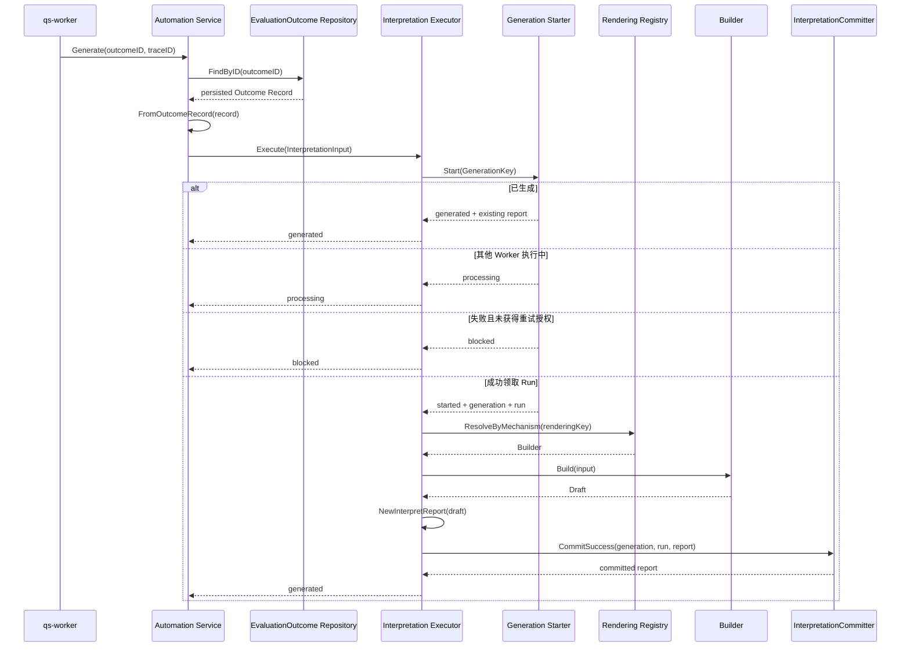

# 核心设计：统一报告生成模型

## 1. 本文回答

本文聚焦 Interpretation 最核心的扩展性设计，回答以下问题：

- 医学量表、人格测评、行为评定和认知测验的报告结构明显不同，为什么仍然可以共享一条生成主链路；
- “统一报告生成”统一的究竟是什么，又刻意保留了哪些差异；
- ModelCatalog、Evaluation、Interpretation 如何通过 AlgorithmFamily 和 DecisionKind 对齐执行与报告语义；
- 为什么报告路由不能使用 model code 作为主键；
- `InterpretationInput`、Rendering Registry、Builder、Draft 和 Executor 分别承担哪一类变化；
- 新增一个模型、新增一种报告呈现、新增一种计算机制时，需要修改哪些代码；
- 生产报告生成和 ModelCatalog 预览可以复用什么，又为什么不应共享完整生命周期。

报告冻结输入的字段级映射和 Builder 键回落细节，会在下一篇《冻结输入、Builder 与模板路由》中进一步展开。本篇首先建立整体生成模型。

## 2. 30 秒结论

Interpretation 的统一报告生成模型可以概括为：

> 先把不同 EvaluationOutcome 解码为 Interpretation 自己的中性输入，再根据稳定的报告机制身份解析 Builder，最后使用一条与具体模型无关的生命周期主链路提交不可变报告。

```text
EvaluationOutcome Record
  -> InterpretationInput             吸收输入形状差异
  -> ReportGeneration / Run          统一幂等与执行生命周期
  -> RenderingKey                    表达可复用报告机制身份
  -> Rendering Registry              将机制身份解析为 Builder
  -> Builder                         吸收内容组装差异
  -> Report Draft                    统一的暂态内容结构
  -> InterpretReport                 统一的不可变成品
  -> InterpretationCommitter         统一的可靠提交边界
```

这里的“统一”不是说所有报告内容都一样，也不是说接入任何新机制都不需要修改代码。准确边界是：

> 同类测评通过配置和冻结资产接入；新的报告机制只修改输入适配、机制路由和 Builder 等显式扩展点；`Start → Resolve → Build → Commit` 主链路不随 model code 反复修改。

## 3. 如果没有统一生成模型

### 3.1 最直观的实现：按模型编码分支

一个常见但会迅速失控的报告入口可能写成：

```text
if model_code == "SNAP_IV":
    build_snap_report()
else if model_code == "BRIEF_2":
    build_brief2_report()
else if model_code == "SPM":
    build_spm_report()
else if model_code == "MBTI":
    build_mbti_report()
else if model_code == "BIG_FIVE":
    build_bigfive_report()
```

初期模型很少时，这种写法看起来最快。但它把三种不同类型的问题混在了一起：

1. 这是哪个业务模型；
2. 它使用哪种结果判定机制；
3. 报告应该使用哪种呈现方式。

结果是，每增加一个新量表都会修改核心生成函数，即使它和现有量表使用完全相同的因子计分与报告结构。

### 3.2 生命周期逻辑会被复制

如果每种报告有独立入口，这些逻辑很容易被重复实现：

- 重复事件判定；
- 是否已有报告；
- 是否已有 Worker 在执行；
- lease 是否过期；
- 失败是否可重试；
- 报告和终态事件是否可靠提交。

每个分支只要少做一步，就可能产生“报告已存在但 Generation 未成功”、“事件已发送但报告未保存”或“重复生成两份报告”等不一致状态。

### 3.3 报告会被当前模型污染

另一个直观实现是，报告生成时根据 model code 重新查询当前 Published Model，然后读取当前的因子、解释和模板。

这会导致同一 Outcome 因为重试时间不同而产生不同内容：

```text
Outcome v1
  -> 首次生成使用当前 Model v1
  -> 运营发布 Model v2
  -> 重试生成使用当前 Model v2
  -> 同一 Outcome 产生不同解释
```

因此，统一生成模型必须同时解决扩展性、生命周期一致性和历史语义三个问题。

## 4. “统一”的正确含义

### 4.1 统一的五件事

| 统一内容 | 具体语义 |
| --- | --- |
| 生产入口 | 生产链路统一从持久化 OutcomeID 启动，不从特定模型的临时结果启动 |
| 生成生命周期 | 所有报告共享 Generation、Run、lease、retry 和幂等语义 |
| 执行主链路 | 所有报告共享 Start、Resolve、Build、Construct、Commit |
| 成品形式 | 所有报告都提交为带来源身份的不可变 InterpretReport |
| 终态事件 | 所有报告都使用 generated / failed / retry requested 契约进入后续投影 |

### 4.2 刻意不统一的五件事

| 变化内容 | 为什么不应强行抹平 |
| --- | --- |
| 机制专属输入 | 因子分数、人格类型和特质画像不是同一数据结构 |
| 报告章节 | 医学量表、人格类型和认知任务的读者关注点不同 |
| 文案与模板 | 不同产品和模型可能需要不同呈现语言 |
| 维度语义 | factor、pole、trait、index、ability 不应都假装成量表因子 |
| 预览生命周期 | 未发布模型预览不能创建生产 Generation、Run、Report 和事件 |

这个设计不是通过创建一个包含几十个 optional 字段的“万能报告生成器”来达到统一，而是将不变流程与可变策略分开。

## 5. 七层生成模型

```mermaid
flowchart LR
    Record["EvaluationOutcome Record"]
    Adapter["Outcome Adapter"]
    Input["InterpretationInput"]
    Lifecycle["Generation Starter"]
    Route["Rendering Registry"]
    Builder["Mechanism Builder"]
    Draft["Report Draft"]
    Artifact["InterpretReport"]
    Commit["InterpretationCommitter"]

    Record --> Adapter --> Input --> Lifecycle --> Route --> Builder --> Draft --> Artifact --> Commit
```



### 5.1 事实输入层：EvaluationOutcome Record

生产报告只从已经可靠提交的 Outcome Record 启动。这一层提供：

- Outcome、Assessment、Org 和 Testee 关联身份；
- 发布模型的冻结身份；
- AlgorithmFamily、DecisionKind 和 PayloadFormat；
- PrimaryScore、Level、Profile、Dimensions 等结果事实；
- 报告所需的冻结 ReportInput。

这里的准入契约是“Outcome 已持久化”，而不是“Calculation 已经返回内存 Execution”。

### 5.2 反腐与输入适配层：Outcome Adapter

`FromOutcomeRecord` 使用 Evaluation Fact Codec 解码 Execution 与 ReportInput，然后构建 Interpretation 自己的语言。

它承担的不是报告生命周期，而是上游形状隔离：

- Evaluation 中的 ScoreValue 映射为 Report ScoreValue；
- Evaluation Level 映射为 Report ResultLevel；
- Execution dimensions 与冻结 Factor 元数据组合为 FactorScoringFacts；
- 分类事实与冻结 outcome mapping 组合为 PersonalityTypeFacts；
- trait 维度组合为 TraitProfileFacts；
- 当历史 Outcome 缺少部分运行身份时，应用明确的兼容默认。

新的机制形状如果无法用现有 Facts 表达，应在这一层增加新的中性事实组，而不是让 Builder 直接解码 Evaluation payload。

### 5.3 中性报告输入层：InterpretationInput

InterpretationInput 将上游差异收敛为三类信息：

| 类型 | 示例 | 作用 |
| --- | --- | --- |
| 公共身份与结果 | OutcomeID、Association、Model、Runtime、Result | 所有 Builder 共享 |
| 报告路由事实 | ReportType、TemplateVersion、Algorithm、Channel、Profile、AdapterKey、TemplateID | 决定 Builder 与模板 |
| 机制专属事实 | FactorScoring、PersonalityType、TraitProfile | 由特定 Builder 消费 |

“中性”不等于“只有一种数据结构”。真正的中性是：Builder 不再依赖 Assessment、Evaluation Execution、ModelCatalog Aggregate 或 Repository。

### 5.4 生命周期层：ReportGeneration 与 InterpretationRun

生命周期层不关心当前是 MBTI、BRIEF-2 还是某个新量表。它只根据：

```text
OutcomeID + ReportType + TemplateVersion
```

处理业务幂等、并发 claim、lease、已生成结果复用、失败阻断和已授权重试。

这是主链路可以保持稳定的关键：生命周期不依赖报告内容类型。

### 5.5 机制解析层：Rendering Registry

Registry 不根据 model code 解析报告生成器，而是根据可复用的机制身份：

```text
AlgorithmFamily
+ DecisionKind
+ ReportType
+ TemplateVersion
+ Algorithm            optional specialization
+ ProductChannel       optional specialization
+ ReportProfile        optional specialization
```

Registry 将“这是什么报告机制”转换为“谁来组装内容”。它同时保证：

- Builder 必须宣告机制键；
- Builder 必须宣告 ReportType 和 TemplateVersion；
- Builder 必须宣告 BuilderIdentity 和 ContentSchemaVersion；
- 同一机制键不能重复注册；
- 回落只在同一 TemplateVersion 内进行。

### 5.6 内容策略层：Builder

Builder 只有一个主要职责：

```text
InterpretationInput -> Report Draft
```

它可以：

- 选择冻结解释规则和呈现模板；
- 组装主结果、维度、结论和建议；
- 将机制专属结果转换为中性 Report Content；
- 对内容执行结构化去重和默认呈现。

它不可以：

- 创建或保存 Generation / Run；
- 生成 Report ID；
- 提交 MongoDB 事务；
- 发布 generated / failed 事件；
- 修改 Outcome 或 Assessment；
- 从当前 ModelCatalog 重读会变化的配置；
- 重新执行 Calculation 以改变结果。

### 5.7 成品与提交层：InterpretReport / Committer

Executor 在 Builder 成功返回 Draft 后，统一构造 InterpretReport，然后交给 Committer。

无论 Draft 来自哪种机制，Committer 都使用同一契约提交：

- 不可变 InterpretReport；
- report_query_catalog 投影；
- Run=succeeded；
- Generation=generated；
- `interpretation.report.generated` durable Outbox 事件。

内容差异在 Draft 阶段已经被收敛，因此可靠提交不需要理解“人格类型”或“常模分数”。

## 6. 稳定的生产主链路



这条主链路中没有：

```text
switch model.Code
switch questionnaire.Code
switch assessment.Origin
```

门诊扫码、医生临时推送或 Plan 周期任务会影响 Assessment 为什么产生，但不影响报告生成机制。只要它们最终产生相同的 Outcome 机制身份，就进入同一条 Interpretation 主链路。

## 7. 稳定部分与可变部分

| 阶段 | 是否应随模型变化 | 当前扩展点 |
| --- | --- | --- |
| 按 OutcomeID 重读事实 | 否 | Evaluation Fact Codec 的 schema 兼容 |
| 创建 Generation Key | 否 | ReportType / TemplateVersion 资产规则 |
| 幂等、claim、lease、retry | 否 | 通用生成治理，不按模型分支 |
| Outcome 到 InterpretationInput | 是 | input adapter 与机制 Facts |
| Builder 路由 | 是 | RenderingKey 与 Registry |
| 报告内容组装 | 是 | Builder、Adapter、Template |
| Draft 到 InterpretReport | 否 | 统一成品构造契约 |
| 成功/失败提交 | 否 | InterpretationCommitter |
| 终态事件契约 | 否 | generated / failed 的通用 payload |
| 报告章节可见性 | 可变 | Presenter / Audience policy |

一个好的扩展应该将变化限制在表格中标记为“是”或“可变”的位置。如果新模型导致 Starter、Executor 主流程或 Committer 开始出现 model code 分支，说明扩展点选择已经失败。

## 8. 两级机制身份

Interpretation 不使用单一 `report_kind` 表达所有差异，而是将身份分为“执行结果机制”和“报告呈现特化”两级。

### 8.1 第一级：AlgorithmFamily + DecisionKind

| 身份 | 回答的问题 |
| --- | --- |
| AlgorithmFamily | 上游是通过因子计分、因子分类、常模校准还是任务表现产生结果 |
| DecisionKind | 数值如何成为区间等级、极性组合、特质画像、最近模式、常模等级或能力水平 |

AlgorithmFamily 较粗，DecisionKind 进一步说明结果语义。例如 `factor_classification` 可以同时承载：

- `pole_composition`；
- `trait_profile`；
- `nearest_pattern`；
- `dominant_factor`。

如果只使用 AlgorithmFamily，人格类型和特质画像就可能被路由到相同呈现逻辑，丢失重要语义。

### 8.2 第二级：ReportType + TemplateVersion + 呈现细分键

| 身份 | 回答的问题 |
| --- | --- |
| ReportType | 同一 Outcome 要生成哪种用途的报告 |
| TemplateVersion | 使用哪一批不可变模板、Builder 行为和 Content schema |
| Algorithm | 在同一机制内对 MBTI、SBTI、Big Five 等算法身份做精细适配 |
| ProductChannel | 对不同产品渠道的呈现做精细适配 |
| ReportProfile | 对 scale、norm、task、personality type、trait profile、pattern profile 做呈现分组 |
| AdapterKey / TemplateID | 在已选定 Builder 内进一步选择内置适配器或模板 |

第一级对齐了 ModelCatalog、Calculation、Evaluation 和 Interpretation；第二级则是 Interpretation 对报告成品的进一步决策。

### 8.3 为什么 model code 不是主路由键

Model code 回答“这是哪项业务资产”，但不稳定回答“这项资产需要哪种报告生成机制”。

多个 model code 可以共享：

- 相同 AlgorithmFamily；
- 相同 DecisionKind；
- 相同 ReportProfile；
- 相同 Builder；
- 相同 Content schema。

反过来，同一 model code 的新发布版本也可能在未来引用新 TemplateVersion。如果 code 直接绑定 Builder，会将业务资产身份和技术执行策略混合。

## 9. 当前机制矩阵

| 业务模型类型 | AlgorithmFamily | DecisionKind | ReportProfile | BuilderIdentity |
| --- | --- | --- | --- | --- |
| 医学量表 | `factor_scoring` | `score_range` | `scale` | `factor-scoring` |
| 行为评定 | `factor_norm` | `norm_lookup` | `norm` | `norm-profile` |
| 认知测验 | `task_performance` | `ability_level` | `task` | `task-performance` |
| 人格类型 | `factor_classification` | `pole_composition` | `personality_type` | `typology` |
| 人格特质 | `factor_classification` | `trait_profile` | `trait_profile` | `typology` |
| 模式匹配 | `factor_classification` | `nearest_pattern` | `pattern_profile` | `typology` |
| 主导因子分类 | `factor_classification` | `dominant_factor` | `personality_type` | `typology` |

这张表显示两种复用：

1. 多个业务模型 code 共享同一行机制；
2. 多个 DecisionKind 可以由同一 Builder 处理，但 Builder 仍必须显式宣告它支持的每个 MechanismKey。

## 10. 四类 Builder 如何共享主链路

### 10.1 FactorScoringBuilder：医学量表的因子报告

FactorScoringBuilder 消费 `FactorScoringFacts`，主要组装：

- 模型标题和编码；
- Outcome 中的主分数和主等级；
- 各因子原始分、最大分、风险等级和层级关系；
- 冻结 InterpretRules 中的结论与建议；
- 如果未配置文案，使用按风险等级生成的默认文案。

这里需要严格区分：因子分数和等级是 Outcome 事实；结论和建议是根据冻结解释规则组织的报告内容。

### 10.2 NormProfileBuilder：常模画像

NormProfileBuilder 当前复用 FactorScoringBuilder 的内容组装逻辑，但使用独立机制身份：

```text
factor_norm + norm_lookup + norm
```

其 FactorScoringFacts 除原始分外还可包含：

- T 分等派生分数；
- ResultLevel；
- NormReference；
- 冻结的常模表版本、年龄范围、性别和 form variant；
- 常模解释文案。

当前 input adapter 会根据冻结常模表和 Outcome 中的 T 分恢复维度解释。该实现的目标是恢复展示文案，但它也会在 Level 缺失时填充 level code。因此，是否已越过“Interpretation 不重新判定 Outcome”的边界，必须作为已识别的审计点，不能只将它描述为普通报告渲染。

### 10.3 TaskPerformanceBuilder：认知任务表现

TaskPerformanceBuilder 当前也复用 FactorScoringBuilder 的组装逻辑，但使用独立机制身份：

```text
task_performance + ability_level + task
```

这个设计的含义不是“认知任务本质上就是医学量表”，而是“当前两者可以共享同一种 Dimension 报告组装能力”。

保留独立 BuilderIdentity 和 MechanismKey，使未来认知任务需要反应时分布、正确率、稳定性或任务专属章节时，可以独立演进而不改变其他 Builder。

### 10.4 TypologyBuilder：人格类型与特质画像

TypologyBuilder 同时支持多个 DecisionKind，但会根据 InterpretationInput 中的机制事实选择两条主要内容路径：

| 输入事实 | 内容路径 |
| --- | --- |
| PersonalityTypeFacts | 类型编码、名称、一句话描述、匹配度、稀有度、偏好维度、优势、弱项和建议 |
| TraitProfileFacts | 特质维度、画像总结、资料来源和授权信息 |

TypologyBuilder 内部又使用 AdapterKey 和 TemplateID 选择 MBTI、SBTI、Big Five 或通用模板。这是两级路由的典型例子：

```text
Rendering Registry
  -> 先选择 typology Builder
Typology Builder
  -> 再选择具体报告 Adapter / Template
```

这样既避免为 MBTI、SBTI、Big Five 复制完整生命周期，又保留它们的报告呈现差异。

## 11. 新能力接入的四个级别

判断一个新测评需要改多少 Interpretation 代码，关键不是“它是否是新 model code”，而是“它是否引入新的输入形状或报告机制”。

### 11.1 级别一：新模型，完全复用已有机制

例如新增一个使用 factor scoring + score range 的医学量表，并且现有 Report Content 足以表达。

理想情况下只需要：

1. 通过 ModelCatalog 配置 Factor、Decision 和解释素材；
2. 发布模型；
3. 确保 EvaluationOutcome 冻结相容 ReportInput；
4. 使用现有 FactorScoringBuilder。

Interpretation Executor、Starter、Committer 和 Registry 注册不需要变化。

### 11.2 级别二：相同机制，新的呈现特化

例如在已有 typology 机制中增加新的人格报告模板。

可能需要：

- 新 TemplateID 或 AdapterKey；
- 新的内置 Template factory；
- 将模板选择事实冻结到 ReportInput；
- 针对模板内容的测试。

不应修改 Generation、Run、Executor 和 Committer。

### 11.3 级别三：新 DecisionKind 或新报告结构，但可复用已有 AlgorithmFamily

可能需要：

1. ModelCatalog 支持新 DecisionKind；
2. Evaluation 在 Outcome 中固化新结果事实；
3. InterpretationInput 增加或扩展机制 Facts；
4. 新 Builder 或为现有 Builder 增加明确 MechanismKey；
5. Registry 注册与路由测试；
6. 如果内容结构变化，增加 Content schema 版本。

主链路仍然不应变化。

### 11.4 级别四：全新计算与报告机制

如果新测评不属于 factor scoring、factor classification、factor norm 或 task performance，则是真正的新机制。

此时需要沿整条机制竖向链路增加能力：

```text
ModelCatalog identity / Definition
  -> Calculation mechanism
  -> Evaluation RuntimeDescriptor / Outcome facts
  -> Frozen ReportInput
  -> InterpretationInput facts
  -> RenderingKey / Builder
  -> Report Content / query presentation
```

这种扩展需要改代码是正常的，因为业务引入了系统以前不理解的新语义。但即使如此，也不应重写生成生命周期和可靠提交主链路。

## 12. 生产生成与 ModelCatalog 预览

### 12.1 两条链路的不同目标

| 对比项 | 生产 Interpretation | ModelCatalog Preview |
| --- | --- | --- |
| 对象 | 已发布模型产生的真实 Outcome | 运营正在编辑的未发布模型 |
| 输入 | 持久化 Outcome Record + Frozen ReportInput | 合成 Assessment + draft model input + 进程内 Execution |
| 生命周期 | 创建 Generation / Run | 不创建 |
| 输出 | 不可变 InterpretReport | transient Draft |
| 持久化 | MongoDB 事务提交 | 不持久化 |
| 事件 | generated / failed / retry requested | 不发布 |
| 失败治理 | Run + RetryDecision | 直接返回预览错误 |

预览只应复用“执行机制”和“报告内容组装”，不应复用生产生命周期。否则运营每次点击预览都会制造虚假 Generation、Run、Report 和事件。

### 12.2 当前预览的复用边界

当前 Previewer：

1. 构建合成 submitted Assessment；
2. 使用 typology executor 生成进程内 Execution；
3. 构建 preview InterpretationInput；
4. 直接调用 `rendering.NewTypologyBuilder().Build`；
5. 返回 Draft 和分数预览。

它没有经过生产 Registry，这是一个有意义的当前差异：

- 优点是预览边界非常明确，不依赖 Interpretation 应用层和生产编排；
- 缺点是生产 Registry 的路由策略和 Preview 的 Builder 选择可能逐步漂移；
- 当前 Architecture Test 还主动保护这个“预览独立进程内组合”边界。

因此，目标不应是让 Preview 调用生产 Executor；更合理的演进方向是让生产和预览共享无持久化的 Builder 解析契约，同时继续禁止 Preview 创建生产生命周期事实。

## 13. 统一生成模型中使用的设计思想

### 13.1 策略模式：Builder

不同机制将相同 InterpretationInput 契约转换为 Draft，但各自的内容组装算法不同。Builder 将这些算法封装为可替换策略。

它解决的不是“少写几个 if”，而是将内容变化与生成生命周期隔离。

### 13.2 注册表模式：Rendering Registry

Registry 使机制身份与 Builder 之间的映射变成显式注册关系，而不是散落在 Executor 中的条件分支。

它还在应用启动时提前拒绝重复机制键、缺失版本和缺失 Builder 身份，把部分运行时错误前移为启动配置错误。

### 13.3 Adapter / 反腐层：Outcome 到 InterpretationInput

Input Adapter 防止 Interpretation 与 Evaluation 的持久化形状、历史 schema 和专属 payload 直接耦合。

它还使 Builder 可以使用 Interpretation 术语工作，例如 ReportModel、PersonalityTypeFacts 和 TraitProfileFacts，而不是在每个 Builder 中理解 Outcome schema version。

### 13.4 Builder 模式：Draft 的分步组装

InterpretReport 包含 Model、PrimaryScore、Level、Conclusion、Dimensions、Suggestions 和 ModelExtra。不同机制可以逐步组装这些部分，最后得到一份不携带生命周期的 Draft。

这与上一节的“策略模式”并不冲突：Builder 接口在整体上是可替换策略，具体实现内部又可以使用分步组装思想建立 Content。

### 13.5 模板方法式主链路：Executor

Executor 定义稳定生成骨架：

```text
claim lifecycle
  -> resolve mechanism
  -> build content
  -> construct artifact
  -> commit terminal fact
```

可变步骤不是通过继承覆写，而是通过 Registry 和 Builder 组合注入。它体现的是“稳定流程 + 可替换策略”的设计思想。

### 13.6 依赖倒置：主链路依赖契约

Executor 依赖 Starter、Rendering Registry 和 InterpretationCommitter 接口，而不直接依赖 MongoDB Collection 或具体 Builder 类型。

这使得：

- 主链路可以使用 fake repository 和 fake builder 独立测试；
- MongoDB 事务实现可以被限制在 infrastructure；
- 报告内容机制可以独立演进；
- Preview 可以只复用领域构建能力。

## 14. 失败也必须统一

统一生成不只统一成功路径，还必须统一失败语义。

| 失败阶段 | 当前分类 | 是否形成持久化 Run 失败 |
| --- | --- | --- |
| 读取 Outcome 失败 | repository / application error | 尚未 Start 时不形成 |
| 解码 Outcome 或 ReportInput 失败 | input adapter error | 尚未 Start 时不形成 |
| RenderingKey 无法形成 | input / `unsupported_mechanism` | 是 |
| Registry 找不到 Builder | template / `builder_not_found` | 是 |
| Builder 返回错误 | build / `build_failed` | 是 |
| Builder 返回空 Draft | build / `empty_draft` | 是 |
| Draft 无法构造合法 Report | build / `invalid_artifact` | 是 |
| 可靠事务提交失败 | infrastructure / application error | 事务回滚，保留可恢复 running 证据 |

这种分层非常重要。例如 Outcome 根本无法读取时，系统还没有形成合法生成意图；而 Builder 失败时，Generation 和 Run 已经存在，必须把失败与重试决策可靠记录。

失败统一还使 Worker 不需要理解每个 Builder 的内部错误。Worker 只根据已分类的执行结果和 RetryDecision 决定 settlement。

## 15. 扩展性的验收问题

在接入一个新模型或新报告机制时，可以使用下列问题验收设计：

1. 这是新的 model code，还是真正的新机制？
2. 现有 AlgorithmFamily 和 DecisionKind 是否已能准确表达它？
3. Outcome 是否已持久化所有机器可判定结果？
4. 解释文案、模板选择和来源资料是否已进入 Frozen ReportInput？
5. InterpretationInput 是否能不依赖 Repository 地表达 Builder 所需事实？
6. 是否只需要新配置、新 Template，还是需要新 Builder？
7. Builder 是否只负责生成 Draft？
8. 是否开始在 Executor、Starter 或 Committer 中按 model code 分支？
9. 生产生成和 Preview 是否共享内容机制，但仍保持生命周期隔离？
10. 新报告是否仍使用统一可靠提交与终态事件契约？

其中第 8 个问题是最直观的架构退化信号。

## 16. 当前设计的限制与演进方向

### 16.1 TemplateVersion 仍然是代码默认

当前所有默认 Builder 都宣告 `legacy-v1`，Outcome Adapter 也直接将它填入 ReportSpec。

这说明版本已经进入机制路由与 Generation 身份，但模板版本尚未真正成为 ModelCatalog 或独立报告资产发布事实。

### 16.2 DefaultBuilders 仍然是手工注册

当前四类 Builder 在 `rendering.DefaultBuilders` 中显式创建，并由 Interpretation 组合根构建 Registry。

对当前规模而言，这种方式简单、可追踪，没有引入动态插件的必要。但每增加一个新 Builder 仍需要修改组合代码，因此“新机制只通过配置自动发现”不是当前事实，也不是当前必须追求的目标。

### 16.3 Input Adapter 仍按 AlgorithmFamily 显式分发

`FromOutcomeRecord` 在识别机制专属 Facts 时使用 AlgorithmFamily switch。这与“按 model code 分支”有本质差异：

- family 表示可复用新机制；
- 同一 family 内的新模型不增加分支；
- 新 family 本来就意味着新的输入形状。

但如果机制数量显著增长，该 switch 可能进一步演进为输入适配器 Registry。当前暂无必要为尚未出现的扩展压力增加间接层。

### 16.4 Norm 与 Task Builder 当前的内容复用较深

NormProfileBuilder 和 TaskPerformanceBuilder 当前直接委托 FactorScoringBuilder。这保留了独立路由身份，却还没有形成非常独立的报告章节和组装策略。

它可以被理解为当前阶段的有意复用，但未来需要通过业务需求决定它们是继续共享 Dimension 组装，还是演进出独立 Content 模型。

### 16.5 Registry 回落能力强，需要守住语义边界

Registry 会从精确键逐步去掉 Profile、Channel 和 Algorithm，最后甚至可回落到 `AlgorithmFamily + ReportType + TemplateVersion`。

当前默认 Builder 大多注册了明确 DecisionKind，但未来如果注册 family-level Builder，它就可能接住未明确支持的新 DecisionKind。因此，宽泛回落应当被视为有意兼容策略，而不是“总有一个 Builder 能兜底”。

### 16.6 Preview 与生产的 Builder 解析可能漂移

当前 Preview 直接创建 TypologyBuilder，不经过生产 Registry。这保护了预览与生产应用层的隔离，但也意味着新增特化路由时必须同时验证生产和预览。

后续应在不引入 Generation / Run 的前提下，评估共享一个领域级 Builder Resolver 或 Registry 组装方法。

## 17. 设计不变式

1. 生产报告必须从持久化 EvaluationOutcome 开始，不使用临时 Calculation 返回值。
2. 同类新模型不应导致 Executor 按 model code 增加分支。
3. 新机制可以增加 Input Facts、RenderingKey 和 Builder，但不应复制 Generation / Run 生命周期。
4. Builder 只依赖 InterpretationInput 和无状态内容组装能力，不依赖 Assessment、Evaluation Repository 和 ModelCatalog Repository。
5. Builder 只返回 Draft，不创建生产 Report ID、不提交事务、不发布事件。
6. RenderingKey 必须包含 TemplateVersion，Registry 不得跨模板版本回落。
7. Model code 是业务资产身份，不是 Interpretation 主路由键。
8. Decision 决定 Outcome 结果；Builder 只组织解释，不得重新计分或改变结果。
9. Draft 内容结构可以因机制而异，但成功路径必须统一提交为 InterpretReport。
10. Preview 可以复用输入适配和 Builder，但不得创建生产 Generation、Run、Report 和事件。
11. 当一个新模型开始修改 Starter、Executor 流程或 Committer 事务时，必须先检查它是否真的引入了新领域语义。

## 18. 代码与验证入口

### 18.1 生产主链路

| 能力 | 代码 |
| --- | --- |
| Automation 入口 | [`application/interpretation/automation/service.go`](../../../internal/apiserver/application/interpretation/automation/service.go) |
| Outcome 适配 | [`application/interpretation/automation/input`](../../../internal/apiserver/application/interpretation/automation/input/) |
| Generation Starter | [`application/interpretation/automation/execution/starter.go`](../../../internal/apiserver/application/interpretation/automation/execution/starter.go) |
| Executor | [`application/interpretation/automation/execution/executor.go`](../../../internal/apiserver/application/interpretation/automation/execution/executor.go) |
| Committer | [`application/interpretation/automation/execution/committer.go`](../../../internal/apiserver/application/interpretation/automation/execution/committer.go) |

### 18.2 报告机制

| 能力 | 代码 |
| --- | --- |
| InterpretationInput | [`domain/interpretation/input/input.go`](../../../internal/apiserver/domain/interpretation/input/input.go) |
| Rendering Registry | [`domain/interpretation/rendering/registry.go`](../../../internal/apiserver/domain/interpretation/rendering/registry.go) |
| 默认 Builder | [`domain/interpretation/rendering/builders.go`](../../../internal/apiserver/domain/interpretation/rendering/builders.go) |
| Factor Scoring 组装 | [`domain/interpretation/scoring`](../../../internal/apiserver/domain/interpretation/scoring/) |
| Typology 组装 | [`domain/interpretation/typology/patterns`](../../../internal/apiserver/domain/interpretation/typology/patterns/) |
| Draft / InterpretReport | [`domain/interpretation/report`](../../../internal/apiserver/domain/interpretation/report/) |

### 18.3 组合与预览

| 能力 | 代码 |
| --- | --- |
| 生产 Builder Registry 装配 | [`container/modules/interpretation/assemble.go`](../../../internal/apiserver/container/modules/interpretation/assemble.go) |
| ModelCatalog Preview | [`container/modules/modelcatalog/preview`](../../../internal/apiserver/container/modules/modelcatalog/preview/) |

```bash
go test ./internal/apiserver/application/interpretation/automation/...
go test ./internal/apiserver/domain/interpretation/rendering
go test ./internal/apiserver/domain/interpretation/scoring
go test ./internal/apiserver/domain/interpretation/typology/...
go test ./internal/apiserver/container/modules/interpretation
go test ./internal/apiserver/container/modules/modelcatalog/preview
```
