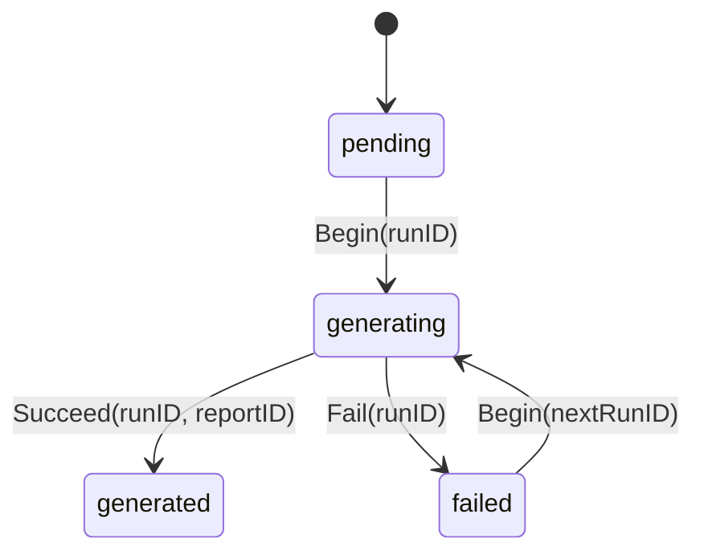
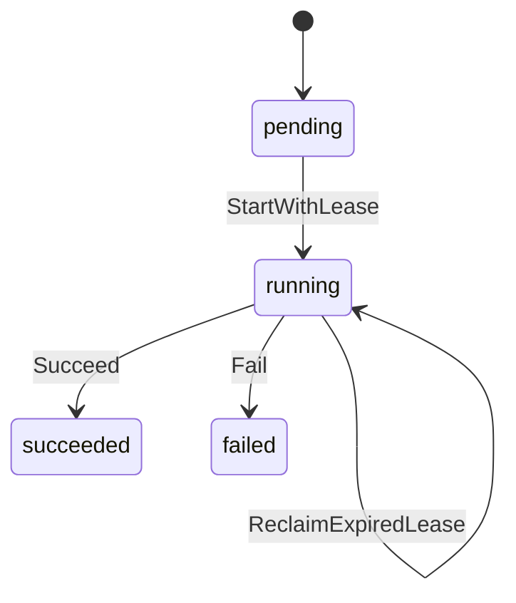
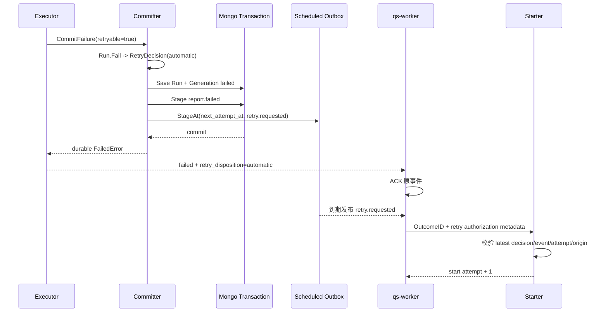

# 核心设计：状态、幂等、重试与可靠提交

> 状态：本文已按当前源码重写。Interpretation 的 Generation / Run 双状态机、业务重试决策、自动与人工重试授权、lease 恢复、MongoDB 可靠提交和 Worker 回执治理已经落地；文末会明确记录仍未闭环的设计问题。

## 1. 本文回答

本文集中回答一次报告生成在重复事件、并发 Worker、进程崩溃、Builder 失败、MongoDB 事务失败和重试次数耗尽时，系统如何保持事实一致：

1. 为什么需要 ReportGeneration 和 InterpretationRun 两个状态对象；
2. 同一个 Outcome 的重复事件为什么不会产生重复报告；
3. 并发 Worker 怎样竞争唯一执行权；
4. lease 过期为什么恢复原 attempt，而不是消耗一次业务重试；
5. `automatic`、`manual_required` 与 `terminal` 分别代表什么；
6. 自动重试、普通人工重试和强制重试怎样获得一次性授权；
7. Report、Generation、Run、Catalog 和 Outbox 怎样保证同成同败；
8. Worker 在什么情况下 ACK，什么情况下 NACK，为什么不能只看 `retryable`；
9. 运维人员如何判断一份尚未生成的报告当前停在哪一层。

本文不详细展开每个 Mongo collection 的字段和查询索引，那是下一篇《报告成品、版本与数据一致性》的主题。

## 2. 30 秒结论

Interpretation 把“一份报告”和“一次执行”分开治理：

```text
ReportGeneration
  key = OutcomeID + ReportType + TemplateVersion
  status = pending / generating / generated / failed
  latest_run_id
  report_id
  version                         Generation CAS
        │
        ├── InterpretationRun attempt=1
        │     status = pending / running / succeeded / failed
        │     lease / trace / failure / retry decision
        │
        ├── InterpretationRun attempt=2
        └── InterpretationRun attempt=N
```

它通过多层约束保护结果：

| 需要保护的事实 | 保护机制 |
| --- | --- |
| 一种报告生成意图只有一个 Generation | `(outcome_id, report_type, template_version)` 唯一索引 |
| 一个 Generation 的 attempt 不重复 | `(generation_id, attempt)` 唯一索引 |
| 一个 Generation 只有一个成功成品 | Artifact `generation_id` 唯一索引 |
| 并发状态迁移不互相覆盖 | Generation version CAS |
| 过期执行权不产生并发 Run | Run lease 原子 reclaim |
| 失败是否可以继续 | Run 上持久化 RetryDecision |
| 自动、人工和强制重试不可伪造 | EventID + ExpectedAttempt + Origin + ActionRequestID 授权 |
| 成功不会产生半成品 | Report + Catalog + Run + Generation + Outbox 同一 Mongo 事务 |
| 失败不会只写一半 | Run + Generation + failed/retry Outbox 同一 Mongo 事务 |
| 不确定基础设施错误不会误 ACK | 没有持久化 RetryDecision 时 Worker NACK |

最重要的语义是：

> `retryable` 只描述失败原因是否值得再次执行；真正决定下一步由系统、管理员还是无人继续处理的是持久化的 RetryDecision。

当前默认业务策略最多允许 3 个自动执行 attempt：第 1、2 次可重试失败会分别调度第 2、3 次；第 3 次可重试失败进入 `manual_required`。不可重试失败直接进入 `terminal`，但管理员可以通过高风险的 `force_retry` 明确授权一次执行。

## 3. 为什么需要双状态机

### 3.1 只保留 Report 状态会混淆三个问题

如果只用一个可变 Report 记录 `generating / failed / generated`，下面三个问题会被混在一起：

- 业务上到底要生成哪份报告；
- 当前第几次尝试、由谁执行、为什么失败；
- 哪一次成功执行产生了最终不可变成品。

一旦发生重试，旧失败会被新状态覆盖；一旦发生并发，无法区分两个 Worker 是否在处理同一 attempt；一旦报告成功，又难以判断成品应该保持不可变还是继续承担状态机职责。

### 3.2 ReportGeneration 管理生成意图

ReportGeneration 回答：

- 这份 Outcome 的这种 ReportType 和 TemplateVersion 是否已经请求过；
- 整体处于未开始、执行中、成功还是失败；
- 当前最新 Run 是哪一个；
- 成功成品 ReportID 是什么；
- 当前状态版本是多少。

它是报告写侧的聚合根，但不保存正文，也不保存每次失败详情。

### 3.3 InterpretationRun 管理一次执行尝试

InterpretationRun 回答：

- 这是第几个 attempt；
- 为什么产生这次 attempt；
- 谁持有当前 lease；
- trace id 是什么；
- 何时开始、何时结束；
- 失败属于哪一类，是否值得重试；
- 当前 RetryDecision 是自动、等待人工还是终态；
- 自动重试事件或人工治理请求是什么。

它不拥有 Report 内容，也不能修改 Evaluation Outcome。

### 3.4 InterpretReport 只表示成功成品

InterpretReport 只在成功事务中创建。失败、等待重试和执行中都不会制造一个“空报告”或“失败报告”。

因此三个对象的职责是：

| 对象 | 核心问题 | 是否可变 |
| --- | --- | --- |
| ReportGeneration | 这份报告意图现在怎样？ | 生命周期内可变，受 CAS 保护 |
| InterpretationRun | 这一次执行发生了什么？ | 从 pending 到 terminal，失败历史不被下一 attempt 覆盖 |
| InterpretReport | 哪次成功执行产生了什么成品？ | 创建后不可变 |

## 4. ReportGeneration 状态机

### 4.1 状态定义

| 状态 | 含义 | 引用约束 |
| --- | --- | --- |
| `pending` | Generation 已存在但尚未绑定 Run | LatestRunID、ReportID 均为空 |
| `generating` | 当前 Run 正在执行 | LatestRunID 必须存在，ReportID 为空 |
| `generated` | 成功成品已经可靠提交 | LatestRunID、ReportID 都必须存在 |
| `failed` | 最新 Run 已可靠提交失败 | LatestRunID 必须存在，ReportID 为空 |

当前初次 claim 会在同一事务中直接创建 `generating` Generation 和 `running` Run，因此正常生产链路很少长时间观察到 `pending`；该状态仍是完整领域模型的一部分，并服务恢复或测试边界。

### 4.2 合法迁移



以下迁移被领域方法拒绝：

- `generating -> generating` 再次 Begin；
- `generated -> generating` 重开同一版本报告；
- 非 LatestRun 结束 Generation；
- `generated` 缺少 ReportID；
- `failed` 仍携带 ReportID。

### 4.3 version CAS

Generation 每次迁移都会增加 version。Repository Save 要求：

```text
filter = domain_id + expected_version
update = new status + latest_run_id + report_id + new version
```

匹配不到唯一文档就返回 `ErrVersionConflict`，而不是 last-write-wins。Run 自身没有独立 version，但所有终态迁移与 Generation CAS 在同一 MongoDB 事务中完成，因此 Generation 是并发提交的总闸门。

## 5. InterpretationRun 状态机

### 5.1 状态定义

| 状态 | 执行事实 |
| --- | --- |
| `pending` | 尚未开始；没有 started、lease、finished 和 failure |
| `running` | 已开始；存在 started，生产 claim 还会存在 lease |
| `succeeded` | 已结束；存在 finished，没有 lease 和 failure |
| `failed` | 已结束；存在 finished、Failure 和 RetryDecision，没有 lease |

### 5.2 合法迁移



最后一条是执行权迁移，不是业务执行状态迁移：Run 仍然 running、attempt 不变，只更新 trace、lease 和 attempt origin。

### 5.3 attempt 与 origin

每个新业务执行尝试的 attempt 严格递增。当前 origin 包括：

| Origin | 含义 | 是否创建新 attempt |
| --- | --- | --- |
| `initial` | 初次生成 | 是，attempt 1 |
| `automatic` | 持久化策略自动授权的下一次执行 | 是 |
| `manual` | 管理员对 `manual_required` 授权 | 是 |
| `force` | 管理员对 `terminal` 强制授权 | 是 |
| `lease_recovery` | 原 Worker 丢失执行权后恢复同一次尝试 | 否 |

`manual` 和 `force` 并不直接修改报告或跳过 Builder，它们只允许创建一个正常的新 Run。

## 6. Generation 与 Run 的组合不变量

| Generation | Latest Run | 是否合理 | 说明 |
| --- | --- | --- | --- |
| pending | 无 | 是 | 尚未开始 |
| generating | running | 是 | 正常执行中 |
| generated | succeeded | 是 | ReportID 必须指向成功成品 |
| failed | failed | 是 | RetryDecision 必须可以解释下一步 |
| generating | failed | 否 | Generation 没有同步进入 failed |
| failed | running | 否 | 新 Run 已开始但 Generation 未同步进入 generating |
| generated | failed | 否 | 成品引用与最新尝试矛盾 |

Starter 和 Committer 使用 MongoDB 事务保护这些对象不会各写一半。运维查询如果观察到非法组合，应优先判断为事务外人工修改、历史数据迁移或实现缺陷，而不是通过盲目重试覆盖现场。

## 7. 五层幂等与并发约束

### 7.1 Generation 业务幂等

Generation Key 是：

```text
OutcomeID + ReportType + TemplateVersion
```

MongoDB 唯一索引 `uk_generation_key` 物理保护同一生成意图只有一个 Generation。

Audience 不进入 Key，因为当前系统先生成一份 canonical Report，患者、医生和管理员的差异在读取阶段投影。ModelCode 也不进入 Key，因为 Outcome 已经冻结了 ModelIdentity。

### 7.2 Run attempt 幂等

`uk_interpretation_run_generation_attempt(generation_id, attempt)` 防止并发 Worker 为同一次下一执行创建两个 Run。

attempt 是业务预算，不是消息投递次数。同一个 retry event 被重复投递，不应因此消耗多个业务 attempt。

### 7.3 Report 成品幂等

Artifact 的 `generation_id` 唯一，保证一个 Generation 最多只有一个成功成品。即使两个执行者在 lease 边界附近都完成 Build，成功事务也只能有一个提交者。

### 7.4 状态迁移 CAS

Generation version CAS 防止并发的 Succeed、Fail 或下一 attempt Begin 覆盖彼此。

### 7.5 重试授权幂等

下一 attempt 不是看到 `failed` 就能创建。Starter 还要求：

- latest Run 的 RetryDecision 已是 `automatic`；
- `next_attempt_at` 已到期；
- gRPC context 中存在授权；
- EventID 等于 Run 保存的 RetryEventID；
- ExpectedAttempt 等于 latest attempt；
- Origin 与 ActionRequestID 组合一致。

治理 Action 本身还使用 RequestID 做审计 claim：同一个 RequestID 重复调用会返回已完成结果或提示正在执行，不会重复授权。

## 8. Starter 如何决定本次调用

同一个 `Generate(outcome_id)` 调用可能得到四种开始结果：

| Starter 结果 | 含义 | Executor 行为 |
| --- | --- | --- |
| `started` | 本调用取得执行权 | 解析 Builder、Build、Commit |
| `processing` | 另一个调用持有 active lease | 不重复 Build，返回执行中 |
| `generated` | 幂等命中成功成品 | 直接返回已有 Report |
| `blocked` | failed Generation 尚未到期或没有匹配授权 | 不创建下一 Run |

### 8.1 Generation 不存在

Starter 创建：

```text
Generation pending -> generating
Run attempt=1 pending -> running with lease
```

Generation 与 Run 在同一 MongoDB 事务中 insert，避免只创建一个对象。

### 8.2 Generation 已 generated

Starter 按 Generation.ReportID 读取已有 InterpretReport，返回 `generated`。它不会重新执行 Builder，也不会创建新 Run。

如果 Generation 声称 generated 但 ReportID 对应成品不存在，Starter 返回一致性错误；不能把这种问题降级为“再生成一次”。

### 8.3 Generation 正在 generating

- latest Run 有 active lease：返回 `processing`；
- latest Run 是 running 且 lease 已过期：尝试原子 reclaim 同一 Run；
- latest Run 不是 running：返回不变量错误。

### 8.4 Generation 已 failed

只有持久化 RetryDecision 与当前调用授权完全匹配时，Starter 才创建 attempt + 1；否则返回 `blocked`。

这意味着重复的原始 `evaluation.outcome.committed` 事件不能绕过退避时间、自动额度或人工确认。

## 9. 并发 claim 怎样收敛

### 9.1 初次 claim

两个 Worker 可能同时发现 Generation 不存在。双方都尝试创建相同业务 Key，唯一索引只允许一个成功。失败方把 Generation duplicate 或 version conflict 视为 claim conflict，重新读取一次：

- 对方已经开始 -> `processing`；
- 对方已经完成 -> `generated`。

它不会创建第二个业务 attempt。

### 9.2 终态提交竞争

两个执行者即使都持有同一 Run 的内存副本，成功或失败提交仍要更新相同 Generation expected version。一个事务成功后，另一个事务的 CAS 或 Artifact unique constraint 失败并整体回滚。

### 9.3 自动重试事件重复投递

RetryEventID、ExpectedAttempt 与 latest Run decision 共同约束下一 attempt。第一个消费者成功创建 next Run 后：

- Generation 进入 generating；
- 重复消费者观察 active lease，返回 processing；
- 不会再消费一个业务 attempt。

当前实现仍有一个并发细节需要测试加固：`isClaimConflict` 显式识别 Generation duplicate/version conflict，但没有显式识别 Run `(generation_id, attempt)` duplicate。如果极端并发首先撞到 Run unique index，失败方可能先 NACK，再靠消息重投收敛，而不是立即返回 processing。安全性仍由唯一索引保护，但体验和噪声可以改进。

## 10. lease：执行权，不是重试次数

### 10.1 为什么需要 lease

Worker 在 Build 或提交前崩溃时，数据库里的 Run 仍可能是 running。如果没有 lease，系统无法判断：

- 原 Worker 仍在慢速执行；
- 原 Worker 已经永久退出；
- 是否可以让另一实例接管。

lease 给 running Run 一个有限执行权期限。当前 Interpretation 组合根使用 5 分钟 lease。

### 10.2 active lease

当 `lease_expires_at > now`：

- 重复调用返回 processing；
- 不重新 Build；
- 不创建新 Run；
- 不增加 attempt。

### 10.3 expired lease

Mongo Repository 使用条件更新原子 reclaim：

```text
WHERE domain_id = runID
  AND status = running
  AND lease_expires_at <= now

SET trace_id = newTrace
    lease_expires_at = now + leaseDuration
    attempt_origin = lease_recovery
```

只有一个恢复者能成功。失败者读取获胜后的 Run 并返回 processing。

### 10.4 为什么恢复同一个 attempt

进程崩溃、网络中断或 lease 过期表示执行权丢失，不等于业务内容已经确定性失败。若每次崩溃都创建 attempt + 1：

- 基础设施抖动会快速耗尽 3 次业务预算；
- 最终进入 manual_required，但 Builder 可能从未真正执行失败；
- 运维无法区分业务失败和执行载体故障。

当前实现保留同一个 attempt，只更新 lease 与 origin，正确区分了“业务重试”和“执行恢复”。

### 10.5 主动恢复调度

Interpretation lease recovery 已接入 Evaluation consistency reconcile 的 HA scheduler：

```text
定时扫描 expired running Run
  -> 找到 Generation
  -> 重新调用 Generate(OutcomeID)
  -> Starter 原子 reclaim 同一 Run
  -> 使用冻结 Outcome 重新 Build / Commit
```

生产配置当前为：

- reconcile interval：10 分钟；
- batch limit：100；
- 分布式锁 TTL：5 分钟；
- Interpretation Run lease：代码固定 5 分钟；
- `lease_reconcile_enabled=true`。

重复业务事件也可能触发过期 lease reclaim；scheduler 是没有新事件到来时的兜底恢复。

### 10.6 lease 恢复的当前审计缺口

Reclaim 会把 Run 的 `attempt_origin` 更新成 `lease_recovery`。如果该 Run 原本来自 manual 或 force，原始 origin 会被覆盖。当前仍可从前一 failed Run 的 ActionRequestID 和 retry event 追踪授权，但本 Run 自身不能同时表达“为什么创建”和“为什么被接管”。

更完整的模型可以拆成：

- `attempt_origin`：initial / automatic / manual / force，创建原因，不再修改；
- `claim_origin` 或 recovery history：记录一次或多次 lease reclaim。

## 11. Failure 与 RetryDecision

### 11.1 Failure 只保存安全、可分类原因

Run Failure 包含：

| 字段 | 用途 |
| --- | --- |
| Kind | input / template / build / timeout |
| Code | 稳定机器码 |
| SafeMessage | 可持久化、可对外展示的安全信息 |
| Retryable | 此失败原因是否值得再次执行 |

内部 error chain 留在日志和 trace 中，不直接写进业务记录，避免泄露配置、存储或依赖细节。

### 11.2 当前失败分类

| 场景 | Failure | Retryable | 初次失败后的决策 |
| --- | --- | --- | --- |
| 无法形成 AlgorithmFamily / DecisionKind | `input/unsupported_mechanism` | false | terminal |
| Registry 找不到 Builder | `template/builder_not_found` | false | terminal |
| Builder 返回 error | `build/build_failed` | true | 额度内 automatic |
| Builder 返回 nil Draft | `build/empty_draft` | true | 额度内 automatic |
| InterpretReport 不满足不变量 | `build/invalid_artifact` | false | terminal |
| Outcome / ReportInput 解码失败 | 当前未创建 Run Failure | — | 不确定错误，走传输重试 |
| Mongo 初始 claim 或终态事务失败 | 不保证形成 Run Failure | — | 不确定错误，走传输重试或 lease 恢复 |

`FailureKindTimeout` 已存在领域类型，但当前 lease recovery 不把过期 Run标记为 timeout failure，而是接管同一 attempt。

### 11.3 RetryDecision 是一次失败的持久化结论

Run.Fail 会使用当时的 BusinessPolicy 形成 Decision：

| 字段 | 含义 |
| --- | --- |
| Disposition | automatic / manual_required / terminal |
| Attempt | 当前失败 attempt |
| MaxAutomaticAttempts | 该次决策冻结的最大自动 attempt |
| RemainingAutomaticAttempts | 剩余自动额度 |
| NextAttemptAt | 自动重试最早时间 |
| PolicyVersion | 形成决策时的策略版本 |
| RetryEventID | 唯一授权事件 |
| ActionRequestID | 人工治理动作身份 |

后续修改进程配置不会反向改写已持久化 Decision。历史失败保留当时的 policy version 与最大次数快照。

## 12. 三种 Disposition

### 12.1 automatic

表示系统已经决定可以继续，并确定了 NextAttemptAt。它仍不意味着任意调用都能开始下一 Run，还必须消费匹配的 retry requested event。

默认策略下：

| 失败 attempt | Retryable | Decision | 下一步 |
| --- | --- | --- | --- |
| 1 | true | automatic | 30 秒后允许 attempt 2 |
| 2 | true | automatic | 60 秒后允许 attempt 3 |
| 3 | true | manual_required | 等待管理员 |

当前 business policy 的 max delay 为 5 分钟，硬上限禁止最大自动次数超过 3。

### 12.2 manual_required

表示失败原因仍可能通过再次执行恢复，但系统自动额度已经耗尽。此时：

- 不再自动创建 retry event；
- 重复 Outcome event 只得到 blocked；
- 治理工作台把 Generation 列入 Interpretation retry candidate；
- 管理员可执行 `interpretation.retry` 授权一次新 attempt。

人工重试不会重置自动预算。attempt 4 再次发生可重试失败，仍然是 manual_required，需要新的明确授权。

### 12.3 terminal

表示当前 Failure 被分类为不可重试，例如机制不支持、Builder 未注册或成品不满足领域不变量。系统不会自动重试，普通 `interpretation.retry` 也不能越过它。

管理员在修复配置或代码并确认风险后，可以使用 `interpretation.force_retry` 对 terminal Run 强制授权一次。这正是“`retryable=false` 禁止系统自动重试，但不永久禁止有审计的人工强制重试”的实现。

## 13. 自动重试链路

自动重试不是 Worker 看到 `Retryable=true` 后立即 NACK 原消息。真正链路是：



关键点：

- RetryDecision 与 retry event 在同一失败事务中形成；
- RetryEventID 回写到同一个 failed Run；
- Retry event 使用 scheduled outbox，在 NextAttemptAt 后才可发布；
- 原 Outcome event 在失败已经可靠分类后 ACK，避免传输重试与业务重试叠加；
- retry event 只“唤醒”Generation，不携带新的计算结果；
- 新 attempt 仍从持久化 Outcome 重建冻结 InterpretationInput。

## 14. 人工重试与强制重试

### 14.1 两个治理动作

| Action | 允许的当前状态 | 风险级别 | Origin |
| --- | --- | --- | --- |
| `interpretation.retry` | latest Decision = manual_required | medium | manual |
| `interpretation.force_retry` | latest Decision = terminal | high | force |

两者都要求：

- `confirm=true`；
- resource_id = GenerationID；
- expected_attempt；
- 非空 reason；
- 组织范围匹配；
- 治理能力授权；
- RequestID 幂等 claim 与终态审计。

### 14.2 为什么需要 ExpectedAttempt

运维人员看到 attempt 3 后准备重试，但在提交动作前可能已经有人处理了它。如果只按 GenerationID 授权，会把过期操作施加到新状态。

ExpectedAttempt 是乐观并发条件：只有 latest failed attempt 与页面看到的一致，操作才成功。

### 14.3 一次性授权如何形成

GovernedRetryService：

1. 读取 failed Generation；
2. 通过 Outcome 验证 OrgID；
3. 创建带 Origin、ExpectedAttempt、ActionRequestID 的 retry requested event；
4. Repository 按旧 disposition 条件更新 latest failed Run；
5. 将 disposition 临时改为 automatic；
6. 写入 NextAttemptAt、RetryEventID 和 ActionRequestID；
7. 同一 Mongo 事务 stage retry event。

Worker 消费后把这些字段放入内部 gRPC metadata，Starter 再次逐项核对。事件被消费并开始新 Run 后，旧授权不能再次创建另一个 attempt。

### 14.4 reason 与审计

Reason 不进入 RetryDecision 或 retry event 正文，而是作为治理 Action Input 进入统一 ActionAudit：

- RequestID；
- ActionID；
- OrgID；
- ActorUserID；
- 已脱敏 Input，其中包含 resource、expected attempt 和 reason；
- 开始与结束时间；
- 成功结果或错误。

ActionAudit 先 claim RequestID，执行后再写终态；主审计写入失败时还有恢复机制。这样人工操作不是一条无来源的消息。

## 15. 可靠成功提交

### 15.1 提交前准备副本

Committer 不直接修改调用方持有的 running Generation / Run，而是先 Restore 副本，再在副本上执行：

```text
Run.Succeed
Generation.Succeed
```

如果事务失败，调用方对象和数据库中仍保持 running，后续可以通过消息重投或 lease recovery 恢复，而不会留下“内存已成功、数据库未成功”的假象。

### 15.2 成功事务内容

一次 MongoDB 事务原子提交：

1. immutable InterpretReport；
2. report_query_catalog 当前来源投影；
3. InterpretationRun = succeeded；
4. ReportGeneration = generated + ReportID；
5. `interpretation.report.generated` durable Outbox event。

任一步失败都回滚全部写入。

### 15.3 关联一致性校验

事务前必须满足：

- Run.GenerationID = Generation.ID；
- Generation.LatestRunID = Run.ID；
- Report.GenerationID = Generation.ID；
- Report.InterpretationRunID = Run.ID；
- Report.OutcomeID = Generation.Key.OutcomeID；
- ReportType 和 TemplateVersion 与 Generation Key 一致；
- BuilderIdentity 与 ContentSchemaVersion 非空。

### 15.4 事务后派发

事务提交后，PostCommitDispatcher 可以加速事件派发；即使该即时派发失败，事件已经存在 durable outbox 中，Outbox relay 可以继续发布。

“事务提交成功”与“下游已经消费 generated event”是两个阶段，不能混写为一个原子操作。

## 16. 可靠失败提交

### 16.1 失败事务内容

一次 MongoDB 事务至少提交：

1. InterpretationRun = failed + safe Failure + RetryDecision；
2. ReportGeneration = failed；
3. `interpretation.report.failed` durable Outbox event。

若 Decision = automatic，还会在同一事务中：

4. 将 RetryEventID 附加到 Run；
5. 按 NextAttemptAt stage `interpretation.retry.requested`。

失败路径不创建 InterpretReport，不更新 report_query_catalog，也不修改 Evaluation Outcome。

### 16.2 为什么 failed 与 retry requested 都需要

- `interpretation.report.failed` 是“某次尝试已经失败”的终态事实；
- `interpretation.retry.requested` 是“下一次尝试已经获得授权并在指定时间可执行”的命令型事件。

一个记录已经发生的结果，一个驱动未来动作，不能用同一事件同时承担。

### 16.3 失败事务自身失败怎么办

如果 CommitFailure 的 MongoDB 事务失败：

- 数据库中的 Run 仍是 running；
- Generation 仍是 generating；
- 没有 durable Failure；
- 没有 RetryDecision；
- 没有 failed/retry outbox event；
- gRPC 返回未分类 internal failure；
- Worker NACK；
- 若即时重投观察到 active lease，可能先返回 processing；
- lease 到期后 scheduler 会 reclaim 原 attempt 再执行。

这条路径宁愿延迟恢复，也不把未落库的失败误认为已经受理。

## 17. 四层重试预算不能混为一谈

qs-server 当前至少存在四种不同预算：

| 层次 | 默认/生产上限 | 重试对象 | 耗尽后 |
| --- | --- | --- | --- |
| Interpretation 业务执行 | 3 attempts | Builder + Report 提交业务尝试 | manual_required |
| Mongo durable outbox 发布 | 30 attempts | 终态或 retry event 发布 | manual_required |
| 消息传输投递 | 8 deliveries | 队列消息到 Worker handler | transport dead letter |
| 暂停事件 hold replay 发布 | 30 attempts | held retry event 重新发布 | manual_required |

它们解决的问题不同：

- 业务 attempt 处理“报告能否生成”；
- Outbox attempt 处理“已提交事件能否发布”；
- Delivery attempt 处理“消息能否被消费者正确处理”；
- Hold replay attempt 处理“紧急暂停后能否恢复消息”。

不能因为队列已经投递 8 次，就认为 Builder 已执行 8 次；也不能因为业务进入 manual_required，就直接手工修改 Outbox 状态。

## 18. Worker ACK / NACK 语义

### 18.1 基本原则

> 只有下一步已经被持久化事实接管，Worker 才能 ACK；状态不确定时必须 NACK。

### 18.2 回执矩阵

| gRPC / handler 结果 | 持久化事实 | Worker settlement |
| --- | --- | --- |
| success + generated | Report 已提交或幂等命中 | ACK |
| success + processing | active lease 的 Run 存在 | ACK |
| success + blocked | failed decision 存在，但未获授权/未到期 | ACK |
| failed + automatic | Failure、Decision 和 scheduled retry event 已提交 | ACK |
| failed + manual_required | Failure 与人工待办已提交 | ACK |
| failed + terminal | Failure 终态已提交 | ACK |
| generic failed，无 RetryDisposition | 无法证明失败已可靠分类 | NACK |
| gRPC transport error | 远端状态不确定 | NACK |
| nil response / 未知 status | 协议不完整 | NACK |
| 事件解码失败 | 无法安全处理 | NACK，受传输上限保护 |

Worker 不从错误文本判断，也不再简单使用 `Retryable=true -> NACK`。只要 response 带有持久化的 `automatic / manual_required / terminal`，原事件就 ACK，后续由对应治理链负责。

### 18.3 为什么 blocked 也 ACK

blocked 表示系统已经知道 Generation 处于 failed，但当前调用没有合法的下一 attempt 授权。NACK 只会反复投递同一无权限事件，无法改变 decision。

正确做法是 ACK，并等待 scheduled retry event 或治理 Action。

## 19. 自动重试紧急开关与 durable hold

Worker 可以关闭 `automatic-retry-enabled`。关闭后只暂停 origin=automatic 的业务 retry event；manual 和 force 不受影响。

自动事件到达关闭中的 Worker 时：

```text
handler returns ErrAutomaticRetryPaused
  -> 将原消息持久化到 MySQL retry_event_hold
  -> hold 成功后 ACK 队列消息
  -> hold 失败则 NACK
```

hold 记录保存：

- event/message identity；
- org、provider、topic、channel；
- 原始 payload；
- 原投递次数；
- blocked reason/time；
- replay attempt、claim lease 和 retry disposition。

Worker 以自动重试启用状态启动时，会创建 hold replayer，把 blocked/failed 且到期的事件重新发布。重新发布失败使用独立的 hold replay policy；耗尽后进入 manual_required。

这使“紧急停自动重试”不是丢消息或无限 NACK，而是一个可观察、可恢复的持久化暂停状态。

## 20. 跨存储可靠性边界

EvaluationOutcome 存在 MySQL，Interpretation 生命周期和报告存在 MongoDB。系统不使用跨 MySQL + MongoDB 的分布式事务，而采用事实先后关系：

```text
MySQL transaction
  EvaluationOutcome + evaluation.outcome.committed outbox
        │
        ▼
Worker
        │ OutcomeID
        ▼
Mongo transaction
  Generation / Run / Report / Catalog / Interpretation outbox
```

因此 Interpretation 的可靠准入是“按 OutcomeID 读到已经提交的 EvaluationOutcome”，而不是依赖 Evaluation 的内存结果。

如果 Outcome event 重复发布，Generation Key 幂等收敛；如果事件先于 Outcome 可见，这属于 Evaluation 事务不变量破坏，而不是 Interpretation 应通过读取当前 Assessment 猜测补偿的问题。

## 21. 故障矩阵

| 故障点 | 已持久化状态 | 恢复路径 |
| --- | --- | --- |
| 读取 Outcome 失败 | 无新 Interpretation 事实 | Worker NACK，传输重投 |
| 解码冻结输入失败 | 无 Generation / Run | Worker NACK；当前缺少业务失败审计 |
| 初次 claim 事务失败 | Generation/Run 同成同败 | Worker NACK |
| Worker 在 claim 后、Build 前崩溃 | generating + running lease | lease 到期后原 attempt reclaim |
| Builder 可重试失败 | failed Run + automatic/manual decision | scheduled retry 或人工授权 |
| Builder 不可重试失败 | failed Run + terminal | 修复后 force retry |
| CommitSuccess 事务失败 | 仍是 generating/running | Worker NACK + lease recovery |
| CommitFailure 事务失败 | 仍是 generating/running | Worker NACK + lease recovery |
| 事务成功，PostCommit 派发失败 | durable outbox 已存在 | Outbox relay |
| Outbox 发布反复失败 | outbox retry decision | 30 次后人工治理 |
| Worker 自动重试开关关闭 | retry_event_hold | 重新启用后 replay |
| 消息 handler 持续失败 | delivery dead letter | 人工 replay delivery |

## 22. 运维观测与排查顺序

### 22.1 先判断业务层

```text
Generation 是否存在
  -> status / version / latest_run_id / report_id
  -> latest Run status / attempt / origin / lease
  -> failure / retry_disposition / next_attempt_at
  -> retry_event_id / action_request_id
```

### 22.2 再判断事件层

```text
interpretation.report.failed/generated 是否进入 Mongo outbox
  -> interpretation.retry.requested 是否 scheduled / pending / failed
  -> 是否进入 retry_event_hold
  -> 是否进入 transport dead letter
```

### 22.3 最后判断治理动作

```text
retry candidate 是否属于正确 Org
  -> resource_id 是否为 GenerationID
  -> expected_attempt 是否仍是 latest
  -> manual 还是 force
  -> Action RequestID / reason / audit result
```

治理工作台当前可以聚合：

- Interpretation automatic / manual_required / terminal；
- MySQL / Mongo Outbox automatic 与 manual_required；
- blocked retry events；
- transport dead letters；
- held automatic / held manual_required；
- 按组织范围分页的 RetryCandidate。

## 23. 当前设计问题与改进方向

### 23.1 输入解码失败没有 Run 证据

Outcome 与 ReportInput 的解码发生在 Starter 之前。格式错误会 NACK，但没有 Generation、Run、Failure 和 RetryDecision，运维只能依赖日志与 delivery dead letter。

需要设计一种“准入失败证据”，同时避免对不存在的 Outcome 或无效调用制造错误业务 Generation。

### 23.2 lease duration 硬编码，恢复间隔偏长

Run lease 当前在组合根固定为 5 分钟，生产 reconcile interval 为 10 分钟。没有重复事件时，崩溃 Run 的恢复延迟可能达到一个 lease 加一个扫描间隔量级。

建议将 lease 纳入系统治理配置，并明确：

- Builder 正常执行时长分布；
- lease 与 reconcile interval 的比例；
- expired lease 数量和恢复耗时指标；
- 是否需要 heartbeat 续租。

### 23.3 lease recovery 覆盖 attempt origin

当前 `attempt_origin=lease_recovery` 会覆盖 initial / automatic / manual / force。应把 attempt 创建原因与执行 claim/recovery 历史拆开。

### 23.4 Run duplicate 未完全纳入 claim conflict

极端并发下一 attempt 时，Run unique duplicate 可能先表现为 NACK，而不是 Starter 内部重读后返回 processing。应把 `interpretationrun.ErrAlreadyExists` 纳入 claim conflict，增加真实 Mongo 并发测试。

### 23.5 report.failed 事件没有 RetryDecision

当前 failed event 只有 `retryable`，没有 disposition、NextAttemptAt、RetryEventID 和 PolicyVersion。下游仅凭事件无法区分：

- 仍会自动重试；
- 已耗尽并等待人工；
- 已进入 terminal。

建议让失败事件携带安全的 RetryDecision 投影，避免下游重新查询或误判。

### 23.6 manual_required 没有投影为客户端可理解的失败状态

Worker 当前只在 `Retryable=false` 时把 report status 标记 failed。第 3 次可重试失败进入 manual_required 时，`Retryable` 仍为 true，因此 Redis report status 可能继续保持 processing，直到 TTL 或人工处理。

应明确客户端语义，例如：

- `waiting_manual_retry`；
- 或面向患者投影为暂时失败，面向运维保留 manual_required；
- 同时保证后续成功可以覆盖该中间状态。

### 23.7 Reason 只存在治理 ActionAudit

Run 保存 ActionRequestID，但不保存操作 reason。当前可以通过 ActionAudit 关联查询原因，但跨存储排查需要额外跳转。可以保持这一边界，也可以在 Run 保存受控、脱敏的 reason 摘要；无论选择哪种，都应形成明确契约。

### 23.8 terminal Force Retry 仍需配套修复证据

系统已经要求 confirm、reason、RequestID 和审计，但不会验证“代码或配置是否真的已经修复”。这是合理的通用平台边界，但运维流程应要求在 reason 或外部工单中关联修复证据，避免无意义地反复 force。

## 24. 必须保护的不变量

### 24.1 状态不变量

- Generation 是生成意图聚合根，Run 是执行尝试；
- generated Generation 必须引用 succeeded Run 与存在的 Report；
- failed Generation 必须引用 failed latest Run；
- 非 latest Run 不能结束 Generation；
- 一个 Run 只能从 running 进入一个 terminal 状态；
- 下一业务 attempt 只能从 failed latest Run 创建。

### 24.2 幂等不变量

- Generation Key 始终是 OutcomeID + ReportType + TemplateVersion；
- Audience 不进入写侧幂等键；
- `(generation_id, attempt)` 唯一；
- Artifact.GenerationID 唯一；
- Generation 状态更新必须经过 expected version CAS；
- 重复事件只能得到 generated、processing、blocked 或同一 next attempt。

### 24.3 重试不变量

- Retryable 不直接触发下一 attempt；
- RetryDecision 必须持久化；
- 自动重试必须绑定 RetryEventID 与 NextAttemptAt；
- manual 只授权 manual_required；
- force 只授权 terminal；
- 人工动作必须有 Org、ExpectedAttempt、RequestID、Reason 和审计；
- 人工执行不重置自动预算；
- lease recovery 不增加 attempt。

### 24.4 提交不变量

- 成功事务同时提交 Report、Catalog、Run、Generation 和 generated Outbox；
- 失败事务同时提交 Run、Generation 和 failed Outbox；
- automatic 失败还必须在同一事务写 RetryDecision 与 scheduled retry event；
- 事务失败不能污染调用方持有的 running 对象；
- PostCommit 加速失败不能影响已经成立的 durable outbox；
- Interpretation 失败不能修改 Evaluation Outcome 或 Assessment 结果。

### 24.5 settlement 不变量

- 已有持久化 disposition 的业务失败必须 ACK 原消息；
- 没有持久化分类的不确定错误必须 NACK；
- blocked 必须 ACK，等待合法授权；
- 暂停 automatic event 必须先 durable hold 再 ACK；
- delivery、outbox、business attempt 的预算不能互相替代。

## 25. 面试与设计追问

### 25.1 为什么需要 Generation 和 Run，不能只用一张表吗？

Generation 表示稳定的业务幂等意图，Run 表示可追加的执行历史。拆分后，一份报告可以有多个失败尝试但只有一个总体状态和一个成功成品；并发控制、失败审计与查询语义都更清晰。

### 25.2 为什么 `retryable=true` 后不直接让 Worker NACK？

NACK 是传输重投，无法表达业务退避、最大次数、人工接管和审计。系统先把失败与 RetryDecision 可靠提交，再通过 scheduled retry event 驱动下一 attempt；原消息因此可以 ACK。

### 25.3 为什么 lease recovery 不算一次重试？

它只说明执行者丢失，不说明业务逻辑失败。把基础设施故障计入业务 attempt 会错误耗尽预算。恢复同一 attempt，同时依靠冻结输入、Builder 确定性、Generation CAS 和 Artifact unique 保证安全。

### 25.4 `manual` 和 `force` 有什么区别？

manual 用于“仍可重试但自动次数耗尽”的 manual_required；force 用于“系统认为不可重试”的 terminal。force 风险更高，但两者都只授权一次正常执行，不直接篡改结果。

### 25.5 MongoDB 事务已经保证原子性，为什么还需要 Outbox？

MongoDB 事务只能保证本地 Report 状态和事件记录一起提交，不能保证事务提交瞬间消息队列可用。Outbox 把“必须发布的事件”变成本地 durable fact，之后可独立重试发布。

### 25.6 为什么不做 MySQL 和 MongoDB 分布式事务？

Evaluation 先在 MySQL 可靠提交 Outcome，Interpretation 以 OutcomeID 消费已成立事实，重复事件由 Generation Key 幂等收敛。这种事件驱动最终一致性已经能满足模块边界，不需要引入高成本的跨库两阶段提交。

### 25.7 为什么 terminal 还允许 force retry？

terminal 表示系统不应自动重复同样操作，不表示历史问题永远无法修复。修复配置或代码后，管理员可以通过确认、原因、组织权限、ExpectedAttempt 和审计明确承担这次例外执行。

## 26. 代码与验证入口

| 主题 | 代码入口 |
| --- | --- |
| Generation 状态机 | [`domain/interpretation/generation`](../../../internal/apiserver/domain/interpretation/generation/) |
| Run、Failure 与 RetryDecision | [`domain/interpretation/run`](../../../internal/apiserver/domain/interpretation/run/) |
| claim、幂等与 lease | [`application/interpretation/automation/execution/starter.go`](../../../internal/apiserver/application/interpretation/automation/execution/starter.go) |
| Builder 执行与失败分类 | [`application/interpretation/automation/execution/executor.go`](../../../internal/apiserver/application/interpretation/automation/execution/executor.go) |
| 成功/失败可靠提交 | [`application/interpretation/automation/execution/committer.go`](../../../internal/apiserver/application/interpretation/automation/execution/committer.go) |
| 自动、人工与强制重试 | [`application/interpretation/automation/retry_governance.go`](../../../internal/apiserver/application/interpretation/automation/retry_governance.go) |
| lease reconcile | [`application/interpretation/automation/lease_recovery.go`](../../../internal/apiserver/application/interpretation/automation/lease_recovery.go) |
| 共享重试策略 | [`pkg/retrygovernance`](../../../internal/pkg/retrygovernance/) |
| Mongo lifecycle repository | [`infra/mongo/interpretation/lifecycle_repo.go`](../../../internal/apiserver/infra/mongo/interpretation/lifecycle_repo.go) |
| Worker report handlers | [`worker/handlers/report_handler.go`](../../../internal/worker/handlers/report_handler.go) |
| Worker response settlement | [`worker/handlers/evaluation_response.go`](../../../internal/worker/handlers/evaluation_response.go) |
| paused retry hold | [`worker/integration/messaging/retry_hold.go`](../../../internal/worker/integration/messaging/retry_hold.go) |
| gRPC retry authorization | [`transport/grpc/service/retry_authorization.go`](../../../internal/apiserver/transport/grpc/service/retry_authorization.go) |
| 系统治理动作 | [`application/systemgovernance/action_registry.go`](../../../internal/apiserver/application/systemgovernance/action_registry.go)、[`action_executor.go`](../../../internal/apiserver/application/systemgovernance/action_executor.go) |
| 运行配置 | [`configs/apiserver.prod.yaml`](../../../configs/apiserver.prod.yaml)、[`configs/worker.prod.yaml`](../../../configs/worker.prod.yaml) |

```bash
go test ./internal/apiserver/domain/interpretation/generation
go test ./internal/apiserver/domain/interpretation/run
go test ./internal/apiserver/application/interpretation/automation/...
go test ./internal/apiserver/infra/mongo/interpretation
go test ./internal/pkg/retrygovernance
go test ./internal/apiserver/application/systemgovernance
go test ./internal/worker/handlers ./internal/worker/integration/messaging
```
