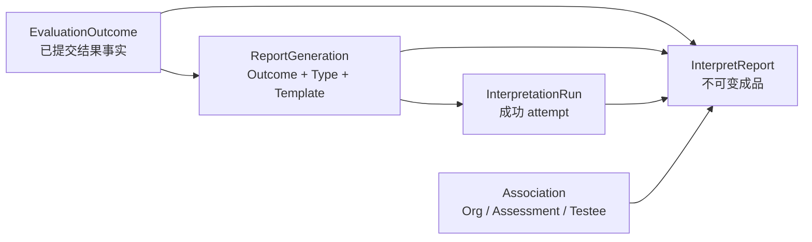
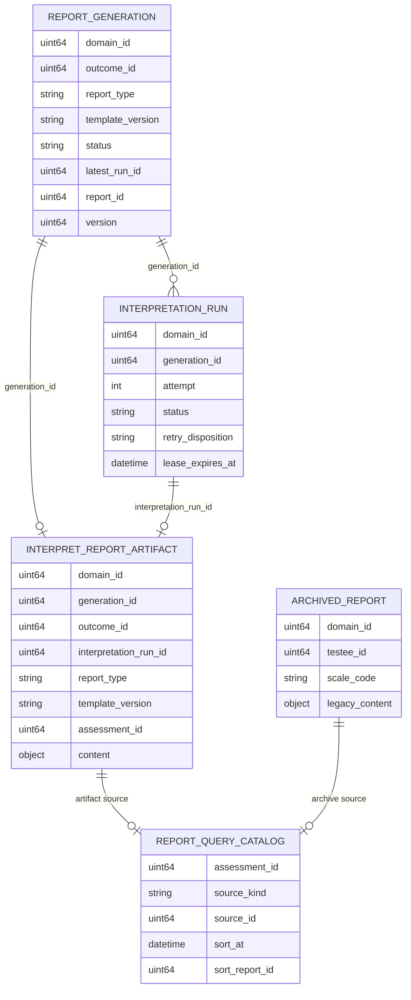
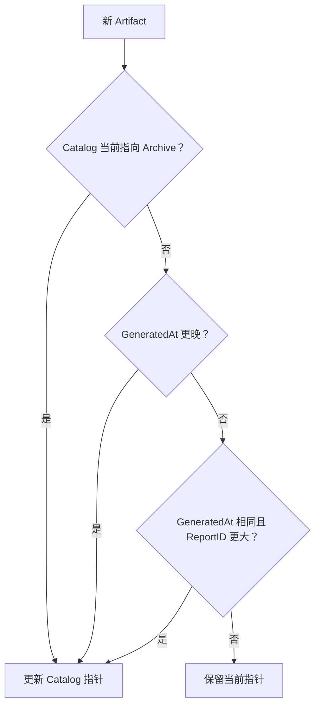
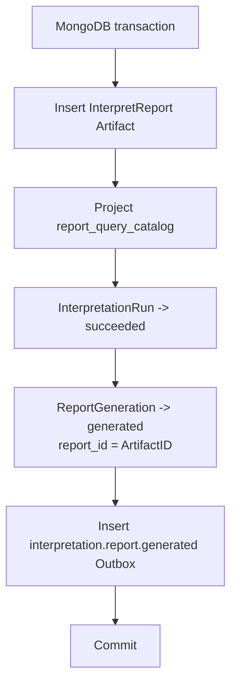

# 核心设计：报告成品、版本与数据一致性

> 状态：本文已按当前源码重写。InterpretReport 不可变成品、Generation / Run / Artifact 关系、成功事务、`report_query_catalog` 当前报告选择和 `archived_reports` 历史兼容已落地；报告模板版本发布、成品自描述与多报告版本查询仍有设计缺口。

## 1. 本文回答

本文聚焦报告已经构建完成之后，Interpretation 如何把它保存为可信的历史业务成品：

1. 为什么不能用一个可变 Report 同时表示生成中、失败和成功；
2. InterpretReport 成品必须固化哪些内容和来源信息；
3. Outcome 版本、Model 版本、TemplateVersion 和报告内容结构版本有什么区别；
4. 同一 Outcome 的新模板报告如何与历史报告并存；
5. MongoDB 中 Generation、Run、Artifact、Catalog 和 Archive 各自保存什么；
6. 在 MongoDB 没有外键的前提下，系统怎样保护这些数据关系；
7. `report_query_catalog` 为什么存在，它怎样决定一个 Assessment 的“当前报告”；
8. 新 Artifact 与历史 Archive 如何共用一条查询链路；
9. 存储、迁移和查询契约目前还有哪些不一致。

本文不再展开重试策略、lease 和 Worker ACK / NACK 语义，这些已在[《状态、幂等、重试与可靠提交》](./22-核心设计-状态、幂等、重试与可靠提交.md)中讲解。查询授权与 Audience 投影将在下一篇详细分析。

## 2. 30 秒结论

Interpretation 的存储设计不是“将报告 JSON 放进 MongoDB”，而是把生成意图、执行证据、成功成品和查询索引分开：

```text
ReportGeneration                    生成意图与总体状态
  └─ InterpretationRun 1..N         每次执行尝试与失败证据
       └─ InterpretReport 0..1       某次成功尝试产生的不可变成品
              └─ report_query_catalog 当前可查正文的物化索引

archived_reports                    旧模型留下的历史报告正文
       └─ report_query_catalog       与新 Artifact 共用当前查询入口
```

核心语义是：

> Generation 和 Run 可以随执行推进；InterpretReport 只在成功事务中出现，一旦生成就不应修改。运营发布新模型、新解释文案或新报告模板，不得改写已完成测评的历史报告。

当前实现已经能保证：

- 一个 Generation 最多只有一份 Artifact；
- Artifact、Catalog、Run 成功、Generation 成功和 generated Outbox 在同一 MongoDB 事务中同成同败；
- 新 Artifact 总是可以代替同 Assessment 的 Archive 成为当前查询源；
- 多个 Artifact 竞争时，按 `GeneratedAt` 与 ReportID 稳定选出当前正文；
- Catalog 指向的正文缺失时，查询显式报一致性错误，不会静默吞掉。

但要注意：Artifact 层面已具备多 ReportType / TemplateVersion 并存的身份骨架，而当前 Catalog 每个 Assessment 只保留一个“当前正文”指针。因此，“可以存下多版”不等于“已经可以按版本查询和切换多版”。

## 3. 为什么 Report 必须是成功成品

### 3.1 失败是 Run 事实，不是 Report 内容

旧式设计容易让一条 Report 文档同时承担：

- 报告正在生成；
- 生成到第几次；
- 生成为什么失败；
- 是否应该重试；
- 报告最终内容是什么。

这会让生命周期状态与业务成品糊在一起。重试会覆盖旧失败，失败会留下没有正文的“报告”，查询端还必须理解生成状态。

当前模型将这些事实彻底分开：

| 对象 | 保存什么 | 是否是报告正文 |
| --- | --- | --- |
| ReportGeneration | 生成意图、总体状态、LatestRunID、ReportID | 否 |
| InterpretationRun | attempt、lease、trace、Failure、RetryDecision | 否 |
| Report Draft | Builder 在内存中的构建结果 | 否，尚未可信提交 |
| InterpretReport | 已提交的来源身份、关联事实和报告内容 | 是 |

### 3.2 不可变是业务语义，不只是缺少 Update 方法

InterpretReport 的领域对象只提供 getter，Repository 只提供 Insert 和读取，没有成品 Update 语义。`Content` 进入构造器和通过 getter 返回时，都会复制切片、指针与嵌套结构，避免调用方修改共享内存后篡改成品。

但“不可变”更重要的是业务含义：

- 报告是医生判断、治疗观察和随访的历史辅助信息；
- 用户之后看到的历史报告，必须与当时生成时的模型、因子、常模和解释语义一致；
- 运营发布新版本时，不能让过去已经成立的结论“漂移”；
- 如果必须使用新模板重新生成，应创建新的版本成品，而不是覆盖旧成品。

### 3.3 “当前报告”与“历史报告”必须分开

Artifact 是不可变历史事实，Catalog 是可变的当前选择。新成品出现时，可以更新 Catalog 指针，但不应修改旧 Artifact。

这一分离把两个问题拆开：

1. 历史上生成过什么；
2. 今天按当前业务规则默认展示什么。

当前 Catalog 的答案是“默认展示最新 Artifact，没有 Artifact 时显示 Archive”。这是当前实现策略，不应被误解为一切未来 ReportType 和 TemplateVersion 的最终领域规则。

## 4. InterpretReport 的身份与来源链

### 4.1 成品必须回答“谁产生了什么”

当前 InterpretReport 固化了：

| 字段 | 回答的问题 |
| --- | --- |
| ReportID | 这份成品的唯一身份是什么 |
| GenerationID | 它属于哪个生成意图 |
| OutcomeID | 它解释哪个已提交测评结果 |
| InterpretationRunID | 哪一次执行尝试产生了它 |
| ReportType | 它是哪种报告产品 |
| TemplateVersion | 使用哪个报告模板发布版本 |
| OrgID / AssessmentID / TesteeID | 它与哪个机构、测评和受试者相关 |
| GeneratedAt | 这份成品在什么时间成立 |
| Content | 生成当时的完整报告内容 |

其关系可以表示为：



MongoDB 不使用 DBRef 或外键；图中箭头表示业务身份关系，由领域校验、唯一索引、CAS 和事务联合保护。

### 4.2 Association 是冻结关联，不是授权

Artifact 把 `OrgID + AssessmentID + TesteeID` 从 Outcome 的关联事实中复制过来，用于：

- 定位报告对应的测评和受试者；
- 避免列表查询时回到 Evaluation 联表；
- 为 Catalog 投影提供组织和受试者维度；
- 保留报告生成当时的归属证据。

但 Association 不是“拥有这三个 ID 就能读取报告”。行为人身份、机构边界、医生照护关系与受试者归属仍需要在应用服务中先完成授权。

### 4.3 Content 是自包含正文

当前 `Content` 包含：

| 内容 | 语义 |
| --- | --- |
| Model | 报告所属的模型身份、发布版本和运行机制 |
| PrimaryScore | 报告主分数，含 kind、value、label 和可选 max |
| Level | 结果等级的 code、label 和 severity |
| Conclusion | 整体结论文案 |
| Dimensions | 因子、维度或任务结果的分数、等级、常模引用和解读 |
| Suggestions | 结构化建议，可以关联具体 FactorCode |
| ModelExtra | 人格类型、匹配度、稀有度等机制特有成品数据 |

这些是生成当时已选定的报告事实，读取时不应再回到当前 ModelCatalog 获取结论或建议。否则新版解释资产会修改历史报告。

## 5. 报告中同时存在哪些版本

“报告版本”容易被用成一个模糊概念。对 qs-server 而言，至少要区分四条独立的版本轴：

| 版本轴 | 所有者 | 回答的问题 | 当前固化位置 |
| --- | --- | --- | --- |
| Questionnaire Version | Survey | 当时用户回答的题目和选项是哪一版 | AnswerSheet / Evaluation 冻结链路 |
| AssessmentModel Version | ModelCatalog | 使用哪版 Factor、Norm、Decision 产生 Outcome | Outcome 的 ModelIdentity 与冻结输入 |
| TemplateVersion | Interpretation | 使用哪版报告模板和解释规则构建成品 | Generation Key 与 InterpretReport |
| ContentSchemaVersion | Interpretation | 报告内容契约按哪种结构解码 | 当前仅进入 generated event，未进入 Artifact |

BuilderIdentity 不是又一个业务版本，它是“哪个生成机制实现了这份成品”的可追溯身份。当前 BuilderIdentity 也只进入 generated event 和日志，没有存入 InterpretReport。

### 5.1 Model Version 决定“结果为什么”

AssessmentModel 版本决定因子、常模、Decision 和执行路由，最终产生不可变 Outcome。Interpretation 不应通过切换报告模板改变主分数、等级或类型结论。

### 5.2 TemplateVersion 决定“同一结果如何被表达”

TemplateVersion 的设计注释将它定义为一个不可变发布单元，包含：

- 模板内容；
- Builder 行为；
- 解释规则；
- 报告内容结构契约。

因此 TemplateVersion 不应只是一个缓存 key，而应该代表“可重现的报告发布版本”。

当前现实是：

- `TemplateVersion` 已经进入 Generation 业务唯一键；
- InterpretReport 已经持久化 `TemplateVersion`；
- 默认生产适配器仍统一填写 `legacy-v1`；
- ModelCatalog 尚未将报告模板作为可发布资产输出；
- Registry 中当前没有实际运营多个 TemplateVersion 的完整路由。

所以准确表述是：

> 当前已经建立 TemplateVersion 的身份、幂等和持久化骨架，但还没有建成可由运营发布、路由、回滚和审计的模板资产体系。

### 5.3 ContentSchemaVersion 决定“读取端如何理解内容”

字段增加、字段语义改变、某个可选字段变为必填，都不应只靠代码版本猜测。一份长期保存的报告成品应该明确声明其内容 schema。

当前 Committer 要求 Builder 提供 ContentSchemaVersion，并把它放入 `interpretation.report.generated` 事件，但 Artifact 本体没有该字段。如果事件过期或不在线，单独拿到 MongoDB 文档的消费者无法确定它应按哪个内容契约解析。这是当前成品自描述能力的明确缺口。

## 6. 新模板发布时怎样保护历史报告

假设 Outcome `O-100` 已经使用 `standard + legacy-v1` 生成报告 `R-1`：

```text
Generation G-1
  key = O-100 + standard + legacy-v1
  report_id = R-1
```

如果未来发布 `standard + report-v2`，正确语义不是更新 `R-1`，而是：

```text
Generation G-1                    Generation G-2
  O-100 + standard + legacy-v1      O-100 + standard + report-v2
  report_id = R-1                   report_id = R-2

Artifact R-1                      Artifact R-2
  template = legacy-v1              template = report-v2
  immutable                         immutable
```

这种并存模式提供了：

- 历史报告追溯；
- 新模板灰度和对比；
- 在不重算 Outcome 的前提下重新生成表达层；
- 明确区分“结果变了”和“报告表达变了”。

但当前只完成了写侧身份骨架。Catalog 每个 Assessment 只能选一个 SourceID，并且根据生成时间自动选择。它不能回答：

- 指定 TemplateVersion 的报告是哪份；
- 运营希望把哪一版设为当前版；
- 患者报告与医生报告是否要同时存在；
- 某一版报告是否已被撤回或停用；
- 按版本对比两份报告时如何加载。

这是未来真正引入多 TemplateVersion 前必须先解决的读模型问题。

## 7. MongoDB 存储拓扑

### 7.1 五个集合不是五个对等聚合



| Collection | 角色 | 是否当前写模型 | 是否保存正文 |
| --- | --- | --- | --- |
| `report_generations` | ReportGeneration 聚合 | 是 | 否 |
| `interpretation_runs` | InterpretationRun 执行记录 | 是 | 否 |
| `interpret_report_artifacts` | InterpretReport 不可变成品 | 是 | 是 |
| `report_query_catalog` | Assessment 级当前报告物化索引 | 是，但不是聚合 | 否 |
| `archived_reports` | 旧模型历史报告 | 仅兼容读取 | 是 |

`report_query_catalog` 的价值是统一选择和查询，不是复制报告全文。它只保存列表筛选和定位正文需要的紧凑字段。

### 7.2 为什么报告使用 MongoDB 文档

报告正文是一个典型的嵌套且按测评机制扩展的成品：

- 维度数量不固定；
- 每个维度可以有原始分、派生分、等级和常模引用；
- 建议可以是整体级或因子级；
- 人格类模型还有 ModelExtra 等机制特有数据；
- 历史文档需要容忍新旧字段并存。

MongoDB 允许一份报告作为一个自包含文档读取，避免为报告展示临时联结大量明细表。但文档库只解决了结构容纳问题，没有自动解决版本契约和跨文档一致性，这些仍需要应用设计保护。

## 8. Artifact 的存储契约和索引

### 8.1 同时保留新结构与兼容摘要

`InterpretReportPO` 一方面保存新的结构化内容：

- `model`；
- `primary_score`；
- `level`；
- 带 `score / derived_scores / level / norm_reference` 的 dimensions；
- suggestions 和 model_extra。

另一方面仍冗余保存：

- `scale_name / scale_code`；
- `total_score`；
- 可识别的 `risk_level`。

映射器会用 Model 补齐 Scale 摘要，用 PrimaryScore 补齐 TotalScore，并仅在 Level severity 属于 `none / low / medium / high / severe` 时写入 RiskLevel。

这样做的目的是让新 Artifact 能被当前兼容读模型读取，并支持 Catalog 按 model code 和 risk level 筛选。代价是同一语义在文档中有两份表达，映射规则成为必须长期测试的一致性边界。

### 8.2 主要物理约束

| 索引 | 约束或查询用途 |
| --- | --- |
| `uk_artifact_domain_id(domain_id)` | ReportID 全局唯一 |
| `uk_artifact_generation_id(generation_id)` | 一个 Generation 最多一份成功成品 |
| `outcome_id + report_type + template_version` | 按结果与报告版本查找成品 |
| `assessment_id + generated_at desc` | 按测评查看报告历史 |
| `testee_id + generated_at desc` | 按受试者查看报告历史 |

`outcome_id + report_type + template_version` 在 Artifact 集合上不是唯一索引，但它已经间接受两层唯一约束保护：

1. Generation 对该业务 Key 唯一；
2. Artifact 对 GenerationID 唯一。

因此当前安全性不依赖 Artifact 上的第三个唯一索引。

## 9. Catalog 是怎样选出当前报告的

### 9.1 为什么不直接扫描两个正文集合

如果每次列表查询都同时扫描 `interpret_report_artifacts` 和 `archived_reports`，再在内存中按 Assessment 去重，会带来：

- 新旧数据模型的分页难以稳定；
- count 与 page 可能使用不同的去重结果；
- 列表筛选必须加载大量正文；
- 每个上层消费者都会重复实现“新报告覆盖旧报告”规则；
- 历史数据量增长后，查询成本与正文大小直接绑定。

`report_query_catalog` 把“当前正文选择”预先投影为每个 Assessment 一行，列表先在小索引上筛选和分页，只批量加载当前页面所需的 Artifact 或 Archive 正文。

### 9.2 Catalog 中的数据

| 字段 | 用途 |
| --- | --- |
| AssessmentID | 当前唯一业务键 |
| OrgID / TesteeID | 机构和受试者筛选 |
| SourceKind | 正文来自 `artifact` 还是 `archive` |
| SourceID | 被选中正文的 ID |
| ModelCode | 按测评模型筛选 |
| RiskLevel | 按风险等级或高风险筛选 |
| SortAt | 列表时间排序和当前版竞争 |
| SortReportID | 同时间下的稳定破平局字段 |

Catalog 不保存 Conclusion、Dimensions 和 Suggestions。它也不保存 GenerationID、OutcomeID、ReportType 和 TemplateVersion。后四者的缺失直接导致当前读模型无法按报告类型和版本选择成品。

### 9.3 当前选择规则

新 Artifact 提交时，Catalog projector 仅在以下情况更新该 Assessment：

1. 当前指向 Archive；
2. 新 Artifact 的 GeneratedAt 更晚；
3. GeneratedAt 相同，但新 ReportID 更大。



并发 projector 可能在 upsert 时遇到 Assessment 唯一键冲突。如果冲突意味着更新的 Artifact 已经获胜，当前实现将 duplicate key 视为成功收敛，不会用旧数据反向覆盖。

### 9.4 Catalog 查询路径

```text
ReportFilter
  -> report_query_catalog count + sort + page
  -> 按 source_kind 分组 SourceID
  -> 批量加载当前页 Artifact / Archive
  -> 按 Catalog 原顺序组装 ReportRow
```

列表排序是：

```text
sort_at desc, sort_report_id desc, assessment_id desc
```

它为分页提供了确定性。Catalog 唯一索引与主要查询索引包括：

- `assessment_id` 唯一；
- `org_id + sort_at + assessment_id`；
- `testee_id + sort_at + assessment_id`；
- org / testee 分别与 model_code / risk_level / sort_at 的组合索引。

## 10. Archive 如何与新 Artifact 兼容

### 10.1 Archive 是历史数据形状，不是新生命周期模型

`ArchivedReportPO` 仍然保留旧字段：

- status、attempt、failure_reason；
- generating_at、generated_at、failed_at；
- scale_name、scale_code、total_score、risk_level；
- 历史 dimensions、suggestions 和 model_extra。

这些字段反映旧版 Report 曾经同时承担状态和正文。当前新生命周期已经使用 Generation / Run / Artifact，因此 Archive 上的 status 和 attempt 只能当作历史字段，不应继续用它们推动当前报告重试。

### 10.2 兼容映射规则

读模型会将新 Artifact 先映射为一个内存中的 Archive 兼容形状，再复用同一套 `ReportRow` 投影。对真实 Archive，它还会做以下兼容恢复：

- 缺少 Model 时，从 scale code / name 构造 scale 身份；
- 根据旧字段推导 ProductChannel 和 AlgorithmFamily；
- 缺少 PrimaryScore 时，从 TotalScore 构造 `raw_total`；
- 缺少 Level 时，从可识别 risk severity 恢复等级；
- 人格类历史数据可以从 ModelExtra 的 type code 恢复类型等级。

这套兼容层让 API 不需要同时暴露新旧两种报告 DTO，但它本质上包含“从历史摘要推测新语义”。推测值不应被当成当时真实存储的完整来源证据。

### 10.3 Artifact 永远优先于 Archive

同一 Assessment 既有 Archive 又有新 Artifact 时，Catalog 投影规则无条件允许 Artifact 替换 Archive。原因是：

- Artifact 具有新生命周期的 Generation / Run 来源链；
- Artifact 在成功事务中与 Catalog 和 Outbox 一起提交；
- Archive 是兼容数据，不应覆盖新可信事实。

这只表示默认查询选择，Archive 正文本身不会因为新 Artifact 出现而被删除。

## 11. 没有 MongoDB 外键，一致性如何建立

MongoDB 不会自动保证 GenerationID、RunID、ReportID 和 Catalog SourceID 所指文档存在。qs-server 使用分层防线建立应用级一致性：

| 防线 | 解决的问题 |
| --- | --- |
| 领域构造器与 Restore | 拒绝缺少必要 ID、Association、ReportType、TemplateVersion 和时间的对象 |
| Generation / Run 状态不变量 | 拒绝 generated 缺失 ReportID、Run 引用错位等非法组合 |
| MongoDB 唯一索引 | 防止重复 Generation、attempt 和 Generation 成品 |
| Generation version CAS | 防止并发状态提交互相覆盖 |
| MongoDB 事务 | 保证成品、状态、Catalog 和 Outbox 同成同败 |
| Catalog 原子选择条件 | 防止旧 Artifact 覆盖新 Artifact，防止 Archive 覆盖 Artifact |
| 读模型悬空检测 | Catalog 指向缺失正文时显式报错 |
| Backfill / Verify 工具 | 迁移历史数据，发现缺失 Catalog 和悬空 Source |

没有任何一层可以单独代替其他层。例如，唯一索引能防重，但不能保证 Artifact 插入后 Generation 一定成功；事务能保证一次提交原子性，但不能自动修复事务引入前的历史数据。

## 12. 成功提交的事务边界

Builder 生成 Draft 之后，Executor 先构造 InterpretReport，再交给 Committer。成功 Commit 在一个 MongoDB 事务中执行：



这一事务保证了：

- 不会有 Artifact 已经可查，Generation 仍显示 generating；
- 不会有 Generation 显示 generated，ReportID 却不存在；
- 不会有成品已生成，Catalog 仍然因为本次提交漏写；
- 不会有事件已发布，但报告成品未提交；
- 不会有成品已提交，但 generated 事件没有可以之后投递的 Outbox 记录。

这个边界依赖 MongoDB transaction，因而运行环境必须是 Replica Set。“单节点 Replica Set”可以支持事务，“普通 standalone 单节点”不可以。

## 13. 一致性故障应该怎样被理解

| 现象 | 说明 | 正确处置方向 |
| --- | --- | --- |
| Generation=generated，ReportID 不存在 | 生命周期与成品断裂 | 保留现场、查迁移或人工写入，不要盲目重生成 |
| Artifact 存在，Generation 仍 generating | 成功事务被绕过或历史数据不完整 | 核对 Run、Outbox 和事务记录 |
| Generation 存在两份同业务 Key | 唯一索引缺失或迁移异常 | 先修复数据再建索引，不可任意删除 |
| Catalog 指向不存在的 SourceID | 物化索引悬空 | 读模型返回 CatalogDanglingSourceError，运行 verify 定位 |
| Catalog 仍指 Archive，但新 Artifact 已存在 | 历史投影漏失或成功路径曾经绕过 projector | 运行 artifact backfill / verify |
| Catalog 指向较旧 Artifact | 时间或竞争策略未收敛 | 按 GeneratedAt + ReportID 重建，同时检查时钟与历史写入 |
| 报告正文可读，但无法识别 schema | Artifact 缺少 ContentSchemaVersion | 不要根据数据形状静默猜测，应补成品元数据 |
| Archive 投影出新 Level，但原文档没有 Level | 兼容层根据 risk 或 type 推测 | 对外可兼容显示，审计时要区分原始事实与推导值 |

关键原则是：

> 一致性错误不是普通的“报告未生成”。系统应该保留可观测证据并显式告警，不能用新一次生成静默覆盖原有矛盾。

## 14. Catalog 历史数据处置

Catalog 是由 Archive 或 Artifact 投影得到的读模型。新成功事务会在提交 Artifact 时同步更新 Catalog，current-only 路径不依赖历史回填脚本。

原有 Catalog 单次回填工具已经退役。当前维护窗口采用“删除不兼容的历史测评事实，再由新链路生成新报告”的策略，因此不能再把 Archive、Artifact 或 Catalog 单独回填到新的事实层：

- 删除历史报告时，Archive、Artifact、Generation、Run 与 Catalog 必须按同一 Assessment 范围成组清理；
- `interpretation_report_templates` 属于配置资产，不能随报告事实删除；
- 清理后只通过新的 Outcome → Interpretation 成功事务创建 Artifact 和 Catalog；
- 如果未来重新提出“保留历史报告并迁移”的要求，应按当时 schema 单独设计迁移和对账工具，不能从 Git 历史直接恢复旧脚本执行。

## 15. 当前迁移事实与文档漂移

当前仓库同时存在新旧命名，不能只根据最早的 migration 猜测生产集合：

- 当前 Runtime Repository 读取 `archived_reports`；
- 新成品写入 `interpret_report_artifacts`；
- 当前查询先读 `report_query_catalog`；
- `000011_add_interpretation_lifecycle_collections` 创建 Generation、Run 和 Artifact 集合及索引；
- 该 migration 没有创建 `report_query_catalog`，Catalog collection 和索引目前主要由 Runtime projector 初始化时创建；
- 早期 `000001` 和部分索引脚本仍然引用 `interpret_reports`；
- 当前仓库中没有可以明确证明 `interpret_reports -> archived_reports` 重命名或数据迁移的 migration。

因此，不能在运维文档中简单写成“所有历史 `interpret_reports` 已自动迁入 Archive”。更准确的结论是：

> 当前代码已以 `archived_reports + interpret_report_artifacts + report_query_catalog` 作为读取事实，但 migration README、部分旧脚本和集合演进记录尚未完全闭环。

在新环境初始化或旧环境升级前，必须通过实际数据库列表、数量对账和 backfill verify 确认真实状态，不能只看代码类名。

## 16. 当前设计缺口

### 16.1 Artifact 构造器没有验证正文完整性

`NewInterpretReport` 已经检查 ReportID、GenerationID、OutcomeID、RunID、Association、ReportType、TemplateVersion 和 GeneratedAt，但它没有检查：

- Model identity 是否完整；
- PrimaryScore 或 Level 是否符合报告机制的必填契约；
- Conclusion、Dimensions 和 Suggestions 是否允许全部为空；
- ModelExtra 与 Model kind 是否匹配。

因此当前一个来源身份完整、但 `Content{}` 全空的 Artifact 在领域构造阶段仍可以通过。Builder 正常实现会构建内容，但聚合边界没有最后一层保护。

后续应先定义一个跨机制的最小成品契约，再将机制特定校验放到 Builder / Draft 转 Artifact 边界，避免用“所有报告必须有结论文案”这类假设破坏认知测验等异类机制。

### 16.2 Artifact 缺少 BuilderIdentity 和 ContentSchemaVersion

这两个字段已进入成功事件，却没有进入报告正文。这使成品不能脱离事件日志独立解释自身。

更合理的边界是：

- Artifact 固化 BuilderIdentity 与 ContentSchemaVersion；
- generated event 复制同一份元数据供外部消费；
- 提交时校验事件与 Artifact 元数据完全一致；
- 读模型按 schema 显式解码或兼容投影。

### 16.3 TemplateVersion 还不是真正的发布资产

`legacy-v1` 硬编码足以保护当前单版本生成，但不能支持：

- 运营发布模板版本；
- 将 TemplateVersion 与某个模型版本或 ReportProfile 绑定；
- 查看模板发布历史；
- 禁用有问题的新版本；
- 明确谁在什么时间发布了什么。

引入模板资产时，不能只将字符串改为配置项；还要同时定义发布、冻结、路由、回滚、重生成和 Catalog 选择语义。

### 16.4 Catalog 的 Assessment 单行模型不支持多类型多版本

Artifact 的生成身份是：

```text
OutcomeID + ReportType + TemplateVersion
```

Catalog 的唯一身份却是：

```text
AssessmentID
```

当前只有一种 standard 报告且模板固定时，这个简化有效。一旦真正支持患者版、医生版、简版、完整版或多模板并存，单行 Catalog 会把不同业务身份挤成一个“最新生成者”。

在引入多版前，需要讨论 Catalog Key 是否至少包含：

```text
AssessmentID + ReportType
```

以及“指定版本查询”和“当前激活版本”是否应当分开建模。

### 16.5 当前 ReportRow 丢失成品来源信息

查询端的 `ReportRow` 可以返回 AssessmentID、Model、Score、Level、Conclusion、Dimensions 和 Suggestions，但没有：

- ReportID；
- GenerationID；
- OutcomeID；
- ReportType；
- TemplateVersion；
- BuilderIdentity；
- ContentSchemaVersion；
- SourceKind。

因此当前 API 适合“按 Assessment 查当前报告”，不适合用作完整的报告追溯、版本对比或迁移审计契约。

### 16.6 Catalog 缺少持续对账闭环

新成功路径会同事务写 Catalog，但当前没有后台对账任务持续发现：

- 人工删除或软删除正文后留下的悬空 Catalog；
- 历史导入绕过 projector 后漏失的 Catalog；
- 不符合当前选择规则的 SourceID；
- Catalog 组织或受试者关联与正文不一致。

这不意味着要在每次查询时重扫正文库，而是需要建立可周期执行、有指标和告警的对账能力。

### 16.7 迁移与运行时集合契约没有单一事实源

Runtime code、Mongo migration、migration README 和旧 create-indexes script 对 `interpret_reports`、`archived_reports` 与 `report_query_catalog` 的记载并不完全一致。这会让新环境初始化、灾备恢复和迁移验证依赖隐含的 Runtime 自创建行为。

这个问题应优先在基础设施文档和 migration 中闭环，而不是只在本篇业务文档中做一次提醒。

## 17. 建议固化的领域不变量

### 17.1 已有实现保护

1. InterpretReport 只代表成功成品，不保存生成中或失败状态。
2. ReportID、GenerationID、OutcomeID 和 InterpretationRunID 均不能为空。
3. Association 必须包含 OrgID、AssessmentID 和 TesteeID。
4. ReportType、TemplateVersion 和 GeneratedAt 必须存在。
5. 一个 Generation 最多提交一份 Artifact。
6. generated Generation 必须引用一份成功 Report。
7. 新成功事务中的 Artifact、Catalog、Run、Generation 和 Outbox 同成同败。
8. Catalog 指向缺失正文时，不得静默返回空列表或跳过该报告。

### 17.2 需要在后续重构中补强

1. Artifact 必须满足跨机制的最小 Content 完整性契约。
2. Artifact 必须自包含 BuilderIdentity 和 ContentSchemaVersion。
3. TemplateVersion 必须对应可追溯的不可变发布资产，不得只是可任意填写的字符串。
4. 新 TemplateVersion 必须创建新 Generation 和 Artifact，不得覆盖历史成品。
5. 当前版选择必须是明确业务规则，不得永远隐含等于“最后生成者获胜”。
6. 多 ReportType 或多 TemplateVersion 并存后，查询必须能指定业务身份，而不是只按 Assessment 取一行。
7. Archive 的推导字段必须与原始持久化事实可区分。
8. Migration 必须能完整重建 Runtime 实际依赖的 collection 和 index。

## 18. 一个具体例子：医学量表报告成品

假设一次医学量表测评已产生 Outcome：

```text
OutcomeID: 7001
AssessmentID: 5001
Model: SNAP-IV v3
PrimaryScore: raw_total=32
Level: high
Dimensions:
  - inattention=18, high
  - hyperactivity=14, medium
```

Interpretation 使用 `standard + legacy-v1` 生成报告后，写侧事实是：

```text
ReportGeneration
  outcome_id = 7001
  report_type = standard
  template_version = legacy-v1
  status = generated
  report_id = 9001

InterpretationRun
  generation_id = 8001
  attempt = 1
  status = succeeded

InterpretReport
  report_id = 9001
  generation_id = 8001
  outcome_id = 7001
  interpretation_run_id = 8101
  assessment_id = 5001
  template_version = legacy-v1
  content = 当时的模型身份、分数、等级、维度解读和建议

report_query_catalog
  assessment_id = 5001
  source_kind = artifact
  source_id = 9001
  model_code = SNAP-IV
  risk_level = high
```

之后运营发布 SNAP-IV v4，不会修改这份报告，因为 Outcome 7001 已经固化 v3 语义。如果仅发布报告模板 v2，也应创建新 Generation / Artifact，并通过显式的当前版策略决定 Catalog 默认展示哪份，而不是改写 9001。

## 19. 面试追问

### 19.1 为什么不把报告正文直接放在 ReportGeneration 里？

Generation 是会随执行变化的聚合，Artifact 是不可变的业务成品。把正文放入 Generation 会让状态 CAS、重试和报告内容同时更新一份大文档，混淆生命周期与历史成品，也更难支持多版成品并存。

### 19.2 为什么有了事务还需要唯一索引？

事务保护一次提交内的原子性，但两个并发事务仍可能同时读到“不存在”。唯一索引从物理层拒绝重复 Generation、attempt 和 Artifact，再由应用层将 duplicate / conflict 收敛为幂等结果。

### 19.3 为什么 Catalog 不是领域聚合？

Catalog 没有独立的业务命令和生命周期，它是由已提交 Artifact 或历史 Archive 派生的查询选择结果。丢失后可以从正文重建，本质上是物化读模型，而不是新的业务事实源。

### 19.4 MongoDB 没有外键，怎样保证引用一致？

通过领域不变量、唯一索引、Generation CAS、同库事务、Catalog 原子替换规则、查询时悬空检测和对账工具建立多层防线。没有一层能单独覆盖所有问题。

### 19.5 新模板为什么不覆盖旧报告？

报告已经成为医疗观察的历史辅助信息。覆盖会使用户之后看到的内容与医生当时看到的内容不一致。TemplateVersion 进入 Generation Key 就是为了让新表达生成新成品，而历史成品保持不变。

### 19.6 当前版本化设计是否已经完成？

没有。写侧已有 TemplateVersion 身份、幂等键和持久化字段，但当前只有 `legacy-v1`，还没有模板发布资产、多版本路由和按版本查询契约。Artifact 也缺少 BuilderIdentity 与 ContentSchemaVersion。

## 20. 代码导航

| 主题 | 事实源 |
| --- | --- |
| InterpretReport 不可变成品 | `internal/apiserver/domain/interpretation/report/artifact.go` |
| 报告 Content 值对象 | `internal/apiserver/domain/interpretation/report/value_objects.go` |
| ReportType / TemplateVersion | `internal/apiserver/domain/interpretation/policy/policy.go` |
| Generation / Run / Artifact Repository 与索引 | `internal/apiserver/infra/mongo/interpretation/lifecycle_repo.go` |
| 当前 PO 结构 | `internal/apiserver/infra/mongo/interpretation/lifecycle_po.go` |
| 新旧 Content 映射 | `internal/apiserver/infra/mongo/interpretation/lifecycle_mapper.go` |
| Catalog 结构和替换规则 | `internal/apiserver/infra/mongo/interpretation/report_catalog.go` |
| Catalog 查询与正文加载 | `internal/apiserver/infra/mongo/interpretation/artifact_read_model.go` |
| ReportRow 查询契约 | `internal/apiserver/port/interpretationreadmodel/readmodel.go` |
| Archive 历史形状 | `internal/apiserver/infra/mongo/interpretation/po.go` |
| 成功提交事务 | `internal/apiserver/application/interpretation/automation/execution/committer.go` |
| 新生命周期 Mongo migration | `internal/pkg/migration/migrations/mongodb/000011_add_interpretation_lifecycle_collections.up.json` |
| 旧集合命名事实 | `internal/pkg/migration/migrations/mongodb/000001_init_collections.up.json` |

## 21. 验证建议

本篇所述语义需要至少由以下测试保护：

```bash
go test ./internal/apiserver/domain/interpretation/report
go test ./internal/apiserver/infra/mongo/interpretation
go test ./internal/apiserver/application/interpretation/automation/execution
go test ./internal/apiserver/port/interpretationreadmodel
```

关键场景包括：

- Content 输入和 getter 的深复制不可变测试；
- 一个 Generation 重复插入 Artifact 的唯一约束；
- 成功提交任一步失败时整体回滚；
- Archive 不会覆盖 Artifact；
- 较旧 Artifact 不会覆盖较新 Artifact；
- 同 GeneratedAt 时 ReportID 破平局；
- Catalog 指向缺失正文时返回显式一致性错误；
- Archive 旧字段到新 ReportRow 的兼容投影；
- 清理后新成功事务能重新建立 Artifact 与 Catalog，且多 Artifact 选择规则保持确定性。
