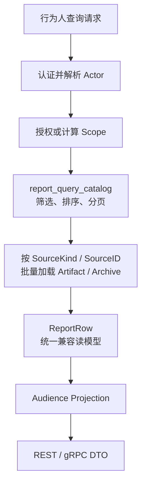
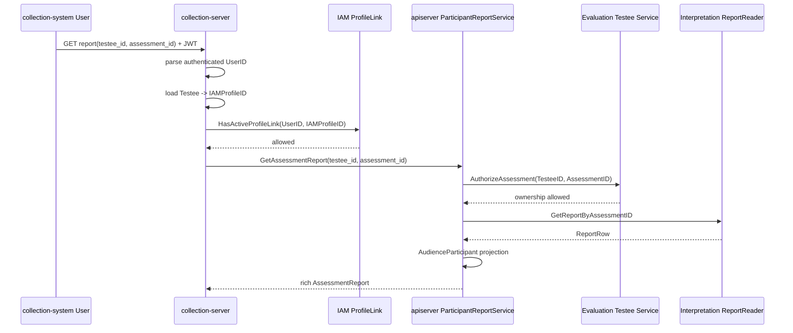
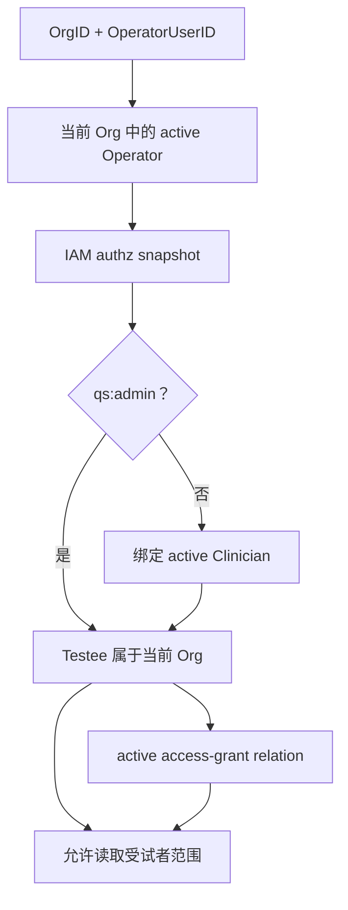
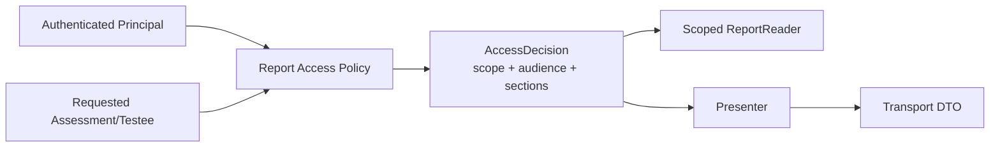

# 核心设计：查询模型、授权与 Audience 投影

> 状态：本文已按当前源码重写。Participant、Clinician、Administration 与 Operations 查询用例、授权先于正文读取的主链路、Catalog 分页查询和最小 Audience 投影已落地；患者端 gRPC 信任边界、Administration 角色语义、Catalog 关联复验与完整章节级可见性仍有明确缺口。

## 1. 本文回答

本文集中回答报告生成之后的“谁能查、可以查哪些、最终能看到什么”：

1. 为什么报告关联了 OrgID、AssessmentID 和 TesteeID，仍然不能直接返回；
2. 身份认证、资源授权、查询范围和 Audience 投影有什么区别；
3. 患者、家长、医生、运营管理员和内部运维如何映射到四类应用用例；
4. Participant 查自己的报告时，collection-server、IAM ProfileLink 和 apiserver 各负责什么；
5. Clinician 为什么要同时校验机构、Operator、Clinician 绑定、照护关系和 Assessment 归属；
6. Administration 列表怎样区分全机构范围、指定 Testee 和受限 Testee 集合；
7. Operations 为什么不走业务报告 DTO，而是查 Generation / Run / Artifact 审计证据；
8. `report_query_catalog` 怎样完成筛选、排序、分页和正文定位；
9. Audience 当前真正隐藏了哪些内容，哪些字段其实是被 Transport DTO 丢失的；
10. 当前查询与授权链路还存在哪些可能导致隐私或语义偏移的设计问题。

本文不重复 Artifact、Catalog 和 Archive 的持久化细节，这些见[《报告成品、版本与数据一致性》](./23-核心设计-报告成品、版本与数据一致性.md)。

## 2. 30 秒结论

报告查询不是一次 MongoDB `find`，而是四步安全链路：

```text
Authentication
  谁在调用？
       ↓
Authorization / Scope
  这个行为人能读哪个 Assessment 或哪些 Testee？
       ↓
Report Read Model
  Catalog 当前指向哪份 Artifact / Archive？
       ↓
Audience + Transport Projection
  已授权的报告中，这个读者最终看到哪些内容？
```

这四层不能互相代替：

| 层 | 关键问题 | 当前主要实现 |
| --- | --- | --- |
| 认证 | 调用者是谁 | IAM JWT、HTTP protected scope、gRPC mTLS |
| 授权 | 是否能读目标资源 | ProfileLink、Assessment ownership、Operator/Clinician 绑定、Testee relation、IAM capability |
| 范围 | 列表中哪些资源可见 | TesteeID、AccessibleTesteeIDs 或 OrgID 过滤 |
| 读模型 | 哪份正文是当前报告 | `report_query_catalog -> artifact/archive` |
| Audience 投影 | 授权后还需隐藏什么 | 当前仅对 `ModelExtra` 显式决策 |
| Transport 投影 | REST / gRPC 如何表达内容 | participant gRPC 保留富结构；当前 apiserver REST 仍是较窄的兼容 DTO |

最重要的边界是：

> Association 只说明报告属于谁，不说明当前调用者有权读取。Audience 只决定已授权读者可看哪些内容，不参与资源归属授权。

## 3. 先区分五个容易混淆的概念

### 3.1 Authentication：谁在调用

身份认证建立的是调用者身份：

- collection-system 用户通过 IAM JWT 进入 collection-server；
- apiserver 受保护 REST 路由从 JWT 和机构上下文中得到 `OrgID + OperatorUserID`；
- collection-server 调用 apiserver gRPC 时，当前生产配置使用 mTLS 证明它是 QS 内部服务；
- Operations 内部 REST 同时需要已认证用户和授权快照。

认证成功不表示可以读任意报告。

### 3.2 Authorization：能否读某个资源

授权要回答的是具体关系：

- 当前 IAM User 是否持有 Testee Profile 的 active link；
- 这个 Assessment 是否属于指定 Testee；
- 当前 Operator 是否属于当前 Org 且仍活跃；
- 当前 Operator 是管理员，还是绑定的活跃 Clinician；
- Clinician 与 Testee 是否存在活跃访问关系；
- Operations 是否具有 `audit_interpretation` capability。

授权是业务关系判断，不应由 Catalog 文档里的 TesteeID 自行替代。

### 3.3 Scope：列表中允许出现哪些数据

详情授权可以返回 allow / deny，列表查询则需要把行为人权限翻译为数据过滤器：

```text
Participant       -> TesteeID = actor.TesteeID
Clinician         -> TesteeID = explicitly authorized testee
Restricted staff  -> TesteeID IN AccessibleTesteeIDs
Administrator     -> OrgID = actor.OrgID
```

范围计算必须在查询之前完成，不能先取全机构报告，再在内存中删除无权数据。

### 3.4 Audience：已授权读者能看到哪些章节

Audience 是内容可见性角色，当前值为：

- `participant`；
- `clinician`；
- `admin`。

它不是 IAM JWT 中的 `aud` claim，也不是 Operator role。应用服务在已完成资源授权后，明确传入一个 Audience，Presenter 据此删除不可见章节。

### 3.5 Transport Projection：如何向某类客户端表达

即使 Audience 允许某个字段，REST 或 gRPC DTO 也可能暂时没有表达它。这是协议兼容问题，不是安全策略。

如果不区分这两层，“旧 REST DTO 忘了输出字段”很容易被误认为“业务刻意隐藏字段”，之后一次 DTO 补全反而可能意外暴露内容。

## 4. 四类查询用例与真实业务角色

| 应用用例 | Actor 身份 | 业务使用者 | 主要查询内容 | Audience |
| --- | --- | --- | --- | --- |
| Participant | TesteeID | 患者，或持有受试者 ProfileLink 的家长 | 自己/孩子的当前报告 | participant |
| Clinician | OrgID + OperatorUserID + TesteeID | 当前机构的医生或其他临床人员 | 获授权受试者的当前报告 | clinician |
| Administration | OrgID + OperatorUserID + scope | 管理后台及业务工作台 | 指定受试者、可访问受试者集合或机构报告 | admin |
| Operations | OrgID + OperatorUserID + audit capability | 内部运维和审计人员 | Generation、Run、失败、重试和 Artifact 元数据 | 无，不返回业务正文 |

“Participant”不应被简单翻译为“患者本人”。在儿童测评中，家长可以作为实际小程序用户读取孩子的报告。当前 collection-server 通过 IAM User 到 Testee Profile 的 active link 表达这种关系，报告本身仍属于 Testee，不属于当时的 AnswerSheet Filler。

## 5. 统一报告查询主链路



详情查询和列表查询只在授权形式上不同：

- 详情：先对 Assessment 或 Testee + Assessment 做具体授权，再按 AssessmentID 查 Catalog；
- 列表：先将行为人权限转为 TesteeID / TesteeIDs / OrgID，再将过滤器下推到 Catalog。

当前 Participant、Clinician 和 Administration 应用服务都有“authorize before reader”的单元测试，保证拒绝时不会调用报告 Reader。

## 6. ReportReader 与 Catalog 的查询契约

### 6.1 ReportReader 是 Interpretation 读边界

`interpretationreadmodel.ReportReader` 只提供：

```text
GetReportByAssessmentID(assessmentID)
ListReports(filter, page)
```

它不识别当前行为人，也不应该自己调用 IAM 或 Actor 服务。它接收的必须是应用层已经计算完成的安全过滤器。

这种分层避免了 Mongo 读模型依赖 IAM SDK、MySQL Actor Repository 或 HTTP context。但这也意味着：任何直接调用 ReportReader 的上层都必须自己负责授权。

### 6.2 当前过滤器

| Filter | 用途 |
| --- | --- |
| OrgID | 机构级报告列表 |
| TesteeID | 某一受试者的报告列表 |
| TesteeIDs | 受限工作人员可访问的受试者集合 |
| ModelCode | 按测评模型筛选 |
| RiskLevel | 按精确风险等级筛选 |
| HighRiskOnly | 筛选 `high / severe` |

当前 Participant / Clinician / Administration 的报告列表公开 DTO 只暴露 TesteeID 与分页，ModelCode 和 RiskLevel 主要供工作台、统计或其他内部读模型使用。

### 6.3 分页与加载

Catalog 先做：

```text
count(filter)
find(filter)
  sort sort_at desc, sort_report_id desc, assessment_id desc
  skip offset
  limit page_size
```

再将当前页按 SourceKind 分为 Artifact IDs 和 Archive IDs，各自一次批量加载正文，最后按 Catalog 顺序组装 ReportRow。

这避免了“先加载大量报告正文，再分页”。当页面没有数据时返回空切片，page 默认 1，page size 默认 10，最大 100。

### 6.4 悬空 Source 不静默跳过

如果 Catalog 声明 `artifact/9001`，但正文不存在或已被软删除，ReadModel 会：

1. 记录 AssessmentID、SourceKind 和 SourceID；
2. 返回 `CatalogDanglingSourceError`；
3. 终止整个页面的组装，不会把问题报告从列表中静默删掉。

这是正确的内部一致性语义。当前 Get 应用服务会将 Reader 错误统一包装为“报告不存在”错误码，List 则包装为数据库错误。因此运维定位仍要依赖内部 cause 和日志，对外错误码并不能区分“真的没有报告”和“Catalog 已损坏”。

## 7. Participant：患者或家长查看报告

### 7.1 对外链路



这条链路包含两个不同的“owner”判断：

1. IAM User 是否可以代表这个 Testee Profile；
2. Assessment 是否真的属于这个 Testee。

只做第 1 个检查，用户可能用自己的 TesteeID 查另一个 Assessment；只做第 2 个检查，调用者可能伪造其他 TesteeID。

### 7.2 apiserver Participant Access 当前保护什么

`participantInterpretationAccess` 的职责是：

- 列表前检查 Testee 存在；
- 详情前先检查 Testee 存在；
- 调用 Evaluation Testee Service，验证 Assessment.TesteeID 等于 Actor.TesteeID；
- 授权通过后才读取报告。

它并不从 gRPC context 中取 IAM UserID，也不调用 ProfileLink 验证“这个调用者是否拥有 Testee”。`ParticipantReportService` 直接将 request 中的 TesteeID 构造为 Participant Actor。

所以当前准确边界是：

> 终端用户到 Testee 的授权依赖 collection-server ProfileLink 中间件；apiserver Participant 用例只验证 Testee 存在和 Assessment 归属。

### 7.3 当前 gRPC 信任边界

仓库的 apiserver 生产配置为：

- 启用 mTLS 和客户端证书；
- `allowed-ous: QS`，CN 白名单为空；
- gRPC JWT auth 关闭；
- gRPC ACL 关闭。

这能防止非 QS 证书调用者进入，但不能将 `ParticipantReportService` 只限定给 collection-server，也不能证明 request TesteeID 来自已验证的 ProfileLink。

因此这不是端到端完整的参与者授权，而是“可信 BFF + Assessment ownership”组合边界。只要未来增加新的 QS 内部调用者，或将 Participant gRPC 暴露给更广范围，就必须先收紧这个契约。

### 7.4 列表与详情的差异

- `GetMyReport` 会验证 Assessment 归属；
- `ListMyReports` 只验证 Testee 存在，之后使用 TesteeID 过滤 Catalog；
- collection-server 当前 ParticipantReportClient 只包装了 GetAssessmentReport，但 proto 已公开 `ListMyReports`。

这使 `ListMyReports` 对可信 gRPC 调用者的要求更高：如果调用者可任意传 TesteeID，它可以直接枚举某个存在 Testee 的当前报告。

## 8. Clinician：医生查看获授权受试者报告

### 8.1 专用 REST 入口

```text
GET /api/v1/clinicians/me/testees/{testee_id}/reports
GET /api/v1/clinicians/me/testees/{testee_id}/reports/{assessment_id}
```

路由从受保护 HTTP context 取得 OrgID 和 OperatorUserID，而不是让客户端在 query 中传入这两个 ID。

### 8.2 受试者授权链



授予访问权的关系类型包括：

- assigned；
- primary；
- attending；
- collaborator。

creator 只表示来源，不授予报告访问权。

### 8.3 详情还要验证 Assessment 归属

Clinician 可以访问 Testee 不等于可以读客户端传入的任意 AssessmentID。详情用例先：

1. `ValidateTesteeAccess(OrgID, OperatorUserID, TesteeID)`；
2. `AuthorizeAssessment(TesteeID, AssessmentID)`；
3. `GetReportByAssessmentID(AssessmentID)`；
4. `AudienceClinician` 投影。

第 2 步防止使用一个已授权 TesteeID 搭配其他人的 AssessmentID。

### 8.4 列表只查明确指定的 Testee

Clinician 专用列表不支持“看我所有患者报告”的无参数全量查询。它要求明确 TesteeID，先验证关系，再将 TesteeID 下推到 Catalog。这限制了误查范围，也与医生在当前患者上下文中查看报告的产品语义一致。

## 9. Administration：机构与受限工作台查询

### 9.1 Administration 不等于只允许 qs:admin

`administration.Service` 的 Actor 是 `OrgID + OperatorUserID`。它委托 Evaluation Operator Query 计算 Testee 范围，因此当前实际可以处理：

- qs:admin：查整个当前机构；
- 绑定 Clinician 的 Operator：只查有活跃关系的 Testee；
- 明确传入 TesteeID：先对该 Testee 做访问校验。

所以包名中的 administration 更接近“受保护的后台报告查询”，而不是一个已由 capability 强制为管理员的用例。

### 9.2 范围决策表

| ScopeReports 结果 | Catalog Filter | 含义 |
| --- | --- | --- |
| TesteeID != 0 | `testee_id = X` | 已验证指定受试者 |
| Restricted=true 且 IDs 为空 | 不访问 Reader，直接返回空列表 | 受限人员目前没有可访问 Testee |
| Restricted=true 且 IDs 非空 | `testee_id IN (...)` | 受限受试者集合 |
| Restricted=false | `org_id = current org` | 机构管理员范围 |

“受限且空集合”必须在应用层直接返回空列表。如果将空 `TesteeIDs` 传给底层并被当成“没有过滤条件”，就会退化为全库查询。当前实现已显式防住这个边界。

### 9.3 当前 REST 入口

```text
GET /api/v1/evaluations/assessments/{id}/report
GET /api/v1/evaluations/reports
GET /api/v2/evaluations/assessments/{id}/report
GET /api/v2/evaluations/reports
```

这些路由使用 ReportQuery Journey 将 Evaluation Assessment 查询与 Interpretation 报告查询组合，最终委托 Administration Service 完成授权和报告读取。

当前路由只要已建立 protected scope 就可进入，没有另外挂载 `org_admin` 或“读报告” capability。真正范围由 Operator Query 及 Actor TesteeAccess 决定。

## 10. Operations：查生命周期，不查业务正文

### 10.1 四个内部用例

| 入口 | 回答的问题 |
| --- | --- |
| `/internal/v1/interpretation/reports/{report_id}` | 这份 Artifact 的 Generation、Outcome、Run、Assessment、Type 和 Version 是什么 |
| `/internal/v1/interpretation/outcomes/{outcome_id}/generations` | 一个 Outcome 有哪些报告生成版本和执行历史 |
| `/internal/v1/interpretation/assessments/{assessment_id}/lifecycle` | 一次 Assessment 的 Interpretation 现在停在哪里 |
| `/internal/v1/interpretation/assessments/{assessment_id}/reports` | 该 Assessment 有哪些历史 TemplateVersion Artifact |

Operations 返回的 Report 只有身份和时间元数据，没有 Conclusion、Dimensions、Suggestions 和 ModelExtra。因此它不使用 Audience Presenter。

### 10.2 双层审计权限

Operations 路由组先挂载 `RequireCapability(audit_interpretation)`，Service 内部又检查：

1. Actor.OrgID 与资源 OrgID 一致；
2. context 中存在 authz snapshot；
3. snapshot 具有 `audit_interpretation`，或行为人是 qs:admin。

对应 IAM resource/action 是：

```text
qs:interpretation_reports / audit
```

这是路由防护与应用服务防护的双层约束。即使以后 Operations Service 被新 Transport 重用，也不会只依赖旧路由中间件。

### 10.3 授权需要的最小资源读取

Operations 按 OutcomeID 或 AssessmentID 查询时，先从 Evaluation Outcome 获得 OrgID，完成授权后才查 Generation 和 Run。这是“为授权读取最小资源包络”，不是“先读业务正文”。

但 `FindReportByID` 当前会先用 ReportRepository 恢复完整 InterpretReport，再从 Association.OrgID 做授权，虽然对外只返回元数据，但数据库已经在授权前加载了报告正文。这不符合最严格的“授权先于正文读取”边界，应使用只返回 OrgID 和成品元数据的轻量 Correlation Reader，或在 Mongo 查询中加入已授权 OrgID。

## 11. Audience 当前真正实现了什么

### 11.1 当前只有一个受控章节

`presentation.Presenter` 当前只识别：

```text
SectionModelExtra = "model_extra"
```

可见性规则是：

| Audience | ModelExtra |
| --- | --- |
| participant | 可见 |
| clinician | 不可见 |
| admin | 可见 |

其他内容——Model、PrimaryScore、Level、Conclusion、Dimensions 和 Suggestions——在应用投影层目前对三类 Audience 都原样保留。

未知 Audience 或未注册 Section 会返回错误，而不是默认全部可见。这个“未知策略 fail closed”的方向是正确的。

### 11.2 为什么生成一份 Canonical Report

当前系统不为 participant、clinician 和 admin 分别生成三份 Artifact，而是：

```text
one immutable InterpretReport
  -> AudienceParticipant projection
  -> AudienceClinician projection
  -> AudienceAdmin projection
```

这样做的好处是：

- 结果事实和解释文案只固化一次；
- 不会因为某一 Audience 生成失败而出现三份报告不一致；
- 新增读者角色时不需重算 Outcome；
- 可见性策略可以独立测试和演进。

但前提是 Canonical Report 的读取必须先经过授权，而且任何 Transport 都不能绕过 Presenter 直接序列化 ReportRow 或 PO。

### 11.3 当前策略的业务理由尚未固化

从代码可以确认“Clinician 不看 ModelExtra”，但当前仓库没有固化这个策略的业务原因。ModelExtra 中可能包含人格类型、匹配度、特殊触发、稀有度和评论，直觉上并不当然应该对医生隐藏。

因此本文只把它记录为当前实现事实，不将它包装为已被业务论证的最终规则。后续需要产品和医疗业务共同确认。

## 12. Audience 投影与 Transport DTO 的二次收窄

### 12.1 participant gRPC 保留了富报告结构

`interpretation.AssessmentReport` proto 可以表达：

- 完整 ModelIdentity；
- PrimaryScore 和 ResultLevel；
- Dimensions 的 derived scores、level 和 norm reference；
- Suggestions；
- ModelExtra。

Participant 经过 `AudienceParticipant` 投影后，ModelExtra 会进入 gRPC 响应，collection-server 再转换为小程序 BFF DTO。这是相对于现有 REST DTO 更完整的报告展示契约，但仍不是 Artifact 的无损序列化：当前 proto 没有表达应用 Report Dimension 中的 `Role`、`ParentCode`、`HierarchyLevel` 和 `SortOrder`。

### 12.2 apiserver REST 仍是兼容摘要形状

`response.NewReportResponse` 当前只输出：

- AssessmentID；
- 由 Model.Title / Code 映射的 ScaleName / ScaleCode；
- 由 PrimaryScore.Value 映射的 TotalScore；
- 由 Level.Code 映射的 RiskLevel；
- Conclusion；
- 基础 Dimension 字段；
- Suggestions；
- CreatedAt。

它没有输出：

- Model 的 kind、sub-kind、algorithm、version、product channel 和 algorithm family；
- PrimaryScore 的 kind、label 和 max；
- ResultLevel 的 label 和 severity；
- Dimension derived scores、ResultLevel 和 NormReference；
- ModelExtra。

这些字段的缺失不是 Presenter 做的 Audience 决策，而是 REST response 仍停留在医学量表兼容形状。因此当前“医生看不到 ModelExtra”同时由两层造成：

1. `AudienceClinician` 明确隐藏；
2. REST DTO 无论 Participant/Admin/Clinician 都不表达。

第 2 层不应被当作安全保障，否则以后补全 REST DTO 时就可能绕过真正的 Audience 策略。

## 13. 跨模块组合状态

### 13.1 Assessment `evaluated` 不等于报告已存在

ReportQuery Journey 会将 Evaluation 和 Interpretation 事实组合为前端状态：

```text
Assessment.status != evaluated
  -> 保留 Assessment 状态

Assessment.status == evaluated
  + Catalog 无报告
  -> evaluated

Assessment.status == evaluated
  + Catalog 存在报告
  -> interpreted
  -> interpreted_at = ReportRow.CreatedAt
```

`interpreted` 是 Journey / Read Model 投影，不是 Assessment 聚合状态。这个边界避免 Interpretation 回写 Evaluation 聚合。

### 13.2 投影必须继承已授权 Assessment

Journey 先通过 Evaluation Operator Query 获得已授权 Assessment，然后才用 AssessmentID 检查报告存在。这一步不返回报告正文，只用它的 CreatedAt 建立组合状态。

当前列表投影会对每一个 evaluated Assessment 单独调用一次 `GetReportByAssessmentID`，在大页面上形成 N+1 Catalog 查询。这是读模型性能上的明确改进项。

## 14. 当前安全不变量

### 14.1 已有代码保护

1. Participant 详情在报告 Reader 之前验证 Assessment 属于 Testee。
2. Clinician 详情在 Reader 之前同时验证 Testee 访问权和 Assessment 归属。
3. Clinician 非管理员时，必须是活跃 Operator、绑定活跃 Clinician，且与 Testee 存在活跃授权关系。
4. Testee 必须属于 Actor 当前 Org。
5. Administration 受限空集合直接返回空列表，不退化为全库查询。
6. Participant、Clinician 和 Administration 业务报告都先授权、后加载报告正文。
7. Operations 同时校验当前 Org 与 audit capability。
8. 未知 Audience 和未知 Section 不会默认开放。
9. Catalog 查询只加载当前页正文，悬空 Source 不会被静默忽略。

### 14.2 应补强的不变量

1. 任何 Participant gRPC 调用必须携带可验证的终端用户—Testee 授权证据，或严格限定为已履行该校验的 BFF。
2. 服务身份通过 mTLS 后，仍必须有 method-level ACL，不能将“属于 QS OU”等价为“可查任意患者报告”。
3. 一个 Actor 被投影为哪个 Audience，必须来自同一份权限决策，不能由不同路由手工指定后产生偏差。
4. Catalog 的 AssessmentID / OrgID / TesteeID 必须与它指向的正文关联完全一致。
5. 详情查询返回的 ReportRow.AssessmentID 必须等于请求并已授权的 AssessmentID。
6. Transport 只能序列化已完成 Audience 投影的 DTO，不能直接序列化 PO 或 ReportRow。
7. 安全可见性必须由 Presenter 明确决定，不能依赖某个旧 Transport 暂时没有输出字段。
8. Operations 在授权前只允许读取最小资源包络，不加载报告正文。

## 15. 当前设计问题与风险

### 15.1 Participant gRPC 没有端到端绑定 IAM User 与 Testee

当前安全性建立在“collection-server 必然先跑 ProfileLink middleware”的信任上，但 Participant gRPC 本身没有验证证据。生产配置的 mTLS OU 范围又大于单一 collection-server。

建议的改造方向可以是下列之一，但需要在安全架构中统一选型：

- 启用真正可加载规则的 gRPC method ACL，只允许 collection-server 调用 ParticipantReportService；
- 传递可验证的终端 Principal / delegated subject，由 apiserver 再次校验 ProfileLink；
- 将“已验证 Testee subject”建模为签名的内部授权上下文，而不是普通 request field。

只启用 gRPC JWT 但仍不将 UserID 绑定 TesteeID，不能单独解决这个问题。

### 15.2 Administration Audience 与真实行为人可能不一致

Administration 允许受限 Clinician Operator 查可访问 Testee，但在生成应用 Report 时无条件传入 `AudienceAdmin`。同一个 Clinician 走专用路由时却使用 `AudienceClinician`。

当前 apiserver REST DTO 会对两者都删掉 ModelExtra，所以尚未通过该 REST 响应直接暴露差异。但应用层已经存在潜在绕过：如果未来 REST DTO 补全 ModelExtra，同一 Clinician 可能通过 generic evaluation route 看到专用 clinician route 明确隐藏的内容。

正确方向是让 scope 决策同时返回 Audience，或将真正只服务管理员的路由用 capability 限定。

### 15.3 Audience 策略过于粗粒度，且业务根据不清晰

当前只有 ModelExtra 一个 Section，无法表达：

- 医生可见、患者需简化的专业解读；
- 患者可见但运营工作台不必展示的个性化展示素材；
- 仅审计可见的模板、Builder 和来源证据；
- 建议、严重风险提示和临床备注的不同可见性；
- 家长与年长患者本人的差异。

在没有真实产品需求前不需要预先构造复杂 RBAC，但至少应将每个已存在 Section 的业务理由、默认可见性和测试矩阵固化。

### 15.4 Catalog 没有在读取时复验 Source 关联

Catalog 行中有 AssessmentID、OrgID 和 TesteeID，Artifact 正文也有同样的冻结关联。但当前 `loadCatalogRows` 只验证 SourceID 是否能加载，没有验证：

```text
catalog.assessment_id == body.assessment_id
catalog.org_id        == body.org_id
catalog.testee_id     == body.testee_id
```

这在正常成功事务中不会出问题，因为 Catalog 从同一 Artifact 投影并与它一起提交。但历史回填、人工修复或数据损坏如果把一个已授权 Assessment 的 Catalog 指向了其他人的正文，应用层可能在完成正确授权后返回错误的报告内容。

这是需要优先补强的安全一致性边界。读模型应在组装 ReportRow 前对比 Catalog 与 Source envelope，不一致时返回专用错误并告警。

### 15.5 REST DTO 兼容映射遮蔽了真实内容契约

人格、行为常模和认知任务报告需要 ModelIdentity、派生分、NormReference 和 ModelExtra。但当前 generic REST 仍用 ScaleName、TotalScore 和 RiskLevel 表达。

这不仅是“少几个字段”，而是对多测评模型统一报告契约的偏移。后续需要一个真正的 Report Response V2，且 V2 必须从 Audience-projected Report 映射，不能从 PO 重建另一套规则。

### 15.6 Operations FindReport 在授权前加载了完整 Artifact

当前对外没有返回正文，但严格的“authorize before content”原则仍未满足。这个问题可以通过轻量 ArtifactMetadataReader 解决，也可以将 OrgID 作为已授权查询条件。

### 15.7 ReportRow 缺少安全与追溯包络

ReportRow 当前有 AssessmentID，却没有 OrgID、TesteeID、SourceKind、SourceID、ReportID、ReportType 和 TemplateVersion。这导致：

- 应用层无法对 Catalog 与正文关联做完整复验；
- 上层无法在审计日志中记录实际返回的 ReportID 和版本；
- 无法告诉客户端返回的是 Artifact 还是 Archive 兼容结果；
- 不利于对历史推导数据做风险标记。

下一版读模型应包含最小 SourceEnvelope 与 ArtifactProvenance，业务 DTO 再根据 Audience 决定是否对外展示。

### 15.8 深分页、大范围 `$in` 和 count/page 不是强一致快照

当前分页使用 skip/limit，受限工作人员使用 TesteeIDs `$in`，count 和 page 是两次独立查询。因此：

- 页码很深时 skip 成本会增长；
- 可访问 Testee 数量很大时 `$in` 条件和序列化开销增长；
- count 与 page 之间如果新报告插入，total 和当前页可能不属于同一时刻快照；
- 新报告插入到首页后，后续 offset 页可能重复或跳过数据。

对普通 10–100 条页面，这可以是可接受的最终一致读取；对大型机构工作台，后续应评估基于 `(sort_at, sort_report_id, assessment_id)` 的 cursor pagination，以及将访问范围转为可查读模型，而不是一次传入大量 ID。

### 15.9 Assessment 组合状态存在 N+1 查询

Assessment 列表先从 Evaluation 取一页，再对每个 evaluated Assessment 单独查 Catalog。这会将一次列表变成 1+N 次存储访问。

比较合适的方向是 ReportReader 增加批量 existence / metadata 查询，或建立独立 Journey 状态投影，而不是让 Evaluation 聚合新增 `interpreted` 状态。

## 16. 建议的目标授权模型

当前最值得收敛的不是“再增加一个中间件”，而是建立一个可解释的读取决策：

```text
ReportAccessDecision
  ActorKind
  ActorIdentity
  ResourceScope
  Audience
  AllowedSections
  DecisionSource
  AuditContext
```

建议流程：



这样可以避免当前“一个 Access 返回 scope，另一行代码手工选 Audience”的偏移。但这不意味着必须马上引入通用 ABAC 引擎；当前可以先用显式值对象和策略测试收敛。

## 17. 一个具体例子：家长与医生查看同一份报告

假设：

- 儿童 TesteeID = 3001；
- 家长 IAM UserID = U-88，对 Testee Profile 有 active link；
- AssessmentID = 5001，属于 Testee 3001；
- 医生 OperatorUserID = 7001，在 Org 9 绑定活跃 Clinician；
- Clinician 与 Testee 3001 存在 active attending relation；
- Catalog 将 Assessment 5001 指向 Artifact 9001。

家长链路：

```text
U-88 JWT
  -> active ProfileLink to Testee 3001
  -> Assessment 5001 belongs to Testee 3001
  -> Catalog 5001 -> Artifact 9001
  -> AudienceParticipant
  -> gRPC rich report, ModelExtra visible
```

医生链路：

```text
Org 9 + Operator 7001
  -> active Operator and Clinician binding
  -> active attending relation to Testee 3001
  -> Assessment 5001 belongs to Testee 3001
  -> Catalog 5001 -> Artifact 9001
  -> AudienceClinician
  -> ModelExtra removed
  -> current REST compatibility DTO removes additional rich fields
```

两个读者读的是同一份不可变 Artifact，差异来自已授权后的投影，而不是两次重新计分或两份互相独立的报告。

## 18. 面试追问

### 18.1 报告中已经有 TesteeID，为什么查询前还要读 Assessment 或 Actor 关系？

TesteeID 是资源关联，不是当前调用者的授权证据。授权需要验证 IAM User/ProfileLink、Assessment ownership、Operator/Clinician 绑定和活跃关系。如果仅比对客户端传入 TesteeID 和报告 TesteeID，客户端可以同时伪造两者。

### 18.2 为什么不把授权逻辑写进 Mongo ReportReader？

ReportReader 是持久化无关的读边界，它不应该理解 HTTP context、IAM SDK 或 Clinician relation repository。应用层先将行为人权限翻译为资源授权或安全过滤器，Reader 只负责高效执行。

### 18.3 Audience 是 RBAC 吗？

不是完整 RBAC。当前 Audience 只是报告内容投影的读者类别。资源授权仍由 ProfileLink、Assessment ownership、Operator scope、Clinician relation 和 IAM capability 决定。

### 18.4 为什么只保存一份 Canonical Report？

因为患者和医生看到的业务核心应该来自同一 Outcome 与同一生成成品。不同读者的差异是展示和可见性问题，不应导致同一测评产生三套可能漂移的结果。

### 18.5 当前医生和管理员真的看到不同报告吗？

应用层上，AudienceClinician 会删除 ModelExtra，AudienceAdmin 保留。但当前 apiserver REST DTO 本身不输出 ModelExtra，因此当前 REST 响应上这个差异看不出来。患者 gRPC / collection BFF 契约会输出 ModelExtra。

### 18.6 为什么 Operations 不直接返回报告正文？

Operations 的任务是回答生命周期、失败原因、重试决策和版本来源，而不是成为另一个患者报告出口。最小化返回内容符合审计和隐私保护原则。

## 19. 代码导航

| 主题 | 事实源 |
| --- | --- |
| Participant 查询用例 | `internal/apiserver/application/interpretation/participant/service.go` |
| Clinician 查询用例 | `internal/apiserver/application/interpretation/clinician/service.go` |
| Administration 查询用例 | `internal/apiserver/application/interpretation/administration/service.go` |
| Operations 审计用例 | `internal/apiserver/application/interpretation/operations/service.go` |
| Audience 枚举 | `internal/apiserver/domain/interpretation/policy/policy.go` |
| Section 可见性 | `internal/apiserver/domain/interpretation/presentation/presenter.go` |
| 统一应用 Report 投影 | `internal/apiserver/application/interpretation/internal/reportprojection/mapper.go` |
| ReportRow 契约 | `internal/apiserver/port/interpretationreadmodel/readmodel.go` |
| Catalog 查询和正文加载 | `internal/apiserver/infra/mongo/interpretation/artifact_read_model.go` |
| Participant / Clinician / Administration Access 装配 | `internal/apiserver/container/module_init.go` |
| Operations capability 适配 | `internal/apiserver/container/modules/interpretation/assemble.go` |
| Clinician-Testee 访问规则 | `internal/apiserver/application/actor/access/service.go` |
| 授权关系类型 | `internal/apiserver/domain/actor/relation/types.go` |
| Assessment ownership | `internal/apiserver/application/evaluation/testee/service.go` |
| Administration scope 计算 | `internal/apiserver/application/evaluation/operator/service.go` |
| Evaluation + Interpretation 组合状态 | `internal/apiserver/application/journey/reportquery/service.go` |
| Participant gRPC | `internal/apiserver/transport/grpc/service/participant_report.go` |
| Clinician / Operations REST | `internal/apiserver/transport/rest/handler/interpretation_actor.go` |
| REST 报告 DTO | `internal/apiserver/transport/rest/response/evaluation.go` |
| collection-server ProfileLink 校验 | `internal/collection-server/transport/rest/middleware/iam_middleware.go` |
| collection-server gRPC Client | `internal/collection-server/infra/grpcclient/evaluation_client.go` |
| apiserver 生产 gRPC 信任配置 | `configs/apiserver.prod.yaml` |

## 20. 验证建议

本篇所述语义需要至少由以下测试保护：

```bash
go test ./internal/apiserver/application/interpretation/participant
go test ./internal/apiserver/application/interpretation/clinician
go test ./internal/apiserver/application/interpretation/administration
go test ./internal/apiserver/application/interpretation/operations
go test ./internal/apiserver/domain/interpretation/presentation
go test ./internal/apiserver/infra/mongo/interpretation
go test ./internal/apiserver/application/actor/access
go test ./internal/apiserver/application/journey/reportquery
go test ./internal/apiserver/transport/grpc/service
go test ./internal/apiserver/transport/rest
go test ./internal/collection-server/transport/rest/middleware
```

重点场景包括：

- 授权失败时 ReportReader 一次都不能被调用；
- Testee 和 Assessment 交叉伪造时必须拒绝；
- Clinician 没有 active relation 或跨 Org 时必须拒绝；
- creator relation 不能授予报告访问权；
- 受限空 Testee 集合不得触发无范围 Catalog 查询；
- Operations 跨 Org 或缺少 audit capability 时必须拒绝；
- Participant/Admin/Clinician 的 Section 可见性必须使用表驱动矩阵测试；
- 未知 Audience / Section 必须 fail closed；
- Catalog 指向正文缺失或关联不一致时必须返回一致性错误；
- generic Administration 路由不能为 Clinician 产生 Admin-only 内容；
- collection-server 未绑定 ProfileLink 时必须在 gRPC 前拒绝；
- ReportResponse V2 不能丢失已允许的富报告字段；
- Assessment 列表的 interpreted 组合状态不能回写 Evaluation 聚合。
