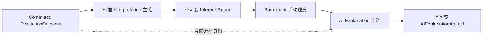
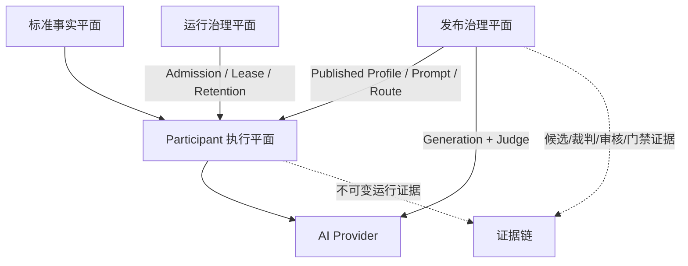
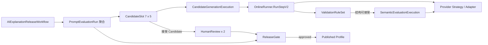

# 核心设计：AI 解读

> 截至 2026-09-05，当前状态：**轻量 v2 与不可变 Prompt/Suite/Profile v3 候选资产已部署生产，用户能力仍关闭**。历史 Run `635426176763965998` 使用 v2 候选资产，已验证 v8/v5 Route：35 次生成和 35 次裁判均一次成功，G3 可靠性与契约符合率均为 100%。
> 但 G4 仅 23/35 Candidate 通过全部 hard assertions，Case 断言通过 29/35，低于 32/35，且 Case 004、006 各仅 3/5，因此该 Run 不可批准。
> 当前最小修复保留原有单 Run Slot/Generation/Candidate/Semantic 模型，仅新增不可变 Prompt/Suite/Profile v3 并修正 limitations 校验器的自然语言误判。v1/v2 继续只读；
> 多集合、增量审核和自动 Prompt 反馈只保留为未来触发项。
> 该 Run 已完成 70/70 双角色审核并因 G4/G5 失败终审为 `rejected`，不能用来发布 Profile。`participant_enabled=false`；仍需新 Run 的 approved Evidence 和独立 Profile 发布证据。
> 本次调试将新 Run 默认门禁升级为 `release-gates@v2`，修正 G3 成功率分子与 G4 普通断言阈值判定；旧 Run 保留冻结的 v1 算法。PR #64 已部署；新 Run `635930567103230510` 冻结 v3 资产与 v2 门禁，生成 14 个 Candidate 后因裁判返回 `completed + no_message` 阻塞，13 个审核就绪。尚未形成发布证据。
> 当前代码修复将新 Run 执行策略升级为 `release-evaluation-bounded-recovery@v2`：此类响应仅允许对同一 Candidate 补充一次语义执行，第二次失败仍阻塞；限流错误映射到既有明确选择器。失败证据新增可选 `provider_diagnostics`（底层错误码、请求 ID、响应状态、结构摘要），不保存 reasoning 正文。历史策略和失败记录不重写，旧 blocked Run 不会自动恢复；此项修复尚未部署。失败调用仍计入 G3，收集恢复不代表可靠性门禁通过。

## 本文回答

本文用于产品、研发、测试、安全和运维共同理解 AI 解读，重点回答：

1. AI 解读究竟解决什么问题，和标准解读是什么关系；
2. 为什么 v1 是一次性模型调用，而不是 Agent；
3. 模型接收哪些事实、产出什么内容，如何防止它越权“重新测评”；
4. `Generation`、`Run`、`Artifact`、`Profile` 为什么要分开；
5. 如何处理异步执行、幂等、外部调用不确定性、质量发布和人工审核；
6. 在线评测、容量治理和数据生命周期为什么值得保留；
7. 当前代码已经做到什么，距离真正上线还差什么；
8. 为什么“最多 70 次调用必须零失败”会让发布流程反复停滞，新的 Candidate 收集模型如何解决；
9. 未来增加追问、更多用户数据、模型路由和独立 AI 服务时，现有设计如何演进；
10. 如何用三批最小改造快速验证 v2，并把多集合、增量审核和独立 AI 服务留到明确触发条件出现以后。

## 30 秒结论

AI 解读不是第二套测评，也不是替代标准报告的“智能报告”。它是建立在**已提交 Outcome 和当前不可变标准报告**之上的可选补充能力：用户在看到标准结果后手动触发，系统冻结本次测评的结构化事实，进行一次受约束的模型调用，只允许生成跨维度综合洞察和低风险、结果相关的建议。

标准报告始终是唯一权威结果；AI 解读不能重新计分、重新分类、诊断、治疗或修改报告。模型输出必须通过结构、事实引用、Profile 策略和安全校验，才会成为独立的不可变 Artifact。AI 不可用、失败或从未触发，都不影响标准报告。

系统需要区分两条不同的工作流：

- **Participant Explanation Workflow**：面向用户的一次性解读，每个业务 Run 最多一次 Provider 调用，失败不影响标准报告；
- **AIExplanationReleaseWorkflow**：面向发布治理，收集固定分层的有效 Candidate，通过确定性校验、模型裁判和双角色人工审核后，才允许发布 Profile。

发布治理不能再把“35 个样本位”误建模为“恰好执行 35 次且全部零故障”。目标设计要求每个样本位自动接受**第一个满足生成结构与内容契约的 Candidate**，并为该 Candidate 独立补齐裁判证据；两类执行都只允许在冻结成本上限内补充。
所有失败执行仍不可变保留并进入可靠性/契约符合率门禁，不能通过补样隐藏模型不稳定，也不能因一条已知可隔离的失败冻结其余有效样本。

```text
已提交 Outcome + 当前不可变标准报告
                  │
                  ▼
       冻结 AIExplanationInput
                  │ 用户手动触发
                  ▼
       AIExplanationGeneration
                  │
                  ▼
        单次 AIExplanationRun
                  │
                  ▼
 Schema → 引用 → Profile → Safety
                  │
                  ▼
       AIExplanationArtifact
```

## 重点速查

| 主题 | 当前答案 | 状态 |
| --- | --- | --- |
| 结果权威 | 标准 Interpretation 报告；AI 仅补充说明 | 已实现 |
| 触发方式 | Participant 在标准报告可用后手动触发 | 已实现 |
| v1 范围 | `participant + scale + score_range + current_assessment_only` | 已实现 |
| AI 形态 | 一个 Run 一次 Provider 调用，不是 Agent | 已实现 |
| 核心输出 | 综合摘要、跨维度洞察、低风险建议、局限说明 | 已实现 |
| 事实约束 | 输出中的重要判断必须引用本次 Input 内事实 | 已实现 |
| Participant 可靠性 | Outbox、lease、CAS、`result_unknown`、受控人工重试 | 已实现；待真实故障演练 |
| 评测收集模型 | 7 个 case × 5 个有效 Candidate；执行失败可有界补样，所有执行仍保留 | 已部署；生产 v2 Run 已收集 35 个 review-ready Candidate 和 35 份裁判证据 |
| 质量发布 | 35 个有效 Candidate、35 份完整裁判证据、70 条双角色人工复核，并检查全部执行的可靠性/契约符合率 | 历史 Run 已完成 `70 / 70` 审核并终审 rejected；新 Run 与 approved Evidence 待验证 |
| 单条诊断复测 | 冻结当前候选 Release，最多 1 次生成 + 1 次裁判；不改源 Run | 已实现；待生产探针 |
| Profile | 评测证据通过后才能发布，发布后不可原地修改 | 已强制只接受 approved v2 Evidence；尚无生产 Profile |
| 架构骨架 | Release Workflow + Candidate Pipeline + Validation Rule Set + Run State Machine + Provider Strategy/Adapter | 已实现；模式术语不等于同名代码类型 |
| 失败模型 | 区分基础设施、结果未知、协议、内容契约、裁判执行和质量失败 | Taxonomy、Runner 分类和冻结 Policy 补执行约束已实现；待生产分布 |
| 裁判证据 | 独立保存裁判请求身份、Provider receipt、原始/规范化输出、校验与失败分类 | 已由生产 v2 Run 形成 35 份裁判证据；单条生产 Recheck 仍待执行 |
| 成本与容量 | 到达层限流、日调用预算、活跃执行槽 | 已实现；待生产定标 |
| 数据生命周期 | Participant 180 天、Prompt 评测 365 天、容量账本 35 天；终态 TTL、最小化导出 | 策略已确认并配置；待生产行为验收 |
| 生产开关 | 治理/评测开关 `enabled=true`；用户流量开关 `participant_enabled=false` | 仅准备内部评测，用户能力未开放 |

状态标签约定：

- `已实现`：当前代码与配置已经存在该能力；
- `部分实现`：主干存在，但生产证据或关键边界仍不完整；
- `规划改造`：本文冻结目标设计，不代表当前代码已经具备；
- `待生产证据`：代码存在，但仍不能据此宣称生产可用。

---

## 一、领域问题：为什么标准报告之外还需要 AI 解读

### 1. 标准报告擅长“准确表达”，AI 解读擅长“组合表达”

标准报告由确定性规则、模板和已发布模型资产生成，负责稳定表达：

- 总体结果是什么；
- 每个维度的分数、等级和标准含义是什么；
- 标准建议是什么；
- 结果使用边界是什么。

这条链路可复现、可审计，是测评结果的权威表达。但当报告包含多个维度时，用户仍可能有进一步的问题：

- 两个看似矛盾的维度如何同时理解；
- 哪些维度可能共同构成一种模式；
- 优势和关注点在什么情境下会相互影响；
- 标准建议很多，应该从哪个小步骤开始。

这正是 AI 解读的产品价值：**不发明新测评事实，而是组织已有事实之间的关系。**

### 2. 什么是“跨维度综合洞察”

一条合格的综合洞察不是把两个维度描述拼接在一起，而是说明它们之间的组合关系：

| 类型 | 含义 |
| --- | --- |
| `reinforcing_pattern` | 两个或多个维度可能共同强化某种表现 |
| `contrast_pattern` | 多个维度呈现差异，需要结合情境理解 |
| `combined_strength` | 多个维度共同形成可利用的优势 |
| `combined_attention` | 多个维度共同提示值得观察的日常情境 |
| `context_variation` | 结果可能随环境、任务或支持条件变化 |

v1 要求每条洞察至少引用两个不同的维度事实。总体结果、模型结果和标准建议可以作为辅助证据，但不能替代跨维度要求。

### 3. 为什么不能直接把原始分数交给模型

裸分数不天然具有“高、低、好、坏、风险”的方向含义。方向性必须来自已经发布并冻结的标准事实，例如：

- 标准等级与解释；
- 标准结论；
- 明确的常模上下文；
- 标准建议；
- 已提交 Outcome 的运行身份。

因此，AI 输入不是数据库字段拼盘，也不是原始答案全文，而是由服务端构造的**受控事实投影**。这既保护测评语义，也缩小了模型幻觉和隐私泄漏面。

### 4. 什么是“结果相关建议”

建议分为两类：

| 来源 | 约束 |
| --- | --- |
| `standard_derived` | 只能重组或改写本次报告中真实存在的标准建议，必须保留原方向并引用 source suggestion |
| `generated_low_risk` | 只能提供可选择、可撤销的日常观察、记录、沟通、环境调整或小步骤练习 |

AI 不得给出诊断、病因、用药、治疗方案、风险重分类、危机处置或效果承诺。建议的定位是“帮助用户理解和尝试”，不是专业决策替代。

---

## 二、产品边界：v1 做什么，不做什么

### 1. v1 支持范围

| 维度 | v1 决策 |
| --- | --- |
| 触发方式 | Participant 手动触发 |
| 前置条件 | 当前标准报告已经可靠提交 |
| 数据范围 | 当前一次测评 |
| Audience | `participant` |
| Model kind | `scale` |
| Decision kind | `score_range` |
| 输入事实 | 当前不可变标准报告及关联 Outcome 的必要运行身份 |
| 个性化 | locale 和最多三个受 Profile allowlist 控制的 focus area |
| 输出 | summary、integrated insights、suggestions、limitations |
| 调用方式 | 每个 Run 一次结构化 Provider 调用 |

对应机器事实源是
[AIExplanationInput v1](../../../api/schema/interpretation/ai-explanation-input-v1.schema.json)、[AIExplanationOutput v1](../../../api/schema/interpretation/ai-explanation-output-v1.schema.json)
和 [AIExplanationProfile v1](../../../api/schema/interpretation/ai-explanation-profile-v1.schema.json)。

### 2. v1 明确不做

- 多次测评趋势、跨报告比较和长期记忆；
- 原始答案、开放文本、聊天记录或互联网检索；
- 年龄、性别、职业、病史等额外用户画像；
- clinician audience；
- typology、behavioral rating、cognitive 等其他模型机制；
- 新分数、新等级、新风险分类或标准报告修正；
- 诊断、病因、治疗、用药或确定性未来判断；
- Tool Calling、规划、反思循环和自主多步执行；
- 自由文本降级、非法输出局部抢救或自动修复性 Prompt；
- `force regenerate`。相同语义请求复用已有运行或成品。

未来扩大范围必须发布新的契约、Profile、评测套件和发布证据，不能把 v1 的结论外推到其他数据或人群。

### 3. 它是不是 Agent

不是。Agent 通常拥有工具、环境反馈、状态记忆或自主迭代循环，而 v1 的执行边界是：

```text
冻结输入 → 渲染固定 Prompt → 调用模型一次 → 校验一次 → 结束
```

失败后创建新的 Run 是可靠性重试，不是 Agent turn。未来增加追问也不必自动等于 Agent：如果每次追问仍是“冻结上下文后调用一次”，它只是多轮对话；只有引入自主计划、工具选择、数据检索和迭代执行后，才需要按 Agent 系统治理。

---

## 三、系统定位：标准 Interpretation 与 AI Explanation 的关系



必须长期保护六条不变量：

1. 标准报告是唯一权威结果，AI Artifact 不是新的测评结论；
2. AI 只能读取已提交标准事实，不得重新计算 Outcome；
3. AI 失败不得回退 Assessment、Evaluation 或标准报告状态；
4. AI Artifact 不能覆盖、修订或阻断标准报告；
5. AI 不写入 `report_query_catalog`，不改变“当前标准报告”的查询语义；
6. 标准报告换版后，历史 AI Artifact 继续指向原始 source，不会静默重绑。

当前 source resolver 先通过 `report_query_catalog` 取得唯一当前 `SourceID`，再加载精确 `InterpretReport`，并按报告冻结的 `OutcomeID` 加载对应 Outcome。
缺失、dangling、主体不一致或运行身份不一致一律 fail closed。查询历史 Generation 时返回 `current|stale|unavailable|unknown`，让客户端明确知道成品是否仍基于当前报告。

---

## 四、总体架构：四个业务平面和一条贯穿证据链

### 1. 事实平面

标准 Interpretation 和 EvaluationOutcome 提供已提交事实。AI 子域只能建立只读投影，不能回写结果。

### 2. Participant 执行平面

负责授权、能力判断、手动请求、异步执行、状态查询、Artifact 展示和本人数据导出。

### 3. 发布治理平面

负责 Prompt/Profile 候选、合成在线评测、独立模型裁判、双角色人工审核和 Profile 发布。它决定“什么组合有资格服务用户”，但不自动开放能力。

### 4. 运行治理平面

负责日预算、并发槽、lease recovery、受控重试、TTL、指标和审计。它约束成本与故障影响范围。

### 5. 贯穿证据链

证据不是第五个独立业务模块，而是贯穿 Participant 执行和发布治理的横切不变量。每一次外部调用、输出规范化、规则校验、模型裁判、人工审核和发布决策都必须留下可追溯证据；失败证据与成功证据同等重要，不能只保存最后一次成功结果。



这种分层让治理能力可以随代码一起部署，但按阶段启用；质量评测、用户请求和标准报告不会混成一个状态机。

### 6. 架构模式与代码载体

AI 解读不是由一个“超级编排器”完成，而是由多个领域对象、应用服务和基础设施适配器协作完成。下表用于对外讲解系统骨架，也用于帮助开发者快速找到真实代码入口；表中的模式名是**架构视角**，不要求创建字面同名的 Go 类型。

| 架构视角 | 当前含义 | 主要代码载体 | 目标演进 | 边界 |
| --- | --- | --- | --- | --- |
| Release Workflow | 多服务协作的整体发布治理流程 | 评测、证据、人工审核、Profile 发布与容量治理服务 | 以“有效 Candidate 配额 + 有界执行预算 + 发布 Gate”统一编排 | 不是单一 `AIExplanationReleaseWorkflow` 大类，不自动发布 Profile，也不自动打开用户流量 |
| Candidate Pipeline | v2 每次只推进一个已持久化执行地址 | `PromptEvaluationEvidenceV2.NextAction` → `OnlineRunner.RunStepV2` → durable commit | 先用现有局部方法完成生产验证；只有测试隔离再次成为瓶颈才提取新类型 | Slot、Generation Execution、Candidate 和 Semantic Execution 已分离；不创建通用工作流引擎 |
| Validation Rule Set | 对候选输出运行全部确定性规则并保留每条证据 | `EvaluateCandidate` + `Assertions` | 用生产 Recheck 和完整 Run 校准规则与失败分布 | 会收集 `passed` / `failed` / `blocked`，不是“首个 Handler 处理即结束”的经典职责链 |
| Run State Machine | 维护评测 Run 的状态转换和领域不变量 | v1 `PromptEvaluationRun` 只读；v2 `PromptEvaluationEvidenceV2` 新写 | 完成受控发布、首个完整生产 Run 与 Semantic 容量复测 | 代码保留领域名，不为模式而改名 |
| Provider Strategy | 为应用层提供统一的模型生成契约 | `port.Provider` | 生成与裁判分别冻结 Route；允许未来声明多 Provider 策略 | 应用层依赖稳定 port，不依赖 OpenAI 或 DeepSeek SDK |
| Provider Adapter | 将冻结 Route 转换为具体 Provider 线协议，并规范化回执与错误 | `responsesapi.Provider` | 暴露结构保证等级与稳定失败分类 | 只处理可证明的协议差异，不修补业务内容，最终由服务端契约校验裁决 |

这组映射用于统一领域沟通和对外宣讲，不是当前的代码重命名计划。裁判失败证据、失败分类和有界补样语义已经发布，生产 v2 Run 也已完成 35 个 Candidate 与裁判证据的收集；下一步是人工审核、Finalize/Gate，
以及包含 Semantic Execution 的 BSON 容量复测。只有这些验证完成后 `OnlineRunner` 仍表现出职责过多、变更放大或测试隔离困难，才启动独立结构性重构；届时先以表征测试保护行为，再分批提取 Candidate Pipeline，而不是只做模式化改名。

### 7. 目标组件关系



这张图表达三个关键分离：样本位不等于一次外部调用；生成执行不等于模型裁判执行；Run 获得批准不等于 Profile 自动发布。

---

## 五、产品机器契约与发布治理契约

### 1. AIExplanationInput v1：模型可以知道什么

完整服务端 Input 由四部分组成：

| 部分 | 内容 | 发送给 Provider |
| --- | --- | --- |
| `source` | report/outcome 身份、报告模板、内容 Schema、Builder、生成时间 | 否 |
| `profile` | Profile ID、版本和指纹 | 否 |
| `context` | 当前测评范围、participant、locale、受控 focus areas | 是 |
| `facts` | 模型/决策身份、总体结果、维度、标准建议、可选模型结果 | 是 |

Provider 顶层只能收到：

```json
{
  "context": {},
  "facts": {}
}
```

ReportID、OutcomeID、AssessmentID、TesteeID、UserID、OrgID、鉴权信息、Provider 配置、原始答案和历史测评不得进入 Provider payload。

完整 Input 会以规范 JSON 冻结为 `InputSnapshot` 并计算 SHA-256 指纹。一个 Generation 的所有 Run 必须复用同一快照；重试时不能重新读取当前报告、Profile 或 focus areas，否则“重试”会悄悄变成另一次语义请求。

### 2. AIExplanationOutput v1：模型可以说什么

业务契约要求交给服务端 validator 的内容是一个严格 JSON 对象，不接受额外说明或自由文本 fallback。Provider Adapter 可以针对已审阅、无歧义的线协议包装生成独立 `validation_output`，例如唯一完整 Markdown JSON 围栏；
它必须同时保留原始正文，且不能补字段、改业务内容或修复非法 JSON。任何未知、含糊或多重包装仍然失败关闭。

| 字段 | 语义 |
| --- | --- |
| `summary` | 概括多个维度的整体关系，不逐项复述 |
| `integrated_insights` | 跨维度关系，每项携带可解析 evidence refs |
| `suggestions` | 结果相关、低风险、可选择和可撤销的行动建议 |
| `limitations` | 明确数据范围和非诊断边界 |

Artifact 创建前依次执行：

```text
单一 UTF-8 JSON 对象
  → Typed Output Schema
  → Evidence ref 完整性
  → Profile 数量、类型、层级与建议策略
  → 确定性安全规则
  → AIExplanationArtifact
```

任何一步失败都不能将部分文本发布给用户。

### 3. AIExplanationProfile v1：系统允许如何解释

Profile 是服务端发布策略，不是 Prompt 文案，也不发送给 Provider。它定义：

- selector：固定为 `participant + scale + score_range`，可选 model code/version；
- eligibility：允许的维度、最少/最多维度和溢出策略；
- input policy：常模、模型结果、focus area 与父子维度规则；
- insight policy：洞察类型、数量、每项维度引用范围；
- suggestion policy：来源、类别、数量、actions 和引用要求；
- safety policy：禁止主张、规则版本和 disclaimer 版本；
- generation policy：Prompt、逻辑 Provider route、Schema 与最大输出长度。

生命周期固定为：

```text
draft → published → disabled
```

解析优先级固定为：

```text
model code + version 精确匹配
  > model code 默认版本
  > model kind + decision kind 默认
```

同一优先级多个 published Profile 必须拒绝执行。发布后策略内容不可原地修改；新 Prompt、规则或路线需要新版本和新指纹。`disabled` 只阻止新生成，不破坏历史 Artifact 的审计。

跨对象、运行时和错误分类规则见 [AI 解读契约验证矩阵](../../../api/schema/interpretation/ai-explanation-contract-validation-matrix.md)。

### 4. 发布治理契约

Input、Output、Profile 三份 v1 契约继续保持稳定；本轮问题不需要通过破坏用户输出契约来解决。发布治理需要新增独立契约：

| 机器契约 | 用途 | 是否发送给 Provider |
| --- | --- | --- |
| [AIExplanationEvaluationExecutionPolicy v1](../../../api/schema/interpretation/ai-explanation-evaluation-execution-policy-v1.schema.json) | 冻结 Slot 数、生成/裁判执行上限、可自动/人工处置的失败集合和最坏成本 | 否 |
| [AIExplanationReleaseGatePolicy v1](../../../api/schema/interpretation/ai-explanation-release-gate-policy-v1.schema.json) | 冻结 G1～G5 阈值、分母和通过规则 | 否 |
| [PromptEvaluationEvidence v2](../../../api/schema/interpretation/prompt-evaluation-evidence-v2.schema.json) | 持久化 Preflight、Slot、Generation Execution、Candidate、Semantic Execution、result-unknown resolution、Reviews 和 GateResult | 否 |
| [AIExplanationFailureTaxonomy v1](../../../api/schema/interpretation/ai-explanation-failure-taxonomy-v1.schema.json) | 固化 stage、kind、code、retryable、result unknown 与 disposition | 否 |

四份 Schema、服务端嵌入访问器和契约编译测试均已落库。轻量 v2 已接入同一 Mongo 集合的独立 PO/Mapper/Repository、CAS Application Service、容量事务、Outbox 事件、Worker/gRPC 路由和分步 Runner；
新管理写入口使用 `/internal/v2`，v1 评测 REST 只保留查询。生产 Run `635398770544095790` 已走完自动收集阶段并保留 4 次失败执行；形成 35 个 Candidate 不等于执行可靠性 Gate 通过，更不等于用户能力开放。

这些契约属于治理层，不应塞入 `AIExplanationProfile v1`。Profile 决定用户解读内容与策略；Evaluation Policy 决定如何证明一个 Profile/Prompt/Route 组合可以发布。
二者版本独立，但必须共同进入评测 Release Identity。

---

## 六、领域模型：为什么不能只有一张“AI 解读表”

### 1. Participant 解读模型

| 模型 | 回答的问题 | 关键不变量 |
| --- | --- | --- |
| `AIExplanationGeneration` | 用户要的是哪一份语义结果，目前处于什么状态 | 冻结 source、audience、Input、Profile、Prompt 和 Provider execution spec |
| `AIExplanationRun` | 某一次外部调用尝试发生了什么 | 一个 Run 最多调用 Provider 一次；记录 lease、invocation phase、receipt 和失败 |
| `AIExplanationArtifact` | 哪次合法 Run 产生了什么可展示成品 | 不可变；绑定 source provenance、所有版本收据和校验结果 |
| `AIExplanationProfile` | 哪类报告允许怎样解释 | 版本化发布、确定性解析、发布后不可变 |
| `InputSnapshot` | 重试使用的事实是否完全一致 | 规范 JSON、Schema 版本和指纹稳定 |
| `Output Content` | 可展示内容的合法领域形态是什么 | 类型、引用和最小内容成立 |

### 2. 发布评测模型

当前 `PromptEvaluationRun + AttemptRecord` 已能冻结 Release、运行 35 个生成记录、追加校验和人工审核证据，但 `AttemptRecord` 同时表示“固定样本”“生成执行”和“裁判结果”，
导致一条裁判失败会让整个样本既无法完成也无法补足。目标模型拆为：

| 模型 | 回答的问题 | 关键不变量 | 状态 |
| --- | --- | --- | --- |
| `PromptEvaluationRun` | 这组 Release Identity 是否收集到足够发布证据 | 冻结 Release、Execution Policy 和 Gate Policy；证据只追加 | v1 历史聚合只读；v2 聚合、状态机和单文档持久化已接线 |
| `CandidateSlot` | 7 个 case × 5 个分层样本位中，这一位由哪个 Candidate 占用 | 身份为 `case_id + slot_ordinal`；只接受第一个符合执行契约的 Candidate | 已由生产 v2 Run 填满 35 个 Slot |
| `CandidateGenerationExecution` | 为某个 Slot 发起的一次生成调用发生了什么 | 一次执行最多调用生成 Provider 一次；成功、失败、未知都不可变 | v2 Runner 独立提交并永久保留失败 |
| `Candidate` | 哪份规范化输出进入质量评测和人工审核 | 必须来自 Slot 的首个结构可接受执行；不可人工挑选“更好答案” | v2 自动接纳已实现；待真实质量证据 |
| `SemanticEvaluationExecution` | 对一个已接受 Candidate 的一次模型裁判调用发生了什么 | 与生成调用分开保存 Provider receipt、原始/规范化输出和失败 | v2 Runner/Mapper 已接线；失败只补同 Candidate 裁判 |
| `AssertionReceipt` | 某条确定性或语义规则的结论与依据是什么 | 规则类型、scope、ordinal、版本和状态稳定 | 已实现；执行级 typed failure 与规则结论分开保存 |
| `HumanReview` | 领域/安全责任人如何判断 Candidate | 两个角色、两个真实审核人、理由必填、不可覆盖 | 已实现 |
| `GateResult` | 为什么本 Run 被批准或拒绝 | 同时评估样本完整性、质量、可靠性、契约符合率和人工审核 | v2 G1～G5 已实现；待生产阈值验证 |
| `PromptEvaluationRecheck` | 某条历史失败在当前 Release 上是否恢复 | 独立诊断，不修改源 Run，也不自动成为发布证据 | 已实现 |

### 3. Generation、Run、Artifact 的区别

这是整个模型最重要的分离：

- `Generation` 是用户语义意图，相同事实和发布组合应当复用；
- `Run` 是执行尝试，超时或失败后可以有新 attempt；
- `Artifact` 是通过全部验证后的成品，只能由成功 Run 创建。

如果三者合并，系统会难以区分“用户重复点击”“同一任务重试”“新模型重新生成”和“已有合法成品”，幂等、计费和审计都会失真。

### 4. Generation 语义幂等键

```text
SourceReportID
+ Audience
+ Profile(ID, Version, Fingerprint)
+ InputFingerprint
+ ProviderExecutionSpecFingerprint
```

Actor、trace 和 request ID 不进入语义键。focus areas 已在 InputSnapshot 中，因此自然影响 `InputFingerprint`。

### 5. Participant 状态机

Generation：

```text
pending → generating → generated
                    ↘ failed → generating（受控新 Run）
```

Run：

```text
pending → running/prepared → dispatching → response_received → succeeded
                              └───────────→ result_unknown / failed
```

Artifact 没有“半成品”状态。只有全部验证通过后，才在成功事务中创建不可变 Artifact。

### 6. 评测 Run 状态机

当前实现是：

```text
collecting → awaiting_review → approved | rejected
    │             └→ canceled（存在技术失败时）
    └→ canceled
```

目标状态机是：

```text
requested
   ↓
collecting ──可安全补样/补裁判──┐
   │                            │
   ├── unresolved result_unknown / 预算耗尽 / 人工决策 ─→ blocked
   │                                                    │
   │                                 受控恢复/扩展预算 ──┘
   │
   └── 35 个 Slot 均接受 Candidate，且裁判证据完整
                         ↓
                  awaiting_review
                    ↙          ↘
               approved       rejected

任意非终态 ──审计取消──→ canceled
```

`collecting` 可以包含补样，不需要为每次补样创造新的业务状态。`blocked` 表示系统不能在既定授权和成本边界内继续，并不是失败证据被删除。只有以下条件全部成立才能进入 `awaiting_review`：

1. 7 个 case 的 35 个 Slot 都有唯一 accepted Candidate；
2. 每个 accepted Candidate 都有完整的确定性和语义裁判证据；
3. 没有未处置的 `result_unknown`；
4. 所有执行没有突破冻结的最大调用预算；
5. Release Identity、Execution Policy 和证据指纹一致。

### 7. Slot、Execution 与 Candidate 的选择规则

这是防止补样退化为“跑到满意为止”的关键：

- Slot 是预先冻结的样本位置，不因失败增加或减少；
- Generation Execution 是一次真实外部调用，全部保留并计入可靠性/契约符合率；
- 只有基础设施、协议、结构或内容契约导致“无法形成可评测 Candidate”时，才允许在预算内为原 Slot 创建下一次执行；
- 第一个通过结构与内容契约的输出自动成为 accepted Candidate，操作者不能从多个成功输出中挑选；
- Candidate 命中确定性质量规则、模型裁判低分或人工拒绝时，仍然占用原 Slot 并进入质量统计，不能通过补样换掉差结果；
- 模型裁判执行失败时只补裁判，不重新生成 Candidate；
- 所有被拒绝、失败和未知执行都进入 Gate 的执行质量指标，补样不能擦除失败率。

### 8. Candidate 形成与质量失败的边界

Participant Artifact 和 Evaluation Candidate 使用同一组规则，但终止语义不同：

| 阶段 | Participant 生成 | 发布评测 |
| --- | --- | --- |
| JSON/typed/content contract | 失败，不创建 Artifact | 不能形成 Candidate；记录契约拒绝并按策略补样 |
| Evidence refs | 失败，不创建 Artifact | Candidate 保留，生成 failed AssertionReceipt |
| Profile policy | 失败，不创建 Artifact | Candidate 保留，生成 failed AssertionReceipt |
| Deterministic safety/quality | 失败，不创建 Artifact | Candidate 保留并计入质量失败，不允许补样替换 |
| Semantic judge | Participant v1 不调用 | 结构可接受 Candidate 必须调用；裁判执行失败只补裁判 |
| Human review | 不适用 | review-ready Candidate 必须完成双角色审核 |

因此 Candidate 形成门只负责回答“这是不是一个可以被稳定解析、展示和评测的 AIExplanationOutput”；引用、Profile、安全和语义质量回答“这个 Candidate 是否合格”。
应用层应先独立完成 typed parse/normalization，再执行会返回 receipts 的 ValidationRuleSet，不能因为一条质量规则失败而丢失规范化 Candidate 或跳过模型裁判。

### 9. 冻结的 EvaluationExecutionPolicy

补样和裁判重试必须由版本化策略控制，而不是 `OnlineRunner` 中的临时判断。策略至少包含：

```text
required_cases
required_candidates_per_case
max_generation_executions_per_case
max_generation_executions_per_run
max_semantic_executions_per_candidate
max_semantic_executions_per_run
auto_retryable_stage_codes
manual_recovery_stage_codes
max_infrastructure_failure_rate
min_output_contract_conformance_rate
min_semantic_execution_success_rate
```

建议用历史生产分布校准后再发布第一版 Policy。设计起点可以是每个 case 需要 5 个有效 Candidate、最多 2 个额外生成执行、每个 Candidate 最多 1 次额外裁判执行；但这些数字在进入机器契约和容量账本前只是建议，不是当前生产事实。

---

## 七、端到端运行链路

### 1. 手动请求

Participant 外部入口位于 collection-server：

- `GET /api/v1/assessments/{id}/ai-explanation/capability`；
- `POST /api/v1/assessments/{id}/ai-explanations`；
- `GET /api/v1/assessments/{id}/ai-explanations/{generation_id}`；
- `GET /api/v1/ai-explanations/export`。

请求链路按以下顺序执行：

1. 验证 Participant 身份和 Assessment 访问权；
2. 解析当前标准报告及冻结 Outcome；
3. 解析匹配的 published Profile；
4. 组装并校验 InputSnapshot；
5. 解析冻结 PromptPackage 和 ProviderExecutionSpec；
6. 按语义键复用或创建 Generation；
7. 原子提交容量预留、Generation 和 requested Outbox；
8. 立即返回 `pending`、已有状态或已有 Artifact。

未发布 Profile 时返回 `profile_unresolved`；`participant_enabled=false` 或用户侧 gRPC 服务未注册时稳定返回 `not_applicable / feature_disabled`。两种情况都不会影响标准报告。

### 2. 异步执行

```text
requested Outbox
  → qs-worker
  → internal AIExplanationAutomation gRPC
  → claim Run lease + active slots
  → 持久化 dispatching
  → 已配置 Provider 的冻结线协议单次调用
  → 持久化 response receipt
  → Output / refs / Profile / Safety 校验
  → 原子提交 Artifact + Run + Generation + terminal Outbox
```

终态成功和失败都是 AI 子域事实，不会回写标准报告状态。

### 3. 查询与 stale 语义

查询前再次鉴权，随后读取 Generation 和 Artifact。响应同时包含 source state：

- `current`：仍基于当前标准报告；
- `stale`：标准报告已换版，成品仍可追溯但不是当前来源；
- `unavailable`：无法确定当前来源；
- `unknown`：历史数据不足以作出判断。

系统不会为了“看起来最新”而把历史 Artifact 静默绑定到新报告。

---

## 八、最难的可靠性问题：Provider 调用不能和数据库原子提交

Mongo 事务无法包住一次外部大模型 API 调用。典型风险是：Provider 已经收到请求并可能计费，但进程在保存响应前崩溃。

因此 Run 使用稳定 `InvocationID`，并在发送请求前持久化 invocation phase：

- `prepared` 阶段 lease 过期：可以安全重新认领；
- `dispatching` 之后：只有 Provider route 明确承诺同一 InvocationID 幂等重放，才能自动重发；
- Provider 不支持幂等重放或按 InvocationID 查询：必须进入 `result_unknown`，不能盲目调用第二次。

当前 OpenAI 和 DeepSeek route 都不声明上述能力。因此 `result_unknown` 是正确的业务状态，不是一个待“自动修复”的异常。

### 1. 失败不是一个布尔值

每个执行结果必须同时记录四个维度：

```text
stage          在哪一阶段发生
kind           属于基础设施、协议、契约、裁判还是质量
disposition    自动重试、人工恢复、补样、保留为质量证据或终止
evidence       能够支持该判断的冻结收据
```

目标分类如下：

| kind | 典型例子 | 是否形成 Candidate | 默认处置 |
| --- | --- | --- | --- |
| `infrastructure_execution` | timeout、rate limit、HTTP 5xx、response read failed | 否 | 仅明确 `retryable=true` 且可证明未产生未知副作用时，进入有界新执行 |
| `result_unknown` | dispatch 后 lease 丢失，无法证明 Provider 是否执行 | 未知 | 阻塞；人工接受重复调用/计费风险后才能恢复 |
| `provider_protocol` | response cardinality、message shape、receipt/model mismatch | 否 | 记录 Adapter/Route 失败；仅发布新 Route 或按策略补样 |
| `output_contract_conformance` | JSON/Schema/内容契约不合格 | 否 | 保留为模型契约符合率证据；在预算内补样，不自动修补内容 |
| `semantic_execution` | 裁判 Provider、Schema、Decode、Receipt、Decision 契约失败 | Candidate 已存在 | 只补裁判执行，不重新生成 Candidate |
| `quality_failure` | Assertions 失败、语义低分、人工拒绝 | 是 | 不补样；保留原 Candidate 并进入发布 Gate |

`retryable` 和 `result_unknown` 不是同义词。`retryable=true` 只表达技术判断，是否真的执行新调用仍要经过成本、幂等、次数上限和 Run Policy；`result_unknown=true` 永远不能被普通自动重试覆盖。

### 2. 四种容易混淆的“再执行”

| 动作 | 用途 | 是否修改原证据 | 是否计入发布样本 |
| --- | --- | --- | --- |
| Participant retry | 同一用户语义 Generation 创建新的业务 Run | 否 | 不适用 |
| Evaluation replacement | 为未形成 Candidate 的 Slot 创建新的 Generation Execution | 否 | 第一个合格 Candidate 占用原 Slot；全部执行计入可靠性指标 |
| Semantic retry | 对同一 accepted Candidate 创建新的裁判执行 | 否 | 第一个完整裁判收据用于 Candidate；全部裁判执行计入可靠性指标 |
| Diagnostic recheck | 用当前 Release 诊断历史失败 | 否 | 否，永远不回填源 Run |

Evaluation replacement 和 Semantic retry 都必须在 Run 创建时冻结的 `EvaluationExecutionPolicy` 内运行。操作者不能临时把最大次数调高，也不能选择性重测低分 Candidate。

### 3. Participant 恢复边界

Participant 的人工恢复要求机构管理员提交：

- 失败 attempt；
- 稳定 `request_id`；
- 审计理由；
- 一次额外调用成本确认；
- 对 `provider_result_unknown` 显式接受潜在重复调用和计费风险。

授权、下一 attempt 的日预算和 retry Outbox 必须同事务提交。业务 attempt 硬上限为 3，v1 不做自动 retry。

周期 lease scanner 只发现和唤醒，不直接调用 Provider、不创建新 attempt、不扩大预算。旧事件必须携带与 Run 当前证明完全匹配的 checkpoint，状态已推进时幂等结束。

### 4. 评测执行恢复边界

评测链同样遵守“发送前持久化、发送后不可猜测”的原则，但恢复单位更细：

- Generation Execution 失败只影响对应 Slot，不删除同 Run 其他 Candidate；
- Semantic Execution 失败只影响对应 Candidate 的裁判证据，不重新生成内容；
- 明确的输出契约失败不是网络故障，不能靠增加 token 或重复解析变成成功；
- `result_unknown` 使对应执行进入人工处置，Run 可显示 `blocked`，其他已完成证据仍可读取；
- 当冻结预算耗尽而 Slot 仍不完整时，Run 进入 `blocked` 或被审计取消，不能无限“跑到通过”。

---

## 九、持久化与事务边界

AI 解读使用独立 Mongo 集合保存 Generation、Run、Artifact、Profile、评测证据、日预算、活跃槽和恢复治理记录；不复用标准报告状态表。

关键原子边界：

1. **首次请求**：三层日预算预留 + Generation + requested Outbox；
2. **开始执行**：三层活跃槽 + Run claim/lease + Generation `generating`；
3. **执行成功**：Artifact + Run `succeeded` + Generation `generated` + 槽释放 + generated Outbox；
4. **执行失败**：Run `failed` + Generation `failed` + RetryDecision + 槽释放 + failed Outbox；
5. **评测启动**：完整调用预算 + PromptEvaluationRun + first-step Outbox；
6. **评测步进**：attempt checkpoint/证据 + next-step Outbox。

目标评测模型落地后，第 5～6 项细化为：

1. **评测启动**：冻结 Release Identity、EvaluationExecutionPolicy、GatePolicy、容量上限、35 个 Candidate Slot 和 first-step Outbox；
2. **生成 dispatch**：Generation Execution checkpoint + lease + invocation identity；
3. **生成提交**：Provider receipt、raw/normalized output、Validation receipts、failure disposition；若满足接纳条件，以 CAS 绑定 Slot 的 accepted Candidate；
4. **裁判 dispatch**：Semantic Execution checkpoint + 独立 invocation identity；
5. **裁判提交**：裁判 Provider receipt、raw/normalized output、Schema/Decision receipts 或 typed failure；
6. **推进决策**：同一事务计算 Slot 是否需要补生成、Candidate 是否需要补裁判、Run 是否 blocked/ready，并提交下一 Outbox；
7. **人工审核**：Candidate review 与 reviewer role 唯一约束同事务追加；
8. **终审**：冻结 GateResult、完整版本收据和 approved/rejected 审计，不修改历史执行。

领域写入和 Outbox 在同一 Mongo 事务提交，提交后只发送加速提示。MQ 重投依靠稳定事件身份和状态机幂等，不依赖“消息只发送一次”。

索引与迁移由 Mongo migration 25～33 管理，覆盖当前运行集合、评测证据、日预算、活跃槽、人工重试、TTL、数据主体导出和治理目录稳定分页。专用 Replica Set 集成测试验证事务回滚、唯一约束、治理目录分页、冷启动 Schema 和 TTL Monitor；
这些测试已在 [PR #34 CI 33057698726](https://github.com/FangcunMount/qs-server/actions/runs/33057698726) 实际通过。

规划改造优先采用向前兼容的证据扩展，而不是原地重写历史 Run：

- 历史 `AttemptRecord` 保持只读并按旧版本解释；
- 新 Run 使用带版本的 Slot/Generation Execution/Semantic Execution 证据结构；
- 旧 Run 不能通过迁移伪造成具有新裁判证据；
- 新的唯一索引至少保护 `run + case + slot`、每个 Slot 的 accepted Candidate、执行 ordinal 和每个 Candidate 的有效裁判收据；
- 原始 Provider 内容仍属于受限评测证据，按 365 天策略保存，不进入普通日志、指标或列表接口。

---

## 十、Prompt、Provider 与发布身份

### 1. Prompt 不是运行时随手拼接的字符串

[Prompt Template v1](../../../api/schema/interpretation/ai-explanation-prompt-template-v1.md) 是历史只读版本；
[Prompt Template v2](../../../api/schema/interpretation/ai-explanation-prompt-template-v2.md) 是当前待发布候选。
运行时使用编译期 `PromptPackage`：历史 Run 按冻结身份解析 v1，该变更发布后的新 Run 冻结 v2，不原地改变既有证据。测试会核对：

- template ID 和 version；
- 规范文本；
- SHA-256 指纹；
- Git blob SHA；
- 占位符 allowlist；
- Input/Output Schema 版本。

渲染器只将受控 Profile、locale 和 focus-area JSON 写入任务指令，`context + facts` 始终作为独立 data block。未知或未解析占位符直接拒绝执行。

### 2. Profile 只引用逻辑 Provider Route

Profile 不保存供应商名、模型 ID、Endpoint 或密钥，只保存逻辑 route。运行时解析为冻结的 `ProviderExecutionSpec`，记录实际 Provider、模型、route revision 和指纹。

这样可以在不修改业务 Profile 语义的情况下治理基础设施，但 route 的实际解析发生变化时会改变执行指纹，从而形成新的 Generation 语义身份和发布证据要求。

### 3. 每次运行冻结完整发布组合

可审计发布身份至少包括：

```text
Input Schema
+ Output Schema
+ Profile
+ PromptPackage
+ ProviderExecutionSpec
+ Safety validator versions
```

评测证据和用户 Artifact 都必须指向这组精确版本，不能用“Prompt 大致相同”或“模型系列相同”替代。

发布评测还必须额外冻结：

```text
Evaluation Suite
+ EvaluationExecutionPolicy
+ GatePolicy
+ Semantic Evaluator Prompt / Output Schema
+ Semantic ProviderExecutionSpec
```

否则补样次数、裁判重试、失败率阈值或裁判模型可以在 Run 中途变化，最终 Gate 就不再证明同一发布组合。

### 4. Provider 适配层与冻结线协议

基础设施层把业务 Provider port、冻结 Route 和具体 HTTP 线协议拆开，当前支持 OpenAI Responses、DeepSeek Responses，
以及 DeepSeek [Beta Strict Tool Calls](https://api-docs.deepseek.com/guides/tool_calls/)：

- 当前主 Provider 为 DeepSeek；已部署并通过生产 Run 验证的生成 `v8` 与裁判 `v5` Route 均为 `deepseek-v4-pro + responses`，OpenAI 保留为显式配置的备选 Provider；
- OpenAI 默认端点为 `https://api.openai.com/v1/responses`，发送 `strict: true` JSON Schema 并显式设置 `store: false`；
- DeepSeek Responses 兼容协议使用 `https://api.deepseek.com/responses`；`json_schema` 请求不发送该契约未声明的 `strict`，也不发送 `store`。
  v8/v5 在发送前内联本地 `$defs/$ref`、把 `const` 转成单值 `enum`、将对象字段设为 required 并移除 Provider 子集不支持的条件/词法关键字；服务端仍用未经裁剪的完整 Schema 与领域规则校验原始响应；
- DeepSeek strict-tool 协议使用 `https://api.deepseek.com/beta/chat/completions`，只声明一个函数、设置函数 `strict: true` 并用 `tool_choice` 强制调用它一次；
  函数参数 Schema 会内联本地 `$defs`、把 `const` 转成单值 `enum`、把对象字段全部设为 required，并在每层对象设置 `additionalProperties: false`；
- strict-tool 非流式请求显式发送 `stream: false`；强制命名 `tool_choice` 的 Route 只允许 `none`/非思考模式，否则配置校验直接拒绝，不再把未被 Provider 证实的组合带入生产评测；
- strict-tool 只负责 Provider 可表达的结构子集。字符串模式、长度、数组数量、条件规则和引用语义仍由服务端完整 v1 Schema 与领域校验裁决，不能把“Provider 接受参数”误判为“业务输出合格”；
- OpenAI `json_schema` 把完整 Schema 交给 Provider；DeepSeek v8/v5 `json_schema` 使用上述线协议兼容投影；`json_object` 只让 Provider 保证有效 JSON 包络。
  三者均由服务端对原始正文执行完整 v1 Schema 校验，绝不把“Provider 接受 Schema”或“有效 JSON”误判成“业务契约合格”；
- 非流式 Response 允许一个 message 内出现多个有序 `output_text` 内容分片，Adapter 必须先按顺序合并，再执行 JSON Schema 校验；多个 message 仍视为协议异常；
- DeepSeek Responses API 默认启用思考模式，`max_output_tokens` 同时覆盖推理 token 与最终结构化输出；`reasoning.effort`、token 上限和 timeout 都是执行语义，
  必须进入冻结 Route 身份，不能在既有 Run 上静默修改；
- Provider Route 对模型、线协议、思考强度、Structured Output 模式和确定性包络兼容规则使用显式 revision；`provider_protocol` 进入 Route 指纹。
  历史空值等价于 Responses，切换 strict-tool 必须发布新 revision，不能静默改变旧 Run；
- DeepSeek 返回唯一且完整的 Markdown `json` 代码围栏时，Adapter 保留原始正文用于审计，只把围栏内部的单个合法 JSON object 交给严格校验。
  对生产已观测的 `parameters`、`json`、`json_string` 唯一单键包装也只做确定性解包；额外字段、数组、非法 JSON、尾随解释或任何歧义正文都不修补并继续失败关闭；
- 所有协议都只执行一次非流式请求，不发送业务 metadata；strict-tool 的函数调用只是结构化返回通道，不把该能力变成 Agent，也不允许模型调用业务工具；
- `ai_explanation.provider` 选择当前进程的 Provider；生成与裁判可独立冻结线协议和 Endpoint，但当前仍共用 Provider 与 API 密钥，不做请求级多 Provider 选择；
- 密钥优先使用通用的 `QS_APISERVER_AI_EXPLANATION_API_KEY`，未显式配置时再按 Provider 回退到 `OPENAI_API_KEY` 或 `DEEPSEEK_API_KEY`。

Provider 结构能力必须显式建模，而不能只用一个 `structured_output=true` 布尔值。目标能力至少区分：

| 能力等级 | 能保证什么 | 服务端仍必须做什么 |
| --- | --- | --- |
| `text` | 普通文本 | 完整解析与全部校验 |
| `json_object` | 一个合法 JSON object | 字段、类型、数量、条件、引用和安全校验 |
| `json_schema` | Provider 接受并尝试遵守 Schema | 仍执行完整 Schema 与领域校验；记录 Provider 是否支持 strict |
| `strict_schema/tool` | Provider 声明严格结构通道 | 仍执行领域、引用、Profile 和 Safety 校验 |

服务端校验永远是发布权威。Adapter 只能规范化经过审阅的线协议差异，例如唯一完整 JSON 围栏或已知单键包装；不得补字段、改内容、猜测引用或把非法输出“修好”。

当前不实现 Participant 请求级多 Provider 路由、自动降级或一次请求并发多模型。Provider、模型或 Route revision 变更都会改变冻结执行身份，必须重跑真实评测和发布门禁。

发布治理中的“独立模型裁判”目前只实现了独立 Prompt、独立 Route 和独立调用，生产仍由同一个 DeepSeek Provider/model 承担生成和裁判，因此并不具备 Provider 故障域独立性。
目标设计允许为裁判冻结不同 Provider/model，或者冻结一个明确且有上限的 fallback chain；fallback 的顺序、适用错误和每一跳执行身份都必须进入 Release Identity，不能在运行时静默换模型。

2026-08-28 至 2026-08-31 的生产评测验证了冻结参数和本地校验都不可省略：早期组合先后出现 token 截断、无最终 message 和裁判超时；调整冻结思考强度、token 上限和 timeout 后，这些传输层问题收敛。
`json_object` 一轮虽得到 35/35 合法 JSON，却得到 35/35 v1 Schema 不合格，证明 JSON 语法不是业务契约。
之后的 `v7/v4 strict-tool` 实验在 Run `634965161702076974` 中出现 22/35 技术失败，其中包含裁判请求拒绝、包装层字段和 JSON 语法问题。因此活动路由回退并发布为 v6/v3，strict-tool 保留为未通过生产证据的实验协议。

Run `635231960356106798` 在 v6/v3 上得到 35/35 生成执行，但仍有 2 条失败：`PROMPT-EVAL-006 #2` 的 code 是 `provider_output_content_contract_invalid`；
`PROMPT-EVAL-004 #5` 被压缩为通用 `semantic_evaluation_failed`。这两类失败推动了裁判证据完整化和轻量 Slot 模型，而不是继续围绕 strict-tool 扩展架构。

Run `635356837083886126` 已完成 70 条双角色审核，并以不可变 `rejected` 终审；它冻结的是 Prompt/Suite/Profile v1，不能伪装成 v2 发布证据。
Run `635398770544095790` 冻结 Prompt/Suite/Profile v2 与 v6/v3，通过 39 次生成补齐 35 个 Candidate，但 G3 只有 89.74%；这一证据推动了 DeepSeek Responses Schema 兼容投影。
后续 Run `635426176763965998` 冻结同一 Prompt/Suite/Profile v2 和 v8/v5，35 次生成与 35 次裁判全部一次成功，证明线协议修复已把 G3 提升到 100%。
该 Run 同时暴露出 G4 的实际内容缺口：维度引用不足、关注方向误判、不可信文本复述、建议因果表达，以及 limitations 校验器对等价自然语言的误判。因此新建 v3 不可变 Prompt/Suite/Profile，不原地修改已冻结 v2，也不扩建评测架构。

---

## 十一、质量治理：为什么要在线评测、模型裁判和人工审核

### 1. 发布对象不是一段 Prompt，而是一组 Release Identity

模型输出质量同时受 Input、Profile、Prompt、模型、解码参数和安全规则影响。因此评测不能只回答“这段 Prompt 好不好”，而要回答：

> 这组被冻结的发布组合，是否有足够证据服务这个明确的 Profile selector？

### 2. v2 样本规模与执行预算

[Evaluation Cases v2](../../../api/schema/interpretation/ai-explanation-prompt-evaluation-cases-v2.json) 延续 v1 的固定样本范围；
v1 文件只用于历史 Run 解析：

- 7 个生成 case；
- 每个 case 固定 5 个 Candidate Slot，共需要 35 个 accepted Candidate；
- 每个 accepted Candidate 需要 1 份完整 semantic evaluator 收据，共 35 份；
- 1 个必须在 Provider 调用前拒绝的 preflight case；
- 每个候选要求两个不同角色人工复核，共 70 条 review。

生产 v1 实现把这些目标直接解释为“恰好 35 次生成 + 最多 35 次裁判”，所以任何一次无法形成 Candidate 或裁判收据，整个 Run 都不能进入人工审核。已部署的 v2 把**样本目标**和**外部执行预算**分开：样本目标仍然是固定的 35 个 Slot；
生成和裁判允许在冻结上限内补充执行，但绝不无限“跑到通过”。

每个 Run 在创建时必须冻结最大生成执行数和最大裁判执行数，并一次性完成最坏成本预留。未使用余额是否返还必须由容量账本另行给出可证明规则；不能假设失败未计费，也不能在 Run 中途临时扩容。

### 3. 四层发布证据

| 层 | 负责判断 | 例子 |
| --- | --- | --- |
| 执行与契约证据 | Provider/协议是否稳定，输出能否进入评测 | timeout、result unknown、响应形态、JSON Schema、内容契约符合率 |
| 确定性校验 | 机器可以明确判断的规则 | JSON、引用、禁止维度组合、必须包含/禁止包含 |
| 独立模型裁判 | 需要语义理解的质量维度 | 忠实度、跨维度质量、建议可行动性、受众清晰度、简洁性 |
| 双角色人工审核 | 领域和产品责任 | `assessment_semantics` 与 `safety_product` |

同一审核人不能同时满足两个角色。失败执行、缺失裁判、审核分歧或未完成 Slot 都不能被覆盖或忽略。补样只解决“样本完整性”，不能从统计中删除失败执行；否则系统会把 Provider/模型不稳定性隐藏在一批被挑选出来的成功结果后面。

独立模型裁判的执行条件是“Provider 输出已通过结构解析并形成规范化 Output”，而不是“所有确定性质量门已经通过”。因此，结构合法但命中确定性硬门的候选仍要保留独立裁判证据；无法解析、无规范化 Output 或 Provider 调用失败的候选不送裁判。

Evidence v2 的语义步骤使用 Candidate 接受时已保存的确定性回执，并按冻结 Suite 校验断言数量、顺序、作用域、序号与硬门身份；不再对规范化后的 JSON 重新运行确定性校验。原始输出与规范化输出的空白、字段表示可能不同，重新校验会改变已记录的结果并阻塞裁判派发。原有 `failed` / `blocked` 回执必须保留，独立裁判结果不能覆盖这些质量失败。
前者仍由硬门阻止发布，后者作为技术失败或缺失裁判阻止评测批准。

人工审核是 G5 发布门禁和审计证据，不是 Prompt 自动优化器。每条审核只追加 `CandidateHumanReview` 的角色、审核人、通过/拒绝决定、时间和理由；
当前没有从 Review 写回 `PromptPackage`、Profile 定义、生成 Input 或训练数据的路径。任一拒绝会使 G5 失败；需要改进时由负责人根据审核理由创建新的 Prompt/Profile 版本，再启动新的完整 v2 Run。
审核完成不会静默改变本次被冻结的 Release Identity，也不会自动发布 Profile 或开放用户流量。

### 4. 五道 Profile 发布门禁

Profile 发布必须依次满足：

| Gate | 必须证明什么 | 失败后能否补样 |
| --- | --- | --- |
| G1 Release Identity | Profile、Prompt、Input/Output Schema、生成/裁判 Route、规则和策略完全冻结 | 否；身份变化必须新建 Run |
| G2 Sample Completeness | 35 个 Slot 均有唯一 accepted Candidate，35 份裁判证据完整，无 unresolved result unknown | 仅执行/契约/裁判失败可按冻结策略补齐 |
| G3 Execution Reliability | 基础设施、协议、内容契约和裁判执行成功率达到 GatePolicy 阈值 | 失败执行继续计入分母，不能被补样抹去 |
| G4 Candidate Quality | 当前确定性断言、每 case 4/5、全局 32/35、语义最低分和均值满足要求 | 否；低质量 Candidate 不得替换 |
| G5 Human Accountability | 35 个 Candidate 各完成两个不同真实审核人的角色审核，共 70 条 | 只能补审核，不能改 Candidate |

G3 的分母必须写进 GatePolicy，不能在实现中临时解释：

```text
infrastructure_success_rate
  = 有效成功 Provider 响应数 / 已 dispatch 调用数

generation_contract_conformance_rate
  = 通过输出结构与内容契约的生成结果数 / 得到确定输出的生成调用数

semantic_execution_success_rate
  = 形成完整 SemanticReceipt 的裁判执行数 / 已 dispatch 裁判执行数
```

`result_unknown` 不得从基础设施分母排除；否则系统会通过“不知道结果”美化成功率。业务质量分数只基于预先冻结的 35 个 accepted Candidate，执行可靠性则基于该 Run 的全部调用。
上述公式对应新 Run 的 `release-gates@v2`：执行成功，或 Provider 收据有效且输出随后未通过生成/裁判内容契约，才计入基础设施成功分子；限流、服务错误、协议/收据失败、结果未知均不计入。输出契约与裁判失败继续进入各自门禁。当前冻结阈值分别为 98%、95%、98%，生产适用性仍需更多故障分布验证。

G4 的普通 Case 断言按每例至少 4/5、总体至少 32/35 判断；缺少 Case 断言证据、任一 hard/default 断言失败、单条语义分数不足或均值不足仍否决发布，人工否决仍由 G5 强制执行。不能把普通断言的单条失败额外解释为一票否决。

历史 `release-gates@v1` 继续按原算法复核：基础设施分子是 `succeeded + failed` 确定终态，且任一 Case 断言失败会否决 G4。读取已终审证据会重新核验 GateResult，因此不得用新算法重算或改写旧 Run；修复后的验证必须新建 Run。门禁文档结构仍为 `ai-explanation-release-gate-policy/v1`，策略行为版本与结构版本独立。

历史 v1 实现中，`generation_attempts=35` 只表示 35 个冻结执行记录均已落库，不表示 35 份候选输出和 35 次裁判全部成功；任一技术 `failure` 都使 `can_review=false`、`can_finalize=false`。
该缺陷已由 v2 替代：生产 v2 Run `635398770544095790` 通过 4 次有界补生成完成 35 个 Slot 和 35 份裁判证据并进入 `awaiting_review`，证明补执行链路有效；
但失败永久进入 G3 分母，生成契约符合率为 `35/39=89.74%`，低于 95% 阈值，因此当前 Run 不能 approved。补执行解决样本完整性，不掩盖 Provider 契约不稳定性。

第一版不实现 collecting 阶段增量审核。Run 只有在 35 个 Slot 均形成唯一 Candidate、35 份裁判证据完整且无未处置 `result_unknown` 后，才进入 `awaiting_review`并统一开始 70 条双角色审核。
补执行期间所有失败只读保留并继续进入 G3 分母；只有 G1～G5 全部计算完成后才能 `approved|rejected`。

只有 approved 证据与待发布 Profile 的 Profile/Prompt/Schema/Route release identity 完全一致，并且 published selector slot 不冲突时，才允许 `draft → published`。
评测完成不会自动发布 Profile，Profile 发布也不会自动打开用户流量开关 `participant_enabled`。

模块运行与用户流量采用两个独立开关：`enabled` 装配 Profile 治理、审计和可选的在线评测；`participant_enabled` 才注册 Participant API、用户侧 Worker 执行器、数据主体导出和
Participant lease recovery。后者必须依赖前者，默认关闭。这使生产环境能够在没有任何用户请求进入 AI 链路时，先完成真实评测、双角色审核和 Profile 发布。

历史 v1 证据在 `/internal/v1/interpretation/ai-explanation` 下保留只读列表和详情；
v2 的启动、精确 Run 详情、review、finalize、`result_unknown` 处置和受控 legacy Recheck 位于 `/internal/v2/interpretation/ai-explanation`。操作者身份只来自可信 JWT；
读取证据要求审计能力，v2 写操作和 Profile 生命周期操作还要求机构管理员能力。请求体不能伪造 reviewer 或 actor。

快速验证阶段不额外实现 v2 通用列表或增量审核队列。启动返回 Run ID 后，治理台按精确 Run ID 读取 Slot 进度、两类 Execution 摘要、具体失败、剩余预算和 Gate 原因；完整 raw output 只能通过单份 Execution 详情读取。
Profile 治理继续使用现有版本目录和定义查询。只有当真实 v2 Run 数量使精确 ID 查询成为运营瓶颈时，才增加排除大字段、按机构和状态分页的 v2 列表投影。

### 5. 单条诊断复测不是发布证据重试

当一条旧 attempt 因线协议、包装层或裁判请求失败时，直接修改源 `PromptEvaluationRun` 会破坏冻结证据。因此系统使用独立聚合 `PromptEvaluationRecheck`：

- 请求必须精确指向 `source_run_id + case_id + attempt`，由服务端验证源证据和机构边界；
- 创建时冻结**当前可执行候选 Release**，用来回答“同一 case 在修复候选上是否恢复”，不伪装成旧 Route 的重放；
- 每次预留且最多执行 2 次 Provider 调用：1 次生成，以及结构合法且存在语义义务时最多 1 次裁判；
- 同一源 attempt 任一时刻只允许一个 `queued/dispatching` 复测，由 Mongo 部分唯一索引在并发下防重；
- 通过 Outbox、Worker、gRPC 与 CAS 异步执行；dispatch 后 lease 过期记录 `result_unknown`，不盲目重放可能已发生的外部调用；
- 复测结果保存在独立集合，不改源 attempt、Run 进度、人工 review 或 gate；不能被人工审核，不能 finalize，不能批准 Profile；
- 列表只返回复测身份、状态和冻结 Route 摘要，完整原始输出仅通过单份详情接口读取。

这个能力的首要用途是修复发布前的最小 1+1 生产探针。单条复测通过只能证明该条诊断样本在当前 Release 上可执行，不能替代新 Run 的 Slot、执行可靠性、35 份裁判证据或 70 条双角色审核。

### 6. 为什么不能继续要求 70 次外部交互零失败

若一次外部交互独立成功率为 99.5%，70 次全部成功的概率也只有约 70.4%；99% 时只有约 49.5%。实际链路还叠加了输出契约和裁判契约，不应简单视为独立同分布，但这个估算足以说明“任意一次失败就废弃整轮”会把 Prompt 质量评测变成 Provider 零故障认证。

目标设计不是放松质量，而是把质量拆成可治理的门禁：要求 35 个固定分层 Candidate、禁止替换低质量样本、保留全部失败执行、限制最大调用数、单独审计可靠性/契约符合率，并阻止 unresolved result unknown。它比反复重跑整轮更严格，也更可解释。

---

## 十二、容量治理：把成本限制建模为业务事实

### 1. Participant 三层保护

| 层次 | 目的 | 当前配置起点 |
| --- | --- | --- |
| collection-server token bucket | 到达层削峰 | global `20 QPS / burst 40`；user `0.2 QPS / burst 2` |
| UTC 日调用预算 | 限制可产生的 Provider 调用 | org/user/assessment `500/5/3` |
| 活跃执行槽 | 限制真实在途外部调用 | org/user/assessment `10/2/1` |

日预算按“可能发生一次外部调用”预留，不按最终成功收费。已有语义 Generation 的复用不重复扣减；人工 retry 是新的外部调用，需要新预算。

活跃槽在真正开始 Run 时获取，并在成功或失败终态事务中释放。进程崩溃、超时或 `result_unknown` 期间不能提前释放，因为外部副作用可能仍在发生。

### 2. Prompt 评测容量

当前 v1 每个评测 Run 保守预留 70 次调用；同一机构最多一个 collecting Run。单条诊断复测每次独立预留 2 次调用，与完整 Run 共用机构 UTC 日预算账本，但不占用 collecting Run 发布槽。
取消、失败或 `result_unknown` 不退款，因为系统无法可靠证明外部调用未发生。

这些默认值只是功能关闭时的安全起点，不是生产容量结论。正式上线前需要结合目标机构规模、模型价格、实际 token 和灰度结果重新定标。

当前生产于 2026-08-28 经审计批准将每机构 UTC 日上限显式设为 1024；在旧的 70 次固定预留模型下，理论上最多准入 14 个完整 Run，并留下 44 次不能单独启用的余额。这只改变成本准入上限，不改变同机构单活跃 Run、失败不退款、人工审核或用户总开关门禁。

引入有界补样后，单 Run 预留不能继续硬编码为 70，而必须等于冻结 `EvaluationExecutionPolicy` 的最坏调用数：

```text
max_generation_executions_per_run
+ max_semantic_executions_per_run
```

Run 启动前一次性预留最坏成本，运行中不得越过上限。首版冻结为“每个 Slot 最多 2 次 Generation Execution、每个 Candidate 最多 2 次 Semantic Execution”，
因此 35 个 Slot 的最坏调用数是 `70 + 70 = 140`。日预算和单 Run 成本确认必须使用这个冻结 Policy 计算，不再硬编码 70。上线前还要决定并测试“可证明未调用的余额是否返还”，默认仍按不返还设计。

---

## 十三、数据生命周期、隐私与数据主体权利

### 1. 数据最小化

Participant v1 保存：

- 受机器契约约束的规范 InputSnapshot；
- 通过全部校验的结构化 Artifact；
- 必要的版本、指纹、状态、Provider receipt 和审计记录。

Participant v1 不保存：

- 原始答案或历史测评；
- 渲染后的完整 Prompt；
- Provider 原始响应正文；
- API Key 或鉴权信息；
- 不受控用户画像。

发布评测的目的不同：它必须保存生成和裁判的受限原始/规范化输出，才能审计 Provider 协议、内容契约和人工判断。此类正文只属于内部评测证据，按 365 天保留，不进入 Participant 导出、普通列表、日志或 Prometheus label。
当前生成证据已经保存 raw/normalized output；目标改造需为失败的语义裁判补齐同等级证据。

### 2. 不引入应用层“数据密钥”

v1 不维护自制对称数据密钥。Mongo、磁盘和备份静态加密属于部署基础设施责任。如果未来独立 AI 服务、法规或威胁模型要求字段级加密，应单独设计 KMS、信封加密、轮换、恢复和审计，而不是在当前功能中引入无人负责的密钥生命周期。

### 3. 明确保留期和 TTL

`ai_explanation.enabled=true` 时必须配置带版本的 lifecycle policy，以及三类正保留期：

- Participant 终态记录；
- Prompt 评测终态证据；
- UTC 日容量账本。

首个生产策略已于 2026-08-27 确认为 `ai-explanation-retention-v1`：Participant 终态记录保留 180 天，Prompt 评测终态证据保留 365 天，UTC 日容量账本保留 35 天。
生产 YAML 使用 Go `time.Duration` 可解析的 `4320h`、`8760h`、`840h` 表达；这项确认关闭了“期限未决”，但不替代历史数据 backfill、备份恢复、真实授权导出和 TTL 生产行为验收。

终态写入 `expires_at + retention_policy_version`，Mongo 使用 `expireAfterSeconds=0` TTL index。运行中记录和活跃槽不进入 TTL。
启动扫描发现缺少合法生命周期元数据的历史终态记录时 fail closed，要求先离线 backfill，避免旧数据永久残留。

当前 qs-server 没有 Testee 删除业务，因此 AI v1 也不虚构 Testee 擦除状态机。当前责任是保留期限、TTL、数据最小化、授权访问和数据主体导出；未来若产品引入删除权，应作为跨域业务能力单独设计。

### 4. 数据主体导出

`GET /api/v1/ai-explanations/export` 只导出 Participant 最终 Artifact、标准来源和发布版本收据，
不导出 InputSnapshot、Prompt、内部 Run、Outbox、Provider request、token/延迟或容量账本。分页使用首页固定 snapshot 和稳定 keyset；上游不可用时返回 503，不把故障伪装成空数据。

---

## 十四、安全与可观测性

### 1. 安全边界

- 先授权 Participant 与 Assessment，再读取能力、状态或 Artifact；
- Provider 只接收最小化 `context + facts`；
- 完整 Input、Prompt 渲染、Provider 原始输出和 Artifact 正文不得进入生产日志；
- 指标 label 不得包含 Org、Assessment、Testee、Report、Profile 自由值或 Provider request ID；
- Profile、Prompt、Route 和 validator 都必须带版本收据；
- 七类禁止主张不能由具体 Profile 放宽；
- 输出校验失败只能成为失败事实，不能成为用户可见成品。

### 2. 观测模型

当前指标覆盖：

- 请求、复用、准入拒绝和终态；
- 排队时间、端到端时延和活跃槽；
- Provider 调用结果、延迟和输入/输出 token；
- Output/Profile/Safety 校验结果和时延；
- lease recovery、人工 retry 和 `result_unknown`；
- Prompt 评测启动准入、调用预留和恢复结果；
- 已持久化 Prompt 评测技术失败的 `stage/code` 聚合计数，未知动态值统一收敛为 `other`。

所有 label 使用代码内固定低基数枚举。Mongo ledger 是日预算和活跃槽的精确事实；Prometheus 累计指标只用于趋势、告警和容量分析，不能用作余额或计费裁决。

当前缺口是：生成链路已有细分 Provider code 和原始输出，但语义裁判中 Schema、Decode、Receipt 和 Decision 错误会被统一压缩为 `semantic_evaluation_failed`；
失败时也没有保存裁判 raw/normalized output 和 Provider receipt。因此治理台无法回答“是裁判模型输出问题，还是 qs-server 本地校验问题”。

目标观测模型分为三层：

| 层 | 载体 | 允许的维度 | 用途 |
| --- | --- | --- | --- |
| 低基数趋势 | Prometheus | stage、kind、稳定 code、provider、route revision、protocol | 告警、版本对比、SLO |
| 关联诊断 | 结构化日志/trace | run、case、slot、execution、invocation 的内部 ID；不含正文 | 串联 Worker、Provider、事务提交和恢复 |
| 权威证据 | Mongo Evaluation Evidence | receipt、raw/normalized output、validator receipts、failure disposition、人工审核 | 审计、详情、发布 Gate |

目标失败 code 至少补齐：

```text
semantic_provider_*
semantic_output_missing_or_too_large
semantic_output_json_invalid
semantic_output_schema_invalid
semantic_receipt_invalid
semantic_decision_contract_invalid
```

内容契约也应从单一 `provider_output_content_contract_invalid` 拆成低基数子码，例如 output item count、insight evidence count、suggestion
origin/source、plain-text constraint 和 duplicate reference。原始解码器错误、Provider message 和用户内容仍不得直接成为 label 或普通日志。

Release Dashboard 至少展示：

- Slot：required、accepted、missing；
- Generation：executions、成功、基础设施失败、协议失败、契约拒绝、result unknown；
- Semantic：required、completed、执行失败、重试次数；
- Quality：Assertions、语义分数和人工审核；
- Cost：预留/已用调用、token、延迟和剩余执行预算；
- Gate：G1～G5 的独立结论和阻塞原因。

仍待补齐生产 SLO、告警部署、金额成本视图、脱敏 trace 和 kill-switch 演练。

---

## 十五、当前实现状态与证据边界

| 能力 | 状态 | 已有证据 | 仍不能证明 |
| --- | --- | --- | --- |
| Input/Output/Profile 契约 | 已实现 | strict JSON Schema、契约测试、v1 范围 gate | 真实模型输出质量 |
| Participant 领域模型与状态机 | 已实现 | Generation/Run/Artifact/Profile 单测 | 用户流量与生产并发行为 |
| Evaluation Slot/Execution/Candidate 模型 | 已合并并部署 | 契约、领域、Mongo CAS、容量、Outbox/Worker/gRPC、分步 Runner 与管理 API 测试；生产 Run 已完成 35 个 Slot | 完整 v2 BSON 余量和更多故障分布 |
| Participant 主链 | 已实现 | REST/gRPC、授权边界、Outbox/Worker、查询与导出单测 | 客户端 UX 和跨进程预发 |
| OpenAI/DeepSeek Provider Adapter | v8/v5 已发布并生产验证 | Run `635426176763965998` 的 35 次生成和 35 次裁判均一次成功，G3 为 100%；服务端仍执行完整契约校验 | 跨 Provider 裁判独立性与更长时间故障分布 |
| 输出校验与 Safety | v3 最小修复已部署 | typed JSON、ref、Profile、确定性规则单测；v2 Run 的 12 条 hard assertion 失败已定位 | v3 真实内容忠实度与人工安全结论 |
| 在线评测与审核 | v3 候选已部署；gate policy v2 待部署 | 历史 Run 已完成 35+35 次调用、70 条审核和 rejected 终审；应用服务级测试贯通启动、收集、审核、终审与独立发布 | 新 Run、真实 approved Evidence 和生产 Profile 发布 |
| 失败分类与裁判证据 | 已合并并部署 | `SemanticEvaluationOutcome`、稳定失败码、v1 兼容证据、v2 Semantic Execution、Mongo 往返和详情 API；生产治理台可读 raw/normalized/receipt | 单条生产 Recheck、告警和更多失败分布 |
| Profile 治理 | v2 发布边界已实现 | draft/publish/disable、唯一 selector slot；历史 v1 或非 approved v2 Evidence 均被拒绝 | 已发布生产 Profile |
| 容量治理 | v2 最坏总量已接线 | 冻结 Policy 的 `WorstCaseProviderCalls()=140` 驱动预留、成本确认和治理查询 | 实际价格、并发竞争和生产定标 |
| 数据生命周期 | 已实现框架并配置首个生产策略 | `ai-explanation-retention-v1`、TTL migration、导出索引与 Replica Set TTL Monitor 实跑 | backfill、备份恢复、真实授权导出和生产数据行为 |
| Mongo 事务 | 已通过分支 CI | Replica Set integration tests 和 current-runtime E2E 在 CI 33057698726 通过 | 生产集群容量、备份恢复和故障演练 |
| 生产启用 | 治理/评测已启用，Participant 关闭 | v8/v5、轻量 v2 与 v3 候选已部署；历史 Run 的 G3 为 100%，但 G4/G5 失败 | gate policy v2 部署、新 Run、70 review、approved Evidence、Profile、灰度、SLO、告警和用户生产可用性 |

### 别说过头

- “分支 Replica Set 测试通过”不等于“生产 Mongo 容量、备份恢复和故障演练已经通过”；
- “OpenAI/DeepSeek Adapter 已实现”不等于“选定模型已兼容当前 Schema”；
- “35/35 生成执行完成”不等于“获得 35 个有效 Candidate 和 35 份裁判收据”；
- “补样后凑齐 35 个 Candidate”不等于“Provider 可靠性和契约符合率已经通过”；
- “评测框架已实现”不等于“当前 Prompt/Profile 已通过评测”；
- “管理 API 已实现”不等于“管理面真实身份已经联调”；
- “代码可部署”不等于“功能可以对用户开放”。

---

## 十六、近期最小改造与架构分析

### 1. 先给结论

近期目标不是完成一套通用评测平台，而是尽快形成第一份可定位、可补执行、可审核、可发布的生产 Profile 证据。

本轮只保留解决已发生问题所需的四个动作：

1. 先补齐 Semantic 失败证据，不改变现行 Run 状态机；
2. 再把固定 35 次执行改成固定 35 个 Slot，并允许有限补生成、补裁判；
3. 暂时继续使用 `ai_explanation_prompt_evaluations` 单 Run 文档；
4. 收集完整后再统一审核，并由 v2 approved Run 作为新 Profile 发布证据。

以下能力不进入近期实现：

- 不立即拆 Run Header / Execution 多集合；
- 不维护长期可写的 v1/v2 双运行时；
- 不增加 read/start/publish 三个新开关；
- 不做 collecting 阶段增量审核；
- 不引入 Evidence Assembler；
- 不创建通用工作流引擎、Saga 或独立 AI 服务；
- 不维护 40 个迁移验收 ID。

这些能力只在本章“未来架构”列出的生产触发条件成立后再设计。

### 2. 生产只读核查与决策

截至 2026-09-01，本轮取得的生产证据如下：

| 核查项 | 当前证据 | 对近期方案的影响 |
| --- | --- | --- |
| v1 Run | 生产治理台当前列表没有 `requested/collecting` Run，但有 3 个未终态 `awaiting_review` Run：`635231960356106798`、`634926884852871726`、`634853879149769262` | v1 不能删除；切换后保留只读查询，但不需要继续维护 v1 新写 Runner |
| Mongo Outbox | [Database Operations 33394795423](https://github.com/FangcunMount/qs-server/actions/runs/33394795423) 的生产只读审计返回 `rows=[]`、`unexpected_active_event_types=[]`、`unfinished_missing_org_id=0` | 当前没有 pending/publishing/failed Outbox backlog 阻挡维护窗口 |
| Run BSON 大小 | [Database Operations 33465021341](https://github.com/FangcunMount/qs-server/actions/runs/33465021341) 全量读取 16 个历史 Run：`$bsonSize` P50=`328,435` 字节、P95/最大=`437,143` 字节；排除已存输出后的 P50=`105,864`、P95/最大=`141,781` 字节 | 当前历史体量远低于 Mongo 16 MiB 上限，近期继续使用单 Run 文档；包含 Semantic Execution 的完整 v2 Run 仍需复测，不立即拆集合 |
| raw/normalized 输出分布 | 同一只读审计覆盖 525 次 Generation：raw P50/P95/最大=`4,955/6,514/8,558` 字节，normalized=`4,308/5,518/6,657` 字节；审计时历史数据没有 Semantic Execution 样本 | Generation 已有生产量级；生产 v2 Run 已形成 Semantic Execution，但后续复测 [Database Operations 33471208319](https://github.com/FangcunMount/qs-server/actions/runs/33471208319) 在上传审计程序阶段被取消，未读取数据库，不能据此宣称完整 v2 容量永久安全 |

因此当前决策是：**生产实测支持继续使用单 Run 文档；已有完整 v2 Run 可供复测 BSON，但在修复审计程序上传路径并取得数据前，不以理论上限驱动多集合重构，也不把容量余量写成已永久证明。**

### 3. 当前代码链路与真正的修改点

本轮改造开始时的生产 v1 运行链路已经可以准确定位；它用于解释问题来源，不代表当前生产 v2 仍以该链路承接新 Run：

```text
DurableCommitter
  → 固定 case + attempt Outbox
  → OnlineRunner.RunStepV1
  → Provider.Generate
  → Validate + EvaluateCandidate
  → SemanticEvaluator.Evaluate
  → 合并为 AttemptRecord
  → PromptEvaluationRun.CloseCollection
  → FailedAttemptCount == 0 才允许 Review / Finalize
```

改造前责任和问题分别落在：

| 代码载体 | 当前责任 | 已证实的问题 |
| --- | --- | --- |
| `evaluation/online_runner.go` | 在一个 attempt 内完成生成、结构校验、确定性断言和语义裁判 | Semantic 错误被映射成整个 `AttemptRecord.Failure`，同一 Candidate 无法只补裁判 |
| `semantic/evaluator.go` | 调用裁判 Provider，校验 receipt/schema，解码 decisions | 返回 `result, error`；schema、decode、receipt 等失败会丢失已经取得的 raw/receipt |
| `evaluation/types.go` | 保存 generation raw/normalized、成功 semantic receipt 和一个顶层 failure | 没有表达失败 Semantic Execution 的独立证据位置 |
| `evaluation/run.go` | 固定 35 个 attempt、审核和最终 Gate | `FailedAttemptCount() > 0` 会阻止全部审核与 finalize |
| `mongo/.../aiexplanation/po.go` | 将 attempts/reviews/execution 内嵌到单 Run 文档 | 当前是热点整文档 CAS，但尚无生产 BSON 证据证明必须拆集合 |
| `evaluation/durable_committer.go` | Run、容量 Reservation 和下一步 Outbox 原子提交 | 容量固定预留 70 次，不能表达有限补执行后的最坏总调用数 |

近期改造只触碰这条责任链以及对应管理查询，不扩展 Participant 主链、Provider Strategy/Adapter 或标准 Interpretation。

### 4. 冻结的不变量

无论近期实现还是未来架构，都必须保留：

- 固定 35 个 Slot，不允许为了通过 Gate 无限生成；
- Slot 目标与外部调用预算分开；
- 第一个通过结构和内容契约的 Generation 形成 Candidate；
- Candidate 一旦形成不可替换，质量差也不能重抽；
- Semantic Execution 与 Generation Execution 分开记录；
- 裁判技术失败只补裁判，不能重新生成 Candidate；
- 所有真实外部调用和失败都进入可靠性/契约符合率分母；
- `result_unknown` 必须人工确认重复外部调用风险；
- Run 创建时冻结 Release、Execution Policy 和 Gate Policy；
- 历史 v1 不能被解释成 v2 发布证据；
- 新 Profile 只能接受通过门禁的 v2 approved Run。

### 5. 第一批：只补 Semantic 失败证据

第一批不修改 Run 状态机、不增加 Slot 调度，也不改变审核门禁。目标只有一个：下一次裁判失败必须能回答“Provider 返回了什么、在哪个阶段失败、能否安全补裁判”。

> 实现状态：本批代码已合并并部署；生产 v2 Run 已能保存和展示 Semantic raw、normalized、receipt 与稳定失败结构。单条生产 Recheck 仍未执行，因此只把“新 v2 证据链可用”和“历史指定失败已被复现定位”分开陈述。

#### 5.1 应用契约

把当前只返回成功结果的接口：

```go
Evaluate(ctx, request) (SemanticEvaluationResult, error)
```

收敛为一个成功或失败都可持久化的 Outcome。名称可以按实现调整，但字段责任保持稳定：

```text
SemanticEvaluationOutcome
  ├── invocation_id
  ├── started_at / finished_at
  ├── provider_call_count
  ├── provider_receipt?       已取得且合法时保存
  ├── raw_output?             Provider 原始响应
  ├── normalized_output?      通过结构归一化后保存
  ├── scores / decisions?     成功解码后保存
  └── failure?                stage + code + retryable + result_unknown
```

Provider、Schema、Decode、Receipt 和 Decision Contract 都属于受控执行结果，不能再只以普通 `error` 离开适配器。构造错误、非法内部请求等编程/配置错误仍可返回普通错误并 fail closed。

#### 5.2 兼容写入

现行 `AttemptRecord` 增加一个内嵌 `SemanticExecution` 证据对象。第一批仍保留顶层 `AttemptRecord.Failure` 作为 v1 Gate 兼容投影：

```text
AttemptRecord
  ├── Generation raw / normalized / receipt
  ├── Assertions
  ├── SemanticExecution       新增：成功或失败完整 Outcome
  ├── Semantic               现有成功摘要，兼容读取
  └── Failure                现有 v1 Gate 投影
```

这一步不把 generation 失败和 semantic 失败在状态机中完全拆开，只保证证据不再丢失。真正的“同 Candidate 只补裁判”放到第二批。

#### 5.3 稳定失败码

近期至少区分：

```text
semantic_provider_failed
semantic_result_unknown
semantic_output_missing_or_too_large
semantic_output_schema_invalid
semantic_output_decode_invalid
semantic_receipt_invalid
semantic_decision_contract_invalid
```

具体 Provider 子码可以保留在安全证据字段，但普通日志和 Prometheus label 只使用低基数 stage/code。

#### 5.4 管理面验证

治理 API 和治理台只增加当前诊断必需字段：

- semantic invocation ID、状态和调用次数；
- receipt 是否存在；
- raw/normalized 证据是否存在及字节数；
- stage、code、retryable、result unknown 和安全消息；
- 不在列表页返回完整 raw output，详情页按原有管理授权读取。

验收使用一条受控 Recheck，不启动新的 35 Slot 完整 Run。Recheck 终态只证明失败已可定位，仍不修改源 Run 和 Profile Gate。

### 6. 第二批：单文档轻量 Slot 模型

> 实现状态：本批领域、Mongo、Application、事务提交、事件、Worker/gRPC、Runner 和管理入口已经合并并部署。
> 生产 v2 Run `635356837083886126` 已完成 35 个 Slot 和 35 份 Semantic 证据；历史 BSON 与 Generation 输出分布已核查，包含 Semantic 输出的完整 v2 BSON 余量仍待修复审计程序上传路径后复测。

#### 6.1 切换策略

使用一次维护窗口：

```text
关闭新评测启动
  → 确认没有 requested/collecting v1 Run
  → 确认 Mongo Outbox 没有未完成评测事件
  → 发布 v1 只读 + v2 新写
  → 新 Run 只进入 v2
```

当前 3 个 `awaiting_review` v1 Run 保留只读，不做伪造迁移。近期不继续维护 v1 新写 Runner，也不需要三个新 feature flag；继续使用：

- `ai_explanation.evaluation.enabled`：控制评测能力；
- `ai_explanation.participant_enabled`：控制用户能力。

Profile Service 在服务端强制要求 v2 approved evidence，不另设 publish flag。

#### 6.2 单 Run 文档结构

继续使用 `ai_explanation_prompt_evaluations`。新文档以明确 `evidence_version` 区分，未知版本 fail closed：

```text
PromptEvaluationRun v2
  ├── Release / ExecutionPolicy / GatePolicy
  ├── Status / Version / Audit
  ├── Slots[35]
  │   ├── GenerationExecutions[]
  │   ├── AcceptedCandidate?
  │   └── SemanticExecutions[]
  ├── Reviews
  ├── Gate
  └── Capacity summary
```

Execution 仍然是独立领域事实，但第一版物理上内嵌在 Run 文档。Repository 继续使用现有 `domain_id + version` CAS；列表查询使用 projection 排除 raw/normalized 大字段，详情查询才读取完整证据。

生产 v1 的 `$bsonSize` 与 Generation 输出分布已由只读工具 `scripts/oneoff/audit_ai_explanation_prompt_evaluation_size` 完成全量扫描。
该工具直接使用 Mongo 返回的原始 BSON 字节，并在生产 `infra-network` 内以无 capability、只读文件系统的临时容器执行；凭据只通过受保护环境变量传递。
当前 16 个 Run、525 次 Generation 的结果支持首版继续使用单文档，但审计执行时没有 Semantic Execution 样本，工具没有给出完整 v2 投影上界。

现有完整 v2 Run 可以用于补齐：

- 该 Run 的 `$bsonSize`；
- Semantic raw 与 normalized 的 P50、P95、最大值；
- 按冻结 Policy 和实际输出推算的文档上界。

本地 Mongo 7 Replica Set 还已将完整 35 Slot、35 次 Generation 和 35 次 Semantic 的合法 v2 文档扩充到 `15,569,768` 字节，
验证了接近 16 MiB 硬上限时的 BSON Mapper 与 Repository 写入/读取 round-trip。这只证明当前单文档实现能处理该大小，不能替代生产输出分布和真实余量判断。

若现有完整 v2 Run 的复测不能证明有足够余量，则停止继续放量，转入“未来架构：独立 Execution 集合”。

#### 6.3 首版执行策略

首版冻结为：

- 每个 Slot 最多 2 次 Generation Execution，即最多补 1 次；
- 每个 Candidate 最多 2 次 Semantic Execution，即最多补 1 次；
- 只有尚未形成 Candidate 的协议/内容契约失败可以补生成；
- 确定性质量失败、语义低分或人工拒绝不能补生成；
- Semantic 技术失败只对同一 Candidate 补裁判；
- 预算耗尽且证据仍不完整时进入 `blocked`；
- `result_unknown` 未人工处置时保持 `blocked`；
- 所有旧 Execution 永久保留到 Run TTL 到期。

人工审核仍在 35 个 Candidate 和所需裁判收据全部收齐后统一开始，不做 collecting 阶段增量审核。

#### 6.4 调度职责

不新建通用工作流引擎。把 `OnlineRunner` 内部推进规则收敛成一个局部、可单测的下一步决策：

```text
nextAction(run)
  → resume current execution
  → generate missing slot
  → retry generation for eligible missing slot
  → evaluate accepted candidate
  → retry semantic for same candidate
  → block
  → enter awaiting_review
  → no_action
```

只有在受控发布及生产验证后 `OnlineRunner` 仍无法隔离测试，才提取 `CandidateProcessingPipeline` 类型。

### 7. 第三批：最小发布闭环

> 实现状态：统一 Candidate 审核、G1～G5 终审、Profile 仅接受 approved v2 Evidence、Policy 计算 140 次总预留和 `/internal/v2` 管理写接口已合并并部署；生产完整 Run 已进入 `awaiting_review`。
> 仍缺 70 条真实人工审核、Finalize/Gate、approved Evidence 和 Profile 发布证据。

第三批只补齐发布所需链路：

1. 收集齐 35 个 Candidate 和 35 份完整裁判证据；
2. 沿用现有双角色审核，一次性完成 70 条 Review；
3. Gate 分别计算 Release Identity、证据完整性、可靠性/契约符合率、质量和人工审核；
4. Profile 发布只接受 v2 approved Run，并校验 Profile/Prompt/Schema/Route/Policy identity；
5. 容量账本只新增 Policy identity/fingerprint 和 `reserved_provider_invocations` 总数；
6. 总预留由 `WorstCaseProviderCalls()` 计算，不在账本重复保存 generation/semantic 派生余额；
7. 管理 API 只增加明确的 `schema_version`、Slot 进度、两类 Execution 摘要、具体失败和 Gate 原因；
8. 历史 v1 继续只读，并明确显示“不能作为 v2 发布证据”。

评测 approved、Profile publish 和 `participant_enabled=true` 仍是三个独立决策。

### 8. 近期代码落点

| 批次 | 主要文件 | 近期修改 |
| --- | --- | --- |
| 第一批 | `evaluation/semantic.go`、`infra/aiexplanation/semantic/evaluator.go` | 完整 Outcome、稳定失败码、raw/normalized/receipt 保留 |
| 第一批 | `evaluation/types.go`、Mongo PO/Mapper、管理 REST | 内嵌 Semantic Execution 证据和安全详情投影 |
| 第二批 | `evaluation/run.go`、`evidence_v2.go` | 固定 Slot、Candidate 不可变、有限补执行、blocked |
| 第二批 | `evaluation/online_runner.go`、`durable_committer.go` | 下一动作决策、Generation/Semantic 分开提交、Policy 总预算 |
| 第二批 | Mongo PO/Mapper/Repository、Event/Worker | 单文档 v2 新写、v1 只读、事件携带 execution identity |
| 第三批 | Review/Profile governance、管理 API/治理台 | 统一审核、v2 发布门禁、最小进度与失败展示 |

Provider Strategy、Responses API Adapter、Participant Generation/Run/Artifact 和标准 Interpretation 不在本轮结构改造范围。

### 9. 顶层验收项

近期只维护以下 12 项验收，具体测试名放进实现 PR：

1. Semantic Provider 返回响应后，无论后续 Schema/Decode/Receipt/Decision 哪一步失败，已取得的证据都不会丢失；
2. 治理台能够显示稳定 semantic stage/code 和证据存在性；
3. `/internal/v2` 的受控 legacy Recheck 能证明原 `semantic_evaluation_failed` 已可定位，且不修改源 v1 Run；普通 v1 Run step 必须被自动化服务拒绝；
4. 新 Run 固定 35 个 Slot，不能增加样本目标；
5. 第一个契约合格 Candidate 被接受后不可替换；
6. 没有 Candidate 的 Slot 最多补 1 次 Generation；
7. Semantic 失败最多对同一 Candidate 补 1 次裁判；
8. `result_unknown` 未经人工确认不能继续外部调用；
9. 失败 Execution 始终保留并进入可靠性/契约符合率分母；
10. 预算耗尽进入 `blocked`，不能运行中提高冻结预算；
11. v1 只读可查但不能发布新 Profile，v2 approved 才能发布；
12. BSON/输出分布、单文档上界、容量总预留和完整生产 Run 都留下可复核证据。

当前验收审计结论：第 1～2、4～11 项已有直接领域、应用、路由或契约测试，并由生产完整 v2 Run 进一步证明自动收集链可以进入 `awaiting_review`；第 3 项已由单条受控 Recheck 测试证明“独立终态且不修改源 Run”，但生产 Recheck 仍未执行；
第 12 项已证明 140 次最坏预留、原始 BSON 统计口径、缺样本时失败关闭，以及 `15,569,768` 字节完整 v2 文档在 Mongo 7 Replica Set 的 round-trip。
同一组集成测试还验证了 v2 同集合版本隔离、CAS，以及容量预留、Evidence 和 Outbox 在启动及 Generation 完成失败时整体回滚；对应 integration tests 已纳入 CI Mongo job。
生产历史 BSON 与 Generation 输出分布已经取得，生产 v2 Run 已形成 Semantic 输出，但完整 BSON/输出分布复测仍未取得；70 条人工审核、Gate、Profile 和用户灰度也未完成。
因此当前可以标记“轻量 v2 已发布并完成自动收集验证”，不能标记为 approved、Profile 已发布或用户能力 production ready。

### 10. 未来架构与触发条件

| 未来能力 | 何时升级 |
| --- | --- |
| Run Header + 独立 Execution 集合 | 生产 `$bsonSize`、输出分布或热点更新证明单文档余量/写放大不可接受 |
| collecting 阶段增量人工审核 | 统一审核等待已经成为首个或后续 Profile 的真实发布瓶颈 |
| `CandidateProcessingPipeline` 独立类型 | 最小 Slot 改造后 `OnlineRunner` 仍不能局部测试或规则变化持续跨多个职责 |
| 多个 v2 feature flag / 长期双运行时 | 业务明确要求零停机同时写入 v1/v2，维护窗口不可接受 |
| 独立 AI 服务 | Prompt/模型/对话/团队发布节奏、容量或合规边界真正独立 |
| 通用证据 Assembler / 离线导出流 | 多集合或跨存储已经落地，单文档不能直接形成完整审计快照 |

触发条件没有成立前，这些设计不进入实施计划、工程量估算或近期验收清单。

---

## 十七、发布阶梯：代码发布和用户开放不是同一个门槛

```text
RC0 评测模型与代码收口
  → RC1 治理面开启、用户流量关闭，部署新证据/状态机
  → RC2 执行内部真实评测
  → RC3 Profile 发布
  → RC4 participant_enabled=true，小流量用户灰度
  → GA 正式开放
```

### RC0：代码可审查

- v1 契约、领域和运行时范围一致；
- Slot/Generation Execution/Semantic Execution、失败分类、EvaluationExecutionPolicy 和 GatePolicy 契约冻结；
- 历史 Run 只读兼容，新 Run 使用新证据版本；
- 自动补样、裁判补执行、`result_unknown` 人工恢复和最大成本均有状态机测试；
- 生成物无漂移；
- 全仓测试、文档门禁和静态检查通过；
- AI 改动整理为纯净、可审查提交并同步最新 main；
- 分支 CI 的 Mongo Replica Set 集成测试通过。

旧模型的事务和契约测试已由 [PR #34 CI 33057698726](https://github.com/FangcunMount/qs-server/actions/runs/33057698726) 证明；它不能替代本轮新证据模型、补样状态机和容量迁移的测试。

### RC1：用户关闭态部署

- 保持 `ai_explanation.enabled=true` 和治理面可用；
- 保持 `ai_explanation.participant_enabled=false`；
- 验证 migration、历史 Run 查询、新 Run 创建、进程启动、关闭态 capability 和标准报告无回归；
- 用固定 stub/故障注入验证补生成、补裁判、预算耗尽、blocked/recovery 和部署排空；
- 验证 AI 子系统未配置时不会阻断 Interpretation。

### RC2：内部真实评测

- 设置 `ai_explanation.enabled=true`、`ai_explanation.evaluation.enabled=true`，但保持 `ai_explanation.participant_enabled=false`；
- 配置选定 Provider 的 API Key、生成模型、独立裁判模型和明确 lifecycle policy；
- 冻结并展示 Release Identity、EvaluationExecutionPolicy 和 GatePolicy；
- 收集 7 × 5 个 accepted Candidate 和 35 份完整独立模型裁判证据；
- 检查所有额外/失败执行，确认没有 unresolved result unknown，执行可靠性和契约符合率通过；
- 完成 70 条双角色人工审核；
- 检查质量、延迟、token、拒绝、限流、补样成本和恢复动作。

### RC3：发布 Profile

- 评测 Run 为 approved；
- Profile/Prompt/Schema/Route release identity 完全一致；
- 发布首个 Profile，但仍保持 `ai_explanation.participant_enabled=false`。

### RC4 与 GA

- 完成客户端按钮、轮询、stale/failed UX 和免责声明；
- 显式设置 `ai_explanation.participant_enabled=true`，使用户 API 和 Worker 执行器同时生效；
- 小机构、小流量灰度；
- 验证容量、成本、告警、回滚和数据生命周期；
- 达到正式 SLO 后再扩大开放。

---

## 十八、关键设计取舍

### 1. 为什么第一版放在 qs-server

v1 依赖当前标准报告、Outcome provenance、Participant 授权、Mongo 事务 Outbox 和现有 Worker。放在 qs-server 可以用最短路径保护这些不变量，降低首次验证的跨服务复杂度。

代价是 AI Prompt、模型路由和质量治理会与测评服务一起发布。第一版接受这个代价，但通过 Provider/Prompt/Profile ports、冻结 release identity 和独立子域，
避免把 OpenAI SDK 或 Prompt 逻辑渗透到标准 Interpretation。

### 2. 为什么治理能力第一版就保留

在线评测、人工审核、容量和生命周期看起来超过“调用一次模型”的最小代码量，但它们分别控制四种真实风险：

- Prompt/模型变化造成的质量回归；
- 测评语义和安全内容无法只靠 Schema 判断；
- 外部模型成本与并发失控；
- 用户事实、生成内容和评测证据无限期保留。

这些能力默认关闭，不增加标准报告主链的运行负担，却让 AI 功能具备可发布、可审计和可停止的边界。

### 3. 为什么不自动发布 Profile

模型裁判只能提供辅助证据，不能替代领域责任人。评测 approved 和 Profile publish 分开，可以让“证据是否通过”和“组织是否决定上线”分别留下审计记录。

### 4. 为什么允许补样，但不允许替换低质量结果

基础设施、协议或契约失败时没有形成可比较的 Candidate，补样是为了完成预先冻结的样本位；确定性失败、语义低分或人工拒绝已经形成了质量证据，如果替换就会产生幸存者偏差。目标设计只允许前一类补样，并把所有失败执行继续计入可靠性和契约符合率。

### 5. 为什么裁判失败只补裁判

生成输出已经是不可变 Candidate。因为裁判 Provider、Schema 或解析失败而重新生成内容，会把“裁判系统故障”悄悄变成“重新抽一个更容易通过的答案”。因此 Candidate 与 Semantic Execution 必须分开，补裁判不能改变生成内容和输出指纹。

### 6. 为什么不先重构 OnlineRunner

当前首要问题是领域语义和证据缺口，而不是类型名称。先定义 Slot、Execution、Candidate、失败 disposition 和 Gate，再用测试落实；如果随后 `OnlineRunner` 仍然同时承担过多职责，再提取单次 Pipeline。
直接把现有代码改名或拆成多个 Handler，不会自动修复错误的零失败门禁。

---

## 十九、未来演进

### 1. 什么时候应该独立成 AI 服务

出现以下任一趋势时，应评估把 AI 运行与治理能力从 qs-server 拆出：

- Prompt、模型和路由发布频率显著高于测评服务；
- 增加多轮追问、长期会话或更多数据源；
- 不同问题需要不同模型，或者一个问题需要多个候选模型；
- AI 团队需要独立容量、SLO、成本和发布节奏；
- Provider、地区、合规或数据边界需要单独部署。

拆分时，qs-server 仍应拥有测评事实、授权和标准报告；AI 服务拥有 Prompt、模型路由、对话和生成治理。边界不应退化成“发送一个 report ID 让 AI 自己查库”。推荐的演进方式是：

```text
qs-server
  → 授权并冻结最小化 AIExplanationInput
  → Outbox 发布 AIExplanationRequested

AI Service
  → 验证契约与 release identity
  → 执行模型/路由/会话策略
  → 发布 AIExplanationGenerated | AIExplanationFailed

qs-server 或独立 Read API
  → 按业务授权展示结果
```

事件必须携带稳定请求身份、Input/Profile/Prompt/Route 版本或可验证引用，而不是模糊的“请 AI 回答这个用户”。

### 2. 增加追问

追问会引入新的领域对象，而不是给 `AIExplanationRun` 增加一段字符串：

- `Conversation`：会话属于谁、基于哪个 Artifact；
- `Turn`：用户问题、冻结上下文和模型回答；
- `ContextPolicy`：每一轮允许读取哪些事实；
- `ConversationProfile`：可回答范围、拒答与安全策略；
- 独立的成本、保留期和终止机制。

如果系统只按每轮冻结上下文并调用一次模型，它仍可以是受控对话；如果加入检索、工具、计划和循环，再升级为 Agent 架构和相应评测。

### 3. 读取更多用户数据

更多数据不能直接拼入 Prompt。需要先建立：

- 明确目的和用户授权；
- 数据源 allowlist；
- provenance、freshness 和可撤回边界；
- 每个字段的必要性与敏感级别；
- `ContextSnapshot` 及其版本/指纹；
- 跨数据源引用和输出忠实度评测；
- 更严格的保留、导出和删除策略。

历史测评趋势应成为新的专业能力和契约版本，而不是悄悄扩大 `current_assessment_only`。

### 4. 多模型路由和多模型协作

现有 `ProviderExecutionSpec` 已为模型路由留下接缝。未来可以引入版本化 `RoutingPolicy`，按问题类型、风险、语言、成本和延迟选择模型。

如果一个问题需要多个模型，应显式建模：

```text
Request
  → Candidate Runs（一个或多个模型）
  → Judge / Rank
  → 可选 Synthesis
  → Final Artifact
```

候选、裁判和综合必须分别记录模型、Prompt、成本、证据和失败，不能伪装成一次 Run。多模型方案也必须有调用上限，不能以“质量优化”为由无限扩张成本。

---

## 二十、对外宣讲时的常见问答

### Q1：AI 会不会改变测评结果

不会。标准报告是唯一权威结果；AI 只能解释已经提交的事实，不能重新计分、分类或回写报告。

### Q2：为什么不用一个 Prompt 直接调用模型

因为真正需要治理的是完整发布组合、异步副作用、事实引用、质量证据、成本和数据生命周期。Prompt 只是其中一个版本化组件。

### Q3：为什么 AI 输出还要引用证据

引用把“模型说了什么”连接回“本次测评有哪些事实”，使系统能够机器校验、防止引用不存在的维度，也让人工审核可以追溯。

### Q4：为什么要人工审核 70 次

35 个预先分层的 accepted Candidate 分别从测评语义和安全产品两个独立责任视角审核。固定 Slot、第一个合格 Candidate 自动接纳、禁止替换低质量结果以及全部失败执行计入 Gate，共同防止只挑选好结果；双角色防止单一视角替代完整发布责任。

### Q5：已经支持追问了吗

没有。v1 是一次性补充解读。追问、多数据源、模型路由和独立 AI 服务属于明确的后续演进，不应描述为当前能力。

### Q6：为什么模型已经返回 JSON，服务端仍可能拒绝

合法 JSON 只证明语法成立。业务还要求字段、数量、引用、建议来源、Profile 和 Safety 约束成立；即使 Provider 声明 JSON Schema，服务端仍是最终发布权威。

### Q7：技术失败为什么不能只靠增加 token 或整轮重跑解决

token 只解决明确的截断问题。协议拒绝、内容契约不符合、裁判 Schema/Receipt 错误和 `result_unknown` 都需要不同处理。整轮重跑会丢弃大量有效证据，并把发布变成“等待一次全部零故障”的概率游戏。

### Q8：补样是不是降低了发布标准

不是。补样只填补没有形成 Candidate 的固定 Slot；失败执行仍进入可靠性和契约符合率门禁，低质量 Candidate 不能替换，调用次数有冻结上限。它比反复取消旧 Run、重新抽取整组结果更严格、更可审计。

---

## 二十一、事实源与验证入口

| 主题 | 事实源 |
| --- | --- |
| Input / Output / Profile | [机器契约目录](../../../api/schema/interpretation/) |
| Prompt | [Prompt Template v2](../../../api/schema/interpretation/ai-explanation-prompt-template-v2.md)；[Prompt Template v1](../../../api/schema/interpretation/ai-explanation-prompt-template-v1.md) 仅用于历史 Run |
| Prompt 评测 | [Prompt 验证矩阵](../../../api/schema/interpretation/ai-explanation-prompt-validation-matrix.md)、[Semantic Evaluator Prompt](../../../api/schema/interpretation/ai-explanation-semantic-evaluator-prompt-v1.md)、[evaluation application](../../../internal/apiserver/application/interpretation/aiexplanation/evaluation/) |
| 领域模型 | [domain/interpretation/aiexplanation](../../../internal/apiserver/domain/interpretation/aiexplanation/) |
| Application | [application/interpretation/aiexplanation](../../../internal/apiserver/application/interpretation/aiexplanation/) |
| Provider / Prompt / Safety | [infra/aiexplanation](../../../internal/apiserver/infra/aiexplanation/) |
| Mongo Repository | [infra/mongo/interpretation/aiexplanation](../../../internal/apiserver/infra/mongo/interpretation/aiexplanation/) |
| Participant REST | [collection AI explanation handler](../../../internal/collection-server/transport/rest/handler/ai_explanation_handler.go) |
| Participant / Automation gRPC | [interpretation.proto](../../../api/grpc/proto/interpretation/interpretation.proto) |
| Worker | [AI explanation handler](../../../internal/worker/handlers/ai_explanation_handler.go) |
| 配置与启用门禁 | [AI explanation options](../../../internal/apiserver/options/ai_explanation.go) |
| Mongo migration | [Mongo migration 目录](../../../internal/pkg/migration/migrations/mongodb/) |
| 标准报告冻结输入 | [冻结输入、Builder 与模板路由](./21-核心设计-冻结输入、Builder与模板路由.md) |
| 标准报告可靠提交 | [状态、幂等、重试与可靠提交](./22-核心设计-状态、幂等、重试与可靠提交.md) |
| 标准报告成品 | [报告成品、版本与数据一致性](./23-核心设计-报告成品、版本与数据一致性.md) |
| 标准报告查询授权 | [查询模型、授权与 Audience 投影](./24-核心设计-查询模型、授权与Audience投影.md) |

仓库级验证：

```bash
go test -count=1 ./internal/pkg/contract
go test -count=1 ./internal/apiserver/domain/interpretation/aiexplanation/...
go test -count=1 ./internal/apiserver/application/interpretation/aiexplanation/...
go test -count=1 ./internal/apiserver/infra/aiexplanation/...
go test -count=1 ./internal/apiserver/infra/mongo/interpretation/aiexplanation
go test -run '^$' -tags integration ./internal/apiserver/infra/mongo/interpretation/aiexplanation ./internal/pkg/migration
make docs-check
git diff --check
```

真实 Mongo 行为必须在明确授权的隔离 Replica Set 上运行专用 integration tests。没有测试 URI、测试被跳过或只有编译通过，都不能记作事务与 TTL 通过。真实模型质量也必须由冻结评测套件、独立裁判、双角色人工审核和生产灰度共同证明。
