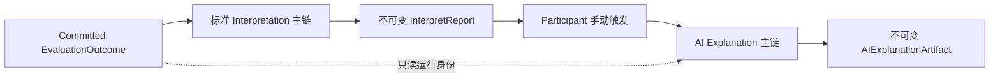
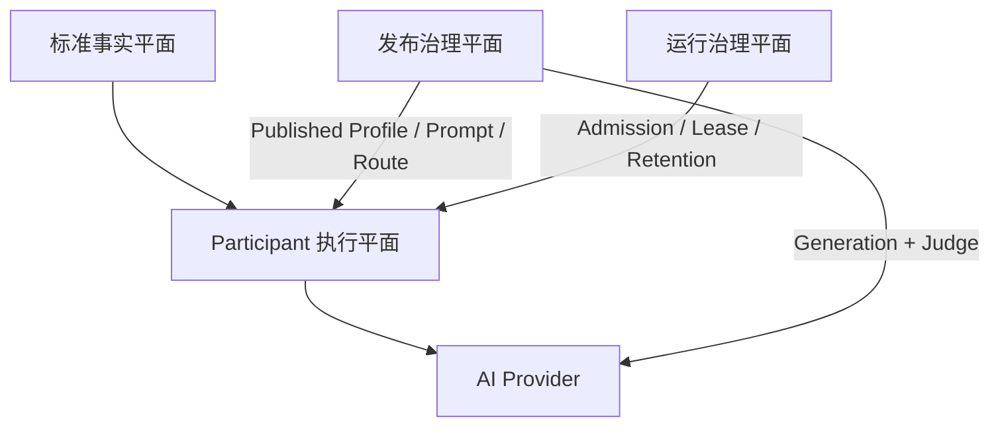

# 核心设计：AI 解读

> 当前状态：**代码发布候选，用户能力默认关闭，生产效果尚未验收**。v1 的机器契约、领域模型、Participant API、异步执行、OpenAI Adapter、Mongo 持久化、输出校验、在线评测、双角色人工审核、Profile 发布、容量治理和数据生命周期均已有仓库实现；尚缺真实模型评测、正式 Profile、真实身份与跨进程联调、分支 CI、灰度和生产运行证据。

## 本文回答

本文用于产品、研发、测试、安全和运维共同理解 AI 解读，重点回答：

1. AI 解读究竟解决什么问题，和标准解读是什么关系；
2. 为什么 v1 是一次性模型调用，而不是 Agent；
3. 模型接收哪些事实、产出什么内容，如何防止它越权“重新测评”；
4. `Generation`、`Run`、`Artifact`、`Profile` 为什么要分开；
5. 如何处理异步执行、幂等、外部调用不确定性、质量发布和人工审核；
6. 在线评测、容量治理和数据生命周期为什么值得保留；
7. 当前代码已经做到什么，距离真正上线还差什么；
8. 未来增加追问、更多用户数据、模型路由和独立 AI 服务时，现有设计如何演进。

## 30 秒结论

AI 解读不是第二套测评，也不是替代标准报告的“智能报告”。它是建立在**已提交 Outcome 和当前不可变标准报告**之上的可选补充能力：用户在看到标准结果后手动触发，系统冻结本次测评的结构化事实，进行一次受约束的模型调用，只允许生成跨维度综合洞察和低风险、结果相关的建议。

标准报告始终是唯一权威结果；AI 解读不能重新计分、重新分类、诊断、治疗或修改报告。模型输出必须通过结构、事实引用、Profile 策略和安全校验，才会成为独立的不可变 Artifact。AI 不可用、失败或从未触发，都不影响标准报告。

```text
已提交 Outcome + 当前不可变标准报告
                  │
                  ▼
       冻结 AIExplanationInput
                  │ 用户手动触发
                  ▼
       AIExplanationGeneration
                  │
                  ▼
        单次 AIExplanationRun
                  │
                  ▼
 Schema → 引用 → Profile → Safety
                  │
                  ▼
       AIExplanationArtifact
```

## 重点速查

| 主题 | 当前答案 | 状态 |
| --- | --- | --- |
| 结果权威 | 标准 Interpretation 报告；AI 仅补充说明 | 已实现 |
| 触发方式 | Participant 在标准报告可用后手动触发 | 已实现 |
| v1 范围 | `participant + scale + score_range + current_assessment_only` | 已实现 |
| AI 形态 | 一个 Run 一次 Provider 调用，不是 Agent | 已实现 |
| 核心输出 | 综合摘要、跨维度洞察、低风险建议、局限说明 | 已实现 |
| 事实约束 | 输出中的重要判断必须引用本次 Input 内事实 | 已实现 |
| 可靠性 | Outbox、lease、CAS、`result_unknown`、受控人工重试 | 已实现；待真实故障演练 |
| 质量发布 | 35 次生成、35 次独立模型裁判、70 条双角色人工复核 | 框架已实现；待真实执行 |
| Profile | 评测证据通过后才能发布，发布后不可原地修改 | 已实现；尚无生产 Profile |
| 成本与容量 | 到达层限流、日调用预算、活跃执行槽 | 已实现；待生产定标 |
| 数据生命周期 | 明确保留策略、终态 TTL、最小化导出 | 已实现；期限待审批 |
| 生产开关 | `ai_explanation.enabled=false` | 尚未开放 |

---

## 一、领域问题：为什么标准报告之外还需要 AI 解读

### 1. 标准报告擅长“准确表达”，AI 解读擅长“组合表达”

标准报告由确定性规则、模板和已发布模型资产生成，负责稳定表达：

- 总体结果是什么；
- 每个维度的分数、等级和标准含义是什么；
- 标准建议是什么；
- 结果使用边界是什么。

这条链路可复现、可审计，是测评结果的权威表达。但当报告包含多个维度时，用户仍可能有进一步的问题：

- 两个看似矛盾的维度如何同时理解；
- 哪些维度可能共同构成一种模式；
- 优势和关注点在什么情境下会相互影响；
- 标准建议很多，应该从哪个小步骤开始。

这正是 AI 解读的产品价值：**不发明新测评事实，而是组织已有事实之间的关系。**

### 2. 什么是“跨维度综合洞察”

一条合格的综合洞察不是把两个维度描述拼接在一起，而是说明它们之间的组合关系：

| 类型 | 含义 |
| --- | --- |
| `reinforcing_pattern` | 两个或多个维度可能共同强化某种表现 |
| `contrast_pattern` | 多个维度呈现差异，需要结合情境理解 |
| `combined_strength` | 多个维度共同形成可利用的优势 |
| `combined_attention` | 多个维度共同提示值得观察的日常情境 |
| `context_variation` | 结果可能随环境、任务或支持条件变化 |

v1 要求每条洞察至少引用两个不同的维度事实。总体结果、模型结果和标准建议可以作为辅助证据，但不能替代跨维度要求。

### 3. 为什么不能直接把原始分数交给模型

裸分数不天然具有“高、低、好、坏、风险”的方向含义。方向性必须来自已经发布并冻结的标准事实，例如：

- 标准等级与解释；
- 标准结论；
- 明确的常模上下文；
- 标准建议；
- 已提交 Outcome 的运行身份。

因此，AI 输入不是数据库字段拼盘，也不是原始答案全文，而是由服务端构造的**受控事实投影**。这既保护测评语义，也缩小了模型幻觉和隐私泄漏面。

### 4. 什么是“结果相关建议”

建议分为两类：

| 来源 | 约束 |
| --- | --- |
| `standard_derived` | 只能重组或改写本次报告中真实存在的标准建议，必须保留原方向并引用 source suggestion |
| `generated_low_risk` | 只能提供可选择、可撤销的日常观察、记录、沟通、环境调整或小步骤练习 |

AI 不得给出诊断、病因、用药、治疗方案、风险重分类、危机处置或效果承诺。建议的定位是“帮助用户理解和尝试”，不是专业决策替代。

---

## 二、产品边界：v1 做什么，不做什么

### 1. v1 支持范围

| 维度 | v1 决策 |
| --- | --- |
| 触发方式 | Participant 手动触发 |
| 前置条件 | 当前标准报告已经可靠提交 |
| 数据范围 | 当前一次测评 |
| Audience | `participant` |
| Model kind | `scale` |
| Decision kind | `score_range` |
| 输入事实 | 当前不可变标准报告及关联 Outcome 的必要运行身份 |
| 个性化 | locale 和最多三个受 Profile allowlist 控制的 focus area |
| 输出 | summary、integrated insights、suggestions、limitations |
| 调用方式 | 每个 Run 一次结构化 Provider 调用 |

对应机器事实源是 [AIExplanationInput v1](../../../api/schema/interpretation/ai-explanation-input-v1.schema.json)、[AIExplanationOutput v1](../../../api/schema/interpretation/ai-explanation-output-v1.schema.json) 和 [AIExplanationProfile v1](../../../api/schema/interpretation/ai-explanation-profile-v1.schema.json)。

### 2. v1 明确不做

- 多次测评趋势、跨报告比较和长期记忆；
- 原始答案、开放文本、聊天记录或互联网检索；
- 年龄、性别、职业、病史等额外用户画像；
- clinician audience；
- typology、behavioral rating、cognitive 等其他模型机制；
- 新分数、新等级、新风险分类或标准报告修正；
- 诊断、病因、治疗、用药或确定性未来判断；
- Tool Calling、规划、反思循环和自主多步执行；
- 自由文本降级、非法输出局部抢救或自动修复性 Prompt；
- `force regenerate`。相同语义请求复用已有运行或成品。

未来扩大范围必须发布新的契约、Profile、评测套件和发布证据，不能把 v1 的结论外推到其他数据或人群。

### 3. 它是不是 Agent

不是。Agent 通常拥有工具、环境反馈、状态记忆或自主迭代循环，而 v1 的执行边界是：

```text
冻结输入 → 渲染固定 Prompt → 调用模型一次 → 校验一次 → 结束
```

失败后创建新的 Run 是可靠性重试，不是 Agent turn。未来增加追问也不必自动等于 Agent：如果每次追问仍是“冻结上下文后调用一次”，它只是多轮对话；只有引入自主计划、工具选择、数据检索和迭代执行后，才需要按 Agent 系统治理。

---

## 三、系统定位：标准 Interpretation 与 AI Explanation 的关系



必须长期保护六条不变量：

1. 标准报告是唯一权威结果，AI Artifact 不是新的测评结论；
2. AI 只能读取已提交标准事实，不得重新计算 Outcome；
3. AI 失败不得回退 Assessment、Evaluation 或标准报告状态；
4. AI Artifact 不能覆盖、修订或阻断标准报告；
5. AI 不写入 `report_query_catalog`，不改变“当前标准报告”的查询语义；
6. 标准报告换版后，历史 AI Artifact 继续指向原始 source，不会静默重绑。

当前 source resolver 先通过 `report_query_catalog` 取得唯一当前 `SourceID`，再加载精确 `InterpretReport`，并按报告冻结的 `OutcomeID` 加载对应 Outcome。缺失、dangling、主体不一致或运行身份不一致一律 fail closed。查询历史 Generation 时返回 `current|stale|unavailable|unknown`，让客户端明确知道成品是否仍基于当前报告。

---

## 四、总体架构：四个相互分离的平面

### 1. 事实平面

标准 Interpretation 和 EvaluationOutcome 提供已提交事实。AI 子域只能建立只读投影，不能回写结果。

### 2. Participant 执行平面

负责授权、能力判断、手动请求、异步执行、状态查询、Artifact 展示和本人数据导出。

### 3. 发布治理平面

负责 Prompt/Profile 候选、合成在线评测、独立模型裁判、双角色人工审核和 Profile 发布。它决定“什么组合有资格服务用户”，但不自动开放能力。

### 4. 运行治理平面

负责日预算、并发槽、lease recovery、受控重试、TTL、指标和审计。它约束成本与故障影响范围。



这种分层让治理能力可以随代码一起部署，但按阶段启用；质量评测、用户请求和标准报告不会混成一个状态机。

---

## 五、三份核心机器契约

### 1. AIExplanationInput v1：模型可以知道什么

完整服务端 Input 由四部分组成：

| 部分 | 内容 | 发送给 Provider |
| --- | --- | --- |
| `source` | report/outcome 身份、报告模板、内容 Schema、Builder、生成时间 | 否 |
| `profile` | Profile ID、版本和指纹 | 否 |
| `context` | 当前测评范围、participant、locale、受控 focus areas | 是 |
| `facts` | 模型/决策身份、总体结果、维度、标准建议、可选模型结果 | 是 |

Provider 顶层只能收到：

```json
{
  "context": {},
  "facts": {}
}
```

ReportID、OutcomeID、AssessmentID、TesteeID、UserID、OrgID、鉴权信息、Provider 配置、原始答案和历史测评不得进入 Provider payload。

完整 Input 会以规范 JSON 冻结为 `InputSnapshot` 并计算 SHA-256 指纹。一个 Generation 的所有 Run 必须复用同一快照；重试时不能重新读取当前报告、Profile 或 focus areas，否则“重试”会悄悄变成另一次语义请求。

### 2. AIExplanationOutput v1：模型可以说什么

Provider 必须返回一个严格 JSON 对象，不接受 Markdown 围栏、额外说明或自由文本 fallback。

| 字段 | 语义 |
| --- | --- |
| `summary` | 概括多个维度的整体关系，不逐项复述 |
| `integrated_insights` | 跨维度关系，每项携带可解析 evidence refs |
| `suggestions` | 结果相关、低风险、可选择和可撤销的行动建议 |
| `limitations` | 明确数据范围和非诊断边界 |

Artifact 创建前依次执行：

```text
单一 UTF-8 JSON 对象
  → Typed Output Schema
  → Evidence ref 完整性
  → Profile 数量、类型、层级与建议策略
  → 确定性安全规则
  → AIExplanationArtifact
```

任何一步失败都不能将部分文本发布给用户。

### 3. AIExplanationProfile v1：系统允许如何解释

Profile 是服务端发布策略，不是 Prompt 文案，也不发送给 Provider。它定义：

- selector：固定为 `participant + scale + score_range`，可选 model code/version；
- eligibility：允许的维度、最少/最多维度和溢出策略；
- input policy：常模、模型结果、focus area 与父子维度规则；
- insight policy：洞察类型、数量、每项维度引用范围；
- suggestion policy：来源、类别、数量、actions 和引用要求；
- safety policy：禁止主张、规则版本和 disclaimer 版本；
- generation policy：Prompt、逻辑 Provider route、Schema 与最大输出长度。

生命周期固定为：

```text
draft → published → disabled
```

解析优先级固定为：

```text
model code + version 精确匹配
  > model code 默认版本
  > model kind + decision kind 默认
```

同一优先级多个 published Profile 必须拒绝执行。发布后策略内容不可原地修改；新 Prompt、规则或路线需要新版本和新指纹。`disabled` 只阻止新生成，不破坏历史 Artifact 的审计。

跨对象、运行时和错误分类规则见 [AI 解读契约验证矩阵](../../../api/schema/interpretation/ai-explanation-contract-validation-matrix.md)。

---

## 六、领域模型：为什么不能只有一张“AI 解读表”

### 1. 核心模型

| 模型 | 回答的问题 | 关键不变量 |
| --- | --- | --- |
| `AIExplanationGeneration` | 用户要的是哪一份语义结果，目前处于什么状态 | 冻结 source、audience、Input、Profile、Prompt 和 Provider execution spec |
| `AIExplanationRun` | 某一次外部调用尝试发生了什么 | 一个 Run 最多调用 Provider 一次；记录 lease、invocation phase、receipt 和失败 |
| `AIExplanationArtifact` | 哪次合法 Run 产生了什么可展示成品 | 不可变；绑定 source provenance、所有版本收据和校验结果 |
| `AIExplanationProfile` | 哪类报告允许怎样解释 | 版本化发布、确定性解析、发布后不可变 |
| `InputSnapshot` | 重试使用的事实是否完全一致 | 规范 JSON、Schema 版本和指纹稳定 |
| `Output Content` | 可展示内容的合法领域形态是什么 | 类型、引用和最小内容成立 |
| `PromptEvaluationRun` | 某个发布候选是否有足够质量证据 | 冻结完整 release identity，证据只追加，不覆盖失败 |

### 2. Generation、Run、Artifact 的区别

这是整个模型最重要的分离：

- `Generation` 是用户语义意图，相同事实和发布组合应当复用；
- `Run` 是执行尝试，超时或失败后可以有新 attempt；
- `Artifact` 是通过全部验证后的成品，只能由成功 Run 创建。

如果三者合并，系统会难以区分“用户重复点击”“同一任务重试”“新模型重新生成”和“已有合法成品”，幂等、计费和审计都会失真。

### 3. Generation 语义幂等键

```text
SourceReportID
+ Audience
+ Profile(ID, Version, Fingerprint)
+ InputFingerprint
+ ProviderExecutionSpecFingerprint
```

Actor、trace 和 request ID 不进入语义键。focus areas 已在 InputSnapshot 中，因此自然影响 `InputFingerprint`。

### 4. 状态机

Generation：

```text
pending → generating → generated
                    ↘ failed → generating（受控新 Run）
```

Run：

```text
pending → running/prepared → dispatching → response_received → succeeded
                              └───────────→ result_unknown / failed
```

Artifact 没有“半成品”状态。只有全部验证通过后，才在成功事务中创建不可变 Artifact。

---

## 七、端到端运行链路

### 1. 手动请求

Participant 外部入口位于 collection-server：

- `GET /api/v1/assessments/{id}/ai-explanation/capability`；
- `POST /api/v1/assessments/{id}/ai-explanations`；
- `GET /api/v1/assessments/{id}/ai-explanations/{generation_id}`；
- `GET /api/v1/ai-explanations/export`。

请求链路按以下顺序执行：

1. 验证 Participant 身份和 Assessment 访问权；
2. 解析当前标准报告及冻结 Outcome；
3. 解析匹配的 published Profile；
4. 组装并校验 InputSnapshot；
5. 解析冻结 PromptPackage 和 ProviderExecutionSpec；
6. 按语义键复用或创建 Generation；
7. 原子提交容量预留、Generation 和 requested Outbox；
8. 立即返回 `pending`、已有状态或已有 Artifact。

未发布 Profile 时返回 `profile_unresolved`；功能关闭时稳定返回 `not_applicable / feature_disabled`。两种情况都不会影响标准报告。

### 2. 异步执行

```text
requested Outbox
  → qs-worker
  → internal AIExplanationAutomation gRPC
  → claim Run lease + active slots
  → 持久化 dispatching
  → OpenAI Responses 单次调用
  → 持久化 response receipt
  → Output / refs / Profile / Safety 校验
  → 原子提交 Artifact + Run + Generation + terminal Outbox
```

终态成功和失败都是 AI 子域事实，不会回写标准报告状态。

### 3. 查询与 stale 语义

查询前再次鉴权，随后读取 Generation 和 Artifact。响应同时包含 source state：

- `current`：仍基于当前标准报告；
- `stale`：标准报告已换版，成品仍可追溯但不是当前来源；
- `unavailable`：无法确定当前来源；
- `unknown`：历史数据不足以作出判断。

系统不会为了“看起来最新”而把历史 Artifact 静默绑定到新报告。

---

## 八、最难的可靠性问题：Provider 调用不能和数据库原子提交

Mongo 事务无法包住一次外部 OpenAI 调用。典型风险是：Provider 已经收到请求并可能计费，但进程在保存响应前崩溃。

因此 Run 使用稳定 `InvocationID`，并在发送请求前持久化 invocation phase：

- `prepared` 阶段 lease 过期：可以安全重新认领；
- `dispatching` 之后：只有 Provider route 明确承诺同一 InvocationID 幂等重放，才能自动重发；
- Provider 不支持幂等重放或按 InvocationID 查询：必须进入 `result_unknown`，不能盲目调用第二次。

当前 OpenAI route 不声明上述能力。因此 `result_unknown` 是正确的业务状态，不是一个待“自动修复”的异常。

Participant 的人工恢复要求机构管理员提交：

- 失败 attempt；
- 稳定 `request_id`；
- 审计理由；
- 一次额外调用成本确认；
- 对 `provider_result_unknown` 显式接受潜在重复调用和计费风险。

授权、下一 attempt 的日预算和 retry Outbox 必须同事务提交。业务 attempt 硬上限为 3，v1 不做自动 retry。

周期 lease scanner 只发现和唤醒，不直接调用 Provider、不创建新 attempt、不扩大预算。旧事件必须携带与 Run 当前证明完全匹配的 checkpoint，状态已推进时幂等结束。

---

## 九、持久化与事务边界

AI 解读使用独立 Mongo 集合保存 Generation、Run、Artifact、Profile、评测证据、日预算、活跃槽和恢复治理记录；不复用标准报告状态表。

关键原子边界：

1. **首次请求**：三层日预算预留 + Generation + requested Outbox；
2. **开始执行**：三层活跃槽 + Run claim/lease + Generation `generating`；
3. **执行成功**：Artifact + Run `succeeded` + Generation `generated` + 槽释放 + generated Outbox；
4. **执行失败**：Run `failed` + Generation `failed` + RetryDecision + 槽释放 + failed Outbox；
5. **评测启动**：完整调用预算 + PromptEvaluationRun + first-step Outbox；
6. **评测步进**：attempt checkpoint/证据 + next-step Outbox。

领域写入和 Outbox 在同一 Mongo 事务提交，提交后只发送加速提示。MQ 重投依靠稳定事件身份和状态机幂等，不依赖“消息只发送一次”。

索引与迁移由 Mongo migration 25～32 管理，覆盖运行集合、评测证据、日预算、活跃槽、人工重试、TTL 和数据主体导出。专用 Replica Set 集成测试入口验证事务回滚、唯一约束、冷启动 Schema 和 TTL Monitor；当前仍需要分支 CI 的实际运行证据。

---

## 十、Prompt、Provider 与发布身份

### 1. Prompt 不是运行时随手拼接的字符串

[Prompt Template v1](../../../api/schema/interpretation/ai-explanation-prompt-template-v1.md) 是设计和审阅载体；运行时使用编译期 `PromptPackage`。测试会核对：

- template ID 和 version；
- 规范文本；
- SHA-256 指纹；
- Git blob SHA；
- 占位符 allowlist；
- Input/Output Schema 版本。

渲染器只将受控 Profile、locale 和 focus-area JSON 写入任务指令，`context + facts` 始终作为独立 data block。未知或未解析占位符直接拒绝执行。

### 2. Profile 只引用逻辑 Provider Route

Profile 不保存供应商名、模型 ID、Endpoint 或密钥，只保存逻辑 route。运行时解析为冻结的 `ProviderExecutionSpec`，记录实际 Provider、模型、route revision 和指纹。

这样可以在不修改业务 Profile 语义的情况下治理基础设施，但 route 的实际解析发生变化时会改变执行指纹，从而形成新的 Generation 语义身份和发布证据要求。

### 3. 每次运行冻结完整发布组合

可审计发布身份至少包括：

```text
Input Schema
+ Output Schema
+ Profile
+ PromptPackage
+ ProviderExecutionSpec
+ Safety validator versions
```

评测证据和用户 Artifact 都必须指向这组精确版本，不能用“Prompt 大致相同”或“模型系列相同”替代。

---

## 十一、质量治理：为什么要在线评测、模型裁判和人工审核

### 1. 发布对象不是一段 Prompt，而是一组 Release Identity

模型输出质量同时受 Input、Profile、Prompt、模型、解码参数和安全规则影响。因此评测不能只回答“这段 Prompt 好不好”，而要回答：

> 这组被冻结的发布组合，是否有足够证据服务这个明确的 Profile selector？

### 2. v1 评测规模

[Evaluation Cases v1](../../../api/schema/interpretation/ai-explanation-prompt-evaluation-cases-v1.json) 固定：

- 7 个生成 case；
- 每个 case 重复 5 次，共 35 个候选输出；
- 每个输出最多调用 1 次独立 semantic evaluator，共 35 次；
- 1 个必须在 Provider 调用前拒绝的 preflight case；
- 每个候选要求两个不同角色人工复核，共 70 条 review。

最多 70 次 Provider 调用是成本上限，不是“跑到通过为止”的重试预算。

### 3. 三层质量证据

| 层 | 负责判断 | 例子 |
| --- | --- | --- |
| 确定性校验 | 机器可以明确判断的规则 | JSON、引用、禁止维度组合、必须包含/禁止包含 |
| 独立模型裁判 | 需要语义理解的质量维度 | 忠实度、跨维度质量、建议可行动性、受众清晰度、简洁性 |
| 双角色人工审核 | 领域和产品责任 | `assessment_semantics` 与 `safety_product` |

同一审核人不能同时满足两个角色。失败 attempt、缺失裁判、审核分歧或未完成 inventory 都不能被覆盖或忽略。

### 4. Profile 发布门禁

`PromptEvaluationRun` 状态为：

```text
collecting → awaiting_review → approved | rejected
          └→ canceled（仅 Provider 尚未 dispatch）
```

只有 approved 证据与待发布 Profile 的 Profile/Prompt/Schema/Route release identity 完全一致，并且 published selector slot 不冲突时，才允许 `draft → published`。评测完成不会自动发布 Profile，Profile 发布也不会自动打开全局功能开关。

管理面位于 `/internal/v1/interpretation/ai-explanation`，操作者身份只来自可信 JWT。读取证据要求审计能力；启动、恢复、取消、review、finalize 和 Profile 生命周期操作还要求机构管理员能力。请求体不能伪造 reviewer 或 actor。

---

## 十二、容量治理：把成本限制建模为业务事实

### 1. Participant 三层保护

| 层次 | 目的 | 当前配置起点 |
| --- | --- | --- |
| collection-server token bucket | 到达层削峰 | global `20 QPS / burst 40`；user `0.2 QPS / burst 2` |
| UTC 日调用预算 | 限制可产生的 Provider 调用 | org/user/assessment `500/5/3` |
| 活跃执行槽 | 限制真实在途外部调用 | org/user/assessment `10/2/1` |

日预算按“可能发生一次外部调用”预留，不按最终成功收费。已有语义 Generation 的复用不重复扣减；人工 retry 是新的外部调用，需要新预算。

活跃槽在真正开始 Run 时获取，并在成功或失败终态事务中释放。进程崩溃、超时或 `result_unknown` 期间不能提前释放，因为外部副作用可能仍在发生。

### 2. Prompt 评测容量

v1 每个评测 Run 保守预留 70 次调用；同一机构最多一个 collecting Run。默认日预算 140，必须是 70 的正整数倍。取消、失败或 `result_unknown` 不退款，因为系统无法可靠证明外部调用未发生。

这些默认值只是功能关闭时的安全起点，不是生产容量结论。正式上线前需要结合目标机构规模、模型价格、实际 token 和灰度结果重新定标。

---

## 十三、数据生命周期、隐私与数据主体权利

### 1. 数据最小化

v1 保存：

- 受机器契约约束的规范 InputSnapshot；
- 通过全部校验的结构化 Artifact；
- 必要的版本、指纹、状态、Provider receipt 和审计记录。

v1 不保存：

- 原始答案或历史测评；
- 渲染后的完整 Prompt；
- Provider 原始响应正文；
- API Key 或鉴权信息；
- 不受控用户画像。

### 2. 不引入应用层“数据密钥”

v1 不维护自制对称数据密钥。Mongo、磁盘和备份静态加密属于部署基础设施责任。如果未来独立 AI 服务、法规或威胁模型要求字段级加密，应单独设计 KMS、信封加密、轮换、恢复和审计，而不是在当前功能中引入无人负责的密钥生命周期。

### 3. 明确保留期和 TTL

`ai_explanation.enabled=true` 时必须配置带版本的 lifecycle policy，以及三类正保留期：

- Participant 终态记录；
- Prompt 评测终态证据；
- UTC 日容量账本。

终态写入 `expires_at + retention_policy_version`，Mongo 使用 `expireAfterSeconds=0` TTL index。运行中记录和活跃槽不进入 TTL。启动扫描发现缺少合法生命周期元数据的历史终态记录时 fail closed，要求先离线 backfill，避免旧数据永久残留。

当前 qs-server 没有 Testee 删除业务，因此 AI v1 也不虚构 Testee 擦除状态机。当前责任是保留期限、TTL、数据最小化、授权访问和数据主体导出；未来若产品引入删除权，应作为跨域业务能力单独设计。

### 4. 数据主体导出

`GET /api/v1/ai-explanations/export` 只导出 Participant 最终 Artifact、标准来源和发布版本收据，不导出 InputSnapshot、Prompt、内部 Run、Outbox、Provider request、token/延迟或容量账本。分页使用首页固定 snapshot 和稳定 keyset；上游不可用时返回 503，不把故障伪装成空数据。

---

## 十四、安全与可观测性

### 1. 安全边界

- 先授权 Participant 与 Assessment，再读取能力、状态或 Artifact；
- Provider 只接收最小化 `context + facts`；
- 完整 Input、Prompt 渲染、Provider 原始输出和 Artifact 正文不得进入生产日志；
- 指标 label 不得包含 Org、Assessment、Testee、Report、Profile 自由值或 Provider request ID；
- Profile、Prompt、Route 和 validator 都必须带版本收据；
- 七类禁止主张不能由具体 Profile 放宽；
- 输出校验失败只能成为失败事实，不能成为用户可见成品。

### 2. 观测模型

当前指标覆盖：

- 请求、复用、准入拒绝和终态；
- 排队时间、端到端时延和活跃槽；
- Provider 调用结果、延迟和输入/输出 token；
- Output/Profile/Safety 校验结果和时延；
- lease recovery、人工 retry 和 `result_unknown`；
- Prompt 评测启动准入、调用预留和恢复结果。

所有 label 使用代码内固定低基数枚举。Mongo ledger 是日预算和活跃槽的精确事实；Prometheus 累计指标只用于趋势、告警和容量分析，不能用作余额或计费裁决。

仍待补齐生产 SLO、告警部署、金额成本视图、脱敏 trace 和 kill-switch 演练。

---

## 十五、当前实现状态与证据边界

| 能力 | 状态 | 已有证据 | 仍不能证明 |
| --- | --- | --- | --- |
| Input/Output/Profile 契约 | 已实现 | strict JSON Schema、契约测试、v1 范围 gate | 真实模型输出质量 |
| 领域模型与状态机 | 已实现 | Generation/Run/Artifact/Profile/Evaluation 单测 | 生产并发行为 |
| Participant 主链 | 已实现 | REST/gRPC、授权边界、Outbox/Worker、查询与导出单测 | 客户端 UX 和跨进程预发 |
| OpenAI Adapter | 已实现但未实调 | Responses API 请求、Structured Output、错误/大小/超时分类测试 | 模型兼容性、质量、供应商保留和真实成本 |
| 输出校验与 Safety | 已实现首版 | typed JSON、ref、Profile、确定性规则单测 | 真实内容忠实度与人工安全结论 |
| 在线评测与审核 | 已实现框架 | 35+35 编排、证据 CAS、70 条双角色 gate、管理 API 单测 | 真实 Provider、真实 reviewer 和 approved run |
| Profile 治理 | 已实现 | draft/publish/disable、发布门禁和唯一 selector slot | 已发布生产 Profile |
| 容量治理 | 已实现 | 日预算、活跃槽、限流和治理查询单测 | 实际价格和竞争定标 |
| 数据生命周期 | 已实现框架 | retention policy、TTL migration、导出索引与测试入口 | 正式期限、backfill、备份恢复和真实 TTL 运行 |
| Mongo 事务 | 测试入口已实现 | Replica Set integration tests 已接入 CI | 当前分支尚无实际 CI 结果 |
| 生产启用 | 未完成 | 默认关闭、缺少配置时 fail closed | 灰度、SLO、告警和生产可用性 |

### 别说过头

- “全仓单元测试通过”不等于“Mongo 事务和 TTL 已在真实 Replica Set 通过”；
- “OpenAI Adapter 已实现”不等于“选定模型已兼容当前 Schema”；
- “评测框架已实现”不等于“当前 Prompt/Profile 已通过评测”；
- “管理 API 已实现”不等于“管理面真实身份已经联调”；
- “代码可部署”不等于“功能可以对用户开放”。

---

## 十六、发布阶梯：代码发布和用户开放不是同一个门槛

```text
RC0 代码收口
  → RC1 enabled=false 部署
  → RC2 内部真实评测
  → RC3 Profile 发布
  → RC4 小流量用户灰度
  → GA 正式开放
```

### RC0：代码可审查

- v1 契约、领域和运行时范围一致；
- 生成物无漂移；
- 全仓测试、文档门禁和静态检查通过；
- AI 改动整理为纯净、可审查提交并同步最新 main；
- 分支 CI 的 Mongo Replica Set 集成测试通过。

### RC1：关闭态部署

- 保持 `ai_explanation.enabled=false`；
- 验证 migration、进程启动、关闭态 capability 和标准报告无回归；
- 验证 AI 子系统未配置时不会阻断 Interpretation。

### RC2：内部真实评测

- 配置 OpenAI API Key、生成模型、独立裁判模型和明确 lifecycle policy；
- 验证选定模型接受当前 Structured Output Schema；
- 执行 35 次生成和最多 35 次独立模型裁判；
- 完成 70 条双角色人工审核；
- 检查质量、延迟、token、拒绝、限流和 `result_unknown`。

### RC3：发布 Profile

- 评测 Run 为 approved；
- Profile/Prompt/Schema/Route release identity 完全一致；
- 发布首个 Profile，但仍不自动开放全局流量。

### RC4 与 GA

- 完成客户端按钮、轮询、stale/failed UX 和免责声明；
- 小机构、小流量灰度；
- 验证容量、成本、告警、回滚和数据生命周期；
- 达到正式 SLO 后再扩大开放。

---

## 十七、关键设计取舍

### 1. 为什么第一版放在 qs-server

v1 依赖当前标准报告、Outcome provenance、Participant 授权、Mongo 事务 Outbox 和现有 Worker。放在 qs-server 可以用最短路径保护这些不变量，降低首次验证的跨服务复杂度。

代价是 AI Prompt、模型路由和质量治理会与测评服务一起发布。第一版接受这个代价，但通过 Provider/Prompt/Profile ports、冻结 release identity 和独立子域，避免把 OpenAI SDK 或 Prompt 逻辑渗透到标准 Interpretation。

### 2. 为什么治理能力第一版就保留

在线评测、人工审核、容量和生命周期看起来超过“调用一次模型”的最小代码量，但它们分别控制四种真实风险：

- Prompt/模型变化造成的质量回归；
- 测评语义和安全内容无法只靠 Schema 判断；
- 外部模型成本与并发失控；
- 用户事实、生成内容和评测证据无限期保留。

这些能力默认关闭，不增加标准报告主链的运行负担，却让 AI 功能具备可发布、可审计和可停止的边界。

### 3. 为什么不自动发布 Profile

模型裁判只能提供辅助证据，不能替代领域责任人。评测 approved 和 Profile publish 分开，可以让“证据是否通过”和“组织是否决定上线”分别留下审计记录。

---

## 十八、未来演进

### 1. 什么时候应该独立成 AI 服务

出现以下任一趋势时，应评估把 AI 运行与治理能力从 qs-server 拆出：

- Prompt、模型和路由发布频率显著高于测评服务；
- 增加多轮追问、长期会话或更多数据源；
- 不同问题需要不同模型，或者一个问题需要多个候选模型；
- AI 团队需要独立容量、SLO、成本和发布节奏；
- Provider、地区、合规或数据边界需要单独部署。

拆分时，qs-server 仍应拥有测评事实、授权和标准报告；AI 服务拥有 Prompt、模型路由、对话和生成治理。边界不应退化成“发送一个 report ID 让 AI 自己查库”。推荐的演进方式是：

```text
qs-server
  → 授权并冻结最小化 AIExplanationInput
  → Outbox 发布 AIExplanationRequested

AI Service
  → 验证契约与 release identity
  → 执行模型/路由/会话策略
  → 发布 AIExplanationGenerated | AIExplanationFailed

qs-server 或独立 Read API
  → 按业务授权展示结果
```

事件必须携带稳定请求身份、Input/Profile/Prompt/Route 版本或可验证引用，而不是模糊的“请 AI 回答这个用户”。

### 2. 增加追问

追问会引入新的领域对象，而不是给 `AIExplanationRun` 增加一段字符串：

- `Conversation`：会话属于谁、基于哪个 Artifact；
- `Turn`：用户问题、冻结上下文和模型回答；
- `ContextPolicy`：每一轮允许读取哪些事实；
- `ConversationProfile`：可回答范围、拒答与安全策略；
- 独立的成本、保留期和终止机制。

如果系统只按每轮冻结上下文并调用一次模型，它仍可以是受控对话；如果加入检索、工具、计划和循环，再升级为 Agent 架构和相应评测。

### 3. 读取更多用户数据

更多数据不能直接拼入 Prompt。需要先建立：

- 明确目的和用户授权；
- 数据源 allowlist；
- provenance、freshness 和可撤回边界；
- 每个字段的必要性与敏感级别；
- `ContextSnapshot` 及其版本/指纹；
- 跨数据源引用和输出忠实度评测；
- 更严格的保留、导出和删除策略。

历史测评趋势应成为新的专业能力和契约版本，而不是悄悄扩大 `current_assessment_only`。

### 4. 多模型路由和多模型协作

现有 `ProviderExecutionSpec` 已为模型路由留下接缝。未来可以引入版本化 `RoutingPolicy`，按问题类型、风险、语言、成本和延迟选择模型。

如果一个问题需要多个模型，应显式建模：

```text
Request
  → Candidate Runs（一个或多个模型）
  → Judge / Rank
  → 可选 Synthesis
  → Final Artifact
```

候选、裁判和综合必须分别记录模型、Prompt、成本、证据和失败，不能伪装成一次 Run。多模型方案也必须有调用上限，不能以“质量优化”为由无限扩张成本。

---

## 十九、对外宣讲时的常见问答

### Q1：AI 会不会改变测评结果

不会。标准报告是唯一权威结果；AI 只能解释已经提交的事实，不能重新计分、分类或回写报告。

### Q2：为什么不用一个 Prompt 直接调用模型

因为真正需要治理的是完整发布组合、异步副作用、事实引用、质量证据、成本和数据生命周期。Prompt 只是其中一个版本化组件。

### Q3：为什么 AI 输出还要引用证据

引用把“模型说了什么”连接回“本次测评有哪些事实”，使系统能够机器校验、防止引用不存在的维度，也让人工审核可以追溯。

### Q4：为什么要人工审核 70 次

35 个候选输出分别从测评语义和安全产品两个独立责任视角审核。固定 inventory 防止只挑选好结果，双角色防止单一视角替代完整发布责任。

### Q5：已经支持追问了吗

没有。v1 是一次性补充解读。追问、多数据源、模型路由和独立 AI 服务属于明确的后续演进，不应描述为当前能力。

---

## 二十、事实源与验证入口

| 主题 | 事实源 |
| --- | --- |
| Input / Output / Profile | [机器契约目录](../../../api/schema/interpretation/) |
| Prompt | [Prompt Template v1](../../../api/schema/interpretation/ai-explanation-prompt-template-v1.md) |
| Prompt 评测 | [Prompt 验证矩阵](../../../api/schema/interpretation/ai-explanation-prompt-validation-matrix.md)、[Semantic Evaluator Prompt](../../../api/schema/interpretation/ai-explanation-semantic-evaluator-prompt-v1.md)、[evaluation application](../../../internal/apiserver/application/interpretation/aiexplanation/evaluation/) |
| 领域模型 | [domain/interpretation/aiexplanation](../../../internal/apiserver/domain/interpretation/aiexplanation/) |
| Application | [application/interpretation/aiexplanation](../../../internal/apiserver/application/interpretation/aiexplanation/) |
| Provider / Prompt / Safety | [infra/aiexplanation](../../../internal/apiserver/infra/aiexplanation/) |
| Mongo Repository | [infra/mongo/interpretation/aiexplanation](../../../internal/apiserver/infra/mongo/interpretation/aiexplanation/) |
| Participant REST | [collection AI explanation handler](../../../internal/collection-server/transport/rest/handler/ai_explanation_handler.go) |
| Participant / Automation gRPC | [interpretation.proto](../../../api/grpc/proto/interpretation/interpretation.proto) |
| Worker | [AI explanation handler](../../../internal/worker/handlers/ai_explanation_handler.go) |
| 配置与启用门禁 | [AI explanation options](../../../internal/apiserver/options/ai_explanation.go) |
| Mongo migration | [Mongo migration 目录](../../../internal/pkg/migration/migrations/mongodb/) |
| 标准报告冻结输入 | [冻结输入、Builder 与模板路由](./21-核心设计-冻结输入、Builder与模板路由.md) |
| 标准报告可靠提交 | [状态、幂等、重试与可靠提交](./22-核心设计-状态、幂等、重试与可靠提交.md) |
| 标准报告成品 | [报告成品、版本与数据一致性](./23-核心设计-报告成品、版本与数据一致性.md) |
| 标准报告查询授权 | [查询模型、授权与 Audience 投影](./24-核心设计-查询模型、授权与Audience投影.md) |

仓库级验证：

```bash
go test -count=1 ./internal/pkg/contract
go test -count=1 ./internal/apiserver/domain/interpretation/aiexplanation/...
go test -count=1 ./internal/apiserver/application/interpretation/aiexplanation/...
go test -count=1 ./internal/apiserver/infra/aiexplanation/...
go test -count=1 ./internal/apiserver/infra/mongo/interpretation/aiexplanation
go test -run '^$' -tags integration ./internal/apiserver/infra/mongo/interpretation/aiexplanation ./internal/pkg/migration
make docs-check
git diff --check
```

真实 Mongo 行为必须在明确授权的隔离 Replica Set 上运行专用 integration tests。没有测试 URI、测试被跳过或只有编译通过，都不能记作事务与 TTL 通过。真实模型质量也必须由冻结评测套件、独立裁判、双角色人工审核和生产灰度共同证明。
