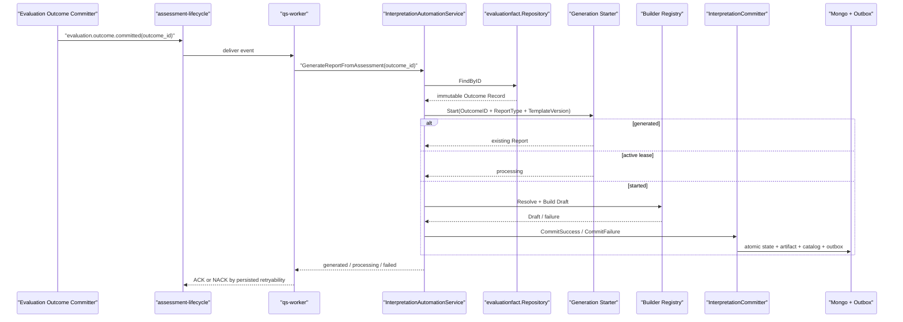

# 关键链路：Outcome 驱动报告生成

## 1. 本文回答

本文从 `evaluation.outcome.committed` 开始，跟踪 Worker、internal gRPC、Outcome adapter、Generation Starter、Builder Registry、Committer 和终态事件，说明报告如何生成以及消息何时 ACK/NACK。

## 2. 30 秒结论



整条链路的稳定输入是 Outcome ID，不是 Assessment 可写对象，也不是 Worker 事件 payload 里的一份大报告数据。

## 3. 阶段一：Evaluation 发布已成立事实

Evaluation 只在下列事实已在 MySQL 成功提交后发布 `evaluation.outcome.committed`：

- canonical EvaluationOutcome Record；
- 可选 assessment_score 投影；
- Assessment evaluated；
- EvaluationRun succeeded；
- 对应 MySQL outbox event。

事件 payload 携带 AssessmentID、OutcomeID、EvaluationRunID、OrgID 和 TesteeID 等关联信息。Interpretation 真正的输入仍以 OutcomeID 重读 canonical Record，不把事件 payload 当报告事实库。

## 4. 阶段二：Worker 验证事件并传递 trace

`handleEvaluationOutcomeCommitted` 做四件事：

1. 解析标准 event envelope 和 `EvaluationOutcomeCommittedData`；
2. 校验 InterpretationAutomationClient 已装配、AssessmentID 可转换、OutcomeID 非空；
3. 把当前 event ID 放入 gRPC metadata `x-event-id`；
4. 只传 OutcomeID 调用 `GenerateReportFromOutcome`。

AssessmentID 校验用于拦截损坏事件，但 gRPC 生成命令的主键是 OutcomeID。

## 5. 阶段三：gRPC 进入 Automation 行为人用例

`InterpretationAutomationService.GenerateReportFromAssessment` 的 RPC 名仍保留 Assessment 语言，但当前契约必填字段是 `outcome_id`，`assessment_id` 已不参与执行。

Transport：

- 校验 OutcomeID 格式；
- 以 `TrustedServiceActor("internal-grpc")` 进入 Automation Service；
- 从 gRPC context 提取 trace；
- 对已持久化失败返回 safe response，不把内部错误链暴露给 Worker。

`GenerateReportFromAssessmentRequest.assessment_id` 目前是兼容字段；新调用方不应依赖它来选择 Outcome。

## 6. 阶段四：重读 Outcome 并映射冻结输入

Automation Service 通过 `evaluationfact.Repository.FindByID` 读取不可变 Record，然后 `FromOutcomeRecord` 执行：

```text
DecodeExecution(record)
  + DecodeReportInput(record)
  + model/runtime identity normalization
  + Association copy
  + mechanism-specific fact mapping
  -> InterpretationInput
```

关键校验：

- codec 未知 schema 直接失败；
- schema v2 typology code 必须能在冻结 ReportInput 中解析；
- `ExecuteOutcome` 再次校验 InterpretationInput.OutcomeID 与 Record.ID 一致。

这一阶段不会产生 Generation，因此输入解码在进入 Executor 前失败时，不一定已有 Interpretation 生命周期事实。

## 7. 阶段五：Starter 争抢 Generation / Run

Executor 从 InterpretationInput 构造 Generation Key：

```text
OutcomeID + ReportType + TemplateVersion
```

Starter 返回三种结果：

| StartStatus | 语义 | Executor 处理 |
| --- | --- | --- |
| `generated` | 相同键已有成品 | 直接返回已有 Report |
| `processing` | 相同键有 active lease | 返回 Generation + Run，不再构建 |
| `started` | 当前调用已 claim 新 Run | 继续解析 Builder 和构建 |

claim 事务与 Builder 执行分开：Mongo 事务只保护短时状态写，不跨越整个报告构建时间。

## 8. 阶段六：解析 Builder 并构建 Draft

`rendering.KeyFromInput` 生成完整机制键，Registry 在同 TemplateVersion 内按从精确到宽泛的 candidates 查找 Builder。

| 分支 | 结果 |
| --- | --- |
| 无法生成路由键 | CommitFailure(input, non-retryable) |
| 无 Builder | CommitFailure(template, non-retryable) |
| Builder error | 记录原始 error + generation/run/trace/builder，持久 build retryable failure |
| nil Draft | 持久 build retryable failure |
| Draft 成功 | 构造 InterpretReport |

Builder 失败日志保留内部原因，Run.Failure 只保留安全、可分类原因。这是观测与对外契约的边界。

## 9. 阶段七：构造并可靠提交成品

Executor 为 Draft 分配 ReportID，并固化：

- GenerationID / OutcomeID / RunID；
- OrgID / AssessmentID / TesteeID；
- ReportType / TemplateVersion；
- Draft Content / GeneratedAt。

Artifact 领域校验失败被归类为 non-retryable `invalid_artifact`。成功则进入 Committer，一个 Mongo 事务写入：

```text
InterpretReport
+ report_query_catalog projection
+ Run succeeded
+ Generation generated
+ interpretation.report.generated outbox
```

事务失败时不返回伪成功 Report，Worker 将该未分类基础设施错误当作可重试。

## 10. 阶段八：gRPC 回执与 Worker settlement

| Automation 结果 | gRPC 回执 | Worker |
| --- | --- | --- |
| 新成功或已有成品 | `success=true, generated` + GenerationID/ReportID | ACK |
| 其他 worker 持有 active lease | `success=true, processing` + GenerationID/RunID | ACK |
| 已持久 non-retryable failure | `success=false, failed, retryable=false` | ACK |
| 已持久 retryable failure | `success=false, failed, retryable=true` | NACK |
| 连接/超时/未分类内部错误 | gRPC error 或 internal failed response | NACK |

ACK `processing` 的前提是另一个调用者仍在 active lease 内完成工作。当前没有独立 lease sweeper，如持有者崩溃且后续没有新 Generate 调用，Generation 可能长时间保持 generating。

## 11. 阶段九：终态事件驱动后置投影

### 11.1 generated

Worker 消费 `interpretation.report.generated`：

1. 记录 Report/Generation/Run/Template/Builder/Assessment/Testee 和结果等级；
2. 从 event Level 计算 attention risk level；
3. 高风险时输出报警日志；
4. 通过 internal gRPC `SyncAssessmentAttention` 更新 Testee 重点关注投影。

这一后置动作不回写 Assessment 评估状态，也不把 Report 变成 Evaluation 聚合的子对象。

### 11.2 failed

Worker 消费 `interpretation.report.failed` 时记录 GenerationID、RunID、attempt、failure kind/code、retryable 和 safe reason，然后 ACK。

失败事件不能再触发 Generate，否则会形成“失败 -> 再生成 -> 失败”事件环。重试只由原始 `evaluation.outcome.committed` 消息的 NACK/重投决定。

## 12. 端到端不变量

1. Worker 不持久化 Interpretation 聚合，只调 internal gRPC。
2. gRPC 只接收 OutcomeID，Automation 重读 canonical Outcome。
3. 重复事件复用同 Generation，不并发重新构建。
4. 重试不重新执行 Evaluator，只重读相同 Outcome。
5. 成功事件只能在 Artifact 和生命周期状态已同事务持久化后发布。
6. 失败事件不创建 Report，不修改 Evaluation。

## 13. 代码与验证入口

- Evaluation 事件消费：`internal/worker/handlers/assessment_evaluated_handler.go`
- gRPC：`internal/apiserver/transport/grpc/service/interpretation_automation.go`
- Automation：`internal/apiserver/application/interpretation/automation`
- 生成执行：`automation/execution`
- 终态事件消费：`internal/worker/handlers/report_handler.go`

```bash
go test ./internal/worker/handlers
go test ./internal/apiserver/transport/grpc/service
go test ./internal/apiserver/application/interpretation/automation/...
go test ./internal/apiserver/infra/mongo/interpretation
```
