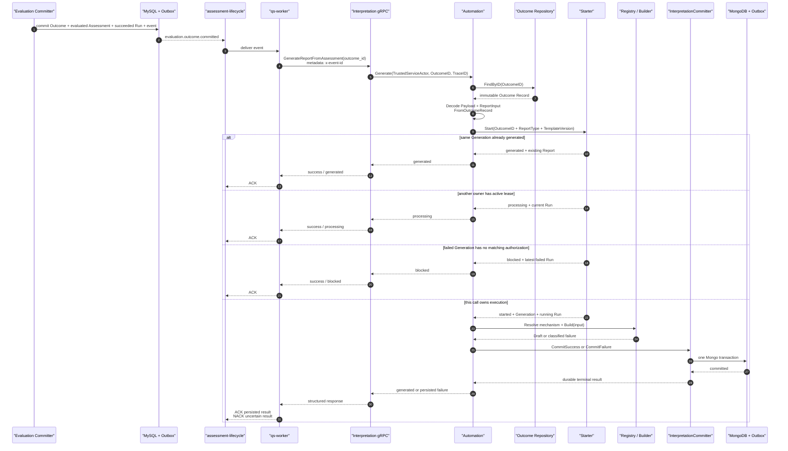

# 关键链路：从 Outcome 到 InterpretReport

> 状态：本文已按当前源码重写。它描述生产环境中由 `evaluation.outcome.committed` 驱动的完整报告生成链路，包括初次生成、幂等命中、并发占用、业务失败、自动与人工重试、进程崩溃恢复、消息 ACK/NACK 和报告生成后的投影；预览链路不在本文范围内。

## 1. 本文回答

一次 Evaluation 已经算出结果以后，Interpretation 怎样最终得到一份可查询的 InterpretReport？本文沿真实调用链回答：

1. `evaluation.outcome.committed` 为什么是报告生成的准入事件；
2. 事件中已经带有 AssessmentID、TesteeID，为什么还必须根据 OutcomeID 重读 Record；
3. Worker、internal gRPC、Automation、Starter、Registry、Builder 和 Committer 分别承担什么职责；
4. Generation 和 Run 在什么时候创建，为什么不能等报告构建完成后再保存；
5. 重复事件、并发 Worker 和进程崩溃怎样避免产生重复报告；
6. Builder 失败和 MongoDB 事务失败为什么采用不同的恢复方式；
7. 哪些结果会让当前消息 ACK，哪些错误会让它 NACK；
8. 自动重试为什么由 `interpretation.retry.requested` 驱动，而不是无限重投原始 Outcome 事件；
9. `interpretation.report.generated` 发布后还会触发哪些后置投影；
10. 当前链路还有哪些可观测性和状态闭环缺口。

本文的重点不是再次解释每个聚合的内部状态机，而是把前几篇设计文档中的对象放回一条真实运行链路。

## 2. 30 秒结论

Interpretation 的生产输入是一条已经可靠提交的 Evaluation Outcome 事实：

```text
Evaluation reliable commit
  Outcome Record + Assessment evaluated + EvaluationRun succeeded
  + evaluation.outcome.committed Outbox
        │
        ▼
qs-worker consumes evaluation.outcome.committed
  validates event envelope
  forwards OutcomeID + EventID through internal gRPC
        │
        ▼
Interpretation Automation
  reloads immutable Outcome Record
  decodes Payload + frozen ReportInput
  builds InterpretationInput
        │
        ▼
Starter
  claim ReportGeneration + running InterpretationRun
  or return generated / processing / blocked
        │
        ▼
Registry -> Builder -> Report Draft
        │
        ▼
InterpretationCommitter
  success: Artifact + Catalog + Run + Generation + generated Outbox
  failure: Run + Generation + failed Outbox + optional retry Outbox
        │
        ▼
Worker ACK / NACK according to durable result
```

整条链路有三条最重要的语义：

> 第一，Outcome 是已经成立的测评结果，Interpretation 只解释它，不重新执行 Evaluation。

> 第二，只有 Artifact、Run、Generation、Catalog 和终态 Outbox 在同一 MongoDB 事务中提交成功，报告才算真正生成。

> 第三，已经进入 Interpretation 生命周期并被可靠分类的失败，由 `interpretation.retry.requested` 驱动下一次业务 attempt；尚未形成持久化失败事实的不确定错误，才由当前消息 NACK 和 lease recovery 兜底。

## 3. 参与者与职责

| 参与者 | 所属进程或模块 | 在本链路中的职责 | 不应该承担的职责 |
| --- | --- | --- | --- |
| Evaluation Committer | qs-apiserver / Evaluation | 可靠提交 Outcome 和准入事件 | 生成报告、选择报告 Builder |
| MySQL Outbox Relay | qs-apiserver 基础设施 | 发布 `evaluation.outcome.committed` | 把事件投递成功等同于报告成功 |
| qs-worker | 独立 Worker 进程 | 消费事件、调用 internal gRPC、执行消息 settlement | 持久化 Generation、Run 或 Report |
| InterpretationAutomationService | qs-apiserver gRPC Transport | 校验 OutcomeID、恢复重试授权、映射安全响应 | 编写报告内容或操作 Mongo 文档 |
| Automation Service | Interpretation Application | 重读 Outcome、构造 InterpretationInput、调用 Executor | 重新查询当前 ModelCatalog 草稿 |
| Starter | Interpretation Application | 取得一次 Generation/Run 执行权 | 长时间持有 MongoDB 事务执行 Builder |
| Rendering Registry | Interpretation Domain | 根据机制键解析 Builder | 按 model code 堆叠业务分支 |
| Builder | Interpretation Domain | 将冻结输入确定性组装为 Draft | 创建 ID、推进状态机、访问仓储 |
| InterpretationCommitter | Interpretation Application | 提交成功或失败终态及 Outbox | 发布未持久化的伪成功事件 |
| Mongo Outbox Relay | qs-apiserver 基础设施 | 发布 Interpretation 终态和重试事件 | 修改报告领域状态 |
| Report Event Handlers | qs-worker | 更新等待状态、重点关注等后置投影 | 回写 Evaluation Outcome 或自动重开失败 Run |

这个职责分工保护了一个核心边界：

> Worker 控制异步执行和消息回执，Interpretation Application 控制业务执行，领域对象保护报告事实，基础设施负责持久化与投递；任何一层都不能独自宣布“报告已经生成”。

## 4. 端到端主时序



注意图中的 gRPC 方法仍叫 `GenerateReportFromAssessment`，但生产调用真正传递和校验的是 `outcome_id`。`assessment_id` 是 proto 中保留的兼容字段，Worker 当前不会填充它。

## 5. 阶段一：Evaluation 可靠提交报告准入事实

### 5.1 报告生成从事务提交后开始

Evaluation 的 Committer 不是先把 Assessment 改成 `evaluated`，再尽力发送一条消息。它在一个 MySQL 事务中提交：

```text
EvaluationOutcome Record
+ assessment_score projection（启用时）
+ Assessment evaluated
+ EvaluationRun succeeded
+ evaluation.outcome.committed Outbox row
```

只有事务整体成功，调用者手中的 Assessment 和 Run 才会被替换为终态副本，事务后加速器才会尝试将 Outbox 标记为就绪或立即发布。

因此，`evaluation.outcome.committed` 的业务语义不是“计算代码刚刚返回了一个结果”，而是：

> Outcome、Assessment 和 EvaluationRun 已经形成一致的持久化事实，Interpretation 可以安全开始。

### 5.2 事件只负责唤醒，不承载完整报告输入

事件数据包含：

| 字段 | 用途 |
| --- | --- |
| `org_id` | 日志、关联和后续治理上下文 |
| `assessment_id` | 关联测评，Worker 做基本合法性校验 |
| `testee_id` | 关联受试者和观测 |
| `outcome_id` | Interpretation 真正的输入主键 |
| `evaluation_run_id` | 追踪是哪次 EvaluationRun 产生 Outcome |
| `committed_at` | 结果可靠提交时间 |

事件没有复制 Outcome Payload、冻结 ReportInput 或完整模型配置。即使未来事件字段增加，Interpretation 仍应根据 OutcomeID 重读 canonical Record。

这样做有四个原因：

1. 消息可以重复投递，而 Outcome Record 是稳定事实；
2. 事件 schema 不必复制并追赶复杂的 Outcome schema；
3. 报告重试始终读取同一份冻结结果，而不是依赖某次消息里的临时副本；
4. 消息损坏和领域事实损坏可以被分别判断。

### 5.3 Outbox 投递与业务事务的关系

`evaluation.outcome.committed` 使用 durable outbox，topic 是 `assessment-lifecycle`。事务提交以后，PostCommitDispatcher 可以加速投递，但加速失败不能回滚已提交的 Evaluation 事实。

因此必须区分：

| 事实 | 是否已成立 |
| --- | --- |
| Evaluation Outcome 已可靠提交 | MySQL 事务成功时成立 |
| Outcome 事件已经发布到 MQ | Outbox Relay 发布成功时成立 |
| Worker 已请求报告生成 | Worker 消费并调用 gRPC 后成立 |
| 报告已经生成 | Interpretation 成功事务提交后才成立 |

## 6. 阶段二：Worker 消费 Outcome 事件

### 6.1 Handler 做什么

`handleEvaluationOutcomeCommitted` 的执行顺序是：

1. 解析标准 Event Envelope 和 `EvaluationOutcomeCommittedData`；
2. 记录 EventID、OrgID、AssessmentID、TesteeID、OutcomeID 和 EvaluationRunID；
3. 确认 InterpretationAutomationClient 已装配；
4. 验证 AssessmentID 可以安全转换为 uint64；
5. 验证 OutcomeID 非空；
6. 将 EventID 写入 outgoing gRPC metadata `x-event-id`；
7. 只用 OutcomeID 调用 `GenerateReportFromOutcome`；
8. 根据结构化响应决定当前 MQ 消息是否处理成功。

Worker 对 AssessmentID 的检查是事件完整性保护，不表示报告是从 Assessment 动态重建出来的。

### 6.2 EventID 同时承担 trace 起点

Worker 把当前 Event Envelope 的 ID 传入 `x-event-id`。gRPC Transport 将它读取为 Interpretation trace id，Starter 再把 trace id 固化到 InterpretationRun。

初次链路的关联关系是：

```text
evaluation.outcome.committed EventID
  -> gRPC x-event-id
  -> GenerateCommand.TraceID
  -> InterpretationRun.TraceID
```

这使运维人员可以从消息日志追到具体 Run。不过当前 Report Artifact 没有单独保存 trace id，需要通过 Run 反查，这一点应在运维查询中保持明确。

### 6.3 Worker 不持久化 Interpretation 状态

Worker 不直接访问 MongoDB 中的：

- `report_generations`；
- `interpretation_runs`；
- `interpret_reports`；
- `report_query_catalog`。

它也不会在本地根据 Outcome 选择 Builder。这样可以保证，无论初次事件、自动重试事件还是 lease recovery 进入系统，最终都经过同一个 Automation 和 Executor。

## 7. 阶段三：internal gRPC 建立自动化边界

### 7.1 当前 RPC 契约

当前 proto 是：

```text
GenerateReportFromAssessmentRequest
  assessment_id   兼容字段，当前生产 Worker 不填
  outcome_id      必填，实际准入身份

GenerateReportFromAssessmentResponse
  success / status / message
  generation_id / run_id / report_id
  failure_kind / failure_code / retryable
  retry_disposition / attempt_origin
  current_attempt / max_automatic_attempts
  remaining_automatic_attempts / next_attempt_at
  retry_event_id / action_request_id
```

方法名仍使用 Assessment 语言，是历史契约名称；当前实现已经是 `GenerateReportFromOutcome` 语义。文档和新调用方都不应把 `assessment_id` 当成执行输入。

### 7.2 Transport 只做边界工作

gRPC Service 负责：

- 拒绝空或非法 OutcomeID；
- 从 metadata 恢复重试授权；
- 创建 `TrustedServiceActor("internal-grpc")`；
- 传递 trace id；
- 把应用结果转换为安全、结构化的响应；
- 记录内部错误，但不把原始错误链直接暴露给 Worker。

它不负责：

- 查询 Assessment；
- 解码 Outcome Payload；
- 选择 Builder；
- 直接创建 Report；
- 判断失败是否应该产生下一业务 attempt。

### 7.3 gRPC 返回业务失败响应，而不是总用 transport error

当 Automation 返回错误时，Service 会记录完整错误，然后返回 `success=false, status=failed` 的安全响应。

如果错误是已经可靠提交的 `FailedError`，响应会携带持久化的 GenerationID、RunID、Failure 和 RetryDecision；如果错误无法映射到持久化失败，响应默认标记为 `retryable=true, failure_kind=internal, failure_code=internal_error`。

这一区分直接决定 Worker 后续是 ACK 还是 NACK。

## 8. 阶段四：重读 Outcome 并构造 InterpretationInput

### 8.1 Automation 先验证可信调用者

Automation Service 要求：

- Actor.Source 非空；
- OutcomeID 非零；
- Outcome Repository 和 Executor 已装配。

当前可信行为人是 internal gRPC 或 lease recovery。它不是患者、医生或运营行为人；报告生产链路不使用终端用户身份进行 Audience 投影。

### 8.2 重读不可变 Outcome Record

Automation 调用 `evaluationfact.Repository.FindByID(OutcomeID)`。Record 提供：

```text
Association
  OrgID / AssessmentID / TesteeID

Model Identity
  Kind / SubKind / Algorithm / Code / Version / Title

Runtime Identity
  AlgorithmFamily / DecisionKind / PayloadFormat

Payload
  已成立的分数、等级、维度、类型或能力结果

ReportInput
  当次 Evaluation 冻结的报告素材

SchemaVersion / EvaluatedAt
```

Interpretation 不查询“当前发布的模型版本”，也不从 Assessment 重新执行 Evaluator。

### 8.3 FromOutcomeRecord 是生产防腐层

输入适配依次执行：

```text
DecodeExecution(record.Payload, record.SchemaVersion)
+ DecodeReportInput(record.ReportInput)
+ model/runtime compatibility normalization
+ association copy
+ mechanism-specific fact mapping
-> InterpretationInput
```

它会根据 AlgorithmFamily 形成不同的报告事实：

| AlgorithmFamily | 构造的 InterpretationInput |
| --- | --- |
| `factor_scoring` | Factor model + factor scores + frozen interpret rules |
| `factor_norm` | Factor facts + derived scores + norm references + frozen norm prose |
| `task_performance` | Task dimensions + performance facts |
| `factor_classification` | PersonalityType 或 TraitProfile facts |

兼容旧数据时，它可以补齐旧 scale 或 typology 的默认 algorithm、推导 AlgorithmFamily 和 DecisionKind；这些兼容规则不代表新 Outcome 可以省略运行时身份。

### 8.4 这一阶段发生在 Generation 创建之前

这是整条链路非常重要的当前事实：

```text
Find Outcome
-> Decode Payload
-> Decode ReportInput
-> FromOutcomeRecord
-> ExecuteOutcome
-> Starter.Start
```

如果 Record 不存在、schema 无法解码、冻结 typology code 无法匹配或输入映射失败，系统尚未创建 ReportGeneration 和 InterpretationRun。

结果是：

- 错误会作为未分类内部失败返回；
- Worker 会 NACK 当前消息；
- 运维人员无法在 Interpretation 生命周期查询中看到一条对应失败 Run；
- 恢复依赖消息重投和外部事件治理，而不是业务 RetryDecision。

这是当前实现明确存在的“生命周期前失败”可观测性缺口，不能在文档中假装所有失败都有 Run。

### 8.5 ExecuteOutcome 防止错配事实

进入 Executor 前，`ExecuteOutcome` 还会验证：

```text
InterpretationInput.OutcomeID == OutcomeRecord.ID
```

这是一条轻量但关键的防错约束：适配器不能把一个 Outcome 的输入交给另一个 Outcome 的 Generation。

## 9. 阶段五：Starter 取得执行权

### 9.1 Generation Key

Executor 根据 InterpretationInput 构造：

```text
Generation Key = OutcomeID + ReportType + TemplateVersion
```

当前生产适配器使用：

- `ReportType = standard`；
- `TemplateVersion = legacy-v1`。

Audience、ModelCode 和 Worker EventID 都不进入 Key。Audience 是读取投影；模型身份已经冻结在 Outcome；EventID 只表示一次消息投递与 trace。

### 9.2 首次执行

如果 Generation 不存在，Starter 在一个短 MongoDB 事务中：

1. 创建 ReportGeneration；
2. 创建 `attempt=1, origin=initial` 的 InterpretationRun；
3. 将 Run 置为 running 并设置 lease；
4. 将 Generation 置为 generating 并引用 LatestRunID；
5. 同时写入两个文档。

当前 module 装配的 lease duration 是固定的 5 分钟。

Starter 在事务提交后立即返回，Builder 不在 MongoDB 事务中运行。这样避免报告内容构建长期占用事务和数据库连接。

### 9.3 重复或并发调用的四种结果

| StartStatus | 当前事实 | Executor 行为 | gRPC 状态 |
| --- | --- | --- | --- |
| `started` | 本调用取得 Run 执行权 | 继续 Resolve、Build、Commit | 最终生成或失败 |
| `generated` | 相同 Key 已有成功成品 | 读取并直接复用 Artifact | `generated` |
| `processing` | 另一个调用持有 active lease | 不重复 Build | `processing` |
| `blocked` | failed Generation 没有匹配授权或尚未到期 | 不创建新 Run | `blocked` |

这些状态不是报告内容状态，而是“本次调用是否拥有执行权”的结果。

### 9.4 并发 claim 冲突怎样收敛

Generation Key 有唯一索引，Run 的 `(generation_id, attempt)` 也有唯一索引。两个 Worker 同时看到 Generation 不存在时，只有一个事务能够创建成功。

Starter 对 duplicate key 或 Generation CAS conflict 会重新读取一次：

- 胜者仍在执行，败者得到 `processing`；
- 胜者已经提交，败者得到 `generated`；
- 不会因为数据库冲突直接创建 attempt 2。

因此，消息重复次数不等于业务 attempt 次数。

## 10. 阶段六：Registry 解析 Builder

### 10.1 从 InterpretationInput 构造机制键

Executor 使用 `rendering.KeyFromInput` 构造：

```text
AlgorithmFamily
+ DecisionKind
+ ReportType
+ TemplateVersion
+ optional Algorithm
+ optional ProductChannel
+ optional ReportProfile
```

如果 AlgorithmFamily 或 DecisionKind 无法确定，路由键构造失败，当前 Run 会被可靠提交为：

```text
kind = input
code = unsupported_mechanism
retryable = false
```

### 10.2 Registry 按完整机制向通用机制回退

Registry 不是只查一次完全相等的 Key。它会在同一 TemplateVersion 内，从带 Algorithm、Channel、Profile 的精确候选逐步回退到通用候选。

这允许：

- 一个通用 factor-scoring Builder 服务多个医学量表；
- 特定 algorithm 或 product channel 注册更具体的 Builder；
- 现有主链路不按 model code 增加 switch；
- TemplateVersion 始终参与匹配，不会错误回退到另一个模板版本。

### 10.3 当前默认 Builder

| BuilderIdentity | AlgorithmFamily / DecisionKind | 主要用途 |
| --- | --- | --- |
| `factor-scoring` | factor_scoring / score_range | 医学量表因子计分报告 |
| `norm-profile` | factor_norm / norm_lookup | 行为评定和常模报告 |
| `task-performance` | task_performance / ability_level | 认知任务表现报告 |
| `typology` | factor_classification / 多种 classification decision | 人格类型和特质画像报告 |

找不到 Builder 时，当前 Run 被可靠提交为：

```text
kind = template
code = builder_not_found
retryable = false
```

这不是基础设施抖动，盲目自动重试不会生成一个突然出现的 Builder。

## 11. 阶段七：Builder 从冻结输入生成 Draft

### 11.1 Builder 的输入与输出

Builder 接收完整的 InterpretationInput，输出内存 Draft：

```text
InterpretationInput
  -> mechanism-specific assembler / template adapter
  -> report.Content
  -> report.Draft
```

Draft 可能包含：

- ModelIdentity；
- PrimaryScore；
- Level；
- Conclusion；
- Dimensions；
- Suggestions；
- ModelExtra。

Builder 不知道 GenerationID、RunID 和 ReportID，也不保存任何文档。

### 11.2 为什么 Builder 应当是确定性的

同一个 Outcome 和同一个 TemplateVersion 在自动重试、人工重试或 lease recovery 时，应得到相同的报告语义。Builder 因此应只依赖冻结输入和已注册模板，不应：

- 查询当前 ModelCatalog draft；
- 调用外部实时 AI 服务后不保存模型与提示词版本；
- 根据当前时间改变医学解释；
- 根据当前访问者决定章节内容；
- 在构建过程中产生不可回滚的外部副作用。

### 11.3 Builder 失败怎样分类

| 失败 | FailureKind | Code | Retryable |
| --- | --- | --- | --- |
| Builder 返回 error | `build` | `build_failed` | true |
| Builder 返回 nil Draft | `build` | `empty_draft` | true |
| Draft 无法构造合法 Artifact | `build` | `invalid_artifact` | false |

Builder 的原始 error 会进入内部日志，并带 GenerationID、RunID、OutcomeID、TemplateVersion、TraceID 和 BuilderIdentity；持久化 Failure 只保留可分类的安全原因。

这保护了两种不同需求：

- 开发和运维需要看到真实错误链；
- 客户端和领域状态不应持久化数据库细节、堆栈或敏感配置。

## 12. 阶段八：从 Draft 构造 InterpretReport

Draft 成功以后，Executor 分配 ReportID，并创建不可变 InterpretReport：

```text
Identity
  ReportID
  GenerationID
  OutcomeID
  InterpretationRunID

Association
  OrgID
  AssessmentID
  TesteeID

Version Identity
  ReportType
  TemplateVersion

Content
  Draft.Content

Time
  GeneratedAt
```

Artifact 构造会验证：

- 四个身份均非零；
- OrgID、AssessmentID、TesteeID 完整；
- ReportType 和 TemplateVersion 完整；
- GeneratedAt 非零。

此时对象只存在于内存中。`NewInterpretReport` 成功不等于报告已经生成；只有 CommitSuccess 事务成功以后，Artifact 才成为业务事实。

## 13. 阶段九：成功终态可靠提交

### 13.1 CommitSuccess 提交什么

InterpretationCommitter 先验证：

- Generation 与 Run 的 GenerationID 一致；
- Generation.LatestRunID 指向当前 Run；
- Artifact.GenerationID、RunID 和 OutcomeID 与当前生命周期一致；
- Artifact.ReportType、TemplateVersion 与 Generation Key 一致；
- BuilderIdentity 和 ContentSchemaVersion 非空。

随后在一个 MongoDB 事务中写入：

```text
InterpretReport Artifact
+ report_query_catalog current projection
+ InterpretationRun succeeded
+ ReportGeneration generated + ReportID
+ interpretation.report.generated Outbox
```

任一步失败，整个事务回滚。

### 13.2 为什么 Catalog 也必须在成功事务中

如果先保存 Artifact、后异步更新 Catalog，会出现“报告已经生成但业务查询找不到”的窗口；如果先更新 Catalog、Artifact 保存失败，则会出现索引指向不存在正文。

当前成功事务把二者一起提交，因此：

> 生成成功意味着写侧成品和当前查询入口同时可见。

这不表示所有后置缓存和客户端状态已经更新；那些属于终态事件消费后的投影。

### 13.3 为什么在副本上推进终态

Committer 会 clone caller-owned Generation 和 Run，再在副本上执行 Succeed。

如果 MongoDB 事务失败：

- 调用者手中的 Generation 仍是 generating；
- Run 仍是 running，并保留 lease；
- 不会在内存中误以为已成功；
- 后续可以通过消息重投或 lease recovery 继续同一 attempt。

这避免了“数据库回滚了，内存对象却已经 terminal”的双重事实。

### 13.4 generated 事件携带什么

`interpretation.report.generated` 以 GenerationID 作为 aggregate identity，携带：

- GenerationID、RunID、ReportID；
- AssessmentID、OutcomeID、TesteeID、OrgID；
- attempt；
- ReportType、TemplateVersion；
- BuilderIdentity、ContentSchemaVersion；
- Model identity；
- PrimaryScore、Level；
- GeneratedAt。

它不是完整报告正文。下游需要正文时必须通过授权查询读取 Artifact，不能把事件当成第二份 Report 存储。

## 14. 成功事件之后的后置投影

Worker 消费 `interpretation.report.generated` 后执行三类动作。

### 14.1 更新报告等待状态

如果 ReportStatusReporter 已装配，Worker 将 Redis report status 更新为：

```text
status = completed
stage = completed
report_id = generated ReportID
```

随后可以发送 best-effort `report_status_changed` Redis signal，唤醒等待报告的请求。

Redis 状态和 signal 都不是报告业务事实。写 Redis 失败只记录警告，不会撤销已经生成的 Artifact，也不会让 generated 事件持续 NACK。

### 14.2 识别高风险结果

Handler 根据 generated event 中的 Level：

- 对传统 risk code 识别 `high` / `severe`；
- 对其他模型使用 severity 映射；
- 输出高风险告警日志。

这是一种后置业务投影，不参与报告生成事务。

### 14.3 同步 Testee 重点关注投影

如果 InternalClient 可用，Worker 调用 `SyncAssessmentAttention`，根据风险等级更新 Testee 的重点关注状态。

调用失败只记录警告，不让报告事件失败。原因是：

- 报告成品已经可靠存在；
- 重点关注是可以补偿的派生投影；
- 不应因为后置同步暂时不可用而重复生成报告。

## 15. 失败链路：可靠业务失败

### 15.1 哪些失败会进入 CommitFailure

当 Starter 已创建 running Run 后，以下业务失败会走统一 CommitFailure：

- 无法构造机制路由键；
- 找不到 Builder；
- Builder 返回错误；
- Builder 返回空 Draft；
- Draft 无法构造合法 Artifact。

CommitFailure 不创建空 Report，也不修改 Evaluation Outcome。

### 15.2 失败事务写什么

Committer 在副本上：

1. 将 Run 置为 failed；
2. 根据当前 BusinessPolicy 生成 RetryDecision；
3. 将 Generation 置为 failed；
4. 创建 `interpretation.report.failed`；
5. 如果 Disposition=automatic，再创建定时 `interpretation.retry.requested`；
6. 将 RetryEventID 固化进 Run.RetryDecision。

然后在一个 MongoDB 事务中提交：

```text
InterpretationRun failed + Failure + RetryDecision
+ ReportGeneration failed
+ interpretation.report.failed Outbox
+ optional scheduled interpretation.retry.requested Outbox
```

失败事务本身失败时，不会对外返回一个伪造的持久化 Failure。

### 15.3 RetryDecision 决定谁可以继续

| 条件 | Disposition | 下一步 |
| --- | --- | --- |
| retryable=true 且 attempt 未耗尽 | `automatic` | 定时 Retry Event 驱动下一 attempt |
| retryable=true 且自动次数耗尽 | `manual_required` | 等待管理员授权 |
| retryable=false | `terminal` | 不自动继续；管理员可 force retry |

当前业务策略最大自动 attempt 数为 3，生产配置基准延迟为 30 秒、上限 5 分钟。持久化 Decision 保存 PolicyVersion 和 MaxAutomaticAttempts，配置后续变化不会改写历史决定。

### 15.4 原始 Outcome 消息为什么 ACK

CommitFailure 成功后，gRPC 返回 `success=false`，但响应包含持久化 RetryDisposition。

Worker 的规则是：

```text
retry_disposition in {automatic, manual_required, terminal}
  -> current message handled successfully
  -> ACK
```

这里 ACK 的不是“报告生成成功”，而是：

> 本次消息已经形成明确、可查询、可治理的持久化结果，继续重投同一消息不会增加可靠性。

自动重试已经有专门的 Retry Event；人工或终态失败则必须等待治理动作。

## 16. 自动、人工和强制重试链路

### 16.1 自动重试事件

当 Run 的 RetryDecision 是 automatic，CommitFailure 使用 ScheduledStager 将 `interpretation.retry.requested` 写入同一 MongoDB 事务，并设置 `next_attempt_at`。

EventID 是确定性的：

```text
interpret-retry:{generation_id}:{expected_attempt}:{origin}
```

人工治理事件还会拼接 ActionRequestID。

### 16.2 Worker 传递一次性授权

Retry Event 到期并被 Worker 消费后，Handler 将下面字段写入 gRPC metadata：

- Retry EventID；
- ExpectedAttempt；
- AttemptOrigin；
- ActionRequestID；
- Mode。

gRPC Transport 把它恢复为 `retrygovernance.Authorization`。Starter 只有在以下事实全部匹配时才会创建下一 Run：

```text
Generation is failed
+ latest Run is failed
+ RetryDecision is automatic
+ next_attempt_at has arrived
+ EventID == persisted RetryEventID
+ ExpectedAttempt == latest attempt
+ Origin is allowed
+ ActionRequestID semantics match
```

重复、过期、伪造或不匹配的 Retry Event 得到 `blocked`，不会消耗新 attempt。

### 16.3 下一 attempt 仍走相同主链路

授权通过后，Starter 创建：

```text
attempt = latest.attempt + 1
origin = automatic / manual / force
status = running
new lease
```

并把 Generation 从 failed 迁回 generating。之后仍然执行同一套：

```text
same Outcome Record
-> same FromOutcomeRecord
-> same Registry
-> same Builder
-> same Committer
```

重试不会重新计算答卷，也不会调用 Evaluation。

### 16.4 人工重试和强制重试

管理员治理动作不会直接调用 Builder。GovernedRetryService 先验证：

- Generation 确实 failed；
- Outcome 属于当前 Org；
- ExpectedAttempt 匹配；
- RequestID 和 Reason 完整；
- manual 只用于 `manual_required`；
- force 只用于 `terminal`。

然后在事务中更新 Run 上的一次性授权，并写入 `interpretation.retry.requested`。Worker 收到事件后才真正创建新 Run。

这使“管理员允许再试一次”和“报告已经重试成功”成为两个可审计事实。

### 16.5 自动重试紧急暂停

Worker 的 `DisableAutomaticRetry` 开关打开时，automatic Retry Event 不会进入 gRPC。Runtime 会先把原始消息可靠写入 MySQL `retry_event_hold`，然后 ACK MQ 消息。

如果 Hold 写入失败，Runtime 会 NACK 原消息。恢复开关后，Hold Replayer 使用原有消息身份重新发布。

因此紧急暂停的目标语义是：

> 暂停自动执行，但不通过无界 NACK 风暴保留消息，也不静默丢弃已授权的 Retry Event。

## 17. 进程崩溃与 lease recovery

### 17.1 为什么 running Run 需要 lease

Starter 在 Builder 执行前已经保存 running Run。若 qs-apiserver 在 Build 或 Commit 前崩溃，数据库会留下：

```text
Generation = generating
Run = running
lease_expires_at = T
```

没有 lease，其他调用无法判断原执行者仍在工作还是已经消失；直接创建 attempt 2 又会把进程故障错误计入业务重试预算。

### 17.2 active lease 期间

重复事件或消息重投在 lease 未过期时得到 `processing`：

- 不调用 Builder；
- 不创建新 Run；
- gRPC 返回 success=true；
- Worker ACK 当前消息。

系统相信当前 lease owner 会完成执行，或稍后由恢复任务接管。

### 17.3 lease 过期以后

Starter 使用 RunRepository 的原子 `ReclaimExpiredLease`：

- 要求 Run 仍是 running；
- 要求旧 lease 已过期；
- 更新 trace id 和新 lease；
- origin 变为 `lease_recovery`；
- attempt 保持不变。

只有一个恢复者能够 claim 成功；失败者重新读取 winner 并返回 processing。

### 17.4 谁触发恢复

两种入口都可以触发过期 lease 恢复：

1. 事件在 lease 过期后再次调用 Automation；
2. apiserver 的 Evaluation consistency reconcile 调度器扫描 Interpretation 过期 lease，并根据 Generation 中的 OutcomeID 再次调用 Automation。

当前生产配置启用 `lease_reconcile_enabled`，一致性调和任务按配置周期执行；Interpretation module 中 lease duration 当前固定为 5 分钟。

### 17.5 Mongo 终态事务失败时的具体表现

假设 Builder 已成功，但 CommitSuccess 的 MongoDB 事务失败：

1. Artifact、Catalog、Run terminal、Generation terminal 和 Outbox 全部未提交；
2. gRPC 返回未分类 retryable failure；
3. Worker NACK 当前消息；
4. 如果消息很快重投且 lease 仍有效，Starter 返回 processing，消息 ACK；
5. running Run 最终由 lease recovery 重领同一 attempt；
6. Builder 再次执行并重新尝试成功事务。

这不是“丢失 NACK”，而是消息重投和 lease recovery 的职责分工：消息负责重新触发，lease 负责判断是否可以安全取得执行权。

## 18. ACK / NACK 决策矩阵

### 18.1 Outcome 事件和 Retry 事件共用的响应规则

| gRPC/应用结果 | 是否存在持久化生命周期结论 | Worker settlement | 原因 |
| --- | --- | --- | --- |
| `success=true, generated` | 是，Report 已存在 | ACK | 新成功或幂等命中 |
| `success=true, processing` | 是，active running Run | ACK | 当前调用不应重复执行 |
| `success=true, blocked` | 是，failed Run 未获匹配授权 | ACK | 当前事件无权创建下一 attempt |
| `success=false` + `automatic` | 是，失败和 Retry Event 已提交 | ACK | 等专用 Retry Event |
| `success=false` + `manual_required` | 是，等待人工治理 | ACK | 重投当前消息没有意义 |
| `success=false` + `terminal` | 是，终态失败 | ACK | 只有 force retry 可继续 |
| `success=false, retryable=true` 但无 disposition | 否或不确定 | NACK | 需要 transport redelivery |
| gRPC 连接、超时或客户端错误 | 不确定 | NACK | 请求可能未到达或未完成 |
| nil response | 不确定 | NACK | 无法证明处理结果 |

### 18.2 两类“重试”不能混为一谈

| 重试类型 | 解决什么问题 | 是否增加 Interpretation attempt | 驱动方式 |
| --- | --- | --- | --- |
| 消息重投 | transport/gRPC/生命周期前不确定失败 | 不一定 | 当前 MQ 消息 NACK |
| 业务重试 | 已可靠分类的 Builder 或业务执行失败 | 是 | `interpretation.retry.requested` |
| lease recovery | 执行者崩溃或终态事务不确定 | 否 | 过期 lease reclaim |
| Outbox publish retry | 终态事件暂时发布失败 | 否 | Outbox Relay 自身策略 |

如果把四者都叫“重试”，很容易误以为一次消息 NACK 就应该增加业务 attempt，或者误以为 Report Builder 失败只需要依赖 MQ 重投。

## 19. 三个事务边界

整条链路不是一个跨 MySQL、MQ 和 MongoDB 的分布式事务，而是三个本地可靠边界通过事件衔接。

### 19.1 Evaluation 成功事务

```text
MySQL:
Outcome + Assessment + EvaluationRun + evaluation.outcome.committed Outbox
```

保证“有 Outcome 就有报告生成入口”。

### 19.2 Interpretation claim 事务

```text
MongoDB:
ReportGeneration generating + InterpretationRun running
```

保证“取得业务执行权之前先留下可恢复的运行事实”。

### 19.3 Interpretation terminal 事务

成功：

```text
Artifact + Catalog + Run succeeded + Generation generated + generated Outbox
```

失败：

```text
Run failed + Generation failed + failed Outbox + optional retry Outbox
```

保证“终态、查询入口和后续事件同成同败”。

### 19.4 为什么不把 Builder 放进事务

Builder 可能执行较长时间，也可能失败。如果从 claim 到内容生成完成始终持有 MongoDB transaction：

- 事务持续时间不可控；
- 占用连接和 session；
- 增加锁与冲突概率；
- 进程崩溃时恢复更困难；
- 无法清晰区分执行权和终态提交。

当前“短 claim 事务 + lease + 短 terminal 事务”更适合异步报告构建。

## 20. 端到端身份与追踪

| 身份 | 回答的问题 | 从哪里产生 | 保存在哪里 |
| --- | --- | --- | --- |
| OutcomeID | 哪个已成立结果被解释 | Evaluation Committer | Outcome、Generation Key、Artifact、事件 |
| AssessmentID | 报告属于哪次测评 | Evaluation | Outcome、Artifact Association、Catalog、事件 |
| GenerationID | 哪一份报告生成意图 | Interpretation Starter | Generation、Run、Artifact、事件 |
| RunID | 哪次执行尝试 | Interpretation Starter | Run、Artifact、事件 |
| ReportID | 哪份不可变成品 | Executor | Artifact、Generation、Catalog、generated event |
| EventID | 哪次事件投递或重试授权 | Domain Event | Envelope、Run trace 或 RetryDecision |
| TraceID | 哪次执行调用 | 初次 EventID 或 recovery trace | InterpretationRun |
| TemplateVersion | 使用哪套报告生成语义 | InterpretationInput | Generation Key、Artifact、事件 |
| BuilderIdentity | 哪个构建器实际执行 | Registry 结果 | generated event；当前未固化到 Artifact |
| ContentSchemaVersion | 报告内容 schema | Builder | generated event；当前未固化到 Artifact |

排查一份报告时，推荐从 OutcomeID 或 AssessmentID 找到 Generation，再展开所有 Run 和最终 Report。不要只根据 ReportID 看成品，因为失败发生时 ReportID 根本不存在。

## 21. 典型场景推演

### 21.1 正常首次生成

```text
Outcome event
-> attempt 1 claimed
-> Builder succeeds
-> success transaction commits
-> generated response
-> Outcome event ACK
-> generated event updates wait status and attention projection
```

最终事实：Generation generated、Run 1 succeeded、Artifact 存在、Catalog 可查。

### 21.2 同一 Outcome 事件重复投递

第一次仍在执行：

```text
duplicate event -> active lease -> processing -> ACK
```

第一次已经成功：

```text
duplicate event -> generated Generation -> existing Artifact -> ACK
```

不会生成第二个 Report。

### 21.3 Builder 暂时失败，第二次成功

```text
attempt 1 build_failed
-> failure transaction: automatic + scheduled retry event
-> original event ACK
-> retry event due
-> exact authorization matches
-> attempt 2
-> success transaction
```

Outcome 不变，Evaluation 不重跑，Generation 不变；Run 从一条变成两条，最终 Artifact 只存在一份。

### 21.4 缺少 Builder

```text
attempt 1 builder_not_found
-> retryable=false
-> terminal RetryDecision
-> failed event
-> original event ACK
```

自动重试不会继续。管理员修复注册或部署后，可以基于明确原因执行 force retry。

### 21.5 Outcome 冻结输入无法解码

```text
Outcome event
-> FindByID succeeds
-> FromOutcomeRecord fails
-> no Generation / no Run
-> unclassified retryable response
-> NACK current event
```

这类失败无法通过 Interpretation Operations 生命周期直接看到，是当前最需要补强的准入失败审计点之一。

### 21.6 进程在 claim 后崩溃

```text
Generation generating + Run running persisted
-> process exits before terminal commit
-> lease expires
-> reconcile recoverer claims same Run
-> origin=lease_recovery, attempt unchanged
-> rebuild and commit
```

崩溃不会凭空消耗业务自动重试次数。

### 21.7 自动重试被紧急暂停

```text
retry event delivered
-> emergency switch rejects automatic execution
-> persist message into retry_event_hold
-> ACK source message
-> switch restored
-> hold replayer republishes same message identity
-> normal retry authorization path
```

## 22. 端到端不变量

1. 没有可靠提交的 Outcome，就不能开始生产报告生成。
2. Interpretation 的执行主键是 OutcomeID，不是 Assessment 当前状态。
3. 同一个 Generation Key 最多只有一个 ReportGeneration。
4. 同一个 Generation 和 attempt 最多只有一个 InterpretationRun。
5. 一个 Generation 最多只有一份成功 Artifact。
6. Builder 只产生 Draft，不拥有生命周期和事务。
7. Report 只能由 running LatestRun 在成功事务中产生。
8. 成功事务失败时，不得对外返回 ReportID 或 generated 状态。
9. 可靠业务失败必须同时保存 Run Failure、RetryDecision 和 failed event。
10. 自动下一 attempt 必须持有与持久化 RetryDecision 完全匹配的一次性授权。
11. 消息重复投递不能直接增加业务 attempt。
12. lease recovery 只能接管原 attempt，不能伪装成业务重试。
13. Interpretation 失败不能把已成立的 Assessment 从 evaluated 改成 failed。
14. generated event 只能在 Artifact 和 Catalog 已提交后发布。
15. Redis report status、唤醒 signal 和 attention projection 都是可重建的后置投影，不是报告事实源。

## 23. 当前实现中的明确问题

这些问题不是本文建议立即修改的方案，而是从链路还原中确认的当前边界，已经进入 [设计问题与重构清单](./90-设计问题与重构清单.md)。

### 23.1 生命周期前失败没有 Generation / Run

Outcome 不存在、解码失败、冻结输入无效和 FromOutcomeRecord 映射失败都发生在 Starter 前。它们只能通过 Worker 日志、消息指标和 NACK 观察，不能通过 Interpretation Operations API 查询。

目标上应为“每个已准入的 Outcome 都能解释当前停在哪一步”；当前实现尚未覆盖准入适配失败。

### 23.2 RPC 名称与真实输入已经漂移

`GenerateReportFromAssessment` 和 request 中保留的 `assessment_id` 会误导读者和新调用方。当前真实契约已经是 Outcome 驱动，后续应考虑版本化迁移为明确的 `GenerateReportFromOutcome`。

### 23.3 TemplateVersion 仍由适配器固定为 legacy-v1

Generation Key、Artifact 和 Registry 已支持 TemplateVersion，但 ModelCatalog 还没有正式发布报告模板版本。当前所有生产输入使用同一个默认值，版本骨架尚未完成资产化闭环。

### 23.4 BuilderIdentity 和 ContentSchemaVersion 没有固化到 Artifact

两者进入 generated event，却不在 InterpretReport 中。事件丢失或归档后，仅靠 Artifact 无法完整回答“这份报告由哪个 Builder、哪个内容 schema 生成”。

### 23.5 manual_required 没有进入 ReportFailedPayload

failed event 只携带 `retryable`，没有 RetryDisposition。Worker 只有 `retryable=false` 时才把 Redis report status 标成 failed。

因此，自动次数耗尽但 `retryable=true, manual_required` 的报告可能继续对等待端表现为 processing/evaluated，而不是明确的“需要人工处理”。持久化 Generation/Run 是正确事实，但客户端等待投影尚未完整表达它。

### 23.6 lease duration 固定在装配代码中

Interpretation lease 当前固定为 5 分钟，而恢复扫描周期来自配置。二者共同决定最坏恢复延迟，却不在一个配置或运维视图中表达。

### 23.7 post-generated 投影缺少统一补偿闭环

Redis report status 和 attention sync 是 best-effort。报告查询可以从 MongoDB 恢复，但 attention 同步失败目前主要依赖日志，没有在本链路中形成独立、持久化的补偿任务。

## 24. 面试追问与回答边界

### 24.1 为什么不让 Evaluation 直接生成报告？

因为 Outcome 成立和报告生成不是一个工作单元。Outcome 是机器可判定的测评事实，报告还涉及模板、解释素材、Audience 与独立失败治理。拆开后，报告失败不会污染已经成立的 Evaluation。

### 24.2 为什么事件只传 OutcomeID？

事件负责唤醒，Outcome Record 负责承载完整事实。传 ID 后可以避免事件 schema 复制复杂 Payload，保证重复投递和重试始终读取同一份冻结事实。

### 24.3 为什么 Generation/Run 要在 Builder 前落库？

因为报告构建可能耗时或崩溃。先落库才能记录执行权、trace 和 lease，让系统知道任务停在 running，并允许安全恢复。

### 24.4 为什么 Builder 不在 MongoDB 事务中执行？

长事务会占用连接、扩大冲突并增加崩溃恢复难度。系统使用短 claim 事务取得执行权、在事务外构建、再用短 terminal 事务提交结果。

### 24.5 为什么持久化失败以后还要 ACK 原消息？

因为 ACK 表示当前投递已经被可靠处理，不表示业务成功。失败、RetryDecision 和下一 Retry Event 已经提交后，重复投递原消息不会提供额外可靠性，反而会绕过业务重试治理。

### 24.6 MQ 重投、业务重试和 lease recovery 有什么区别？

- MQ 重投解决处理结果不确定；
- 业务重试解决已经可靠分类的执行失败，并消耗 attempt；
- lease recovery 解决执行者失联，接管原 attempt；
- Outbox retry 解决已提交事件暂时发布失败。

### 24.7 怎样保证不会生成两份报告？

依靠 Generation Key 唯一索引、Run attempt 唯一索引、Artifact GenerationID 唯一索引、Generation CAS 和成功事务共同保护。不是只靠 MQ “尽量不重复投递”。

### 24.8 报告生成成功的准确定义是什么？

Artifact、Catalog、Run succeeded、Generation generated 和 generated Outbox 已经在同一 MongoDB 事务中提交。Builder 返回 Draft 或 gRPC 返回前的内存对象都不算成功。

## 25. 源码导航

| 链路阶段 | 事实源 |
| --- | --- |
| Evaluation 可靠提交 | [`application/evaluation/outcome/commit/committer.go`](../../../internal/apiserver/application/evaluation/outcome/commit/committer.go) |
| Outcome 事件契约 | [`domain/evaluation/assessment/events.go`](../../../internal/apiserver/domain/evaluation/assessment/events.go)、[`pkg/eventing/payload/assessment.go`](../../../internal/pkg/eventing/payload/assessment.go) |
| 事件目录 | [`configs/events.yaml`](../../../configs/events.yaml) |
| Outcome 事件 Handler | [`worker/handlers/assessment_evaluated_handler.go`](../../../internal/worker/handlers/assessment_evaluated_handler.go) |
| Worker gRPC Client | [`worker/infra/grpcclient/evaluation_clients.go`](../../../internal/worker/infra/grpcclient/evaluation_clients.go) |
| gRPC 契约 | [`api/grpc/proto/interpretation/interpretation.proto`](../../../api/grpc/proto/interpretation/interpretation.proto) |
| gRPC Service | [`transport/grpc/service/interpretation_automation.go`](../../../internal/apiserver/transport/grpc/service/interpretation_automation.go) |
| Automation 用例 | [`application/interpretation/automation/service.go`](../../../internal/apiserver/application/interpretation/automation/service.go) |
| Outcome 输入适配 | [`application/interpretation/automation/input`](../../../internal/apiserver/application/interpretation/automation/input/) |
| Executor | [`automation/execution/executor.go`](../../../internal/apiserver/application/interpretation/automation/execution/executor.go) |
| Starter | [`automation/execution/starter.go`](../../../internal/apiserver/application/interpretation/automation/execution/starter.go) |
| Builder Registry | [`domain/interpretation/rendering`](../../../internal/apiserver/domain/interpretation/rendering/) |
| InterpretReport | [`domain/interpretation/report/artifact.go`](../../../internal/apiserver/domain/interpretation/report/artifact.go) |
| Committer | [`automation/execution/committer.go`](../../../internal/apiserver/application/interpretation/automation/execution/committer.go) |
| Interpretation 终态事件 | [`domain/interpretation/events_outcome.go`](../../../internal/apiserver/domain/interpretation/events_outcome.go)、[`pkg/eventing/outcome/payload.go`](../../../internal/pkg/eventing/outcome/payload.go) |
| 终态与重试 Handler | [`worker/handlers/report_handler.go`](../../../internal/worker/handlers/report_handler.go) |
| Worker settlement | [`worker/handlers/evaluation_response.go`](../../../internal/worker/handlers/evaluation_response.go)、[`worker/integration/messaging/runtime.go`](../../../internal/worker/integration/messaging/runtime.go) |
| Retry Hold | [`worker/integration/messaging/retry_hold.go`](../../../internal/worker/integration/messaging/retry_hold.go) |
| Lease Recovery | [`application/interpretation/automation/lease_recovery.go`](../../../internal/apiserver/application/interpretation/automation/lease_recovery.go) |
| 模块装配 | [`container/modules/interpretation/assemble.go`](../../../internal/apiserver/container/modules/interpretation/assemble.go) |

## 26. 验证建议

### 26.1 快速回归

```bash
go test ./internal/apiserver/application/interpretation/automation/...
go test ./internal/apiserver/domain/interpretation/...
go test ./internal/apiserver/transport/grpc/service
go test ./internal/worker/handlers
go test ./internal/worker/integration/messaging
```

### 26.2 MongoDB Replica Set 集成验证

Interpretation 的 claim、成功和失败边界依赖 MongoDB transaction。使用真实单节点 Replica Set 测试库时应至少验证：

1. Catalog 写失败时 Artifact、Run、Generation 和 Outbox 全部回滚；
2. stale Generation version 被 CAS 拒绝；
3. 并发创建相同 Generation Key 只有一个胜者；
4. 同一个 Generation 不能创建两份 Artifact；
5. scheduled retry event 不会在 `next_attempt_at` 前被 relay claim；
6. expired lease 只能被一个恢复者 reclaim。

没有独立测试库时，不应在生产库执行会创建 Generation、Run、Artifact 和 Outbox 的集成测试。此时只能运行 mock/unit 契约测试，并把 Replica Set 验证标记为环境未满足，而不是写成已经验证。

### 26.3 故障注入场景

建议在可清理的集成环境验证：

- Outcome event 重复投递；
- 两个 Worker 并发请求同一 Outcome；
- Builder 返回错误与 nil Draft；
- Report Insert 后、Catalog 写入前故障；
- Outbox Stage 失败；
- Commit 返回不确定错误后消息快速重投；
- 进程在 claim 后退出，等待 lease recovery；
- automatic Retry Event 被紧急暂停并进入 hold；
- manual_required 经人工授权后成功；
- terminal 经 force retry 后成功。

### 26.4 文档验证

```bash
make docs-hygiene
make docs-facts
```

本篇若因实现变更需要同步维护，最先核对五个事实：Outcome 准入事件、Generation Key、Starter 四种结果、Committer 事务内容以及 Worker ACK/NACK 规则。
