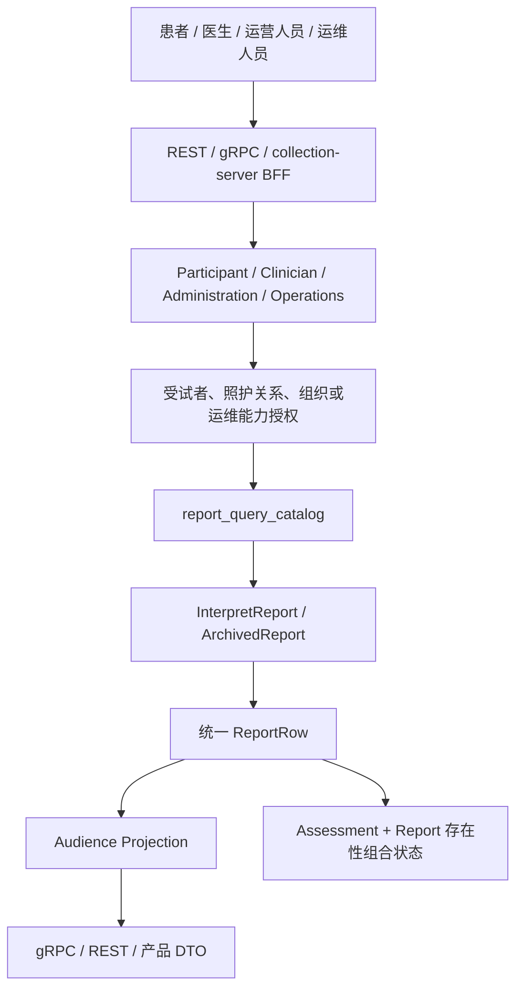
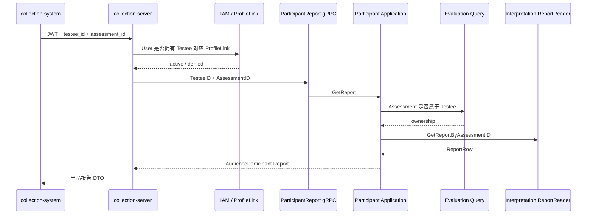
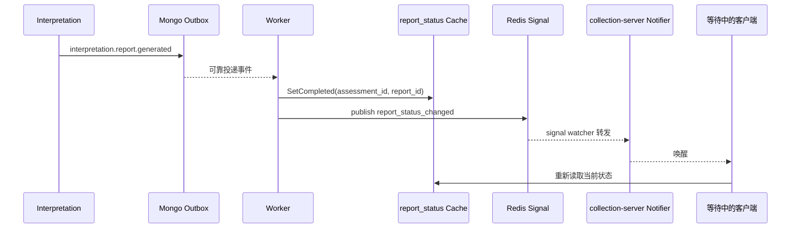

# 关键链路：从报告查询到组合状态

> 状态：本文已按当前源码重写。本文描述报告成品如何经过当前报告目录、行为人授权、Audience 投影和传输层适配被不同调用方读取，以及系统如何在不修改 Evaluation 聚合的前提下组合出 `interpreted`。文中会明确区分已经成立的实现、查询加速状态和仍需治理的设计缺口。

## 1. 本文回答什么

上一篇沿写链路解释了 Outcome 怎样最终成为不可变的 `InterpretReport`。但报告提交成功，并不等于所有调用方都可以直接把 MongoDB 文档返回给客户端。读链路还必须连续回答五个问题：

1. 当前 Assessment 应该读取哪一份报告成品；
2. 当前行为人是否有权访问这个受试者和这次测评；
3. 即使有权访问，面向患者、医生和管理员分别可以展示哪些内容；
4. Evaluation 中的 `evaluated` 与 Interpretation 中的“报告已经存在”怎样组合为客户端理解的完成状态；
5. Redis 状态、通知信号、短轮询、长轮询和 WebSocket 怎样加速等待，而不成为报告事实本身。

本文的核心结论是：

> “报告已经生成”“当前行为人有权读取报告”“客户端可以显示测评已解读”是三件不同的事。qs-server 通过 Interpretation 读模型、行为人用例和 Journey 状态投影把它们组合起来，而不是让任何一个模块独占全部语义。

## 2. 30 秒结论

报告读取的主链路可以概括为：

```text
调用方身份与查询范围
  -> 行为人用例授权
  -> report_query_catalog 选择 Assessment 的当前报告
  -> 加载 InterpretReport / ArchivedReport 成品正文
  -> 统一 ReportRow
  -> Audience 章节投影
  -> gRPC / REST / BFF 传输模型
  -> 患者、医生或运营界面
```

组合状态的主链路可以概括为：

```text
Evaluation Assessment.status = evaluated
                +
Interpretation 当前 Report 存在
                ↓
Journey / BFF 查询投影 = interpreted
```

这里有四条不可混淆的原则：

- `InterpretReport` 是报告内容的事实源；
- `report_query_catalog` 是当前报告选择与列表过滤的查询索引，不是报告正文；
- `interpreted` 是跨 Evaluation 与 Interpretation 的查询投影，不回写 Assessment 聚合；
- Redis `report_status` 与 `report_status_changed` 只是等待加速设施，缓存丢失或信号丢失不能让已经生成的报告变成不存在。

## 3. 为什么需要“组合状态”

### 3.1 Evaluation 只能声明测评结果已经成立

Evaluation 负责：

- 接收可靠作答事实；
- 创建并执行 Assessment；
- 调用 Calculation；
- 提交 Outcome；
- 将 Assessment 推进到 `evaluated` 或失败终态。

当 Assessment 处于 `evaluated` 时，只能说明机器可判定的测评结果已经可靠成立。它不能同时承诺：

- 报告 Builder 已经成功执行；
- 报告正文已经提交；
- 当前调用者可以看到报告；
- 查询端的缓存或通知已经更新。

### 3.2 Interpretation 独立管理报告生成结果

Interpretation 负责自己的 Generation、Run 和 InterpretReport。报告生成可能晚于 Outcome 提交，也可能因为模板、冻结输入、Builder 或基础设施错误而失败。

如果 Interpretation 为了表示“报告已经生成”而直接修改 Evaluation 的 Assessment 状态，会制造以下问题：

- Interpretation 需要跨模块写入另一个聚合；
- 报告失败可能污染已经成立的 Outcome；
- Evaluation 状态机必须理解报告模板和生成重试；
- 重新生成报告时很难解释 Assessment 状态是否应该回退；
- Evaluation 与 Interpretation 无法独立治理失败和重试。

因此当前实现保留 Assessment 的 `evaluated`，在查询时通过报告存在性追加 `interpreted` 投影。

### 3.3 `interpreted` 是读语义，不是新的领域事实

当前 `reportquery.ProjectAssessment` 使用以下规则：

| Evaluation 状态 | 当前 Report | 组合状态 |
| --- | --- | --- |
| 非 `evaluated` | 不查询 | 保留 Evaluation 状态 |
| `evaluated` | 不存在 | `evaluated` |
| `evaluated` | 存在 | `interpreted` |
| `failed` | 不查询 | `failed` |

这个投影不会修改传入的 Evaluation DTO，也不会回写 MySQL。它只在查询结果中增加：

- `Status = interpreted`；
- `InterpretedAt = ReportRow.CreatedAt`。

因此，更准确的表述是：

> `interpreted` 表示“测评结果已经成立，并且 Interpretation 当前报告读模型能够解析出报告成品”，而不是 Assessment 聚合内部又完成了一次状态迁移。

## 4. 三类事实必须分开

### 4.1 业务内容事实

业务内容事实由 MongoDB 中的报告成品持有：

- 新模型：`interpret_reports` 中的 `InterpretReport`；
- 历史兼容模型：`interpret_reports_archive` 中的 `ArchivedReport`；
- 当前成品与 Generation、Run、Outbox 在成功提交事务中一起成立。

它回答：

> 这份报告的模型、分数、等级、维度、结论、建议和模型特有内容是什么？

### 4.2 当前报告查询事实

`report_query_catalog` 是面向查询的紧凑目录。它记录：

- Assessment、受试者和组织关联；
- 当前选中的来源类型与来源 ID；
- 模型编码、风险等级和排序字段；
- 当前查询应该读取新成品还是历史归档。

它回答：

> 对这次 Assessment，当前查询应该选择哪一份报告；某个组织或受试者的报告列表应该命中哪些条目？

它不保存完整报告正文。详情查询和列表查询都先查 catalog，再批量加载当前页对应的报告正文。

### 4.3 等待加速事实

Redis `report_status:{assessment_id}` 保存短期状态快照，例如：

- `queued`；
- `processing`；
- `scoring`；
- `interpreting`；
- `completed`；
- `failed`。

`report_status_changed` 则是一条唤醒等待者的信号。它们回答：

> 客户端此刻是否值得再次读取权威状态或报告？

它们不能回答报告正文是什么，也不能替代 MongoDB 中的报告存在性。缓存 TTL 当前默认 48 小时；缓存过期后，系统必须能够通过 Assessment 和报告查询回退恢复状态。

## 5. 总体读链路



这张图中有两个容易被忽略的顺序要求：

1. **授权必须发生在报告内容暴露之前**。catalog 中存在 `org_id`、`testee_id` 不等于已经完成授权；
2. **Audience 投影发生在授权之后**。Audience 只决定已授权调用者可以看哪些章节，不决定调用者是否有权访问这份报告。

## 6. 第一步：当前报告目录选择成品

### 6.1 为什么查询不能直接扫描报告集合

当前系统同时存在新报告成品和历史归档报告。直接扫描两个集合会带来：

- 详情查询不知道新旧来源谁优先；
- 列表过滤必须在两个集合上重复执行；
- 排序和分页难以稳定；
- 同一 Assessment 可能出现两个结果；
- 每个应用服务都要理解迁移兼容逻辑。

`report_query_catalog` 把这些问题收敛为“一次 Assessment 对应一个当前查询条目”。新报告成品提交或历史归档同步时，catalog 决定当前来源。

### 6.2 详情查询

`GetReportByAssessmentID` 的当前实现顺序是：

1. 按 `assessment_id` 查询唯一 catalog 条目；
2. catalog 不存在，返回 `ErrReportNotFound`；
3. 根据 `source_kind` 判断来源是 artifact 还是 archive；
4. 按 `source_id` 加载正文；
5. 将正文归一化为统一 `ReportRow`；
6. catalog 指向的正文不存在，返回 `CatalogDanglingSourceError`。

```text
assessment_id
  -> catalog(source_kind, source_id)
       -> artifact:{id} -> InterpretReport
       -> archive:{id}  -> ArchivedReport
  -> ReportRow
```

`CatalogDanglingSourceError` 很重要：catalog 存在但正文不存在不是“报告尚未生成”，而是内部数据一致性错误。业务层不能把它降级成普通 NotFound，否则会掩盖已损坏的查询索引。

### 6.3 列表查询

列表查询不是逐条回表。当前实现：

1. 在 catalog 上按组织、受试者、模型和风险条件过滤；
2. 先计算 `total`；
3. 按 `sort_at`、`sort_report_id`、`assessment_id` 倒序排序；
4. 对当前页执行 skip/limit；
5. 按来源类型收集正文 ID；
6. 分别批量加载 artifact 和 archive；
7. 按 catalog 顺序重新组装 `ReportRow`。

分页默认 10 条，最大 100 条。catalog 让列表过滤、稳定排序和只加载当前页正文成为可能。

### 6.4 历史归档归一化

历史 `ArchivedReport` 不一定包含新成品的完整结构。读模型会做兼容投影，例如：

- 缺少显式 Model Identity 时补足 scale 默认身份；
- 从旧字段恢复产品通道和算法族；
- 从旧总分恢复 PrimaryScore；
- 从风险等级或人格类型编码恢复 Level。

这种处理的定位是“让历史成品进入统一查询协议”，而不是重算历史 Outcome。它必须保持历史报告的原始结论和展示语义。

## 7. 第二步：行为人授权

Interpretation 当前有四类查询应用服务。它们共享 `ReportReader` 和报告投影能力，但授权规则不同。

| 行为人服务 | 主要调用者 | 授权范围 | 返回内容 |
| --- | --- | --- | --- |
| Participant | 患者、家长、小程序 BFF | 当前 Testee 及其 Assessment | 面向 participant 的报告 |
| Clinician | 医生业务系统 | 医生对目标 Testee 的有效照护关系 | 面向 clinician 的报告 |
| Administration | 运营后台 | 组织内管理员或受限操作员范围 | 面向 admin 的报告 |
| Operations | 运维与治理入口 | 组织与运维 capability | 生命周期元数据，不返回业务正文 |

### 7.1 Participant：受试者归属是最终业务门禁

Participant 详情查询的应用层顺序是：

1. 校验 Testee 行为人存在；
2. 校验 Assessment 属于该 Testee；
3. 读取报告；
4. 使用 `AudienceParticipant` 投影。

列表查询则把 `TesteeID` 注入 `ReportFilter`，使 catalog 只返回该受试者的报告。

这里的关键不是“请求里带了 testee_id”，而是服务端必须证明：

```text
当前身份可代表 Testee
  AND
Assessment.testee_id == Testee.id
```

只有两个条件都成立，才能读取报告内容。

### 7.2 Clinician：照护关系而非组织成员身份

Clinician 入口接收组织、医生操作员和目标 Testee。当前授权链包括：

1. 操作员处于有效状态；
2. 读取当前授权快照；
3. QS 管理员可获得组织内不受限访问；
4. 普通医生必须存在有效 clinician binding；
5. Testee 必须位于目标组织；
6. 医生与 Testee 必须存在有效的 assigned、primary、attending 或 collaborator 关系；
7. 详情查询还要验证 Assessment 属于该 Testee。

“创建了患者”“曾经发起过测评”都不自动构成医生报告访问权。访问权来自当前有效的照护关系。

### 7.3 Administration：组织范围与受限范围

Administration 使用 Evaluation Operator 查询先完成 Assessment 授权。列表范围由操作员权限转换为 catalog 过滤条件：

- 指定且已授权的 Testee：过滤 `TesteeID`；
- 受限操作员且拥有多个可访问 Testee：过滤 `TesteeIDs`；
- 受限操作员但可访问集合为空：直接返回空页，不调用报告读模型；
- 管理员或不受限操作员：按 `OrgID` 过滤。

这让“组织内查询”和“照护范围查询”都能复用同一个 Interpretation catalog，而不把组织授权规则写入 Mongo Repository。

### 7.4 Operations：治理元数据不是业务报告

Operations 面向失败诊断、Generation/Run/Artifact 审计和重试治理。它返回的是：

- Generation 身份与状态；
- Run attempt、lease 和失败信息；
- Artifact 元数据；
- Outcome、Assessment 关联证据。

它不返回患者报告正文。Operations 由组织与运维 capability 授权，不能被当成绕过 Participant、Clinician、Administration 的“超级报告查询接口”。

## 8. 第三步：统一 `ReportRow`

`ReportRow` 是 Interpretation 拥有的查询投影。它统一承载：

- Assessment ID；
- Model Identity；
- PrimaryScore 与 ResultLevel；
- 兼容字段 TotalScore、RiskLevel；
- Conclusion；
- Dimensions；
- Suggestions；
- ModelExtra；
- CreatedAt。

这个类型有两个作用：

1. 隔离新报告成品与历史归档之间的存储差异；
2. 给四类行为人用例提供同一个投影输入。

它不是完整的报告持久化模型。目前它没有暴露：

- ReportID、GenerationID；
- OrgID、TesteeID；
- source kind/source id；
- Builder Identity、TemplateVersion、ContentSchemaVersion；
- 完整的生成来源追踪。

这些字段一部分被刻意留在授权上下文或运维模型中，一部分则是当前读协议的不足。业务详情如果未来需要展示“这份报告由哪个模板版本生成”，应扩展显式查询契约，而不是从其他集合临时拼接。

## 9. 第四步：Audience 章节投影

### 9.1 Audience 解决的是展示边界

统一 `ReportRow` 经过 `reportprojection.FromRow` 转换为应用层 Report，然后调用 Presenter 判断章节是否可见。

当前注册的可控制章节只有 `model_extra`：

| Audience | `model_extra` |
| --- | --- |
| participant | 可见 |
| clinician | 不可见 |
| admin | 可见 |

Presenter 对未知 Audience 或未知章节返回错误，避免新增敏感章节时因为默认放行而泄漏。

### 9.2 Audience 不等于 Authorization

必须先完成“能不能看这份报告”的授权，再执行“能看哪些章节”的 Audience 投影：

```text
Authorization：你能否读取 Assessment 302 的报告？
Audience：已经允许读取后，model_extra 是否对你可见？
```

如果跳过第一步，给攻击者套一个 `AudienceClinician` 并不会使读取变得安全；它只是少返回一个章节。

### 9.3 Administration 当前存在 Audience 偏宽风险

当前 Administration 无论操作员是管理员还是受限医生，最终都使用 `AudienceAdmin`。这意味着：

- 访问范围仍可能被正确限制在被授权 Testee；
- 但一旦拿到 Report，章节可见性按 admin 处理。

当前 apiserver 的窄 REST DTO 没有输出 `ModelExtra`，所以这项差异暂时不会通过该接口直接暴露。但如果后续扩展 REST DTO、复用 Administration 应用服务或新增敏感章节，这个边界会变成真实的过度展示风险。

目标改进应当是：

> Audience 来自调用者的实际角色，而不是来自它经过了哪一个 application package。

## 10. 第五步：传输层与产品投影

Audience 投影之后，数据还会经过 gRPC、REST 或 BFF DTO。传输层不是无损通道。

### 10.1 Participant gRPC

Participant gRPC 目前比 apiserver REST 更丰富，能够表达：

- Model Identity；
- PrimaryScore、Level；
- DerivedScores；
- NormReference；
- ModelExtra。

但 proto 没有承载 Dimension 的 Role、ParentCode、HierarchyLevel 和 SortOrder，因此它仍然不是对 `ReportRow` 的完全无损序列化。

### 10.2 apiserver REST

当前通用 `ReportResponse` 主要面向医学量表旧契约，输出：

- scale name/code；
- total score、risk level；
- conclusion；
- 基础 dimensions；
- suggestions。

它会丢失较丰富的新模型信息，例如：

- 完整 Model Identity；
- PrimaryScore 的 kind、label、max；
- Level 的 label、severity；
- DerivedScores；
- Dimension Level 与 NormReference；
- ModelExtra。

因此，“应用层已经得到统一报告”不等于“每个外部接口都完整表达了统一报告”。接口升级应当明确版本兼容策略。

### 10.3 collection-server 的产品投影

小程序通过 collection-server BFF 读取 Participant gRPC 报告。医学量表查询还会执行 `ReportDimensionFilter`：

1. 根据报告 `model_code` 查询当前已发布的 DefinitionV2；
2. 提取当前配置中允许展示的 factor code；
3. 过滤报告 dimensions；
4. 配置查询失败时 fail-open，保留原维度；
5. 人格测评不执行这一过滤。

这项过滤与 Audience 是两种不同的机制：

- Audience 面向行为人角色和敏感章节；
- DimensionFilter 面向某个产品当前希望展示哪些医学量表维度。

当前实现使用“最新已发布模型的 factor 可见性”过滤历史报告，而不是使用报告生成时冻结的展示规则。因此运营后来改变 `is_show`，可能改变历史报告在小程序中的可见维度。它不会重算历史分数，却会使历史展示语义漂移。

目标边界应当是：

> 影响报告历史语义的维度可见性应在报告输入或报告成品中冻结；当前发布配置只能控制新报告，不能无意改写旧报告的展示结果。

## 11. 患者端完整查询链

患者或家长从小程序读取报告时，实际经过两段身份边界。



这条链路中的责任是：

- collection-server 把 IAM User 转换为可代表的 Testee；
- apiserver Participant 服务验证 Assessment 与 Testee 的业务归属；
- Interpretation 读模型选择并加载报告；
- Audience 和 BFF 完成展示投影。

apiserver 的 Participant gRPC 本身并不持有 IAM User -> Testee 的映射，它信任受保护的 BFF 调用边界，再执行 Assessment 所有权校验。因此生产安全依赖 gRPC 传输边界与 BFF 身份转换同时成立。

## 12. 医生与运营端查询链

### 12.1 医生详情

```text
OrgID + OperatorUserID + TesteeID + AssessmentID
  -> 校验医生对 Testee 的有效照护关系
  -> 校验 Assessment 属于 Testee
  -> catalog 选择当前报告
  -> ReportRow
  -> AudienceClinician
  -> 医生接口 DTO
```

### 12.2 运营详情

```text
OrgID + OperatorUserID + AssessmentID
  -> Evaluation Operator.GetAssessment 完成组织/范围授权
  -> catalog 选择当前报告
  -> ReportRow
  -> AudienceAdmin
  -> 运营接口 DTO
```

### 12.3 运营列表

```text
操作员访问范围
  -> OrgID / TesteeID / TesteeIDs catalog filter
  -> catalog count + page
  -> 批量加载正文
  -> 每条 ReportRow 执行 AudienceAdmin
  -> ReportList
```

列表范围必须由授权服务决定，调用者传入的 `testee_ids` 不能直接成为可信过滤条件。

## 13. apiserver 如何组合 `interpreted`

### 13.1 单条 Assessment 投影

`journey/reportquery` 的 `GetAssessmentProjection` 先通过 Evaluation Operator 查询 Assessment，然后调用 `ProjectAssessment`：

```text
Operator.GetAssessment
  -> Assessment.status != evaluated
       -> 原状态
  -> Assessment.status == evaluated
       -> ReportReader.GetReportByAssessmentID
            -> not found: evaluated
            -> found: interpreted + interpreted_at
            -> consistency error: 查询失败
```

这个 Journey 是组合层，因为它同时使用 Evaluation 和 Interpretation 的事实，却不取得两个聚合的写权限。

### 13.2 Assessment 列表投影

当前 `ListAssessmentProjection`：

1. 先查询一页 Evaluation Assessment；
2. 对当前页每条 Assessment 调用 `ProjectAssessment`；
3. 每个处于 `evaluated` 的条目单独查询一次报告存在性。

这会产生 N+1 查询。当前实现语义正确，但在大页查询和高并发运营列表上并不理想。更适合的目标方案是提供批量 report existence 查询，或把组合状态纳入专用的 Assessment Journey Read Model。

### 13.3 apiserver 的 `wait-report`

运营端 `GET /api/v1/assessments/:id/wait-report` 使用另一套简单等待模型：

1. 先通过 Operator 查询验证 Assessment 权限；
2. 立即读取一次 Assessment + Report 组合状态；
3. 非终态时每秒重新读取；
4. 组合状态为 `interpreted` 或 Evaluation 为 `failed` 时返回；
5. 请求上下文结束时返回 `pending`。

它不依赖 collection-server 的 Redis signal，也不使用 Participant 身份链。两套 wait-report 入口服务不同调用方，不应在文档中混成一个实现。

## 14. collection-server 如何组合客户端状态

### 14.1 内部状态与公开状态

collection-server 的等待服务内部使用 `completed` 表示报告已经生成；对外通过 `ToPublicAssessmentStatus` 映射为 `interpreted`。

| 内部 status | 公开 status | 含义 |
| --- | --- | --- |
| queued / processing | processing | 后续链路尚未完成 |
| completed | interpreted | 报告可查询 |
| failed | failed | 当前公开失败终态 |

`stage` 提供更细的阶段，例如 queued、processing、interpreting、completed、failed。客户端业务判断应优先依赖稳定的 public status，而不是把所有 stage 当成领域状态机。

### 14.2 当前状态解析顺序

`reportwait.checkCurrentStatus` 当前采用：

```text
Redis report_status 命中
  -> 直接转换为状态响应

Redis miss / Redis error
  -> Participant GetMyAssessment
       -> evaluated
            -> Participant GetAssessmentReport
                 -> 存在: completed
                 -> NotFound: interpreting
       -> failed: failed
       -> submitted: processing
       -> 其他: queued
```

Redis 不可用时会回退到 apiserver 查询，而不是让等待功能整体不可用。报告已生成但状态缓存丢失时，系统可通过“Assessment evaluated + Report exists”重建 `completed`。

### 14.3 为什么 `evaluated` 后还要查 Report

只读取 Assessment 会把 `evaluated` 误当成报告完成；只读取 Report 又无法表达 Evaluation 失败或仍在执行。当前回退链路把两者组合：

- Assessment 非 evaluated：用 Evaluation 阶段表达进度；
- Assessment evaluated + Report NotFound：进入 interpreting；
- Assessment evaluated + Report exists：completed；
- Assessment failed：failed。

这与 apiserver Journey 的核心语义一致，只是面向小程序增加了缓存、阶段提示和等待协议。

## 15. 三种等待方式

### 15.1 `report-status` 短轮询

`report-status` 立即返回，不占用长连接，并通过 `next_poll_after_ms` 指导客户端退避。它是当前新客户端的推荐 HTTP 方案。

适合：

- 小程序网络环境不稳定；
- 报告通常在数秒内生成；
- 客户端能够按服务端建议退避；
- 希望限制单请求占用时间。

### 15.2 `wait-report` 长轮询

collection-server 的长轮询默认等待 20 秒，允许范围 1 到 25 秒。其工作方式是：

1. 先检查一次当前状态；
2. 已终态则立即返回；
3. signaling 未启用时按默认 500ms 轮询；
4. signaling 启用时订阅进程内 Notifier；
5. 订阅后再次检查，关闭“检查与订阅之间”的竞态窗口；
6. 收到终态信号后重新读取当前状态；
7. 超时、取消或等待能力降级时返回 processing，而不是把等待超时解释为报告失败。

系统还为 wait-report 配置了独立限流预算、HTTP 并发槽位和最大 active waiter。连接压力过大时可以快速返回 pending 与 Retry-After。

它保留用于兼容旧客户端，但高峰场景下每个等待请求都会占用连接和 goroutine，因此新接入优先选择短轮询或 WebSocket。

### 15.3 WebSocket `/api/v1/report-events`

WebSocket 模式适合在报告生成完成时主动唤醒客户端：

1. 客户端发送 kind、testee_id、assessment_id；
2. Resolver 先按产品类型校验 Assessment 访问权；
3. 服务端读取并立即发送当前状态；
4. 非终态时订阅本进程 Notifier；
5. Redis signal watcher 将跨进程信号转发到本地 Notifier；
6. 收到 completed/failed 信号后重新读取当前状态；
7. 发送终态并关闭订阅。

WebSocket 不是直接把 Redis 消息透传给客户端。服务端把信号当作“值得重读”的通知，终态仍由当前状态解析器确认。

## 16. 报告生成事件怎样唤醒读端

### 16.1 成功链路



Worker 当前已经在消费 `interpretation.report.generated` 后调用 `ReportStatusReporter.SetCompleted`。Reporter：

- 尝试写入 completed 快照；
- 尝试发布 `report_status_changed`；
- Redis 写入或发布失败只记录日志，不反向否定已经提交的 InterpretReport。

这个 best-effort 边界是合理的，因为报告业务事实在事件发出前已通过 MongoDB 事务成立。通知失败最多让客户端稍后轮询，不应把已成功的报告生成改成失败。

### 16.2 失败链路

Worker 消费 `interpretation.report.failed` 时，只有 `retryable=false` 才写入公开 failed 状态。可自动重试的失败不会立刻对客户端宣告终态。

这是为了避免客户端在系统仍将自动恢复时看到永久失败。但当前事件只提供 `retryable`，没有完整表达 retry disposition。尤其当失败进入 `manual_required` 时，它可能同样不是 `retryable=false` 的简单语义，客户端状态可能长期停留在 processing/interpreting。

因此公开状态的目标模型至少需要区分：

- 系统仍会自动重试；
- 已暂停，等待人工处理；
- 不可恢复的最终失败；
- 报告已成功生成。

具体失败分类、自动重试和人工强制重试由 [状态、幂等、重试与可靠提交](./22-核心设计-状态、幂等、重试与可靠提交.md) 详细说明；本文只定义它们怎样影响查询体验。

## 17. Redis 状态与信号的正确边界

### 17.1 Cache 是加速层

缓存命中可以避免每次轮询都走：

```text
collection-server
  -> Participant gRPC
  -> Evaluation MySQL
  -> Interpretation catalog
  -> Mongo report body
```

但缓存不参与 InterpretReport 的提交事务，也不会永久保存。因此必须遵守：

- cache miss 可以回源；
- cache unavailable 可以降级；
- cache expired 可以重建；
- cache completed 不代替最终报告详情查询；
- cache failed 不删除 Outcome 或 Report。

### 17.2 Signal 是唤醒层

Redis signal 的语义不是“消息本身证明报告完成”，而是：

> 某个 Assessment 的报告状态可能已经改变，请重新读取当前状态。

因此 signal 可以丢，客户端仍能通过轮询恢复；signal 可以重复，重读仍然幂等；collection-server 多实例通过各自 watcher 将同一信号转为本地通知。

### 17.3 优先级只保护状态不回退

缓存按优先级更新：

```text
submitted < queued < processing < scoring < interpreting < completed/failed
```

这样迟到的 processing 不会覆盖 completed。当前 completed 与 failed 的优先级相同，新的同级状态可以覆盖旧状态。这说明缓存是运行时快照，而不是需要法律级审计的不可变状态历史。

## 18. 关键一致性窗口

### 18.1 Report 已提交，completed 缓存尚未写入

这是正常窗口：

- Journey 查询可以立即通过 Report 存在性得到 interpreted；
- collection-server Redis miss 时可回源得到 completed；
- Redis 仍是旧 processing 时，短时间内可能返回旧状态，直到事件更新或 TTL/回源机会出现。

后一种情况说明：当前 cache hit 会被直接信任，不会每次重新验证报告存在性。它换取了查询性能，但需要依赖事件及时推进缓存，并应配套观察“report generated 到 status completed”的延迟。

### 18.2 completed 缓存存在，报告详情读取失败

客户端可能先得到 interpreted，随后查询正文时遇到 catalog dangling、MongoDB 故障或数据损坏。

此时不能把正文错误伪装成“报告还在生成”。正确处理是：

- 状态接口可以说明此前已观测到完成；
- 报告详情返回可诊断错误；
- 运维通过 catalog、Artifact、Generation 和 Run 证据定位问题；
- 必要时重建 catalog 或执行受治理的补偿。

### 18.3 报告正文存在，catalog 不存在

业务读取只经过 catalog，因此这会表现为 Report NotFound，组合状态保持 evaluated。它属于可靠提交或历史迁移后的索引缺口。

新报告成功提交事务已经把 Report 与 catalog 放在同一事务中，正常写链路不应产生该窗口；历史数据同步和人工修复仍需验证 catalog 完整性。

### 18.4 catalog 存在，正文不存在

读模型返回 `CatalogDanglingSourceError`，不降级为 NotFound。这是明确的数据一致性故障。

### 18.5 列表分页期间有新报告进入

当前列表先 count，再查询当前页，两个读取不属于同一个 MongoDB 快照。并发写入时 `total` 与当前页可能存在瞬时差异。排序使用多个稳定字段降低翻页抖动，但 skip/limit 本身不能提供游标分页的一致视图。

## 19. 当前已确认的授权缺口

### 19.1 问题不是 ProfileLink 本身

collection-server 路由上的 `TesteeProfileLinkMiddleware` 正确验证了：

```text
IAM User -> Testee 对应 Profile 的 active link
```

但它没有、也不应该负责验证：

```text
Assessment -> Testee
```

后一个条件应该由测评查询应用服务验证。

### 19.2 医学量表与人格状态接口的 cache-hit 路径

当前医学量表和 typology 的 `report-status`、`wait-report` 会直接调用通用 `reportwait.Service`。该服务先读取只以 AssessmentID 为键的 Redis cache：

```text
ProfileLink 已验证 Testee A
  -> 请求 Assessment B 的状态
  -> Redis assessment B 命中
  -> 直接返回状态
  -> 未调用 GetMyAssessment(Testee A, Assessment B)
```

因此 Redis 命中时，Assessment 与 Testee 的归属校验可能被跳过。调用者拿不到报告正文，但可能获知另一次 Assessment 的生成状态、阶段、失败原因或部分摘要。

Redis miss 时会调用 `GetMyAssessment`，归属校验重新成立；这导致授权语义错误地依赖缓存命中与否。

### 19.3 不同产品路径目前不一致

- behavior 状态查询会先调用 `Get`，验证 Assessment 归属和模型族，再进入缓存状态解析；
- WebSocket Resolver 会先执行产品级 `Authorize`，再订阅和读取状态；
- medical 与 typology HTTP 状态查询当前缺少等价的前置 Assessment 授权。

目标修复原则是：

> 先用 `TesteeID + AssessmentID` 完成权威归属授权，再允许读取以 AssessmentID 为键的状态缓存；缓存优化不能改变授权结果。

可选实现包括在 reportwait 服务入口固定增加 Authorizer，或由所有产品 facade 在调用状态缓存前统一执行 Assessment 查询。无论采用哪一种，都应增加“缓存命中时跨 Testee 访问必须拒绝”的回归测试。

## 20. 其他当前设计问题

### 20.1 catalog 与正文关联没有二次校验

读模型按 catalog 的 source ID 加载正文后，没有再次验证正文中的 Assessment、Testee、Org 是否与 catalog 条目完全一致。正常事务路径会维护一致性，但历史迁移或人工修复错误可能把正文错误投影给 catalog 所指向的 Assessment。

目标改进：加载正文后校验关键关联字段，不一致时返回专用 consistency error 并告警。

### 20.2 Operations 详情先加载 Artifact 再授权

Operations 的按 ReportID 查询需要先从 Artifact 取得 OrgID，再执行组织授权。虽然服务最终不会在授权前返回内容，但未授权请求仍可触发完整文档读取。更紧凑的运维索引可以在不加载业务正文的情况下先定位组织与生命周期元数据。

### 20.3 组合状态列表存在 N+1

Assessment 列表对每个 evaluated 项逐条查询报告存在性。应考虑批量 catalog 查询或专用组合读模型。

### 20.4 公开失败状态没有表达 `manual_required`

自动重试、等待人工处理和最终失败目前不能在客户端状态契约中完整区分，可能形成长期 processing。

### 20.5 ReportRow 与传输协议的信息损失

统一报告已经包含丰富模型与常模信息，但不同 REST/gRPC DTO 丢失字段不同。后续接口演进需要定义：

- 哪些字段是领域稳定契约；
- 哪些字段是产品展示字段；
- 哪些字段只属于运维溯源；
- 如何对旧客户端做版本兼容。

### 20.6 历史维度展示受当前配置影响

collection-server 的医学量表维度过滤读取最新发布模型配置，可能改变历史报告展示。应冻结报告生成时的展示策略。

### 20.7 Administration 的实际 Audience 没有随角色收窄

受限医生经过 Administration 服务时仍使用 AudienceAdmin。当前窄 REST DTO 暂时遮蔽了风险，但不应依赖 DTO 丢字段维持安全。

## 21. 读链路必须保持的约束

### 21.1 报告事实约束

1. 报告详情必须来自可靠提交的不可变成品；
2. catalog 只选择当前成品，不重新生成或修改正文；
3. 历史归档归一化不得重新计算历史结果；
4. catalog dangling 必须作为一致性错误暴露给内部诊断；
5. 报告列表不能把 artifact 与 archive 重复返回。

### 21.2 授权约束

1. 先验证行为人访问范围，再读取或投影报告内容；
2. ProfileLink 与 Assessment ownership 是两个独立条件；
3. Redis cache hit 不能绕过 Assessment ownership；
4. 医生权限来自有效照护关系，不来自请求参数或历史创建关系；
5. Audience 不得被用来代替 Authorization；
6. Operations 不得返回患者报告正文。

### 21.3 状态约束

1. `evaluated` 只说明 Outcome 已可靠成立；
2. `interpreted` 是 evaluated + current Report exists 的查询投影；
3. 组合状态不得回写并污染 Evaluation 聚合；
4. 等待超时只表示本次等待结束，不表示报告失败；
5. Redis 状态和 signal 不能成为报告事实源；
6. 缓存失效后必须能从 Assessment 与 Report 恢复；
7. 信号丢失后必须能通过轮询收敛。

### 21.4 历史语义约束

1. 历史报告使用生成当时的 Outcome 与冻结输入；
2. 新模型版本不能改变历史报告分数和结论；
3. 影响历史阅读的展示规则也应冻结；
4. 旧报告协议的兼容映射必须可测试、可追溯。

## 22. 故障排查顺序

### 22.1 客户端一直显示 processing

按以下顺序判断：

1. Assessment 是否存在且属于目标 Testee；
2. Assessment 当前是否 `evaluated` 或 `failed`；
3. Outcome 是否可靠提交；
4. ReportGeneration 是否 completed、retry_scheduled、manual_required 或 failed；
5. 最新 InterpretationRun 停在哪个阶段；
6. InterpretReport 是否存在；
7. report_query_catalog 是否存在并指向正确 source；
8. Worker 是否消费 `interpretation.report.generated`；
9. Redis report_status 是否仍停留在旧状态；
10. signal watcher 与本地 Notifier 是否工作。

### 22.2 状态 interpreted，但报告接口 NotFound

重点检查：

1. Redis completed 是否为旧快照；
2. catalog 是否缺失；
3. catalog 是否指向已删除正文；
4. Participant/Clinician 授权是否失败但被传输层映射为 NotFound；
5. BFF 是否调用了错误产品类型的报告接口；
6. 数据迁移是否只写正文而未同步 catalog。

### 22.3 某个角色能看到不该展示的内容

重点检查：

1. 实际调用的是 Participant、Clinician 还是 Administration；
2. Actor 是否从可信身份上下文构造；
3. 实际 Audience 是否与行为人角色一致；
4. REST/gRPC DTO 是否绕过 Presenter 直接映射 PO；
5. 产品 BFF 是否在 Audience 之后重新拼入敏感字段；
6. 受限医生是否经过 Administration 获得 AudienceAdmin。

## 23. 面试与设计追问

### 23.1 为什么不把 Assessment 直接改成 interpreted

因为 Outcome 提交与报告生成属于两个模块、两个工作单元和两套失败治理。Assessment 的 `evaluated` 是 Evaluation 事实，Report 的存在是 Interpretation 事实。查询层可以组合两者，但 Interpretation 不应跨模块修改 Evaluation 聚合。

### 23.2 组合状态会不会不一致

会存在短暂观察窗口，但可以通过清晰的事实优先级收敛：报告正文与 catalog 是权威读事实，Redis 只是加速；缓存 miss 回源，signal 丢失轮询，catalog dangling 作为一致性故障处理。目标不是让所有观察在每一毫秒相同，而是让最终状态可恢复且不会用缓存覆盖业务事实。

### 23.3 为什么还需要 report_query_catalog

因为系统需要同时兼容新报告与历史归档，并支持按组织、受试者、模型、风险过滤、稳定排序和分页。catalog 把“当前报告选择”从业务正文中分离出来，使列表只加载当前页正文，也防止同一 Assessment 返回新旧两份报告。

### 23.4 Audience 与 RBAC 有什么区别

RBAC/关系授权回答调用者能否访问目标报告；Audience 回答已经授权后，报告中的哪些章节适合该类读者。前者是对象访问控制，后者是内容投影，两者缺一不可。

### 23.5 为什么 signal 到达后还要重读状态

signal 可能重复、乱序或只表达中间阶段，且它不是报告提交事务中的查询事实。将 signal 定义为 wakeup，可以在不要求消息承担强一致读模型的情况下减少轮询延迟。

### 23.6 为什么推荐短轮询而不是长轮询

短轮询单请求立即释放连接，结合 `next_poll_after_ms` 可以控制访问频率，更适合小程序和峰值流量。长轮询减少客户端请求次数，但会长期占用连接与 goroutine，因此需要独立限流、并发槽位和降级。WebSocket 可进一步减少轮询，但增加连接治理和跨实例通知复杂度。

### 23.7 当前读链路最值得优先修复什么

第一优先级是让所有 report-status/wait-report 在读取 AssessmentID 级缓存前完成 Assessment ownership 授权。它是安全边界，不能由性能缓存决定。其次是 Administration Audience 收窄、历史维度展示冻结、组合列表批量化和 manual_required 状态表达。

## 24. 源码导航

| 主题 | 代码入口 |
| --- | --- |
| 统一报告读协议 | [`port/interpretationreadmodel/readmodel.go`](../../../internal/apiserver/port/interpretationreadmodel/readmodel.go) |
| catalog 与正文加载 | [`infra/mongo/interpretation/artifact_read_model.go`](../../../internal/apiserver/infra/mongo/interpretation/artifact_read_model.go) |
| catalog 持久化模型 | [`infra/mongo/interpretation/report_catalog.go`](../../../internal/apiserver/infra/mongo/interpretation/report_catalog.go) |
| Participant 查询 | [`application/interpretation/participant`](../../../internal/apiserver/application/interpretation/participant/) |
| Clinician 查询 | [`application/interpretation/clinician`](../../../internal/apiserver/application/interpretation/clinician/) |
| Administration 查询 | [`application/interpretation/administration`](../../../internal/apiserver/application/interpretation/administration/) |
| Operations 查询 | [`application/interpretation/operations`](../../../internal/apiserver/application/interpretation/operations/) |
| Audience Presenter | [`domain/interpretation/presentation`](../../../internal/apiserver/domain/interpretation/presentation/) |
| ReportRow 应用投影 | [`application/interpretation/reportprojection`](../../../internal/apiserver/application/interpretation/reportprojection/) |
| Assessment 组合状态 | [`application/journey/reportquery/service.go`](../../../internal/apiserver/application/journey/reportquery/service.go) |
| apiserver 等待 Journey | [`application/journey/reportwait/service.go`](../../../internal/apiserver/application/journey/reportwait/service.go) |
| Participant gRPC | [`transport/grpc/service/participant_report.go`](../../../internal/apiserver/transport/grpc/service/participant_report.go) |
| collection 状态组合 | [`collection-server/application/reportwait/service.go`](../../../internal/collection-server/application/reportwait/service.go) |
| 公开状态映射 | [`collection-server/application/reportstatus`](../../../internal/collection-server/application/reportstatus/) |
| Redis 状态与 Reporter | [`pkg/reportstatus`](../../../internal/pkg/reportstatus/) |
| Signal 转本地通知 | [`collection-server/application/reportnotify`](../../../internal/collection-server/application/reportnotify/) |
| WebSocket 报告事件 | [`collection-server/transport/ws`](../../../internal/collection-server/transport/ws/) |
| ProfileLink 中间件 | [`collection-server/transport/rest/middleware/iam_middleware.go`](../../../internal/collection-server/transport/rest/middleware/iam_middleware.go) |
| 医学量表产品查询 | [`collection-server/application/evaluation`](../../../internal/collection-server/application/evaluation/) |
| 人格测评产品查询 | [`collection-server/application/typologyassessment`](../../../internal/collection-server/application/typologyassessment/) |
| 行为评定产品查询 | [`collection-server/application/behaviorassessment`](../../../internal/collection-server/application/behaviorassessment/) |
| 报告终态事件消费 | [`worker/handlers/report_handler.go`](../../../internal/worker/handlers/report_handler.go) |

## 25. 建议验证

### 25.1 Interpretation 查询与授权

```bash
go test ./internal/apiserver/application/interpretation/participant
go test ./internal/apiserver/application/interpretation/clinician
go test ./internal/apiserver/application/interpretation/administration
go test ./internal/apiserver/application/interpretation/operations
go test ./internal/apiserver/application/interpretation/reportprojection
go test ./internal/apiserver/domain/interpretation/presentation
go test ./internal/apiserver/infra/mongo/interpretation
```

### 25.2 组合状态与等待

```bash
go test ./internal/apiserver/application/journey/reportquery
go test ./internal/apiserver/application/journey/reportwait
go test ./internal/collection-server/application/reportwait
go test ./internal/collection-server/application/reportstatus
go test ./internal/collection-server/application/reportnotify
go test ./internal/collection-server/application/reportevents
go test ./internal/collection-server/transport/ws
```

### 25.3 产品入口与事件推进

```bash
go test ./internal/collection-server/application/evaluation
go test ./internal/collection-server/application/typologyassessment
go test ./internal/collection-server/application/behaviorassessment
go test ./internal/collection-server/transport/rest
go test ./internal/apiserver/transport/grpc/service
go test ./internal/apiserver/transport/rest
go test ./internal/worker/handlers
```

除现有测试外，建议补充以下回归契约：

- medical/typology 状态接口在 Redis 命中时仍拒绝跨 Testee Assessment；
- completed signal 到达后必须重新读取状态；
- Redis 不可用时可通过 Assessment + Report 回源得到 interpreted；
- catalog dangling 不能被映射为普通 Report NotFound；
- 受限 clinician 不得获得 AudienceAdmin 的敏感章节；
- 历史报告维度展示不受当前发布模型 `is_show` 变化影响；
- Assessment 列表的批量组合投影不会产生 N+1。

文档结构与链接验证：

```bash
make docs-hygiene
make docs-facts
```

## 26. 与相邻文档的关系

- 报告为何是独立成品，见 [领域模型](./10-领域模型.md)；
- 统一生成主链路，见 [统一报告生成模型](./20-核心设计-统一报告生成模型.md)；
- 重试与终态可靠提交，见 [状态、幂等、重试与可靠提交](./22-核心设计-状态、幂等、重试与可靠提交.md)；
- 成品、版本与 catalog 事务关系，见 [报告成品、版本与数据一致性](./23-核心设计-报告成品、版本与数据一致性.md)；
- 行为人授权与 Audience 的设计展开，见 [查询模型、授权与 Audience 投影](./24-核心设计-查询模型、授权与Audience投影.md)；
- 写链路的逐步执行过程，见 [从 Outcome 到 InterpretReport](./30-关键链路-从Outcome到InterpretReport.md)。

本文最终固化的边界是：

> Report 是 Interpretation 的不可变业务成品；`interpreted` 是 Evaluation 与 Interpretation 在查询侧形成的组合状态；Audience 是授权后的内容投影；Redis cache 和 signal 只负责让客户端更快观察到变化。任何查询优化都不能绕过 Assessment 归属授权，也不能反过来改写报告事实。
