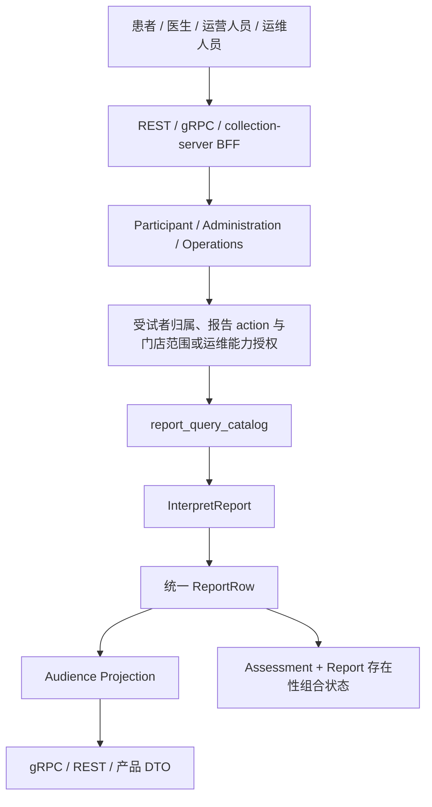
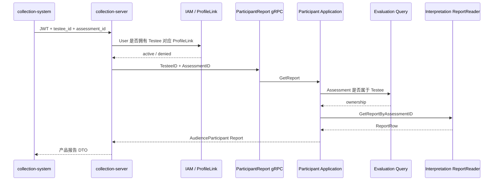
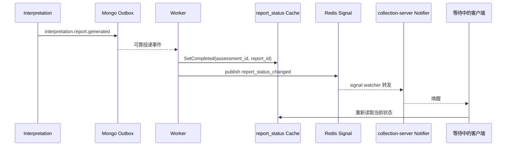

# 关键链路：从报告查询到组合状态

> 状态：本文已按当前源码重写。本文描述报告成品如何经过当前报告目录、行为人授权、Audience 投影和传输层适配被不同调用方读取，以及系统如何在不修改 Evaluation 聚合的前提下组合出 `interpreted`。
> 文中会明确区分已经成立的实现、查询加速状态和仍需治理的设计缺口。

## 1. 本文回答什么

上一篇沿写链路解释了 Outcome 怎样最终成为不可变的 `InterpretReport`。但报告提交成功，并不等于所有调用方都可以直接把 MongoDB 文档返回给客户端。读链路还必须连续回答五个问题：

1. 当前 Assessment 应该读取哪一份报告成品；
2. 当前行为人是否有权访问这个受试者和这次测评；
3. 即使有权访问，面向患者、医生和管理员分别可以展示哪些内容；
4. Evaluation 中的 `evaluated` 与 Interpretation 中的“报告已经存在”怎样组合为客户端理解的完成状态；
5. Redis 状态、通知信号、短轮询、长轮询和 WebSocket 怎样加速等待，而不成为报告事实本身。

本文的核心结论是：

> “报告已经生成”“当前行为人有权读取报告”“客户端可以显示测评已解读”是三件不同的事。qs-server 通过 Interpretation 读模型、行为人用例和 Journey 状态投影把它们组合起来，而不是让任何一个模块独占全部语义。

## 2. 30 秒结论

报告读取的主链路可以概括为：

```text
调用方身份与查询范围
  -> 行为人用例授权
  -> report_query_catalog 选择 Assessment 的当前报告
  -> 加载 InterpretReport 成品正文
  -> 统一 ReportRow
  -> Audience 章节投影
  -> gRPC / REST / BFF 传输模型
  -> 患者、医生或运营界面
```

组合状态的主链路可以概括为：

```text
Evaluation Assessment.status = evaluated
                +
Interpretation 当前 Report 存在
                ↓
Journey / BFF 查询投影 = interpreted
```

这里有四条不可混淆的原则：

- `InterpretReport` 是报告内容的事实源；
- `report_query_catalog` 是当前报告选择与列表过滤的查询索引，不是报告正文；
- `interpreted` 是跨 Evaluation 与 Interpretation 的查询投影，不回写 Assessment 聚合；
- Redis `report_status` 与 `report_status_changed` 只是等待加速设施，缓存丢失或信号丢失不能让已经生成的报告变成不存在。

## 3. 为什么需要“组合状态”

### 3.1 Evaluation 只能声明测评结果已经成立

Evaluation 负责：

- 接收可靠作答事实；
- 创建并执行 Assessment；
- 调用 Calculation；
- 提交 Outcome；
- 将 Assessment 推进到 `evaluated` 或失败终态。

当 Assessment 处于 `evaluated` 时，只能说明机器可判定的测评结果已经可靠成立。它不能同时承诺：

- 报告 Builder 已经成功执行；
- 报告正文已经提交；
- 当前调用者可以看到报告；
- 查询端的缓存或通知已经更新。

### 3.2 Interpretation 独立管理报告生成结果

Interpretation 负责自己的 Generation、Run 和 InterpretReport。报告生成可能晚于 Outcome 提交，也可能因为模板、冻结输入、Builder 或基础设施错误而失败。

如果 Interpretation 为了表示“报告已经生成”而直接修改 Evaluation 的 Assessment 状态，会制造以下问题：

- Interpretation 需要跨模块写入另一个聚合；
- 报告失败可能污染已经成立的 Outcome；
- Evaluation 状态机必须理解报告模板和生成重试；
- 重新生成报告时很难解释 Assessment 状态是否应该回退；
- Evaluation 与 Interpretation 无法独立治理失败和重试。

因此当前实现保留 Assessment 的 `evaluated`，在查询时通过报告存在性追加 `interpreted` 投影。

### 3.3 `interpreted` 是读语义，不是新的领域事实

当前 `reportquery.ProjectAssessment` 使用以下规则：

| Evaluation 状态 | 当前 Report | 组合状态 |
| --- | --- | --- |
| 非 `evaluated` | 不查询 | 保留 Evaluation 状态 |
| `evaluated` | 不存在 | `evaluated` |
| `evaluated` | 存在 | `interpreted` |
| `failed` | 不查询 | `failed` |

这个投影不会修改传入的 Evaluation DTO，也不会回写 MySQL。它只在查询结果中增加：

- `Status = interpreted`；
- `InterpretedAt = ReportRow.CreatedAt`。

因此，更准确的表述是：

> `interpreted` 表示“测评结果已经成立，并且 Interpretation 当前报告读模型能够解析出报告成品”，而不是 Assessment 聚合内部又完成了一次状态迁移。

## 4. 三类事实必须分开

### 4.1 业务内容事实

业务内容事实由 MongoDB 中的报告成品持有：

- 当前成品：`interpret_report_artifacts`；
- 当前成品与 Generation、Run、Outbox 在成功提交事务中一起成立。

它回答：

> 这份报告的模型、分数、等级、维度、结论、建议和模型特有内容是什么？

### 4.2 当前报告查询事实

`report_query_catalog` 是面向查询的紧凑目录。它记录：

- Assessment、受试者和组织关联；
- 当前选中的 Artifact 来源类型与来源 ID；
- 模型编码、风险等级和排序字段；
- 当前查询应该读取哪份 Artifact。

它回答：

> 对这次 Assessment，当前查询应该选择哪一份报告；某个组织或受试者的报告列表应该命中哪些条目？

它不保存完整报告正文。详情查询和列表查询都先查 catalog，再批量加载当前页对应的报告正文。

### 4.3 等待加速事实

Redis `report_status:{assessment_id}` 保存短期状态快照，例如：

- `queued`；
- `processing`；
- `scoring`；
- `interpreting`；
- `completed`；
- `failed`。

`report_status_changed` 则是一条唤醒等待者的信号。它们回答：

> 客户端此刻是否值得再次读取权威状态或报告？

它们不能回答报告正文是什么，也不能替代 MongoDB 中的报告存在性。缓存 TTL 当前默认 48 小时；缓存过期后，系统必须能够通过 Assessment 和报告查询回退恢复状态。

## 5. 总体读链路


```mermaid
flowchart TD
    Caller["患者 / 医生 / 运营人员 / 运维人员"]
    Entry["REST / gRPC / collection-server BFF"]
    Actor["Participant / Administration / Operations"]
    Auth["受试者归属、报告 action 与门店范围或运维能力授权"]
    Catalog["report_query_catalog"]
    Body["InterpretReport"]
    Row["统一 ReportRow"]
    Audience["Audience Projection"]
    DTO["gRPC / REST / 产品 DTO"]
    State["Assessment + Report 存在性组合状态"]

    Caller --> Entry --> Actor --> Auth
    Auth --> Catalog --> Body --> Row --> Audience --> DTO
    Row --> State
```

这张图中有两个容易被忽略的顺序要求：

1. **授权必须发生在报告内容暴露之前**。catalog 中存在 `org_id`、`testee_id` 不等于已经完成授权；
2. **Audience 投影发生在授权之后**。Audience 只决定已授权调用者可以看哪些章节，不决定调用者是否有权访问这份报告。

## 6. 第一步：当前报告目录选择成品

### 6.1 为什么查询不能直接扫描报告集合

报告正文较大，如果直接在 Artifact 集合上做组织、受试者、模型、风险和时间筛选，列表分页会和正文大小直接绑定，每个上层消费者也会重复实现同样的筛选与排序逻辑。

`report_query_catalog` 把这些问题收敛为“一次 Assessment 对应一个当前查询条目”。Artifact 成功提交时同步更新 catalog。

### 6.2 详情查询

`GetReportByAssessmentID` 的当前实现顺序是：

1. 按 `assessment_id` 查询唯一 catalog 条目；
2. catalog 不存在，返回 `ErrReportNotFound`；
3. 验证 `source_kind` 为 `artifact`；
4. 按 `source_id` 加载 Artifact 正文；
5. 将正文归一化为统一 `ReportRow`；
6. catalog 指向的正文不存在，返回 `CatalogDanglingSourceError`。

```text
assessment_id
  -> catalog(source_kind, source_id)
       -> artifact:{id} -> InterpretReport
  -> ReportRow
```

`CatalogDanglingSourceError` 很重要：catalog 存在但正文不存在不是“报告尚未生成”，而是内部数据一致性错误。业务层不能把它降级成普通 NotFound，否则会掩盖已损坏的查询索引。

### 6.3 列表查询

列表查询不是逐条回表。当前实现：

1. 在 catalog 上按组织、受试者、模型和风险条件过滤；
2. 先计算 `total`；
3. 按 `sort_at`、`sort_report_id`、`assessment_id` 倒序排序；
4. 对当前页执行 skip/limit；
5. 收集 Artifact 正文 ID；
6. 批量加载 Artifact；
7. 按 catalog 顺序重新组装 `ReportRow`。

分页默认 10 条，最大 100 条。catalog 让列表过滤、稳定排序和只加载当前页正文成为可能。

## 7. 第二步：行为人授权

Interpretation 当前有三类查询应用服务。它们共享 `ReportReader` 和报告投影能力，但授权规则不同。

| 行为人服务 | 主要调用者 | 授权范围 | 返回内容 |
| --- | --- | --- | --- |
| Participant | 患者、家长、小程序 BFF | 当前 Testee 及其 Assessment | 面向 participant 的报告 |
| Administration | 运营后台 | 当前报告 action 与受试者门店范围 | 面向 admin/operator 的报告，由 Access 决定 |
| Operations | 运维与治理入口 | 组织与运维 capability | 生命周期元数据，不返回业务正文 |

### 7.1 Participant：受试者归属是最终业务门禁

Participant 详情查询的应用层顺序是：

1. 校验 Testee 行为人存在；
2. 校验 Assessment 属于该 Testee；
3. 读取报告；
4. 使用 `AudienceParticipant` 投影。

列表查询则把 `TesteeID` 注入 `ReportFilter`，使 catalog 只返回该受试者的报告。

这里的关键不是“请求里带了 testee_id”，而是服务端必须证明：

```text
当前身份可代表 Testee
  AND
Assessment.testee_id == Testee.id
```

只有两个条件都成立，才能读取报告内容。

### 7.2 旧 Clinician 入口

医生专用 REST 入口已返回 `410 Gone`，独立 clinician 报告服务没有运行装配并已删除。
`AudienceClinician` 的受限内容策略仍保留，由 Administration 的详情与列表测试验证。

### 7.3 Administration：当前门店范围

详情先通过 Evaluation 的 `AuthorizeAssessmentResource` 验证报告 `read` action、Assessment 归属和当前门店权限。
列表先通过 Actor 的 `StoreScopeAccess` 验证 `list` action 与 Testee 门店范围，再把当前 OrgID、
`RestrictToStoreScope=true` 和受限 TesteeIDs 下推到 catalog；指定 TesteeID 时先校验其当前归属。

Access 根据受信任 IAM snapshot 选择 admin/operator Audience。应用服务在返回详情或列表前复验决策，
防止读取期间范围变化；显式空门店范围不能变成无过滤查询。

### 7.4 Operations：治理元数据不是业务报告

Operations 面向失败诊断、Generation/Run/Artifact 审计和重试治理。它返回的是：

- Generation 身份与状态；
- Run attempt、lease 和失败信息；
- Artifact 元数据；
- Outcome、Assessment 关联证据。

它不返回患者报告正文。Operations 由组织与运维 capability 授权，不能被当成绕过 Participant、Administration 的“超级报告查询接口”。

## 8. 第三步：统一 `ReportRow`

`ReportRow` 是 Interpretation 拥有的查询投影。它统一承载：

- Assessment ID；
- Model Identity；
- PrimaryScore 与 ResultLevel；
- 兼容字段 TotalScore、RiskLevel；
- Conclusion；
- Dimensions；
- Suggestions；
- ModelExtra；
- CreatedAt。

这个类型有两个作用：

1. 隔离新报告成品与历史归档之间的存储差异；
2. 给当前行为人用例提供同一个投影输入。

它不是完整的报告持久化模型。目前它没有暴露：

- ReportID、GenerationID；
- OrgID、TesteeID；
- source kind/source id；
- Builder Identity、TemplateVersion、ContentSchemaVersion；
- 完整的生成来源追踪。

这些字段一部分被刻意留在授权上下文或运维模型中，一部分则是当前读协议的不足。业务详情如果未来需要展示“这份报告由哪个模板版本生成”，应扩展显式查询契约，而不是从其他集合临时拼接。

## 9. 第四步：Audience 章节投影

### 9.1 Audience 解决的是展示边界

统一 `ReportRow` 经过 `reportprojection.Mapper.FromRow` 转换为应用层 Report，然后调用 Presenter 判断章节是否可见。

当前注册的可控制章节只有 `model_extra`：

| Audience | `model_extra` |
| --- | --- |
| participant | 可见 |
| clinician / operator | 不可见 |
| admin | 可见 |

Presenter 对未知 Audience 或未知章节返回错误，避免新增敏感章节时因为默认放行而泄漏。

### 9.2 Audience 不等于 Authorization

必须先完成“能不能看这份报告”的授权，再执行“能看哪些章节”的 Audience 投影：

```text
Authorization：你能否读取 Assessment 302 的报告？
Audience：已经允许读取后，model_extra 是否对你可见？
```

如果跳过第一步，给攻击者套一个 `AudienceClinician` 并不会使读取变得安全；它只是少返回一个章节。

### 9.3 Administration 使用已授权 Audience

Administration 已使用 Access 返回的 Audience，不再无条件传入 `AudienceAdmin`。
当前装配区分 admin/operator，受限 clinician/operator 的详情和列表均隐藏 ModelExtra，admin 保留。
该矩阵由 Administration 应用服务测试保护；新章节和新调用者仍需独立扩展验证。

## 10. 第五步：传输层与产品投影

Audience 投影之后，数据还会经过 gRPC、REST 或 BFF DTO。传输层不是无损通道。

### 10.1 Participant gRPC

Participant gRPC 目前比 apiserver REST 更丰富，能够表达：

- Model Identity；
- PrimaryScore、Level；
- DerivedScores；
- NormReference；
- ModelExtra。

但 proto 没有承载 Dimension 的 Role、ParentCode、HierarchyLevel 和 SortOrder，因此它仍然不是对 `ReportRow` 的完全无损序列化。

### 10.2 apiserver REST

当前通用 `ReportResponse` 主要面向医学量表旧契约，输出：

- scale name/code；
- total score、risk level；
- conclusion；
- 基础 dimensions；
- suggestions。

它会丢失较丰富的新模型信息，例如：

- 完整 Model Identity；
- PrimaryScore 的 kind、label、max；
- Level 的 label、severity；
- DerivedScores；
- Dimension Level 与 NormReference；
- ModelExtra。

因此，“应用层已经得到统一报告”不等于“每个外部接口都完整表达了统一报告”。接口升级应当明确版本兼容策略。

### 10.3 collection-server 的产品投影

collection-server 按报告返回的冻结 PresentationProfile 决定维度可见性，不读取当前发布模型的 `is_show` 来过滤历史报告。只有历史成品缺少 profile 时才采用显式版本化的 `legacy_artifact_dimensions/v1`，从不可变正文维度恢复；无法形成 profile 时保持不可证明，不以最新模型猜测。

PresentationProfile 控制成品自身的历史维度展示，Audience 控制当前行为人的章节展示，两者都不能替代资源授权。正常读取的冻结来源和兼容边界由[查询模型、授权与 Audience 投影](./24-核心设计-查询模型、授权与Audience投影.md)维护。事实入口为 [`read_model.go`](../../../internal/apiserver/infra/mongo/interpretation/read_model.go) 及其契约测试。

## 11. 患者端完整查询链

患者或家长从小程序读取报告时，实际经过两段身份边界。


```mermaid
sequenceDiagram
    participant Mini as collection-system
    participant BFF as collection-server
    participant IAM as IAM / ProfileLink
    participant GRPC as ParticipantReport gRPC
    participant P as Participant Application
    participant E as Evaluation Query
    participant R as Interpretation ReportReader

    Mini->>BFF: JWT + testee_id + assessment_id
    BFF->>IAM: User 是否拥有 Testee 对应 ProfileLink
    IAM-->>BFF: active / denied
    BFF->>GRPC: TesteeID + AssessmentID
    GRPC->>P: GetReport
    P->>E: Assessment 是否属于 Testee
    E-->>P: ownership
    P->>R: GetReportByAssessmentID
    R-->>P: ReportRow
    P-->>BFF: AudienceParticipant Report
    BFF-->>Mini: 产品报告 DTO
```

这条链路中的责任是：

- collection-server 把 IAM User 转换为可代表的 Testee；
- apiserver Participant 服务验证 Assessment 与 Testee 的业务归属；
- Interpretation 读模型选择并加载报告；
- Audience 和 BFF 完成展示投影。

apiserver 的 Participant gRPC 本身并不持有 IAM User -> Testee 的映射，它信任受保护的 BFF 调用边界，再执行 Assessment 所有权校验。因此生产安全依赖 gRPC 传输边界与 BFF 身份转换同时成立。

## 12. 医生与运营端查询链

### 12.1 旧医生详情入口

旧 `/clinicians/me/*` 查询入口直接返回 `410 Gone`，不再加载报告正文。
后台报告详情走下面的 Administration 链路；clinician 是保留的投影策略，不是独立运行服务。

### 12.2 运营详情

```text
OrgID + OperatorUserID + AssessmentID
  -> Evaluation AuthorizeAssessmentResource 校验报告 read action 与门店范围
  -> catalog 选择当前报告
  -> ReportRow
  -> Access 决定 AudienceAdmin / AudienceOperator
  -> 运营接口 DTO
```

### 12.3 运营列表

```text
操作员访问范围
  -> OrgID + 显式 StoreScopedTesteeIDs + 可选 TesteeID catalog filter
  -> catalog count + page
  -> 批量加载正文
  -> 每条 ReportRow 执行 Access 决定的 admin/operator 投影
  -> ReportList
```

列表范围必须由授权服务决定，调用者传入的 `testee_ids` 不能直接成为可信过滤条件。

## 13. apiserver 如何组合 `interpreted`

### 13.1 单条 Assessment 投影

`journey/reportquery` 的 `GetAssessmentProjection` 先通过 Evaluation Operator 查询 Assessment，然后调用 `ProjectAssessment`：

```text
Operator.GetAssessment
  -> Assessment.status != evaluated
       -> 原状态
  -> Assessment.status == evaluated
       -> ReportReader.GetReportByAssessmentID
            -> not found: evaluated
            -> found: interpreted + interpreted_at
            -> consistency error: 查询失败
```

这个 Journey 是组合层，因为它同时使用 Evaluation 和 Interpretation 的事实，却不取得两个聚合的写权限。

### 13.2 Assessment 列表投影

Journey 先读取已授权 Assessment 页，再收集 evaluated 项的 ID，通过 `BatchReportMetadataReader` 一次读取当前报告 metadata，逐项投影 `interpreted` 与时间。该查询不加载正文，不获取 Evaluation 或 Interpretation 写权限。

生产 reader 提供批量接口；只有替换 reader 不具备该能力时，才保留逐项 fallback。真实实现与“只发生一次批量读取”的测试见 [`journey/reportquery`](../../../internal/apiserver/application/journey/reportquery/)。

### 13.3 apiserver 的 `wait-report`

运营端 `GET /api/v1/assessments/:id/wait-report` 使用另一套简单等待模型：

1. 先通过 Operator 查询验证 Assessment 权限；
2. 立即读取一次 Assessment + Report 组合状态；
3. 非终态时每秒重新读取；
4. 组合状态为 `interpreted` 或 Evaluation 为 `failed` 时返回；
5. 请求上下文结束时返回 `pending`。

它不依赖 collection-server 的 Redis signal，也不使用 Participant 身份链。两套 wait-report 入口服务不同调用方，不应在文档中混成一个实现。

## 14. collection-server 如何组合客户端状态

### 14.1 内部状态与公开状态

collection-server 的等待服务内部使用 `completed` 表示报告已经生成；对外通过 `ToPublicAssessmentStatus` 映射为 `interpreted`。

| 内部 status | 公开 status | 含义 |
| --- | --- | --- |
| queued / processing | processing | 后续链路尚未完成 |
| completed | interpreted | 报告可查询 |
| failed | failed | 当前公开失败终态 |

`stage` 提供更细的阶段，例如 queued、processing、interpreting、completed、failed。客户端业务判断应优先依赖稳定的 public status，而不是把所有 stage 当成领域状态机。

### 14.2 当前状态解析顺序

`reportwait.checkCurrentStatus` 当前采用：

```text
Redis report_status 命中
  -> 直接转换为状态响应

Redis miss / Redis error
  -> Participant GetMyAssessment
       -> evaluated
            -> Participant GetAssessmentReport
                 -> 存在: completed
                 -> NotFound: interpreting
       -> failed: failed
       -> submitted: processing
       -> 其他: queued
```

Redis 不可用时会回退到 apiserver 查询，而不是让等待功能整体不可用。报告已生成但状态缓存丢失时，系统可通过“Assessment evaluated + Report exists”重建 `completed`。

### 14.3 为什么 `evaluated` 后还要查 Report

只读取 Assessment 会把 `evaluated` 误当成报告完成；只读取 Report 又无法表达 Evaluation 失败或仍在执行。当前回退链路把两者组合：

- Assessment 非 evaluated：用 Evaluation 阶段表达进度；
- Assessment evaluated + Report NotFound：进入 interpreting；
- Assessment evaluated + Report exists：completed；
- Assessment failed：failed。

这与 apiserver Journey 的核心语义一致，只是面向小程序增加了缓存、阶段提示和等待协议。

## 15. 三种等待方式

### 15.1 `report-status` 短轮询

`report-status` 立即返回，不占用长连接，并通过 `next_poll_after_ms` 指导客户端退避。它是当前新客户端的推荐 HTTP 方案。

适合：

- 小程序网络环境不稳定；
- 报告通常在数秒内生成；
- 客户端能够按服务端建议退避；
- 希望限制单请求占用时间。

### 15.2 `wait-report` 长轮询

collection-server 的长轮询默认等待 20 秒，允许范围 1 到 25 秒。其工作方式是：

1. 先检查一次当前状态；
2. 已终态则立即返回；
3. signaling 未启用时按默认 500ms 轮询；
4. signaling 启用时订阅进程内 Notifier；
5. 订阅后再次检查，关闭“检查与订阅之间”的竞态窗口；
6. 收到终态信号后重新读取当前状态；
7. 超时、取消或等待能力降级时返回 processing，而不是把等待超时解释为报告失败。

系统还为 wait-report 配置了独立限流预算、HTTP 并发槽位和最大 active waiter。连接压力过大时可以快速返回 pending 与 Retry-After。

它保留用于兼容旧客户端，但高峰场景下每个等待请求都会占用连接和 goroutine，因此新接入优先选择短轮询或 WebSocket。

### 15.3 WebSocket `/api/v1/report-events`

WebSocket 模式适合在报告生成完成时主动唤醒客户端：

1. 客户端发送 kind、testee_id、assessment_id；
2. Resolver 先按产品类型校验 Assessment 访问权；
3. 服务端读取并立即发送当前状态；
4. 非终态时订阅本进程 Notifier；
5. Redis signal watcher 将跨进程信号转发到本地 Notifier；
6. 收到 completed/failed 信号后重新读取当前状态；
7. 发送终态并关闭订阅。

WebSocket 不是直接把 Redis 消息透传给客户端。服务端把信号当作“值得重读”的通知，终态仍由当前状态解析器确认。

## 16. 报告生成事件怎样唤醒读端

### 16.1 成功链路


```mermaid
sequenceDiagram
    participant I as Interpretation
    participant O as Mongo Outbox
    participant W as Worker
    participant C as report_status Cache
    participant S as Redis Signal
    participant N as collection-server Notifier
    participant Client as 等待中的客户端

    I->>O: interpretation.report.generated
    O-->>W: 可靠投递事件
    W->>C: SetCompleted(assessment_id, report_id)
    W->>S: publish report_status_changed
    S-->>N: signal watcher 转发
    N-->>Client: 唤醒
    Client->>C: 重新读取当前状态
```

Worker 当前已经在消费 `interpretation.report.generated` 后调用 `ReportStatusReporter.SetCompleted`。Reporter：

- 尝试写入 completed 快照；
- 尝试发布 `report_status_changed`；
- Redis 写入或发布失败只记录日志，不反向否定已经提交的 InterpretReport。

这个 best-effort 边界是合理的，因为报告业务事实在事件发出前已通过 MongoDB 事务成立。通知失败最多让客户端稍后轮询，不应把已成功的报告生成改成失败。

### 16.2 失败链路

Worker 优先读取失败事件中冻结的 RetryDecision，而不是只根据 `retryable` 猜下一步：

| disposition | 公开等待投影 | 行为 |
| --- | --- | --- |
| automatic | 维持处理中 | 系统仍有自动恢复授权 |
| manual_required | temporarily_unavailable + waiting_manual_action | 等待具名人工处置，停止把它投影为自动处理中 |
| terminal | failed | 已形成失败终态 |

缺 RetryDecision 的历史事件才按 retryable 映射兼容 disposition。事件、Run 和等待投影应复制同一持久化决策；不能因为 transport ACK 已成立而删除业务失败。实际处理和测试见 [`report_handler.go`](../../../internal/worker/handlers/report_handler.go)。业务重试授权、预算和强制处置由[状态、幂等、重试与可靠提交](./22-核心设计-状态、幂等、重试与可靠提交.md)维护。

## 17. Redis 状态与信号的正确边界

### 17.1 Cache 是加速层

缓存命中可以避免每次轮询都走：

```text
collection-server
  -> Participant gRPC
  -> Evaluation MySQL
  -> Interpretation catalog
  -> Mongo report body
```

但缓存不参与 InterpretReport 的提交事务，也不会永久保存。因此必须遵守：

- cache miss 可以回源；
- cache unavailable 可以降级；
- cache expired 可以重建；
- cache completed 不代替最终报告详情查询；
- cache failed 不删除 Outcome 或 Report。

### 17.2 Signal 是唤醒层

Redis signal 的语义不是“消息本身证明报告完成”，而是：

> 某个 Assessment 的报告状态可能已经改变，请重新读取当前状态。

因此 signal 可以丢，客户端仍能通过轮询恢复；signal 可以重复，重读仍然幂等；collection-server 多实例通过各自 watcher 将同一信号转为本地通知。

### 17.3 优先级只保护状态不回退

缓存按优先级更新：

```text
submitted < queued < processing < scoring < interpreting < completed/failed
```

这样迟到的 processing 不会覆盖 completed。当前 completed 与 failed 的优先级相同，新的同级状态可以覆盖旧状态。这说明缓存是运行时快照，而不是需要法律级审计的不可变状态历史。

## 18. 关键一致性窗口

### 18.1 Report 已提交，completed 缓存尚未写入

这是正常窗口：

- Journey 查询可以立即通过 Report 存在性得到 interpreted；
- collection-server Redis miss 时可回源得到 completed；
- Redis 仍是旧 processing 时，短时间内可能返回旧状态，直到事件更新或 TTL/回源机会出现。

后一种情况说明：当前 cache hit 会被直接信任，不会每次重新验证报告存在性。它换取了查询性能，但需要依赖事件及时推进缓存，并应配套观察“report generated 到 status completed”的延迟。

### 18.2 completed 缓存存在，报告详情读取失败

客户端可能先得到 interpreted，随后查询正文时遇到 catalog dangling、MongoDB 故障或数据损坏。

此时不能把正文错误伪装成“报告还在生成”。正确处理是：

- 状态接口可以说明此前已观测到完成；
- 报告详情返回可诊断错误；
- 运维通过 catalog、Artifact、Generation 和 Run 证据定位问题；
- 必要时重建 catalog 或执行受治理的补偿。

### 18.3 报告正文存在，catalog 不存在

业务读取只经过 catalog，因此这会表现为 Report NotFound，组合状态保持 evaluated。它属于可靠提交或历史迁移后的索引缺口。

新报告成功提交事务已经把 Report 与 catalog 放在同一事务中，正常写链路不应产生该窗口；历史数据同步和人工修复仍需验证 catalog 完整性。

### 18.4 catalog 存在，正文不存在

读模型返回 `CatalogDanglingSourceError`，不降级为 NotFound。这是明确的数据一致性故障。

### 18.5 列表分页期间有新报告进入

当前列表先 count，再查询当前页，两个读取不属于同一个 MongoDB 快照。并发写入时 `total` 与当前页可能存在瞬时差异。排序使用多个稳定字段降低翻页抖动，但 skip/limit 本身不能提供游标分页的一致视图。

## 19. 缓存与订阅前的资源授权

当前 `reportwait.Service.GetStatus` 与 `Wait` 在缓存读取、DB fallback、notifier 订阅前调用独立 `AuthorizeAssessment(TesteeID, AssessmentID)`。ProfileLink 证明 User → Testee 关系，应用查询证明 Assessment → Testee 归属，缓存命中不能改变授权结果。

缺查询服务时返回错误；NotFound/PermissionDenied 归一为资源拒绝。medical、typology 与其他产品入口共享该前置 guard，WebSocket 也在订阅前完成产品授权。授权失败不得读状态缓存，更不能等待信号。

事实与定向测试见 [`reportwait/service.go`](../../../internal/collection-server/application/reportwait/service.go) 和 [`service_test.go`](../../../internal/collection-server/application/reportwait/service_test.go)：缓存命中、miss、不可用三类场景均覆盖跨 Testee 拒绝。更完整的行为人、资源与 Audience 契约统一由[查询模型、授权与 Audience 投影](./24-核心设计-查询模型、授权与Audience投影.md)维护。

## 20. 已实现防线与未决读侧边界

| 边界 | 当前行为 | 后续触发条件 |
| --- | --- | --- |
| Catalog 与正文关联 | 加载后复验 Assessment、Testee、Org，损坏关联 fail closed | 新 source/schema 必须复用关联校验 |
| Operations 详情 | 先读 metadata 包络并授权，再加载 Artifact | 新治理字段先确定最小读取范围 |
| 组合列表 | 当前生产 reader 批量读 metadata；不具备能力的替换 reader 逐条 fallback | 用真实分页/机构容量评估下一步 |
| 失败等待状态 | automatic、manual_required、terminal 分别投影；不因 retryable=true 无限 processing | 新客户端须验证人工处置体验 |
| 历史维度展示 | 使用冻结 profile；legacy 按具名规则从成品恢复 | 新 schema 保留历史来源证明 |
| ReportRow 与外部 DTO | 部分来源、常模和丰富结果字段未统一暴露 | 新协议先确定稳定来源包络与兼容版本 |
| Audience | 授权后按受信行为人选择章节；未知策略拒绝 | 增加敏感章节前先确认业务矩阵 |
| 分页 | count/page 无统一快照，深分页成本仍存在 | 达到容量或稳定游标需求后再治理 |

上述已实现防线的所有权与证据入口由[查询模型、授权与 Audience 投影](./24-核心设计-查询模型、授权与Audience投影.md)维护。未决协议、容量和业务矩阵继续列在[设计问题与重构清单](./90-设计问题与重构清单.md)，本次正文修订不替代生产、客户端或业务验收。

## 21. 读链路必须保持的约束

### 21.1 报告事实约束

1. 报告详情必须来自可靠提交的不可变成品；
2. catalog 只选择当前成品，不重新生成或修改正文；
3. Catalog 的 `source_kind` 必须是 `artifact`；
4. catalog dangling 必须作为一致性错误暴露给内部诊断；
5. 报告列表必须按 Catalog 顺序稳定返回 Artifact。

### 21.2 授权约束

1. 先验证行为人访问范围，再读取或投影报告内容；
2. ProfileLink 与 Assessment ownership 是两个独立条件；
3. Redis cache hit 不能绕过 Assessment ownership；
4. 后台权限来自当前 IAM action scope 与 Testee 门店归属，不来自请求参数或历史创建关系；
5. Audience 不得被用来代替 Authorization；
6. Operations 不得返回患者报告正文。

### 21.3 状态约束

1. `evaluated` 只说明 Outcome 已可靠成立；
2. `interpreted` 是 evaluated + current Report exists 的查询投影；
3. 组合状态不得回写并污染 Evaluation 聚合；
4. 等待超时只表示本次等待结束，不表示报告失败；
5. Redis 状态和 signal 不能成为报告事实源；
6. 缓存失效后必须能从 Assessment 与 Report 恢复；
7. 信号丢失后必须能通过轮询收敛。

### 21.4 历史语义约束

1. 历史报告使用生成当时的 Outcome 与冻结输入；
2. 新模型版本不能改变历史报告分数和结论；
3. 影响历史阅读的展示规则也应冻结；
4. 旧报告协议的兼容映射必须可测试、可追溯。

## 22. 故障排查顺序

### 22.1 客户端一直显示 processing

按以下顺序判断：

1. Assessment 是否存在且属于目标 Testee；
2. Assessment 当前是否 `evaluated` 或 `failed`；
3. Outcome 是否可靠提交；
4. ReportGeneration 是否 completed、retry_scheduled、manual_required 或 failed；
5. 最新 InterpretationRun 停在哪个阶段；
6. InterpretReport 是否存在；
7. report_query_catalog 是否存在并指向正确 source；
8. Worker 是否消费 `interpretation.report.generated`；
9. Redis report_status 是否仍停留在旧状态；
10. signal watcher 与本地 Notifier 是否工作。

### 22.2 状态 interpreted，但报告接口 NotFound

重点检查：

1. Redis completed 是否为旧快照；
2. catalog 是否缺失；
3. catalog 是否指向已删除正文；
4. Participant/Administration 授权是否失败但被传输层映射为 NotFound；
5. BFF 是否调用了错误产品类型的报告接口；
6. 数据迁移是否只写正文而未同步 catalog。

### 22.3 某个角色能看到不该展示的内容

重点检查：

1. 实际调用的是 Participant 还是 Administration；
2. Actor 是否从可信身份上下文构造；
3. 实际 Audience 是否与行为人角色一致；
4. REST/gRPC DTO 是否绕过 Presenter 直接映射 PO；
5. 产品 BFF 是否在 Audience 之后重新拼入敏感字段；
6. Administration 的 Audience 是否仍与 Access 决策一致。

## 23. 面试与设计追问

### 23.1 为什么不把 Assessment 直接改成 interpreted

因为 Outcome 提交与报告生成属于两个模块、两个工作单元和两套失败治理。Assessment 的 `evaluated` 是 Evaluation 事实，Report 的存在是 Interpretation 事实。查询层可以组合两者，
但 Interpretation 不应跨模块修改 Evaluation 聚合。

### 23.2 组合状态会不会不一致

会存在短暂观察窗口，但可以通过清晰的事实优先级收敛：报告正文与 catalog 是权威读事实，Redis 只是加速；缓存 miss 回源，signal 丢失轮询，catalog dangling 作为一致性故障处理。
目标不是让所有观察在每一毫秒相同，而是让最终状态可恢复且不会用缓存覆盖业务事实。

### 23.3 为什么还需要 report_query_catalog

因为系统需要同时兼容新报告与历史归档，并支持按组织、受试者、模型、风险过滤、稳定排序和分页。catalog 把“当前报告选择”从业务正文中分离出来，使列表只加载当前页正文，也防止同一 Assessment 返回新旧两份报告。

### 23.4 Audience 与 RBAC 有什么区别

RBAC/关系授权回答调用者能否访问目标报告；Audience 回答已经授权后，报告中的哪些章节适合该类读者。前者是对象访问控制，后者是内容投影，两者缺一不可。

### 23.5 为什么 signal 到达后还要重读状态

signal 可能重复、乱序或只表达中间阶段，且它不是报告提交事务中的查询事实。将 signal 定义为 wakeup，可以在不要求消息承担强一致读模型的情况下减少轮询延迟。

### 23.6 为什么推荐短轮询而不是长轮询

短轮询单请求立即释放连接，结合 `next_poll_after_ms` 可以控制访问频率，更适合小程序和峰值流量。长轮询减少客户端请求次数，但会长期占用连接与 goroutine，因此需要独立限流、并发槽位和降级。WebSocket 可进一步减少轮询，但增加连接治理和跨实例通知复杂度。

### 23.7 当前读链路最值得优先修复什么

第一优先级是让所有 report-status/wait-report 在读取 AssessmentID 级缓存前完成 Assessment ownership 授权。它是安全边界，不能由性能缓存决定。
其次是 Administration Audience 收窄、历史维度展示冻结、组合列表批量化和 manual_required 状态表达。

## 24. 源码导航

| 主题 | 代码入口 |
| --- | --- |
| 统一报告读协议 | [`port/interpretationreadmodel/readmodel.go`](../../../internal/apiserver/port/interpretationreadmodel/readmodel.go) |
| catalog 与正文加载 | [`infra/mongo/interpretation/artifact_read_model.go`](../../../internal/apiserver/infra/mongo/interpretation/artifact_read_model.go) |
| catalog 持久化模型 | [`infra/mongo/interpretation/report_catalog.go`](../../../internal/apiserver/infra/mongo/interpretation/report_catalog.go) |
| Participant 查询 | [`application/interpretation/participant`](../../../internal/apiserver/application/interpretation/participant/) |
| 受限后台报告投影 | [`Administration 测试`](../../../internal/apiserver/application/interpretation/administration/service_test.go) |
| Administration 查询 | [`application/interpretation/administration`](../../../internal/apiserver/application/interpretation/administration/) |
| Operations 查询 | [`application/interpretation/operations`](../../../internal/apiserver/application/interpretation/operations/) |
| Audience Presenter | [`domain/interpretation/presentation`](../../../internal/apiserver/domain/interpretation/presentation/) |
| ReportRow 应用投影 | [`application/interpretation/reportprojection`](../../../internal/apiserver/application/interpretation/reportprojection/) |
| Assessment 组合状态 | [`application/journey/reportquery/service.go`](../../../internal/apiserver/application/journey/reportquery/service.go) |
| apiserver 等待 Journey | [`application/journey/reportwait/service.go`](../../../internal/apiserver/application/journey/reportwait/service.go) |
| Participant gRPC | [`transport/grpc/service/participant_report.go`](../../../internal/apiserver/transport/grpc/service/participant_report.go) |
| collection 状态组合 | [`collection-server/application/reportwait/service.go`](../../../internal/collection-server/application/reportwait/service.go) |
| 公开状态映射 | [`collection-server/application/reportstatus`](../../../internal/collection-server/application/reportstatus/) |
| Redis 状态与 Reporter | [`internal/pkg/reportstatus`](../../../internal/pkg/reportstatus/) |
| Signal 转本地通知 | [`collection-server/application/reportnotify`](../../../internal/collection-server/application/reportnotify/) |
| WebSocket 报告事件 | [`collection-server/transport/ws`](../../../internal/collection-server/transport/ws/) |
| ProfileLink 中间件 | [`collection-server/transport/rest/middleware/iam_middleware.go`](../../../internal/collection-server/transport/rest/middleware/iam_middleware.go) |
| 医学量表产品查询 | [`collection-server/application/evaluation`](../../../internal/collection-server/application/evaluation/) |
| 人格测评产品查询 | [`collection-server/application/typologyassessment`](../../../internal/collection-server/application/typologyassessment/) |
| 行为评定产品查询 | [`collection-server/application/behaviorassessment`](../../../internal/collection-server/application/behaviorassessment/) |
| 报告终态事件消费 | [`worker/handlers/report_handler.go`](../../../internal/worker/handlers/report_handler.go) |

## 25. 建议验证

### 25.1 Interpretation 查询与授权

```bash
go test ./internal/apiserver/application/interpretation/participant
go test ./internal/apiserver/application/interpretation/administration
go test ./internal/apiserver/application/interpretation/operations
go test ./internal/apiserver/application/interpretation/reportprojection
go test ./internal/apiserver/domain/interpretation/presentation
go test ./internal/apiserver/infra/mongo/interpretation
```

### 25.2 组合状态与等待

```bash
go test ./internal/apiserver/application/journey/reportquery
go test ./internal/apiserver/application/journey/reportwait
go test ./internal/collection-server/application/reportwait
go test ./internal/collection-server/application/reportstatus
go test ./internal/collection-server/application/reportnotify
go test ./internal/collection-server/application/reportevents
go test ./internal/collection-server/transport/ws
```

### 25.3 产品入口与事件推进

```bash
go test ./internal/collection-server/application/evaluation
go test ./internal/collection-server/application/typologyassessment
go test ./internal/collection-server/application/behaviorassessment
go test ./internal/collection-server/transport/rest
go test ./internal/apiserver/transport/grpc/service
go test ./internal/apiserver/transport/rest
go test ./internal/worker/handlers
```

除现有测试外，建议补充以下回归契约：

- medical/typology 状态接口在 Redis 命中时仍拒绝跨 Testee Assessment；
- completed signal 到达后必须重新读取状态；
- Redis 不可用时可通过 Assessment + Report 回源得到 interpreted；
- catalog dangling 不能被映射为普通 Report NotFound；
- 受限 clinician 不得获得 AudienceAdmin 的敏感章节；
- 历史报告维度展示不受当前发布模型 `is_show` 变化影响；
- Assessment 列表的批量组合投影不会产生 N+1。

文档结构与链接验证：

```bash
make docs-hygiene
make docs-facts
```

## 26. 与相邻文档的关系

- 报告为何是独立成品，见 [领域模型](./10-领域模型.md)；
- 统一生成主链路，见 [统一报告生成模型](./20-核心设计-统一报告生成模型.md)；
- 重试与终态可靠提交，见 [状态、幂等、重试与可靠提交](./22-核心设计-状态、幂等、重试与可靠提交.md)；
- 成品、版本与 catalog 事务关系，见 [报告成品、版本与数据一致性](./23-核心设计-报告成品、版本与数据一致性.md)；
- 行为人授权与 Audience 的设计展开，见 [查询模型、授权与 Audience 投影](./24-核心设计-查询模型、授权与Audience投影.md)；
- 写链路的逐步执行过程，见 [从 Outcome 到 InterpretReport](./30-关键链路-从Outcome到InterpretReport.md)。

本文最终固化的边界是：

> Report 是 Interpretation 的不可变业务成品；`interpreted` 是 Evaluation 与 Interpretation 在查询侧形成的组合状态；Audience 是授权后的内容投影；
> Redis cache 和 signal 只负责让客户端更快观察到变化。任何查询优化都不能绕过 Assessment 归属授权，也不能反过来改写报告事实。
