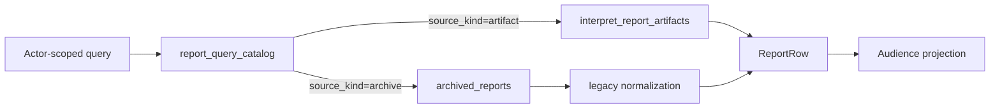

# 关键链路：多角色报告查询与状态投影

## 1. 本文回答

本文说明 participant、clinician、administrator 和 operations 为什么不能共用一个“无身份 ReportQueryService”，以及 catalog 如何选择 artifact/archive 正文、Audience 如何剪裁内容、`interpreted/completed` 如何从跨模块事实派生。

## 2. 30 秒结论

```text
caller identity
  -> actor-specific authorization
  -> report_query_catalog scope/filter/page
  -> load selected artifact or archive body
  -> normalize historical fields
  -> audience projection
  -> transport DTO
```

报告 ID、AssessmentID、TesteeID 和 OrgID 都是关联事实，不是授权结论。每个应用服务必须在读取报告正文前完成自己行为人的权限判定。

## 3. 四类行为人

| 行为人 | 应用服务 | 授权问题 | Audience |
| --- | --- | --- | --- |
| 受试者 / participant | `interpretation/participant` | Testee 是否存在，Assessment 是否属于该 Testee | `participant` |
| 临床人员 | `interpretation/clinician` | Operator 是否可访问 Testee，Assessment 是否属于该 Testee | `clinician` |
| 机构管理员 / 运营 | `interpretation/administration` | Assessment 是否在机构/操作员范围，列表是机构全量还是可访问 Testee 子集 | `admin` |
| 运维 / 审计 | `interpretation/operations` | Actor Org 是否与资源 Org 一致，IAM 是否有 `qs:interpretation_reports/audit` | 生命周期元数据，不走正文 Audience |

Audience 不进入 Generation Key。同一份标准报告在读取阶段生成不同视图，避免为每个角色重复构建和持久化成品。

## 4. Participant 查询链路

Participant 通过 `ParticipantReportService` internal gRPC 进入，collection-server 的 `ParticipantReportClient` 调用它查询报告。

### 4.1 单条报告

```text
testee_id + assessment_id
  -> participant.Access.AuthorizeOwnAssessment
       1. TesteeQueryService.GetByID
       2. Evaluation testee service AuthorizeAssessment
  -> ReportReader.GetReportByAssessmentID
  -> audience=participant projection
  -> AssessmentReport proto
```

Testee 存在性检查在 Assessment 归属检查前执行。报告存在不能取代这两层授权。

### 4.2 我的报告列表

```text
testee_id
  -> AuthorizeParticipant
  -> catalog filter(testee_id)
  -> stable page
  -> participant projection per row
```

分页默认 10，最大 100。列表只读当前页正文，不在内存中全量合并 artifact 和 archive。

## 5. Clinician 查询链路

REST 路由：

```text
GET /api/v1/clinicians/me/testees/{testee_id}/reports
GET /api/v1/clinicians/me/testees/{testee_id}/reports/{assessment_id}
```

链路：

1. Transport 提取 OrgID 和 OperatorUserID；
2. `TesteeAccessService.ValidateTesteeAccess` 检查照护/访问关系；
3. 单条查询额外通过 Evaluation testee service 校验 Assessment 属于该 Testee；
4. 列表按 TesteeID 查 catalog；
5. 以 `AudienceClinician` 投影报告。

当前 Presenter 对 clinician 隐藏 `ModelExtra`，其它标准字段按统一 Report DTO 返回。这是 Interpretation 的呈现策略，不是 Mongo 查询时删字段。

## 6. Administration 查询链路

Administration 应用服务通过 Evaluation OperatorQuery 的组织/操作员边界获得查询范围。

### 6.1 单条

`AuthorizeAssessment` 先调用 OperatorQuery.GetAssessment，只有 Assessment 在当前 actor 可见范围时才读 catalog 和正文。

### 6.2 列表范围

`ScopeReports` 可返四种形态：

| Scope | Catalog filter |
| --- | --- |
| 指定且授权 Testee | `testee_id = ?` |
| restricted + 有可见 Testee 列表 | `testee_id in [...]` |
| restricted + 空列表 | 直接返回空页，不发全量查询 |
| 非 restricted | `org_id = actor.org_id` |

这个分支避免把“可见 Testee 集合为空”错解成“无限制，查全机构”。

## 7. Operations 审计链路

Internal REST 路由：

```text
GET /internal/v1/interpretation/reports/{report_id}
GET /internal/v1/interpretation/outcomes/{outcome_id}/generations
GET /internal/v1/interpretation/assessments/{assessment_id}/lifecycle
GET /internal/v1/interpretation/assessments/{assessment_id}/reports
```

路由先经 capability middleware，应用服务再次检查：

1. OperatorUserID / OrgID 完整；
2. 通过 Evaluation Outcome 关联获得资源 OrgID；
3. actor.OrgID = resource.OrgID；
4. AuthzSnapshot 允许 `CapabilityAuditInterpretation`。

Operations 返回 Generation、latest Run 和 Report 元数据，可以回答：

- 某 Outcome 有哪些 ReportType/TemplateVersion Generation；
- 最新 attempt 是否 running、lease 何时过期；
- 失败 kind/code/retryable 是什么；
- 某 Assessment 有哪些历史 Artifact。

它不绕过 catalog 向普通用户暴露全部历史版本。

## 8. Catalog 选择正文的共用链路



`ReportReader` 只暴露两个查询：

- `GetReportByAssessmentID`；
- `ListReports(filter, page)`。

不对普通读侧暴露 `GetReportByID`，因为 ReportID 不能替代 Assessment/Testee/Org 授权上下文。Operations 如需 ReportID 审计，使用独立受权用例和 Artifact Repository。

Catalog 条目的正文缺失时返回 `CatalogDanglingSourceError`，不跳过该项继续伪造一个完整分页。

## 9. 历史报告规范化

Archive 可能只有 ScaleCode/Name、TotalScore、RiskLevel 和 legacy ModelExtra。Mongo adapter 在读边界兼容推导：

- 缺 ModelIdentity -> 按 scale 和 legacy code/title 组装；
- 缺 ProductChannel / AlgorithmFamily -> 按 model identity 的统一 mapping 补充；
- 缺 PrimaryScore -> 从 TotalScore 生成 raw_total；
- 缺 Level -> 从 risk level 推导 severity，或从 typology TypeCode 构造 non-risk level。

兼容逻辑停留在 Mongo read-model adapter，不污染新 InterpretReport 领域模型，也不回写 Archive。

## 10. Audience 投影

`reportprojection.FromRow` 先把统一 ReportRow 转为应用 DTO，再调用 `presentation.Presenter.Allows`。当前只存在一个显式 section 策略：

| Section | Participant | Clinician | Admin |
| --- | --- | --- | --- |
| `model_extra` | 可见 | 不可见 | 可见 |

未知 Audience 或 Section 会返回错误，不会默认放行。新增可见性规则应修改 Presenter 和直接测试，不在每个 Transport 里各写一份删字段逻辑。

## 11. `evaluated -> interpreted` 是组合投影

Administration 的 `journey/reportquery` 先读取 Evaluation Assessment DTO：

```text
Assessment.status != evaluated
  -> 保持原状态

Assessment.status == evaluated
  + catalog 没有报告
  -> evaluated

Assessment.status == evaluated
  + catalog 有当前报告
  -> interpreted + InterpretedAt = Report.CreatedAt
```

这个 Journey 不修改原 Evaluation DTO，也不把 `interpreted` 写回 Assessment 表。同样，collection-server 对外的 `completed` 是报告状态读模型语言，不是新领域状态。

## 12. 报告状态缓存与等待接口

Redis `report_status` snapshot 和 `report_status_changed` signal 是 best-effort 加速/唤醒机制，不是报告事实源。当前代码中：

- Evaluation Worker 会写 processing 和 evaluation_failed；
- `Reporter.SetCompleted` 已实现，但当前生产代码没有调用点；
- 因此报告完成的 canonical 判定仍是 catalog/artifact 存在，不能仅依赖 Redis `completed`；
- apiserver `wait-report` Journey 当前每秒读取 Assessment + Report 组合投影，context 结束时返回 pending。

这是当前实现限制，文档不应把 Redis signaling 写成已完整闭环的报告完成通知。

## 13. 诊断顺序

### 查不到单条报告

```text
actor identity / org / testee relation
  -> Assessment ownership
  -> catalog assessment_id entry
  -> source_kind/source_id body
  -> audience projection
```

### 列表总数或顺序异常

```text
actor scope
  -> catalog filter
  -> sort_at + sort_report_id + assessment_id ordering
  -> page source IDs
  -> body batch load
```

### Assessment 一直是 evaluated

```text
Evaluation Assessment really evaluated
  -> catalog has current entry
  -> selected body exists
  -> reportquery ProjectAssessment called
  -> transport uses projected status
```

## 14. 代码与验证入口

- 行为人服务：`application/interpretation/{participant,clinician,administration,operations}`
- 组合授权：`container/module_init.go`
- 读模型：`port/interpretationreadmodel`、`infra/mongo/interpretation/artifact_read_model.go`
- Audience：`domain/interpretation/presentation`
- 组合状态：`application/journey/reportquery`、`reportwait`
- REST / gRPC：`transport/rest/routes_interpretation.go`、`api/grpc/proto/interpretation/interpretation.proto`

```bash
go test ./internal/apiserver/application/interpretation/participant
go test ./internal/apiserver/application/interpretation/clinician
go test ./internal/apiserver/application/interpretation/administration
go test ./internal/apiserver/application/interpretation/operations
go test ./internal/apiserver/application/journey/reportquery ./internal/apiserver/application/journey/reportwait
go test ./internal/apiserver/infra/mongo/interpretation ./internal/apiserver/transport/grpc/service
```
