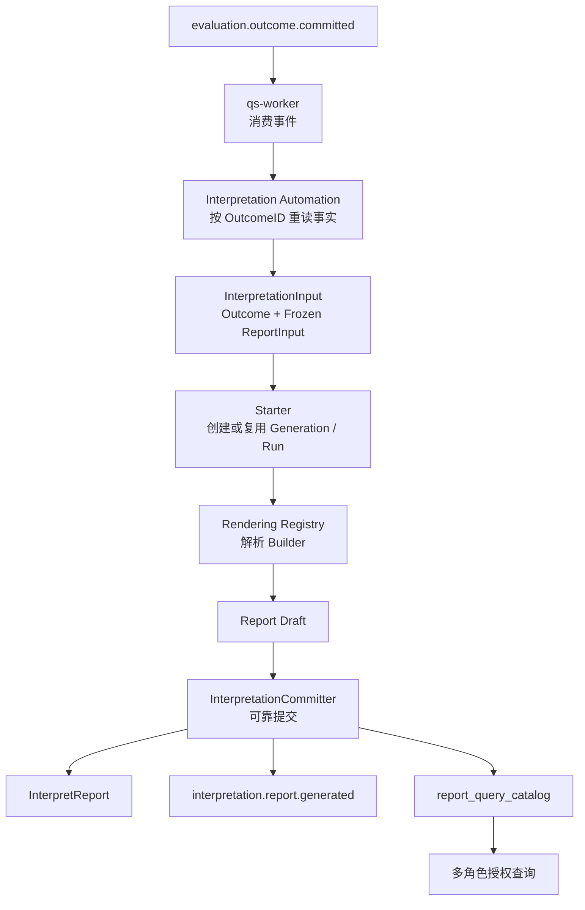

# Interpretation 模块

> 状态：本篇已按当前源码重写。Interpretation 的生成生命周期、重试治理和查询模型已落地；报告模板版本的发布管理等能力仍存在明确的设计缺口，本文会区分当前事实与目标边界。

## 1. 30 秒结论

Interpretation 是 qs-server 的统一报告生成模块：

> 它消费 Evaluation 已经可靠提交的 Outcome 事实与冻结的报告输入，把机器可判定的测评结果转换为可追溯、可版本化、可授权展示的人类可读报告。

```text
EvaluationOutcome + Frozen ReportInput
  -> InterpretationInput       Interpretation 拥有的只读生成输入
  -> ReportGeneration          一份报告的幂等生成意图
  -> InterpretationRun         一次可观测、可治理的执行尝试
  -> Builder -> Report Draft   进程内的报告内容组装
  -> InterpretReport           可靠提交后的不可变报告成品
  -> report_query_catalog      面向查询的当前报告索引
  -> Audience Projection       患者、医生、管理员的可见性投影
```

Interpretation 的价值不是再做一遍计分，而是在不改变 Outcome 事实的前提下，收敛不同测评模型的报告生成差异，并为报告生成失败、重试、查询和历史追溯建立稳定边界。

## 2. 为什么需要独立的 Interpretation

如果系统只有一个固定医学量表，可以在计分完成后直接拼接一段文案。但 qs-server 同时支持医学量表、人格测评、行为评定和认知测验，报告面临的问题已经不是“怎样把分数填进模板”。

### 2.1 测评结果不等于报告

Outcome 中的主分数、因子分数、等级、人格类型或能力水平，是机器可判定的结果事实。但医生、患者和家长需要的还包括：

- 这个结果代表什么；
- 不同因子或维度如何解读；
- 哪些内容应该引起关注；
- 针对当前结果可以给出什么建议；
- 不同读者可以看到哪些内容；
- 历史报告是否仍然保留生成当时的语义。

因此，Outcome 是 Interpretation 的可靠输入，InterpretReport 是独立产生的业务成品，两者不能合并成一个“测评完成结果”。

### 2.2 报告生成和测评执行不属于同一个工作单元

Calculation 成功、Outcome 可靠提交，不代表报告已经生成。报告构建还可能因为以下原因失败：

- 冻结输入缺少报告所需事实；
- 运行机制没有对应 Builder；
- 模板、Adapter 或报告组装器执行失败；
- 执行进程在报告提交前崩溃；
- MongoDB 事务或 Outbox 提交失败。

如果把这些错误同 Evaluation 状态绑定，报告模板问题会污染已经成立的测评结果。独立 Interpretation 后：

- Assessment 可以保持 `evaluated`；
- Outcome 保持不可变；
- 报告失败只在 ReportGeneration 和 InterpretationRun 中治理；
- 修复模板或配置后，可以独立重试报告生成。

### 2.3 不同模型的报告差异需要稳定扩展点

不同测评机制并不共享完全相同的报告结构：

| 机制 | 报告重点 |
| --- | --- |
| 因子计分 | 总分、风险等级、因子分数、因子解读和建议 |
| 常模校准 | 原始分、派生分数、常模引用、等级和对应解读 |
| 人格类型 | 类型编码、类型名称、匹配度、维度偏好、人格详情 |
| 特质画像 | 多维特质分布、维度特征和综合画像 |
| 认知任务 | 正确率、反应时、能力水平和任务维度表现 |

Interpretation 不按 model code 堆叠分支，而是使用 `AlgorithmFamily + DecisionKind + ReportType + TemplateVersion + 可选细分键` 解析 Builder。这使同类模型可以共享报告机制，异类模型通过稳定扩展点接入。

## 3. Interpretation 负责什么

| 职责 | 需要保护的语义 |
| --- | --- |
| 构建冻结生成输入 | 报告只使用已提交 Outcome 和历史冻结素材，不重读当前草稿 |
| 管理生成意图 | 同一 Outcome、ReportType 和 TemplateVersion 不重复生成 |
| 管理执行尝试 | 记录 attempt、trace、lease、失败分类和重试决策 |
| 解析报告 Builder | 根据稳定机制身份选择内容组装能力 |
| 组装报告内容 | 把结果事实与冻结解释素材组织为 Draft |
| 可靠提交成品 | 原子提交 Report、Generation、Run、查询索引和终态事件 |
| 管理报告读取 | 先授权，再按 participant、clinician、admin 投影内容 |
| 提供运维审计 | 可按 Outcome 或 Assessment 查看 Generation、Run 和 Report 证据 |

## 4. Interpretation 不负责什么

| 不属于 Interpretation 的能力 | 所有者 | Interpretation 如何协作 |
| --- | --- | --- |
| 问卷、题目、答案校验与 AnswerSheet | Survey | 不直接读答案，只消费 Evaluation 形成的事实 |
| AssessmentModel、Factor、Norm、Decision 的编辑与发布 | ModelCatalog | 使用冻结到 Outcome 输入中的发布资产 |
| 计分、常模转换、类型分类和能力判定 | Calculation / Evaluation | 信任 Outcome 中已成立的结果事实 |
| Assessment 和 EvaluationRun 状态机 | Evaluation | 不修改 Assessment，不因报告失败回退 `evaluated` |
| IAM 身份和患者照护关系 | IAM / Actor / 外部医疗业务 | 调用行为人访问策略完成授权 |
| Plan 周期与 Task 调度 | Plan | 报告只关联最终 Assessment，不调度下一次测评 |
| 跨测评趋势、高风险工作台和组合进度 | Statistics / Journey / Read Model | 提供报告事实和终态事件 |

## 5. 两条必须分开的边界

### 5.1 Decision 与 Interpretation

Decision 回答的是“结果是什么”，例如：

- 总分处于哪个等级；
- 某个常模分数对应哪个程度；
- 多个维度组合为哪个人格类型；
- 任务表现对应哪个能力水平。

Interpretation 回答的是“如何向人解释这个已经成立的结果”，例如：

- 如何组织总结、维度和建议；
- 如何选择冻结的解释文案；
- 如何显示分数、等级和常模引用；
- 不同读者可以看到哪些报告章节。

目标边界是：

> Outcome 决定结果，Interpretation 组织解释；Interpretation 不得重新计分、重新分类或改变 Outcome 结论。

当前某些常模报告会根据冻结常模表和 T 分数恢复展示文案。这是当前实现事实；它是否严格停留在“解释文案恢复”范围，会在后续设计文档和重构清单中单独审视。

### 5.2 Evaluation 成功与完整测评旅程

`Assessment=evaluated` 表示 Outcome 已可靠提交，不表示报告已生成。因此：

- Evaluation 成功后，Interpretation 可能仍在处理；
- Interpretation 失败后，Assessment 仍然是 `evaluated`；
- 面向客户端的“报告是否可查看”需要组合 Evaluation 和 Interpretation 事实；
- `interpreted` 或 `completed` 是 Journey / Read Model 投影，不应变成 Assessment 新状态。

## 6. 统一报告生成主链路



这条链路的准入事实不是 Assessment ID，也不是 Calculation 的内存返回值，而是已经持久化的 EvaluationOutcome。当前 gRPC 方法名仍为 `GenerateReportFromAssessment`，但生产调用传递和校验的是 `outcome_id`。

## 7. 三类复杂度

### 7.1 报告生成生命周期

Interpretation 必须回答：

- 同一份报告是否已经生成；
- 当前是第几次执行尝试；
- 运行中的尝试是否仍持有有效 lease；
- 失败是否可自动重试；
- 自动重试额度耗尽后，是否需要人工授权；
- 一次失败和一次重试是否留下完整审计事实。

这些语义由 ReportGeneration、InterpretationRun、retry decision、lease 和可靠事件联合保护。

### 7.2 报告内容扩展

Interpretation 必须在主链路不反复修改的情况下，支持不同机制的报告。当前默认 Registry 注册了四类 Builder：

| BuilderIdentity | AlgorithmFamily | 主要用途 |
| --- | --- | --- |
| `factor-scoring` | `factor_scoring` | 医学量表等因子计分报告 |
| `norm-profile` | `factor_norm` | 行为评定和常模画像 |
| `task-performance` | `task_performance` | 认知任务和能力表现 |
| `typology` | `factor_classification` | 人格类型、特质画像和模式分类 |

Builder 不创建 Report ID，不推进生命周期，不提交事务；它只把 InterpretationInput 确定性地组装为 Draft。

### 7.3 报告读取与授权

同一份不可变报告可以被不同行为人读取，但查询范围和内容可见性不同：

| 行为人 | 当前用例 | 授权语义 |
| --- | --- | --- |
| Participant | 查看自己的报告和列表 | 必须是受试者本人拥有的 Assessment |
| Clinician | 查看获授权患者的报告 | 需要机构、医生和患者关系授权 |
| Administration | 在机构或限定患者范围查询 | 需要机构范围或可访问受试者集合 |
| Operations | 查看 Generation、Run 和历史 Report | 需要明确的机构级审计授权 |

查询身份不进入 ReportGeneration 幂等键。当前系统先生成一份 canonical Report，再在读取阶段应用 Audience 可见性投影。

## 8. 核心设计原则

### 8.1 只消费已经成立的事实

Interpretation 不从 Assessment 现场重建计算结果，不使用 Evaluation 进程内 Execution，也不重读当前 ModelCatalog 草稿。生产入口先按 OutcomeID 读取持久化 Record，再解码其结果和冻结 ReportInput。

### 8.2 生成意图、执行尝试和成功成品分离

- ReportGeneration 回答“要生成哪份报告以及现在怎样”；
- InterpretationRun 回答“某次执行尝试发生了什么”；
- Draft 回答“Builder 在内存中组装了什么”；
- InterpretReport 回答“哪次成功执行产生了什么不可变成品”。

这个分离避免使用一个可变 Report 同时表示生成中、生成失败和已生成内容。

### 8.3 按机制扩展，不按模型编码扩展

Model code 标识具体业务资产；AlgorithmFamily、DecisionKind、ReportProfile 和 TemplateVersion 描述可复用的报告机制。

增加一个使用已有机制的新量表时，不应修改 Interpretation 主链路；只有出现新的报告输入形态或内容组装机制时，才应增加新 Builder 或 Adapter。

### 8.4 报告成品不可变

运营后续发布新模型、新解释文案或新报告模板时，已生成 InterpretReport 不应被覆盖。新 TemplateVersion 应当产生新的 ReportGeneration 和新报告成品。

当前 `TemplateVersion` 已进入 Generation 身份与 Report 身份，但生产适配器仍统一填充 `legacy-v1`，ModelCatalog 还没有正式发布报告模板版本。因此这是“已建立版本身份骨架，尚未完成资产发布”，不能写成已完整实现。

### 8.5 授权先于正文查询

AssessmentID、TesteeID 和 OrgID 是报告关联事实，不是授权凭据。应用服务必须先根据行为人和资源关系完成授权，再通过 report_query_catalog 加载报告正文。

## 9. 当前实现状态

| 能力 | 状态 | 说明 |
| --- | --- | --- |
| Outcome 驱动生产生成 | 已实现 | `evaluation.outcome.committed` 由 Worker 调用 Interpretation Automation |
| Generation 业务幂等 | 已实现 | 唯一键为 `OutcomeID + ReportType + TemplateVersion` |
| Run lease 与崩溃恢复 | 已实现 | 运行中尝试可通过过期 lease 被原 attempt 重新领取 |
| 自动、人工和强制重试治理 | 已实现 | RetryDecision、`interpretation.retry.requested` 和授权上下文已落地 |
| 成功/失败可靠提交 | 已实现 | Generation、Run、Report、Catalog 和 Outbox 使用 MongoDB 事务提交 |
| 四类报告 Builder | 已实现 | factor scoring、norm profile、task performance、typology |
| 多行为人查询 | 已实现 | participant、clinician、administration、operations |
| 报告模板版本发布 | 规划改造 | 当前使用代码固定的 `legacy-v1` |
| 成品自包含 Builder 与 ContentSchema 来源 | 规划改造 | 当前两者进入生成事件，未固化到 InterpretReport |
| 多 ReportType 并存查询 | 待明确 | 当前 catalog 以 AssessmentID 作为唯一当前报告键 |

## 10. 文档地图

本模块将按下列顺序逐篇重建。只有标记为“已重写”的文档才已完成本轮源码对齐；其余现有文件仍可作为信息素材，但需在后续讨论中重新验证和拆分。

| 顺序 | 文档 | 状态 | 核心问题 |
| --- | --- | --- | --- |
| 10 | [领域模型](./10-领域模型.md) | 已重写 | Generation、Run、Draft、InterpretReport 和读模型为什么分开 |
| 20 | [核心设计：统一报告生成模型](./20-核心设计-统一报告生成模型.md) | 已重写 | 不同测评机制如何共享稳定主链路 |
| 21 | [核心设计：冻结输入、Builder 与模板路由](./21-核心设计-冻结输入、Builder与模板路由.md) | 已重写 | Outcome、ReportInput、机制键和模板如何协作 |
| 22 | [核心设计：状态、幂等、重试与可靠提交](./22-核心设计-状态、幂等、重试与可靠提交.md) | 已重写 | 双状态机、lease、重试治理和终态事务 |
| 23 | [核心设计：报告成品、版本与数据一致性](./23-核心设计-报告成品、版本与数据一致性.md) | 已重写 | 不可变成品、模板版本、Mongo 数据关系和历史兼容 |
| 24 | [核心设计：查询模型、授权与 Audience 投影](./24-核心设计-查询模型、授权与Audience投影.md) | 已重写 | catalog、行为人用例和报告章节可见性 |
| 30 | [关键链路：从 Outcome 到 InterpretReport](./30-关键链路-从Outcome到InterpretReport.md) | 已重写 | Worker 如何从 Outcome 事件走到可靠报告提交 |
| 31 | [关键链路：从报告查询到组合状态](./31-关键链路-从报告查询到组合状态.md) | 已重写 | 报告查询、Audience 投影和客户端完成状态如何组合 |
| 90 | [设计问题与重构清单](./90-设计问题与重构清单.md) | 已编写 | 已确认的安全、语义、可靠性、版本与查询问题，以及实施顺序和验收门槛 |

## 11. 事实源与验证

| 主题 | 事实源 |
| --- | --- |
| Generation 聚合 | [`domain/interpretation/generation`](../../../internal/apiserver/domain/interpretation/generation/) |
| Run 执行尝试 | [`domain/interpretation/run`](../../../internal/apiserver/domain/interpretation/run/) |
| Input、Draft 和 InterpretReport | [`domain/interpretation/input`](../../../internal/apiserver/domain/interpretation/input/)、[`domain/interpretation/report`](../../../internal/apiserver/domain/interpretation/report/) |
| Builder 与路由 | [`domain/interpretation/rendering`](../../../internal/apiserver/domain/interpretation/rendering/) |
| 解释组装机制 | [`domain/interpretation/scoring`](../../../internal/apiserver/domain/interpretation/scoring/)、[`domain/interpretation/typology`](../../../internal/apiserver/domain/interpretation/typology/) |
| 生成编排与重试治理 | [`application/interpretation/automation`](../../../internal/apiserver/application/interpretation/automation/) |
| 多行为人查询 | [`application/interpretation`](../../../internal/apiserver/application/interpretation/) |
| MongoDB 生命周期与读模型 | [`infra/mongo/interpretation`](../../../internal/apiserver/infra/mongo/interpretation/) |
| gRPC 入口 | [`interpretation_automation.go`](../../../internal/apiserver/transport/grpc/service/interpretation_automation.go)、[`interpretation.proto`](../../../api/grpc/proto/interpretation/interpretation.proto) |
| Worker 事件消费 | [`assessment_evaluated_handler.go`](../../../internal/worker/handlers/assessment_evaluated_handler.go)、[`report_handler.go`](../../../internal/worker/handlers/report_handler.go) |
| 事件契约 | [`configs/events.yaml`](../../../configs/events.yaml) |
| 模块装配 | [`container/modules/interpretation`](../../../internal/apiserver/container/modules/interpretation/) |

```bash
go test ./internal/apiserver/domain/interpretation/...
go test ./internal/apiserver/application/interpretation/...
go test ./internal/apiserver/infra/mongo/interpretation
go test ./internal/apiserver/container/modules/interpretation/...
go test ./internal/apiserver/transport/grpc/service ./internal/worker/handlers
make docs-hygiene
```
