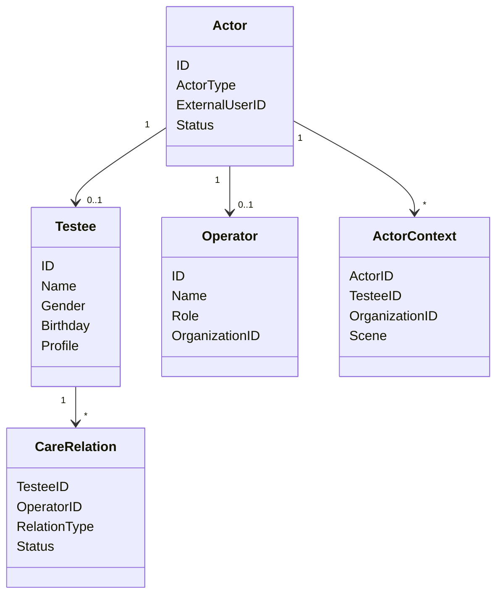

# Actor 领域模型

## 1. 模块核心概念

Actor 把外部认证身份转换成测评业务身份。核心不是登录，而是“这个人在当前测评场景里是谁、代表谁、能访问什么”。

---

## 2. 领域模型图

---

## 3. 聚合根与实体

| 类型 | 对象 | 说明 |
| ---- | ---- | ---- |
| 聚合根 | `Testee` | 被测评者业务档案 |
| 聚合根 | `Operator` / `Clinician` | 操作者或从业者视图 |
| 实体 | `CareRelation` | 服务或照护关系 |
| 值对象 | `ActorContext` | 一次业务访问上下文 |

---

## 4. 值对象

| 值对象 | 说明 |
| ------ | ---- |
| `ActorType` | 参与者类型 |
| `OrgScope` | 组织范围 |
| `Scene` | 访问场景 |
| `ProfileRef` | IAM Profile 引用 |

---

## 5. 领域服务

| 服务 | 职责 |
| ---- | ---- |
| 上下文解析 | 从 IAM 主体解析业务 Actor |
| 关系策略 | 判断受试者和操作者关系 |
| 权限边界 | 计算业务数据归属 |
| 档案维护 | 创建和更新 Testee |

---

## 6. 领域事件

Actor 的入口解析和接入日志是 `behavior_journey_scan` 的事实来源；Actor 不再产生 statistics footprint 事件。

---

## 7. 模型边界与反例

| 反例 | 说明 |
| ---- | ---- |
| `Testee` 不是 IAM User | Testee 是测评业务档案 |
| `ActorContext` 不是认证 token | 它是业务上下文 |
| `CareRelation` 不是任务 | 关系决定可访问性，不代表一次应测任务 |
| `OperatorRole` 不是报告权限 | 报告访问还要结合数据归属和场景 |
