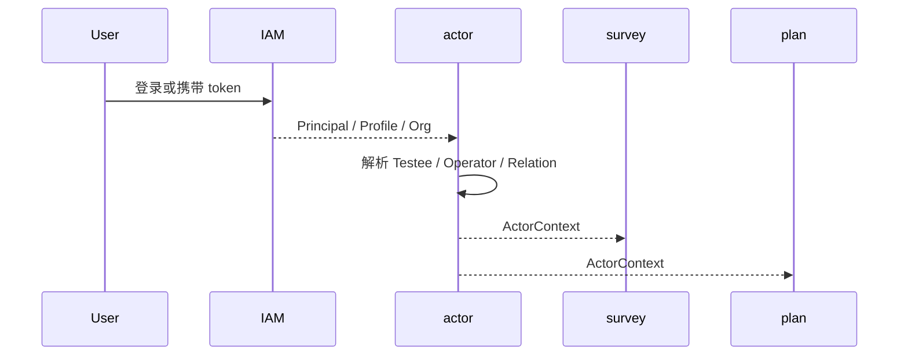

# 参与者上下文解析链路

## 1. 业务目标

把一次入口访问中的认证主体、组织、场景和受试者关系解析为业务可用的 `ActorContext`。

---

## 2. 流程图

---

## 3. 关键规则

- IAM principal 不能直接当成 Testee。
- 组织上下文、服务关系和入口场景共同决定数据可见性。
- ActorContext 是下游业务链路的输入，不是长期事实源。

---

## 4. 异常处理

| 场景 | 处理 |
| ---- | ---- |
| 未认证 | 由 IAM 拒绝 |
| 无业务关系 | Actor 拒绝进入业务链路 |
| 上下文缺失 | 要求补齐受试者或组织信息 |
