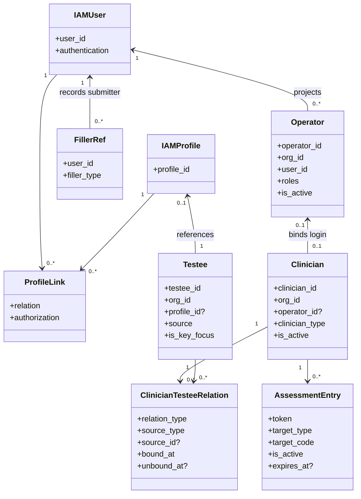
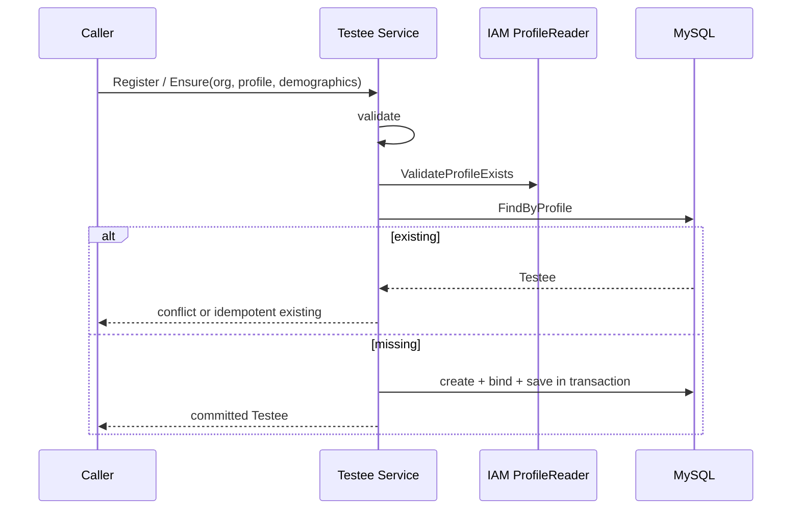
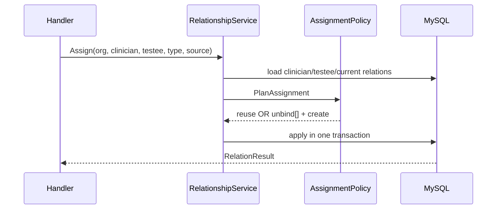
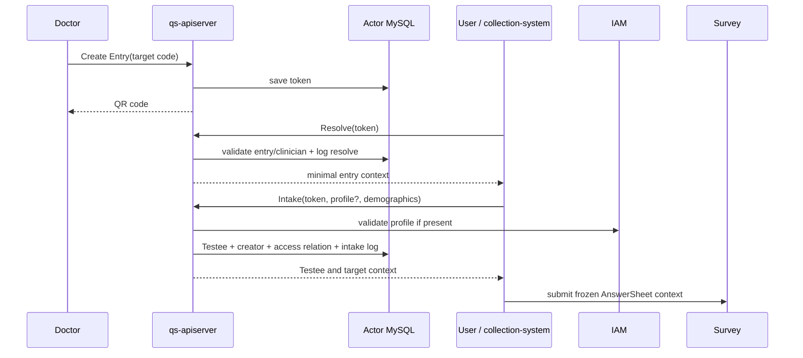

# Actor 领域模型与设计详解

> 状态：**已重写**。本文描述 Actor 的领域模型、IAM 边界、核心设计、关键链路和活动重构台账。Actor 当前收敛为 README + 本文两篇 canonical 文档，以控制 active 文档树规模；内容仍按独立问题分节，不按数据表压缩。

## 1. 建模目标

测评平台中的“人”不是一个 User 表可以表达的：同一个自然人可能既是 IAM User，又代表一个 Profile；在某个机构里是 Testee；登录运营后台时是 Operator；提供诊疗服务时又是 Clinician。一次答卷还必须区分受试者与填写人。

Actor 的建模目标是：

> 使用稳定、最小的业务身份和关系表达“谁接受测评、谁提交答案、谁提供服务、谁能够访问”，同时把认证凭据、问卷、测评结果和报告留在各自边界内。

## 2. 概念关系



## 3. Testee：测评结果的主体

Testee 代表“被测评的人”，而不是“当前登录用户”。它是测评、报告、趋势和 Plan 的稳定主体。

### 3.1 核心属性

| 属性 | 语义 |
| --- | --- |
| `id` | qs-server 内受试者标识 |
| `org_id` | 机构隔离边界 |
| `profile_id?` | 对 IAM Profile 的可选引用 |
| name/gender/birthday | 测评需要的基础人口学信息 |
| source | 档案产生来源，例如手工、入口、导入 |
| `is_key_focus` | 机构内重点关注标记 |
| assessment_stats | 历史兼容的统计快照字段，不是测评事实源 |

### 3.2 有 Profile 与临时 Testee

- 有 `profile_id`：可以通过 IAM ProfileLink 判断某个 User 是否能代表该 Testee；
- 无 `profile_id`：仍可作为真实业务主体完成门诊建档和测评，但不能仅凭 IAM 身份推导归属。

同一个 Profile 可以在不同机构形成不同 Testee，因为随访、医生关系和机构数据归属不同；同一机构内则不应重复绑定同一个 Profile。

### 3.3 核心不变量

- `org_id` 必须有效；
- 名称长度、性别枚举、生日不晚于当前时间且年龄不超过约束；
- Profile 绑定是幂等的，同一 Testee 不能从 Profile A 直接改绑为 Profile B；
- 绑定前仓储必须检查该机构内 Profile 未被其他 Testee 使用；
- 聚合不会把 IAM User、医生关系或 AnswerSheet 内容复制进来。

## 4. TesteeRef 与 FillerRef：跨模块的最小身份

Actor 根包提供轻量引用，而不是把 Testee 聚合传入 Survey：

```text
TesteeRef = testee_id + optional profile_id
FillerRef = iam user_id + filler_type
```

AnswerSheet 的 SubmissionContext 同时保存：

- FillerRef：谁实际操作提交；
- TesteeRef：答案属于谁；
- OrgID：属于哪个机构；
- TaskID：若来自 Plan，关联哪个任务。

当前 FillerType 有 `self`、`guardian`、`operator`。它是提交元数据，不是完整监护关系模型，也不能单独证明 User 有权代表 Testee；代表权限仍应由 IAM ProfileLink 或可信业务入口在提交前验证。

## 5. Operator：IAM User 的机构内业务投影

Operator 不是完整用户实体，不保存密码或 Token。它保存：

- qs-server 内部 Operator ID；
- 机构与 IAM User 绑定；
- 角色本地投影；
- 姓名、邮箱、电话等缓存字段；
- 在 qs-server 内是否激活。

当 IAM 授权启用时，权限真值来自 IAM 授权快照，本地 roles 是业务投影；IAM 未启用时，Actor 才保留本地角色管理回退语义。

当前支持的角色包括 `qs:admin`、`qs:content_manager`、`qs:evaluator`、`qs:evaluation_plan_manager` 和 `qs:staff`。

关键不变量：

- 同一机构、同一 User 只有一个有效 Operator；
- 停用 Operator 后不能继续分配角色；
- 停用会清理角色；
- 外部 IAM 同步与本地事务不是同一个数据库事务，需要补偿处理。

## 6. Clinician：提供服务的业务从业者

Clinician 描述医生、咨询师、治疗师等业务身份，包含科室、职称、工号、从业者类型和激活状态。它与 Operator 分离的原因是：

- 业务身份不等于登录账号；
- 运营人员有 Operator，但不是 Clinician；
- 一个医生可以先被业务建档，之后再开通账号；
- 照护关系应关联稳定业务身份，而不是认证账号。

当前 ClinicianType 包括 doctor、counselor、therapist、other。`operator_id` 可为空；绑定后为从业者提供后台登录上下文。数据库约束同一机构内一个 Operator 最多绑定一个 Clinician。

## 7. ClinicianTesteeRelation：来源与授权分离

关系聚合保存医生、受试者、关系类型、来源、绑定和解绑时间。

### 7.1 关系类型

| 类型 | 业务含义 | 是否授权访问 |
| --- | --- | --- |
| creator | 该医生创建或接入了档案 | 否 |
| primary | 主要负责者 | 是 |
| attending | 当前跟进/接诊者 | 是 |
| collaborator | 协作者 | 是 |
| assigned | 历史兼容类型；新写入归一为 attending | 是 |

`creator` 不授权是一个重要边界：创建来源可以永久保留，访问权必须随当前照护关系变化。

### 7.2 来源类型

关系来源包括 assessment_entry、manual、import、transfer，`source_id` 可指向入口等来源对象。来源回答“关系怎样产生”，关系类型回答“当前承担什么职责”，两者不可互换。

### 7.3 AssignmentPolicy

分配策略不是简单插入一行：

- 同类型有效关系重复分配时复用原关系；
- 分配新的 primary 时解绑原有效 primary；
- 同一医生与受试者已有其他访问型关系时，先解绑再建立目标关系；
- transfer 本质上是在事务内建立新的 primary，并保留来源为 transfer。

## 8. AssessmentEntry：可治理的公开业务入口

AssessmentEntry 代表医生创建的门诊二维码入口，保存：

- 所属机构和 Clinician；
- 全局唯一、不透明 token；
- 目标类型和目标编码；
- 激活、过期控制；
- 当前实现仍保留可选目标版本。

只有 `is_active=true` 且未过期的入口可以 Resolve 或 Intake。Intake 并不直接创建 AnswerSheet，而是先形成受控业务上下文：确认/创建 Testee，记录 creator 来源关系，并确保 attending 访问关系。

## 9. 聚合边界与事务边界

Actor 有多个聚合根，不是一个大 Actor 聚合：

| 用例 | 同一 MySQL 事务中的主要写入 |
| --- | --- |
| Testee 注册 | Testee |
| Profile 绑定 | Testee |
| Clinician 分配/转诊 | 一至多条 ClinicianRelation |
| AssessmentEntry 创建 | AssessmentEntry |
| AssessmentEntry Intake | Testee、creator relation、access relation、统计行为日志 |
| 重点关注同步 | Testee |

IAM 调用不受 MySQL 事务保护。Operator 注册会先访问或创建 IAM User，再写本地 Operator，之后同步 IAM 角色，并在部分失败场景执行本地补偿；因此它属于跨系统一致性流程，不能用“包在 WithinTransaction 中”描述为原子事务。

## 10. 与其他模块的契约

| 消费方 | 从 Actor 获得什么 | Actor 不替它做什么 |
| --- | --- | --- |
| Survey | TesteeRef、FillerRef、Org 上下文 | 不校验题目或保存答案 |
| Evaluation | Testee ID、人口学信息引用 | 不计分、不产生 Outcome |
| Interpretation | participant/clinician/admin 授权结果 | 不生成或裁剪报告正文 |
| Plan | Testee ID | 不决定周期和 Task 状态 |
| Statistics | 入口、建档和关系建立的日志事实 | 不拥有统计聚合口径 |
| IAM | User/Profile/ProfileLink、授权快照 | Actor 不复制认证凭据与身份关系真值 |

## 11. 当前模型中的兼容层

- 代码仍保留 StaffRef、FillerTypeStaff、`staff` 表和 `/staff` 接口名，领域语义已转向 Operator；
- `assigned` 关系仍可读，但新分配会归一为 attending；
- `/practitioners` 与 `/clinicians` 存在兼容路由；
- Testee source 保留多组同义值；
- AnswerSheet 允许旧数据通过 Reconstruct 缺少完整 SubmissionContext；
- AssessmentEntry 保留 `scale` target type 和可选 target version。

这些兼容点是迁移事实，不应被继续当作新设计范式。

---

## 12. 业务参与者与 IAM 身份边界

### 12.1 核心结论

IAM 与 Actor 不是重复建设：

> IAM 证明数字身份及代表关系；Actor 把数字身份投影为机构内受试者、操作者、从业者和资源访问关系。

项目早期曾在 qs-server 内解析微信小程序身份并组织 User。IAM 统一身份系统出现后，账号、认证凭据、Profile 和 ProfileLink 迁出；但 IAM 不应该知道“某个 Profile 在 A 机构是不是受试者”“某位医生当前负责哪些患者”，所以 Actor 仍然必要。

### 12.2 五种身份的真值

| 身份 | 标识 | 回答的问题 | 真值来源 |
| --- | --- | --- | --- |
| IAM User | user_id | 谁在登录或调用 | IAM |
| IAM Profile | profile_id | 被 User 代表的个人档案是谁 | IAM |
| Testee | testee_id + org_id | 在该机构内谁接受测评 | Actor |
| Operator | operator_id + org_id | 谁能操作 qs-server 后台 | Actor 投影 + IAM 授权 |
| Clinician | clinician_id + org_id | 谁承担诊疗、咨询或治疗 | Actor |

它们不是一一对应：

- 一个 User 可通过 ProfileLink 代表自己、儿童或家庭成员；
- 一个 Profile 可在不同机构形成不同 Testee；
- 一个 User 可在多个机构形成不同 Operator 和角色；
- 运营人员可以只有 Operator；
- 医生可以先有 Clinician，开通账号后再绑定 Operator。

### 12.3 ProfileLink 是代表权，不是资源归属

患者侧访问应按以下顺序：

```text
JWT User
  -> IAM 验证 User -> ProfileLink
  -> Actor 按 org + profile 查 Testee
  -> 业务模块验证 Assessment/Report 属于 Testee
```

只完成 ProfileLink 校验不能证明任意 Assessment 属于该 Testee；只知道 TesteeID 也不能证明当前 User 可以代表他。这两个检查不能互相替代。

### 12.4 Operator 的双重事实

Operator 同时保存：

- 本地事实：机构、激活状态、内部 ID、缓存资料；
- 授权投影：IAM 启用时，roles 来自 AuthzSnapshot；IAM 禁用时才退回本地角色真值。

访问服务优先读取请求上下文中的授权快照，否则调用 AuthzSnapshotReader。不能因为 `staff.roles` 恰好包含 `qs:admin` 就跳过 IAM 快照。

### 12.5 为什么 Clinician 不等于 Operator role

若直接把“医生”建模成 Operator 的一个角色：

1. 医生—患者关系将绑定易变化的认证账号；
2. 没有后台账号的医生无法提前建档并保留业务历史；
3. 运营账号和临床业务身份容易混淆；
4. 账号停用可能错误地抹掉历史医疗关系。

当前非管理员访问链路因此是：

```text
IAM User
  -> active Operator
  -> active Clinician bound by operator_id
  -> active access-grant relation
  -> Testee
```

### 12.6 身份集成的失败语义

- 受保护路由没有机构或 JWT User：拒绝；
- 当前机构没有 active Operator：拒绝；
- 授权快照不可用：拒绝；
- 非管理员没有 active Clinician：拒绝；
- 无有效访问关系：拒绝；
- Testee 与机构不匹配：拒绝。

后台查询为 Testee 补充 guardians 是展示增强。IAM 查询失败时当前实现记录 warning 并返回不带 guardians 的结果，这是可用性降级，不能用于授权路径。

---

## 13. 受试者、Profile 与填写人语义

### 13.1 Testee 决定结果归属

Testee 是机构内测评主体，不是全局患者主数据。Assessment、Report、Plan 和患者级趋势最终归属于 Testee。当前业务口径是：同一 Testee 在门诊扫码和多个 Plan 中完成同一种测评，先进入同一条患者级趋势，不按 Plan 拆分。

### 13.2 Filler 决定提交审计

一次家长代填的事实是：

```text
Testee = 儿童
Filler = 家长对应 IAM User
FillerType = guardian
```

AnswerSheet 的新 SubmissionContext 同时要求：

| 字段 | 作用 |
| --- | --- |
| FillerRef | 谁实际操作提交 |
| TesteeRef | 答案和后续结果属于谁 |
| OrgID | 多租户归属 |
| TaskID | 可选 Plan Task 关联 |

AnswerSheet 创建即最终提交，不存在服务端草稿。历史 Reconstruct 允许缺字段只是读取兼容，新提交不能继续使用 Deprecated 构造器绕过完整上下文。

### 13.3 FillerType 的边界

| 类型 | 当前含义 | 不表达什么 |
| --- | --- | --- |
| self | User 为自己操作 | 不单独证明 Assessment 归属 |
| guardian | User 代表受试者提交 | 不区分代填与观察者视角 |
| operator | 工作人员代操作 | 不等于 Clinician，不自动授权 |

当前产品只关心“提交者是谁、受试者是谁”，没有区分家长代填和家长观察量表。如果未来两种视角影响算法、报告或合规，应由 Questionnaire 声明允许的 respondent perspective，Survey 冻结实际视角，而不是从 guardian 猜测。

### 13.4 Profile 建档

Profile 路径的目标是按 `org_id + profile_id` 得到唯一 Testee：

```text
validate fields
  -> IAM ValidateProfileExists
  -> FindByProfile(org, profile)
  -> Register: existing means conflict
     Ensure: existing means idempotent success
  -> create + bind + save
```

Binder 保护：同一 Testee 绑定相同 Profile 幂等，绑定不同 Profile 拒绝；绑定前查询同机构其他 Testee 是否占用。

### 13.5 临时 Testee

门诊 Intake 可以在没有 Profile 时按姓名、性别和生日创建临时 Testee，使现场流程不被 IAM 建档阻塞。系统不按姓名生日自动合并，因为模糊匹配可能把不同患者错误合并。

临时 Testee 后续绑定 Profile 时，如果 Profile 已被另一个 Testee 使用，必须进入身份核验和档案合并流程，不能直接覆盖。当前完整合并流程尚未实现。

### 13.6 人口学信息与历史测评

Testee 的姓名、性别、生日可更新；历史测评语义不能随之变化。`GetAge()` 使用调用时当前时间，适合当前展示，不适合历史常模计算。Evaluation 应按作答/测评发生时间冻结年龄、性别等实际输入，重放时只用冻结值。

### 13.7 tags、统计字段和重点关注

- tags 是历史兼容字段，当前产品不依赖其展示和筛选；
- total_assessments、last_assessment_at、last_risk_level 是 Testee 表中的历史统计快照，不是 Evaluation/Statistics 真值；
- is_key_focus 是机构工作台可变标记，支持人工维护，也可被高风险报告后置投影自动标记。

三者更新来源不同，不能统称为一个权威“患者画像”。

---

## 14. Operator、Clinician 与照护关系

### 14.1 Operator 生命周期

Operator 注册可能包含：

1. 通过 IAM 按手机号寻找 User；
2. 必要时创建 operation account；
3. 在 MySQL 创建或确认 Operator；
4. 同步 IAM roles；
5. 同步失败时尝试回滚新建 Operator。

这是一套补偿式跨系统流程，不是分布式原子事务。进程若在步骤之间退出，仍可能留下 IAM 账号、本地投影或角色不一致。

停用 Operator 会清理本地角色并禁止继续分配；删除本地 Operator 不等于删除 IAM User。姓名、邮箱和电话只是本地缓存资料。

### 14.2 Clinician 生命周期

Clinician 保存姓名、科室、职称、工号、类型和激活状态。数据库限制同一机构一个 Operator 最多绑定一个 Clinician、一个 employee_code 最多对应一个 Clinician。

Clinician 不拥有 RBAC。是否能登录由 Operator/IAM 决定；是否能访问某位 Testee 由有效照护关系决定。

### 14.3 关系类型与来源

| 类型 | 业务含义 | 访问权 |
| --- | --- | --- |
| creator | 创建/接入来源 | 否 |
| primary | 主要负责者 | 是 |
| attending | 当前接诊/跟进者 | 是 |
| collaborator | 协作者 | 是 |
| assigned | 历史兼容；新写入归一为 attending | 是 |

来源类型 assessment_entry、manual、import、transfer 回答“关系怎样产生”；关系类型回答“现在承担什么职责”。来源不能代替访问语义。

### 14.4 AssignmentPolicy

分配不是简单插入一行。应用服务在事务中加载 active primary 和同一医生的 active access relation，Policy 产生：

```text
reuse existing
OR unbind conflicts[] + create target relation
```

规则包括：

- 同类型重复分配幂等复用，不重置 bound_at；
- 新 primary 解绑旧 primary；
- 同一医生由 collaborator 切换到 attending 时先解绑旧关系；
- transfer 不修改旧行 clinician_id，而是解绑旧 primary、创建新 primary 并保留历史；
- Unbind 对 inactive 关系幂等，对 active 关系设置 unbound_at。

### 14.5 Intake 的关系策略

AssessmentEntry Intake 会同时确保：

- creator：入口来源追踪；
- 一条 access relation：若已有 primary/attending/collaborator 则复用，否则创建 attending。

因此扫码不会覆盖既有 primary，也不会把 collaborator 强制改写为 attending。它只确保入口医生获得合适访问关系。

### 14.6 并发边界

“一个 Testee 只有一个 active primary”当前主要由 AssignmentPolicy 与事务保护，数据库没有直接条件唯一索引。两个并发事务可能同时读到相同旧状态，必须用 MySQL 集成测试验证锁和约束。

`UNIQUE(org, clinician, testee, relation_type, is_active)` 还可能限制同一关系类型保存多段 inactive 历史；需核对 repository 行为和真实数据，不能为绕过冲突删除历史。

---

## 15. AssessmentEntry 与门诊测评入口

### 15.1 业务定位

AssessmentEntry 是医生放置的长期门诊二维码入口，不是 Assessment 或 AnswerSheet。一个入口可被多个患者重复使用，每次 Intake 只建立参与者和照护上下文。

它解决纸质量表时代“开检查项、领取纸张、手工计分”和诊后无持续入口的问题，把医生选择已有测评与患者实际作答解耦。

### 15.2 生命周期

| 字段 | 语义 |
| --- | --- |
| org_id / clinician_id | 所属机构与承接医生 |
| token | 不透明、全局唯一的公开令牌 |
| target_type / target_code | 目标业务资产 |
| target_version | 当前实现中的可选兼容字段 |
| is_active / expires_at | 主动停用和自然过期 |

只有 active 且未过期、关联 Clinician 也 active 的入口可解析。停用或过期不删除入口与历史统计。

### 15.3 目标版本语义

已经确认的业务口径是：

> AssessmentEntry 与 Plan 一样只保存测评编码，每次进入测评时解析最新发布版本。

长期二维码不应因运营发布新版本而重新印刷；真正开始作答后，AnswerSheet、Assessment 和 Outcome 必须冻结当时实际使用的问卷、模型与规则版本。

```text
Entry / Plan: code -> latest published version
AnswerSheet / Assessment / Outcome: frozen code + concrete version
```

当前聚合、DTO、接口和表仍保留 `target_version`，这是尚未完成的实现收敛，不是推荐的 pinned-entry 能力。

### 15.4 Resolve 与 Intake

Resolve 是无副作用建档的轻量打开动作：

- 按 token 读取入口；
- 检查入口和 Clinician；
- 返回最小入口/医生摘要；
- 写 resolve 统计日志。

Intake 表示确认进入流程：

```text
resolveEntry
  -> validateProfile if present
  -> get/create Testee
  -> ensure creator relation
  -> ensure access relation
  -> log intake
  -> commit
```

前端在 Resolve 后传回的 org、clinician、target 不可信，Intake 必须重新按 token 加载服务端聚合。

### 15.5 公开 token 安全边界

token 是 bearer-style 入口：持有者可 Resolve/Intake，但不能因此查看已有患者或报告。需要保护：

- 不可预测生成与碰撞处理；
- 每次服务端重载状态；
- 限流、滥用监控和最小响应；
- inactive/expired 快速生效；
- 日志不暴露不必要身份信息；
- token 不能替代患者身份、AnswerSheet 幂等键或 AssessmentID。

当前 token 通过 `GenerateCodeWithPrefix("ae_")` 生成并有数据库唯一键；随机强度、限流和线上观测仍需单独验收。

### 15.6 从 Intake 到 Survey 的交接

Intake 成功后仍必须：

1. 按 target code 解析最新已发布 Questionnaire/AssessmentModel；
2. 验证当前 User 对 Testee 的代表权；
3. 构造 FillerRef、TesteeRef、Org、Task；
4. 由 Survey 严格校验答案；
5. 持久化 AnswerSheet + Outbox 后才返回可靠 202；
6. 只有绑定测评模型的问卷才异步创建 Assessment。

Actor 不负责问卷校验、计分或报告生成。

---

## 16. 访问范围、授权与数据归属

### 16.1 两阶段授权

```text
IAM capability
  + Actor Testee relationship
  + business resource ownership
  = concrete resource access
```

| 事实 | 来源 |
| --- | --- |
| JWT user_id、org scope | IAM / middleware |
| 是否 qs:admin | IAM AuthzSnapshot |
| Clinician 是否跟进 Testee | Actor Relation |
| Assessment/Report 是否属于 Testee 和 org | Evaluation/Interpretation |

Actor 只能证明 Testee 范围，不能仅凭关系证明任意 AssessmentID/ReportID 属于该 Testee。

### 16.2 ResolveAccessScope

访问服务顺序：

1. 要求可信 org_id 与 JWT User；
2. 在机构内找到 active Operator；
3. 读取 AuthzSnapshot；
4. admin 返回机构级范围；
5. 非 admin 找到与 Operator 绑定的 active Clinician；
6. 返回受限 ClinicianID。

ValidateTesteeAccess 还会加载 Testee、验证 org，并查询 active access-grant relation。creator 不在授权关系列表。

### 16.3 列表范围的 nil/empty 契约

ListAccessibleTesteeIDs 当前约定：

- `nil`：管理员，不附加 TesteeID 过滤；
- empty slice：受限身份，但无任何可访问 Testee；
- non-empty slice：必须使用 `testee_id IN (...)`。

数据层若把 nil 和 empty 都解释为“不加过滤”会越权。Evaluation、Interpretation、Plan、Statistics 和 Workbench 的列表必须有契约测试。

### 16.4 Participant、Clinician、Administration

- Participant：IAM User -> ProfileLink -> Testee -> Assessment ownership；
- Clinician：Operator/Clinician/Relation -> Testee -> Assessment ownership；
- Administration：Operator capability -> org 或受限 Testee 集合。

Audience 只决定已经授权后的报告章节可见性，不是授权本身。

### 16.5 Fail-closed 与受控降级

| 场景 | 语义 |
| --- | --- |
| IAM AuthzSnapshot 不可用 | 拒绝 |
| Operator/Clinician inactive | 拒绝 |
| Relation 查询失败 | 拒绝 |
| Testee org 不匹配 | 拒绝 |
| guardians 展示查询失败 | 可返回无 guardians 摘要 |
| 非授权统计增强失败 | 可按读用例降级，但不扩大范围 |

### 16.6 缓存不能改变授权

Testee repository 可缓存，但 Redis hit/miss/unavailable 不得改变：

- Profile/Testee 唯一语义；
- Testee org 归属；
- 关系授权结果；
- 重点关注等可变状态的最终一致性。

授权前置顺序不能因缓存命中而被跳过。

---

## 17. 数据存储与一致性

### 17.1 存储分工

```text
MySQL: Testee / Operator / Clinician / Relation / AssessmentEntry
IAM: User / Profile / ProfileLink / Authz
MongoDB: AnswerSheet frozen TesteeRef / FillerRef / SubmissionContext
Redis: optional Testee read cache
Statistics MySQL: Entry resolve/intake and journey projections
```

Actor 以 MySQL 为主，是因为唯一绑定、机构关系和生命周期需要事务与关系约束。Mongo AnswerSheet 只复制提交时稳定引用，后续 Actor 修改不回写历史答卷。

### 17.2 当前数据库约束

| 表 | 关键约束 | 缺口 |
| --- | --- | --- |
| testee | org/profile 查询索引 | 缺 `(org_id, profile_id)` 唯一键 |
| staff | `(org_id, user_id)` 唯一 | 表名仍是兼容术语 |
| clinician | org/operator、org/employee_code 唯一 | NULL/软删除语义需持续验证 |
| clinician_relation | org/clinician/testee/type/is_active 唯一 | active primary 与多段历史表达不足 |
| assessment_entry | token 全局唯一 | 目标版本/类型尚未收敛 |

所有表有软删除、审计字段和 version，但看到 version 字段不等于乐观锁已生效。每个 repository Update 必须使用 `WHERE version = old`、原子递增，并把零行更新转为 concurrency conflict 才算完整保护。

### 17.3 Testee 唯一性目标

当前 Binder 的“先查再写”存在并发竞态。目标是：

```text
application idempotency
  + unique(org_id, profile_id)
  + duplicate key -> re-read existing Testee
```

MySQL unique 对 NULL 允许多个临时 Testee，符合无 Profile 场景。加索引前必须扫描和处理现有重复数据。

### 17.4 IAM 跨系统一致性

Testee 注册的 IAM Profile 校验是外部只读；Operator 注册包含 IAM 写入。本地 MySQL 事务不能回滚 IAM。Operator provisioning 应有 operation_id、阶段记录、幂等重试、补偿和周期对账，而不能只依赖函数返回时的即时 rollback。

### 17.5 AnswerSheet 历史引用

Survey MongoDB 冻结 TesteeID、ProfileID、Filler UserID/Type、OrgID、TaskID。这些是提交事实：Testee 后续改名、绑定 Profile、医生解绑或 IAM ProfileLink 撤销都不能改写历史 AnswerSheet。

跨 MySQL/Mongo 无外键，可靠提交前由应用验证引用；提交后按事实保留。删除 Actor 对象也不得级联删除医疗答卷、测评和报告。

### 17.6 Entry 日志事务

Resolve/Intake 的 Statistics writers 当前使用同一 MySQL 并处于本地事务：日志失败会让主操作失败。这保证漏斗事实完整，却让统计表问题影响门诊可用性。

若未来定义为异步统计投影，应写 durable Outbox 再异步投影，不能直接改成 best-effort。若定义为业务审计事实，则保留同步但要明确容量与可用性目标。

### 17.7 Redis 一致性

只有 Testee repository 有可选 Redis wrapper。直接 SQL、迁移脚本或其他旁路写入需要显式失效或等待有界 TTL。负缓存不能把短暂 IAM/DB 故障长期表现为“受试者不存在”。缓存细节在基础设施文档展开，Actor 只规定缓存不得改变业务真值和授权结果。

---

## 18. 关键链路

### 18.1 受试者注册与 Profile 绑定



后续 BindProfile：同 Profile 幂等，异 Profile 拒绝；若其他 Testee 已占用则进入人工核验，当前不自动合并 AnswerSheet、Assessment、Plan、Relation 或 Statistics。

主要失败语义：IAM Profile 不存在不建档；MySQL 失败回滚；并发首次建档当前缺数据库唯一兜底；临时 Testee 不做自然字段去重。

### 18.2 医生分配、转诊与授权



转诊不修改旧 relation 的 clinician_id，而是解绑旧 primary、建立新 primary(source=transfer)。解绑后，医生下一次授权应立即失去范围；如未来缓存关系，必须有强制失效。

Actor 关系只授权到 Testee。Evaluation/Interpretation 仍需继续验证具体 Assessment/Report 归属。

### 18.3 从门诊二维码到测评上下文



Intake 每次重新解析 token，不信前端缓存。所有本地写在事务中；IAM Profile 是外部读取。Profile 路径可以幂等复用 Testee，临时路径在响应丢失后可能重复创建，需业务幂等键。

### 18.4 从高风险报告到重点关注

```text
interpretation.report.generated
  -> Worker handler
  -> TesteeAssessmentAttentionService
  -> if mark enabled AND risk high/severe
  -> idempotently set Testee.is_key_focus = true
```

这是报告成功后的后置投影：失败只记录，不回滚 Report，也没有持久补偿。low/moderate 不会自动取消重点关注，防止覆盖人工判断。

Outcome risk 是某次测评不可变事实，is_key_focus 是当前机构工作台状态。若未来自动解除，需要包含来源、原因、触发报告、打开/关闭时间与操作者的 AttentionCase，而不是继续扩展一个 bool。

目标可靠链路是：durable `interpretation.report.generated` -> 幂等 projector -> checkpoint/retry/manual_required -> 可对账工作台状态。

### 18.5 关键链路验证矩阵

| 链路 | 必测场景 |
| --- | --- |
| Profile 建档 | 同 org 并发、跨 org、IAM disabled/unavailable/not found、绑定冲突 |
| 临时建档 | 重试、响应丢失、不可按姓名生日误合并 |
| 关系分配 | 重复幂等、类型切换、并发 primary、跨 org、事务回滚 |
| 授权 | admin、doctor、creator-only、inactive operator/clinician、nil/empty scope |
| Entry | inactive、expired、clinician inactive、公开滥用、日志失败、最新版本解析 |
| Attention | 重复事件、DB 暂时失败、high/severe、low 不取消、人工标记保护 |

---

## 19. 设计问题与重构清单

> 本节是活动台账。目标设计不等于已实现；Issue、分析报告、提交和 PR 优先引用 `AR-Rxxx`。条目关闭必须同时具备代码、migration、数据、测试、观测与文档证据。

### 19.1 优先级

| 级别 | 含义 |
| --- | --- |
| P0 | 身份冒用、跨机构、越权或错误资源归属 |
| P1 | 重复主体、关系不一致、不可恢复或历史语义漂移 |
| P2 | 性能、扩展性、观测与维护成本 |
| P3 | 需要产品、医疗或合规决策 |

### 19.2 总表

| ID | 优先级 | 问题 | 状态 |
| --- | --- | --- | --- |
| AR-R001 | P0 | 公开 Entry Intake 只验证 Profile 存在，不验证调用者代表权 | 规划改造 |
| AR-R002 | P0 | Actor 范围与 Assessment/Report ownership 需在消费方持续组合验证 | 待持续审计 |
| AR-R003 | P0 | org 关联主要依赖应用层，旁路写可制造跨机构错配 | 规划改造 |
| AR-R004 | P1 | Testee 缺 `(org_id, profile_id)` 数据库唯一约束 | 规划改造 |
| AR-R005 | P1 | 无 Profile Intake 缺业务幂等键 | 规划改造 |
| AR-R006 | P1 | active primary 互斥主要依赖 AssignmentPolicy | 规划改造 |
| AR-R007 | P1 | relation 唯一键与多次解绑历史语义需验证 | 待补证据 |
| AR-R008 | P1 | Operator/IAM 注册、角色同步缺统一 Saga 记录和对账 | 规划改造 |
| AR-R009 | P1 | IAM/local 两种角色真值模式的切换边界不清 | 规划改造 |
| AR-R010 | P1 | 高风险重点关注 best-effort 且不可恢复 | 规划改造 |
| AR-R011 | P1 | is_key_focus 缺来源、原因和人工/自动优先级 | 待业务决策 |
| AR-R012 | P1 | Entry target_version 与 code/latest 口径冲突 | 规划改造 |
| AR-R013 | P1 | Entry questionnaire/scale 二分未对齐多模型身份 | 规划改造 |
| AR-R014 | P1 | Testee 当前年龄不能证明历史常模输入 | 规划改造 + 跨 Evaluation |
| AR-R015 | P2 | guardians 查询 N+1 且丢失真实 ProfileLink relation | 规划改造 |
| AR-R016 | P2 | Testee source 同义值过多 | 规划改造 |
| AR-R017 | P2 | tags/assessment_stats 的更新者和权威不清 | 规划改造 |
| AR-R018 | P2 | Entry 统计日志失败会阻断主链路 | 待业务决策 |
| AR-R019 | P2 | public token 熵、限流、滥用检测缺验收证据 | 待补证据 |
| AR-R020 | P2 | Staff/Practitioner/Assigned 等兼容术语未退场 | 规划改造 |
| AR-R021 | P2 | version 字段存在，但乐观锁未逐仓储证明 | 待补证据 |
| AR-R022 | P2 | 临时 Testee 绑定 Profile 后缺正式档案合并流程 | 待业务决策 |
| AR-R023 | P3 | guardian 不区分代填与观察者视角 | 待业务决策 |
| AR-R024 | P3 | 当前关系只表达现时授权，缺历史访问决策证据 | 待业务决策 |

### 19.3 P0 详解

#### AR-R001：公开 Intake 的 Profile 代表权

当前公开 Intake 接受 ProfileID，ProfileReader 只确认 Profile 存在，接口本身没有 JWT User -> ProfileLink 校验。入口 token 只能证明入口有效，不能证明调用者代表该 Profile。

目标方案：带 IAM 身份的 Intake 直接校验 ProfileLink，或由 collection-server 校验后通过带服务身份和不可伪造 actor context 的内部接口调用。无登录流程只能创建临时 Testee。错误响应不应泄露 Profile 是否存在。

#### AR-R002：资源 ownership 必须继续验证

统一顺序应是：

```text
identity/capability
  -> Testee relationship
  -> concrete Assessment/Report ownership
  -> Audience projection
```

Actor 提供稳定 Authorizer port，但不接管资源 ownership。Redis hit/miss/unavailable 必须得到相同授权结果。

#### AR-R003：跨机构持续防线

所有组合写入校验 org；repository API 优先使用 org + id；旁路脚本提供 dry-run verify；增加跨机构错配巡检。数据库没有完整外键不能成为跳过校验的理由。

### 19.4 P1：唯一性和并发

#### AR-R004：Profile 数据库唯一约束

实施顺序：扫描重复 `(org, profile)` -> 人工确定主档 -> 迁移引用 -> 添加允许 NULL 的复合唯一键 -> duplicate key 重读实现 Ensure 幂等。Register 仍返回明确冲突。

#### AR-R005：临时 Intake 幂等

客户端生成 `intake_idempotency_key`，服务端在 org + entry 范围与 Testee/Relation 同事务保存结果引用。姓名、生日、手机号不能作为幂等键。

#### AR-R006/AR-R007：关系并发与历史

先用真实 MySQL 并发集成测试复现双 primary 和重复解绑。候选方案包括锁定稳定 Testee/assignment head、拆分当前 assignment 与历史 relation、或使用生成列/唯一约束。不能以删除历史行解决约束冲突。

### 19.5 P1：跨系统与投影可靠性

#### AR-R008/AR-R009：Operator/IAM 治理

建立 operation_id 和阶段记录；IAM 调用幂等；区分失败、结果未知和业务拒绝；支持自动重试、审计人工恢复和周期对账。部署明确 IAM mode 或 local fallback mode，禁止请求级随机切换真值。

#### AR-R010/AR-R011：重点关注

使用 durable event、checkpoint、dedup、RetryDecision 和对账任务恢复漏标。若要自动解除，先把 bool 升级为带 source/reason/status/opened/closed/operator 的 AttentionCase；业务未决前保持自动只标记。

#### AR-R012/AR-R013：Entry 目标身份

先扫描非空 target_version 和消费者，禁止新入口指定版本，完成旧入口兼容后再删字段。目标类型改为 questionnaire 与 assessment_model；具体 scale/typology/behavioral/cognitive 由 ModelCatalog 快照路由，Actor 不枚举模型族。

#### AR-R014：历史人口学输入

Evaluation 按测评发生时间冻结人口学输入。历史重放不得调用 Actor.GetAge 或读取 Testee 当前性别/生日来改变既有 Outcome。

### 19.6 P2/P3 治理要点

- AR-R015：IAM 提供批量 ProfileLink 查询，保留 self/parent/grandparent/other relation；展示信息不参与授权；
- AR-R016：建立少量 canonical source，新写入只用规范值，历史别名读时归一；
- AR-R017：不用的 tags 退出聚合；assessment_stats 若保留则明确 projector、刷新时间和陈旧语义；
- AR-R018：入口统计若是审计事实则同步保证可用性，若是投影则通过 Outbox 异步，不能无补偿 best-effort；
- AR-R019：验收 token 随机位数、碰撞、限流、过期传播、枚举防护、响应最小化和日志脱敏；
- AR-R020：按 Staff -> Operator、Practitioner -> Clinician、assigned -> attending 分阶段迁移外部消费者；
- AR-R021：逐仓储验证 `WHERE version`、原子递增和零行冲突；
- AR-R022：档案合并必须覆盖 AnswerSheet、Assessment、Report、Plan、Relation、Statistics、审计和回滚；
- AR-R023：只有算法、报告或合规明确需要时才新增 respondent perspective；
- AR-R024：若需历史访问审计，新增最小 AccessDecisionAudit，不记录报告正文。

### 19.7 推荐顺序与关闭门槛

```text
阶段 1 安全：AR-R001 -> R002 -> R003
阶段 2 最终一致：R004 -> R005 -> R006 -> R007
阶段 3 可恢复性：R008 -> R009 -> R010 -> R011
阶段 4 入口与历史语义：R012 -> R013 -> R014
阶段 5 查询、兼容和产品演进：R015 ... R024
```

条目只有同时满足以下条件才关闭：

- 领域和应用语义由测试保护；
- migration、数据扫描和对账完成；
- REST/gRPC/事件/前端消费者完成兼容；
- IAM、MySQL、Mongo、Redis 故障语义验证；
- 指标、日志、告警和人工恢复入口存在；
- 安全测试覆盖跨用户、跨机构、缓存和重试；
- 本文与源码事实矩阵同步更新。

## 20. 事实源与验证入口

- 领域：`internal/apiserver/domain/actor`；
- 应用：`internal/apiserver/application/actor`；
- MySQL：`internal/apiserver/infra/mysql/actor`；
- IAM：`internal/apiserver/infra/iam`、`internal/apiserver/port/iambridge`；
- Survey 提交上下文：`internal/apiserver/domain/survey/answersheet`；
- 装配：`internal/apiserver/container/modules/actor`；
- 接口：`internal/apiserver/transport/rest`、`internal/apiserver/transport/grpc/service/actor_service.go`；
- Migration：`internal/pkg/migration/migrations/mysql/000001_*`、`000008_*`、`000010_*`、`000014_*`、`000016_*`；
- 事件注册：`configs/events.yaml`、`internal/pkg/eventing/catalog/types.go`。
