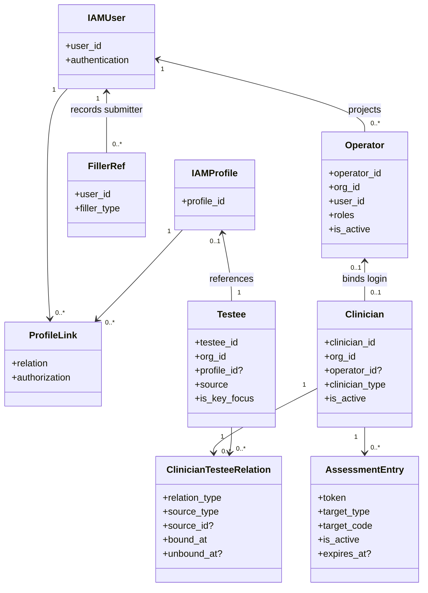

# Actor 领域模型

> 状态：**已按当前源码复核**。本文只负责 Actor 的领域对象、聚合不变量、模块契约与兼容边界；身份授权、关键链路和风险验证分别由同目录的 20、30、90 文档承担。

## 1. 30 秒结论与建模目标

Actor 不是 qs-server 内的第二套用户系统：IAM 拥有数字身份与代表关系，Actor 只拥有这些身份进入测评业务后的 Testee、Operator、Clinician、照护关系和公开入口。跨模块只传播稳定引用，不共享可变聚合。

测评平台中的“人”不是一个 User 表可以表达的：同一个自然人可能既是 IAM User，又代表一个 Profile；在某个机构里是 Testee；登录运营后台时是 Operator；提供诊疗服务时又是 Clinician。一次答卷还必须区分受试者与填写人。

Actor 的建模目标是：

> 使用稳定、最小的业务身份和关系表达“谁接受测评、谁提交答案、谁提供服务、谁能够访问”，同时把认证凭据、问卷、测评结果和报告留在各自边界内。

## 2. 概念关系


```mermaid
classDiagram
    class IAMUser {
      +user_id
      +authentication
    }
    class IAMProfile {
      +profile_id
    }
    class ProfileLink {
      +relation
      +authorization
    }
    class Testee {
      +testee_id
      +org_id
      +profile_id?
      +source
      +is_key_focus
    }
    class FillerRef {
      +user_id
      +filler_type
    }
    class Operator {
      +operator_id
      +org_id
      +user_id
      +roles
      +is_active
    }
    class Clinician {
      +clinician_id
      +org_id
      +operator_id?
      +clinician_type
      +is_active
    }
    class ClinicianTesteeRelation {
      +relation_type
      +source_type
      +source_id?
      +bound_at
      +unbound_at?
    }
    class AssessmentEntry {
      +token
      +target_type
      +target_code
      +is_active
      +expires_at?
    }

    IAMUser "1" --> "0..*" ProfileLink
    IAMProfile "1" --> "0..*" ProfileLink
    IAMProfile "0..1" <-- "1" Testee : references
    IAMUser "1" <-- "0..*" FillerRef : records submitter
    IAMUser "1" <-- "0..*" Operator : projects
    Operator "0..1" <-- "0..1" Clinician : binds login
    Clinician "1" --> "0..*" ClinicianTesteeRelation
    Testee "1" --> "0..*" ClinicianTesteeRelation
    Clinician "1" --> "0..*" AssessmentEntry
```

## 3. Testee：测评结果的主体

Testee 代表“被测评的人”，而不是“当前登录用户”。它是测评、报告、趋势和 Plan 的稳定主体。

### 3.1 核心属性

| 属性 | 语义 |
| --- | --- |
| `id` | qs-server 内受试者标识 |
| `org_id` | 机构隔离边界 |
| `profile_id?` | 对 IAM Profile 的可选引用 |
| name/gender/birthday | 测评需要的基础人口学信息 |
| source | 档案产生来源，例如手工、入口、导入 |
| `is_key_focus` | 机构内重点关注标记 |
| assessment_stats | 历史兼容的统计快照字段，不是测评事实源 |

### 3.2 有 Profile 与临时 Testee

- 有 `profile_id`：可以通过 IAM ProfileLink 判断某个 User 是否能代表该 Testee；
- 无 `profile_id`：仍可作为真实业务主体完成门诊建档和测评，但不能仅凭 IAM 身份推导归属。

同一个 Profile 可以在不同机构形成不同 Testee，因为随访、医生关系和机构数据归属不同；同一机构内则不应重复绑定同一个 Profile。

### 3.3 核心不变量

- `org_id` 必须有效；
- 名称长度、性别枚举、生日不晚于当前时间且年龄不超过约束；
- Profile 绑定是幂等的，同一 Testee 不能从 Profile A 直接改绑为 Profile B；
- 绑定前仓储必须检查该机构内 Profile 未被其他 Testee 使用；
- 聚合不会把 IAM User、医生关系或 AnswerSheet 内容复制进来。

## 4. TesteeRef 与 FillerRef：跨模块的最小身份

Actor 根包提供轻量引用，而不是把 Testee 聚合传入 Survey：

```text
TesteeRef = testee_id + optional profile_id
FillerRef = iam user_id + filler_type
```

AnswerSheet 的 SubmissionContext 同时保存：

- FillerRef：谁实际操作提交；
- TesteeRef：答案属于谁；
- OrgID：属于哪个机构；
- TaskID：若来自 Plan，关联哪个任务。

当前 FillerType 有 `self`、`guardian`、`operator`。它是提交元数据，不是完整监护关系模型，也不能单独证明 User 有权代表 Testee；代表权限仍应由 IAM ProfileLink 或可信业务入口在提交前验证。

## 5. Operator：IAM User 的机构内业务投影

Operator 不是完整用户实体，不保存密码或 Token。它保存：

- qs-server 内部 Operator ID；
- 机构与 IAM User 绑定；
- 直接角色、有效角色与 IAM 策略版本的本地投影；
- 姓名、邮箱、电话等缓存字段；
- 在 qs-server 内是否激活。

权限真值只来自 IAM AuthZ v3；本地 `roles` 固定表示直接角色，`effective_roles` 表示包含继承的有效角色，两者都只是展示和对账投影，不提供 IAM 不可用时的本地授权回退。角色编辑通过 IAM 原子替换直接角色；
已提交但投影尚未追上时保留旧投影并标记 pending。

当前支持的角色包括 `qs:admin`、`qs:content_manager`、`qs:evaluator`、`qs:evaluation_plan_manager` 和 `qs:staff`。

关键不变量：

- 同一机构、同一 User 只有一个有效 Operator；
- 停用 Operator 后不能继续分配角色；
- 停用只改变 qs 业务激活状态，不撤销 IAM Assignment；
- 外部 IAM 同步与本地事务不是同一个数据库事务，需要补偿处理。

## 6. Clinician：提供服务的业务从业者

Clinician 描述医生、咨询师、治疗师等业务身份，包含科室、职称、工号、从业者类型和激活状态。它与 Operator 分离的原因是：

- 业务身份不等于登录账号；
- 运营人员有 Operator，但不是 Clinician；
- 一个医生可以先被业务建档，之后再开通账号；
- 照护关系应关联稳定业务身份，而不是认证账号。

当前 ClinicianType 包括 doctor、counselor、therapist、other。`operator_id` 可为空；绑定后为从业者提供后台登录上下文。数据库约束同一机构内一个 Operator 最多绑定一个 Clinician。

## 7. ClinicianTesteeRelation：来源与授权分离

关系聚合保存医生、受试者、关系类型、来源、绑定和解绑时间。

### 7.1 关系类型

| 类型 | 业务含义 | 是否授权访问 |
| --- | --- | --- |
| creator | 该医生创建或接入了档案 | 否 |
| primary | 主要负责者 | 是 |
| attending | 当前跟进/接诊者 | 是 |
| collaborator | 协作者 | 是 |
| assigned | 历史兼容类型；新写入归一为 attending | 是 |

`creator` 不授权是一个重要边界：创建来源可以永久保留，访问权必须随当前照护关系变化。

### 7.2 来源类型

关系来源包括 assessment_entry、manual、import、transfer，`source_id` 可指向入口等来源对象。来源回答“关系怎样产生”，关系类型回答“当前承担什么职责”，两者不可互换。

### 7.3 AssignmentPolicy

分配策略不是简单插入一行：

- 同类型有效关系重复分配时复用原关系；
- 分配新的 primary 时解绑原有效 primary；
- 同一医生与受试者已有其他访问型关系时，先解绑再建立目标关系；
- transfer 本质上是在事务内建立新的 primary，并保留来源为 transfer。

## 8. AssessmentEntry：可治理的公开业务入口

AssessmentEntry 代表医生创建的门诊二维码入口，保存：

- 所属机构和 Clinician；
- 全局唯一、不透明 token；
- 目标类型和目标编码；
- 激活、过期控制；
- 当前实现仍保留可选目标版本。

只有 `is_active=true` 且未过期的入口可以 Resolve 或 Intake。Intake 并不直接创建 AnswerSheet，而是先形成受控业务上下文：确认/创建 Testee，记录 creator 来源关系，并确保 attending 访问关系。

## 9. 聚合边界与事务边界

Actor 有多个聚合根，不是一个大 Actor 聚合：

| 用例 | 同一 MySQL 事务中的主要写入 |
| --- | --- |
| Testee 注册 | Testee |
| Profile 绑定 | Testee |
| Clinician 分配/转诊 | 一至多条 ClinicianRelation |
| AssessmentEntry 创建 | AssessmentEntry |
| AssessmentEntry Intake | Testee、creator relation、access relation、统计行为日志 |
| 重点关注同步 | Testee |

IAM 调用不受 MySQL 事务保护。Operator 注册会先访问或创建 IAM User，再写本地 Operator，之后同步 IAM 角色，并在部分失败场景执行本地补偿；因此它属于跨系统一致性流程，不能用“包在 WithinTransaction 中”描述为原子事务。

## 10. 与其他模块的契约

| 消费方 | 从 Actor 获得什么 | Actor 不替它做什么 |
| --- | --- | --- |
| Survey | TesteeRef、FillerRef、Org 上下文 | 不校验题目或保存答案 |
| Evaluation | Testee ID、人口学信息引用 | 不计分、不产生 Outcome |
| Interpretation | participant/clinician/admin 授权结果 | 不生成或裁剪报告正文 |
| Plan | Testee ID | 不决定周期和 Task 状态 |
| Statistics | 入口、建档和关系建立的日志事实 | 不拥有统计聚合口径 |
| IAM | User/Profile/ProfileLink、授权快照 | Actor 不复制认证凭据与身份关系真值 |

## 11. 当前模型中的兼容层

- Go 领域层已移除无调用的 StaffRef、FillerTypeStaff 等旧别名；MySQL `staff` 表和 `/staff` 接口名仍是活跃的存储/API 兼容，领域语义已转向 Operator；
- `assigned` 关系仍可读，但新分配会归一为 attending；
- `/clinicians` 是现行契约；`/practitioners` 仅保留为不进入 OpenAPI 的运行时兼容路由，并由 `qs_actor_deprecated_practitioner_route_total` 统计退出窗口内的调用；
- Testee source 保留多组同义值；
- AnswerSheet 允许旧数据通过 Reconstruct 缺少完整 SubmissionContext；
- AssessmentEntry 保留 `scale` target type 和可选 target version。

这些兼容点是迁移事实，不应被继续当作新设计范式。

---

## 12. 事实源与验证

- 领域：`internal/apiserver/domain/actor`；
- 跨模块引用：`internal/apiserver/domain/actor/ref.go`、`internal/apiserver/domain/actor/filler_ref.go`、`internal/apiserver/domain/survey/answersheet`；
- 应用与装配：`internal/apiserver/application/actor`、`internal/apiserver/container/modules/actor`；
- 数据映射：`internal/apiserver/infra/mysql/actor`。

```bash
go test ./internal/apiserver/domain/actor/...
go test ./internal/apiserver/application/actor/...
go test ./internal/apiserver/container/modules/actor/...
```

这些测试证明仓库行为和装配契约，不证明生产 IAM、历史数据唯一性或真实授权流量已经完成复验。
