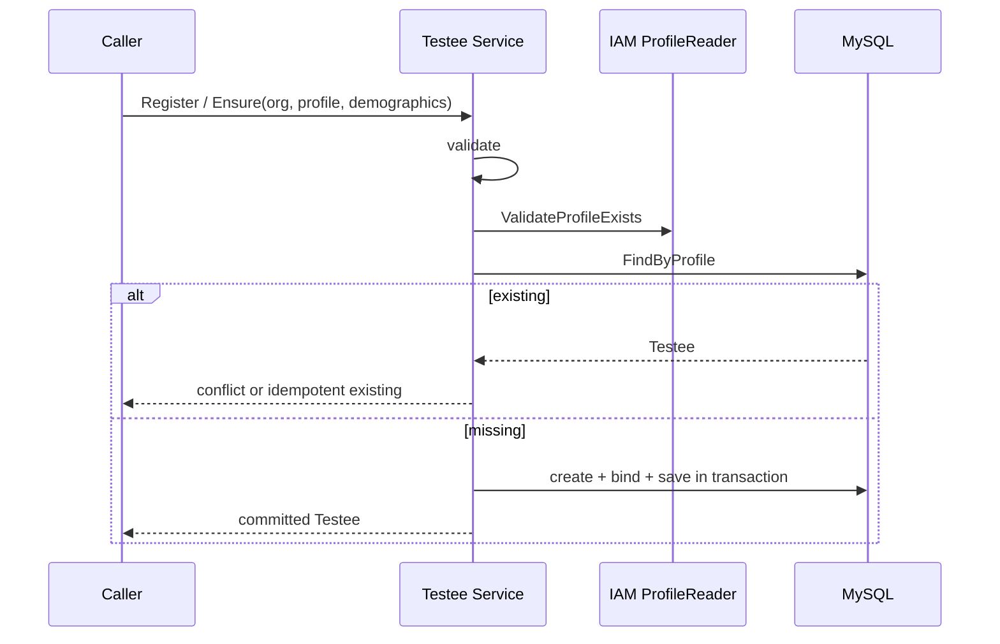
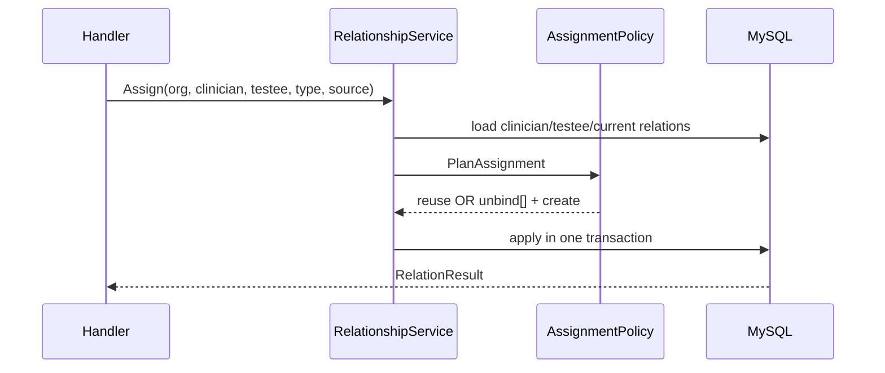
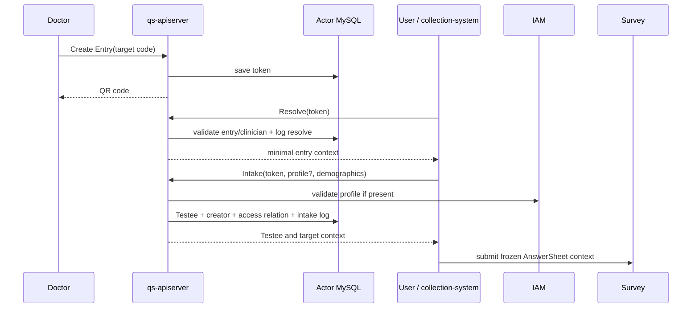

# Actor 关键链路：身份进入测评与报告访问

> 状态：**已按当前源码复核**。本文沿四条责任链描述 Actor 如何参与受试者建档、医生分配、门诊入口和重点关注投影；Survey、Evaluation、Interpretation 的内部状态机仍由各自模块拥有。

## 1. 30 秒结论

Actor 位于业务链两端：入口侧把 IAM/Profile/公开 token 转换成 Testee、Clinician 和访问关系；查询与事件侧提供资源范围并持久化重点关注投影。任何异步推进都必须保留组织、主体、事件和幂等身份。当前 collection-server 的 Testee GET/PUT/care-context 尚未接入用户归属校验，不能把下述目标授权顺序表述为所有入口都已完成。

## 2. 关键链路

### 2.1 受试者注册与 Profile 绑定



后续 BindProfile：同 Profile 幂等，异 Profile 拒绝；若其他 Testee 已占用则进入人工核验，当前不自动合并 AnswerSheet、Assessment、Plan、Relation 或 Statistics。

主要失败语义：IAM Profile 不存在不建档；MySQL 失败回滚；并发首次建档当前缺数据库唯一兜底；临时 Testee 不做自然字段去重。

### 2.2 医生分配、转诊与授权



转诊不修改旧 relation 的 clinician_id，而是解绑旧 primary、建立新 primary(source=transfer)。解绑后，医生下一次授权应立即失去范围；如未来缓存关系，必须有强制失效。

Actor 关系只授权到 Testee。Evaluation/Interpretation 仍需继续验证具体 Assessment/Report 归属。反过来，Testee 资源本身也必须先验证当前 User -> ProfileLink/关系 -> Testee；当前 `/api/v1/testees/:id` GET/PUT/care-context 绕过已有 `testeeaccess.Authorizer`，属于 [AR-R002](./90-设计问题与验证清单.md#ar-r002资源-ownership-必须继续验证) 的 P0 阻断。

### 2.3 从门诊二维码到测评上下文



Intake 每次重新解析 token，不信前端缓存。所有本地写在事务中；IAM Profile 是外部读取。Profile 路径可以幂等复用 Testee，临时路径在响应丢失后可能重复创建，需业务幂等键。

### 2.4 从高风险报告到重点关注

```text
interpretation.report.generated
  -> Worker handler
  -> durable Attention projection ledger
  -> TesteeAssessmentAttentionService
  -> if mark enabled AND risk high/severe
  -> idempotently set Testee.is_key_focus = true
```

这是报告成功后的后置投影：先按 event_id 幂等落 MySQL `interpretation_attention_projection`，再调用 Actor；失败进入 `failed`，由常规 reconciler 重试，超过预算进入 `manual_required`，但不回滚 Report。Artifact fact reconciler 还会从显式切点扫描 MongoDB high/severe 报告成品，发现从未建立 MySQL ledger 的缺口；生产默认 dry-run，apply 需显式批准。low/moderate 不会自动取消重点关注，防止覆盖人工判断。

Outcome risk 是某次测评不可变事实，is_key_focus 是当前机构工作台状态。若未来自动解除，需要包含来源、原因、触发报告、打开/关闭时间与操作者的 AttentionCase，而不是继续扩展一个 bool。

当前可靠链路是：durable `interpretation.report.generated` -> 幂等 projector -> retry/manual_required -> Artifact fact reconcile -> 可对账工作台状态。2026-08-06 生产已将事前分类的 33 个历史 ledger 缺口精确收敛；对账时 184 条 projection 全为 `succeeded`，42 份 high/severe artifact 缺口为 0、重复为 0，随后已停用生产临时 fact reconcile 任务。

### 2.5 关键链路验证矩阵

| 链路 | 必测场景 |
| --- | --- |
| Profile 建档 | 同 org 并发、跨 org、IAM disabled/unavailable/not found、绑定冲突 |
| 临时建档 | 重试、响应丢失、不可按姓名生日误合并 |
| 关系分配 | 重复幂等、类型切换、并发 primary、跨 org、事务回滚 |
| 授权 | admin、doctor、creator-only、inactive operator/clinician、nil/empty scope、Testee GET/PUT/care-context 跨用户/跨机构 IDOR、IAM/link 不可用时 fail closed |
| Entry | inactive、expired、clinician inactive、公开滥用、日志失败、最新版本解析 |
| Attention | 重复事件、DB 暂时失败、high/severe、low 不取消、人工标记保护、漏建 ledger 的 dry-run/apply、retry/manual_required |

---
