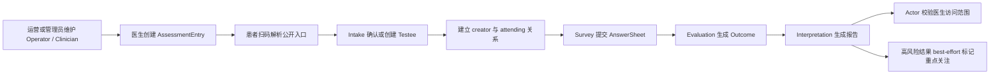

# Actor 模块

> 状态：**已重写**。本文以当前源码为事实基础，说明 Actor 在 qs-server 中承担的业务边界、核心对象和阅读路线。Actor 的角色不是“再实现一套用户系统”，而是把 IAM 身份转换为 qs-server 可使用的业务参与者、照护关系和访问范围。

## 1. 30 秒结论

Actor 回答四组问题：

1. **谁是受试者，谁实际提交了答卷？** Testee 表示被测评的人，Filler 表示这一次操作答卷的 IAM User；两者可以是同一人，也可以是患者与家长。
2. **谁在机构内工作，谁承担医疗服务？** Operator 是 IAM User 在 qs-server 某个机构内的操作与授权投影；Clinician 是医生、咨询师、治疗师等业务从业者。一个人可以同时拥有二者，但两个概念不能合并。
3. **医生为什么能查看某位受试者？** ClinicianTesteeRelation 记录照护关系；Actor access service 把 IAM 授权快照与有效照护关系组合成受试者访问范围。
4. **门诊二维码怎样变成可执行测评上下文？** AssessmentEntry 把公开 token 解析为机构、医生和测评编码，再完成受试者建档和照护关系建立。

```text
IAM User / Profile / ProfileLink
            │
            ▼
  Operator       Testee ◄──── Filler metadata
      │             ▲
      ▼             │
  Clinician ── ClinicianTesteeRelation
      │
      ▼
AssessmentEntry ── public token / target code
```

Actor 不拥有问卷、答卷、测评执行、报告和治疗周期：

- Survey 保存 AnswerSheet，并只引用 TesteeRef、FillerRef；
- Evaluation 以 Testee 作为测评主体，但不修改 Actor 聚合；
- Interpretation 在授权后向不同 Audience 提供报告；
- Plan 决定何时为 Testee 生成 Task；
- Statistics 消费入口、建档、作答和报告等事实构建读侧统计。

## 2. 为什么 Actor 不能等同于 IAM

IAM 和 Actor 解决的是不同问题：

| 问题 | IAM | Actor |
| --- | --- | --- |
| 调用者是谁 | User、认证凭据、Token | 不负责认证 |
| 一个 User 可代表哪些档案 | Profile、ProfileLink | 引用 ProfileID，不复制关系真值 |
| 在机构内具有什么平台能力 | 授权快照、角色与权限 | Operator 保存本地业务投影并消费授权结果 |
| 谁是测评主体 | 不负责 | Testee |
| 谁是医生、咨询师或治疗师 | 不负责 | Clinician |
| 医生可访问哪些患者 | 不负责业务关系 | ClinicianTesteeRelation 与 TesteeAccessService |
| 门诊二维码属于谁、指向什么 | 不负责 | AssessmentEntry |

项目早期曾在 qs-server 内解析微信身份并组织 User，后来升级为 IAM 统一身份系统。现在正确的边界是：

> IAM 管理数字身份及代表关系；Actor 管理这些身份进入测评业务后扮演的机构内角色和业务关系。

## 3. 领域对象总览

| 对象 | 类型 | 核心身份 | 主要不变量 |
| --- | --- | --- | --- |
| Testee | 聚合根 | `org_id + testee_id`，可选 `profile_id` | 受试者属于单一机构；同一机构内 Profile 不应绑定多个 Testee |
| FillerRef | 跨模块值对象 | IAM `user_id + filler_type` | 记录实际提交者，不替代 Testee |
| TesteeRef | 跨模块值对象 | `testee_id`，可带 `profile_id` | 只携带稳定引用，不共享可变聚合 |
| Operator | 聚合根 | `org_id + user_id` | 同一 User 在同一机构只有一个 Operator；停用后不得分配角色 |
| Clinician | 聚合根 | `org_id + clinician_id`，可选 `operator_id` | 业务从业者身份与后台账号解耦 |
| ClinicianTesteeRelation | 聚合根 | 医生、受试者、关系类型、有效期 | 只有访问型关系授权；creator 只追踪来源 |
| AssessmentEntry | 聚合根 | 全局唯一 token | 仅激活且未过期的入口可解析 |

## 4. 三组必须分开的概念

### 4.1 Testee 与 Filler

Testee 是结果、趋势和随访归属的受试者；Filler 是一次 AnswerSheet 的实际操作人。家长替儿童填写时：

```text
Testee = 儿童
Filler = 家长对应的 IAM User
FillerType = guardian
```

当前业务只要求明确“谁提交、受试者是谁”，没有进一步区分“家长代填”与“家长作为观察者填写家长版量表”。如果以后这两种身份会影响计分、报告文案或合规授权，必须新增显式的作答视角，而不能从 `guardian` 猜测。

### 4.2 Operator 与 Clinician

Operator 是后台登录与平台操作身份；Clinician 是提供医疗或干预服务的业务身份。运营人员可以只有 Operator；暂时不登录 qs-server 的医生可以先有 Clinician；医生要使用后台能力时，再把 Clinician 绑定到 Operator。

### 4.3 creator 与访问关系

门诊扫码会建立两类关系：

- `creator`：记录该医生通过入口创建/接入了受试者，不授予访问权；
- `attending`：建立有效照护和访问范围。

不能把“最初创建档案的人”永久等同于“当前有权查看的人”。

## 5. 核心业务链路



Actor 参与首尾两段：前段把公开入口变成确定的业务参与者上下文，后段为报告和测评查询提供访问范围；中间的问卷、执行和报告状态机仍由相应模块拥有。

## 6. 当前实现状态

| 能力 | 状态 | 说明 |
| --- | --- | --- |
| Testee 建档与 IAM Profile 绑定 | 已实现 | 支持按 Profile 幂等确认，也支持无 Profile 的临时受试者 |
| AnswerSheet 保存 Testee 与 Filler | 已实现 | SubmissionContext 同时要求 Testee、Filler、Org；历史数据允许缺字段重建 |
| Operator 与 IAM User 对接 | 已实现 | 支持账号创建、机构内投影和 IAM 授权同步 |
| Clinician 独立业务身份 | 已实现 | 支持类型、科室、职称、工号、激活状态及 Operator 绑定 |
| 照护关系与访问范围 | 已实现 | admin 机构范围；非 admin 必须绑定 Clinician 并具有有效访问型关系 |
| AssessmentEntry 解析与 Intake | 已实现 | token 解析、建档、creator/attending 关系和统计日志在事务内编排 |
| 入口始终使用最新发布版本 | 设计已确认、实现未完全收敛 | 当前仍存在可选 `target_version`，记录在重构清单 |
| 高风险重点关注投影 | 部分实现 | Worker 在报告生成后 best-effort 调用；失败无持久补偿，且只自动标记不自动取消 |

## 7. 文档地图

Actor 是重要的业务边界模块，但当前体量不需要复制四个核心模块的多文件结构。为遵守 active 文档树规模门槛，详细内容收敛为一篇可按标题定位的长文，信息不删减为表级摘要：

- [领域模型与设计详解](./10-领域模型.md#actor-领域模型与设计详解)
  - [业务参与者与 IAM 身份边界](./10-领域模型.md#12-业务参与者与-iam-身份边界)
  - [受试者、Profile 与填写人](./10-领域模型.md#13-受试者profile-与填写人语义)
  - [Operator、Clinician 与照护关系](./10-领域模型.md#14-operatorclinician-与照护关系)
  - [AssessmentEntry 与门诊入口](./10-领域模型.md#15-assessmententry-与门诊测评入口)
  - [访问范围与授权](./10-领域模型.md#16-访问范围授权与数据归属)
  - [数据存储与一致性](./10-领域模型.md#17-数据存储与一致性)
  - [关键链路](./10-领域模型.md#18-关键链路)
  - [设计问题与重构清单](./10-领域模型.md#19-设计问题与重构清单)

## 8. 事实源与验证

- 领域：`internal/apiserver/domain/actor`；
- 应用：`internal/apiserver/application/actor`；
- MySQL：`internal/apiserver/infra/mysql/actor`；
- IAM 适配：`internal/apiserver/infra/iam`、`internal/apiserver/port/iambridge`；
- 装配：`internal/apiserver/container/modules/actor`；
- Survey 引用：`internal/apiserver/domain/survey/answersheet`；
- 接口：`internal/apiserver/transport/rest`、`internal/apiserver/transport/grpc/service/actor_service.go`；
- Migration：`internal/pkg/migration/migrations/mysql/000001_*`、`000008_*` 及后续索引迁移。

文档检查只能验证链接和事实路径存在；有关授权、事务和跨系统失败的结论仍需以定向测试和真实部署配置为准。
