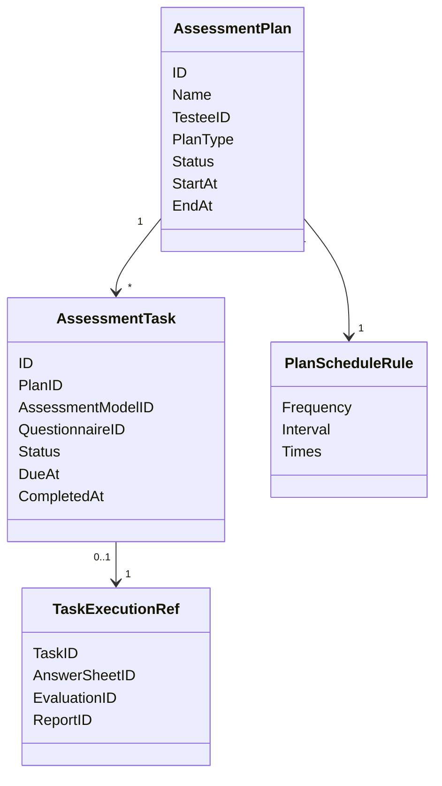

# Plan 领域模型

## 1. 模块核心概念

Plan 区分计划和任务：

- `AssessmentPlan`：一组测评安排。
- `AssessmentTask`：某次应测实例。

---

## 2. 领域模型图

---

## 3. 聚合根与实体

| 类型 | 对象 | 说明 |
| ---- | ---- | ---- |
| 聚合根 | `AssessmentPlan` | 测评计划 |
| 实体 | `AssessmentTask` | 应测任务 |
| 值对象 | `PlanScheduleRule` | 周期规则 |
| 值对象 | `TaskExecutionRef` | 跨模块执行引用 |

---

## 4. 值对象

| 值对象 | 说明 |
| ------ | ---- |
| `PlanStatus` | 计划状态 |
| `TaskStatus` | 任务状态 |
| `TriggerTime` | 触发时间 |
| `EntryToken` | 任务入口标识 |

---

## 5. 领域服务

| 服务 | 职责 |
| ---- | ---- |
| 任务生成 | 根据计划和周期生成任务 |
| 任务生命周期 | 开放、完成、过期、取消 |
| 调度协调 | 根据时间和状态推进任务 |
| 协作引用 | 关联答卷、测评和报告 |

---

## 6. 领域事件

| 事件 | 语义 |
| ---- | ---- |
| `task.opened` | 任务已开放 |
| `task.completed` | 任务已完成 |
| `task.expired` | 任务已过期 |
| `task.canceled` | 任务已取消 |

---

## 7. 模型边界与反例

| 反例 | 说明 |
| ---- | ---- |
| `AssessmentTask` 不是 `AnswerSheet` | 任务是安排，答卷是提交事实 |
| `AssessmentPlan` 不是执行器 | Plan 不计分 |
| `TaskExecutionRef` 不是主事实复制 | 它只保存跨模块引用 |
| `PlanMetric` 不是 Plan 主状态 | 统计指标属于读侧 |
