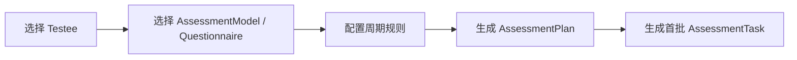

# 测评计划创建链路

## 1. 业务目标

为受试者创建一次性或周期性测评计划，明确测什么、什么时候测、由谁参与。

---

## 2. 流程图

---

## 3. 关键规则

- 计划必须绑定明确受试者。
- 计划可引用测评模型和问卷，但不复制模型规则。
- 周期规则决定任务生成，不代表任务已经开放。

---

## 4. 产出结果

- `AssessmentPlan`。
- 初始 `AssessmentTask`。
- 后续调度的输入。
