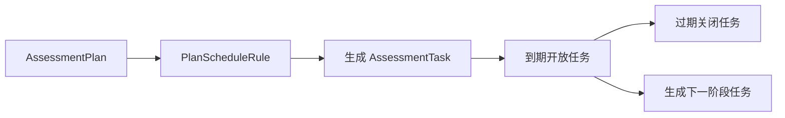

# 任务生成与周期调度链路

## 1. 业务目标

根据计划和周期规则生成任务，并在正确时间开放、过期或生成下一阶段任务。

---

## 2. 流程图

---

## 3. 关键规则

- 任务生成必须可重复运行且不重复创建。
- 任务开放生成入口信息。
- 任务过期不删除历史任务。
- 下一阶段任务生成不代表上一阶段完成。

---

## 4. 异常处理

| 场景 | 处理 |
| ---- | ---- |
| 调度重复触发 | 幂等生成 |
| 入口生成失败 | 任务保持未开放或进入可补偿状态 |
| 到期未完成 | 转为 expired |
