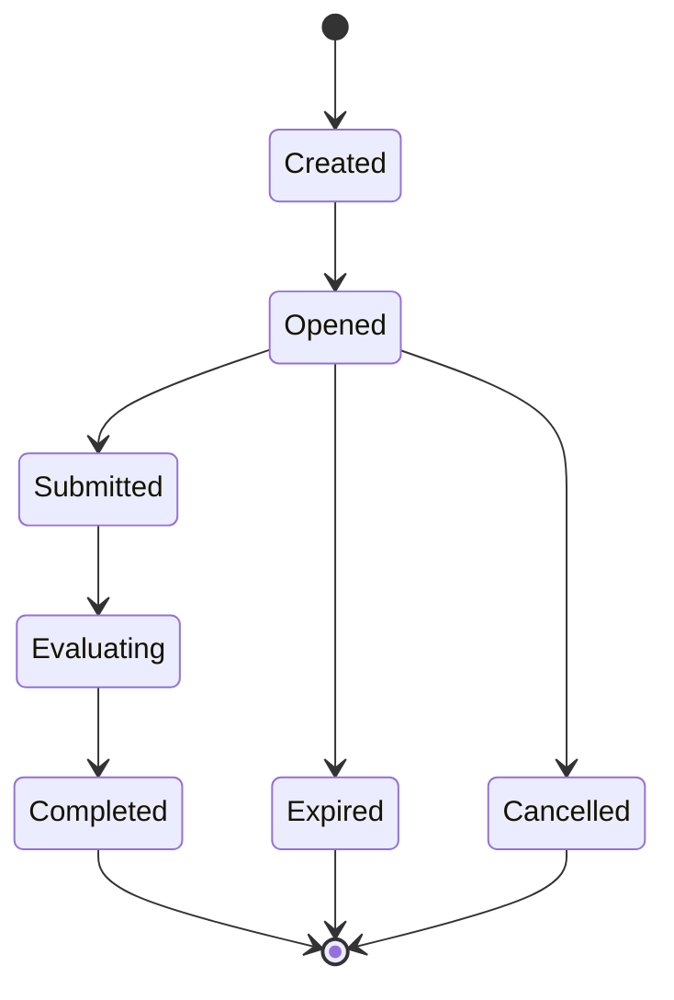

# 任务状态机

## 1. 业务目标

明确任务从创建、开放、提交、执行到完成或关闭的生命周期。

---

## 2. 状态机

---

## 3. 状态含义

| 状态 | 含义 |
| ---- | ---- |
| `Created` | 任务已生成，未开放 |
| `Opened` | 任务入口已开放 |
| `Submitted` | 已提交答卷 |
| `Evaluating` | 下游测评执行中 |
| `Completed` | 任务完成 |
| `Expired` | 任务过期 |
| `Cancelled` | 任务取消 |

---

## 4. 边界

任务状态可以引用答卷、测评和报告结果，但不替代这些模块的主状态。
