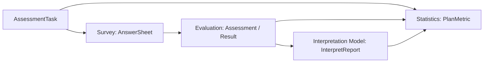

# 计划与测评执行协作

## 1. 协作目标

Plan 负责任务生命周期，Survey 负责答卷事实，Evaluation 负责执行，Interpretation Model 负责报告。

---

## 2. 协作图

---

## 3. 关键规则

- Plan 只保存跨模块引用，不复制答卷、执行结果或报告内容。
- Survey 提交失败时，任务不能视为完成。
- Evaluation 失败时，任务可以保持待补偿状态。
- Report 生成后，任务和统计可以进入完成投影。

---

## 4. 反例

- 不要在 Plan 中计分。
- 不要在 Plan 中渲染报告。
- 不要让 Statistics 反推任务完成状态。
