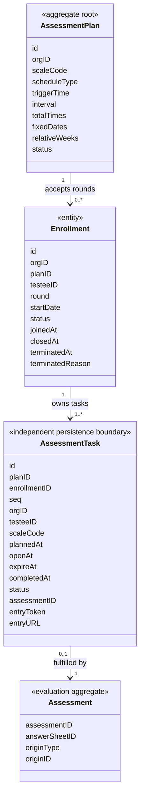
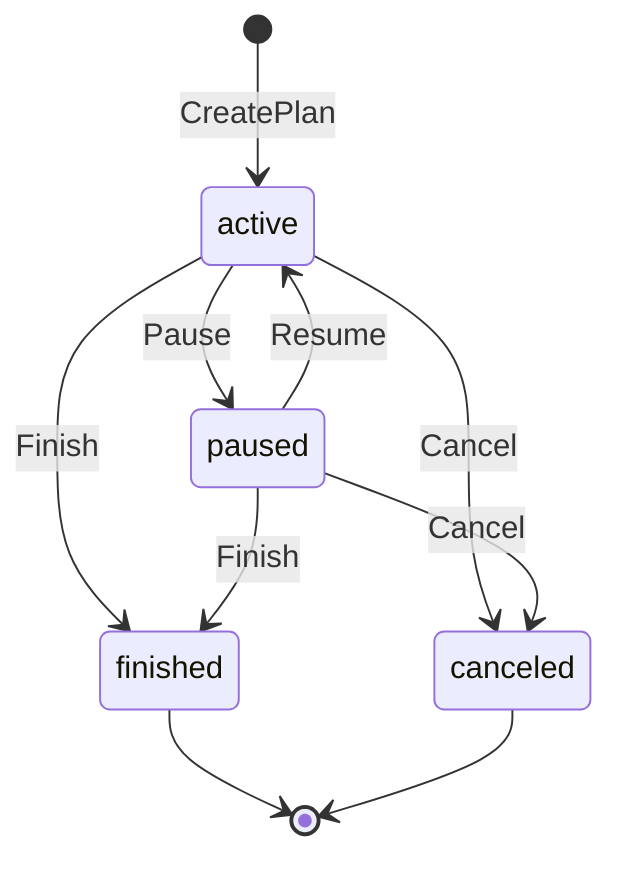
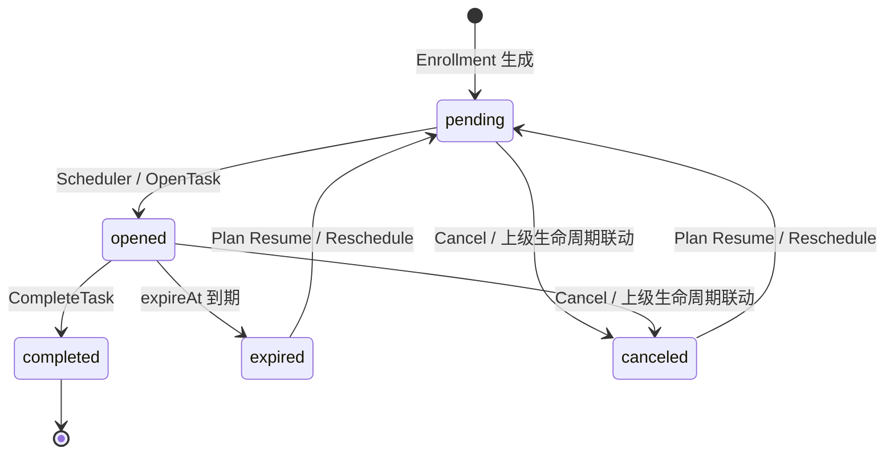

# Plan 领域模型

> 状态：**已重写**。本文以 `internal/apiserver/domain/plan`、应用服务、MySQL 映射和迁移为事实基础，说明 Plan、Enrollment 与 Task 当前真实的领域边界。目标模型和重构方向会明确标为规划，不会写成现状。

## 1. 本文回答

本文重点回答：

- 业务上说“一个患者加入 Plan”，为什么代码中的 AssessmentPlan 却不保存患者；
- AssessmentPlan 究竟是治疗方案、计划实例，还是周期策略模板；
- Enrollment 怎样表达患者的一次参与轮次；
- AssessmentTask 是普通子实体，还是独立的一致性边界；
- Plan 与 Task 为什么需要两套状态机；
- 暂停、恢复、终止和完成分别改变哪些事实；
- Plan 为什么只保存测评 code，不保存未来模型版本；
- Enrollment 与 Task 的状态、身份和一致性怎样配合。

周期计算、调度器、入口提醒和 AnswerSheet 履约链路将在后续专题文档展开。本文只在解释领域对象时说明必要的协作关系。

## 2. 30 秒结论

Plan 领域当前由三个持久化业务对象和主要领域服务组成：

| 对象 | 当前代码角色 | 回答的问题 |
| --- | --- | --- |
| `AssessmentPlan` | 聚合根 | 一种测评应该按照什么周期持续发生 |
| `Enrollment` | 业务实体、独立持久化与生命周期边界 | 某患者第几轮加入 Plan、何时开始、关闭或终止 |
| `AssessmentTask` | 业务实体、独立持久化与状态边界 | 某患者的第 N 次测评应该何时发生、是否已经履约 |
| Enrollment Service | 应用/领域协作服务 | 事务化创建或终止 Enrollment 与 Task |
| `PlanLifecycle` | 领域服务 | Plan 暂停、恢复、结束、取消时怎样联动 Task |
| `TaskLifecycle` | 领域服务 | Task 怎样开放、完成、过期、取消和重新调度 |



最重要的建模事实是：

> `AssessmentPlan` 是可复用的周期策略模板；`Enrollment` 是患者的一次参与轮次；`AssessmentTask` 是该轮次内的一次应测和履约事实。

## 3. 业务问题如何映射为领域对象

### 3.1 业务语言中的 Plan

业务口径是：

> 一个患者在一个时间段内，持续填写一种测评；治疗方案预先配置周期，患者加入相应 Plan。

这句话其实包含三种不同信息：

1. **可复用规则**：测什么、按什么周期、共测几次；
2. **患者参与**：哪个患者、从哪一天开始、当前是否仍参与；
3. **单次履约**：第 N 次任务何时开放、是否填写、由哪个 Assessment 完成。

当前模型对三项都做了显式持久化：

```text
可复用规则 -> assessment_plan
患者参与   -> plan_enrollment
单次履约   -> assessment_task
```

### 3.2 为什么 Plan 不直接包含患者和所有 Task

如果把某患者、所有任务和所有完成结果都放进一个大 Plan 聚合，会产生：

- 同一周期规则无法被多个患者复用；
- Plan 随患者数量和随访次数持续膨胀；
- 开放一个 Task 也必须加载和保存整个 Plan；
- 多个患者同时完成任务会竞争同一个聚合版本；
- 机构级周期策略与患者级隐私边界混在一起。

当前设计把规则与履约分开，使 Plan 保持小而稳定，使 Task 可以按患者、状态和时间窗口独立查询与更新。

## 4. AssessmentPlan：周期策略聚合根

### 4.1 领域定义

`AssessmentPlan` 表达：

> 在某个机构内，针对一种已发布测评，按照特定周期规则生成持续测评任务的模板。

它不是完整治疗方案，也不是患者治疗周期实例。当前聚合不保存：

- testeeID；
- 患者开始日期；
- 医生或治疗师；
- 治疗阶段和治疗目标；
- Questionnaire 或 AssessmentModel 发布版本；
- AnswerSheet、Outcome 或 Report；
- 通知送达状态。

### 4.2 属性语义

| 属性 | 语义 | 边界说明 |
| --- | --- | --- |
| `id` | Plan 技术标识 | 当前没有独立业务 code |
| `org_id` | 机构隔离边界 | 同一 Plan 只属于一个机构 |
| `scale_code` | 持续执行的测评模型族编码 | 当前只支持 scale kind，不冻结发布版本 |
| `schedule_type` | 周期规则类型 | by_week、by_day、fixed_date、custom |
| `trigger_time` | 每个计划日期的开放钟点 | 规范化为 `HH:MM:SS`，当前无显式 timezone |
| `interval` | 按周或按天策略的间隔 | 其他策略不依赖它 |
| `total_times` | 整个周期的任务次数 | fixed/custom 由列表长度推导 |
| `fixed_dates` | 固定的绝对日期列表 | 用于特殊日程，不依赖患者 startDate |
| `relative_weeks` | 相对患者 startDate 的周次 | 例如 2、4、8、12、18 周 |
| `status` | Plan 生命周期状态 | active、paused、finished、canceled |

### 4.3 创建不变式

Plan 创建同时受到应用准入和领域校验保护。

应用层准入：

- `scale_code` 必须能在 ModelCatalog 中解析为已发布的 `KindScale` 模型；
- 发布模型必须包含 DefinitionV2；
- 当前没有通用 ModelRef，所以其他模型 kind 不能直接创建 Plan。

领域层校验：

- orgID 必须大于 0；
- scaleCode 不能为空；
- scheduleType 必须是合法枚举；
- triggerTime 必须能规范化为 `HH:MM:SS`；
- by_week/by_day 的 interval、totalTimes 必须大于 0；
- by_week/by_day 的 totalTimes 不超过 100；
- custom 的 relativeWeeks 不能为空、必须大于 0 且严格递增；
- fixed_date 的 fixedDates 不能为空，并按时间递增。

新建 Plan 直接进入 active，没有 draft/published 两阶段。Plan 当前也没有修改周期定义的应用命令，所以创建后的规则实际上不可原地编辑。

### 4.4 Plan 状态机



| 当前状态 | 操作 | 结果 | 是否允许 |
| --- | --- | --- | --- |
| active | pause | paused | 是 |
| paused | resume | active | 是 |
| active/paused | finish | finished | 是 |
| active/paused | cancel | canceled | 是 |
| finished | finish | finished | 幂等成功 |
| canceled | cancel | canceled | 幂等成功 |
| finished | resume/cancel | 无变化 | 拒绝 |
| canceled | resume/finish | 无变化 | 拒绝 |

Plan 状态不是 Task 状态的统计结果。即使所有 Task 都完成，当前代码也不会自动把 Plan 置为 finished；finished 是管理员手动结束模板的业务决定。

### 4.5 Plan 聚合内部没有 Task 集合

`AssessmentPlan` 只保存自身状态和周期规则。Task 通过 repository 按 PlanID 查询，暂停、恢复、结束和取消由 `PlanLifecycle` 领域服务编排。

这意味着：

- Plan 聚合本身可以独立加载；
- Task 数量不会扩大 Plan 聚合；
- 跨 Plan/Task 的生命周期操作不是单聚合原子操作；
- application/infra 必须提供事务边界，当前实现对此仍不完整。

## 5. Enrollment：患者参与轮次

### 5.1 身份与字段

`Enrollment` 持久化保存：

```text
id, org_id, plan_id, testee_id, round
start_date
status: active | closed | terminated
joined_at, closed_at, terminated_at
terminated_reason
record_origin: native | derived_legacy
```

数据库以 `UNIQUE(org_id, plan_id, testee_id, round)` 保护轮次身份，并通过生成列 `active_slot` 的唯一约束保证同一机构、Plan、患者最多只有一个 active Enrollment。

### 5.2 加入与幂等

加入请求先查找 active Enrollment：

- 请求 startDate 与 active Enrollment 一致：返回同一 Enrollment 和其 Task，作为幂等成功；
- startDate 不一致：拒绝，不能静默改写已经建立的随访时间轴；
- 不存在 active Enrollment：以 latest round + 1 创建新 Enrollment，并生成本轮 Task。

Enrollment 与初始 Task 在同一 MySQL 事务中提交。每个 Task 都保存 `enrollment_id`，数据库使用 `UNIQUE(enrollment_id, seq)` 保护轮内序号。

### 5.3 关闭与终止

Enrollment 有两种不同终态：

| 终态 | 语义 | 触发 |
| --- | --- | --- |
| `closed` | 本轮任务自然履约或结束 | Task 进入终态后，同事务检查本轮是否全部终态 |
| `terminated` | 业务明确提前终止参与 | 记录原因，并在同一事务取消未完成 Task |

终态 Enrollment 不会重新激活。患者再次加入同一 Plan 时创建下一 round。

### 5.4 不变量

- Task 必须属于明确 Enrollment；
- Task 的 plan、testee、org 必须与 Enrollment 一致；
- 同一患者同一 Plan 最多一个 active Enrollment；
- Task 终态迁移与 Enrollment 自然关闭检查位于同一事务；
- 显式终止与未完成 Task 取消位于同一事务；
- round 是患者参与轮次，不是 Task 次数。

Enrollment 当前不保存完整治疗方案内容，也没有患者级 paused 状态。若未来确需患者级暂停或滚动生成，再通过明确状态和 Schedule Revision 扩展，不能使用 `updated_at` 猜测。

## 6. AssessmentTask：一次应测与履约事实

### 6.1 领域定义

`AssessmentTask` 表达：

> 某个受试者在某个 Plan 下的第 N 次测评，应在什么时间开放，当前是否已经履约。

它是患者级持续测评最小事实。Plan 描述规则，Task 描述规则在某个患者身上的具体实例。

### 6.2 Task 身份

Task 有技术 ID，但业务唯一性由以下组合表达：

```text
plan_id + testee_id + seq
```

其中：

- planID 确定周期模板；
- testeeID 确定受试者；
- seq 确定该周期中的第几次测评。

Task 冗余保存 orgID 和 scaleCode，用于机构隔离、调度和高频查询，避免每次查询都 JOIN Plan。因为当前 Plan 不支持修改 org/code，所以这些冗余字段没有正常的同步更新路径。

### 6.3 属性语义

| 属性 | 业务语义 |
| --- | --- |
| `id` | Task 技术标识，也是入口传递的 task_id |
| `plan_id` | 来源 Plan |
| `seq` | 该患者在该 Plan 下第几次测评 |
| `org_id` | 机构隔离和查询冗余 |
| `testee_id` | 真正接受测评的人 |
| `scale_code` | 本任务持续测评的模型族编码 |
| `planned_at` | 依据周期和 startDate 计算的计划开放时间 |
| `open_at` | 调度器实际开放时间 |
| `expire_at` | 填写截止时间 |
| `completed_at` | Task 被 Assessment 履约的时间 |
| `status` | pending/opened/completed/expired/canceled |
| `assessment_id` | 完成该 Task 的 Assessment |
| `entry_token` | 当前生成并下发的随机入口字段 |
| `entry_url` | 小程序填写入口 |

Task 不保存：

- Questionnaire code/version；
- AssessmentModel release version；
- AnswerSheet 内容；
- Outcome 和 Report；
- 通知送达结果。

这些事实由 Survey、Evaluation、Interpretation 和通知链路分别拥有。

### 6.4 Task 状态机



| 状态 | 语义 | 普通操作下是否终态 |
| --- | --- | --- |
| pending | 已生成，尚未开放 | 否 |
| opened | 已生成入口，可填写 | 否 |
| completed | 已关联 Assessment 并履约 | 是 |
| expired | 超过窗口仍未履约 | 是 |
| canceled | 因 Plan/Enrollment/人工操作取消 | 是 |

有一个需要特别说明的例外：`TaskStatus.IsTerminal()` 把 completed、expired、canceled 都视为终态；但 Plan Resume 可以通过 `Reschedule` 复用 expired/canceled Task，把它重置为 pending。completed 永远不会被重新调度。

### 6.5 Task 状态迁移不变式

- 只有 pending Task 可以 Open；
- Open 必须提供非空 token、URL 和晚于开放时间的 expireAt；
- 只有 opened Task 可以 Complete；
- Complete 必须提供非零 AssessmentID；
- 只有 opened Task 可以 Expire；
- Cancel 对任意非终态 Task 有效，对终态 Task 幂等；
- Reschedule 不允许操作 completed Task；
- Reschedule 会清空旧 openAt、expireAt、completedAt、assessmentID、token 和 URL；
- 数据库 `UNIQUE(assessment_id)` 保证一个 Assessment 最多完成一个 Task。

当前 Complete 对已经由同一 Assessment 完成的 Task不会返回幂等成功，因为领域服务首先要求状态为 opened。这会影响 AnswerSheet Worker 重放后的最终收敛，属于后续一致性设计问题。

### 6.6 Task 是实体还是聚合根

源码注释把 `AssessmentTask` 称为“实体”，但当前实现同时具备：

- 独立 `AssessmentTaskRepository`；
- 按 TaskID 独立加载和保存；
- 独立生命周期服务；
- 独立 `task.*` 领域事件；
- 独立 REST/gRPC 命令；
- 不通过 AssessmentPlan 聚合内部集合修改。

因此更准确的文档表述是：

> AssessmentTask 是 Plan 领域中的业务实体，同时也是独立持久化和状态一致性边界；在实现层面，它承担了 Task 聚合根的职责。

这种表述既尊重当前代码命名，也能解释为什么 Plan 与 Task 的联动需要 application transaction，而不能假设由一个大聚合自动保证原子性。

## 7. 三个领域服务怎样分工

### 7.1 PlanValidator

`PlanValidator` 负责跨字段规则：

- 创建 Plan 时校验周期参数组合；
- 患者加入时校验 Plan active、TesteeID 和 startDate；
- 将多个 ValidationError 组合成领域错误。

它不查询 ModelCatalog。已发布模型准入由应用层的 ScaleCatalog 防腐接口完成。

### 7.2 PlanEnrollment

`PlanEnrollment` 负责患者级任务集合：

- 根据 Plan 和 startDate 调用 TaskGenerator；
- 查询已有 Task 并执行幂等对账；
- 返回 `Tasks`、`TasksToSave` 和 `Idempotent`；
- 终止参与时取消目标患者所有非终态 Task。

它依赖 Plan/Task repository 查询事实，但不执行持久化提交。应用服务负责 SaveBatch 或逐项保存。

### 7.3 PlanLifecycle

`PlanLifecycle` 负责 Plan 状态和 Task 集合联动：

- Pause：取消所有 pending/opened Task，再将 Plan 置为 paused；
- Resume：保留 completed Task，重新生成后续任务并复用可重排 Task；
- Finish：取消未完成 Task，将 Plan 置为 finished；
- Cancel：取消未完成 Task，将 Plan 置为 canceled。

它在内存中同时改变 Plan 和多条 Task，但不提交数据库事务。

### 7.4 TaskLifecycle

`TaskLifecycle` 控制单个 Task 的合法迁移，并让实体产生 `task.opened`、`task.completed`、`task.expired`、`task.canceled` 事件。

事件在 Task 保存后 best-effort 发布。它们表达生命周期通知，不是 Task 状态真值；即使事件丢失，MySQL 中的 Task 状态仍然成立。

## 8. 聚合边界与事务边界

### 8.1 当前一致性边界

| 用例 | 内存中改变 | 当前持久化方式 |
| --- | --- | --- |
| CreatePlan | 一个 Plan | 单仓储保存 |
| EnrollTestee | 多个新 Task | SaveBatch |
| Open/Complete/Expire/CancelTask | 一个 Task | 单仓储保存 |
| Pause/Finish/CancelPlan | 一个 Plan + 多个 Task | 先 Plan，后逐个 Task |
| ResumePlan | 一个 Plan + 多个新建/重排 Task | 先 Plan，后逐个 Task |
| TerminateEnrollment | 某患者多个 Task | 逐个保存，失败继续 |

CreatePlan 和单 Task 命令的边界清晰。真正的问题集中在 Plan/Enrollment 与多 Task 联动：领域层完成了规则计算，但 application/infra 没有统一 Unit of Work，所以可能发生部分成功。

### 8.2 领域原子性不等于数据库原子性

领域服务在返回前可以保证“内存里的 Plan 和 Task 符合规则”，但只要随后分多次 Save，就可能出现：

```text
Plan 已 paused
Task A 已 canceled
Task B 保存失败，仍 opened
接口仍可能返回成功
```

Scheduler 读取到非 active parent Plan 时会取消扫描到的 Task，具有一定自然收敛能力，但这不是完整事务或调和机制。

后续“状态、幂等与数据一致性”文档将进一步分析 Unit of Work、幂等完成和调和方案。本文只确认当前边界。

### 8.3 Plan 领域事件现状

AssessmentPlan 结构保留 events 字段和 Events/ClearEvents 方法，但当前 pause、resume、finish、cancel 没有添加 Plan lifecycle event。实际事件目录只注册 `task.*`。

所以当前不能把 `plan.paused`、`plan.resumed` 等写成已经存在的事件契约。跨模块消费者应读取 Plan/Task 事实或使用已注册契约，不能依赖想象中的 Plan 事件。

## 9. 与其他领域的引用关系

### 9.1 Actor

Task 保存 TesteeID，但不复制 Testee 聚合。REST 加入和查询入口会通过 Actor TesteeAccessService 校验范围；内部 gRPC 加入当前没有等价的 Testee 机构归属校验，这是应用契约缺口，不是 Plan 领域不变量已经成立。

### 9.2 ModelCatalog

Plan 当前通过 ScaleCatalog 防腐接口确认 `scale_code` 指向已发布 KindScale 模型。Plan 不持有 DefinitionV2，也不决定算法。

### 9.3 Survey

Survey 的 AnswerSheet SubmissionContext 可以保存 TaskID。Plan 不接收答案、不校验题目，也不决定 AnswerSheet 是否可靠受理。

### 9.4 Evaluation

Assessment intake 根据显式 TaskID 或兼容匹配识别 Plan 来源，将 Assessment 的 originType 设为 plan、originID 设为 PlanID，并在 Assessment 创建后调用 CompleteTask。

Task 只保存最终 AssessmentID，不保存 EvaluationRun、Outcome 或报告状态。

### 9.5 Statistics

Statistics 可以根据 plannedAt、expireAt、status 和 assessmentID 计算 Plan 履约，但不能反向修改 Task。Task 是履约事实源，统计聚合是可重建读模型。

## 10. 当前模型的设计判断

### 10.1 已成立的设计

- Plan 与 Task 分开，避免大聚合；
- 规则模板可以被多个患者复用；
- Task 使用复合唯一键保护患者级序列；
- completed Task 不因 Plan Resume 被重写；
- Plan 只引用模型 code，历史版本由真实作答和测评冻结；
- 通知事件与 Task 状态真值分开。

### 10.2 当前简化但业务上可接受

- Enrollment 暂时由 Task 集合表达；
- startDate 是生成参数而不是独立事实；
- Plan 没有名称、治疗阶段和医生引用；
- 一个 Plan 创建后立即 active，没有发布生命周期。

这些简化是否继续成立，取决于未来是否需要多轮参与、患者级暂停、治疗阶段审计和外部治疗方案关联。

### 10.3 已确认的模型缺口

- Plan 仍使用 scale 专用引用，不能自然承载其他模型 kind；
- 跨 Plan/Task 生命周期没有原子事务；
- CompleteTask 对相同 Assessment 重放不幂等；
- 显式 TaskID 校验失败会在上层静默降级为 adhoc；
- Task token 尚未形成服务端入口授权模型；
- timezone 和入口有效期仍是隐式或基础设施级规则。

具体优先级和方案将在后续 `90-设计问题与重构清单.md` 维护。

## 11. 事实源与验证

| 结论 | 事实源 |
| --- | --- |
| Plan 属性、状态和聚合方法 | [`assessment_plan.go`](../../../internal/apiserver/domain/plan/assessment_plan.go) |
| Task 属性、状态与事件 | [`assessment_task.go`](../../../internal/apiserver/domain/plan/assessment_task.go) |
| 状态和周期枚举 | [`types.go`](../../../internal/apiserver/domain/plan/types.go) |
| Plan 生命周期 | [`plan_lifecycle.go`](../../../internal/apiserver/domain/plan/plan_lifecycle.go) |
| Task 生命周期 | [`task_lifecycle.go`](../../../internal/apiserver/domain/plan/task_lifecycle.go) |
| 加入、终止与任务对账 | [`plan_enrollment.go`](../../../internal/apiserver/domain/plan/plan_enrollment.go)、[`task_reconcile.go`](../../../internal/apiserver/domain/plan/task_reconcile.go) |
| 周期校验 | [`validator.go`](../../../internal/apiserver/domain/plan/validator.go) |
| repository 边界 | [`repository.go`](../../../internal/apiserver/domain/plan/repository.go) |
| 应用持久化顺序 | [`application/plan`](../../../internal/apiserver/application/plan/) |
| MySQL PO 与 Mapper | [`infra/mysql/plan`](../../../internal/apiserver/infra/mysql/plan/) |
| 唯一键迁移 | [`000003_init_plan_schema.up.sql`](../../../internal/pkg/migration/migrations/mysql/000003_init_plan_schema.up.sql)、[`000011_add_assessment_task_plan_testee_seq_unique_index.up.sql`](../../../internal/pkg/migration/migrations/mysql/000011_add_assessment_task_plan_testee_seq_unique_index.up.sql) |
| 已注册事件 | [`configs/events.yaml`](../../../configs/events.yaml) |

建议验证：

```bash
go test ./internal/apiserver/domain/plan
go test ./internal/apiserver/application/plan
go test ./internal/apiserver/infra/mysql/plan
make docs-hygiene
make docs-facts
```

本地单元测试可以验证状态规则、任务对账和 repository 契约，但不能证明生产数据中不存在历史重复 Task，也不能证明跨多次 Save 已经具备原子性。
