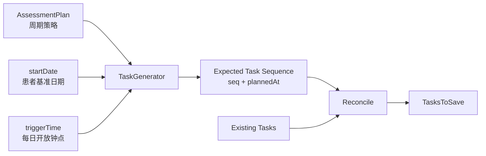
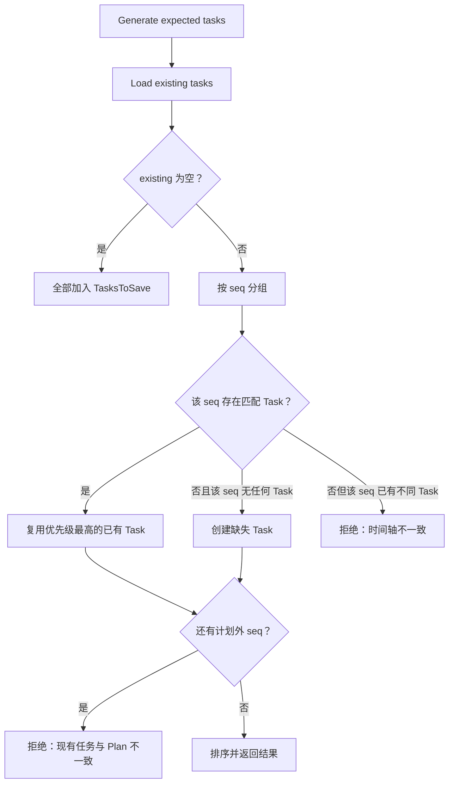

# 核心设计：周期策略与任务生成

> 状态：**已重写**。本文描述当前 Plan 如何把周期策略、患者开始日期和触发时间确定性地展开为 AssessmentTask 序列，并说明重复加入时怎样对账。调度器如何开放 Task、跨聚合状态如何提交，将在后续文档分别展开。

## 1. 本文回答

本文重点回答：

- by_week、by_day、custom、fixed_date 四种周期分别怎样计算 plannedAt；
- 为什么 by_week/by_day 的第一次任务发生在 startDate 当天，而 custom 从指定正周次开始；
- triggerTime 怎样覆盖日期中的时分秒；
- custom/fixed_date 的 totalTimes 为什么不直接相信请求值；
- 患者加入时为什么一次生成全部 Task；
- 重复加入为什么需要重新生成期望序列并逐项对账；
- `(plan_id, testee_id, seq)` 怎样构成最终幂等防线；
- 已终止患者再次加入、固定日期重复值和跨时区分别有什么语义；
- `GenerateTasksUntil`、`FilterNewTasks` 为什么不能写成当前运行能力。

## 2. 30 秒结论

Task 生成可以理解为一个确定性函数：

```text
ExpectedTasks
  = Generate(
      planID,
      orgID,
      scaleCode,
      scheduleType,
      scheduleParameters,
      triggerTime,
      testeeID,
      startDate
    )
```

相同的 Plan、Testee 和 startDate 必须产生相同的：

- Task 数量；
- seq；
- plannedAt；
- orgID；
- scaleCode。

TaskID 每次生成都可能不同，但它不参与“期望时间轴是否相同”的判断。加入用例使用业务属性与现有 Task 对账，而不是拿新生成的 TaskID 比较。



当前主链采用：

> 患者加入时一次生成全部 Task；重复加入时重新计算期望序列并对账；数据库唯一键处理并发竞争。

## 3. 为什么把周期定义与任务生成分开

AssessmentPlan 保存规则，AssessmentTask 保存规则应用到某位患者后的结果。两者不能混为一体：

```text
Plan
  by_week, interval=2, totalTimes=4, triggerTime=19:00

患者 A：startDate=2026-07-01
  -> 07-01、07-15、07-29、08-12

患者 B：startDate=2026-07-08
  -> 07-08、07-22、08-05、08-19
```

Plan 是可复用策略；startDate 属于患者参与；Task 是两者结合后的不可含糊时间事实。

如果只保存 Plan 而运行时临时计算下一次日期，会带来：

- 无法提前查询患者完整随访安排；
- 难以判断某个时间点原本是否应该有任务；
- 重试调度时可能重复计算或遗漏；
- Statistics 难以形成 planned cohort；
- 周期规则变化后，历史应测时间可能漂移。

把 plannedAt 提前固化到 Task，可以让调度、查询、履约和统计都读取同一事实。

## 4. 周期策略输入模型

### 4.1 公共输入

所有策略共享：

| 输入 | 来源 | 作用 |
| --- | --- | --- |
| planID | AssessmentPlan | 标识 Task 来源模板 |
| orgID | AssessmentPlan | 机构隔离与查询冗余 |
| scaleCode | AssessmentPlan | 表示持续执行哪一种测评 |
| scheduleType | AssessmentPlan | 选择时间展开算法 |
| triggerTime | AssessmentPlan | 确定计划日期上的开放钟点 |
| testeeID | EnrollTestee | 确定患者 |
| startDate | EnrollTestee | 相对周期的基准日期 |

### 4.2 策略专属输入

| scheduleType | 需要的配置 | 不使用的配置 |
| --- | --- | --- |
| by_week | interval、totalTimes | fixedDates、relativeWeeks |
| by_day | interval、totalTimes | fixedDates、relativeWeeks |
| custom | relativeWeeks | interval；请求 totalTimes 被列表长度覆盖 |
| fixed_date | fixedDates | interval；请求 totalTimes 被列表长度覆盖；生成时不使用 startDate |

创建请求仍然包含一组统一字段，应用层根据 scheduleType 推导有效参数，再交给 PlanValidator 做跨字段校验。

### 4.3 totalTimes 的真值

by_week/by_day 的 totalTimes 直接来自创建请求，并要求：

```text
1 <= totalTimes <= 100
```

custom/fixed_date 则使用列表长度：

```text
custom.totalTimes     = len(relativeWeeks)
fixed_date.totalTimes = len(fixedDates)
```

即使调用方同时传入另一个 totalTimes，应用层也不会把它作为最终真值。这样避免“列表有 5 个元素但 totalTimes=4”产生两种解释。

当前 custom/fixed_date 没有与 100 对齐的列表长度上限。它们理论上可以一次生成任意数量的 Task，这是已确认的容量边界缺口。

## 5. 四种周期策略

### 5.1 by_week：每 N 周一次

对第 `seq` 个 Task：

```text
date(seq) = startDate + (seq - 1) * interval * 7 days
seq       = 1 ... totalTimes
plannedAt = ApplyTriggerTime(date(seq), triggerTime)
```

示例：

```text
startDate   = 2026-07-01
interval    = 2
totalTimes  = 4
triggerTime = 19:00:00

seq=1 -> 2026-07-01 19:00:00
seq=2 -> 2026-07-15 19:00:00
seq=3 -> 2026-07-29 19:00:00
seq=4 -> 2026-08-12 19:00:00
```

第一次任务的偏移量为 0，所以 startDate 当天就是 seq=1。`interval=2` 表示相邻任务相差两周，不表示第一次任务从第二周开始。

### 5.2 by_day：每 N 天一次

```text
date(seq) = startDate + (seq - 1) * interval days
seq       = 1 ... totalTimes
plannedAt = ApplyTriggerTime(date(seq), triggerTime)
```

示例：

```text
startDate   = 2026-07-01
interval    = 3
totalTimes  = 4
triggerTime = 08:30:00

seq=1 -> 2026-07-01 08:30:00
seq=2 -> 2026-07-04 08:30:00
seq=3 -> 2026-07-07 08:30:00
seq=4 -> 2026-07-10 08:30:00
```

by_day 与 by_week 共享“第一次发生在 startDate 当天”的语义，只是偏移单位不同。

### 5.3 custom：相对患者开始日期的指定周次

```text
date(i)    = startDate + relativeWeeks[i] * 7 days
seq        = i + 1
plannedAt  = ApplyTriggerTime(date(i), triggerTime)
```

示例：

```text
startDate     = 2026-07-01
relativeWeeks = [2, 4, 8, 12]
triggerTime   = 19:00:00

seq=1 -> 2026-07-15 19:00:00
seq=2 -> 2026-07-29 19:00:00
seq=3 -> 2026-08-26 19:00:00
seq=4 -> 2026-09-23 19:00:00
```

relativeWeeks 必须大于 0 且严格递增。因此 custom 当前不能表达 week 0；如果治疗方案要求“加入当天 + 第 2/4/8 周”，需要选择：

- 使用 by_week 无法表达不等间隔；
- 或扩展 custom 允许 0；
- 或把首次测评作为 Plan 外的一次门诊测评。

当前代码选择第三种语义倾向：custom 从治疗后的正周次开始。

### 5.4 fixed_date：固定绝对日期

```text
date(i)   = fixedDates[i]
seq       = i + 1
plannedAt = ApplyTriggerTime(date(i), triggerTime)
```

示例：

```text
fixedDates = [2026-07-10, 2026-08-10, 2026-09-15]
triggerTime = 19:00:00

seq=1 -> 2026-07-10 19:00:00
seq=2 -> 2026-08-10 19:00:00
seq=3 -> 2026-09-15 19:00:00
```

fixed_date 的生成算法完全不使用患者 startDate。但是 EnrollTestee API 和 PlanValidator 当前仍要求所有策略都提供非空 startDate。

所以当前契约存在一个语义冗余：

> fixed_date 的 startDate 是加入接口必填字段，却不是任务时间的计算输入。

它可以继续作为“患者参与基准日”保留，但当前又没有独立 Enrollment 持久化它，因此实际没有形成业务事实。后续应选择放宽 fixed_date 入参，或者引入 Enrollment 后明确保存其业务含义。

### 5.5 fixedDates 的顺序和重复日期

PlanValidator 只拒绝后一日期早于前一日期：

```text
fixedDates[i].Before(fixedDates[i-1]) -> invalid
```

相等日期不会被拒绝。因此当前允许：

```text
[2026-07-10, 2026-07-10]
```

它会生成 plannedAt 相同但 seq 不同的两个 Task，数据库唯一键也允许，因为 seq 不同。

这可能是“一天安排两份相同测评”的有意能力，也可能只是校验没有使用严格递增。当前产品口径没有证明这一需求，因此文档只记录现状，不把重复日期解释为正式设计。

## 6. triggerTime：日期与开放钟点分离

### 6.1 为什么不直接使用 startDate 的时间部分

EnrollTestee 的 startDate 使用 `YYYY-MM-DD`，解析后是当前 `time.Local` 下的午夜。Plan 另外保存 triggerTime，用于表达“这一天几点开放”。

这使日期偏移与日内时刻分离：

```text
周期算法决定：哪一天
triggerTime 决定：这一天几点
```

### 6.2 规范化规则

系统接受：

- 空字符串：使用默认 `19:00:00`；
- `HH:MM`：补全为 `HH:MM:00`；
- `HH:MM:SS`：原样规范化；
- 非法时刻，例如 `25:00`：创建 Plan 时拒绝。

```text
""         -> 19:00:00
"08:30"    -> 08:30:00
"08:30:15" -> 08:30:15
"25:00"    -> invalid
```

### 6.3 ApplyPlanTriggerTime

应用 triggerTime 时保留基础时间的年月日与 Location，替换时、分、秒，并把纳秒归零：

```text
base = 2026-07-01 00:00:00 Asia/Shanghai
clock = 08:30:00

result = 2026-07-01 08:30:00 Asia/Shanghai
```

TaskGenerator 内部若遇到非法 triggerTime，会静默回退到默认 19:00:00。不过正常创建链路已经在应用层和 Plan 构造时完成校验，所以这一分支主要是防御性回退。

问题在于：若历史坏数据通过 Mapper 进入，静默回退会把配置错误转化为另一个有效时刻。更严格的设计应让生成失败并暴露坏数据，而不是悄悄改为 19:00。

### 6.4 当前时区假设

triggerTime 只保存钟点，不保存 timezone。startDate 和 fixedDates 使用 `time.Local` 解析，生成后的 plannedAt 继承基础日期的 Location。

当前隐含前提是：

> qs-apiserver 进程时区与机构业务时区一致，并且所有被同一实例服务的机构使用同一时区语义。

在单一中国业务环境中通常成立；跨时区机构、容器 UTC 配置或夏令时都会使该假设失效。后续应在 Organization 或 Plan 上显式确定 IANA timezone，并统一数据库存储与展示转换。

## 7. TaskGenerator 的输出契约

### 7.1 每个 Task 怎样构造

每次循环都会创建新 AssessmentTask：

```text
Task {
  id         = NewAssessmentTaskID()
  planID     = plan.id
  seq        = index + 1
  orgID      = plan.orgID
  testeeID   = enrollment.testeeID
  scaleCode  = plan.scaleCode
  plannedAt  = calculated date + plan.triggerTime
  status     = pending
}
```

openAt、expireAt、completedAt、assessmentID、entryToken 和 entryURL 都为空。任务生成只表达“未来应测”，不提前生成入口，也不决定实际开放窗口。

### 7.2 什么必须稳定，什么可以变化

对相同输入重复调用 GenerateTasks：

| 内容 | 是否应相同 | 原因 |
| --- | --- | --- |
| Task 数量 | 是 | 由周期配置决定 |
| seq | 是 | 由列表位置决定 |
| orgID/testeeID/scaleCode | 是 | 来自稳定输入 |
| plannedAt | 是 | 由确定性时间公式决定 |
| status | 是，均为 pending | 新生成任务初态 |
| TaskID | 否 | 每次构造都会生成新技术 ID |

因此，对账不能使用 TaskID 判断“是不是同一条期望任务”。

### 7.3 seq 的含义

seq 是患者在该 Plan 下的序列位置，不是全局执行次数，也不是自然周编号：

- custom relativeWeeks=[2,4,8] 时，week 2 对应 seq=1；
- fixedDates 的第一个日期对应 seq=1；
- 同一个 Plan 的不同患者都从 seq=1 开始。

数据库唯一键因此必须同时包含 planID、testeeID 和 seq。

## 8. 患者加入时的任务对账

### 8.1 为什么先生成期望序列

重复加入可能来自：

- HTTP/gRPC 调用重试；
- 客户端超时后再次提交；
- 第一次批量保存前后发生故障；
- 历史数据缺少部分 Task；
- 运维或迁移后重新执行加入。

只检查“有没有任意 Task”无法区分完整加入和部分写入。PlanEnrollment 因此先重新生成完整期望序列，再与现有数据逐 seq 对账。

### 8.2 匹配条件

一个已有 Task 与期望 Task 匹配，需要同时满足：

```text
actual.planID    == expected.planID
actual.testeeID  == expected.testeeID
actual.seq       == expected.seq
actual.orgID     == expected.orgID
actual.scaleCode == expected.scaleCode
actual.plannedAt == expected.plannedAt
```

Task status、TaskID、入口信息和 AssessmentID 不参与时间轴匹配。原因是这些字段表达任务后来发生了什么，而不是任务原本应该在何时发生。

### 8.3 对账结果



| 场景 | 结果 |
| --- | --- |
| 首次加入 | 所有期望 Task 都进入 TasksToSave |
| 完全重复加入 | 复用所有已有 Task，Idempotent=true |
| 缺少部分 seq | 只创建缺失 Task |
| 同 seq 的 plannedAt 不同 | 拒绝，不覆盖原时间轴 |
| 存在期望范围之外的 seq | 拒绝，不静默删除历史 Task |

### 8.4 历史重复数据的优先选择

数据库唯一键建立前可能存在同一 plan/testee/seq 的多条数据。对账辅助函数按状态和 ID 选择 preferred Task：

```text
completed > opened > pending > expired > canceled
同状态时选择 ID 更大的 Task
```

迁移 `000011` 清理重复数据时使用相同优先级，然后建立唯一键。领域对账保留该选择逻辑，是对历史数据和迁移窗口的防御。

### 8.5 终止后再次加入的真实语义

TerminateEnrollment 会把 pending/opened Task 置为 canceled，但不会删除它们。若随后使用相同 Plan 和相同 startDate 再次 Enroll：

- canceled Task 的 plan/testee/seq/plannedAt 仍与期望值匹配；
- 对账会复用 canceled Task；
- 没有 Task 进入 TasksToSave；
- 返回 Idempotent=true；
- canceled Task 不会自动恢复为 pending。

因此当前模型不支持“终止后重新加入同一 Plan，开始新一轮”这一业务语义。恢复整个 Plan 使用的是 PlanLifecycle.Resume，而不是重新 Enroll 单个患者。

如果未来需要患者重新加入，必须先明确：

- 是复活原 Enrollment 和 Task；
- 还是创建新的 enrollmentID 与新一轮 seq；
- 历史 completed/canceled Task 如何归属。

不能仅靠删除旧 Task 绕过唯一键。

## 9. 数据库唯一键与并发幂等

### 9.1 领域对账不是并发锁

两个相同 Enroll 请求可能同时执行：

```text
Request A: 查询 -> 无 Task
Request B: 查询 -> 无 Task
Request A: 生成并插入
Request B: 生成并插入
```

仅靠“先查后写”不能阻止并发重复。因此数据库建立：

```sql
UNIQUE (plan_id, testee_id, seq)
```

它保证每个业务序列位置最多一条 Task。

### 9.2 三层幂等保护

当前加入链路可以分为三层：

| 层 | 机制 | 解决什么问题 |
| --- | --- | --- |
| 领域层 | 重新生成并对账 | 判断请求是否与原时间轴语义相同 |
| 应用层 | Idempotent/TasksToSave | 避免完全命中时重复 SaveBatch |
| 数据库层 | 唯一键 | 处理并发竞争和最后写入保护 |

数据库 duplicate error 当前会翻译为 `task already exists`，不会自动重新查询并转换为幂等成功。因此“先查后写发生并发冲突”仍可能让其中一个请求失败。

更完整的并发幂等可以在唯一冲突后重新加载并执行相同对账；只有对账一致才返回幂等成功，不一致仍报冲突。

### 9.3 TaskID 不是幂等键

每次 GenerateTasks 都会产生新 ID，所以 TaskID 不能作为 Enroll 请求幂等键。真正的业务身份是：

```text
planID + testeeID + seq
```

startDate 没有直接进入唯一键，而是通过 plannedAt 对账保护。一旦原任务存在，以不同 startDate 重试会因 plannedAt 不一致被拒绝。

## 10. 为什么当前一次生成全部 Task

### 10.1 当前主链

PlanEnrollment 调用 `TaskGenerator.GenerateTasks`，在患者加入时一次生成完整序列，然后 SaveBatch。

它适合当前业务的原因：

- 随访次数通常有限；
- by_day/by_week 已限制最多 100 次；
- 患者加入后可以立即查看完整安排；
- 调度器只负责开放 Task，不再负责判断何时创建下一条；
- Statistics 可以直接读取 planned cohort；
- 重复加入对账有完整期望序列。

### 10.2 成本与容量边界

一次生成的代价：

- 加入请求承担 O(N) 的对象创建和批量写入；
- 多患者集中加入会形成数据库写入峰值；
- custom/fixed_date 当前无数量上限；
- 计划跨度数年时会提前保存很久以后的 Task；
- 未来修改周期需要调和整条已物化时间轴。

源码注释把 GenerateTasks 描述为“≤50 次”，但 PlanValidator 对 by_day/by_week 的真实上限是 100。文档以可执行校验为准：当前允许 100；注释已经漂移。

### 10.3 SaveBatch 的边界

MySQL repository 使用 `CreateInBatches(..., 100)` 写入。本文只确认：

- 新加入 Task 通过一个 repository 方法批量写入；
- 每批大小为 100；
- 唯一冲突会返回错误；
- 保存成功后同步 PO 与领域对象 ID。

是否跨多个 batch 自动使用同一数据库事务取决于 GORM 配置和调用上下文，不能仅凭方法名把它写成跨批次原子提交。事务和部分成功问题归入下一篇一致性文档。

## 11. 尚未接入的滚动生成代码

### 11.1 GenerateTasksUntil

TaskGenerator 还提供 `GenerateTasksUntil(plan, testee, startDate, endDate)`，意图只生成 endDate 之前的 Task，适用于长周期滚动生成。

但是当前：

- EnrollTestee 不调用它；
- PlanRunner 只扫描已有 pending Task，不创建未来 Task；
- 没有持久化 Enrollment startDate/nextSeq；
- 没有滚动生成 checkpoint；
- 没有对应的定时生成用例或配置。

所以它是未接入的候选实现，不是线上运行能力。

### 11.2 endDate 边界并不统一

当前实现中：

- by_week/by_day 使用 `currentDate.Before(endDate)`，不包含恰好等于 endDate 的日期；
- custom/fixed_date 使用 Before 或 Equal，包含 endDate。

如果未来启用滚动生成，必须先统一窗口语义，例如明确使用：

```text
[start, end)
```

或：

```text
[start, end]
```

否则同一天的 Task 是否生成会随 scheduleType 不同。

### 11.3 FilterNewTasks

未使用的 `FilterNewTasks` 只用 planID + seq 构造字符串键，没有包含 testeeID；如果拿多患者 Task 集合一起过滤，会把不同患者相同 seq 误判为重复。

它还用 `string(rune(seq))` 表达整数序号，虽然两侧使用同样方式时可能匹配，但语义晦涩，不能作为稳定复合键实现。

当前主链已经使用更完整的 `task_reconcile`，因此不应在新代码中接入 FilterNewTasks。

### 11.4 GenerateTasksWithIDs

`GenerateTasksWithIDs` 重复实现四套周期公式，当前没有调用方。它与主生成器并存会造成规则修改时的双写漂移，例如：

- triggerTime 语义需要改两处；
- 新 scheduleType 需要增加两套分支；
- 校验规则无法复用 AssessmentPlan。

后续应删除这些未使用辅助代码，或者让所有生成入口委托给同一类型化策略内核。

## 12. 设计评价与演进边界

### 12.1 当前设计成立的部分

- 周期规则与患者 Task 分离，职责清晰；
- 四种策略覆盖等间隔、非等间隔和固定日程；
- totalTimes 对列表型策略只有一个真值；
- plannedAt 提前物化，便于调度和统计；
- 重新生成期望序列，使幂等不仅是“重复数据不报错”，还保护时间轴不漂移；
- 数据库唯一键补足并发先查后写的缺口。

### 12.2 当前必须明确接受的语义

- by_day/by_week 在 startDate 当天生成第一次 Task；
- custom 不允许 week 0；
- fixed_date 要求但不使用 startDate；
- fixedDates 当前允许重复日期；
- 终止后相同参数重新 Enroll 不会复活 Task；
- Plan 创建后没有周期编辑命令；
- Task 使用进程时区解释日期和钟点。

这些语义只要与产品预期一致，就不是 bug；一旦产品口径不同，必须同时修改校验、生成、对账、迁移和测试，不能只改其中一个分支。

### 12.3 后续演进建议

按优先级建议：

1. 为四种策略建立统一表驱动测试，锁定公式、seq 和 triggerTime；
2. 明确 custom 是否需要 week 0、fixed_date 是否允许重复日期；
3. 明确 fixed_date 的 startDate 是删除还是提升为 Enrollment 事实；
4. 为 custom/fixed_date 增加合理任务数量上限；
5. 唯一冲突后重新查询对账，将真实并发重复转换为幂等成功；
6. 删除未使用且重复的生成辅助函数；
7. 只有在长周期需求成立并引入 Enrollment/checkpoint 后，才设计滚动生成。

## 13. 测试保护与事实源

### 13.1 当前直接保护

| 行为 | 测试证据 |
| --- | --- |
| 空 triggerTime 默认 19:00 | `TestNormalizePlanTriggerTime/default` |
| HH:MM 规范化 | `TestNormalizePlanTriggerTime/hhmm` |
| 非法时刻拒绝 | `TestNormalizePlanTriggerTime/invalid` |
| triggerTime 应用到日期 | `TestApplyPlanTriggerTime` |
| 按天任务默认 19:00 | `TestEnrollmentServiceSchedulesGeneratedTasksAtSevenPM` |
| 自定义 triggerTime | `TestEnrollmentServiceSchedulesGeneratedTasksUsingPlanTriggerTime` |
| 完全重复加入幂等 | `TestPlanEnrollmentEnrollTesteeIsIdempotent` |
| 不同 startDate 拒绝 | `TestPlanEnrollmentEnrollTesteeRejectsDifferentStartDateForExistingEnrollment` |
| 只补齐缺失 Task | `TestPlanEnrollmentEnrollTesteeCreatesOnlyMissingTasks` |
| 应用层幂等不重复保存 | `TestEnrollmentServiceIdempotentEnrollPublishesNoPlanEvent` |

### 13.2 当前测试缺口

- TaskGenerator 没有覆盖四种 scheduleType 的统一表驱动测试；
- custom 的正周次和严格递增只由校验代码保护；
- fixed_date 的绝对日期、重复日期和 startDate 无效性未被直接锁定；
- by_week 的完整日期公式只有加入测试间接覆盖；
- totalTimes 对 custom/fixed_date 的推导缺少直接应用测试；
- custom/fixed_date 大列表没有容量边界测试；
- GenerateTasksUntil 的开闭区间差异没有测试；
- 并发 Enroll 唯一冲突后的返回语义没有集成测试；
- SaveBatch 跨 batch 的事务语义没有真实 MySQL 测试。

### 13.3 源码事实矩阵

| 主题 | 事实源 |
| --- | --- |
| 四种生成公式 | [`task_generator.go`](../../../internal/apiserver/domain/plan/task_generator.go) |
| triggerTime 规范化和应用 | [`trigger_time.go`](../../../internal/apiserver/domain/plan/trigger_time.go) |
| 周期参数校验 | [`validator.go`](../../../internal/apiserver/domain/plan/validator.go) |
| Plan 创建参数推导 | [`lifecycle_create_workflow.go`](../../../internal/apiserver/application/plan/lifecycle_create_workflow.go) |
| 加入与对账 | [`plan_enrollment.go`](../../../internal/apiserver/domain/plan/plan_enrollment.go)、[`task_reconcile.go`](../../../internal/apiserver/domain/plan/task_reconcile.go) |
| 应用保存顺序 | [`enrollment_service.go`](../../../internal/apiserver/application/plan/enrollment_service.go) |
| Task 批量持久化 | [`task_repository.go`](../../../internal/apiserver/infra/mysql/plan/task_repository.go) |
| 业务唯一键 | [`000011_add_assessment_task_plan_testee_seq_unique_index.up.sql`](../../../internal/pkg/migration/migrations/mysql/000011_add_assessment_task_plan_testee_seq_unique_index.up.sql) |

建议验证：

```bash
go test ./internal/apiserver/domain/plan
go test ./internal/apiserver/application/plan
go test ./internal/apiserver/infra/mysql/plan
make docs-hygiene
make docs-facts
```

上述测试可以验证当前函数级公式和对账行为；并发唯一冲突、真实事务和大批量性能仍需要 MySQL 集成测试与容量验证。
