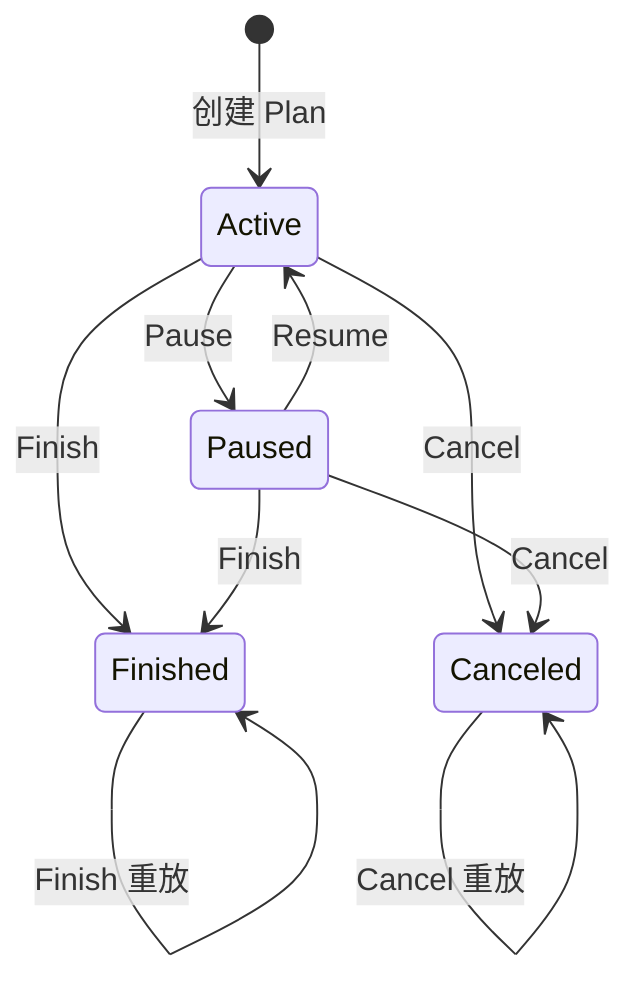
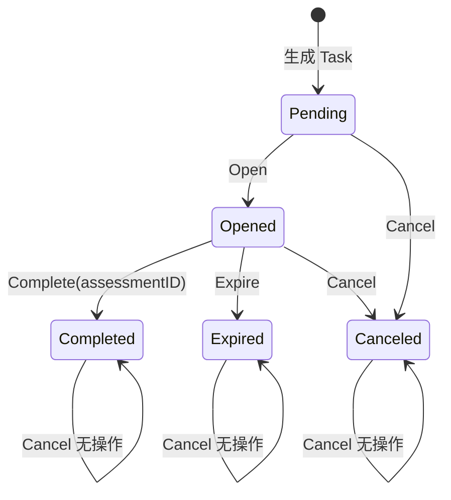
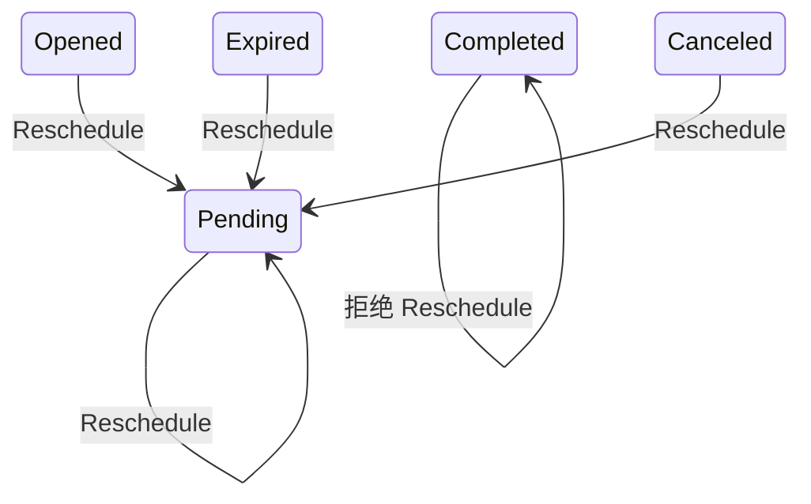
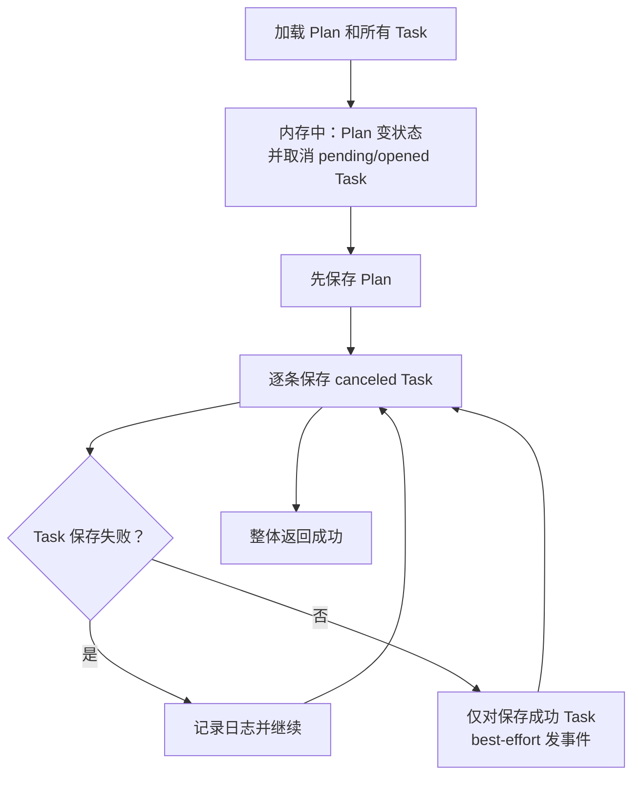
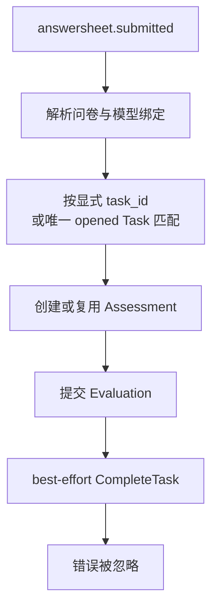

# 核心设计：状态、幂等与数据一致性

> 状态：**已按当前源码重写**。本文严格区分已实现契约、当前最终一致性行为和尚未完成的设计目标。周期展开算法见[《周期策略与任务生成》](./20-核心设计-周期策略与任务生成.md)；调度、入口和提醒的运行细节在后续文档展开。

## 1. 本文回答

本文重点回答：

- AssessmentPlan 和 AssessmentTask 为什么需要两套状态机；
- `finished`、`completed` 和“所有任务已完成”为什么不是同一件事；
- 暂停、恢复、结束、取消、开放、完成和过期的合法迁移是什么；
- 哪些命令可以安全重放，哪些重放会返回冲突；
- `(plan_id, testee_id, seq)` 与 `assessment_id` 唯一约束分别保护什么；
- `version` 列当前是否真的实现了乐观锁；
- Plan 和多条 Task 一起变更时，当前事务边界在哪里；
- Task 状态和 `task.*` 事件之间是强一致还是 best-effort；
- Assessment 已创建但 Task 未完成时，系统能否可靠收敛；
- 并发 Open、Complete、Expire 与 Plan 状态变更存在哪些竞态窗口。

## 2. 30 秒结论

Plan 模块的正确性不能只靠一个 `status` 字段。它需要同时回答三类问题：

| 维度 | 回答的问题 | 当前主要机制 |
| --- | --- | --- |
| 状态机 | 一个 Plan/Task 允许怎样变化 | 领域服务前置检查 + 包内状态变更 |
| 幂等 | 同一业务意图重复到达会怎样 | 已有 Task 对账、部分同终态返回成功、数据库唯一键 |
| 一致性 | Plan、Task、Assessment 和事件是否共同落到可解释状态 | 单记录保存、无跨聚合事务、Task 事件 best-effort、部分自然重放 |

当前可以确认的核心事实是：

1. Plan 和 Task 的状态迁移规则已经收敛在领域层，不是由 Handler 任意改字段；
2. 同一患者在同一 Plan 中的第 N 次任务，由 `(plan_id, testee_id, seq)` 确定唯一身份；
3. 一个 Assessment 最多完成一个 Task，由 `uk_assessment_id` 作为最终数据库防线；
4. 单个 Task 是先保存状态、后尽力发布事件，因此 Task 表是生命周期真值，`task.*` 不是可靠事实日志；
5. 暂停、恢复、结束、取消和终止参与会修改多条记录，当前没有使用同一 MySQL 事务；
6. `version` 字段当前只是审计持久字段，没有形成可用的乐观并发控制；
7. AnswerSheet 创建 Assessment 后完成 Task 是 best-effort 跨模块协作，尚没有持久化补偿与一致性调和。

所以，当前实现可以概括为：

> **领域状态机较清晰，业务唯一性有数据库防线，但跨聚合提交、并发冲突和跨模块收敛仍主要依赖顺序保存、日志和自然重放。**

## 3. 先把三个概念分开

### 3.1 状态机不等于幂等

状态机判断“从当前状态能不能执行这个命令”。例如：

```text
opened Task --Complete--> completed Task
pending Task --Complete--> 拒绝
```

幂等判断“同一命令重复执行是否返回同一业务结果”。例如，Task 第一次使用 Assessment 9001 完成后，再次提交相同 `(task_id, assessment_id)`：

- 从状态机看，Task 已不是 opened；
- 从业务幂等看，它其实可以被解释为“相同完成事实已成立”。

当前代码只执行前一层判断，所以重复 Complete 会失败。这不是状态机错误，而是命令幂等语义还未补齐。

### 3.2 幂等不等于并发安全

“先查已有记录，没有再创建”能让串行重试幂等，但两个请求可能同时查到“没有”。因此 Enrollment 还需要 `(plan_id, testee_id, seq)` 唯一键拒绝第二份 Task。

反过来，唯一键只能防止重复事实，不会自动把失败方转换为幂等成功响应。当前并发 Enroll 的其中一方可能收到 `task already exists`，需要应用层在唯一冲突后回读并重新对账，才能形成完整的并发幂等。

### 3.3 事务原子性不等于跨模块最终一致

暂停 Plan 需要同时改 Plan 和多条 Task；这些记录都在 MySQL，适合使用本地事务保护。

AnswerSheet 创建 Assessment 后再完成 Task，则跨越 Survey/Evaluation 与 Plan 应用边界；即使都在同一 MySQL，也需要考虑业务耦合、重放入口和补偿。这一层通常应由“可靠事件 + 幂等消费 + 调和”完成，而不是把所有模块硬塞进一个长事务。

## 4. AssessmentPlan 状态机

### 4.1 状态语义

| 状态 | 业务语义 | 是否允许新患者加入 | 调度器对其 Task 的态度 |
| --- | --- | --- | --- |
| `active` | Plan 正常运行 | 允许 | 可开放到期 pending Task |
| `paused` | 暂时停止，未完成 Task 应被取消，以后可恢复 | 不允许 | 扫到非 active 父 Plan 时取消 Task |
| `finished` | 管理员手动结束此计划 | 不允许 | 不再推进 Task |
| `canceled` | 计划已取消，不允许恢复 | 不允许 | 不再推进 Task |

`finished` 是管理命令产生的 Plan 终态，不是“系统检查所有患者 Task 都 completed”后自动推导的状态。一个可复用 Plan 可以同时服务多个患者，因此“某个患者完成全部 Task”也不能直接推导 Plan finished。

### 4.2 状态迁移



不允许的迁移包括：

- finished 不能 Pause、Resume 或 Cancel；
- canceled 不能 Pause、Resume 或 Finish；
- active 不能 Resume；
- paused 不能再 Pause。

`PlanLifecycle.Activate` 对 active 是幂等的，也能把 paused 转回 active；但当前对外 Resume 用例走的是更完整的 `Resume`，因为恢复不仅要改 Plan，还要重置或补齐患者 Task。

### 4.3 状态变更的联动规则

| Plan 命令 | Task 联动 |
| --- | --- |
| Pause | 把该 Plan 下所有 pending/opened Task 取消 |
| Resume | 保留 completed Task；对后续 seq 复用已有非 completed Task 并重置为 pending，缺失则新建 |
| Finish | 把 pending/opened Task 取消，completed/expired/canceled 保持不变 |
| Cancel | 把 pending/opened Task 取消，completed/expired/canceled 保持不变 |

暂停、结束和取消都只联动 pending/opened，因为 completed 是已经发生的履约事实，expired 是已经结束的未履约结果。恢复则是特别语义：它允许 canceled/expired 被重用为 pending，但不允许 completed 被重置。

## 5. AssessmentTask 状态机

### 5.1 五种状态

| 状态 | 核心语义 | 应同时成立的字段事实 |
| --- | --- | --- |
| `pending` | Task 已安排，尚未开放 | `planned_at` 已确定，入口与完成字段为空 |
| `opened` | Task 已生成填写入口 | `open_at`、`expire_at`、`entry_token`、`entry_url` 已设置 |
| `completed` | 一次 Assessment 已履约此 Task | `completed_at` 和 `assessment_id` 已设置 |
| `expired` | opened Task 到截止时间仍未完成 | 保留原 `open_at`、`expire_at` 和入口信息 |
| `canceled` | Task 被 Plan 或人工命令取消 | 当前保留原有入口/时间字段，没有独立 `canceled_at` 列 |

这些“应同时成立”的规则由领域方法写入，当前数据库没有 CHECK 约束验证状态与时间/关联字段组合。仓储映射也可以直接恢复任意字符串状态，所以数据库异常数据不会在读取时被强制拒绝。

### 5.2 普通运行状态机



### 5.3 Resume 引入的特例迁移

`TaskStatus.IsTerminal()` 把 completed、expired、canceled 都称为终态，但这里的“终态”只是普通 Task 生命周期的终态。Plan Resume 使用 `Reschedule` 时：



Reschedule 会：

- 替换 `planned_at`；
- 把 status 设为 pending；
- 清空 open/expire/completed 时间；
- 清空 assessmentID、entryToken 和 entryURL；
- 不生成独立领域事件。

上述是**领域对象的目标状态**。当前仓储通过 GORM `Updates(struct)` 更新 PO，结构体更新默认跳过 nil、空字符串等零值。因此 Reschedule 把内存字段设为 nil/`""` 后，这些“清空”当前不一定会写入数据库。可能出现：

```text
status = pending
open_at / expire_at / entry_token / entry_url = 仍保留恢复前的值
```

如果历史 Task 存在 assessmentID/completedAt 异常组合，这些值也不能依靠当前 Reschedule 稳定清除。所以“恢复后是干净 pending”尚未被持久化合同保护，需要显式 `Select`/`Updates(map)` 或专用状态更新 SQL。

因此，文档不应简化为“expired/canceled 永远不可变”。更准确的说法是：

> completed 是不可逆的履约事实；expired/canceled 在普通生命周期中结束，但可在 Plan Resume 语义下复用同一 Task 身份并重新安排。

### 5.4 状态迁移时间的完整性

当前 Task 持久化了 `planned_at`、`open_at`、`expire_at`、`completed_at`，但没有持久化：

- `expired_at`：`task.expired` 事件中有实际迁移时间，Task 表只有原截止时间 `expire_at`；
- `canceled_at`：实际取消时间只在 `task.canceled` 事件载荷中；
- Plan 的 `paused_at`、`finished_at`、`canceled_at`：目前只能用通用 `updated_at` 近似解释。

由于 `task.*` 是 best-effort，事件丢失后无法从 Task 表精确还原过期/取消的发生时刻。如果未来这些时间要用于 SLA、审计或患者沟通，它们应成为持久化业务事实，不能只存在尽力通知中。

## 6. 当前命令幂等矩阵

### 6.1 Plan 命令

| 命令 | 首次成功后重放 | 当前结果 | 能否修复首次的部分保存 |
| --- | --- | --- | --- |
| CreatePlan | 重复请求无业务幂等键 | 可能再创建一个 Plan | 不适用 |
| PausePlan | Plan 已 paused | 拒绝，因为不再是 active | 不能；重试无法重新取消失败 Task |
| ResumePlan | Plan 已 active | 拒绝，因为不再是 paused | 不能；重试无法补齐首次失败 Task |
| FinishPlan | Plan 已 finished | 返回成功、不再返回 Task | 不能；同终态短路跳过任务扫描 |
| CancelPlan | Plan 已 canceled | 返回成功、不再返回 Task | 不能；同终态短路跳过任务扫描 |

这里的重要结论是：

> **“重复请求不报错”不等于“命令具有可收敛幂等性”。**

Finish/Cancel 对相同 Plan 终态的重放虽然返回成功，但如果第一次 Plan 保存成功、部分 Task 保存失败，第二次会直接短路，不会修复中间态。

### 6.2 Enrollment 命令

| 场景 | 当前结果 |
| --- | --- |
| 首次 Enroll | 生成全部期望 Task，批量保存 |
| 相同 Plan/Testee/startDate 串行重放 | 重新生成期望序列并与已有 Task 对账；全部匹配时 `Idempotent=true` |
| 相同 Plan/Testee 但 startDate 不同 | 发现 seq/plannedAt 冲突并拒绝 |
| 已有 Task 少于期望序列 | 补建缺失 seq |
| 已有 Task 多于期望序列 | 拒绝，提示现有任务与 Plan 定义不一致 |
| 两个首次 Enroll 并发 | 唯一键防止重复 Task；冲突方当前可能返回数据库错误 |
| TerminateEnrollment 串行重放 | 只选择仍非终态的 Task；已全部取消时空操作成功 |

Enrollment 没有独立记录，所以幂等身份来自 Task 集合，而不是 `enrollment_id`。它能表达“同一时间轴重复加入”，但不能区分终止后的第二轮参与。

### 6.3 Task 命令

| 命令 | 允许的起始状态 | 重放语义 |
| --- | --- | --- |
| OpenTask | pending | 已 opened 后重放失败 |
| CompleteTask | opened | 已 completed 后即使 assessmentID 相同也失败 |
| ExpireTask | opened | 已 expired 后重放失败 |
| CancelTask | 任意 | pending/opened 转 canceled；任意终态返回成功且不变状态 |
| Reschedule | 任意非 completed | 重置为 pending；相同 plannedAt 重复执行结果相同 |

Task Complete 的理想命令语义应是：

```text
opened + assessment=9001
  -> completed(9001)

completed(9001) + assessment=9001
  -> 幂等成功

completed(9001) + assessment=9002
  -> 业务冲突
```

当前只实现了第一个分支。这会影响 Worker 重放、超时重试和后续补偿工具对“已经完成”的识别。

## 7. 数据库保护的业务不变式

### 7.1 Task 业务身份唯一

```text
UNIQUE(plan_id, testee_id, seq)
```

它保护：

> 同一患者在同一 Plan 时间轴中，第 N 个应测位置只有一条 Task。

这个唯一键保护的是“序号位置”，不保护两个不同 seq 拥有相同 `planned_at`。例如 fixedDates 当前只禁止倒序，没有禁止相同日期重复；这会得到两条 seq 不同但 plannedAt 相同的合法 Task。

### 7.2 一个 Assessment 不能完成多个 Task

```text
UNIQUE(assessment_id)
```

MySQL 允许多个 NULL，所以不影响 pending/opened Task；一旦设置 assessmentID，同一 Assessment 不能被另一条 Task 重复占用。

它不保证：

- assessmentID 指向的 Assessment 真实存在；
- Assessment 的 orgID/testeeID/modelCode 与 Task 一致；
- completed Task 一定有 assessmentID；
- assessmentID 已归属该 Plan 而不是 adhoc 测评。

原因是当前 schema 没有 Plan/Task/Assessment 之间的外键或跨表 CHECK，这些组合语义依赖应用服务。

### 7.3 没有数据库约束的不变式

当前下列规则只存在于 Go 领域代码：

- Plan status 必须是 active/paused/finished/canceled；
- Task status 必须是 pending/opened/completed/expired/canceled；
- completed 必须有 completedAt 和 assessmentID；
- opened 必须有入口与截止时间；
- Task.orgID/scaleCode 必须与父 Plan 一致；
- seq 必须属于 Plan 当前周期序列。

这并不意味着必须为每条规则都加 SQL CHECK，但必须承认：运维脚本、历史迁移或绕过领域层的写入可以制造领域不可解释数据，因此需要定期一致性审计。

## 8. `version` 为什么还不是乐观锁

### 8.1 看上去已经具备的元素

Plan 和 Task 表都有：

```text
version INT UNSIGNED NOT NULL DEFAULT 1
```

`mysql.AuditFields.Version` 也标注了 `version`。但字段存在不代表并发控制已成立。

### 8.2 一个真正的乐观更新至少需要

```sql
UPDATE assessment_task
SET status = ?, version = version + 1
WHERE id = ? AND version = ? AND status = ?;
```

然后应用层必须检查 `RowsAffected`：

- 1：本次迁移获得提交权；
- 0：状态或 version 已变，回读最新数据并按幂等/冲突规则决策。

### 8.3 当前代码缺少的环节

1. PlanMapper/TaskMapper 把领域对象转换为 PO 时不保留读取到的 version；
2. 领域对象本身也不携带仓储 version；
3. `BaseRepository.UpdateAndSync` 直接使用 `Updates(entity)`；
4. 更新条件没有 `WHERE version = ?`；
5. 应用层没有把 0 行更新转换为并发冲突。

因此当前的并发写入语义是 **last write wins**，而不是乐观锁。`version` 列可以作为后续改造基础，但文档不能把它宣称为已有能力。

## 9. 当前持久化与事务边界

### 9.1 仓储已具备参与事务的基础

`BaseRepository.WithContext` 会识别 context 中的 GORM transaction，仓储因此可以参与 Unit of Work。项目也已定义应用层 `transaction.Runner` 端口。

但 Plan 当前的组装和用例没有注入/调用该 Runner，所以“仓储支持事务 context”不等于“Plan 用例已在事务中运行”。

### 9.2 单 Task 迁移

Open、Complete、Expire、Cancel 的通用顺序是：


单条 Task 的数据库更新本身是一个单写入边界。但它仍不是并发安全状态迁移，因为查询和更新之间没有行锁、版本条件或状态条件。

### 9.3 暂停、结束和取消 Plan

当前顺序是：



其一致性后果是：

```text
Plan = paused/finished/canceled
Task A = canceled
Task B = opened      <- 保存失败
Task C = pending     <- 保存失败
API = success
```

调度器未来扫到 inactive Plan 的到期 pending Task 时会尝试取消，这是一层被动收敛；但它不是可靠补偿契约：

- 未到 plannedAt 的 pending Task 会继续保留到调度窗口；
- 仍为 opened 且未到 expireAt 的 Task 不会立即进入过期扫描；
- Assessment Intake 的显式 Task 解析只检查 Task opened，不再校验父 Plan active，因此这条 Task 仍可能被履约；
- 重放 Pause 会失败，重放 Finish/Cancel 会被同终态短路，都不能稳定修复。

### 9.4 恢复 Plan

当前 Resume 顺序是：

```text
1. 加载 paused Plan 和已有 Task
2. 内存中生成/重置后续 Task
3. 先保存 Plan = active
4. 逐条保存 Task
5. 任一 Task 失败立即返回错误
```

这会留下：

- Plan 已 active；
- 前几条 Task 已 pending；
- 当前失败及后续 Task 仍 canceled/expired，或根本未创建；
- 调用方收到错误，但再次 Resume 又因 Plan 已 active 而被拒绝。

这比“返回失败即什么都没发生”更危险，因为客户端无法从错误响应推断实际持久化进度。

### 9.5 终止单个患者参与

TerminateEnrollment 只修改某 Plan/Testee 下的非终态 Task：

```text
内存中全部 cancel
  -> 逐条 Save
  -> 失败只记日志并继续
  -> 整体返回 success
```

它和 Pause/Finish/Cancel 一样可能部分保存，但有一个不同：重放 Terminate 会再次找到仍非终态的 Task，因此有机会修复上次失败项。这仍然不是事务原子性，而是命令重放带来的自然收敛。

### 9.6 患者加入

Enroll 使用 `SaveBatch` 一次写入 `TasksToSave`，比逐条忽略失败更接近一个完整持久化边界；但应用层仍没有显式 Unit of Work，并且存在“先查已有 Task，后批量创建”的并发窗口。

因此它的完整契约应是：

```text
串行重放：领域对账返回幂等成功
并发首次写：唯一键决定最终唯一
唯一冲突后：回读并对账，如已等价则转幂等成功
```

第三步当前尚未实现。

## 10. Task 事件与数据一致性

### 10.1 事件不是 Task 状态的提交条件

当前四种事件都配置为 `best_effort`：

| 事件 | 产生时机 | 主要用途 |
| --- | --- | --- |
| `task.opened` | pending 转 opened | 向小程序发送任务开放提醒 |
| `task.completed` | opened 转 completed | 对外通知履约完成 |
| `task.expired` | opened 转 expired | 对外通知任务过期 |
| `task.canceled` | 非终态转 canceled | 对外通知任务取消 |

应用服务先保存 Task，再调用 `PublishCollectedEvents`。发布失败时：

- 记录错误日志；
- 继续尝试同聚合其他事件；
- 遍历后仍清空内存事件；
- 不回滚 Task 状态；
- 不写 Outbox，也没有持久化重试。

因此：

```text
Task opened/completed/expired/canceled 可能已成立
task.* 通知可能没有任何消费者看到
```

### 10.2 best-effort 的合理边界

如果 `task.*` 只服务于：

- 提醒或辅助通知；
- 不改变 Plan/Task 真值的外部 Webhook；
- 丢失后可以由查询 Task 当前状态补发的交互；

那么 best-effort 可以是有意识的运行质量取舍。

但任何下游如果要依赖 `task.completed` 构建不可丢失的统计、费用、治疗进度或审计事实，就必须：

1. 直接以 Task 表为真值重建；或
2. 把对应事件升级为与状态变更同事务的 durable Outbox。

不能既使用 best-effort，又在业务上假设它绝不丢失。

### 10.3 Plan 本身没有生命周期事件

AssessmentPlan 保留了 `Events/ClearEvents` 结构，但当前 Pause、Resume、Finish、Cancel 都没有添加 `plan.*` 事件；Enrollment 也没有可靠加入/终止事件。

因此下游如果要知道“Plan 何时暂停”或“患者何时加入”，当前只能查询最终状态/任务集合，不能从领域事件日志还原变化过程。

## 11. Assessment 与 Task completed 的跨模块一致性

### 11.1 当前链路

AnswerSheet 进入 Assessment Intake 时：



当前代码的主真值优先级是：

> 不让 Plan Task 回写失败阻断 Assessment 创建和测评执行。

这个取舍保护了医学测评主链路，但会产生：

```text
Assessment(origin_type=plan, origin_id=planID) = 已创建/已提交
Task = opened
```

### 11.2 Worker 重放能修复什么

`answersheet.submitted` 重放时，Intake 会按 AnswerSheetID 复用已有 Assessment，然后再次尝试 `completePlanBestEffort`。

因此：

- 如果上次 Task Save 失败，数据库仍是 opened，重放可能修复；
- 如果 Task Save 已成功但返回或事件发布失败，再次 Complete 会因 Task 已 completed 而报错，但该错误仍被 Intake 忽略；
- 如果原消息不再重放，没有独立机制主动发现 opened Task 与已有 Assessment 的漂移。

所以 Worker 重放是一个可用恢复路径，但不是完整可靠性契约。

### 11.3 显式 task_id 解析的当前容错

如果 AnswerSheet 明确携带 taskID，但 Task：

- 不存在；
- orgID/testeeID/scaleCode 不匹配；
- 不是 opened；
- 或查询发生错误；

解析器当前只记录警告并返回 nil。Intake 随后可能把这次测评当作 adhoc，而不是拒绝一个明确但无效的 Plan 履约意图。

这保护了测评不被 Plan 异常阻断，但会丢失履约归因。更严谨的边界应区分：

```text
未携带 task_id
  -> 允许 adhoc，或按唯一 opened Task 尝试自动匹配

明确携带 task_id 但无效
  -> 拒绝或进入可观测的人工处理，不应静默降级为 adhoc
```

这一问题将在《从任务开放到测评履约》链路文档和重构清单中继续展开。

## 12. 并发竞态与 PlanRunner 租约的边界

### 12.1 租约保护的是调度器进程

内建 PlanRunner 通过 Redis lease 保证多个 apiserver 副本中，同一调度 tick 主要由一个实例执行。Redis/lease 不可用时，内建调度器不启动，而不是无锁降级扫描。

这一选择减少了重复扫描，但 lease 不等于：

- 某条 Task 的行级 Claim；
- 每次 Task 更新的 fencing token；
- 手工 Open/Expire/Complete 接口与调度器之间的互斥；
- lease 丢失后旧执行者对数据库写入的禁止。

### 12.2 三类典型竞态

#### 竞态 A：两个 Open

```text
Worker A 读到 pending
Worker B 读到 pending
A 生成 token-A，保存 opened
B 生成 token-B，保存 opened
```

当前无条件更新会让后写覆盖前写，两个请求都可能发布 `task.opened`。最终 Task 只保留一组入口，但用户可能收到多个不一致链接。

#### 竞态 B：Complete 与 Expire

```text
Worker A 读到 opened，准备 completed(assessment-1)
Worker B 读到 opened，准备 expired
A 保存 completed
B 后保存 expired
```

在 last-write-wins 下，有效 Assessment 已经创建，Task status 却可能最终被覆盖为 expired。又因 `Updates(struct)` 跳过 nil 零值，B 不一定清除 A 写入的 assessmentID/completedAt，最终反而可能形成“status=expired，但 assessmentID/completedAt 非空”的不可解释组合，同时两个请求还可能分别发布 completed/expired 事件。唯一 assessmentID 索引无法防止这类“不同状态的同行覆盖”。

#### 竞态 C：Plan Pause 与 Task Complete

Pause 在内存中把 opened Task 转 canceled，同时 Assessment Intake 可能基于旧 opened 快照完成同一 Task。没有事务和条件更新时，最后写入决定 status，零值跳过还可以使其他字段保留上一个写入的值；最终状态来自时序偶然性，而不是显式业务优先级。

如果业务选择“患者在暂停同时已提交的测评应算完成”，就需要在条件更新和冲突处理中明确这个优先级，不能交给时序偶然性。

## 13. 应当固化的一致性契约

下列是基于当前业务语义提炼的目标契约，**不代表已全部实现**。具体改造任务将进入 `90-设计问题与重构清单.md`。

### 13.1 本地聚合组合应使用同一 MySQL 事务

| 用例 | 建议原子提交的内容 |
| --- | --- |
| Pause/Finish/Cancel Plan | Plan 状态 + 全部受影响 Task 状态 |
| Resume Plan | Plan active + 全部新建/重置 Task |
| Terminate Enrollment | 该 Plan/Testee 下全部受影响 Task |
| Enroll | 本次需补建的整个 Task 集合 |

这些数据同属 MySQL，不需要分布式事务。应用服务只需依赖 `transaction.Runner` 端口，仓储通过 transaction context 参与，并把事件发布安排在 commit 之后。

如果一个 Plan 下 Task 数量过大，不应因此接受静默部分成功；应考虑条件批量 UPDATE、影响数校验和可重放补偿任务。

### 13.2 每个 Task 迁移应使用条件写

关键迁移应将“前置状态”放入 SQL 条件，而不只是放在读取后的内存判断：

```text
Open:     UPDATE ... WHERE id=? AND status='pending' AND version=?
Complete: UPDATE ... WHERE id=? AND status='opened'  AND version=?
Expire:   UPDATE ... WHERE id=? AND status='opened'  AND version=?
Cancel:   UPDATE ... WHERE id=? AND status IN ('pending','opened') AND version=?
```

条件写失败后回读最新状态，再分为：

- 相同业务事实已成立：幂等成功；
- 不同事实已占用：明确冲突；
- 可重试并发更新：在有限预算内重新加载；
- 非法状态：拒绝并记录一致性告警。

### 13.3 幂等必须基于业务意图

| 命令 | 建议幂等身份 | 冲突条件 |
| --- | --- | --- |
| Enroll | planID + testeeID + 期望时间轴 | 同 Plan/Testee 已存在不同时间轴 |
| Complete Task | taskID + assessmentID | Task 已由另一 Assessment 完成 |
| Open Task | taskID + 已持久入口 | Task 已被另一组入口开放，需回读而非重生成 |
| Pause/Resume/Finish/Cancel | planID + targetStatus | 当前已进入不相容终态 |

对幂等命令返回最新持久化结果，不应仅返回空成功。这样调用方才能在超时重试后重建正确认知。

### 13.4 跨模块履约应可调和

Assessment 与 Task 的协作应至少具备：

1. 持久化的 Plan 履约意图，能够从 AnswerSheet 提交上下文重建 taskID；
2. `CompleteTask(taskID, assessmentID)` 对相同组合幂等；
3. 完成意图通过 durable Outbox 或等价持久机制发出；
4. 消费者使用条件更新，并区分幂等命中与真冲突；
5. 调和器能检查“Plan 归因 Assessment 已存在，Task 仍 opened”；
6. 补偿动作记录原因、前后状态和操作结果。

这里的目标不是“消息绝对只投递一次”，而是：

> 履约命令可以重复到达，但相同 Assessment 只会形成一份 Task 完成事实；任何中间失败都能被发现和重放。

### 13.5 通知与业务真值必须分级

Plan 模块不需要把所有事件都升级为 durable。应先分类：

| 事件用途 | 可选 delivery | 前提 |
| --- | --- | --- |
| 一般提醒/可补发通知 | best-effort | 丢失不改变 Task 真值，且存在查询/补发入口 |
| 建立 Assessment → Task 履约 | durable | 消费者幂等，有失败状态与补偿 |
| 建立不可重建的审计事实 | durable | 与状态更新同事务写 Outbox |
| 可由 Task 表完整重建的统计 | 以表重建优先 | 指标口径明确且有重建工具 |

## 14. 一致性审计应检查什么

在重构完成前，也可以通过只读审计发现风险。建议检查的不变式包括：

### 14.1 Plan 与 Task

- paused/finished/canceled Plan 下是否仍有 opened Task；
- inactive Plan 下是否长期保留已到期 pending Task；
- Task.orgID/scaleCode 是否与 Plan 一致；
- 同 Plan/Testee 的 seq 是否完整且符合周期定义；
- 同 Plan/Testee 是否出现不可解释的时间轴漂移。

### 14.2 Task 内部字段

- completed 但 assessmentID/completedAt 为空；
- 非 completed 却存在 assessmentID/completedAt；
- opened 但 token/URL/openAt/expireAt 为空；
- pending 却仍保留上次入口或完成字段；
- expired/canceled 却因并发覆盖保留 assessmentID/completedAt；
- expireAt 早于 openAt；
- status 不在已知枚举中。

### 14.3 Task 与 Assessment

- completed Task 的 assessmentID 是否存在；
- Assessment 的 org/testee/model 是否与 Task 一致；
- 携带 Plan/Task 提交上下文的 Assessment 是否仍对应 opened Task；
- 是否存在一个 Task 被多份 Assessment 声称履约；
- Task completedAt 是否早于 Assessment/AnswerSheet 的有效提交时间。

审计结果应先只读输出、分类原因，不应直接批量改状态。完成、过期和取消之间的冲突需要明确业务优先级与审计痕迹。

## 15. 测试与验证边界

### 15.1 当前已有保护

现有测试已覆盖：

- Cancel/Finish 取消 pending/opened，保留 completed/expired；
- Resume 复用 canceled Task 且不重置 completed；
- Task Cancel 产生 canceled 事件；
- Enrollment 的顺序幂等与周期对账；
- Terminate 只发布 TaskCanceled 事件；
- 调度器为 inactive Plan 取消 Task；
- `PublishCollectedEvents` 在单事件发布失败后继续并清空事件。

### 15.2 尚需补齐的验证

| 类型 | 关键场景 |
| --- | --- |
| 事务故障注入 | Plan 保存后第 N 条 Task 失败，整体是否回滚 |
| 并发状态测试 | Complete vs Expire、Open vs Open、Pause vs Complete |
| 并发 Enrollment | 唯一冲突后回读是否转为幂等成功 |
| 乐观锁合同测试 | 旧 version 更新必须 0 行受影响并返回冲突 |
| 跨模块故障注入 | Assessment 已创建但 CompleteTask 失败，可否持久重放收敛 |
| 事件故障注入 | Task Save 成功、publish 失败时，是否符合所声明 delivery |
| 真实 MySQL 集成 | 唯一约束、事务回滚、条件更新及 RowsAffected |

单元测试可以证明领域迁移，但无法证明数据库原子性、锁语义和真实唯一冲突处理。这些必须使用真实 MySQL 集成测试验证。

## 16. 与后续文档的分工

| 文档 | 继续展开的问题 |
| --- | --- |
| 《测评引用与版本语义》 | scaleCode 为什么只锁定模型族，不锁定发布版本 |
| 《任务调度、入口与提醒》 | PlanRunner lease、扫描窗口、入口生成、提醒送达与背压 |
| 《计划创建、患者加入与终止》 | 管理命令的传输、授权、校验和保存调用链 |
| 《从任务开放到测评履约》 | taskID 如何进入 AnswerSheet，Assessment 如何归因并回写 Task |
| 《设计问题与重构清单》 | 优先级、改造分阶段、数据修复和验收标准 |

## 17. 代码导读

| 主题 | 当前事实源 |
| --- | --- |
| Plan/Task 状态枚举 | [`domain/plan/types.go`](../../../internal/apiserver/domain/plan/types.go) |
| Plan 状态迁移 | [`domain/plan/plan_lifecycle.go`](../../../internal/apiserver/domain/plan/plan_lifecycle.go) |
| Task 状态迁移 | [`domain/plan/task_lifecycle.go`](../../../internal/apiserver/domain/plan/task_lifecycle.go) |
| Task 实体、时间与事件 | [`domain/plan/assessment_task.go`](../../../internal/apiserver/domain/plan/assessment_task.go) |
| Enrollment 对账与终止 | [`domain/plan/plan_enrollment.go`](../../../internal/apiserver/domain/plan/plan_enrollment.go) |
| Plan 暂停/结束/取消保存顺序 | [`application/plan/lifecycle_transition_workflow.go`](../../../internal/apiserver/application/plan/lifecycle_transition_workflow.go) |
| Resume 保存顺序 | [`application/plan/lifecycle_service.go`](../../../internal/apiserver/application/plan/lifecycle_service.go) |
| Enrollment 保存顺序 | [`application/plan/enrollment_service.go`](../../../internal/apiserver/application/plan/enrollment_service.go) |
| 单 Task 命令 | [`application/plan/task_management_service.go`](../../../internal/apiserver/application/plan/task_management_service.go) |
| 调度状态迁移 | [`application/plan/task_scheduler_service.go`](../../../internal/apiserver/application/plan/task_scheduler_service.go) |
| Task → Assessment 解析 | [`application/plan/task_assessment_resolver.go`](../../../internal/apiserver/application/plan/task_assessment_resolver.go) |
| Assessment → Task best-effort 完成 | [`assessmentintake/service.go`](../../../internal/apiserver/application/journey/assessmentintake/service.go) |
| Plan/Task PO 与 version | [`infra/mysql/plan/po.go`](../../../internal/apiserver/infra/mysql/plan/po.go) |
| 仓储保存逻辑 | [`infra/mysql/plan`](../../../internal/apiserver/infra/mysql/plan/) |
| 通用 MySQL 更新逻辑 | [`pkg/database/mysql/base.go`](../../../internal/pkg/database/mysql/base.go) |
| 唯一约束 | [`migrations/mysql`](../../../internal/pkg/migration/migrations/mysql/) |
| Task 事件 delivery | [`configs/events.yaml`](../../../configs/events.yaml) |
| 事件发布语义 | [`application/eventing/publish.go`](../../../internal/apiserver/application/eventing/publish.go) |

建议验证：

```bash
go test ./internal/apiserver/domain/plan
go test ./internal/apiserver/application/plan
go test ./internal/apiserver/infra/mysql/plan
go test ./internal/apiserver/application/journey/assessmentintake
go test ./internal/apiserver/runtime/scheduler
make docs-hygiene
make docs-facts
```

上述本地验证可以保护状态机、链接和部分契约；并发冲突、事务故障注入、Redis lease 与通知送达仍需真实依赖环境验证。
