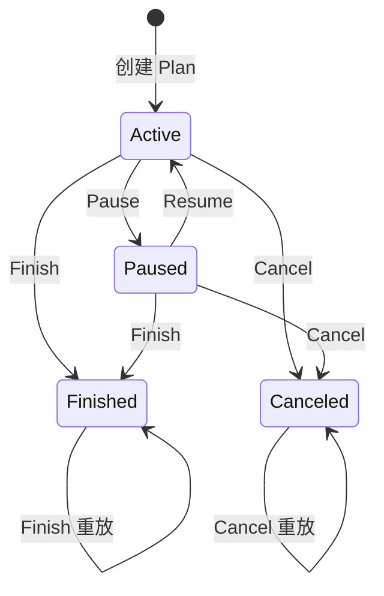
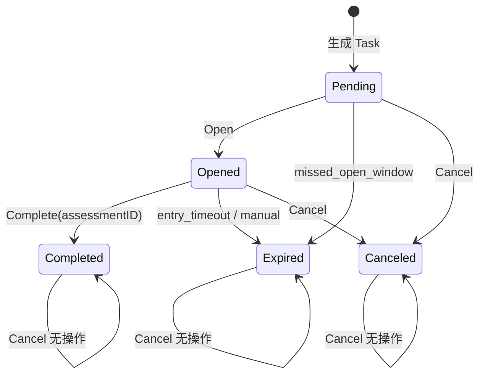
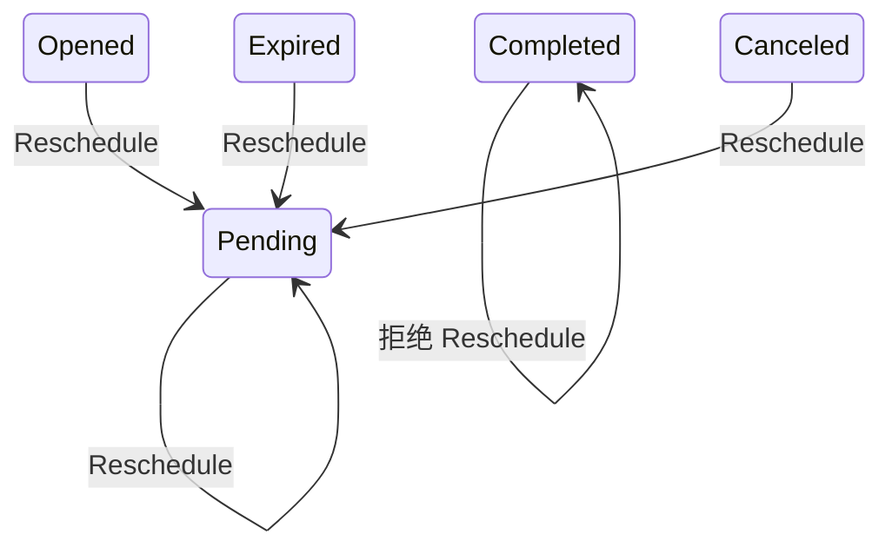

# 核心设计：状态、幂等与数据一致性

> 状态：**已按当前源码重写**。本文严格区分已实现契约、当前最终一致性行为和尚未完成的设计目标。周期展开算法见[《周期策略与任务生成》](./20-核心设计-周期策略与任务生成.md)；调度、入口和提醒的运行细节在后续文档展开。

## 1. 本文回答

本文重点回答：

- AssessmentPlan 和 AssessmentTask 为什么需要两套状态机；
- `finished`、`completed` 和“所有任务已完成”为什么不是同一件事；
- 暂停、恢复、结束、取消、开放、完成和过期的合法迁移是什么；
- 哪些命令可以安全重放，哪些重放会返回冲突；
- `(plan_id, testee_id, seq)` 与 `assessment_id` 唯一约束分别保护什么；
- `version` 列当前是否真的实现了乐观锁；
- Plan 和多条 Task 一起变更时，当前事务边界在哪里；
- Task 状态和 `task.*` 事件之间是强一致还是 best-effort；
- Assessment 已创建但 Task 未完成时，系统能否可靠收敛；
- 并发 Open、Complete、Expire 与 Plan 状态变更存在哪些竞态窗口。

## 2. 30 秒结论

Plan、Enrollment、Task 有独立状态机。加入/终止、Plan pause/finish/cancel/resume 及 Task 终态关闭均由生产 MySQL Runner 保护本地组合写。
Open 使用 pending+schedule_revision 条件写；Resume 显式清除历史字段并以旧 revision 比较更新。
这些已实现机制不意味着所有终态竞争都具有同一 CAS，也不意味着跨 Mongo/MySQL 的 AnswerSheet→Assessment→Task 回写形成端到端事务。

Task 表是生命周期真值；提醒开关开启时开放与提醒意图同事务，关闭时旧 task.opened 仍是保存后 best_effort。
Journey 的 Task completion 仍记录错误后返回成功，持久履约补偿与终态并发仍是待治理边界。

## 3. 先把三个概念分开

### 3.1 状态机不等于幂等

状态机判断“从当前状态能不能执行这个命令”。例如：

```text
opened Task --Complete--> completed Task
pending Task --Complete--> 拒绝
```

幂等判断“同一命令重复执行是否返回同一业务结果”。例如，Task 第一次使用 Assessment 9001 完成后，再次提交相同 `(task_id, assessment_id)`：

- 从状态机看，Task 已不是 opened；
- 从业务幂等看，它其实可以被解释为“相同完成事实已成立”。

当前代码只执行前一层判断，所以重复 Complete 会失败。这不是状态机错误，而是命令幂等语义还未补齐。

### 3.2 幂等不等于并发安全

“先查 active Enrollment，没有再创建”能让串行重试幂等，但两个请求可能同时查到“没有”。因此数据库使用 active Enrollment 唯一约束拒绝第二轮 active 记录，并以 `(enrollment_id, seq)` 唯一键保护本轮 Task。

反过来，唯一键只能防止重复事实，不会自动把失败方转换为幂等成功响应。当前同 startDate 的并发 Enroll 在 active 唯一冲突后回读并对账为幂等成功；不同 startDate 明确冲突。

### 3.3 事务原子性不等于跨模块最终一致

暂停 Plan 需要同时改 Plan 和多条 Task；这些记录都在 MySQL，适合使用本地事务保护。

AnswerSheet 创建 Assessment 后再完成 Task，则跨越 Survey/Evaluation 与 Plan 应用边界；即使都在同一 MySQL，也需要考虑业务耦合、重放入口和补偿。
这一层通常应由“可靠事件 + 幂等消费 + 调和”完成，而不是把所有模块硬塞进一个长事务。

## 4. AssessmentPlan 状态机

### 4.1 状态语义

| 状态 | 业务语义 | 是否允许新患者加入 | 调度器对其 Task 的态度 |
| --- | --- | --- | --- |
| `active` | Plan 正常运行 | 允许 | 可开放到期 pending Task |
| `paused` | 暂时停止，未完成 Task 应被取消，以后可恢复 | 不允许 | 扫到非 active 父 Plan 时取消 Task |
| `finished` | 管理员手动结束此计划 | 不允许 | 不再推进 Task |
| `canceled` | 计划已取消，不允许恢复 | 不允许 | 不再推进 Task |

`finished` 是管理命令产生的 Plan 终态，不是“系统检查所有患者 Task 都 completed”后自动推导的状态。一个可复用 Plan 可以同时服务多个患者，因此“某个患者完成全部 Task”也不能直接推导 Plan finished。

### 4.2 状态迁移


```mermaid
stateDiagram-v2
    [*] --> Active: 创建 Plan
    Active --> Paused: Pause
    Paused --> Active: Resume
    Active --> Finished: Finish
    Paused --> Finished: Finish
    Active --> Canceled: Cancel
    Paused --> Canceled: Cancel
    Finished --> Finished: Finish 重放
    Canceled --> Canceled: Cancel 重放
```

不允许的迁移包括：

- finished 不能 Pause、Resume 或 Cancel；
- canceled 不能 Pause、Resume 或 Finish；
- active 不能 Resume；
- paused 不能再 Pause。

`PlanLifecycle.Activate` 对 active 是幂等的，也能把 paused 转回 active；但当前对外 Resume 用例走的是更完整的 `Resume`，因为恢复不仅要改 Plan，还要重置或补齐患者 Task。

### 4.3 状态变更的联动规则

| Plan 命令 | Task 联动 |
| --- | --- |
| Pause | 把该 Plan 下所有 pending/opened Task 取消 |
| Resume | 保留 completed Task；对后续 seq 复用已有非 completed Task 并重置为 pending，缺失则新建 |
| Finish | 把 pending/opened Task 取消，completed/expired/canceled 保持不变 |
| Cancel | 把 pending/opened Task 取消，completed/expired/canceled 保持不变 |

暂停、结束和取消都只联动 pending/opened，因为 completed 是已经发生的履约事实，expired 是已经结束的未履约结果。恢复则是特别语义：它允许 canceled/expired 被重用为 pending，但不允许 completed 被重置。

## 5. AssessmentTask 状态机

### 5.1 五种状态

| 状态 | 核心语义 | 应同时成立的字段事实 |
| --- | --- | --- |
| `pending` | Task 已安排，尚未开放 | `planned_at` 已确定，入口与完成字段为空 |
| `opened` | Task 已生成填写入口 | `open_at`、`expire_at`、`entry_token`、`entry_url` 已设置 |
| `completed` | 一次 Assessment 已履约此 Task | `completed_at` 和 `assessment_id` 已设置 |
| `expired` | 错过开放窗口，或 opened 入口到期/人工终止 | `expired_at` 和 `expiration_reason` 已设置 |
| `canceled` | Task 被 Plan 命令取消 | `canceled_at` 已设置 |

这些“应同时成立”的规则由领域方法写入，当前数据库没有 CHECK 约束验证状态与时间/关联字段组合。仓储映射也可以直接恢复任意字符串状态，所以数据库异常数据不会在读取时被强制拒绝。

### 5.2 普通运行状态机


```mermaid
stateDiagram-v2
    [*] --> Pending: 生成 Task
    Pending --> Opened: Open
    Pending --> Expired: missed_open_window
    Opened --> Completed: Complete(assessmentID)
    Opened --> Expired: entry_timeout / manual
    Pending --> Canceled: Cancel
    Opened --> Canceled: Cancel
    Completed --> Completed: Cancel 无操作
    Expired --> Expired: Cancel 无操作
    Canceled --> Canceled: Cancel 无操作
```

### 5.3 Resume 引入的特例迁移

`TaskStatus.IsTerminal()` 把 completed、expired、canceled 都称为终态，但这里的“终态”只是普通 Task 生命周期的终态。Plan Resume 使用 `Reschedule` 时：


```mermaid
stateDiagram-v2
    Pending --> Pending: Reschedule
    Opened --> Pending: Reschedule
    Expired --> Pending: Reschedule
    Canceled --> Pending: Reschedule
    Completed --> Completed: 拒绝 Reschedule
```

Reschedule 会：

- 替换 `planned_at`；
- 重新计算 `due_at`；
- `schedule_revision` 递增并记录 `schedule_defined_at`；
- 把 status 设为 pending；
- 清空 open/expire/completed/expired/canceled 时间和 expiration reason；
- 清空 assessmentID、entryToken 和 entryURL；
- 不生成独立领域事件。

Resume 在同一事务内先锁定 Plan 和待复用 Task，再原子保存 Plan active 与全部重排结果。重排 Task 使用专用全字段更新，把 nil/空值显式写入数据库，并以旧 `schedule_revision` 为 CAS 条件；任一更新失败会回滚整个 Resume。

因此，文档不应简化为“expired/canceled 永远不可变”。更准确的说法是：

> completed 是不可逆的履约事实；expired/canceled 在普通生命周期中结束，但可在 Plan Resume 语义下复用同一 Task 身份并重新安排。

### 5.4 状态迁移时间的完整性

Task 已持久化 `planned_at`、`due_at`、`schedule_defined_at`、`open_at`、`expire_at`、`completed_at`、`expired_at` 和 `canceled_at`。
Plan 自身的 paused/finished/canceled 时间仍没有独立业务列。`task.*` 事件是通知与集成信号，Task 表才是状态和时间真值。

## 6. 当前命令幂等矩阵

### 6.1 Plan 命令

| 命令 | 首次成功后重放 | 当前结果 | 能否修复首次的部分保存 |
| --- | --- | --- | --- |
| CreatePlan | 重复请求无业务幂等键 | 可能再创建一个 Plan | 不适用 |
| PausePlan | Plan 已 paused | 拒绝，因为不再是 active | 首次事务失败整体回滚；已成功重放按状态拒绝 |
| ResumePlan | Plan 已 active | 拒绝，因为不再是 paused | 首次事务失败会整体回滚，可安全重试；首次已成功则无需补齐 |
| FinishPlan | Plan 已 finished | 返回成功、不再返回 Task | 首次事务失败整体回滚；已成功同终态短路 |
| CancelPlan | Plan 已 canceled | 返回成功、不再返回 Task | 首次事务失败整体回滚；已成功同终态短路 |

这里的重要结论是：

> **“重复请求不报错”不等于“命令具有可收敛幂等性”。**

Finish/Cancel 对同终态重放短路。当前事务已排除本用例正常执行时的部分提交；外部旁路/历史脏数据仍需审计，不能依赖短路命令自动修复。

### 6.2 Enrollment 命令

| 场景 | 当前结果 |
| --- | --- |
| 首次 Enroll | 同事务创建 active Enrollment 和全部期望 Task |
| 相同 Plan/Testee/startDate 串行重放 | 返回 active Enrollment 与本轮 Task，`Idempotent=true` |
| 相同 Plan/Testee 但 startDate 不同 | 与 active Enrollment 冲突并拒绝 |
| 两个首次 Enroll 并发 | active 唯一约束拒绝一方；相同 startDate 回读为幂等成功 |
| TerminateEnrollment 串行重放 | 第一次事务终止 active round；之后无 active，空操作成功 |
| 终止后再次 Enroll | 创建 round+1 和新的 Task 集合 |

Enrollment 的幂等身份来自持久化 `enrollment_id` 与 active 唯一约束；Task 的 seq 只在同一 Enrollment 内唯一。

### 6.3 Task 命令

| 命令 | 允许的起始状态 | 重放语义 |
| --- | --- | --- |
| OpenTask | pending | 已 opened 后重放失败 |
| CompleteTask | opened | 已 completed 后即使 assessmentID 相同也失败 |
| ExpireTask | 按原因检查 pending/opened 与窗口 | 已 expired 后普通重放不重新迁移 |
| CancelTask | 任意 | pending/opened 转 canceled；任意终态返回成功且不变状态 |
| Reschedule | 任意非 completed | 重置为 pending 并推进 schedule_revision；用外层 Resume 事务与预期 revision 保护 |

Task Complete 的理想命令语义应是：

```text
opened + assessment=9001
  -> completed(9001)

completed(9001) + assessment=9001
  -> 幂等成功

completed(9001) + assessment=9002
  -> 业务冲突
```

当前只实现了第一个分支。这会影响 Worker 重放、超时重试和后续补偿工具对“已经完成”的识别。

## 7. 数据库保护的业务不变式

### 7.1 Task 业务身份唯一

```text
UNIQUE(plan_id, testee_id, seq)
```

它保护：

> 同一患者在同一 Plan 时间轴中，第 N 个应测位置只有一条 Task。

这个唯一键保护的是“序号位置”，不保护两个不同 seq 拥有相同 `planned_at`。例如 fixedDates 当前只禁止倒序，没有禁止相同日期重复；这会得到两条 seq 不同但 plannedAt 相同的合法 Task。

### 7.2 一个 Assessment 不能完成多个 Task

```text
UNIQUE(assessment_id)
```

MySQL 允许多个 NULL，所以不影响 pending/opened Task；一旦设置 assessmentID，同一 Assessment 不能被另一条 Task 重复占用。

它不保证：

- assessmentID 指向的 Assessment 真实存在；
- Assessment 的 orgID/testeeID/modelCode 与 Task 一致；
- completed Task 一定有 assessmentID；
- assessmentID 已归属该 Plan 而不是 adhoc 测评。

原因是当前 schema 没有 Plan/Task/Assessment 之间的外键或跨表 CHECK，这些组合语义依赖应用服务。

### 7.3 没有数据库约束的不变式

当前下列规则只存在于 Go 领域代码：

- Plan status 必须是 active/paused/finished/canceled；
- Task status 必须是 pending/opened/completed/expired/canceled；
- completed 必须有 completedAt 和 assessmentID；
- opened 必须有入口与截止时间；
- Task.orgID/scaleCode 必须与父 Plan 一致；
- seq 必须属于 Plan 当前周期序列。

这并不意味着必须为每条规则都加 SQL CHECK，但必须承认：运维脚本、历史迁移或绕过领域层的写入可以制造领域不可解释数据，因此需要定期一致性审计。

## 8. 条件写与 version 的真实边界

### 8.1 Open 与 Reschedule

Open 更新包含公司、pending、schedule_revision、open_at IS NULL 条件，原子 version+1；受影响行不是1返回冲突。
Resume 使用 `SaveRescheduled` 的 map 更新，把入口、Assessment、全部终态时间和 reason 显式清空，旧 schedule_revision 是比较条件。
GORM struct 跳过零值的旧风险已在这条生产路径解决。

### 8.2 尚未覆盖的并发

completed/expired/canceled 仍走通用 UpdateAndSync，不能从 Open 的 CAS 推断这些分支也使用同样的预期状态/version。
Complete 与过期、Cancel 与完成、Plan 生命周期与并发单 Task 写需要逐分支数据库竞争测试及条件写证明。
业务唯一键防止一个 Assessment 完成多个 Task，但不能代替状态迁移比较更新。

## 9. 当前持久化与事务边界

| 用例 | 同一事务保护的事实 | 返回失败条件 |
| --- | --- | --- |
| Enroll | active Enrollment 与本轮新 Task | 任一插入/对账失败 |
| TerminateEnrollment | 本轮取消 Task 与 terminated Enrollment | 任一步保存失败 |
| Pause/Finish/Cancel | Plan、待取消 Task、轮次终止/关闭 | 任一写失败；不再只记录日志继续成功 |
| Resume | 锁定 Plan/Task，Plan active 与全部新建/重排 Task | 任一保存或 revision 冲突 |
| Task terminal | Task 与本 Enrollment 全终态关闭检查 | 任一写失败 |
| Open，提醒开关启用 | 获胜 Task 开放与 reminder requested 意图 | CAS 或 Outbox staging 失败 |
| Open，提醒开关关闭 | Task 本地保存 | SQL 失败；随后发布失败不回滚 |

生产 `container/modules/plan/assemble.go` 供应真实 MySQL Runner、生命周期 Enrollment repository 和 Task repository。
测试/兼容构造器省略依赖的后备路径不能用于描述生产事务边界；借用外层事务的用例不得隐式提前提交。
后台 Operator 命令的归属锁与内层命令共同参与调用者事务，普通 best_effort 通知在最外层提交后发送。

## 10. Task 事件与提醒责任

task.opened/completed/expired/canceled 是生命周期通知，MySQL Task 是状态真值。
启用 task_opened_reminder 后，新开放保存 task.opened.reminder.requested durable intent；其 SDK 发布责任与逐收件业务结果分开。
关闭开关仅停止新意图，不自动撤回以前意图。完整分流、未知结果和原意图恢复见[调度、入口与提醒](./23-核心设计-任务调度、入口与提醒.md)。
AssessmentPlan 仍不在当前事件目录注册独立 lifecycle event；不能把一个 aggregate.events 字段写成已存在传播协议。

## 11. Assessment 与 Task completed 的跨模块一致性

同步 Task 来源在 Survey durable 受理前校验 Task/Enrollment 的 org、Testee、实时窗口与 model code，冻结 AttributionSnapshot。
因此无效显式来源不会继续按“合法 AnswerSheet 再事后判定”受理。打开入口的许可在提交时继续核验。

Worker/Journey 随后以答卷身份幂等创建/提交 Assessment，再尽力 CompleteTask；completePlan 的失败只记 warning。
已存在 Assessment 的重放可能再次尝试完成，但没有保证每个未完成 Task 都会被持久调和的独立责任记录。
入口、受理和完成之间可发生终止/过期；已受理答卷不会因 Task 后续不匹配被删除。

## 12. 租约与典型竞争

PlanRunner leader lease 保护一轮调度，不保护全部管理/内部命令。数据库 Open CAS 解决重复开放，重排 revision CAS 解决 stale schedule 写。
Complete/Expire/Cancel 及模板生命周期竞争仍分别证明；“所有操作都在事务中”也不能排除丢失更新。

## 13. 当前不变量与后续目标

- 本地组合状态保存失败不返回成功；测试保护 nth-save 回滚，而不是只验证正常成功。
- 一个 Enrollment 内 seq 唯一，一次 Assessment 最多归属一个 Task。
- Open/Reschedule 的输家不得覆盖赢家；其它终态要补同等条件更新证据。
- 业务受理成功、Assessment 已提交和 Task completed 是三个完成点。
- 可靠提醒意图、Broker confirmed、微信 confirmed 和用户收到分开；供应商结果未知禁止自动重发。
- 后续履约调和以固定业务身份和幂等终态判定为基础，不能通过重建/换绑历史答卷修复。

## 14. 一致性审计

检查 Plan 状态与非终态 Task、active Enrollment 与 Task 公司/主体/Plan 一致性、revision 时间与终态时间、Assessment 关联唯一性。
已过实时入口窗口但仍 opened 是扫描滞后，准入仍必须拒绝；due cohort 与实际 entry expiry 是两个独立口径。
审计按固定机构/ID/时间水位只读分类，修复另行授权，不能从一条 warning 或 published 行推断业务事实缺失。

## 15. 验证边界

`resume_transaction_test.go`、`task_reschedule_repository_test.go`、`task_open_cas_mysql_test.go`、`task_open_intent_mysql_test.go`
分别保护 Resume 原子性、显式清空、数据库开放竞争和提醒意图事务。
MySQL 专项需隔离数据库真实执行；普通 Go 测试可能跳过环境用例，不能把 exit0 当成执行了数据库故障演练。
未逐项证明的 terminal CAS、持久履约补偿、生产 Scope 切换、Broker/微信故障与容量仍保留在风险清单。

## 16. 与后续文档的分工

| 文档 | 继续展开的问题 |
| --- | --- |
| 《测评引用与版本语义》 | scaleCode 为什么只锁定模型族，不锁定发布版本 |
| 《任务调度、入口与提醒》 | PlanRunner lease、扫描窗口、入口生成、提醒送达与背压 |
| 《计划创建、患者加入与终止》 | 管理命令的传输、授权、校验和保存调用链 |
| 《从任务开放到测评履约》 | taskID 如何进入 AnswerSheet，Assessment 如何归因并回写 Task |
| 《设计问题与重构清单》 | 优先级、改造分阶段、数据修复和验收标准 |

## 17. 代码导读

| 主题 | 当前事实源 |
| --- | --- |
| Plan/Task 状态枚举 | [`domain/plan/types.go`](../../../internal/apiserver/domain/plan/types.go) |
| Plan 状态迁移 | [`domain/plan/plan_lifecycle.go`](../../../internal/apiserver/domain/plan/plan_lifecycle.go) |
| Task 状态迁移 | [`domain/plan/task_lifecycle.go`](../../../internal/apiserver/domain/plan/task_lifecycle.go) |
| Task 实体、时间与事件 | [`domain/plan/assessment_task.go`](../../../internal/apiserver/domain/plan/assessment_task.go) |
| Enrollment 对账与终止 | [`domain/plan/plan_enrollment.go`](../../../internal/apiserver/domain/plan/plan_enrollment.go) |
| Plan 暂停/结束/取消保存顺序 | [`application/plan/lifecycle_transition_workflow.go`](../../../internal/apiserver/application/plan/lifecycle_transition_workflow.go) |
| Resume 保存顺序 | [`application/plan/lifecycle_service.go`](../../../internal/apiserver/application/plan/lifecycle_service.go) |
| Enrollment 保存顺序 | [`application/plan/enrollment_service.go`](../../../internal/apiserver/application/plan/enrollment_service.go) |
| 单 Task 命令 | [`application/plan/task_management_service.go`](../../../internal/apiserver/application/plan/task_management_service.go) |
| 调度状态迁移 | [`application/plan/task_scheduler_service.go`](../../../internal/apiserver/application/plan/task_scheduler_service.go) |
| Task → Assessment 解析 | [`application/plan/task_assessment_resolver.go`](../../../internal/apiserver/application/plan/task_assessment_resolver.go) |
| Assessment → Task best-effort 完成 | [`assessmentintake/service.go`](../../../internal/apiserver/application/journey/assessmentintake/service.go) |
| Plan/Task PO 与 version | [`infra/mysql/plan/po.go`](../../../internal/apiserver/infra/mysql/plan/po.go) |
| 仓储保存逻辑 | [`infra/mysql/plan`](../../../internal/apiserver/infra/mysql/plan/) |
| 通用 MySQL 更新逻辑 | [`internal/pkg/database/mysql/base.go`](../../../internal/pkg/database/mysql/base.go) |
| 唯一约束 | [`migrations/mysql`](../../../internal/pkg/migration/migrations/mysql/) |
| Task 事件 delivery | [`configs/events.yaml`](../../../configs/events.yaml) |
| 事件发布语义 | [`application/eventing/publish.go`](../../../internal/apiserver/application/eventing/publish.go) |

建议验证：

```bash
go test ./internal/apiserver/domain/plan
go test ./internal/apiserver/application/plan
go test ./internal/apiserver/infra/mysql/plan
go test ./internal/apiserver/application/journey/assessmentintake
go test ./internal/apiserver/runtime/scheduler
make docs-hygiene
make docs-facts
```

上述本地验证可以保护状态机、链接和部分契约；并发冲突、事务故障注入、Redis lease 与通知送达仍需真实依赖环境验证。
