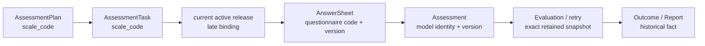
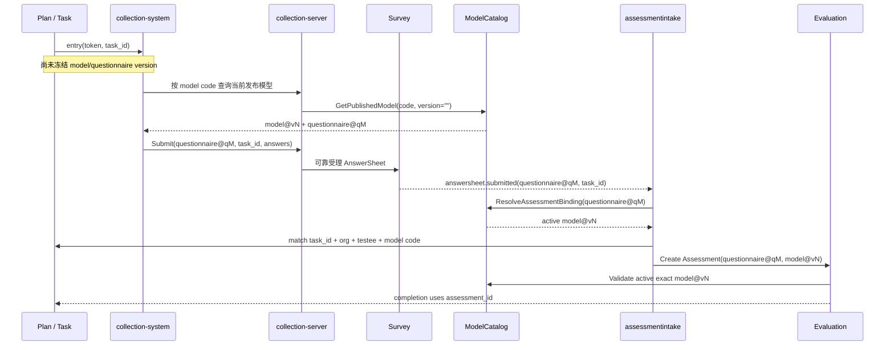

# 核心设计：测评引用与版本语义

> 状态：**已按当前源码重写**。本文区分已确认的业务选择、当前已实现的版本冻结机制和尚未闭环的接入契约。ModelCatalog 自身的联合发布、active/retained 快照和模型演进规则，见 [ModelCatalog：问卷绑定与发布版本](../20-model-catalog/22-核心设计-问卷绑定与发布版本.md)。

## 1. 本文回答

本文重点回答：

- `scale_code` 指向 Questionnaire、AssessmentModel，还是一个更稳定的测评模型族；
- Plan 和 Task 为什么只保存 code，而不保存 model version、questionnaire version 或 Algorithm；
- “每次任务使用最新发布版本”的“每次”和“最新”到底发生在哪个时刻；
- Task 创建、Task 开放、客户端加载问卷和 AnswerSheet 提交之间，哪一步真正冻结版本；
- Questionnaire 版本和 AssessmentModel 版本为什么必须成对理解；
- 新版本发布后，为什么可以改变未来 Task，却不能改变已完成的测评与报告；
- 同一患者的趋势为什么可能跨越多个发布版本，以及这对 Factor 稳定性意味着什么；
- 模型下架、任务已开放后发布新版、客户端持有旧问卷等边界怎样处理；
- 当前代码已经保护了哪些不变式，又有哪些只是目标设计。

## 2. 30 秒结论

Plan 中的 `scale_code` 不是一个发布快照引用，而是一个**测评模型族的业务身份**。

它表达的是：

> 这个患者在该随访周期中，需要持续完成 code 为 X 的医学量表测评。

它不表达：

> 这个患者在未来数周或数月的所有任务，都必须永久使用今天的 model v12 和 questionnaire v2.0.1。

因此，当前版本语义是：

1. 创建 Plan 时，校验 `scale_code` 当下是一个可执行的 active scale model；
2. Plan 和由它生成的 Task 只保存同一个 `scale_code`，不冻结发布版本；
3. Task 创建和开放都不会解析 model/questionnaire version；
4. 一次新作答应该从该 code 的当前 active release 进入；
5. 客户端加载时会看到精确的 model version 与 questionnaire version，但这一选择直到 AnswerSheet 持久化前都不是服务端耐久事实；
6. AnswerSheet 冻结精确 Questionnaire ref，Assessment 冻结精确 AssessmentModel ref；
7. Worker 执行、重试和历史重放必须按精确 retained version 读取，不能再追随 latest；
8. 新版本可以影响未来尚未冻结的 Task，不能改写已受理的 AnswerSheet、Assessment、Outcome 和 Report。

这可以概括为：

> **Plan 用 code 表达持续测评意图；AnswerSheet 和 Assessment 用精确版本表达已发生的测评事实。在准入之前晚绑定，在受理之后严格冻结。**



## 3. 先分清四种身份

“一种测评”在系统中不是只有一个 version。如果把下面四种身份混在一起，Plan 的版本设计会显得模糊且矛盾。

### 3.1 Model code：测评模型族身份

例如：

```text
SNAP-IV-PARENT
BRIEF2-PARENT
```

Model code 识别的是一条可持续演进的测评产品线，而不是某一次发布内容。在 ModelCatalog 中：

- `AssessmentModel` head 是可编辑的工作头；
- `AssessmentSnapshot` 是一次不可变发布快照；
- 多个 AssessmentSnapshot 可以共用同一 model code，但拥有不同 release version。

Plan 要表达的正是这一层长期身份。

### 3.2 Model release version：一次模型发布身份

Model release version 由系统根据 AssessmentModel revision 维护，如 `v12`。它冻结：

- kind / sub-kind；
- algorithm binding；
- Questionnaire code/version；
- Factor、Norm ref、Decision 等 DefinitionV2 内容；
- 发布当时的其他运行元数据。

它是执行、重试和审计需要的强身份，但不是 Plan 周期策略的身份。

### 3.3 Questionnaire code/version：题目与作答语义

Questionnaire code 识别问卷资产，Questionnaire version 冻结：

- 当时展示了哪些题目；
- 题目类型、选项和答案值是什么；
- ShowController 与校验规则是什么；
- 单题基础分怎样派生。

AnswerSheet 如果只保存 questionnaire code，日后就无法确定答案值的原始语义。因此它必须保存 code/version 对。

### 3.4 Task identity：一次应履约义务

Task 的身份不是模型版本，而是：

```text
plan_id + testee_id + seq
```

它表达：

> 某患者在某 Plan 中第 N 次应完成这种测评。

Task 关心的是应测时间、开放时间、履约状态和最终 Assessment，而不是将整份测评执行规格复制到 Plan 表中。

## 4. `scale_code` 究竟指向什么

### 4.1 它不是 Questionnaire code

当前 `publishedScaleCatalog` 使用：

```text
FindPublishedModelByCode(KindScale, scaleCode)
```

返回的是 ModelCatalog 的 active `AssessmentSnapshot`，而不是 Survey Questionnaire。创建 Plan 时还会要求：

- 返回模型的 kind 是 `scale`；
- `DefinitionV2` 不为空。

因此，Plan API 和表结构中的 `scale_code` 在当前实现中实际上是：

> **ModelCatalog 中 `KindScale` 测评模型的 model code。**

如果把它误解为 questionnaire code，会丢失 ModelCatalog 对 Algorithm、Factor、Norm 和 Decision 的统一组装职责。

### 4.2 它也不是 AssessmentSnapshot ref

完整的 AssessmentSnapshot ref 至少包含：

```text
kind + sub-kind + algorithm + code + version
```

Plan 只保存 `scale_code`，没有 version、algorithm 和 questionnaire ref。因此不能把 Plan 的引用写成“已冻结模型快照”。

### 4.3 `scale` 既是历史命名，也是当前真实限制

`scale_code` 有两层含义：

1. 它保留了 Plan 最初服务医学量表随访的业务语言；
2. 它不只是命名债务：当前校验确实固定使用 `KindScale`。

也就是说，当前 Plan 尚不能直接安排：

- typology 人格测评；
- behavioral_rating 行为评定；
- cognitive 认知测验。

未来如果要求 Plan 支持多模型类型，需要从 API、领域对象、MySQL 表结构、查询条件和事件上下文一起演进为 `model_kind + model_code`，不是只改一个字段名。

## 5. 为什么 Plan 只保存 code

### 5.1 Plan 的生命周期通常长于一个发布版本

一个随访 Plan 可能持续数周或数月。运营在此期间可能：

- 修正问卷文案或选项；
- 微调单题映射、Factor 或 Decision；
- 发布新的 Questionnaire version 和 AssessmentModel release；
- 下架存在严重配置问题的发布版本。

如果 Plan 在创建时就锁定当时版本，那么即使旧版本已经被运营替换，未来仍未开始的 Task 也会继续引导患者使用旧规则。

当前业务选择是：

> Plan 保留稳定的测评 code，未来作答自然跟随当时 active release。

### 5.2 Task 是履约义务，不是执行规格

Task 需要回答：

- 谁要做；
- 第几次做；
- 什么时候应该做；
- 是否已开放、完成或过期；
- 最终由哪个 Assessment 履约。

它不应复制：

- Questionnaire 快照；
- DefinitionV2；
- Algorithm 参数；
- Norm 资产；
- Decision 规则。

这些内容属于 ModelCatalog 的发布快照，而不是 Plan 聚合的一部分。

### 5.3 业务已接受的前提

项目选择晚绑定，并不是认为任意模型变更都可以无感混用。它基于当前业务事实：

- 量表 Factor 在稳定期很少增减；
- 因子结构的调整主要发生在刚开始配置和验证阶段；
- 发布新版的主要目的是让未来测评使用经过修正的有效配置；
- 已完成结果仍保留当时版本，可以审计和解释。

这一前提会在趋势分析中转化为对 Factor identity 的兼容性要求，见第 12 节。

## 6. 当前数据实际保存了什么

| 业务事实 | 模型引用 | 问卷引用 | 是否冻结版本 | 主要用途 |
| --- | --- | --- | --- | --- |
| AssessmentPlan | `scale_code` | 无 | 否 | 长期随访意图 |
| AssessmentTask | `scale_code` | 无 | 否 | 某患者第 N 次履约义务 |
| Task entry | 无 | 无 | 否 | `token + task_id` 填写入口 |
| `task.opened` | 无 | 无 | 否 | 提醒通知上下文 |
| C 端 ModelResponse | `code + version + identity` | `code + version` | 响应时精确 | 展示可执行模型与加载精确问卷 |
| AnswerSheet | 无 | `code + version` | 是 | 不可含混的作答事实 |
| `answersheet.submitted` | 无 | `code + version` | 是 | 异步测评准入 |
| Assessment | `kind + sub-kind + algorithm + code + version + title` | `code + version` | 是 | 测评执行身份 |
| Evaluation Outcome | `kind + code + version` 等 | 通过 Assessment 可追溯 | 是 | 执行结果事实 |
| InterpretReport | 通过 Assessment/Outcome 可追溯 | 通过 Assessment 可追溯 | 是 | 报告成品与审计 |

这张表显示了两个不同的边界：

```text
Plan / Task
  = admission pointer
  = 未来要发生什么

AnswerSheet / Assessment / Outcome / Report
  = execution fact
  = 当时究竟发生了什么
```

## 7. “最新版本”不是一个模糊时刻

既然 Plan 只保存 code，就必须说清楚 latest 在哪里解析。当前链路中至少有五个可能的时刻，它们的语义不同。

### 7.1 Plan 创建时：只做可用性准入

`CreatePlan` 通过 `ScaleCatalog.ExistsByCode` 读取当前 active scale model，并要求 `DefinitionV2 != nil`。

这一步保护的是：

> 创建这个随访 Plan 时，系统中确实存在一个可执行的 active scale model。

它不保护：

> 创建当时返回的发布版本，将成为该 Plan 所有 Task 的永久版本。

当前 `validateScale` 在 `ScaleCatalog == nil` 时会直接跳过校验。正常装配会提供 published catalog，但这也意味着“创建必然校验 active model”还依赖正确组装，不是 Plan 领域对象自足的不变式。

### 7.2 Task 生成时：复制 code，不解析版本

`TaskGenerator` 把 Plan 的 `scaleCode` 原样写入每个 AssessmentTask。生成结果没有：

- model version；
- questionnaire code/version；
- algorithm；
- snapshot ID。

因此，即使患者在 model v12 上线时加入 Plan，一次生成了未来 12 个 Task，这 12 个 Task 也没有被锁定到 v12。

### 7.3 Task 开放时：生成入口，仍不解析版本

`entryGenerator.GenerateEntry` 当前只做三件事：

1. 生成 UUID token；
2. 组装 `{baseURL}?token=...&task_id=...`；
3. 把过期时间设为开放后 7 天。

这一步不读 ModelCatalog，入口 URL 也不包含 scale code、model version 或 questionnaire version。

`task.opened` 事件也只携带：

- taskID；
- planID；
- testeeID；
- entryURL；
- openAt。

因此，不能在文档中写成“Task 开放时已锁定最新版本”。

### 7.4 客户端加载时：得到精确发布内容

collection-server 的 ModelCatalog 查询在 version 为空时会返回 code 当前可见的 active model，响应中包含：

- model `code + version`；
- kind / sub-kind / algorithm；
- `questionnaire_code + questionnaire_version`；
- DefinitionV2。

客户端随后可以按精确 questionnaire version 加载题目。从用户体验角度，这是“本次开始填写什么”的选择时刻。

但它仍然只是一次查询响应，不是 qs-server 中的耐久事实。如果用户加载后关闭小程序且没有提交，服务端不会保存一份“Task 已选择 v12”的记录。

### 7.5 AnswerSheet 受理与 Assessment 准入：耐久冻结

collection-server 的对外提交 DTO 要求客户端传入 questionnaire code/version。apiserver 内部提交服务也兼容 version 为空的调用，此时它会解析当前 published questionnaire 并回填精确 version。

无论 version 是客户端提供还是服务端解析，真正持久化的 AnswerSheet 都保存精确 QuestionnaireRef。这是问卷版本的**第一个服务端耐久冻结点**。

随后 `assessmentintake` 使用这对精确 questionnaire code/version 解析当前 active AssessmentSnapshot，并将精确模型身份写入 Assessment。这是模型版本的**耐久冻结点**。

所以，“每次 Task 使用最新版本”更精确的说法是：

> Task 本身不锁版本；每次新作答在进入测评准入时，必须与当前 active 问卷—模型发布对一致，一旦受理则冻结精确版本。

## 8. 当前主链中的版本冻结



这条链有三层防线。

### 8.1 Survey 保护问卷作答语义

Survey 在提交时：

- 读取精确 QuestionnaireSnapshot；
- 验证问卷是可提交状态；
- 根据该版本的题目、类型、选项、ShowController 和校验规则校验整份答卷；
- 把精确 questionnaire code/version 写入 AnswerSheet；
- 在可靠受理事务中一起生成 Outbox。

因此，后续即使问卷发布了新版，也不能用新题目重新解释旧 AnswerSheet。

### 8.2 ModelCatalog 保护新测评准入

`ResolveAssessmentBinding(questionnaireCode, questionnaireVersion)` 只从 active published AssessmentSnapshot 中查找绑定。它回答：

> 这份精确问卷在当前是否属于一个允许新测评进入的 active model release？

如果匹配，返回的 Ref 包含精确 model version，而不是只返回 code。

### 8.3 Evaluation 再次保护精确模型与问卷成对

Evaluation Intake 在创建带 model ref 的 Assessment 时：

- 要求 model version 不为空；
- 通过 `GetActivePublishedModelByRef` 读取这个精确 active snapshot；
- 验证 snapshot 绑定的 questionnaire code/version 与 Assessment 中的精确 QuestionnaireRef 一致；
- 将 questionnaire ref 和完整 model ref 写入 MySQL `assessment`。

这可以防止：

```text
AnswerSheet = questionnaire q2
Assessment  = model v1 binding questionnaire q1
```

这种并不属于任何发布事实的拼接组合进入执行。

## 9. Plan 归因不能只看 `task_id`

AnswerSheet 提交上下文可以携带 `task_id`，但服务端不会因为客户端传了一个 TaskID 就直接将测评归入该 Plan。

`ResolveTaskByIDForAssessment` 还会校验：

- taskID 格式正确；
- Task 存在；
- Task 与 AnswerSheet 处于同一 org；
- Task 的 testeeID 与 AnswerSheet 一致；
- Task 当前处于 opened；
- Questionnaire 已解析出 model code；
- Task.scaleCode 与该 model code 相同。

其中最后一条就是 Plan 与版本链路的连接点：

```text
Task.scale_code
    == active AssessmentSnapshot.code
    bound by AnswerSheet.questionnaire_code/version
```

这一判断不要求 Task 和 Assessment 版本相同，因为 Task 本来就没有版本；它要求两者属于同一个测评模型族。

如果客户端没有传 taskID，当前还会按 `org + testee + scaleCode + opened` 查找唯一候选 Task。如果同时存在多个候选，会放弃自动归因，避免把一次测评误完成到错误的计划任务。

## 10. 新版本发布会怎样影响 Plan

### 10.1 Plan 创建后、患者加入前发布新版

```text
T0  创建 Plan，当前 active = model v12 / questionnaire q2
T1  运营发布 v13 / q3
T2  患者加入，生成 Task
T3  患者填写
```

预期：T2 生成的 Task 仍只保存 code；T3 新作答使用 v13/q3。

原因：Plan 创建时的 v12 只用于证明该 code 当时可执行，没有被保存为 Plan 契约。

### 10.2 Task 已生成、尚未开放时发布新版

预期：Task 开放后的新作答使用新 active release。Task 不需要被批量更新，因为它从未保存旧 version。

这是 code 晚绑定的直接价值：发布新版不需要修改每一个未来 Task。

### 10.3 Task 已开放、用户尚未加载时发布新版

预期：用户之后进入时使用新 active release。

原因：Task open 只生成入口，没有冻结版本。已开放不等于已开始一次有版本的测评会话。

### 10.4 用户已加载旧问卷、尚未提交时发布新版

这是当前最值得注意的竞态。

```text
T0  客户端加载 model v12 / questionnaire q2
T1  运营发布 model v13 / questionnaire q3，v12/q2 转 retained archived
T2  客户端提交 questionnaire q2
```

当前 Survey 显式版本提交路径使用 `FindByCodeVersion`，`EnsureSubmittable` 只检查 Questionnaire 的业务 `status=published`，没有同时要求 release status 为 active。因此 q2 作为 retained published snapshot 仍可能被 Survey 受理为一份 AnswerSheet。

但 ModelCatalog 按 questionnaire q2 解析测评绑定时只查询 active AssessmentSnapshot。既然 active 已变为 v13/q3，q2 不会解析出当前 active model，也就不能通过 scaleCode 完成该 Task。

按当前 `assessmentintake` 实现，未绑定的 AnswerSheet 仍可能生成一份不自动提交执行的 pending Assessment，但它不会归因和完成 Plan Task。这与“已打开的作答究竟应该允许完成，还是应要求重新加载 active 版本”之间还没有完整会话契约。

目标语义需要在两种方案中明确选择：

| 方案 | 语义 | 需要的机制 |
| --- | --- | --- |
| 严格 active 准入 | 提交时旧版已 archived，整份拒绝并要求重新加载 | Survey active reader + 客户端过期恢复交互 |
| 会话锁版本 | 用户已在 active 期间开始填写，在有限窗口内允许完成旧版 | 服务端 session/lease、开始时冻结引用、到期策略与审计 |

当前 Plan 没有实现第二种会话对象，Survey 也尚未完整实现第一种 active 版本守卫。因此本文不伪造一个已有的保证。

### 10.5 AnswerSheet 和 Assessment 已受理后发布新版

预期：继续执行已冻结的旧版本，不追随新版。

这里使用的不再是 active reader，而是 exact retained reader：

```text
GetPublishedModelByRef(kind, code, version)
```

只要该历史发布快照被保留，Worker 执行、自动重试、人工补偿和历史重放都应读取同一个精确版本。

这是“新发布不改变历史结果”的真正技术基础。

## 11. active 与 retained 必须拆成两种读语义

### 11.1 active reader 回答“现在允许新测评使用什么”

适用于：

- 创建 Plan 时校验 scale code；
- 客户端按 code 获取当前可执行模型；
- 按精确 questionnaire code/version 建立新 Assessment 绑定；
- Evaluation Intake 检查新 Assessment 的精确 model ref。

ModelCatalog 中对应：

- `FindPublishedModelByCode` 实际返回 active snapshot；
- `FindPublishedModelByQuestionnaire` 使用 active release filter；
- `GetActivePublishedModelByRef` 即使传入精确旧 version，也会拒绝 retained archived release。

### 11.2 retained exact reader 回答“已发生的测评当时用了什么”

适用于：

- 异步 Evaluation 执行；
- 执行失败后重试；
- 已受理事件重放；
- 报告补偿与审计；
- 历史结果解释。

ModelCatalog 中对应 `GetPublishedModelByRef`，要求 version 必填，但允许读取被保留的 archived snapshot。

### 11.3 为什么不能共用一个 `FindPublished`

如果新准入和历史执行共用一个模糊 reader，会产生相反的错误：

- reader 允许 archived：新 Task 可能绕过下架继续使用旧版；
- reader 只允许 active：旧 Assessment 在重试时无法找到当时快照，或被错误替换成新版。

所以正确边界必须是：

```text
admission -> active exact
execution -> retained exact
```

## 12. 跨版本患者趋势

### 12.1 当前业务口径是患者级趋势

同一患者在：

- 门诊扫码；
- 医生一次性发起；
- 不同 Plan；
- 同一 Plan 的不同 Task；

中完成的同种测评，当前业务上进入同一条患者级趋势，没有先分成“同 Plan 趋势”和“跨 Plan 趋势”两种视图。

当前 scale analysis 按 model code 分组，Factor trend 按：

```text
testee_id + factor_code
```

查询。它们没有把 model version 作为趋势分组键。

还要注意一个更宽的当前边界：Factor trend 查询不仅没有 model version，也没有 model code。如果两个不同模型族复用了同一 factor code，同一患者的数据点理论上可能被合并。ScaleAnalysis 的外层 model-code 分组不能替代 FactorTrend 读模型自身的身份约束。因此，趋势查询的长期完整身份至少应重新评估 `model_code + factor_code`，并对 model version 选择“仅追溯”还是“参与分段”。

因此一条趋势完全可能是：

```text
2026-07-01  SNAP@v12  inattentive = 18
2026-07-15  SNAP@v12  inattentive = 15
2026-07-29  SNAP@v13  inattentive = 12
```

每个数据点都可以通过 Assessment 追溯至精确版本，但趋势响应当前不显式携带 model version，也不在版本切换处自动分段。

### 12.2 Factor code 不只是配置字段，而是纵向比较契约

既然趋势按 factor code 聚合，那么在同一 model code 下继续使用同一 factor code，就隐含表示：

- 它仍表示同一个医学或心理维度；
- 它的题目覆盖和计分方式没有发生足以破坏纵向比较的变化；
- 它的分值区间、Norm 或 level 语义仍然可以在报告中向用户解释；
- 新旧数据点可以被放在同一趋势中阅读。

所以，Plan 晚绑定把一部分长期兼容性压力交给了 ModelCatalog 发布治理：

> 发布新版时不仅要问“这份 DefinitionV2 能否执行”，还要问“它是否仍然属于同一条可纵向比较的 model family”。

### 12.3 什么时候不应继续使用同一 model code

如果变更包含下列情况，不应只在同一 code 下无感发布：

- Factor 被替换为不同医学含义，却复用旧 factor code；
- 原始分的标尺或方向发生不兼容变化；
- Norm 更换后与旧结果无法直接比较；
- Decision 的 level 语义完全改变；
- Algorithm 从一种测评机制切换为另一种机制；
- 绑定问卷已经不再是同一问卷族的新版本。

可选处理包括：

1. 创建新 model code，明确分成两条趋势；
2. 在趋势读模型中引入兼容性版本或分段标记；
3. 对结果做经过专业认可的校准和换算，而不是直接混合原始分。

当前代码没有自动做这些判断。因此“Factor 很少变”是当前业务经验，不是可以替代发布治理的技术保证。

## 13. 模型身份连续性与 Plan

为了让一个 Plan 可以长期只持有 model code，同一 model family 需要保持稳定身份。已确认的目标领域规则是：

- 首次发布前，允许更换 Algorithm；
- 首次发布后，同一 model code 不允许更换 Algorithm；
- 首次发布前，允许更换 questionnaire code/version；
- 首次发布后，questionnaire code 固定，只允许发布同一 Questionnaire 的新 version。

这两类规则不只是 ModelCatalog 内部整洁性要求，它们也保护 Plan 的引用语义：

```text
Plan.scale_code = X
```

不应该在一次发布后突然从“使用量表计分”变为“使用完全不同的算法和问卷”。

但必须忠于当前代码：

> **“首次发布后 Algorithm 和 questionnaire code 固定”是已确认的目标不变式，当前 ModelCatalog 尚未基于 retained release history 统一强制。**

`UpdateBasicInfo` 仍允许更新 Algorithm，`BindQuestionnaire` 也没有读取历史 release 阻止首次发布后更换 questionnaire code。因此当前 Plan code 的长期语义仍部分依赖运营管理规范，尚未完全由系统守卫。

## 14. 下架、删除与已存在 Task

### 14.1 创建 Plan 只校验“当时可用”

一个 model code 在 Plan 创建时 active，不代表它在 Plan 的整个生命周期中永远 active。

当前没有代码在模型下架时：

- 暂停引用该 code 的 Plan；
- 取消其未来 Task；
- 向 Plan 记录不可用原因；
- 发布一个可靠的引用失效事件。

因此可能出现：

```text
Plan = active
Task = pending/opened
scale model = no active release
```

这是一个可持久的业务中间态，而不是单次查询失败。

### 14.2 调度器仍会开放 Task

Task 调度和开放当前不会重新校验 ModelCatalog，因此模型已下架时，到期 Task 仍可能：

- 生成入口；
- 转为 opened；
- 发布 `task.opened`；
- 尝试向患者发送提醒。

但患者进入后无法获得可执行 active model。这会产生“收到提醒但无法完成”的用户体验。

### 14.3 历史测评不受影响

下架只应终止新准入，不应删除 retained published snapshot。已冻结 Assessment 仍必须能够：

- 完成异步执行；
- 在失败后按原版本重试；
- 重新生成或查询历史报告；
- 向管理员说明当时使用了什么。

因此“模型不再允许新人使用”和“模型历史快照不存在”是两个完全不同的状态。

## 15. 通知中的测评名称也是晚绑定投影

Task 和 `task.opened` 事件都没有保存 scale title。发送小程序提醒时，通知服务：

1. 按 taskID 重新读取 Task；
2. 获得 Task.scaleCode；
3. 通过 published title resolver 读取当前 active scale title；
4. 读取失败时回退显示 scale code。

所以通知中的名称是一个**当前展示投影**，不是 Task 创建时的历史快照。

这在绝大多数情况下是合理的：运营修正了量表展示名后，后续提醒自然显示新名称。但也不应拿该名称作为“Task 已锁定哪个版本”的证据。

## 16. 当前入口契约并没有闭环版本解析

### 16.1 qs-server 内可以确认的事实

当前 Plan 入口 URL 只包含：

```text
token + task_id
```

collection-server 当前公开的相关查询是：

```text
GET /api/v1/assessment-models/:code
GET /api/v1/questionnaires/:code?version=...
```

它没有在当前 qs-server 代码中暴露一个明确的：

```text
ResolvePlanTaskEntry(task_id, token)
  -> task context
  -> scale code
  -> current active model ref
  -> exact questionnaire ref
```

的 C 端服务契约。

### 16.2 这为什么不只是“前端怎么跳转”

这条解析链还应该保护：

- token 真实存在且未过期；
- taskID 与 token 属于同一个 Task；
- Task 处于 opened；
- 当前用户有权为该 testee 填写；
- scale code 当前有 active model；
- 返回的 model/questionnaire pair 来自同一发布快照；
- 后续提交可以校验仍来自这个入口上下文。

当前 token 只是 Task 中的随机值和 URL 参数，还没有一个服务端验证与解析契约。因此本文可以确认“Plan 的目标是让新作答使用当前 active release”，但不能声称“从 Task 入口到精确问卷的服务端契约已经完整实现”。

该问题将在后续 `23-核心设计-任务调度、入口与提醒.md`、`31-关键链路-从任务开放到测评履约.md` 和 `90-设计问题与重构清单.md` 中分别展开。

## 17. 替代方案与选择

### 17.1 方案 A：Plan 创建时锁定版本

```text
Plan = model code + model version + questionnaire code/version
```

优点：

- 一个 Plan 内所有结果天然来自同一版本；
- 趋势统计的可比较性容易解释；
- 任务打开时不需要再解析 latest。

代价：

- 长周期 Plan 会持续使用已被修正或下架的旧版本；
- 发布安全修正后，需要迁移大量 active Plan 和未来 Task；
- 需要定义下架版本对已存在 Plan 是否例外可用；
- Plan 会与 ModelCatalog 发布快照紧密耦合。

当前业务没有选择该方案。

### 17.2 方案 B：Task 生成或开放时锁定版本

优点：

- 已开放 Task 的填写内容稳定；
- 后续发布只影响未开放 Task；
- 可以清晰定义“一次任务从哪个时刻开始”。

代价：

- 当前患者加入时一次生成全部 Task，如果在生成时锁定，效果几乎等同 Plan 锁版本；
- 如果在 open 时锁定，需要保存快照 Ref，处理开放与发布并发，并定义下架后的准入；
- 任务可能开放 7 天，需要定义旧版本在窗口期内是否仍允许新提交。

当前也没有选择该方案。

### 17.3 方案 C：code 晚绑定，受理后精确冻结

优点：

- 未来 Task 自然使用当前有效配置；
- 发布新版不需要迁移 Plan/Task；
- Plan 只依赖稳定模型族身份，不依赖 DefinitionV2 内容；
- AnswerSheet/Assessment 仍能完整保护历史事实。

代价：

- 发布新版必须治理同一 model code 下的纵向兼容性；
- 用户加载与提交之间的版本竞态必须有明确契约；
- 模型下架时需要将无法履约的 Plan/Task 暴露给运营；
- 趋势查询需要能追溯版本，必要时标出切换边界。

这是当前确认的业务方案。该方案的正确表述不是“Plan 不需要版本”，而是：

> Plan 不拥有发布版本；版本由作答准入和执行事实拥有。

## 18. 不变式与当前实现状态

| 不变式 | 状态 | 当前保护点或缺口 |
| --- | --- | --- |
| Plan.scaleCode 必须非空 | 已实现 | Plan 构造与 Validator |
| 创建 Plan 时 scaleCode 应对应 active scale model | 部分实现 | `PublishedScaleCatalog`；但未装配 catalog 时跳过 |
| Plan/Task 只持有 model family code | 已实现 | 领域对象与 MySQL PO 均只有 `scale_code` |
| Task 创建和开放不锁定版本 | 已实现 | TaskGenerator 与 EntryGenerator 不读 ModelCatalog |
| 新建的有模型 Assessment 只接受 active model release | 已实现 | questionnaire binding 解析 + Evaluation active exact validator；独立问卷是另一条准入语义 |
| AnswerSheet 冻结 questionnaire code/version | 已实现 | AnswerSheet QuestionnaireRef 与 submitted event |
| Assessment 冻结 model identity/version | 已实现 | `assessment` 字段 + Intake assembler/validator |
| 历史执行按 exact retained model 重放 | 已实现 | `PublishedModelReader.GetPublishedModelByRef` |
| taskID 归因必须匹配 org/testee/opened/model code | 已实现 | `TaskAssessmentResolver` |
| Task 入口在服务端解析当前 model/questionnaire pair | 未实现 | 当前只有 token + taskID URL，无 C 端解析契约 |
| 显式旧 Questionnaire version 不能绕过 active 准入 | 未完全实现 | Survey `EnsureSubmittable` 未检查 release status |
| 模型下架后已存在 Task 可自动收敛 | 未实现 | 无 Plan 反向引用治理/调和 |
| 首次发布后 Algorithm 和 questionnaire code 固定 | 目标规则 | 尚未用 retained release history 统一强制 |
| 跨版本 Factor 趋势一定可比 | 无技术保证 | 当前依赖发布治理与业务稳定性 |
| Plan 可安排所有 ModelCatalog kind | 未实现 | 当前固定 `KindScale` / `scale_code` |

## 19. 测试与可观测性

### 19.1 当前已有的局部保护

当前测试已分别保护：

- `PublishedScaleCatalog` 只接受有 DefinitionV2 的 published scale；
- Survey 提交将 TaskID 写入 SubmissionContext；
- AnswerSheet 使用精确 questionnaire version 校验；
- Assessment Intake 保存精确 QuestionnaireRef 和 EvaluationModelRef；
- Evaluation model validator 要求新 Assessment 的精确 active snapshot 存在；
- Task 归因会校验 org/testee/status/scaleCode；
- Assessment 持久化保留 model version。

### 19.2 当前缺少的跨模块契约测试

至少还应建立下列端到端或组件级用例：

1. 创建 Plan 时 active=v1，发布 v2 后新 Task 最终冻结 v2；
2. Task 已生成但未打开，发布 v2 后不需要更新 Task 即可使用 v2；
3. Task 已 opened，发布 v2 后首次进入使用 v2；
4. 用户加载 v1 后发布 v2，提交 v1 时按最终契约明确拒绝或允许；
5. AnswerSheet/Assessment 已冻结 v1，发布 v2 后 Worker 重试仍读 v1；
6. model 下架后 Task 入口返回可识别的不可用状态，不会继续发送无效提醒；
7. AnswerSheet 的 model code 与 Task.scaleCode 不一致时不能完成 Task；
8. 两个 model version 下的同 factor code 进入同一患者趋势时，响应能追溯每个点的版本。

### 19.3 日志与排查字段

当前跨模块排查应串联：

```text
task_id
plan_id
scale_code
answersheet_id
questionnaire_code
questionnaire_version
assessment_id
model_kind
model_code
model_version
```

Task 日志和 `task.opened` 事件当前没有 model/questionnaire version，这与“Task 本身不锁版本”是一致的。排查时不应试图从 Task 恢复一个并未冻结的 version，而应在 AnswerSheet 和 Assessment 上查看最终实际版本。

但为了排查准入失败，入口解析和 Assessment Intake 应记录：

- requested taskID；
- resolved scale code；
- requested questionnaire ref；
- resolved active model ref；
- 未匹配的具体原因；
- 是否因 archived/no-active 而拒绝。

## 20. 设计决策记录

### 20.1 已确认决策

1. Plan 的业务本质是“一个患者在一个时间段内持续填写一种测评”；
2. Plan 和 Task 只保存 model family code，不保存发布版本；
3. 每次新作答使用当时的 active release；
4. 发布新版可以改变未来尚未冻结的 Task；
5. 已受理 AnswerSheet、Assessment 和 Report 必须保留当时问卷、模型和规则快照；
6. 患者结果当前进入患者级趋势，不首先按 Plan 分开；
7. 同一 model code 下的 Factor identity 应保持可纵向理解；
8. 首次发布后 Algorithm 不应变更，questionnaire code 应固定且只升级 version。

### 20.2 尚未固化的选择

1. 用户已加载版本在发布切换后是严格过期，还是在有限窗口内继续有效；
2. model 下架后，引用它的 active Plan 是自动暂停、标记异常，还是要求运营手工处理；
3. 趋势 API 是否应在每个数据点上显式返回 model version；
4. 出现不兼容 Factor 变更时，是强制创建新 model code，还是支持 trend compatibility boundary；
5. Plan 是否需要扩展为通用 `model_kind + model_code`，从而支持人格、行为和认知测评。

这些问题应进入设计问题与重构清单，而不应由某个 Handler 或前端交互默认替全系统做决定。

## 21. 事实源

| 主题 | 当前事实源 |
| --- | --- |
| Plan/Task 只保存 scaleCode | [`domain/plan`](../../../internal/apiserver/domain/plan/) |
| 创建 Plan 的 published scale 校验 | [`published_scale_catalog.go`](../../../internal/apiserver/application/plan/published_scale_catalog.go) |
| Task 复制 scaleCode | [`task_generator.go`](../../../internal/apiserver/domain/plan/task_generator.go) |
| Task 入口内容 | [`entry_generator.go`](../../../internal/apiserver/infra/plan/entry_generator.go) |
| `task.opened` 载荷 | [`payload/plan.go`](../../../internal/pkg/eventing/payload/plan.go) |
| 通知标题的 latest 投影 | [`task_opened_service.go`](../../../internal/apiserver/application/notification/task_opened_service.go) |
| published/active/retained 读边界 | [`port/modelcatalog/catalog.go`](../../../internal/apiserver/port/modelcatalog/catalog.go) |
| Mongo active model 查询 | [`mongo/modelcatalog/repo.go`](../../../internal/apiserver/infra/mongo/modelcatalog/repo.go) |
| C 端模型响应 | [`collection-server/application/modelcatalog/query_service.go`](../../../internal/collection-server/application/modelcatalog/query_service.go) |
| AnswerSheet 版本解析 | [`submission_questionnaire_resolver.go`](../../../internal/apiserver/application/survey/answersheet/submission_questionnaire_resolver.go) |
| AnswerSheet 到 Assessment/Plan 编排 | [`assessmentintake/service.go`](../../../internal/apiserver/application/journey/assessmentintake/service.go) |
| Task 测评归因 | [`task_assessment_resolver.go`](../../../internal/apiserver/application/plan/task_assessment_resolver.go) |
| 新 Assessment active 模型校验 | [`typology_model_validator.go`](../../../internal/apiserver/application/evaluation/intake/typology_model_validator.go) |
| Assessment 精确引用持久化 | [`evaluation/po.go`](../../../internal/apiserver/infra/mysql/evaluation/po.go) |
| 患者 scale 趋势分组 | [`scale_analysis.go`](../../../internal/apiserver/application/evaluation/operator/scale_analysis.go) |
| Factor 趋势查询 | [`evaluation/read_model.go`](../../../internal/apiserver/infra/mysql/evaluation/read_model.go) |

## 22. 验证建议

```bash
go test ./internal/apiserver/application/plan
go test ./internal/apiserver/application/survey/answersheet
go test ./internal/apiserver/application/journey/assessmentintake
go test ./internal/apiserver/application/evaluation/intake
go test ./internal/apiserver/application/modelcatalog/runtime
go test ./internal/apiserver/infra/ruleset
go test ./internal/apiserver/infra/mysql/evaluation
make docs-hygiene
make docs-facts
```

这些测试可以验证局部端口、引用映射、持久化和文档契约，但不能代替真实小程序中的 Task 入口跳转验证，也不能证明发布切换与用户正在作答时的竞态已有完整产品契约。
