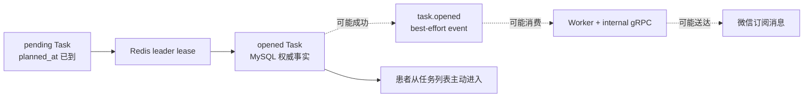
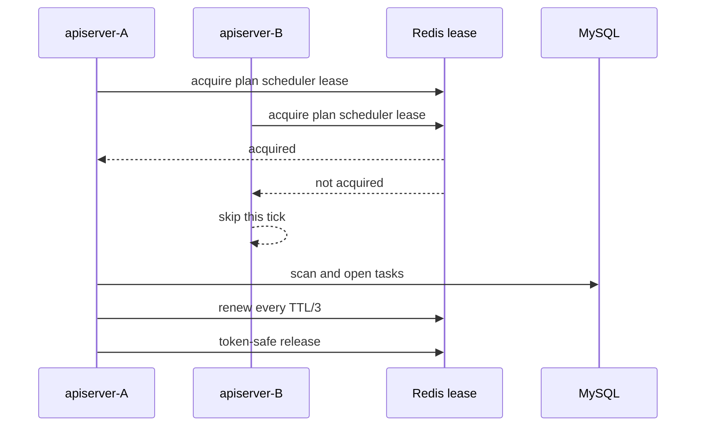

# 核心设计：任务调度、入口与提醒

> 状态：**已按当前源码重写**。本文描述 Task 从 `pending` 到 `opened` 的运行时设计，以及入口和小程序提醒的真实可靠性边界。任务开放以后怎样进入 AnswerSheet、Assessment 和 completed，留给后续《从任务开放到测评履约》展开。

## 1. 本文回答

本文重点回答：

- `AssessmentTask` 已经在患者加入 Plan 时生成，为什么还需要 `PlanRunner`；
- 多个 apiserver 实例同时运行时，怎样避免重复扫描和重复开放；
- 调度间隔、时间窗口、机构范围和过期扫描分别控制什么；
- 自动调度、人工开放和内部补调度是不是同一条业务链路；
- `entry_token`、`entry_url` 和 `expire_at` 当前究竟提供了什么能力；
- Task 已开放、`task.opened` 已消费、微信提醒已送达为什么是三个不同事实；
- 患者本人和家长观察者怎样被解析成小程序消息接收人；
- best-effort 生命周期事件为什么在 `task.opened` 上具有更强的业务影响；
- Plan 集中推送怎样形成瞬时负载，当前有哪些背压手段，又缺少什么；
- 哪些行为是已经实现的事实，哪些只是更合理的目标设计。

## 2. 30 秒结论

Plan 的任务调度不是“定时创建任务”。Task 已经在患者加入时生成，调度器负责在到达 `planned_at` 后，把一条既定的履约义务从 `pending` 推进为 `opened`。

当前完整链路是：

```text
PlanRunner 到点运行
  -> 争抢 Redis leader lease
  -> 按配置机构扫描到期 pending Task
  -> 校验父 Plan 仍为 active
  -> 生成 token、URL 和 7 天过期时间
  -> TaskLifecycle.Open
  -> MySQL 保存 opened Task
  -> best-effort 发布 task.opened
  -> Worker 消费事件
  -> apiserver 内部 gRPC
  -> 解析患者/家长的小程序 OpenID
  -> 调用微信订阅消息
```

这条链路必须拆成三个不能互相替代的事实：

| 事实 | 权威证据 | 当前可靠性 |
| --- | --- | --- |
| Task 已开放 | MySQL 中 Task 为 `opened`，并保存入口和开放时间 | 业务持久化成功即成立 |
| 开放事件已传播 | `task.opened` 被 publisher/NSQ/Worker 处理 | best-effort，可丢失 |
| 提醒已送达 | 微信向至少一个 OpenID 发送成功 | 只有日志和同步返回，无送达账本 |

因此，当前系统真正承诺的是：

> **调度成功意味着 Task 已经持久化开放；它不等于提醒已经发出，更不等于患者已经收到提醒。**

入口也需要同样谨慎地定义：当前 `entry_token + task_id` 会被生成、保存、查询和放进小程序页面参数，但服务端没有实现 token 的解析、校验、消费、撤销和身份绑定。它目前是**不透明的入口链接材料**，还不是一份闭环的访问凭证。



最后一条实线表达了本文最重要的产品边界：**提醒应是注意力机制，Task 才是业务事实。** 即使提醒链路失败，已经开放的任务也不应消失；反过来，不能仅凭一条“已处理提醒”的日志认定 Task 已正确开放。

## 3. 调度解决的不是任务生成，而是任务开放

### 3.1 Task 在加入 Plan 时已经存在

患者加入 Plan 时，`PlanEnrollment` 根据：

- Plan 周期策略；
- 患者的 `startDate`；
- `triggerTime`；
- 总次数或固定日期；

一次生成该患者的 Task 序列。每条 Task 已经拥有：

- `plan_id`；
- `testee_id`；
- `seq`；
- `scale_code`；
- `planned_at`；
- 初始状态 `pending`。

因此，PlanRunner 不负责重新解释周期策略，也不应在每个 tick 中“猜测今天该创建什么”。它只负责从既有 Task 中找出到期项并推进状态。

这种设计把两个不同问题分开了：

| 阶段 | 解决的问题 | 适合验证的规则 |
| --- | --- | --- |
| 加入时生成 | 未来应该安排哪些履约义务 | 周期计算、序号、重复加入、任务对账 |
| 到期时开放 | 现在允许填写哪些任务 | 时间窗口、Plan 状态、入口、过期和提醒 |

### 3.2 为什么不等用户进入时再创建 Task

如果 Task 只在用户点击时生成，系统无法在用户行动之前回答：

- 今天有哪些患者应该测评；
- 哪些 Task 尚未完成；
- 哪些 Task 已错过开放窗口；
- 暂停或终止 Plan 时应取消哪些未来义务；
- 提醒消息应指向哪一次履约；
- 履约率统计的分母是什么。

提前生成 Task 使“应做但未做”也成为可查询事实，而不是只记录已经发生的测评。

## 4. PlanRunner 的运行模型

### 4.1 启动条件

`PlanRunner` 运行在 apiserver 进程内，由 scheduler manager 管理生命周期。它只有在以下条件都满足时才会创建：

1. `plan_scheduler.enable=true`；
2. Plan command service 已完成装配；
3. Redis lock manager 可用；
4. leader lock 的 acquire/release 能力已装配。

服务或 Redis 不可用时，runner 会记录 degraded 原因并拒绝启动，不会退化为“所有 apiserver 实例都无锁执行”。这是正确的 fail-closed 语义：

> 可以暂时不自动开放任务，但不能因为协调设施故障而让多个实例同时无保护地修改同一批 Task。

这里的 Redis 不是 Task 的权威存储。Task 仍保存在 MySQL；Redis 只负责多实例调度互斥。

### 4.2 首次运行和后续对齐

启动后的时间行为是：

1. 等待 `initial_delay`；
2. 立即执行第一次 tick；
3. 后续等待下一个对齐后的 interval 边界；
4. context 取消时停止等待和运行。

当 interval 是整分钟时，代码按本地墙上时钟对齐，而不是简单地从上次完成时间继续累加。例如 60 分钟间隔会靠近整点运行，而不是固定为“上次完成后再过 60 分钟”。

这带来两个语义：

- `interval` 决定开放延迟上界，也决定一轮可能积累的任务规模；
- 时间计算依赖进程 `time.Local`，当前没有机构级时区模型。

### 4.3 当前生产配置

当前生产配置为：

| 配置 | 当前值 | 实际作用 |
| --- | --- | --- |
| `enable` | `true` | 启用内建 PlanRunner |
| `org_ids` | `[1]` | 只处理明确列出的机构 |
| `initial_delay` | `1m` | 避免进程启动时立即扫描 |
| `interval` | `60m` | 每小时形成一个自动开放批次 |
| `pending_lookback` | `24h` | 不自动开放早于本轮 24 小时的历史 pending Task |
| `lock_key` | `qs:plan-scheduler:leader` | leader lease 业务键 |
| `lock_ttl` | `2m` | 单次租约 TTL，由自动续租延长 |

配置注释中出现了“默认调度所有组织”的说法，但代码并没有动态枚举全部机构。`OrgIDs` 是显式列表，`[1]` 的真实语义就是只处理机构 1。新增机构后，如果不更新配置，其 Task 不会被内建调度器自动开放。

### 4.4 机构处理顺序

一个 tick 只争抢一次全局 Plan scheduler lease，然后按 `org_ids` 顺序逐个处理机构。

- 某个机构命令级失败，会记录失败并继续处理后续机构；
- 所有机构共享同一把 leader lease；
- 机构之间没有并行执行；
- tick 摘要聚合 opened、expired 和 failed organization 数量。

这使行为简单可追踪，但意味着前面机构的大批量任务会推迟后面机构的开放时间。

## 5. 多实例互斥：leader lease 保护了什么

### 5.1 租约的正确语义

多个 apiserver 实例可以同时到达同一个 tick，只有获得 `plan_scheduler_leader` lease 的实例执行本轮调度：



共享 lock lease subsystem 还提供：

- 进程内 active-run 登记；
- 按 TTL/3 自动续租；
- 租约丢失或续租失败时取消 body context；
- 使用 lease token 安全释放，避免误删新持有者的锁；
- 管理面主动 relinquish 和 cooldown；
- capability 状态和 Redis lock 指标。

### 5.2 租约没有替代业务幂等

leader lease 只保护**使用同一 workload/key 的内建 runner**。它不天然覆盖：

- 管理员调用手工 OpenTask；
- 内部 REST 主动调用 SchedulePendingTasks；
- 其他未使用相同 lease 的脚本或进程；
- lease 丢失后旧执行体未及时停止的极端情况。

所以 Task 状态机仍然只允许 `pending -> opened`，数据库保存也必须处理并发写冲突。当前 `Save` 路径并不是针对 open 的原子 compare-and-set，内建调度与人工开放同时发生时仍可能竞争，甚至在各自持有领域事件的情况下重复尝试发布。

租约与领域约束的关系应表述为：

> **租约减少重复执行，状态机和持久化约束决定重复执行是否安全。**

### 5.3 context 取消的边界

租约丢失时，subsystem 会取消传给调度 body 的 context。数据库查询、保存和事件发布会收到该 context；但 for-loop 本身没有每次显式检查 `ctx.Err()`，入口生成和已经发生的领域对象内存变更也不能被取消。

因此，取消能够阻止后续 I/O，却不应被理解为一份跨整个批次的事务回滚。每个已经保存成功的 Task 都是独立提交的业务事实。

## 6. 到期扫描窗口

### 6.1 自动调度的窗口

内建 PlanRunner 每个机构构造：

```text
before = now
lower_bound = now - pending_lookback
```

候选 Task 必须同时满足：

```text
org_id = configured org
status = pending
lower_bound <= planned_at <= before
deleted_at IS NULL
```

其中 MySQL 查询先按 `org_id + pending + planned_at <= before` 找出候选，应用层再检查 lower bound、状态和机构，并按 `planned_at, id` 稳定排序。

`pending_lookback=24h` 的目的不是控制批量，而是防止导入或遗留的很早 pending Task 被突然全部开放。它表达的是**迟到容忍窗口**：

- 任务晚开放数分钟或数小时，仍可被补开；
- 超过 24 小时的历史 pending Task，不会由内建 runner 自动开放；
- 这些 Task 也不会因此自动变成 expired，它们会继续保持 pending，等待人工决策或其他治理。

### 6.2 内部补调度的窗口不同

内部接口 `/internal/v1/plans/tasks/schedule` 可以传入：

- `before`；
- `plan_id`；
- `testee_ids`。

它复用同一个 application service，也会检查父 Plan active，但 REST handler 没有像 PlanRunner 一样注入 `pending_lookback` lower bound。

因此：

- 指定 Plan/testee 时，可以对明确范围做补调度；
- 不指定 scope 且 `before=now` 时，可能扫描该机构全部历史 pending Task；
- 它是运维/管理补偿入口，不应被当成与内建 runner 完全相同的时间语义。

补调度操作需要先确认范围，尤其不能用一个无 scope 请求无意中开放大量历史 Task。

### 6.3 扫描当前没有数量上限

`FindPendingTasks` 没有 `LIMIT` 或分页。`pending_lookback` 只限制时间，不限制候选数。若一小时内有一万条 Task 到期，本轮仍会把这一万条全部读入内存并串行处理。

所以当前调度更适合：

- 机构集合较小且显式；
- 单轮到期任务规模可控；
- 任务开放允许逐条最终完成；
- 不要求严格在同一秒开放。

它尚未形成“批次大小 + checkpoint + 下一轮续扫”的有界调度模型。

## 7. 单个 pending Task 怎样被开放

### 7.1 自动调度路径

对每条候选 Task，`taskSchedulerService` 顺序执行：

1. 读取父 `AssessmentPlan`，同一轮使用 plan cache 减少重复查询；
2. 父 Plan 不再 active 时，将 Task 取消，而不是开放；
3. 生成 token、URL 和 expireAt；
4. 调用 `TaskLifecycle.Open` 校验状态和入口参数；
5. 把 opened Task 保存到 MySQL；
6. best-effort 发布 Task 收集的领域事件；
7. 继续处理下一条 Task。

单条失败只增加 `FailedCount` 并继续，不会回滚本轮其他 Task。这是典型的逐项推进批处理语义。

### 7.2 “先保存，再提醒”是正确顺序

事件发布发生在 Task 保存之后。这样即使 Worker 立即消费 `task.opened`，它读取到的 Task 也已经是 opened，不会出现提醒先到、任务事实还不存在的正常时序。

反过来，事件发布失败不会回滚 Task。原因是提醒不应成为开放事务的一部分：

- MySQL 与 NSQ/微信无法组成单一数据库事务；
- 让微信可用性阻塞 Task 开放，会把外部渠道故障放大成核心业务故障；
- 患者仍应能从任务列表看到已开放任务。

合理的原子边界是：

```text
Task opened 持久化成功
```

提醒可靠性应通过独立的通知意图和送达治理解决，而不是把外部 API 调用塞进 Task 保存事务。

### 7.3 手工 OpenTask 的差异

管理接口 `POST /api/v1/plans/tasks/:id/open` 复用入口生成和 `TaskLifecycle.Open`，但当前 `taskManagementService` 只加载 Task，没有加载父 Plan。

这意味着：

| 规则 | 自动 SchedulePendingTasks | 手工 OpenTask |
| --- | --- | --- |
| 校验 Task 属于当前 org | 是 | 是 |
| 要求 Task 为 pending | 是 | 是 |
| 校验父 Plan 为 active | 是 | **否** |
| 受 PlanRunner leader lease 保护 | 是 | 否 |
| 保存后 best-effort 发 `task.opened` | 是 | 是 |

因此，当前存在一处行为不一致：如果数据库中仍有 paused/finished/canceled Plan 下的 pending Task，管理员可能手工将其开放。合理目标应是所有开放入口共用同一个“可开放”准入规则，而不是只依赖路由权限。

## 8. opened Task 的入口模型

### 8.1 当前生成内容

入口生成器在开放时创建：

```text
entry_token = UUID
entry_url   = {entry_base_url}?token={token}&task_id={task_id}
expire_at   = now + 7 days
```

当前生产和开发配置的 base URL 都是：

```text
https://collect.fangcunmount.cn/entry
```

`TaskLifecycle.Open` 要求：

- Task 当前为 pending；
- token 非空；
- URL 非空；
- expireAt 晚于开放动作时间。

保存后 Task 同时拥有 `open_at`、`expire_at`、`entry_token` 和 `entry_url`。

### 8.2 入口的当前能力与缺失能力

当前代码已经实现：

- 生成不可预测的 UUID token；
- 将 token 和 URL 与明确 task_id 一起保存；
- 在任务查询响应中返回 `entry_token` 和 `entry_url`；
- 查询接口按机构和受试者访问范围保护；
- 在小程序提醒页面参数中传递 token/task_id；
- 用 Task 的 opened 状态参与后续测评归因。

但没有找到以下服务端契约：

- 按 token 解析 Task；
- 校验 token 是否与 task_id 匹配；
- token 过期检查；
- token 与 IAM 用户、填写人或受试者绑定；
- 一次性消费、重复使用规则；
- 主动撤销、轮换和泄露处置；
- token 哈希存储或唯一索引；
- 入口访问审计。

后续 AnswerSheet 到 Task 的识别使用的是 `task_id + org/testee/scale + opened status`，不是 entry token。因此本文把当前入口定义为：

> **供小程序路由携带 Task 上下文的不透明链接材料，而不是独立授权凭证。**

这个定义避免两种误解：

1. 不能认为“有 token 就已完成身份授权”；
2. 也不能删除 token 后宣称入口行为完全不变，因为当前客户端路由和提醒仍在使用它。

### 8.3 token 的暴露面

token 当前以明文存在于：

- MySQL `assessment_task.entry_token`；
- `entry_url` 查询响应；
- Task REST 响应中的 `entry_token`；
- `task.opened` 事件的 `entry_url`；
- Worker 和通知链路的部分日志/页面参数。

虽然任务查询是受保护路由，并带有受试者访问范围校验，但把 token 放进完整 URL 后再进入消息和日志，会扩大泄露面。如果未来把 token 提升为访问凭证，必须先完成脱敏日志、哈希/轮换、绑定和校验设计；不能在当前存储形态上直接增加“持 token 免认证”的语义。

## 9. 过期不是 URL 自己失效，而是 Task 状态迁移

### 9.1 当前过期处理

每轮 SchedulePendingTasks 在开放 pending Task 后，还会扫描：

```text
status = opened
expire_at <= now
deleted_at IS NULL
```

然后：

- 父 Plan 非 active：将 Task canceled；
- 父 Plan active：将 Task expired；
- 保存后 best-effort 发布相应生命周期事件。

### 9.2 当前查询存在跨机构全表候选

`FindExpiredTasks` 没有 org 条件，也没有 LIMIT。application service 取回全部机构的 overdue opened Task 后，再按当前 org 过滤。

由于 PlanRunner 会为每个配置机构分别调用 SchedulePendingTasks，这意味着 N 个机构可能重复执行 N 次全局 overdue 查询。数据规模较小时功能正确，但会造成不必要的查询和内存放大。

### 9.3 “时间已过”和“状态已过期”目前不是同一时刻

`expire_at` 到达后，Task 不会由数据库自动变成 expired。必须等下一轮调度器完成状态迁移。

更重要的是，当前 `TaskAssessmentResolver` 只检查 Task 是否为 opened，没有同时检查 `expire_at > now`。因此在下面的间隙里：

```text
expire_at 已经过期
  -> 下一轮 PlanRunner 尚未执行
  -> Task 数据库状态仍为 opened
```

测评链仍可能识别这条 Task 并用它建立 Plan 归因。

这说明当前真正执行准入使用的是**状态语义**，不是即时的截止时间语义。若业务要求“截止时间一到立刻禁止填写”，准入路径必须显式检查 expireAt，不能只提高 scheduler 频率。

## 10. `task.opened` 的事件语义

### 10.1 事件内容

Task 开放时产生 `task.opened`，主要携带：

- task_id；
- plan_id；
- testee_id；
- entry_url；
- open_at。

它没有单独携带 expireAt，也没有把 token 作为独立字段；token 被嵌在 entry URL 中。

### 10.2 当前是 best-effort direct publish

`configs/events.yaml` 把全部 Task 生命周期事件定义为 `best_effort`。`PublishCollectedEvents` 在 Task 保存后尝试发布：

- 发布成功，Worker 可以收到；
- 发布失败，只记录日志；
- Task 不回滚；
- 没有 Outbox、relay 或重放表；
- 尝试结束后聚合中的事件被清理。

对 `task.completed/expired/canceled`，best-effort 可以被解释为“业务事实已在 Task 表，事件主要用于外围通知/记录”。但 `task.opened` 还有一个更强的实际用途：它是当前小程序主动提醒的唯一触发器。

所以此前“Task 生命周期事件只是记录”的认知，需要补充一个例外：

> `task.opened` 的权威事实仍然只是记录，但它承载的**提醒副作用**具有真实用户体验价值；事件丢失会让 Task 仍然存在，却可能没人被主动提醒。

### 10.3 best-effort 是否合理，取决于产品承诺

如果业务承诺是：

- 患者任务列表是主入口；
- 微信提醒只是辅助注意力机制；
- 偶尔漏发可以接受；

那么 `task.opened` best-effort 是可解释的成本选择。

如果业务承诺是：

- Plan 到期必须主动提醒；
- 漏发会直接破坏随访依从性；
- 运营需要知道谁没收到并补发；

那么当前实现就不够。应把“提醒请求”建模为耐久通知意图，并记录 recipient 级尝试和终态，而不必把所有 Task 生命周期事件都升级为可靠事件。

## 11. Worker 到微信的提醒链路

### 11.1 消费与内部调用

Worker 的 `task_opened_handler`：

1. 解析 event envelope 和 `TaskOpenedData`；
2. 将 testeeID 转为 uint64；
3. 调用 apiserver 内部 gRPC `SendTaskOpenedMiniProgramNotification`；
4. 记录 sent count、skipped、recipient source 和 message；
5. 返回 nil，让消息被确认。

`task.opened` 不走通用 Task webhook notifier；现有测试明确保护了这一点。completed、expired、canceled 才进入通用 TaskNotifier。

### 11.2 接收人不是简单等于患者本人

通知服务先读取 Testee，再通过 IAM recipient resolver 解析小程序 OpenID：

1. 尝试找到受试者本人对应的小程序用户；

2. 如果受试者没有可用 OpenID，则沿 Profile relation 解析家长或家庭关联人；

3. 对 OpenID 去重；

4. 返回 recipient source，例如 `testee` 或 `profile_link`。

这与 Actor 的业务口径一致：系统只要求明确受试者和填写人，不把“家长代填”和“家长观察量表”固化为 Plan 的两套提醒模型。年龄较小的患者没有独立小程序身份时，可以由关联家长接收提醒。

seeddata mock testee 会被明确跳过，避免测试数据触达真实用户。

### 11.3 模板和页面

通知服务使用固定的四个模板字段：

```text
thing5              测评/Plan 名称
date1               计划日期
character_string2   当前序号/总次数
thing3              当日未完成任务提示
```

发送前会从微信模板列表校验字段 key 完全匹配，并按 `appID + templateID` 缓存在进程内。当前缓存没有 TTL 或主动失效；模板后台变更后，已有进程可能继续使用旧校验结果直到重启。

页面地址不是直接采用 entry URL 的 host/path。通知服务从 entry URL 中提取 `token` 和 `task_id`，追加到配置的小程序 `page-path`。

### 11.4 提醒内容是运行时投影

为构造通知，服务还会读取：

- 当前 Task 的 plannedAt 和 seq；
- 父 Plan 的 totalTimes；
- 当前 active scale 的标题，失败时退化为 scale code；
- 受试者全部 Task，用本地日期统计当日未完成数量。

因此，`task.opened` 本身不是完整通知快照。消息内容在消费时从多个当前读模型组合而来，可能与事件产生时的上下文存在时间差。

## 12. 提醒失败现在怎样结算

### 12.1 三层失败被逐步软化

当前失败传播如下：

| 失败位置 | 本层行为 | 上一层看到什么 |
| --- | --- | --- |
| event payload 无法解析 | Worker 返回 error | MQ 可按 handler error 处理 |
| testeeID 无法解析 | Worker 记 warning | 返回 nil，消息 ACK |
| Worker 调内部 gRPC 失败 | Worker 记 warning | 返回 nil，消息 ACK |
| 通知服务全部发送失败 | gRPC 返回 `Success=false` 响应 | nil gRPC error |
| Worker 收到 `Success=false` | 不检查 Success，只记录字段 | 返回 nil，消息 ACK |
| 部分接收人失败 | notification 返回 partial message | 成功接收人保留；失败接收人不重试 |
| 无接收人/未配置 | 返回 skipped | 消息 ACK |

即使 worker transport 配置了 message delivery max attempts，通知失败也不会使用这些重试次数，因为 handler 主动返回 nil。只有事件解析等真正返回 error 的情况才可能触发 transport NACK/retry。

### 12.2 当前没有“提醒已送达”领域事实

系统没有持久化：

- notification intent；
- eventID/taskID/recipient 的幂等键；
- 每个 OpenID 的 attempt count；
- last error / next retry time；
- sent / skipped / failed 终态；
- 人工补发记录；
- 提醒送达率和最老积压年龄。

因此，重复投递可能重复发送，失败投递也无法自动补偿。日志可以帮助定位单次问题，但不能可靠回答：

> 机构 1 今天开放的 500 个 Task 中，有多少患者或家长真正收到提醒？

### 12.3 推荐的目标边界

如果后续要治理提醒可靠性，最小合理边界不是“把 Task open 和微信发送做成一个事务”，而是：

```text
Task opened
  + durable notification intent(task_id, channel, audience)
    -> recipient resolution
    -> recipient-level delivery attempt
    -> sent / skipped / retryable_failed / manual_required
```

其中：

- Task opened 仍不依赖微信成功；
- notification intent 可以与 Task 保存通过本地 Outbox 或可靠提交边界衔接；
- recipient 级幂等避免重复订阅消息；
- 配置/身份缺失与网络失败应具有不同 retryability；
- 人工补发必须记录原因和操作审计。

这属于后续重构方向，不是当前已实现能力。

## 13. 集中开放带来的负载

### 13.1 三类峰值中的 Plan 峰值

项目已经确认存在三类峰值：Plan 集中推送、学校筛查和直播推送。本篇关注第一类。

如果大量 Plan 使用相近 triggerTime，且生产 runner 每 60 分钟扫描一次，那么一小时内到期的 Task 会在一轮集中被开放。每条 Task 又可能触发：

- 父 Plan 读取；
- Task update；
- event publish；
- NSQ 消费；
- Worker 到 apiserver 的 gRPC；
- Testee 查询；
- IAM 应用配置/recipient 查询；
- Task、Plan、受试者全部 Task 查询；
- active model title 查询；
- 一个或多个微信发送请求。

### 13.2 当前已有的保护

- leader lease 避免多个内建 runner 重复形成同一批；
- 机构逐个、Task 逐条执行，避免 apiserver 调度器自身无限并发；
- repository 使用统一 MySQL limiter/连接池治理；
- Worker 有全局消费并发配置，生产当前为 48；
- 同一轮使用 Plan cache，减少重复父 Plan 查询；
- 模板规格有进程缓存；
- 单 Task 失败不会中断整批。

### 13.3 当前没有的背压

- pending/expired 查询没有 batch limit；
- 没有 checkpoint 或 cursor；
- 没有每轮最大开放数；
- 没有每机构公平配额；
- 没有每秒事件发布/微信发送速率；
- 没有通知积压账本；
- `pending_lookback` 不能限制同一窗口内的任务数量；
- 60 分钟间隔会增加单轮批次，而不是削平到期流量。

因此，当前模式的关键容量前提是“单轮候选规模可控”。若 Plan 任务量继续增长，更合理的演进是：

1. 以 `(planned_at,id)` 为稳定游标分页；
2. 每轮设置 batch limit；
3. 处理完一批后在租约和下游预算允许时继续；
4. 对机构做公平调度，避免大机构饿死小机构；
5. 用调度 lag 和 oldest due age 衡量积压，而不是只看 opened count；
6. 将通知意图与发送 worker 解耦，独立限速和重试。

## 14. 可观测性与安全

### 14.1 当前可以看到什么

PlanRunner 日志能够回答：

- runner 是否启动；
- 配置的 orgIDs、interval、lock key 和 TTL；
- 本轮是否获得 lease；
- 某机构是否命令级失败；
- 本轮 opened、expired、failed org 数量。

application service 还记录：

- pending count；
- opened/failed count；
- inactive Plan canceled count；
- expired/expireFailed count；
- 单 Task 失败原因。

lock subsystem 暴露 acquire/release/degraded 等 Redis 指标，并能在 resilience status 中显示 configured、degraded、active、TTL 和 renewal mode。

通知链记录接收来源、数量、跳过原因、发送成功和错误。

### 14.2 当前回答不了什么

- 上一次成功 tick 的持久时间和持续时长；
- 当前最老 due pending Task 的年龄；
- 本轮每个机构的 per-task failed/expireFailed 汇总指标；
- 任务从 plannedAt 到 openAt 的 p95/p99 lag；
- `task.opened` 发布丢失数；
- 提醒送达率、失败率和重试积压；
- 哪些 Task 已开放但从未产生通知意图；
- 过期迁移 lag。

此外，PlanRunner 的 tick 摘要只累计 opened 和 expired，没有把 application 返回的 `FailedCount`、`ExpireFailedCount` 汇总到最终摘要；运维需要继续查 application 日志才能判断一轮是否部分失败。

### 14.3 日志中的敏感信息

当前 Worker 会记录完整 `entry_url`，通知服务和内部 gRPC 还会记录 recipient OpenID、页面参数和模板数据。这些信息至少属于敏感标识符，entry URL 中还包含 token。

即使当前 token 尚不是完整凭证，也应遵守最小暴露原则：

- 日志只记录 task_id、recipient count、recipient source；
- token 只保留 hash/前后少量字符用于排障；
- OpenID 做稳定脱敏；
- 模板数据不整包打印；
- 对日志访问和保留周期做限制。

## 15. 失败场景矩阵

| 场景 | 当前结果 | Task 事实 | 是否自动恢复 |
| --- | --- | --- | --- |
| runner 未启用 | 不扫描 | 保持 pending/opened | 配置启用后下一轮；受 lookback 限制 |
| Redis 不可用 | runner 不启动或 tick 失败 | 不被无锁修改 | Redis 恢复并重启/下一轮 |
| 未获得 leader lease | 本实例跳过 | 由持锁实例推进 | 正常竞争语义 |
| 单 Task 入口生成失败 | 本条失败，继续下一条 | 保持 pending | 下一轮仍可能重试 |
| Task 保存失败 | 本条失败 | 通常仍是旧数据库状态 | 下一轮可能重试 |
| event publish 失败 | 只记日志 | 已是 opened | **无事件自动补发** |
| Worker 不可用 | best-effort 消息可能积压或丢失，取决于 transport | 已是 opened | 无 Task 侧调和 |
| gRPC/微信失败 | Worker 记录后 ACK | 已是 opened | **不自动重试** |
| 无 OpenID | skipped | 已是 opened | 身份补全后不会自动补发 |
| 父 Plan 非 active，自动扫描 | Task canceled | terminal | 无需开放 |
| 父 Plan 非 active，手工 OpenTask | 当前可能开放 | opened | 行为不一致 |
| expireAt 已到、runner 未扫 | 仍为 opened | 可能继续被识别履约 | 下一轮迁移，但窗口内可穿透 |
| 历史 pending 超过 lookback | 自动跳过 | 长期 pending | 需要人工范围化补偿 |

## 16. 关键不变式

### 16.1 当前已实现

1. 内建 runner 没有可用 Redis lease 时不无锁运行；
2. 同一时刻只有一个内建实例持有 Plan scheduler leader lease；
3. 自动调度只处理配置机构和时间窗口内的 pending Task；
4. 自动调度不会开放非 active 父 Plan 下的 Task；
5. Task 必须先持久化 opened，再尝试发布 `task.opened`；
6. 单 Task 失败不回滚已经开放的其他 Task；
7. Task 入口必须非空，并具有晚于 openAt 的 expireAt；
8. 受保护的 Task 查询按 org 和 testee access scope 校验；
9. 提醒接收人可以是患者本人，也可以是 IAM profile relation 解析出的家长；
10. 提醒失败不会回滚 Task opened。

### 16.2 尚未完全实现

1. 所有 Task 开放入口都必须校验父 Plan active；
2. 并发开放只能产生一次状态迁移和一次提醒意图；
3. expireAt 到达后，任何测评准入都必须立即拒绝该 Task；
4. entry token 必须具有明确的解析、授权、过期和撤销语义；
5. 调度扫描必须有批量上限和可恢复游标；
6. 每个已开放 Task 的通知意图都能被查询和补偿；
7. recipient 级发送必须幂等，并区分可重试、跳过和人工处理；
8. 日志不得暴露完整 token、OpenID 和模板内容；
9. 新增机构必须自动纳入或通过配置治理明确告警；
10. 调度 lag、过期 lag 和提醒送达率可被量化。

## 17. 设计选择与替代方案

### 17.1 为什么继续采用扫描，而不是为每个 Task 创建独立定时器

独立进程内 timer 在重启、扩缩容和多实例场景下难以恢复；每个 Task 进入外部延迟队列又会引入新的基础设施和取消/重排一致性问题。

当前“Task 是 MySQL 权威事实 + 周期扫描 due 状态 + leader lease”有几个优势：

- 重启后可以从数据库恢复；
- 暂停/终止时直接修改业务状态；
- 重复扫描可以依靠状态机收敛；
- 易于人工补偿和审计。

问题不在于扫描模型本身，而在于当前还缺少有界批处理、准入 CAS 和 lag 指标。

### 17.2 为什么提醒不应该阻塞 Task 开放

把微信发送放进开放命令会导致：

- 外部 API 超时拖长数据库命令；
- 微信故障使任务无法开放；
- 多接收人部分成功很难回滚；
- 重试命令可能重复发送。

所以“先开放，再异步提醒”方向正确。需要改进的是异步提醒的耐久性和幂等，而不是恢复同步耦合。

### 17.3 是否应把全部 Task 事件改为 durable_outbox

不一定。事件可靠性应由消费后果决定：

- 如果 completed/expired/canceled 只用于可重建的外围记录，best-effort 可以保留；
- 如果某个事件驱动不可重建的外部动作，就应为该动作建立可靠意图；
- `task.opened` 的“状态广播”和“提醒请求”可以拆成不同契约，不必为了提醒而让所有生命周期观察者共享同一可靠性级别。

更清晰的模型可能是：

```text
task.opened                 best-effort 状态广播
task-reminder.requested     durable notification intent
```

是否实施要由提醒漏发的业务容忍度和运营补偿要求决定。

## 18. 测试保护与缺失

### 18.1 已有测试覆盖

- PlanRunner 启用/禁用、首次延迟、context 取消；
- interval 对齐和 org 顺序；
- 单机构失败后继续；
- pending lookback 注入；
- lock contention、acquire/release error；
- 多实例只执行一次；
- lock lease acquire、renew、lease loss、cancel、relinquish；
- 非 active Plan 下 pending/opened Task 的取消；
- scoped schedule 和 lower-bound 过滤；
- overdue Task 始终参与过期扫描；
- 患者本人和家长 recipient 解析；
- 模板字段严格匹配和 seeddata 跳过；
- `task.opened` 不进入通用 webhook notifier。

### 18.2 尚缺的测试

- Task open → event → Worker → internal gRPC → 微信 sender 的端到端测试；
- 明确保护“通知失败当前被 ACK”的契约测试；
- 自动调度与手工 OpenTask 并发竞争测试；
- 手工 OpenTask 对父 Plan active 的一致性测试；
- 大批量分页、checkpoint、调度 lag 和取消响应测试；
- 多机构 expired 查询只扫描本机构的测试；
- expireAt 已到但状态未迁移时，测评准入拒绝测试；
- token 解析、过期、撤销、绑定和重复使用测试；
- recipient 级提醒幂等、部分失败重试和人工补发测试；
- 日志不泄露 token/OpenID 的安全测试。

## 19. 决策记录

### 19.1 已确认的业务与设计口径

1. Plan 的本质是“一个患者在一个时间段内，持续填写一种测评”；
2. 治疗方案预先配置周期，患者加入相应 Plan；
3. Plan 集中推送是项目真实的峰值来源之一；
4. Task 是预先生成的履约义务，调度器只负责到期开放；
5. Task opened 是权威业务事实，提醒是异步辅助机制；
6. 家长可以作为患者关联人接收提醒，Plan 不区分代填与观察量表两套入口；
7. Task 每次履约在测评准入时使用当前 active release，入口不冻结模型版本；
8. Task 生命周期事件整体可以保持 best-effort，但 `task.opened` 的提醒副作用需要单独评估可靠性。

### 19.2 当前实现结论

1. PlanRunner 采用 Redis leader lease，且 Redis 不可用时 fail closed；
2. 生产按配置机构每 60 分钟扫描，pending 回看 24 小时；
3. 自动调度校验父 Plan active，手工 OpenTask 当前没有同等校验；
4. pending 和 expired 扫描没有 batch limit；
5. 入口 token 是链接材料，不是闭环授权凭证；
6. `task.opened` 是 best-effort，发布失败无 Outbox 补偿；
7. Worker 会吞掉 gRPC/微信发送失败并 ACK；
8. 提醒没有持久化状态、幂等键、重试账本和补发接口；
9. overdue Task 在状态迁移前仍可能被当作 opened 使用；
10. 日志当前存在暴露完整 entry URL 和 OpenID 的风险。

## 20. 源码事实索引

| 主题 | 当前事实源 |
| --- | --- |
| PlanRunner 启动、时间窗口和 org 循环 | [`runtime/scheduler/plan_scheduler.go`](../../../internal/apiserver/runtime/scheduler/plan_scheduler.go) |
| interval 对齐 | [`runtime/scheduler/timing.go`](../../../internal/apiserver/runtime/scheduler/timing.go) |
| leader lock 适配 | [`runtime/scheduler/leader_lock.go`](../../../internal/apiserver/runtime/scheduler/leader_lock.go) |
| lease 自动续租与治理 | [`pkg/resilience/locklease/subsystem`](../../../internal/pkg/resilience/locklease/subsystem/) |
| 调度配置与校验 | [`options/options.go`](../../../internal/apiserver/options/options.go)、[`options/validation.go`](../../../internal/apiserver/options/validation.go) |
| 生产 runner 配置 | [`configs/apiserver.prod.yaml`](../../../configs/apiserver.prod.yaml) |
| Task 调度应用服务 | [`application/plan/task_scheduler_service.go`](../../../internal/apiserver/application/plan/task_scheduler_service.go) |
| 手工 Task 管理 | [`application/plan/task_management_service.go`](../../../internal/apiserver/application/plan/task_management_service.go) |
| Task 测评归因 | [`application/plan/task_assessment_resolver.go`](../../../internal/apiserver/application/plan/task_assessment_resolver.go) |
| Task 查询授权与 API | [`transport/rest/routes_plan.go`](../../../internal/apiserver/transport/rest/routes_plan.go)、[`handler/plan.go`](../../../internal/apiserver/transport/rest/handler/plan.go) |
| 入口生成 | [`infra/plan/entry_generator.go`](../../../internal/apiserver/infra/plan/entry_generator.go) |
| pending/expired 查询 | [`infra/mysql/plan/task_repository.go`](../../../internal/apiserver/infra/mysql/plan/task_repository.go) |
| Task 表与索引 | [`migrations/mysql`](../../../internal/pkg/migration/migrations/mysql/) |
| 事件 delivery 配置 | [`configs/events.yaml`](../../../configs/events.yaml) |
| Worker task.opened handler | [`worker/handlers/task_handler.go`](../../../internal/worker/handlers/task_handler.go) |
| 内部通知 gRPC | [`transport/grpc/service/internal_notification_flow.go`](../../../internal/apiserver/transport/grpc/service/internal_notification_flow.go) |
| 小程序通知服务 | [`application/notification/task_opened_service.go`](../../../internal/apiserver/application/notification/task_opened_service.go) |
| 提醒上下文投影 | [`application/plan/task_notification_context_reader.go`](../../../internal/apiserver/application/plan/task_notification_context_reader.go) |

## 21. 验证方式

本篇可用以下命令快速验证结构和主要行为：

```bash
go test ./internal/apiserver/runtime/scheduler
go test ./internal/pkg/resilience/locklease/...
go test ./internal/apiserver/application/plan
go test ./internal/apiserver/application/notification
go test ./internal/apiserver/transport/grpc/service
go test ./internal/worker/handlers
make docs-hygiene
make docs-facts
```

这些测试能够保护代码契约和文档链接，但不能证明生产环境的：

- Redis lease 持续健康；
- 单轮真实 Task 数量；
- NSQ 积压和消费延迟；
- IAM recipient 完整率；
- 微信订阅消息真实送达率；
- 患者最终打开并完成任务的转化率。

生产验收还需要结合 scheduler lag、通知送达账本或至少结构化指标，以及真实的集中推送演练。
