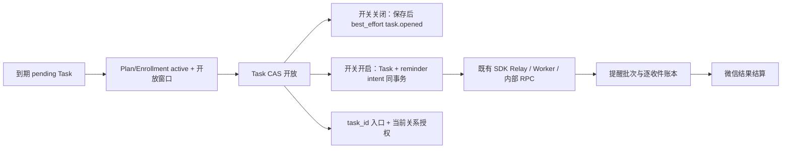

# 核心设计：任务调度、入口与提醒

> 状态：已实现契约按当前组合根与源码描述。生产开关、实际发送、部署与业务验收单独取证，配置文件与历史发送记录不能证明当前运行状态。

## 1. 本文回答

Task 在加入时生成，调度器负责把它开放或终结。本篇维护开放窗口、调度容量、TaskID 入口、提醒开关分流与恢复边界。
作答受理到履约的跨模块链路见[从任务开放到测评履约](./31-关键链路-从任务开放到测评履约.md)，状态/事务见[一致性设计](./21-核心设计-状态、幂等与数据一致性.md)。

## 2. 30 秒结论

| 完成点 | 当前事实 | 不能据此推断 |
| --- | --- | --- |
| Task 开放 | MySQL 中获胜的 pending→opened，保存 open_at/expire_at/entry_url | 提醒已发送、用户已收到或作答已受理 |
| 可靠提醒意图 | 开关启用时，与 Task 开放同事务保存 task.opened.reminder.requested | Broker 接单或微信接单 |
| Broker 确认 | SDK 发布责任完成点 | 提醒消费者建立批次或微信业务接受 |
| 微信 confirmed | 明确成功响应证明平台接受本次请求 | 最终送达、用户阅读或 Task 履约 |
| Task 入口 | task_id 定位，登录用户 active ProfileLink 授权 | 持有 ID 就拥有访问权 |


```mermaid
flowchart LR
    P["到期 pending Task"] --> A["Plan/Enrollment active + 开放窗口"]
    A --> O["Task CAS 开放"]
    O --> F["开关关闭：保存后 best_effort task.opened"]
    O --> D["开关开启：Task + reminder intent 同事务"]
    D --> R["既有 SDK Relay / Worker / 内部 RPC"]
    R --> B["提醒批次与逐收件账本"]
    B --> W["微信结果结算"]
    O --> E["task_id 入口 + 当前关系授权"]
```

外部发送 API 不在 Task 事务内。可靠路径把“应当提醒”作为本地意图提交，后续各完成点分别治理。

## 3. 调度与时间

### 3.1 业务时间

`planned_at` 是计划时间，`due_at` 是基于 planned_at 的七个上海日历日履约期限；开放窗口为 `[planned_at, planned_at+24h)`。
`open_at` 是实际开放时刻，`expire_at` 为 open_at 后七个上海日历日。due_at 与 expire_at 的起点不同，不能把它们合并为一个截止字段。

领域 `TaskLifecycle.OpenAt` 要求 pending、落在开放窗口、非空 URL；token 可以为空。`CompleteAt` 要求 opened、非零 AssessmentID，且操作时刻早于 expire_at。
入口与提交准入直接校验实时窗口，不等待 Scheduler 把数据库 status 改成 expired。

### 3.2 PlanRunner 与扫描阶段

PlanRunner 在 apiserver 内运行，要求启用配置、Plan Command Service 和 HA lease 可用。启动等待 initial delay，执行一轮后按 interval 对齐；机构依配置顺序处理。
每轮依次处理已开放但入口已过期的 Task、仍在开放窗口内的 pending Task，以及错过开放窗口的 pending Task。
第三阶段受 `missed_expiration_enabled` 控制，不能把停用它解释为同时停用已开放入口的过期治理。

生产组合根供应支持分页的 MySQL Task repository；各扫描阶段使用稳定 cursor、batch size 与每机构/轮次上限。
应用默认 batch_size=200、max_tasks_per_tick=2000，Runner 用 effective options 覆盖。旧测试/兼容仓储可能进入后备查询，不能据此描述生产为无限扫描。
数据量、公平性和每轮处理时长仍需容量与积压指标证明。

### 3.3 互斥与并发写

Redis leader lease 减少多实例重复调度，并安全释放本次 lease identity；它不保护管理命令、内部 gRPC 或所有数据库竞争。
Task repository 的开放更新要求同公司、pending、预期 schedule_revision、open_at 为 NULL，原子递增 version；零行返回冲突。
因此 stale pending 对象不能覆盖获胜开放的入口或产生第二份开放提醒意图。租约、CAS 和提醒唯一身份各承担不同责任。

取消 context 阻止后续 I/O，不会回滚此前已独立提交的 Task；一轮调度不是全部机构/全部 Task 的大事务。

## 4. 自动与手工开放

Scheduler 校验父 Plan 与 Enrollment；非 active 的待开放 Task 不继续开放。手工 OpenTask 也检查 planned window、active parent Plan 和 active Enrollment。
二者共用领域开放规则及 `taskPersistence.saveOpened`，再通过相同 MySQL repository 条件写。
后台 Operator 命令先检查动作/门店 Scope 并锁定当前受试者归属，内部服务和调度各有独立准入入口。
开关启用时两种开放都经过 Task 与提醒意图同事务保存；任何 SQL/意图写失败都不返回成功。

## 5. TaskID 入口与授权

当前生成内容：

```text
entry_token = ""
entry_url   = {entry_base_url}?task_id={task_id}
open_at     = 实际开放时刻
expire_at   = open_at 后七个上海日历日
```

生成器清除原 base URL 的 query/fragment，只构造 task_id 参数。历史 token 字段与参数可作为协议兼容保留，服务端不据此授权。
AssessmentEntry 的公开 ae_ token 是另一种入口，不能与 Plan Task 的历史 entry_token 混用。

### 5.1 服务端解析

TaskEntryResolver 校验 Task 存在、opened、当前时刻落在 `[open_at,expire_at)`、尚无 assessment_id、scale_code 非空。
生产装配校验 active Enrollment 的公司、受试者和 Plan 与 Task 一致，再解析当前发布模型及其精确问卷引用。
Collection 用登录 IAM User 和目标 Testee 的 active ProfileLink 释放入口/列表；ID 本身只定位对象。
Task 场景以服务端返回的 Testee、模型和问卷事实构造提交，不能用客户端同名字段覆盖 Task 事实。

### 5.2 同步受理继续核验

Survey 注入 MySQL attribution resolver，在可靠受理前按 Task/Enrollment 的公司、受试者、状态、实时窗口和模型族检查来源，再冻结归因。
打开入口的结果不是提交时刻的永久授权，也不是锁住未来模型版本的会话；终止轮次、关系失效、窗口结束或内容变化可能使提交拒绝。
已受理 AnswerSheet 的精确 Questionnaire/Model 与归因快照随后保护历史，Plan 自身仍只持有 model family code。

## 6. 提醒开关与两条路径

| Task 开放时开关 | 保存边界 | 后续路径 | 恢复能力 |
| --- | --- | --- | --- |
| task_opened_reminder 关闭 | 保存 Task，之后尽力发布 task.opened | 旧 best_effort handler | 发布失败不回滚 Task，不具有新路径的逐收件账本保证 |
| task_opened_reminder 开启 | Task 与 task.opened.reminder.requested 同一 MySQL 事务 | SDK Relay→Worker→内部 RPC→普通提醒服务 | durable intent、批次/逐收件状态、受控治理 |

`configs/events.yaml` 对 task.opened 指定 best_effort，对 task.opened.reminder.requested 指定 durable_outbox。
开关开启却缺标准 MySQL Outbox profile 时装配失败；不能悄悄退化成旧路径。
关闭开关只停止新 Task 开放时产生新可靠意图；依赖仍可用时，既有消费者继续结算先前持久化意图。
若回退后缺 IAM/MySQL/微信等依赖，关闭状态允许启动，但待处理意图继续等待；必须按运行水位判断积压。

生命周期 completed/expired/canceled 的通知继续按各自 delivery 契约处理，不能由提醒意图推断全部 Task 事件已可靠化。

## 7. 收件资格与微信结果

提醒服务在消费时核对当前 Task/轮次资格、SELF 收件范围、当前 IAM 关系及订阅条件。持久化发送批次和逐收件状态与 Broker 确认分开。
已有空集抑制也是批次决定，不能当成“根本没消费”重新制造收件集合。

只有微信响应明确包含 errcode=0 且 errmsg=ok，才记 confirmed。成功响应可以没有平台 msgid，账本允许标记 platform_accepted_no_msgid。
网络错误、缺少成功字段或响应结果未知保持核对状态；不知道供应商是否接受时禁止自动重发。
confirmed 表示平台接受，不能据此宣布用户收到、已读或作答成功。

## 8. 原提醒缺批次的受控恢复

管理员治理接口：

- `POST /internal/v1/system-governance/actions/reminder-gap-recoveries` 授权重排原提醒；
- `POST /internal/v1/system-governance/actions/reminder-gap-recoveries/resolve` 只读查询原回执。

公司与操作者取受保护会话，JSON 不能覆盖。写入要求标准 MySQL Outbox、gap_recovery_enabled 与 task_opened_reminder 同时启用；查询不受两个写开关限制。
请求绑定 request_id、task_id、opening_event_id、expected_version、固定 opened_before、evidence_reference、reason、confirm。
人工证据锁定单机构、固定时间/ID 水位及原 Task，published 不能直接等同“缺消息”。

授权事务锁定 Task、唯一原 Outbox 行及收件责任范围，验证原身份/SDK 指纹/领域包、Plan/Testee、最新开放 revision 和期限。
仅原行已 confirmed published、Task 仍可用且不存在批次或任何 delivery 时，可对原行执行 SDK RequeueConfirmed；审计回执与重排同事务。
保留原 UUID、payload、指纹和计数，不建立独立发布器，不重置 sending、结果未知、已确认或人工结案 delivery。

HTTP 结果未知时先查询同公司、操作者、request_id 和完整输入的原回执；缺回执不授权更换请求 ID。
重排仍经既有 Relay/Worker/RPC 和普通提醒资格规则；治理接口不直接调用微信/IAM，不冻结新收件集合。

## 9. 库与宿主职责

可靠消息库维护 Outbox 发布状态、指纹、Relay、Broker 结果及 RequeueConfirmed 协议。QS 宿主供应连接、事务与生命周期，不隐式提交借用事务或关闭借用资源。
Plan 拥有开放规则与提醒意图；提醒业务拥有收件资格、供应商结果、未知禁止重发、账本与人工处置；治理用例拥有业务授权和审计回执。
库的 Broker confirmed 不替代这些业务完成点。通用发布/恢复协议见[事件基础设施](../../03-基础设施/event/README.md)。

## 10. 失败与观察

| 失败点 | 当前结果 | 后续动作 |
| --- | --- | --- |
| lease 不可用/未取得 | 跳过本轮或记录依赖失败 | 恢复 lease，观察积压；不绕过 CAS |
| Task CAS 输给并发者 | 冲突，不覆盖入口 | 读取获胜事实 |
| 可靠意图写入失败 | Task 开放事务回滚 | 按原业务意图重试 |
| 旧 best_effort 发布失败 | Task 已开放，日志失败 | 不能宣称自动补偿 |
| Broker 结果未知 | 按 SDK 发布结果协议保留状态 | 不把未知当已确认 |
| 微信结果未知 | delivery 待核对 | 禁止自动重发 |
| 原消息 confirmed 但无批次 | 可疑缺口，不自动认定丢消息 | 人工分类后受控恢复 |

调度 Stats 包含 pending/opened/failed、opened overdue/expired、missed candidate/backlog、最旧 pending/opened age。
将 Task ID、opening event ID、schedule revision、Outbox identity、batch/delivery 与供应商回执一起追踪；时间戳和日志次数不代替数据库责任记录。

## 11. 事实源与验证

- 时间/状态：`internal/apiserver/domain/plan/types.go`、`task_lifecycle.go`；
- 调度：`internal/apiserver/runtime/scheduler/plan_scheduler.go`、`internal/apiserver/application/plan/task_scheduler_service.go`；
- 扫描限制：`internal/apiserver/application/plan/task_scheduler_context.go`；
- 原子开放：`internal/apiserver/application/plan/task_persistence.go`、`internal/apiserver/infra/mysql/plan/task_repository.go`；
- 入口：`internal/apiserver/infra/plan/entry_generator.go`、`internal/apiserver/application/plan/task_entry_resolver.go`；
- 参与者关系：`internal/collection-server/application/planentry/service.go`；
- 受理归因：`internal/apiserver/infra/mysql/answersheetattribution/resolver.go`；
- 条件装配：`internal/apiserver/container/modules/plan/install.go`、`assemble.go`；
- delivery 契约：`configs/events.yaml`。

领域窗口、分页、入口及关系由定向测试保护；MySQL CAS/意图同事务有隔离数据库专项。
Broker 强杀、真实微信发送、回退水位、生产开关和普通用户履约仍需单独运行证据，见[风险清单](./90-设计问题与重构清单.md)。
