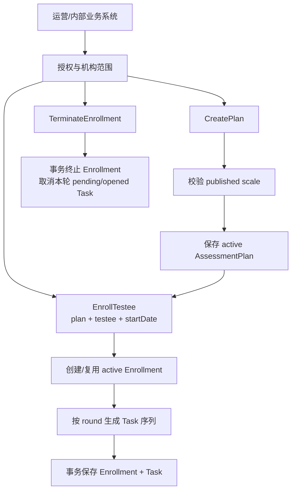
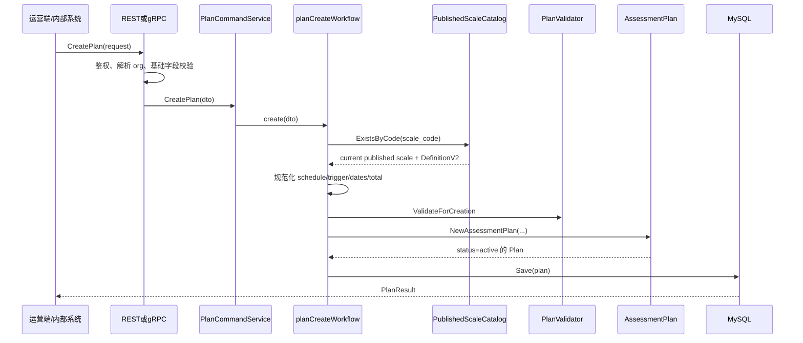
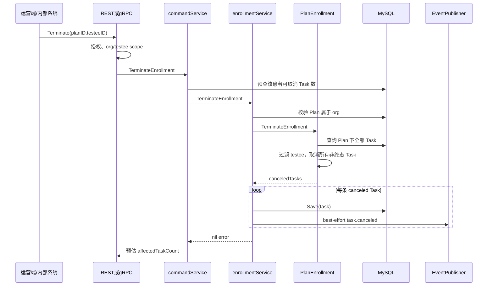

# 关键链路：计划创建、患者加入与终止

> 状态：**已按当前源码重写**。本文沿管理侧写命令还原 Plan 从模板创建、患者加入到终止参与的完整调用链。周期算法的数学语义见[《周期策略与任务生成》](./20-核心设计-周期策略与任务生成.md)，状态、幂等和事务边界见[《状态、幂等与数据一致性》](./21-核心设计-状态、幂等与数据一致性.md)。

## 1. 本文回答

本文重点回答：

- 谁可以创建 Plan、把患者加入 Plan 或终止患者参与；
- REST 与内部 gRPC 两类入口怎样进入同一 application command service；
- 创建 Plan 时为什么必须先校验当前已发布测评模型；
- `schedule_type`、`trigger_time`、`total_times` 在哪一层完成规范化；
- 为什么创建 Plan 时没有 `testee_id` 和 `start_date`；
- 患者加入时怎样把 Plan 模板展开为完整 Task 序列；
- 重复加入怎样区分“幂等重放”“缺失任务补建”和“时间轴冲突”；
- 终止患者参与为什么不修改 Plan，而是终止 active Enrollment 并取消本轮非终态 Task；
- 创建、加入和终止的成功响应分别证明了什么；
- 创建、加入和终止各自在哪个事务边界内提交；
- 终止后再次加入同一 Plan 怎样创建下一轮参与。

## 2. 30 秒结论

管理侧的三个命令处理的是三种不同层级的事实：

| 命令 | 创建或修改的事实 | 不会创建或修改什么 |
| --- | --- | --- |
| CreatePlan | 一个机构可复用的周期测评模板 | 不绑定患者，不生成 Task |
| EnrollTestee | 创建或复用患者 active Enrollment，并形成该轮 Task 时间轴 | 不修改 Plan 模板 |
| TerminateEnrollment | 终止 active Enrollment，并取消该轮尚未结束的 Task | 不终止 Plan，不删除历史 Task |

完整链路可以概括为：



当前最重要的正确性结论是：

1. Plan 是模板，创建成功只说明周期策略已经保存；
2. 患者加入时才提供 `startDate`，并一次生成完整 Task 序列；
3. 相同 startDate 的重复加入复用 active Enrollment，不盲目重复插入；
4. active Enrollment 唯一约束和 `(enrollment_id,seq)` 唯一键是并发防线；
5. 终止参与保留 completed/expired/canceled 历史，只把 pending/opened 变成 canceled；
6. Enrollment 独立保存 startDate、round、加入/关闭/终止状态与原因；
7. 同一患者终止后再次加入会创建下一 round；
8. Enrollment 与初始 Task、终止与未完成 Task 取消在 MySQL 事务中提交。

可以用一句话概括：

> **创建 Plan 是定义可复用规则；患者加入是把规则实例化成履约义务；终止参与是结束剩余义务，而不是删除或改写已经发生的测评历史。**

## 3. 三个命令的业务语言

### 3.1 创建 Plan：运营定义一种持续测评安排

业务输入是：

- 使用哪一种已发布医学量表测评；
- 按天、按周、固定日期还是自定义周次重复；
- 每次在一天中的什么时间开放；
- 间隔和次数，或明确的日期/周次列表。

创建后得到的是一个机构内可复用的 `AssessmentPlan`。同一个 Plan 可以让多名患者加入，每名患者拥有自己的 Task。

### 3.2 患者加入：把模板投影到患者时间轴

加入命令补充创建 Plan 时刻意没有保存的两个变量：

- `testee_id`：这组任务属于谁；
- `start_date`：相对周期从哪一天开始计算。

系统据此把 Plan 展开成：

```text
(plan_id, testee_id, seq=1, planned_at=...)
(plan_id, testee_id, seq=2, planned_at=...)
...
```

这些 Task 是未来的履约义务，不表示患者已经填写，也不冻结测评发布版本。

### 3.3 终止参与：停止某个患者的剩余任务

终止患者参与不等于：

- 取消整个 Plan；
- 删除患者历史结果；
- 撤回已经完成的 Assessment；
- 把同 Plan 下其他患者的任务一起取消。

它只表达：

> 这个患者不再继续履行该 Plan 剩余的测评任务。

## 4. 传输入口与授权边界

### 4.1 REST 管理入口

REST 路由是：

```text
POST /api/v1/plans
POST /api/v1/plans/enroll
POST /api/v1/plans/:id/testees/:testee_id/terminate
```

三条写接口都位于受保护路由下，并要求 `ManageEvaluationPlans` capability。当前注释将其解释为 `qs:evaluation_plan_manager` 或 `qs:admin`。

此外：

- 使用 submit rate-limit budget；
- 机构 ID 从已认证请求上下文解析，不接受调用方自由指定其他机构；
- Enroll 和 Terminate 还会执行受试者访问范围校验。

受试者访问校验不只是检查 ID 格式，还会验证：

1. 当前 operator 在该机构中有效；
2. 受试者真实存在且属于当前机构；
3. admin 可以直接访问；
4. 非 admin 必须是有效 clinician，并与该患者存在允许访问的 active relation。

因此，REST 管理员“有 Plan 写能力”并不自动等于“可以操作机构内任意患者”。

### 4.2 内部 gRPC 入口

同一组命令也由内部 `PlanCommandService` 暴露：

```text
CreatePlan
EnrollTestee
TerminateEnrollment
```

gRPC 入口会：

- 从服务身份/请求上下文解析机构范围；
- 拒绝 context org 与请求 org 冲突；
- 检查关键字符串是否为空；
- 将 application error 映射为 InvalidArgument、NotFound、PermissionDenied 或 Internal。

它不会复用 REST Handler 中的 `TesteeAccessService.ValidateTesteeAccess`。这符合“内部系统动作”与“运营人员操作”分离的传输边界，但意味着内部调用方的服务认证和租户授权必须可靠；application 层只会继续校验 Plan 的机构归属和 ID/状态，不会再次验证 clinician-patient relation。

### 4.3 两个入口共享同一个业务实现

REST 和 gRPC 最终都调用：

```text
application/plan.PlanCommandService
```

传输层只负责认证上下文、协议字段和错误映射。Plan 创建、加入、终止的业务规则不应分别复制到 Handler 和 gRPC service。

## 5. 关键链路一：创建 Plan

### 5.1 请求契约

CreatePlan 的主要输入为：

| 字段 | 含义 | 主要适用类型 |
| --- | --- | --- |
| `scale_code` | ModelCatalog 中 scale 模型族 code | 全部 |
| `schedule_type` | by_week/by_day/fixed_date/custom | 全部 |
| `trigger_time` | 每次任务的日内触发时间 | 全部 |
| `interval` | 间隔天数或周数 | by_day/by_week |
| `total_times` | 总次数 | by_day/by_week |
| `fixed_dates` | 绝对日期列表 | fixed_date |
| `relative_weeks` | 相对 startDate 的周次列表 | custom |

REST 只在结构层要求 `scale_code` 和 `schedule_type` 非空，完整的组合校验由 create workflow 和 `PlanValidator` 完成。

### 5.2 调用顺序



### 5.3 第一道准入：必须是可执行的已发布 scale

正常装配下，Plan 通过 `PublishedScaleCatalog` 查询：

```text
FindPublishedModelByCode(KindScale, scaleCode)
```

只有同时满足以下条件才认为 code 有效：

- 当前存在 published model；
- kind 为 `scale`；
- `DefinitionV2` 非空。

这说明 Plan 不是绑定独立 Questionnaire，也不是接受任意模型类型。它安排的是当前可以执行的医学量表模型族。

创建只保存 `scale_code`，不复制：

- Questionnaire ref；
- AssessmentSnapshot version；
- Algorithm；
- Factor/Norm/Decision 定义。

未来 Task 履约时再按 code 进入当前 active release，详细语义见[《测评引用与版本语义》](./22-核心设计-测评引用与版本语义.md)。

### 5.4 ModelCatalog 依赖当前不是 fail-closed

Plan module 正常由 composition root 注入 `PublishedModelLister`。但 `NewPublishedScaleCatalog(nil)` 会得到 nil，create workflow 遇到 nil catalog 时会直接跳过 scale 校验，而 Plan module 初始化不会因此失败。

所以当前真实语义是：

- 正常完整装配：必须通过 published scale 准入；
- ModelCatalog lister 未装配：Plan 创建仍可继续，任意非空 code 可能被保存。

如果“无有效发布模型绝不能创建 Plan”是硬不变式，模块装配应对该依赖 fail closed，而不是静默降级。

### 5.5 周期参数规范化

create workflow 按顺序执行：

1. 将字符串 schedule type 转为领域枚举；
2. 将空 triggerTime 规范化为 `19:00:00`；
3. 接受 `HH:MM` 或 `HH:MM:SS` 并统一为 `HH:MM:SS`；
4. 用进程 `time.Local` 解析 fixed dates；
5. fixed_date 的 totalTimes 取 fixedDates 数量；
6. custom 的 totalTimes 取 relativeWeeks 数量；
7. 组装 Plan options；
8. 执行跨字段领域校验。

核心校验包括：

- orgID、scaleCode 非空；
- schedule type 有效；
- triggerTime 格式有效；
- by_day/by_week interval 和 totalTimes 大于 0，次数不超过 100；
- custom relativeWeeks 非空、严格递增且都大于 0；
- fixedDates 非空且不能倒序。

fixedDates 当前允许相同日期重复，因为校验只拒绝 `Before`，不拒绝相等。这会形成不同 seq、相同 plannedAt 的两条 Task。

### 5.6 未知 schedule type 当前会被降级为 by_week

`toPlanScheduleType` 的 default 分支返回 `PlanScheduleByWeek`，不是 invalid enum。于是请求：

```json
{
  "schedule_type": "unknown",
  "interval": 1,
  "total_times": 3
}
```

可能在进入 `PlanValidator` 前已经变成合法的 by_week，最终被保存为按周计划。

这会破坏“非法枚举必须拒绝”的输入契约。正确目标应是保留 invalid 值交给 validator 拒绝，或在 transport/application 转换时直接返回错误。

### 5.7 创建聚合并保存

`NewAssessmentPlan` 创建：

```text
id            = new ID
org_id        = request org
scale_code    = validated code
schedule      = normalized strategy
trigger_time  = normalized time
status        = active
```

创建时不会保存：

- testeeID；
- startDate；
- Enrollment；

- Task；
- 模型发布版本。

Plan 通过单次 repository Save 写入 MySQL。这是一个单聚合保存，不涉及跨记录事务。

### 5.8 CreatePlan 的成功语义

成功响应证明：

- Plan 记录已经保存；
- 它属于当前机构；
- 状态为 active；
- 周期字段已规范化。

它不证明：

- 已有患者加入；
- 已经生成 Task；
- 已经开放任何填写入口；
- 已经发送提醒。

CreatePlan 当前没有 request idempotency key，也没有“同机构 + 相同业务配置”的唯一约束。相同请求重放会生成新的 Plan ID 和另一份模板。

此外，当前没有 `plan.created` 事件。下游如果要知道新增了 Plan，只能查询 Plan 表或由调用方保留响应，不能依赖 Plan 领域事件日志。

## 6. 关键链路二：患者加入 Plan

### 6.1 请求契约

加入请求只有三个显式业务字段：

```json
{
  "plan_id": "...",
  "testee_id": "...",
  "start_date": "2026-04-03"
}
```

这三个字段分别决定：

- 使用哪一份周期模板；
- 为哪一个受试者生成履约义务；
- 相对时间从哪一天开始。

`start_date` 按进程 `time.Local` 解析为当日零点，再由 Plan `trigger_time` 覆盖日内时刻。

### 6.2 REST 入口先校验患者访问权

REST Handler 的顺序是：

1. JSON 与 required 字段校验；
2. `validateProtectedTesteeID`；
3. 从上下文取得 orgID；
4. 组装 `EnrollTesteeDTO`；
5. 调 application command service。

`validateProtectedTesteeID` 已经读取了 org 和 operator，因此随后再次 `RequireProtectedOrgID` 属于重复解析，但不会改变业务语义。

### 6.3 application 层解析与机构隔离

`enrollmentService.EnrollTestee`：

1. 解析 Plan ID；
2. 解析 Testee ID；
3. 解析 `YYYY-MM-DD` startDate；
4. 读取 Plan 并校验 `plan.org_id == request.org_id`；
5. 调用领域 `PlanEnrollment.EnrollTestee`。

领域服务内部会再次按 ID 读取 Plan。当前因此存在一次重复 Plan 查询；若 Plan repository 启用 Redis cache，第二次可能命中缓存，但从职责上仍是 application 与 domain service 都在读取同一聚合。

### 6.4 只有 active Plan 可以加入

`PlanValidator.ValidateForEnrollment` 要求：

- Plan 存在；
- Plan 状态为 active；
- testeeID 非零；
- startDate 非零。

paused、finished、canceled Plan 都不能接受新患者。

注意：应用层不会在加入时再次查询 ModelCatalog。Plan 创建时保存的是 code，后续模型下架不会自动修改 Plan；版本和 active release 对未来履约的影响由后续准入链处理。

### 6.5 生成完整期望 Task 序列

领域服务调用 `TaskGenerator.GenerateTasks(plan,testee,startDate)`，一次生成 Plan 定义的全部 Task。

每条新 Task 都包含：

```text
plan_id
enrollment_id
testee_id
seq
org_id
scale_code
planned_at
status = pending
```

任务生成算法不是本文重点，但有两点直接影响命令契约：

1. by_day/by_week/custom 的 plannedAt 由 startDate 决定；
2. fixed_date 使用 Plan 自带的绝对日期，传入 startDate 不影响生成结果。

fixed_date 仍要求请求提供 startDate；即使它不改变 Task 的绝对计划日期，Enrollment 也会把它保存为患者参与基准日，重复请求必须与 active Enrollment 的 startDate 一致。

### 6.6 幂等不是简单判断“已经有任务”

应用服务先按 `org + plan + testee` 查询 active Enrollment：

| 场景 | 当前结果 |
| --- | --- |
| 存在 active 且 startDate 相同 | 返回该 Enrollment 与本轮 Task，`Idempotent=true` |
| 存在 active 但 startDate 不同 | 拒绝，避免静默改写时间轴 |
| 不存在 active | 读取 latest round，创建 round+1 Enrollment 和本轮全部 Task |
| 并发创建命中 active 唯一约束 | 回读 active；相同 startDate 归一为幂等成功 |

Task 只在所属 Enrollment 内按 seq 唯一，不再通过跨轮次的 `plan + testee + seq` 推断参与身份。

### 6.7 为什么不同 startDate 必须拒绝

对 by_day/by_week/custom 来说，startDate 改变会改变 plannedAt。active Enrollment 已经冻结原始 startDate：

```text
同一 Plan + Testee + 相同 startDate = 同一 active Enrollment 的重放
同一 Plan + Testee + 不同 startDate = 与 active Enrollment 冲突
```

如果不同 startDate 被静默接受，就可能把同一 seq 的既有履约事实重写到另一条治疗时间轴上。

### 6.8 事务提交

首次加入在一个 MySQL 事务中完成：

```text
save active Enrollment
  -> assign enrollment_id
  -> SaveBatch(all Tasks)
  -> commit
```

任一步失败都会回滚 Enrollment 和 Task。数据库同时保护 active Enrollment 唯一性与 `UNIQUE(enrollment_id,seq)`；并发请求命中 active 唯一约束后，应用层回读并按 startDate 决定幂等成功或业务冲突。

### 6.9 Enroll 成功响应

application result 包含：

- planID；
- 最终对账后的完整 Task 列表；
- `Idempotent`；
- `CreatedTaskCount`。

内部 gRPC 会完整返回这些字段。REST 的 `EnrollmentResponse` 当前只返回 planID 和 Task 列表，没有暴露 `Idempotent` 和 `CreatedTaskCount`。

因此同一次 application 行为在两个协议上的可观测程度不同：

| 信息 | REST | gRPC |
| --- | --- | --- |
| Plan ID | 有 | 有 |
| 完整 Task 列表 | 有 | 有 |
| 是否命中幂等 | 无 | 有 |
| 本次新建 Task 数 | 无 | 有 |

Enroll 成功证明 active Enrollment 及其完整 Task 集合已经事务提交；它不证明 Task 已开放，也不代表患者收到提醒。

### 6.10 加入不会发布 Enrollment 事件

当前加入后：

- 新 Task 被保存为 pending；
- 不发布 `plan.testee_enrolled`；
- 不发布 Task created 事件；
- Plan 本身不发生状态变化。

加入事实由 Enrollment 持久化，不依赖事件历史还原。Task 生命周期事件仍是 best-effort，只承担提醒等非权威协作。

## 7. 关键链路三：终止患者参与

### 7.1 终止入口

REST 路由：

```text
POST /api/v1/plans/:id/testees/:testee_id/terminate
```

进入 application 前已经完成：

- ManageEvaluationPlans capability；
- 当前机构解析；
- 受试者存在、机构归属和 clinician access relation 校验。

内部 gRPC 则传递 planID/testeeID，并依赖内部服务认证和机构 context。

### 7.2 调用顺序



### 7.3 为什么先计算 affectedTaskCount

统一 command service 会先用：

```text
FindByTesteeIDAndPlanID
```

统计该患者当前 pending/opened Task 数量，作为 `EnrollmentTerminationResult.AffectedTaskCount`。

然后 enrollment service 才真正执行终止。

这个 count 是命令开始前的**预估受影响数**，不是数据库提交后核对出来的实际成功数。预查和执行之间还存在并发窗口：Task 可能被打开、完成或取消。

### 7.4 领域终止规则

`PlanEnrollment.TerminateEnrollment` 当前会：

1. 查询 Plan 下全部 Task；
2. 在内存中过滤 testeeID；
3. 对所有非终态 Task 调 `TaskLifecycle.Cancel`；
4. 返回内存中变为 canceled 的 Task。

状态处理为：

| 原状态 | 终止后 |
| --- | --- |
| pending | canceled |
| opened | canceled |
| completed | 保持 completed |
| expired | 保持 expired |
| canceled | 保持 canceled |

这保护了历史事实：已经完成的测评不会因为患者停止后续随访而被撤销；已经过期的未履约也不会被改写成主动终止。

### 7.5 查询当前是 Plan 全量后内存过滤

领域服务没有使用已有的 `FindByTesteeIDAndPlanID`，而是 `FindByPlanID` 后再过滤患者。

结果是一次 Terminate 实际包含两次任务读取：

1. command service 为 count 做患者范围查询；
2. domain service 为执行做 Plan 全量查询。

当一个 Plan 服务大量患者时，第二次查询和内存过滤会放大成本。更直接的边界应由 repository 一次查询目标患者 Task，并由执行结果返回实际影响数。

### 7.6 持久化与事件顺序

application service 对每条 canceled Task：

1. 单独 `taskRepo.Save`；
2. 保存成功后 best-effort 发布 `task.canceled`；
3. 保存失败则记录错误并继续下一条。

正确的一面是：事件不会先于 Task 保存。历史 Task 表仍是权威事实。

不足是：这些 Task 没有在一个 MySQL transaction 中提交。可能得到：

```text
Task 1 = canceled
Task 2 = canceled
Task 3 = 仍 opened（保存失败）
Task 4 = canceled
API = success
```

### 7.7 当前会静默接受部分保存

`savedTaskCount` 只用于日志。即使某条或多条 Task 保存失败，循环结束后 `TerminateEnrollment` 仍返回 nil。

随后 command service 返回终止前计算的 `AffectedTaskCount`，并不比较：

```text
expected cancel count
vs
actual saved count
```

因此：

- REST 返回“已终止受试者的计划参与”；
- gRPC 可能返回 affectedTaskCount=N；
- 但数据库中实际成功取消数可能小于 N。

这是当前链路最明确的正确性问题。只看 200/OK 或 affected count 不能证明终止已经完整落库。

### 7.8 重放为什么有一定自然修复能力

如果第一次部分保存：

- 已保存 Task 已是 terminal canceled；
- 失败 Task 仍是 pending/opened；
- 再次 Terminate 会重新找到仍非终态的失败 Task。

所以串行重放可能修复剩余项。但这不是可靠事务，也不是自动补偿：

- 调用方已经收到成功，通常不会主动重试；
- 没有 pending termination 记录驱动系统继续；
- 没有告警证明 affected 与 saved 不一致；
- `task.canceled` 是 best-effort，已保存状态的事件也可能漏发。

### 7.9 对“从未加入”的患者终止

如果不存在 active Enrollment，终止命令按当前应用契约返回目标已经不再 active 的结果。持久化 Enrollment 使系统能够区分从未加入、自然 closed 和显式 terminated；终止只作用于当前 active round。

### 7.10 REST 与 gRPC 的响应差异

application result 包含：

- planID；
- testeeID；
- affectedTaskCount。

gRPC 返回全部字段。REST Handler 当前忽略 result，只返回一条成功消息。因此 REST 调用方既看不到预估影响数，也无法发现它与预期不符。

## 8. 终止后再次加入

显式终止会把 active Enrollment 标记为 `terminated`，记录时间和原因，并在同一事务取消本轮非终态 Task。历史 Task 保持原 round，不被复活或重排。

再次 Enroll 时已经不存在 active Enrollment，应用服务读取最新 round 并创建下一轮：

```text
latest round = N
  -> new Enrollment round = N + 1
  -> new enrollment_id
  -> new Task seq = 1..M
```

因此相同 Plan/Testee 可以拥有多轮 Task；`seq` 只在 Enrollment 内有意义。患者周期查询也按 round 分组展示，不能把不同轮次合并成一条任务序列。

## 9. 三条链路的数据一致性

### 9.1 当前提交边界

| 用例 | 当前写入方式 | 原子性 |
| --- | --- | --- |
| CreatePlan | 单条 Plan Save | 单记录 |
| 首次 Enroll | Enrollment Save + Task SaveBatch | 同一 MySQL 事务 |
| 幂等 Enroll | 读取 active Enrollment + Task | 不写入 |
| Terminate | Enrollment terminate + 本轮非终态 Task cancel | 同一 MySQL 事务 |

CreatePlan 是单记录提交。Enrollment 与初始 Task、终止与取消 Task 都属于一个命令意图，任一步失败则整体回滚。

### 9.2 失败场景矩阵

| 失败位置 | 当前结果 | 调用方看到什么 | 可否自然重试 |
| --- | --- | --- | --- |
| Create JSON/proto 非法 | 不进入 application | 参数错误 | 修正请求 |
| unknown schedule type | 可能被转为 by_week | 可能成功 | 会生成错误业务事实 |
| published scale 不存在 | 不保存 Plan | InvalidArgument | 发布/修正 code 后重试 |
| ModelCatalog 查询异常 | 不保存 Plan | 被映射为量表验证失败 | 可重试，但错误分类偏业务参数 |
| Plan Save 失败 | 不创建 Plan | database/internal error | 可重试，可能生成新 ID |
| Enroll Plan 非 active | 不生成 Task | InvalidArgument | Plan 恢复后重试 |
| Enroll 已有时间轴冲突 | 不写 Task | InvalidArgument | 需要业务决策，不能盲重试 |
| Enroll SaveBatch 失败 | Enrollment 与 Task 整体回滚 | database error | 可重试 |
| 两个首次 Enroll 并发 | active 唯一约束只允许一方创建 | 相同 startDate 回读为幂等；否则冲突 | 可安全重试 |
| Terminate 查询失败 | 不执行取消 | error | 可重试 |
| Terminate 单 Task Save 失败 | 整个事务回滚 | error | 可重试 |
| task.canceled 发布失败 | Task 已 canceled | success | 无 Outbox 补发 |

### 9.3 成功响应语义矩阵

| 成功响应 | 可以确信 | 不能确信 |
| --- | --- | --- |
| CreatePlan | Plan 记录已保存 | 已有患者、Task 或提醒 |
| EnrollTestee | active Enrollment 及其完整 Task 已提交，或命中幂等 | Task 已开放、患者收到通知 |
| TerminateEnrollment | active Enrollment 已 terminated，且本轮非终态 Task 已 canceled | `task.canceled` 通知一定送达 |

## 10. 模块边界

### 10.1 ModelCatalog

ModelCatalog 负责回答 scale code 当前是否存在可执行发布。Plan 只保存 code，不读取或复制模型内部 Definition。

### 10.2 Actor / IAM

Actor/IAM 负责回答 operator、clinician、testee 及其关系。Plan application 接收经过授权的 testeeID，不把患者身份关系复制进 Plan。

### 10.3 Plan

Plan 负责周期模板、Task 时间轴和参与终止。它不执行问卷、计分或报告。

### 10.4 Survey / Evaluation

加入只生成 pending Task，不创建 AnswerSheet 或 Assessment。Task 开放并被填写后的履约链路由下一篇 `31-关键链路-从任务开放到测评履约.md` 说明；该文件建立后再补充可点击链接。

## 11. 可观测性

### 11.1 当前日志可以回答

- 谁触发了哪个 action；
- orgID、planID、testeeID 和 startDate；
- 创建时 scaleCode 与周期参数；
- 加入生成了多少 Task、需要保存多少、是否幂等；
- 终止计算了多少 canceled Task、实际成功保存多少；
- 单 Task 保存或事件发布失败。

### 11.2 当前日志不能替代业务状态

终止日志同时包含：

```text
canceled_tasks_count
saved_tasks_count
```

但它们没有形成指标、告警或 API error。运维只有主动检索日志，才可能发现两者不一致。

系统已经持久化 Enrollment 的 startDate、joinedAt、terminatedAt、termination reason、round 和 record origin。当前仍未独立保存 joinedBy/terminatedBy；如业务要求追溯具体操作者，应扩展 Enrollment 审计字段，而不是从 Task 或日志反推。

## 12. 关键不变式

### 12.1 当前已经实现

1. REST Plan 写命令需要 ManageEvaluationPlans capability；
2. REST Enroll/Terminate 还要验证患者机构归属和访问关系；
3. 正常装配下 CreatePlan 只接受 current published scale + DefinitionV2；
4. 新 Plan 初始状态为 active；
5. Plan 不保存 testeeID/startDate，不在创建时生成 Task；
6. 只有 active Plan 可以接受患者加入；
7. 加入使用 Plan/Testee/startDate 生成完整期望 Task 序列；
8. 串行相同加入会对账，不重复创建等价 Task；
9. `(org_id,plan_id,testee_id,round)` 与 `(enrollment_id,seq)` 在数据库中唯一；
10. 终止只取消 active Enrollment 中的非终态 Task，并记录终止时间与原因；
11. completed 和 expired 历史不会因终止被改写；
12. Task 保存成功后才尝试发布 `task.canceled`。

### 12.2 尚未完全实现

1. 未知 schedule type 必须拒绝，而不是转为 by_week；
2. 缺失 ModelCatalog lister 时 CreatePlan 应 fail closed；
3. CreatePlan 重放应有明确业务幂等语义；
4. Enrollment 尚未保存 joinedBy/terminatedBy；
5. affectedTaskCount 应来自实际提交结果；
6. 终止结果应在 REST 和 gRPC 中具有一致可观测语义；
7. 参与加入/终止若具有外部集成价值，应定义独立可靠事件，而不是提升 best-effort Task 事件；
8. 终止原因目前使用命令固定值，若运营需要结构化原因应扩展命令合同。

## 13. 测试保护与缺口

### 13.1 已有测试

- REST CreatePlan 请求映射、org scope 缺失和非法 JSON；
- gRPC CreatePlan 请求/响应映射和错误转换；
- PublishedScaleCatalog 只接受 scale + DefinitionV2；
- Enroll 默认 19:00 和自定义 triggerTime 的 Task 时间；
- 相同 Plan/Testee/startDate 串行幂等；
- 不同 startDate 冲突；
- 缺失 seq 的 Task 补建；
- 首次/幂等加入不发布 Plan lifecycle event；
- Terminate 取消 pending/opened 并发布 `task.canceled`；
- command service 对 CancelPlan 受影响 Task 的预统计。

### 13.2 尚缺测试

- unknown schedule type 必须拒绝；
- ModelCatalog lister 缺失时 CreatePlan 的启动/失败契约；
- CreatePlan 重放和并发创建；
- REST Enroll/Terminate 的 capability + testee relation 完整路由测试；
- gRPC 内部身份与 org scope 的完整集成测试；
- 真实 MySQL 下两个首次 Enroll 并发冲突后收敛；
- Enrollment + SaveBatch 事务故障注入；
- Terminate 第 N 条 Save 失败时整体回滚；
- command service 对 TerminateEnrollment 预估影响数的直接测试；
- affectedTaskCount 与实际持久化数一致；
- 终止后再次 Enroll 创建 round+1 和新 Task；
- fixed_date 仍以 Enrollment startDate 判断 active 幂等；
- 大 Plan 下 Terminate 查询范围和性能；
- `task.canceled` 发布失败后的可观测/补偿测试。

## 14. 决策记录

### 14.1 已确认的业务口径

1. 治疗方案预先配置周期，患者加入相应 Plan；
2. AssessmentPlan 是可复用周期模板，不是单个患者的治疗实例；
3. 患者加入时以 startDate 生成个人 Task 时间轴；
4. 当前只关心受试者与填写人，不在 Plan 中区分家长代填和观察量表；
5. 终止参与只结束剩余测评义务，不删除历史测评事实；
6. Plan/Task 只保存 model code，未来履约使用当时 current active release。

### 14.2 当前实现结论

1. CreatePlan 是非幂等模板创建命令；
2. 正常路径会校验 published scale，但依赖缺失时会跳过；
3. unknown schedule type 当前可能被错误转换为 by_week；
4. Enroll 通过独立 Enrollment 记录表达参与；
5. 相同 active startDate 幂等，并发唯一冲突可回读收敛；
6. REST 没有返回 Enroll 的 idempotent/created count；
7. Terminate 在事务内终止 Enrollment 并取消本轮非终态 Task；
8. REST 丢弃 Terminate result，gRPC 返回预估 affected count；
9. 加入/终止没有独立 Plan/Enrollment 事件；
10. 终止后再次加入会创建下一 round。

## 15. 源码事实索引

| 主题 | 当前事实源 |
| --- | --- |
| REST 路由与 capability | [`transport/rest/routes_plan.go`](../../../internal/apiserver/transport/rest/routes_plan.go) |
| REST 创建、加入和终止 Handler | [`transport/rest/handler/plan.go`](../../../internal/apiserver/transport/rest/handler/plan.go) |
| REST 请求/响应 | [`transport/rest/request/plan.go`](../../../internal/apiserver/transport/rest/request/plan.go)、[`response/plan.go`](../../../internal/apiserver/transport/rest/response/plan.go) |
| 内部 gRPC 契约 | [`api/grpc/proto/internalapi/internal.proto`](../../../api/grpc/proto/internalapi/internal.proto) |
| 内部 gRPC 实现 | [`transport/grpc/service/plan_command.go`](../../../internal/apiserver/transport/grpc/service/plan_command.go) |
| Plan command facade | [`application/plan/command_service.go`](../../../internal/apiserver/application/plan/command_service.go) |
| 创建 workflow | [`application/plan/lifecycle_create_workflow.go`](../../../internal/apiserver/application/plan/lifecycle_create_workflow.go) |
| published scale 防腐接口 | [`application/plan/published_scale_catalog.go`](../../../internal/apiserver/application/plan/published_scale_catalog.go) |
| 加入与终止 application service | [`application/plan/enrollment_service.go`](../../../internal/apiserver/application/plan/enrollment_service.go) |
| Plan 聚合与构造 | [`domain/plan/assessment_plan.go`](../../../internal/apiserver/domain/plan/assessment_plan.go) |
| 参数和加入校验 | [`domain/plan/validator.go`](../../../internal/apiserver/domain/plan/validator.go) |
| Enrollment 领域服务 | [`domain/plan/plan_enrollment.go`](../../../internal/apiserver/domain/plan/plan_enrollment.go) |
| Task 对账 | [`domain/plan/task_reconcile.go`](../../../internal/apiserver/domain/plan/task_reconcile.go) |
| Task 生成 | [`domain/plan/task_generator.go`](../../../internal/apiserver/domain/plan/task_generator.go) |
| Task 生命周期 | [`domain/plan/task_lifecycle.go`](../../../internal/apiserver/domain/plan/task_lifecycle.go) |
| MySQL Plan/Task repository | [`infra/mysql/plan`](../../../internal/apiserver/infra/mysql/plan/) |
| Task 唯一键迁移 | [`000011_add_assessment_task_plan_testee_seq_unique_index.up.sql`](../../../internal/pkg/migration/migrations/mysql/000011_add_assessment_task_plan_testee_seq_unique_index.up.sql) |
| 模块装配 | [`container/modules/plan/assemble.go`](../../../internal/apiserver/container/modules/plan/assemble.go) |

## 16. 验证方式

```bash
go test ./internal/apiserver/domain/plan
go test ./internal/apiserver/application/plan
go test ./internal/apiserver/infra/mysql/plan
go test ./internal/apiserver/transport/rest/handler
go test ./internal/apiserver/transport/grpc/service
go test ./internal/apiserver/container/modules/plan
make docs-hygiene
make docs-facts
```

这些本地测试可以验证领域对账、传输映射、文档链接和部分仓储契约，但不能替代：

- 真实 MySQL 并发 Enroll；
- 多 batch SaveBatch 故障注入；
- Terminate 中途失败的原子性验证；
- 真实 IAM capability 与 clinician-testee relation；
- 生产 ModelCatalog 装配健康检查。
