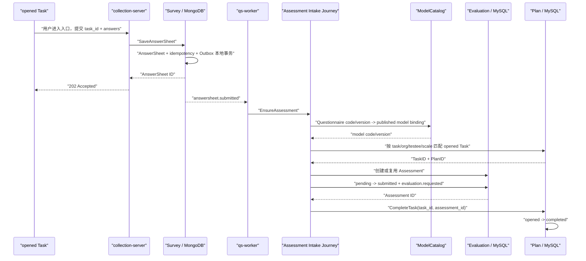
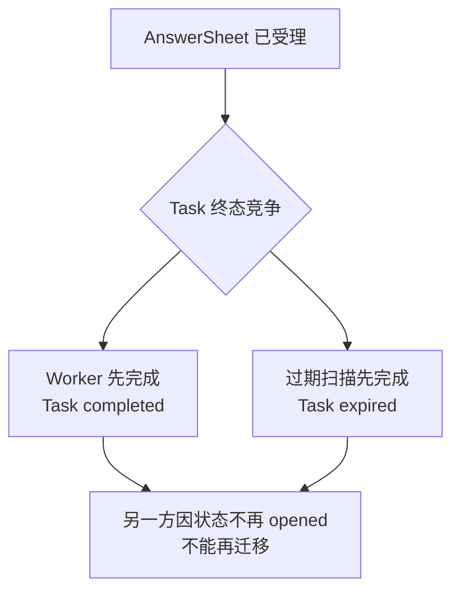

# 关键链路：从任务开放到测评履约

> 状态：**已按当前源码重写**。本文描述 `AssessmentTask` 从 `opened` 到 `completed` 的跨模块主链路，并明确区分“作答已可靠受理”、“Assessment 已提交执行”、“Task 已履约”与“Outcome / Report 已完成”。当前 `CompleteTask` 的 best-effort 回写缺口会在本文如实标注，具体改造统一收录到后续《设计问题与重构清单》。

## 1. 本文回答

本文重点回答：

- 一条 `opened Task` 为什么还不等于患者已完成测评；
- 入口 URL 中的 `task_id` 怎样穿过 collection-server、Survey、Outbox 和 Worker；
- `entry_token` 与 `task_id` 在当前实现中分别起什么作用；
- HTTP 返回 `202 Accepted` 时，Task 履约到了哪一步；
- Worker 重复消费时，为什么不会重复创建 Assessment 或重复履约；
- Questionnaire 怎样通过已发布 Binding 解析成 `scale_code`；
- 显式 `task_id` 匹配与无 `task_id` 兼容回退分别遵循什么规则；
- 为什么 Task completed 不应等待 Outcome 或 Report；
- Task 的 `assessment_id` 与 Assessment 的 `answer_sheet_id` / `origin_id` 怎样共同形成跨库追溯链；
- Assessment 已经成功提交，但 Task 回写失败时，当前系统能否自动收敛；
- 哪些是已经实现的事实，哪些只是后续需要补齐的目标。

任务如何从 `pending` 变为 `opened`，见[任务调度、入口与提醒](./23-核心设计-任务调度、入口与提醒.md)；AnswerSheet 内部的校验与事务受理，见 Survey 的[答卷校验与可靠受理](../10-survey/31-关键链路-答卷校验与可靠受理.md)；Evaluation 怎样把 AnswerSheet 建立为 Assessment，见[从 AnswerSheet 到 Assessment](../30-evaluation/30-关键链路-从AnswerSheet到Assessment.md)。

---

## 2. 30 秒结论



主链路可以概括为：

> 开放的 Task 产生一个可填写入口；用户正式提交后，Survey 先可靠保存 AnswerSheet；Worker 再把这份作答幂等地建立为 Assessment。当绑定模型的 Assessment 已经可靠提交给 Evaluation 时，Plan 才用该 Assessment 完成 Task。

这条链路有四个不能混同的事实：

| 事实 | 权威证据 | 它说明什么 | 它尚未说明什么 |
| --- | --- | --- | --- |
| Task 已开放 | MySQL `assessment_task.status=opened` | 该次履约已经允许填写 | 患者是否看到提醒 |
| AnswerSheet 已受理 | MongoDB AnswerSheet + durable Outbox | 最终作答已经成立 | Assessment 是否已创建 |
| Assessment 已提交 | MySQL Assessment `submitted` + `evaluation.requested` Outbox | 系统已可靠接手后续测评执行 | Outcome / Report 是否成功 |
| Task 已履约 | MySQL Task `completed + assessment_id` | 用户已完成这次作答义务 | 评分、解读和报告是否已完成 |

本文最重要的业务语义是：

> **Task completed 表示患者的作答义务已完成，不表示整条测评技术链已经无故障结束。**

如果 Evaluation 或 Interpretation 后续失败，应进入系统重试或人工补偿，而不应要求患者重新填写同一份答卷。

---

## 3. “测评履约”究竟是什么

### 3.1 Task 是一次应履行的作答义务

`AssessmentTask` 不是 Evaluation 的执行任务，也不是 MQ message。它表示：

> 某个受试者在某个计划中，应当在某个时间窗口完成第 N 次指定测评。

它已经冻结：

- `plan_id`；
- `seq`；
- `org_id`；
- `testee_id`；
- `scale_code`；
- `planned_at`；
- 开放后的 `open_at / expire_at / entry_token / entry_url`。

它不冻结 Questionnaire 和 AssessmentModel 发布版本。Plan 保存的是模型族 code，未来作答时使用当时最新已发布的问卷与模型绑定，历史结果则由 AnswerSheet 与 Assessment 冻结精确版本。

### 3.2 completed 的业务证据是 Assessment

Task 不直接保存 AnswerSheet ID，而是保存 `assessment_id`。这表达了当前的履约门槛：

```text
仅有 AnswerSheet
  != Task completed

AnswerSheet 已建立为有模型身份的 Assessment
+ Assessment 已提交 Evaluation
+ Task 匹配成功
  -> Task completed
```

使用 Assessment 作为履约证据有两个作用：

1. 防止一份只用于信息收集的独立 Questionnaire 答卷错误完成 Plan Task；
2. 使 Task 可以稳定追溯到后续 Outcome 和 Report 的执行主体。

### 3.3 completed 不应等待 Outcome 或 Report

如果把 Task completed 延迟到报告生成之后，会把两种不同责任混在一起：

| 责任 | 失败时该由谁恢复 | 是否应影响患者履约 |
| --- | --- | --- |
| 完整、正式提交答卷 | 患者 / 填写人 | 是 |
| 可靠保存 AnswerSheet | Survey | 提交失败前不应返回成功 |
| 建立并提交 Assessment | Evaluation Intake | 是履约技术门槛 |
| 执行算法、常模和 Decision | Evaluation | 否，应由系统重试 |
| 生成和查询报告 | Interpretation | 否，应由系统重试或补偿 |

因此，当前代码在 Assessment 成功提交 `evaluation.requested` 后立即完成 Task，不等待后续 Outcome 或 Report。这个时点符合履约语义。

---

## 4. 起点：opened Task 已经提供了什么

### 4.1 开放任务的权威事实

Task 从 `pending` 进入 `opened` 时，`TaskManagementService.OpenTask` 依次执行：

1. 按 `org_id + task_id` 读取并校验 Task；
2. 由 entry generator 生成 UUID token；
3. 生成 `{baseURL}?token=...&task_id=...` URL；
4. 把过期时间设为开放时间后 7 天；
5. 由 `TaskLifecycle.Open` 校验 `pending -> opened`；
6. 保存 Task 的状态、入口和时间字段；
7. best-effort 发布 `task.opened`。

因此，对履约链路而言，起点不是“提醒已发送”，而是：

```text
assessment_task.status = opened
+ entry_url 已保存
+ open_at / expire_at 已保存
```

`task.opened` 通知与微信消息可以失败，但不改变 Task 已开放的权威事实。患者仍然应能从任务列表或其他业务页面主动进入。

### 4.2 `entry_token` 与 `task_id` 当前不是同等凭证

当前入口 URL 同时携带：

- `token`：开放时随机生成，保存在 Task；
- `task_id`：Task 领域 ID，同样保存在 Task，并继续进入作答提交。

但当前服务端并没有形成完整的 token 验证链：

- AnswerSheet 提交 DTO 只有 `task_id`，没有 `entry_token`；
- Survey 受理不读取 Task，也不校验 token；
- Assessment Intake 匹配 Task 时不校验 token；
- token 没有使用次数、消费时间、撤销状态或绑定身份。

所以当前更准确的定义是：

> `entry_token` 是入口链接的不透明材料，而 `task_id` 才是跨模块履约关联键；但单独的 `task_id` 也不是授权凭证。

用户能否为该受试者提交答卷，当前主要由 collection-server 的身份认证与 ProfileLink 关系校验保护，不能由“持有 task_id”推导出授权。

---

## 5. `task_id` 怎样穿过作答链路

### 5.1 它是提交上下文，不是 AnswerSheet 核心身份

AnswerSheet 的核心身份仍然是 AnswerSheet ID。`task_id` 被定义为可选 `SubmissionContext`，用于说明这份答卷是从哪一次计划任务进入的。

它的完整传递路径是：

```text
Task entry URL query.task_id
  -> collection-system 提交请求
  -> collection-server SubmitAnswerSheetRequest.task_id
  -> collection application SubmissionCommitter
  -> answersheet gRPC SaveAnswerSheetRequest.task_id
  -> apiserver SubmitAnswerSheetDTO.task_id
  -> Survey SubmissionContext.taskID
  -> MongoDB answersheets.task_id
  -> answersheet.submitted.data.task_id
  -> Worker EnsureAssessmentRequest.task_id
  -> Assessment Intake Command.taskID
  -> Plan TaskAssessmentResolver
```

collection-server 允许 `task_id` 来自 JSON body；body 为空时，也会读取 URL query 中的 `task_id`。这一兼容逻辑让入口参数可以直接进入提交。

### 5.2 `task_id` 会进入业务幂等指纹

Survey 的提交指纹包含：

- writer ID；
- testee ID；
- org ID；
- Task ID；
- Questionnaire code/version；
- 排序后的题目答案。

因此，同一填写人复用同一 `idempotency_key`，但把答卷从 Task A 改挂到 Task B，会被视为业务内容冲突，而不是同一次幂等重试。

这个边界很重要：Task 归因不是一个可以在事后随意替换的展示字段，它属于这次提交意图的一部分。

### 5.3 Survey 只冻结上下文，不判定 Task 是否可履约

AnswerSheet 受理时，Survey 会校验：

- 填写人身份；
- 填写人对受试者的 ProfileLink 访问关系；
- org、testee、filler 等提交上下文完整性；
- 精确 Questionnaire version 已发布；
- 题型、选项、显示控制和 validation rules；
- 业务幂等键与指纹。

它不校验：

- Task 是否存在；
- Task 是否属于该 org / testee；
- Task 是否处于 `opened`；
- Task 的 `scale_code` 是否与当前 Questionnaire 绑定的模型相同；
- Task 是否已经超过 `expire_at`；
- `entry_token` 是否匹配。

这个责任划分保护了 Survey 的独立性：AnswerSheet 可以作为一份合法作答事实成立，而 Plan 归因由后续 Journey 判定。代价是，当 `task_id` 无效时，同步 `202` 不会立即报告“未履约”。

---

## 6. `202 Accepted` 是作答成功，不是 Task 已完成

### 6.1 202 之前已经成立的事实

collection-server 只在 apiserver 返回可靠 AnswerSheet ID 后才响应 `202`。当前 MongoDB 本地事务原子保护：

1. AnswerSheet document；
2. 提交幂等记录；
3. `answersheet.submitted` Outbox record。

事件中携带 AnswerSheet ID、Questionnaire code/version、org、testee、filler、Task ID、request ID 和提交时间。

因此 `202` 的可靠承诺是：

> 作答事实已经持久化，而且后续处理意图不只存在于进程内存中。

### 6.2 202 之后才开始的事实

`202` 不承诺：

- Worker 已经收到事件；
- 基础题分已派生；
- Questionnaire 已解析到 AssessmentModel Binding；
- Plan Task 已匹配；
- Assessment 已创建；
- `evaluation.requested` 已提交；
- Task 已转为 `completed`；
- Outcome 或 Report 已生成。

客户端可以使用 `answersheet_id` 轮询 assessment-readiness，观察 Assessment 是 `pending` 还是 `ready`。但当前没有一个与之对称的“Task fulfillment readiness”投影，不能直接从该接口看出 Task 回写是否成功。

---

## 7. Worker 怎样把可靠作答交给 Journey

### 7.1 `answersheet.submitted` 是可靠业务事件

`configs/events.yaml` 把 `answersheet.submitted` 定义为：

| 属性 | 值 | 履约链路含义 |
| --- | --- | --- |
| domain | `survey/answersheet` | 作答提交事实属于 Survey |
| aggregate | `AnswerSheet` | 事件描述一份最终答卷 |
| topic | `assessment-lifecycle` | 进入测评生命周期通道 |
| delivery | `durable_outbox` | 不能只做 best-effort 通知 |
| handler | `answersheet_submitted_handler` | qs-worker 的统一入口 |

Outbox 保证“需要继续处理”这个意图不因进程崩溃丢失，但不保证 exactly-once。relay 重发、MQ redelivery 与 Worker 超时都可能导致同一 AnswerSheet 多次进入 handler。

### 7.2 Redis gate 只做重复降噪

Worker 使用 AnswerSheet ID 级别的 Redis lease：

| 结果 | 行为 | 可靠性解释 |
| --- | --- | --- |
| 获取成功 | 执行 `EnsureAssessment` | 避免并发重放 |
| 未获取 | 当前消息按重复跳过 | 假定另一消费者正在处理 |
| Redis 不可用 | degraded-open，继续执行 | 不让非权威锁阻断业务事件 |
| 获取报错 | degraded-open，继续执行 | 最终正确性交给应用与数据库幂等 |

这意味着 Redis 不是履约账本。删除锁不会删除 Task 或 Assessment，Redis 故障也不能作为重复 Assessment 的理由。

### 7.3 Worker 不拥有 Plan 匹配规则

handler 只把事件转成 `EnsureAssessmentRequest`，携带：

- AnswerSheet ID；
- Questionnaire code/version；
- org / testee / filler；
- 可选 Task ID；
- 无 Task ID 时的 `adhoc` 来源提示；
- 通过 gRPC metadata 继续传递的 request ID。

Worker 不读 Task 仓储、不计算基础题分、不解析 Binding、不直接修改 Task。这些规则被收敛在 apiserver 的 Assessment Intake Journey 中。

---

## 8. Journey 先解析模型，再识别 Plan Task

### 8.1 为什么不能用 Questionnaire code 直接匹配 Task

Task 保存的是 `scale_code`，AnswerSheet 冻结的是 Questionnaire code/version。这两个 code 属于不同领域身份，不能假定它们相等。

因此 Journey 的顺序是：

```text
Questionnaire code/version
  -> ModelCatalog ResolveAssessmentBinding
  -> model kind/subKind/algorithm/code/version/title
  -> 使用 model code 对比 Task.scale_code
```

这个先后顺序保护了两个边界：

1. Plan 不需要知道 Questionnaire 与模型发布版本的内部绑定；
2. 同一模型族未来升级 Questionnaire version 时，仍然可以履约同一 Plan code。

### 8.2 无 Binding 时不能履约 Task

如果精确 Questionnaire code/version 没有发布模型 Binding：

- `modelCode` 为空；
- 显式 Task 匹配会因缺少 `scale_code` 而跳过；
- 自动 opened Task 回退也不会执行；
- Task 保持 `opened`。

这个结果符合业务边界：独立 Questionnaire 可以产生 AnswerSheet，但不能履约一个要求完成测评模型的 Plan Task。

需要同时注意：当前 Journey 在无 Binding 时仍会创建 unbound pending Assessment。这是 Survey / Evaluation 文档已标记的实现偏差；对 Plan 来说，关键事实是该 Assessment 不会完成 Task。

---

## 9. 显式 Task 匹配：什么样的作答能履约

### 9.1 显式 `task_id` 优先

事件中有 `task_id` 时，Journey 调用 `ResolveTaskByIDForAssessment`。当前必须同时满足：

| 校验 | 目的 | 失败后的当前行为 |
| --- | --- | --- |
| Task ID 格式合法 | 防止无效 ID 进入仓储 | 记录警告，返回未匹配 |
| Task 存在 | 找到权威任务 | 记录警告，返回未匹配 |
| Task.orgID = command.orgID | 保护机构边界 | 未匹配 |
| Task.testeeID = command.testeeID | 保护受试者归属 | 未匹配 |
| Task.status = opened | 只允许可填写任务履约 | 未匹配 |
| model code 非空 | 独立问卷不能履约测评 | 未匹配 |
| Task.scaleCode = model code | 保护测评类型一致 | 未匹配 |

成功后 resolver 只返回跨模块所需的最小上下文：

```text
TaskID
PlanID
Completed
```

它不把 Plan 领域实体直接泄露给 Evaluation。

### 9.2 当前没有校验的条件

显式 resolver 当前不校验：

- `entry_token`；
- `expire_at > now`；
- 父 Plan 是否仍为 active；
- filler 是否就是 Task 的受试者或指定观察者；
- AssessmentModel version；
- Questionnaire code 是否与 Task 有直接引用关系。

其中版本不校验是既定业务选择：Plan 只保存 code，未来任务应允许使用最新已发布版本。

token、实时过期和父 Plan 状态则是另一类问题。例如，某条 Task 已超过 `expire_at`，但过期扫描尚未把它改成 `expired`，resolver 仍会因其状态是 `opened` 而允许履约。这是当前代码的实际边界。

### 9.3 匹配失败不会撤销 AnswerSheet

显式 Task 匹配失败时，当前 Journey 不返回 Plan 业务错误，而是：

1. 记录匹配失败原因；
2. 不设置 `origin_type=plan`；
3. 对有 Binding 的问卷仍然创建或复用 Assessment；
4. Assessment 以 `adhoc` 来源继续执行；
5. Task 保持 `opened`。

这一行为保护了“作答事实不因归因失败而消失”，但也产生了一个产品可见性缺口：用户可能已看到“答卷提交成功”，但对应 Task 仍然显示未完成。

---

## 10. 无 `task_id` 时的兼容性自动匹配

### 10.1 为什么存在回退

历史客户端或非 Plan 专用入口可能不传 `task_id`。当 AnswerSheet 已解析到模型 code 时，Journey 会尝试根据：

```text
org_id + testee_id + scale_code + status=opened
```

自动找到该受试者当前应履约的 Task。

### 10.2 只在候选唯一时自动归因

回退 resolver 会读取受试者的 Task 列表，然后过滤：

- org 匹配；
- scale code 匹配；
- status 为 opened。

结果分为：

| 候选数 | 当前行为 | 设计语义 |
| --- | --- | --- |
| 0 | 不匹配 Plan | 当作 adhoc Assessment |
| 1 | 自动匹配并完成该 Task | 兼容缺少 task_id 的老链路 |
| 2 或更多 | 记录二义性并拒绝猜测 | 不按时间或顺序擅自选一条 |

“多候选时不猜测”是正确的数据安全边界。同一受试者可能因为重复加入、不同 Plan 或历史异常，同时有多条相同 scale 的 opened Task。仅凭 `planned_at` 最早并不能证明这份答卷就属于它。

### 10.3 回退是兼容机制，不应变成主契约

新的 Plan 入口应始终传递明确 `task_id`。如果把自动推断当作正常契约，系统会越来越依赖“当时刚好只有一条候选”这个脆弱前提。

更稳定的边界是：

> 显式 `task_id` 是 Plan 履约主契约；唯一 opened Task 推断只是过渡期兼容。

---

## 11. Assessment 的幂等建立与可靠提交

### 11.1 创建前先查找已有 Assessment

Journey 在创建前先按 AnswerSheet ID 查询 Assessment：

```text
FindByAnswerSheetID(answerSheetID)
```

并且 MySQL `assessment.answer_sheet_id` 有唯一索引。因此，最终幂等不依赖 Worker Redis lease，而是：

```text
AnswerSheet ID
  -> at most one Assessment
```

如果两个 Worker 在 Redis 降级时并发创建，一方会命中数据库唯一约束；Journey 会重新读取已存在 Assessment，而不是再创建一份。

### 11.2 先 pending，再 submitted

对有 Binding 的 AnswerSheet，Assessment 通过两个应用动作建立：

1. `CreateForAnswerSheet`：保存 pending Assessment；
2. `SubmitForEvaluation`：转为 submitted，并在 MySQL 本地事务中阶段化 `evaluation.requested`。

拆成两步意味着系统需要恢复“Assessment 已创建，自动提交失败”这个中间态。当 `answersheet.submitted` 重放时：

- 已有 Assessment 仍为 pending：再次提交；
- 已经 submitted / evaluated / failed：不重复 Submit；
- 建立和提交均幂等完成后，才进入 Plan 回写。

### 11.3 Plan 来源怎样冻结进 Assessment

Task 匹配成功后，Journey 会把 Assessment 创建命令改为：

```text
origin_type = plan
origin_id   = matched.PlanID
```

注意 `origin_id` 是 Plan ID，不是 Task ID。Task ID 冻结在 AnswerSheet 提交上下文和 Task 自身，Assessment 主表用 Plan ID 表示来源类别。

因此完整追溯需要组合多个事实：

```text
AnswerSheet.task_id
  -> AssessmentTask.id
  -> AssessmentTask.assessment_id
  -> Assessment.id

Assessment.answer_sheet_id
  -> AnswerSheet.id

Assessment.origin_type = plan
+ Assessment.origin_id = Plan.id
```

---

## 12. Task 完成回写的真实执行顺序

### 12.1 新建 Assessment 的正常路径

正常情况下的顺序是：

```text
计算并保存 Survey 基础题分
  -> 解析 Model Binding
  -> 匹配 opened Task
  -> 创建 pending Assessment
  -> SubmitForEvaluation
  -> Assessment submitted + evaluation.requested Outbox
  -> CompleteTask(taskID, assessmentID)
  -> Task completed + assessment_id
```

如果 `SubmitForEvaluation` 失败，Journey 直接返回错误，不调用 `CompleteTask`。Worker handler 也会返回错误，交给消息重投和重试治理。

所以当前主链路不会在“Assessment 只是 pending，尚未产生可靠执行请求”时就把 Task 标记为 completed。

### 12.2 已有 Assessment 的重放路径

如果 Worker 重放时 Assessment 已经存在：

| Assessment 状态 | Journey 行为 | 是否可尝试完成 Task |
| --- | --- | --- |
| pending + bound | 再次 SubmitForEvaluation | Submit 成功后可以 |
| submitted | 不重复 Submit | 可以 |
| evaluated | 不重复 Submit | 可以 |
| failed | 不重复 Submit | 可以，因患者作答义务已完成 |
| unbound pending | 不提交 | 不可以，无 Plan Task 匹配 |

对 failed Assessment 仍可完成 Task 不是疏忽。它再次体现：Task 追踪患者是否已履行作答义务，Evaluation 失败由运行治理单独处理。

### 12.3 `CompleteTask` 的领域动作

`TaskManagementService.CompleteTask` 依次：

1. 解析 Assessment ID；
2. 按 org 范围读取 Task；
3. 要求 Task 当前为 `opened`；
4. 要求 Assessment ID 非零；
5. `TaskLifecycle.Complete` 设置：
   - `status=completed`；
   - `completed_at=now`；
   - `assessment_id`；
   - `task.completed` 领域事件；
6. 保存 Task；
7. best-effort 发布 `task.completed`。

Task 完成保存与 `task.completed` 发布不是可靠 Outbox 事务。事件发布失败不会回滚 Task completed，因为 task 生命周期事件当前被定义为 best-effort 记录与通知。

### 12.4 数据库的两个最终约束

| 约束 | 保护的事实 |
| --- | --- |
| `assessment.uk_answer_sheet_id` | 一份 AnswerSheet 至多建立一个 Assessment |
| `assessment_task.uk_assessment_id` | 一个 Assessment 至多完成一条 Task |

这两个唯一约束形成：

```text
one AnswerSheet
  -> at most one Assessment
  -> at most one completed Task
```

但它们不是外键式完整性证明。`assessment_task.assessment_id` 当前没有在 `CompleteTask` 内再次查询 Assessment 来验证 org、testee、model 和 AnswerSheet 归属，它信任上游 Journey resolver 已经做对匹配。

---

## 13. 跨 MongoDB 与 MySQL 的一致性边界

### 13.1 不存在一个端到端大事务

履约链路至少涉及：

- MongoDB：AnswerSheet、提交幂等事实、Survey Outbox；
- MySQL：Assessment、Evaluation Outbox、AssessmentTask；
- Redis：Worker duplicate-suppression lease；
- MQ：`answersheet.submitted` 和 `evaluation.requested` 投递。

系统没有用分布式事务同时锁定 MongoDB 与 MySQL。它依靠两个本地可靠边界与一个当前较弱的回写边界：

| 边界 | 事实 | 当前保障 |
| --- | --- | --- |
| Survey 受理 | AnswerSheet + `answersheet.submitted` | Mongo transaction + durable Outbox |
| Evaluation 提交 | Assessment submitted + `evaluation.requested` | MySQL transaction + durable Outbox |
| Plan 回写 | Task completed + assessment_id | 单表保存，Journey best-effort 调用 |

前两个边界都有 durable Outbox 推动重放。第三个边界没有专属的可靠待办事实。

### 13.2 最关键的不一致窗口

当前代码的关键顺序是：

```text
Assessment submitted 成功
  -> completePlanBestEffort
  -> 忽略 CompleteTask 的 result 和 error
  -> EnsureAssessment 仍返回成功
  -> Worker ACK answersheet.submitted
```

因此，如果 MySQL 中 Assessment 已经 submitted，但 Plan Task 保存失败：

- AnswerSheet 是成功的；
- Assessment 是成功的；
- `evaluation.requested` 是可靠的；
- Worker 会把 `answersheet.submitted` 视为处理成功；
- Task 却可能仍然为 `opened`。

这会造成：

- 患者任务列表仍显示待完成；
- 同一 Task 可能被再次填写；
- Plan 履约率和 Statistics 低于真实情况；
- Assessment 与 Task 追溯链断裂；
- 运营只能从多个数据源人工排查。

### 13.3 重放“可以”修复，但不“保证”修复

如果在 Task 仍为 opened 时，同一 `answersheet.submitted` 事件再次进入 Journey：

1. 会复用已有 Assessment；
2. 显式 Task 仍能匹配；
3. 会再次调用 `CompleteTask`；
4. 因此有机会修复。

但是 `CompleteTask` 失败本身不会让 handler 返回错误，也不会生成新的可靠待办。原事件被 ACK 后，系统不保证还会有下一次重放。

所以当前准确结论是：

> **Journey 是可重入的，但 Task 完成回写还不具备可证明的最终收敛性。**

### 13.4 目标边界应该是什么

后续改造不应把 MongoDB、Assessment 和 Task 硬塞进一个分布式事务。更合理的目标是：

> 一旦系统已经为某条 opened Task 成功建立并提交 Assessment，必须留下一份可重试、可观测、可人工补偿的 Task completion 意图，直到 Task 成功 completed 或进入明确的人工治理状态。

具体可选方案包括 Plan fulfillment Outbox / inbox、持久化 pending action，或基于 AnswerSheet–Assessment–Task 关联的周期调和器。本文不提前锁定方案，只固化验收语义。

---

## 14. 幂等、并发与重复履约

### 14.1 同一提交重试

同一填写人用相同 `idempotency_key` 重试相同内容时：

```text
same business intent
  -> same effective AnswerSheet
  -> same Assessment
  -> same Task completion
```

AnswerSheet 指纹保护提交意图，Assessment 唯一键保护执行实例，Task `assessment_id` 唯一键保护一个 Assessment 不被同时归属两条 Task。

### 14.2 同一 Task 被真正提交两次

如果用户使用不同幂等键提交两份不同 AnswerSheet，且两者都携带同一 `task_id`：

1. 两份 AnswerSheet 都可能作为合法作答事实保存；
2. 先进入 Journey 并完成回写的 Assessment 会把 Task 转为 completed；
3. 后进入的事件因 Task 已非 opened，不再匹配 Plan；
4. 后一份有 Binding 的答卷仍可创建 adhoc Assessment，但不会覆盖 Task.assessment_id。

因此 Task 会保留“先成功履约者获胜”的结果，但系统并没有在 AnswerSheet 受理前阻止第二份提交。如果产品要求一个 Task 只能创建一份有效 AnswerSheet，还需要更早的 Task-scoped 受理契约。

### 14.3 Task 完成本身不是完全幂等命令

`TaskLifecycle.Complete` 只允许 `opened -> completed`。已经 completed 的 Task 再次直接调用 `CompleteTask` 会因状态不是 opened 而失败。

当前 Journey 之所以对正常重放表现幂等，是因为 Task resolver 不会返回已 completed Task，后续不再调用 `CompleteTask`。

这是编排层幂等，而不是 `CompleteTask` 命令自身支持“同一 Task + 同一 Assessment 重复返回成功”。后续如果引入独立 fulfillment 消费者，应重新明确命令幂等契约。

---

## 15. 过期、取消、终止与并发竞争

### 15.1 只有 opened Task 能正常履约

| Task 状态 | 能否匹配 Assessment | 结果 |
| --- | --- | --- |
| pending | 否 | 还未开放，答卷按 adhoc 处理 |
| opened | 是 | 通过 org/testee/scale 校验后可完成 |
| completed | 否 | 不覆盖已有 assessment_id |
| expired | 否 | 不完成过期任务 |
| canceled | 否 | 不完成已取消任务 |

### 15.2 提交与过期扫描可以并发

假设 AnswerSheet 已经提交，但 Worker 尚未处理，同时 Plan scheduler 尝试过期 Task：



当前 Task 持久化对象确实保存 `version` 字段，但通用 `UpdateAndSync` 路径只直接调用 GORM `Updates`，在 Plan 仓储中看不到显式的 `WHERE version = ?`、版本递增与 `RowsAffected=0` 冲突翻译。因此，不能仅凭数据表有 `version` 就声称并发终态一定受乐观锁保护。业务上同样要接受：“用户在截止附近已提交，异步匹配时 Task 已 expired”是可能的。

由于 resolver 只看处理时的 Task 状态，它没有使用 AnswerSheet `submitted_at` 判定“用户是否在截止前提交”。这个竞争边界需要后续在业务上明确。

### 15.3 终止 Enrollment 不撤销已受理答卷

患者终止加入会取消尚未完成的 Task。但如果 AnswerSheet 在取消前已经可靠受理，它不会因后续 Task canceled 而被删除。Journey 仍可以为有 Binding 的答卷建立 adhoc Assessment，但不再用它完成已取消 Task。

这符合作答不可撤销的原则，但会对“终止前已提交、后台尚未处理”的业务归因产生边界，需要与过期竞争一起治理。

---

## 16. 失败矩阵：哪些会重试，哪些会静默脱链

| 失败点 | 客户端已收到 202 | 当前处理 | Task 结果 |
| --- | --- | --- | --- |
| 提交前问卷或答案校验失败 | 否 | 同步拒绝 | 仍 opened |
| MongoDB 可靠事务失败 | 否 | 返回 503 / 不得声称成功 | 仍 opened |
| Outbox relay / MQ 短暂失败 | 是 | durable Outbox 继续投递 | 暂时 opened，预期后续收敛 |
| Worker Redis 锁不可用 | 是 | degraded-open | 依赖 Journey / DB 幂等 |
| 基础题分派生失败 | 是 | handler 失败，进入重投 | 仍 opened |
| Binding 查询报错 | 是 | handler 失败 | 仍 opened |
| 没有 Binding | 是 | 当前创建 unbound pending Assessment | 仍 opened |
| 显式 Task ID 无效/不匹配 | 是 | 记日志，Assessment 按 adhoc 继续 | 仍 opened |
| 无 Task ID 且有多个候选 | 是 | 拒绝猜测，Assessment 按 adhoc 继续 | 多条都仍 opened |
| Assessment 创建失败 | 是 | handler 失败，重投 | 仍 opened |
| Assessment 自动提交失败 | 是 | 保留 pending，重放时补提交 | 仍 opened |
| Evaluation 算法执行失败 | 是 | Evaluation 重试/人工治理 | 应已 completed |
| CompleteTask 回写失败 | 是 | 错误被 Journey 忽略 | **可能长期 opened** |
| `task.completed` 发布失败 | 是 | 记录错误，不回滚 | 仍是 completed，但旁路通知可丢 |
| Report 生成失败 | 是 | Interpretation 重试/人工治理 | 仍 completed |

这张表展示了主链路的一个明显特征：前两段用 durable Outbox 保护，而 Plan 回写段还是 best-effort。

---

## 17. 查询、统计与可观测性

### 17.1 用户看到的 Task 状态以 MySQL 为准

Plan 列表、任务详情和 Statistics 都以 `assessment_task` 为履约事实源。完成数、过期数与履约率不会因 Assessment 已经 submitted 而自动修正；Task 没有回写，统计就会把它视为未完成。

因此，Assessment 和 Task 之间的不一致不是只影响一条日志，它会直接污染业务指标。

### 17.2 当前可用的追踪键

| 键 | 主要出现位置 | 用途 |
| --- | --- | --- |
| request_id | collection 日志、Survey Outbox payload、Worker gRPC metadata | 串联一次入口请求 |
| idempotency_key | collection / Survey 提交 | 识别一次业务提交意图 |
| answersheet_id | MongoDB、Outbox、Worker、Assessment | 从作答事实追到执行实例 |
| event_id | Outbox / MQ / Worker 日志 | 追踪一次事件事实 |
| task_id | 入口、AnswerSheet、事件、Plan 日志 | 追踪一次应履行义务 |
| assessment_id | Assessment、Task、Evaluation / Interpretation | 追踪测评执行与报告 |
| plan_id | Task、Assessment origin | 追踪周期计划来源 |

### 17.3 当前可观测性的缺口

当前已经有：

- AnswerSheet 提交各阶段 latency / outcome 指标；
- assessment-readiness 状态与 submit-to-ready 时长；
- Worker duplicate suppression 的 locked / skipped / degraded 观测；
- Worker 处理日志中的 request ID、event ID 和 AnswerSheet ID；
- TaskManagementService 内部的 complete_task 成功/失败日志。

但缺少：

- `assessment_submitted_but_task_opened` 数量；
- Task completion 回写延迟；
- Task resolver 失败原因分类指标；
- 自动回退匹配次数和多候选冲突数；
- Plan 履约待重试、最终失败和人工补偿的账本；
- 从 `answersheet_id` 一键追踪到 Task 回写结果的组合诊断接口。

在没有这些投影之前，运营端看到“患者说已提交，任务却未完成”时，仍需要跨 MongoDB、Assessment 与 Task 人工对账。

---

## 18. 四个典型场景

### 18.1 正常 Plan 履约

```text
Task opened
  -> 患者从入口填写
  -> task_id 进入 AnswerSheet
  -> 202 Accepted
  -> Worker EnsureAssessment
  -> Binding.modelCode == Task.scaleCode
  -> Assessment submitted
  -> Task completed(assessment_id)
  -> Evaluation / Interpretation 后续运行
```

这是本文定义的标准成功链路。

### 18.2 家长代填或观察者填写

```text
Task.testee_id = 患者
AnswerSheet.filler_id = 家长
AnswerSheet.testee_id = 患者
ProfileLink = active
```

Task resolver 校验的是 `testee_id`，而不是要求 filler 与 testee 相同。因此家长代年龄较小的患者填写，与家长作为观察者填写家长版量表，都可以履约同一类 Plan Task。

当前 Plan 只关心“谁是受试者”和“这份答卷是否已经通过 Actor / ProfileLink 授权提交”，不再把“家长代填”与“家长观察量表”建模成两种 Task 状态。

### 18.3 用户从普通问卷入口提交，未携带 Task ID

```text
有且仅有一条同 org/testee/scale opened Task
  -> 兼容回退匹配
  -> 可完成 Task

有多条候选
  -> 拒绝猜测
  -> Assessment adhoc
  -> Task 仍 opened
```

这个场景能解释为什么应将 `task_id` 从入口一直传到正式提交，而不依赖后端根据时间和模型猜测。

### 18.4 Assessment 已完成，Task 仍 opened

排查顺序应该是：

1. 按 AnswerSheet ID 查 Assessment；
2. 确认 Assessment 的 Questionnaire / Model 身份；
3. 从 AnswerSheet submission context 取得 Task ID；
4. 检查 Task 的 org/testee/scale/status；
5. 检查 Worker `ensure_assessment` 日志；
6. 检查 `complete_task` 保存错误或状态竞争；
7. 确认 Task 是否已 expired/canceled，以及是否还允许人工归因。

当前系统没有专用的履约补偿工具。不应直接修改 Task 表，因为还需校验 Assessment 的 org、testee、model 和 AnswerSheet 链路，并留下审计事实。

---

## 19. 为什么不选其他履约设计

### 19.1 方案一：AnswerSheet 一保存就同步完成 Task

优点是链路短，用户提交后 Task 立即变化。

问题是：

- Survey 必须直接依赖 Plan；
- 独立 Questionnaire 也可能错误完成测评 Task；
- 问卷与模型绑定尚未解析；
- AnswerSheet 成功但 Assessment 永远无法建立时，Task 已被误标完成；
- MongoDB 提交路径被迫引入 MySQL 跨库事务问题。

因此该方案不符合当前模块边界。

### 19.2 方案二：等 Report 成功再完成 Task

优点是 Task completed 表面上等于整条技术链成功。

问题是：

- 把患者履约与系统后台故障混在一起；
- Evaluation / Interpretation 暂时失败会让患者看到“未完成”；
- 可能引导患者重复提交同一份答卷；
- Plan 必须理解 Outcome 与 Report 状态机；
- 报告生成时间变成履约延迟。

因此它也不符合领域边界。

### 19.3 当前合理边界：Assessment 已可靠提交

当前选择在：

```text
Assessment submitted
+ evaluation.requested durable Outbox 已建立
```

之后完成 Task，它在“作答已成立”与“报告已完成”之间选择了正确的业务分界点。

真正需要改进的不是这个时点，而是：

> 从“Assessment 已提交”到“Task 已完成”的回写意图，必须从可忽略的 best-effort 调用升级为可收敛的业务过程。

---

## 20. 当前实现、目标契约与重构项

| 主题 | 当前实现 | 目标契约 | 归属 |
| --- | --- | --- | --- |
| Task ID 传递 | 已穿过入口、AnswerSheet、Outbox、Worker | 保持为显式主契约 | 已实现 |
| 家长代填 | 以 filler/testee 分离 + ProfileLink 授权 | Plan 只按 testee 履约 | 已实现 |
| Model 对 Task 匹配 | 先解析 Binding，再比对 scale code | 继续保持跨模块身份转换 | 已实现 |
| 无 Task ID 回退 | 候选唯一才归因 | 仅作兼容机制并可观测 | 需治理 |
| Task 无效的处理 | 转 adhoc，Task 保持 opened | 保留 AnswerSheet，但向用户/运营暴露未归因状态 | 需重构 |
| entry token | 生成与保存，不参与提交验证 | 明确它是链接材料还是真实凭证 | 需决策 |
| 过期判断 | resolver 只看 opened，不比较 now/expireAt | 明确按提交时还是消费时判断 | 需决策 |
| Assessment 幂等 | AnswerSheet 唯一键 + Journey 可重入 | Redis 故障不影响正确性 | 已实现 |
| Task 完成时点 | Assessment submitted 后 | 不等 Outcome / Report | 语义已确认 |
| Task 完成回写 | 错误被忽略 | 必须持久重试、可观测、可补偿 | **高优先级重构** |
| CompleteTask 安全性 | 信任上游 resolver | 命令自身校验 Assessment 归属或只接受可验证的 fulfillment 意图 | 需重构 |
| 履约对账 | 无专项调和器 | 可发现 Assessment–Task 断链并安全修复 | 需重构 |
| `task.completed` | best-effort | 若只做通知可保持；若有业务消费者则需重新分类 | 需审核消费者 |

本文不将这些问题伪装成已经实现的保证。后续 `90-设计问题与重构清单.md` 需要把它们转成优先级、依赖关系、迁移方案和验收用例。

---

## 21. 建议的验收场景

后续修改履约链路时，至少要保护以下行为：

### 21.1 正常契约

- opened Task + 正确 task/org/testee/scale 可完成；
- Task completed 冻结正确 Assessment ID；
- Assessment 的 origin 是 `plan + plan_id`；
- Task completed 发生在 `evaluation.requested` 可靠提交之后；
- Evaluation 或 Report 失败不撤销 Task completed。

### 21.2 身份与匹配

- org 不匹配不完成 Task；
- testee 不匹配不完成 Task；
- scale code 不匹配不完成 Task；
- pending / completed / expired / canceled Task 不被新 Assessment 覆盖；
- 家长以合法 ProfileLink 为患者填写可完成患者 Task；
- 无 Binding 的独立 Questionnaire 不完成 Task。

### 21.3 幂等与并发

- 同一 `idempotency_key + 相同内容` 返回同一 AnswerSheet；
- 同一 AnswerSheet 的多次 Worker 重放只产生一个 Assessment；
- Redis 不可用时仍不产生重复 Assessment；
- Assessment 已存在且 pending 时，重放能补提交；
- 同一 Assessment 不能完成两条 Task；
- 同一 Task 的重复 AnswerSheet 不覆盖首个履约 Assessment。

### 21.4 故障恢复

- Assessment 创建后、自动提交前崩溃，重放后能补提交；
- Assessment submitted 后、Task completed 前崩溃，最终能收敛到 completed；
- Task 完成回写数据库短暂失败，不需要患者重复填写；
- 达到自动重试上限后，有可见的人工补偿项、原因和审计结果；
- 调和器只修复经 org/testee/scale/AnswerSheet 校验合法的关联。

### 21.5 截止时间竞争

- 在 `expire_at` 之前提交、之后异步消费的明确业务结果；
- 过期扫描与 Task completion 并发时只能留下一个终态；
- 取消/终止与已受理 AnswerSheet 并发时，AnswerSheet 不丢失，Task 归因结果可解释。

---

## 22. 当前测试证据与缺口

### 22.1 已有证据

当前代码已有测试保护：

- collection AnswerSheet DTO 到 gRPC 的 Task ID 传递；
- Survey `SubmissionContext` 中 org/testee/filler/task 的构建与 Mongo mapper 往返；
- AnswerSheet 事件携带提交上下文；
- AnswerSheet 可靠受理只在持久化成功后返回；
- Worker 的 locked、duplicate-skip、Redis degraded-open 路径；
- request ID 从事件传递到 `EnsureAssessment` gRPC metadata；
- Assessment 自动提交失败时返回硬失败；
- Worker 重放可以补提交已有 pending Assessment；
- Evaluation Intake 创建 / 提交与 Assessment 唯一约束。

### 22.2 主要测试缺口

当前 `assessmentintake/service_test.go` 主要保护基础计分、Binding、Assessment 创建和补提交，但没有系统覆盖 Plan 履约协作。后续应补齐：

- 显式 Task 匹配的全部准入条件；
- 无 Task ID 的唯一候选与多候选路径；
- Assessment 提交与 `CompleteTask` 的严格顺序；
- `CompleteTask` 失败时的当前特征测试与未来收敛测试；
- 已提交/失败 Assessment 的 Task 履约语义；
- 同一 Task 多 AnswerSheet 并发；
- Task 过期/取消与 Worker 归因并发；
- 从 MongoDB AnswerSheet + Outbox 到 MySQL Assessment + Task 的跨模块集成测试。

对当前实现而言，“Assessment 已提交但 Task 回写失败”正是最需要一个失败注入测试固化的断点。

---

## 23. 源码事实矩阵

| 关键事实 | 主要代码位置 |
| --- | --- |
| Task 开放、入口和完成命令 | [`application/plan/task_management_service.go`](../../../internal/apiserver/application/plan/task_management_service.go) |
| Task 状态迁移 | [`domain/plan/task_lifecycle.go`](../../../internal/apiserver/domain/plan/task_lifecycle.go) |
| Task 实体与事件 | [`domain/plan/assessment_task.go`](../../../internal/apiserver/domain/plan/assessment_task.go) |
| Task 入口 URL 与 7 天过期窗口 | [`infra/plan/entry_generator.go`](../../../internal/apiserver/infra/plan/entry_generator.go) |
| collection 提交与 query task_id 兼容 | [`answersheet_handler.go`](../../../internal/collection-server/transport/rest/handler/answersheet_handler.go) |
| collection 到 apiserver 的 Task ID 传递 | [`submission_committer.go`](../../../internal/collection-server/application/answersheet/submission_committer.go) |
| Survey AnswerSheet 提交上下文 | [`domain/survey/answersheet/types.go`](../../../internal/apiserver/domain/survey/answersheet/types.go) |
| AnswerSheet 指纹包含 Task ID | [`port/answersheetsubmit/meta.go`](../../../internal/apiserver/port/answersheetsubmit/meta.go) |
| AnswerSheet MongoDB 持久化 | [`infra/mongo/answersheet`](../../../internal/apiserver/infra/mongo/answersheet/) |
| `answersheet.submitted` payload | [`pkg/eventing/payload/answersheet.go`](../../../internal/pkg/eventing/payload/answersheet.go) |
| Worker 重复降噪与 EnsureAssessment | [`worker/handlers/answersheet_handler.go`](../../../internal/worker/handlers/answersheet_handler.go) |
| 跨 Survey / ModelCatalog / Plan / Evaluation 编排 | [`application/journey/assessmentintake/service.go`](../../../internal/apiserver/application/journey/assessmentintake/service.go) |
| 显式 Task 与兼容回退匹配 | [`application/plan/task_assessment_resolver.go`](../../../internal/apiserver/application/plan/task_assessment_resolver.go) |
| Assessment 创建、提交与查找 | [`application/evaluation/intake`](../../../internal/apiserver/application/evaluation/intake/) |
| Assessment / Task 唯一约束 | [`migrations/mysql`](../../../internal/pkg/migration/migrations/mysql/) |
| 事件 delivery 分类 | [`configs/events.yaml`](../../../configs/events.yaml) |
| Plan 履约统计 | [`infra/mysql/statistics`](../../../internal/apiserver/infra/mysql/statistics/) |

---

## 24. 阅读完成后应该记住什么

1. opened Task 是“可履行的义务”，不是“已履约”。
2. `task_id` 是跨模块归因主键，但不是授权凭证；当前 `entry_token` 还没有形成服务端验证契约。
3. `202 Accepted` 表示 AnswerSheet 与后续事件意图已可靠持久化，不表示 Task 已 completed。
4. Plan Task 匹配必须在 Model Binding 解析之后进行，因为 Task 保存 model code，AnswerSheet 保存 Questionnaire identity。
5. 显式 Task 匹配要求 org、testee、opened 和 scale 一致；无 Task ID 回退只在候选唯一时生效。
6. Task completed 的正确时点是 Assessment 已可靠提交给 Evaluation，不需要等待 Outcome 或 Report。
7. AnswerSheet–Assessment 与 Assessment–Task 唯一约束保护了最终关联，Redis 锁只负责重复降噪。
8. Assessment submitted 到 Task completed 之间当前仍是 best-effort 回写；可重入不等于一定会重放，因此还不具备最终收敛保证。
9. `task.completed` 事件是 best-effort 通知，MySQL Task 状态才是履约真值。
10. 后续最重要的改造不是改变履约时点，而是让 Task completion 意图可持久重试、可观测、可对账、可审计补偿。
