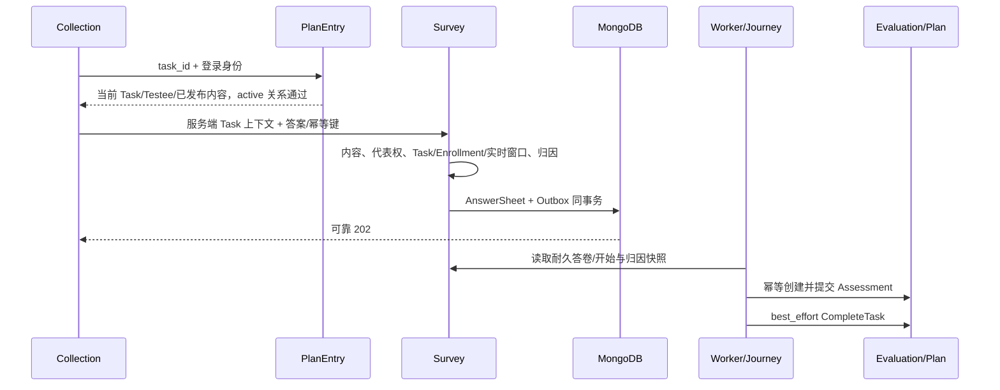

# 关键链路：从任务开放到测评履约

> 状态：当前 TaskID 入口、同步来源校验与异步履约链路。Task/AnswerSheet/Assessment 属于不同完成点；已实现本地事务不构成跨库端到端原子提交。

## 1. 本文回答

本篇解释 opened Task 如何成为一次可靠作答、生成 Assessment 并回写 completed，以及这些边界间的拒绝、幂等与失败窗口。
开放与提醒见[调度设计](./23-核心设计-任务调度、入口与提醒.md)，状态/事务见[一致性设计](./21-核心设计-状态、幂等与数据一致性.md)，精确版本见[引用与版本](./22-核心设计-测评引用与版本语义.md)。

## 2. 30 秒结论

```mermaid
sequenceDiagram
    participant C as Collection
    participant P as PlanEntry
    participant S as Survey
    participant M as MongoDB
    participant J as Worker/Journey
    participant E as Evaluation/Plan
    C->>P: task_id + 登录身份
    P-->>C: 当前 Task/Testee/已发布内容，active 关系通过
    C->>S: 服务端 Task 上下文 + 答案/幂等键
    S->>S: 内容、代表权、Task/Enrollment/实时窗口、归因
    S->>M: AnswerSheet + Outbox 同事务
    M-->>C: 可靠 202
    J->>S: 读取耐久答卷/开始与归因快照
    J->>E: 幂等创建并提交 Assessment
    J->>E: best_effort CompleteTask
```

202 证明答卷耐久受理，不证明 Task completed、计分完成或报告可用。Task completed 表达一次测评已建立/提交的履约，不等待 Outcome 或 Report。
CompleteTask 的错误仍可能只记 warning，不能从上游事件消费成功反推 Task 已履约。

## 3. 入口与服务端事实

当前入口只有 task_id，生成器不生成新 entry_token；历史 token 忽略，不作为访问凭证。
PlanEntry 解析 Task 的 opened 状态、open/expire 实时窗口、尚无 assessment、非空模型族及 active Enrollment 的完整关联。
Collection 要求登录 IAM User，验证目标 Testee 的 active ProfileLink，然后释放 Task 的受试者、模型与精确问卷事实。
客户端不能用额外 Testee/Questionnaire/Model 字段覆盖 Task 返回的事实。后台 Scope 不是参与者 ProfileLink 的替代。

Plan/Task 自身只保存 model family code。入口解析当前发布 pair；AnswerSheet 受理冻结实际 Questionnaire/Model 版本和归因，保护之后的重放。
AnsweringStart 是可选独立开始事实，冻结开展门店与作答意图；它不赋予永久代表权、不使已失效 Task 继续可用，也不直接锁定未来 Plan 模板版本。

## 4. 同步可靠受理

Survey 先验证填写人/受试者关系、组织上下文、问卷/测评准入、答案与业务幂等。
生产装配注入 MySQL AttributionResolver；plan_task 来源要求 Task 与请求处于同公司/受试者、Enrollment active 且 Plan/subject 一致、Task opened、
当前时刻在 `[open_at,expire_at)`、未有 Assessment，并且 Admission 要求测评且 model code 与 Task.scale_code 相同。

无效显式来源同步拒绝；这是在 Mongo 耐久事务之前读取权威 Plan/Actor 事实，随后将归因快照与答卷一起冻结。
该读取不是跨 MySQL/Mongo 的锁定事务：校验后可发生关系失效、Task 过期或轮次终止。因此异步履约仍需面对后续竞争，不能宣传为端到端安全锁。

同一幂等键的业务指纹包含来源/Task 和实际内容，变更 Task 不是原请求的无害重试。
响应未知时按原身份重试/查询耐久事实，不创建新业务键、不替换原 Task。

## 5. 202 与事件交接

Mongo 事务同时保存最终 AnswerSheet 与 answersheet.submitted Outbox，之后才返回可靠 202。
SDK Relay 的发布确认、Worker 消费/回执、Journey 的业务耐久效果按各自完成点处理。
Redis gate 只做重复降噪，数据库身份与事务效果决定业务是否成立；缓存故障不能被当成删除或重新创建答卷的理由。

Worker 不拥有模型匹配、Plan 归因或 Assessment 规则。Journey 读取耐久答卷与冻结上下文，按 AnswerSheet 身份查找既有 Assessment，避免事件重放制造第二份业务对象。
已有开始上下文继续传入 Assessment 的 conducting context，后续转店不改写这份历史。

## 6. 异步 Task 识别与 Assessment

Journey 的 TaskAssessmentResolver 对显式 ID 再校验 org、Testee、opened 和 model family。其失败返回 nil/记录日志，不撤销已受理 AnswerSheet。
它与同步 AttributionResolver 的准入责任不同：不能因为异步 resolver 宽松，就写成当前 Survey 不校验 Task。
没有显式 Task 的旧兼容路径仅在 org/Testee/model 下 opened 候选唯一时自动匹配；多个候选不猜测。

有测评 Admission 的答卷建立 Assessment，并以精确 Questionnaire/Model ref 和 conducting/attribution context 冻结实际事实。
独立问卷不产生测评执行，不能履约 scale Task；没有模型身份也不能仅按 Questionnaire code 猜 Plan 模型族。
已存在 Assessment 的重放复用既有身份，禁止通过换绑来“修复”Task。

## 7. Task completed 与 Enrollment

Journey 在 Assessment 已建立/提交后调用 CompleteTask。领域层要求 opened、非零 AssessmentID 和完成时刻早于 expire_at。
MySQL 保护 Assessment 关联唯一性；Task terminal 保存与本 Enrollment 全终态关闭检查在同一事务。
Task completed 不等于 evaluation completed；Outcome/Report 的失败或重建不会新增一次 Task 履约。

重复 Complete 当前不是对同一 Assessment 的完整幂等命令：Task 已 completed 后普通状态机拒绝。
Journey 可以通过既有事实绕过某些重复动作，但不能从这种局部行为推断具有独立、持久、可重放的 Task completion ledger。

## 8. 跨库失败窗口

| 窗口 | 已成立事实 | 可能缺少的事实 | 当前责任 |
| --- | --- | --- | --- |
| 202 丢响应 | Mongo AnswerSheet/Outbox 可能已提交 | 客户端知道结果 | 原幂等身份重试/查询 |
| Broker/Worker 重放 | 耐久答卷存在 | Assessment 尚未建立 | 按 AnswerSheet 幂等推进 |
| Assessment 已提交，CompleteTask 失败 | 测评可继续 | Task 仍 opened/之后过期 | 当前 warning；持久调和尚未闭合 |
| 同步校验后轮次终止或入口失效 | 已受理答卷 | 可匹配或可完成 Task | 保留答卷，分类状态；不回滚历史 |
| Complete/Expire/Cancel 竞争 | 各自内存状态合法 | 最终并发状态是否正确 | 需逐终态条件写/真实竞争证据 |

MySQL 本地事务排除单个用例内部部分保存，不自动排除上表的跨模块窗口。自然重放有时能修复，不保证每个未完成 Task 都被再次扫描。
尚需持久履约意图、幂等终态和固定水位对账的设计，见 PL-R004/PL-R005；本次文档修订不冒充这些能力已实现。

## 9. 时间、终止与历史

入口/同步受理按实时 expiry 拒绝，不能等过期扫描；Task Complete 也检查操作时刻 expiry。
Due cohort 以 planned_at 派生的 due_at 统计，入口有效性以实际 open_at/expire_at 统计，两者不能互相替代。

TerminateEnrollment 在事务中取消本轮非终态 Task、终止 Enrollment；不删除此前已受理 AnswerSheet、Assessment、Outcome/Report。
重排增加 schedule_revision，清除旧入口/终态字段；completed Task 不重排。Statistics 的 revisioned schedule fact 保护不同轮次的履约口径。

## 10. 可观测性与验证

按 org/Testee/Enrollment/Task、schedule revision、AnswerSheet、Assessment、事件/Outbox identity 追踪。
分别统计受理成功、Assessment 建立/提交、Task completion 成功/失败和长期未收敛，不能用 Worker ACK 或一条 success 日志代替数据库对账。

入口、关系、来源 org/Testee/model、实时窗口由 TaskEntryResolver/Collection PlanEntry/AttributionResolver 的定向测试保护。
事务与数据库唯一性由独立专项证明；上线角色场景、跨库故障、终态竞争和 Task 长期收敛仍需运行证据。

## 11. 事实源

- 入口及授权：`internal/apiserver/application/plan/task_entry_resolver.go`、`internal/collection-server/application/planentry/service.go`；
- 受理装配与归因：`internal/apiserver/container/modules/survey/assemble.go`、`internal/apiserver/infra/mysql/answersheetattribution/resolver.go`；
- 提交最终化：`internal/apiserver/application/survey/answersheet/submission_finalizer.go`；
- 异步协作：`internal/apiserver/application/journey/assessmentintake/service.go`；
- 异步匹配：`internal/apiserver/application/plan/task_assessment_resolver.go`；
- 完成与终态事务：`internal/apiserver/application/plan/task_management_service.go`、`task_persistence.go`；
- 窗口/状态：`internal/apiserver/domain/plan/task_lifecycle.go`、`types.go`；
- 约束/CAS：`internal/apiserver/infra/mysql/plan/task_repository.go`。
