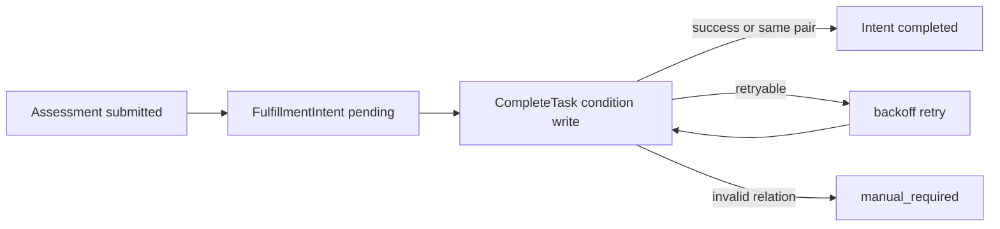

# Plan 设计问题与重构清单

> 状态：**规划改造**。本文是 Plan 模块的活动治理台账，汇总周期策略、患者加入、Task 状态机、调度、入口、提醒和测评履约中已经由当前源码确认的问题。本文描述的目标设计不等于当前已经实现的能力。

## 1. 本文的用法

本文不重复 Plan 的完整领域模型，而是回答四个问题：

1. 当前实现中哪些问题会造成“接口返回成功，但 Plan/Task 事实并未完整落库”；
2. AnswerSheet 已经可靠受理后，Plan Task 为什么仍可能长期停在 opened；
3. 调度、入口和提醒目前分别具有什么可靠性语义，哪些能力不能从日志或 best-effort 事件中推断；
4. 已持久化 Enrollment 之后，还剩哪些审计、查询、多模型和滚动生成问题。

使用约定：

- 后续分析报告、Issue、提交和 PR 优先引用稳定编号，例如 `PL-R004`；
- 实施前必须重新核对当时源码、migration、事件配置、运行参数和生产数据；
- 同一问题跨越 Plan、Survey、Evaluation、Worker 或 Statistics 时，要分别说明各模块保护什么，不能把全部责任塞回 Plan；
- 涉及已有 Task、已提交 AnswerSheet 和历史 Assessment 时，默认保护历史关联，不重算、不换绑；
- 问题关闭后更新状态、实施证据、验收结果和剩余风险，不直接删除条目；
- P2、P3 项不能因为“设计上更完整”就自动获得实施优先级。

---

## 2. 30 秒结论

Plan 的主干设计已经成立：

```text
AssessmentPlan 周期模板
  -> 患者加入并提供 startDate
  -> 生成 AssessmentTask 序列
  -> PlanRunner 到期开放 Task
  -> 生成填写入口并发布 task.opened
  -> 患者提交 AnswerSheet
  -> 创建并提交 Assessment
  -> Task completed 并关联 assessment_id
```

当前最需要治理的并不是“再增加一种周期策略”，而是四组运行时边界：

1. **状态提交仍需继续治理**：Enrollment 加入/终止已经事务化，但 Plan 模板生命周期和单 Task 更新仍需检查条件写与并发冲突语义；
2. **测评履约没有可靠收敛**：Assessment 已经创建并提交后，`CompleteTask` 仍以 best-effort 调用，失败没有持久意图、重试状态和对账任务；
3. **入口与提醒契约尚未闭环**：入口 token 只被生成和下发，没有服务端验证、消费与撤销语义；`task.opened` 采用 best-effort，提醒失败后没有投递账本和人工重发依据；
4. **调度与扩展模型仍面向当前规模**：扫描无分页和公平性治理，时区依赖进程环境，多模型和滚动生成仍是未来演进项。

治理顺序应当是：

> Enrollment 事务边界已经建立；下一步优先让已受理测评与 Task 可靠收敛，再治理入口、提醒和调度，最后讨论多模型 Plan 和滚动生成。

---

## 3. 优先级与状态语义

### 3.1 优先级

| 级别 | 含义 | Plan 中的判定标准 |
| --- | --- | --- |
| P0 | 事实正确性、成功语义或可靠履约风险 | 可能返回成功但只保存部分状态、并发覆盖合法终态、已存在 Assessment 却永久不完成 Task |
| P1 | 运行可靠性、安全边界与可运营性风险 | 入口无法验证、提醒不可补偿、调度可能形成积压、依赖失败被误判成参数错误 |
| P2 | 幂等、审计、查询与领域表达债务 | 不一定立即产生错误结果，但会提高重试、排障、重新加入和规模增长的成本 |
| P3 | 由新业务需求驱动的能力演进 | 多模型 Plan、长周期滚动生成等不能只凭技术完整性预建 |

P0 不表示要在一个 PR 中完成所有重构。它表示必须先补特征测试和数据审计，再以最小事务、条件写或持久补偿逐项关闭，不能直接用一次大规模结构调整掩盖现有行为。

### 3.2 状态

| 状态 | 含义 |
| --- | --- |
| 规划改造 | 当前源码已确认问题，尚未实施 |
| 待补证据 | 静态源码只能确认风险，需要生产数据、容量或部署配置证据 |
| 待业务决策 | 技术方案可实现，但缺少产品、医疗或运营语义 |
| 已实现待验收 | 代码已修改，但缺少迁移、故障注入、容量或生产观测证据 |
| 已关闭 | 代码、数据、测试、运行配置和文档均完成，无剩余必做项 |

### 3.3 关闭问题需要四类证据

任何 P0、P1 条目至少需要：

1. **行为证据**：领域或应用测试覆盖正常、重复、并发和部分失败路径；
2. **数据证据**：migration、约束或只读审计可以证明历史数据没有被破坏；
3. **运行证据**：指标和日志能够识别失败、积压、重试和人工处置；
4. **契约证据**：调用方知道成功、重试、拒绝和最终完成分别是什么意思。

---

## 4. 重构总表

| ID | 优先级 | 问题 | 状态 | 主要影响面 |
| --- | --- | --- | --- | --- |
| PL-R001 | P0 | Plan 模板生命周期仍需证明跨 Task 原子性 | 规划改造；Enrollment 终止部分已关闭 | Plan / Task 一致性、管理端成功语义 |
| PL-R002 | P0 | Task 缺少条件写和真实乐观并发控制 | 规划改造 | Open / Complete / Expire / Cancel 竞争 |
| PL-R003 | P0 | Reschedule 的零值字段可能无法清除 | 规划改造 | Resume 后 Task 数据正确性 |
| PL-R004 | P0 | Assessment 到 Task 的履约回写没有持久化收敛机制 | 规划改造 | AnswerSheet → Assessment → Plan |
| PL-R005 | P0 | 显式 Task 归因失败会静默退化，CompleteTask 过度信任上游 | 规划改造 | 履约归因、机构与受试者边界 |
| PL-R006 | P1 | 手动开放、实时过期和父 Plan 状态准入不一致 | 规划改造 | Task 状态机、过期边界 |
| PL-R007 | P1 | EntryToken 尚未形成服务端能力凭证契约 | 规划改造 + 待业务决策 | 入口安全、撤销与重放 |
| PL-R008 | P1 | task.opened 提醒没有投递账本、幂等重试和人工补发 | 规划改造 | Worker、微信通知、患者履约 |
| PL-R009 | P1 | Scheduler 扫描缺少分页、公平性、滞留补偿和完整指标 | 规划改造 + 待容量证据 | 大批量 Plan、机构隔离、积压 |
| PL-R010 | P1 | 周期与模型准入存在静默降级和错误分类失真 | 规划改造 | 创建 Plan、历史坏数据、依赖故障 |
| PL-R011 | P1 | Plan 没有显式时区和日历边界 | 待业务决策 | 跨地区机构、DST、提醒时间 |
| PL-R012 | P1 | internal gRPC 加入链路未验证 Testee 机构范围 | 规划改造 | 内部调用信任边界 |
| PL-R013 | P1 | 缺少 Plan/Task/Assessment 一致性审计与修复入口 | 规划改造 | 历史漂移、人工治理、Statistics |
| PL-R014 | P2 | CreatePlan 仍缺少稳定业务幂等 | 规划改造；并发 Enroll 已关闭 | API 重试、并发写入 |
| PL-R015 | P2 | 持久化 Enrollment 与多轮参与 | 已关闭 | join / terminate / rejoin |
| PL-R016 | P2 | 生命周期时间与管理操作审计事实不完整 | 规划改造 | 追责、运营查询、历史解释 |
| PL-R017 | P2 | 查询和协议表达仍按小规模、单协议实现 | 待容量与消费方证据 | 列表性能、REST/gRPC 一致性 |
| PL-R018 | P2 | 通知模板缓存和敏感日志治理不完整 | 规划改造 | 配置生效、token/OpenID 暴露 |
| PL-R019 | P3 | Plan 身份只支持 scale_code | 待业务决策 | 人格、行为评定、认知测验随访 |
| PL-R020 | P3 | Task 只支持加入时一次性全量生成 | 待业务决策 | 超长周期、动态调整、存储规模 |

---

## 5. 不应误判为缺陷的设计选择

### 5.1 Plan 保存模型 code，并在每次任务执行时使用最新发布版本

当前 Plan 和 Task 只保存 `scale_code`，不冻结 AssessmentModel version。患者打开并提交具体问卷后，AnswerSheet 和 Assessment 才冻结精确的 Questionnaire / Model release。

这是已确认的业务语义：量表因子结构稳定，发布初期可能有小幅配置调整；未来任务应自然使用新版本，已经完成的历史测评仍由各自快照保护。`PL-R019` 讨论的是支持更多模型类型，不是要求 Plan 固定版本。

### 5.2 Task 在 Assessment 创建并提交后完成

Task 表达的是“患者是否履约完成本次作答和测评受理”，不表达 Evaluation Outcome 或 InterpretReport 是否已经生成。因此：

```text
AnswerSheet durable
  -> Assessment created and submitted
  -> Task completed
  -> Evaluation / Interpretation 继续异步运行
```

不应把 Task completed 延迟到报告生成，否则报告重试、人工补偿或模板故障会错误地把患者已经完成的作答显示为未履约。

### 5.3 Task 生命周期事件可以继续是 best-effort，但只能承载通知

当前 `task.opened`、`task.completed`、`task.expired` 和 `task.canceled` 在事件配置中采用 best-effort。只要 MySQL Task 仍是生命周期真值，而且消费方只做可丢失通知，这一选择可以成立。

如果业务要求“每个任务必须至少提醒一次”，可靠性必须由独立的 NotificationIntent / Delivery 事实承担，而不是简单把所有 Task 事件切换成 durable 后就宣称完成。事件可靠到达不等于微信送达，也不等于用户已读。

### 5.4 Enrollment 已作为必要领域事实落地

Statistics 重建和患者周期查询需要稳定的参与轮次，因此 Enrollment 已持久化保存 startDate、round、状态与终止信息，并通过 `enrollment_id` 归属 Task。这是已经关闭的设计问题，不再作为未来可选项。

### 5.5 一次性生成全部 Task 是当前产品边界

当前周期数量有限，加入时生成完整任务序列有利于运营查看、患者日历展示和重复加入对账。滚动生成只有在超长周期、动态修改未来周期或任务数量形成真实容量压力时才值得引入。

---

## 6. P0：先让持久化结果与成功语义一致

### PL-R001：Plan 生命周期与患者终止必须原子提交或如实失败

**当前事实**

`pause / finish / cancel` 使用 `transitionPlanWithTaskCancellation`：

1. 先在内存中变更 Plan 与待取消 Task；
2. 先保存 Plan；
3. 再逐条保存 Task；
4. 单条 Task 保存失败时只记录日志并继续；
5. 最终仍返回成功的 PlanResult。

`TerminateEnrollment` 采用相同的逐条保存策略，Task 保存失败也会被记录后继续，方法最终返回 `nil`。Resume 方向则可能先把 Plan 保存为 active，再在后续 Task 保存失败时返回错误，形成“调用方收到失败、数据库却已经部分恢复”的状态。

**风险**

- paused、finished 或 canceled Plan 下仍存在 pending/opened Task；
- 终止参与返回成功后，患者仍能继续使用未取消入口；
- Resume 失败后，部分 Task 已重排、部分仍 canceled；
- 重放命令不一定能修复：Pause 已经 paused 时可能被拒绝，Finish/Cancel 的同终态短路也不会重新扫描 Task；
- 操作日志里的 `saved_tasks_count` 只能说明部分失败发生过，不能把一个已经返回成功的业务命令变成可重试事实。

**目标设计**

首选在同一 MySQL 事务中完成：

```text
load Plan + target Tasks
  -> validate transitions
  -> save Plan
  -> save all Tasks
  -> commit
  -> publish best-effort notification events
```

如果单次任务数量过大，不应在事务内无限循环，可改为持久化 `PlanTransition` 意图：

```text
PlanTransition requested
  -> 分批条件更新 Tasks
  -> 对账未完成数量
  -> 全部完成后提交 Plan terminal state
```

但当前规模下，应先测量单 Plan 最大 Task 数，再决定事务还是可恢复工作流，不能预先引入复杂 Saga。

**验收条件**

- 注入第 N 条 Task 保存失败时，不能返回成功且不能留下未声明的部分状态；
- Pause、Resume、Finish、Cancel、Terminate 均有失败后重放测试；
- 同终态重放能够验证并收敛关联 Task，而不是只看 Plan.status；
- 事务提交失败时不发布“已经取消/恢复”的 Task 事件；
- 管理端能区分成功、冲突、处理中和需要人工修复。

**证据**

- [`lifecycle_transition_workflow.go`](../../../internal/apiserver/application/plan/lifecycle_transition_workflow.go)
- [`enrollment_service.go`](../../../internal/apiserver/application/plan/enrollment_service.go)
- [状态、幂等与数据一致性](./21-核心设计-状态、幂等与数据一致性.md)

### PL-R002：Task 更新必须使用条件写，而不是读改写覆盖

**当前事实**

Task 的 Open、Complete、Expire、Cancel 都采用：

```text
FindByID
  -> 领域对象检查当前状态
  -> 内存迁移
  -> Repository.Save
```

持久化对象包含公共 `version` 字段，但领域实体和 Mapper 没有携带、递增和比较该版本；更新也没有形成 `WHERE id = ? AND version = ?` 或 `WHERE status = opened` 的条件写。因此当前并发语义本质上是 last-write-wins。

**典型竞争**

- 两个 Open 同时读取 pending，各自生成不同 token，最后写入者覆盖入口；
- Complete 与 Expire 同时读取 opened，后写入者可能覆盖另一个合法终态；
- Pause/Terminate 的 Cancel 与 Assessment 履约的 Complete 竞争，最终状态由时序决定，而不是明确的业务优先级；
- 重复 Complete 可能因为已经 completed 而报错，无法表达“同一个 assessment_id 的幂等成功”。

**目标设计**

对单 Task 状态命令提供显式仓储方法，例如：

```text
OpenIfPending(taskID, expectedVersion, entry...)
CompleteIfOpened(taskID, assessmentID, completedAt)
ExpireIfOpenedAndDue(taskID, now)
CancelIfNonTerminal(taskID, canceledAt)
RescheduleIfCanceled(taskID, schedule...)
```

需要同时定义竞争优先级：

- 已由同一 Assessment 完成，应返回幂等成功；
- 完成与过期竞争时，是否以 AnswerSheet durable/submitted 时间判断，而不是数据库写入先后；
- 完成与取消竞争时，已可靠受理的作答是否仍允许履约；
- 不同 Assessment 试图完成同一 Task 必须冲突并留下治理证据。

**验收条件**

- 每个状态命令都检查 RowsAffected 或显式版本冲突；
- 并发测试覆盖 Open/Open、Complete/Expire、Complete/Cancel；
- 同 `(task_id, assessment_id)` 重放为幂等成功；
- 冲突错误可被 transport、Worker 和调度器区分，不统一伪装成数据库错误；
- `uk_assessment_id` 与应用层条件写共同防止一个 Assessment 关联多个 Task。

**证据**

- [`task_management_service.go`](../../../internal/apiserver/application/plan/task_management_service.go)
- [`task_repository.go`](../../../internal/apiserver/infra/mysql/plan/task_repository.go)
- [`po.go`](../../../internal/apiserver/infra/mysql/plan/po.go)
- [`mapper.go`](../../../internal/apiserver/infra/mysql/plan/mapper.go)

### PL-R003：Reschedule 必须显式清除旧入口与完成字段

**当前事实**

领域层 `Reschedule` 会把复用 Task 重置为 pending，并清空：

- `openAt`；
- `expireAt`；
- `completedAt`；
- `assessmentID`；
- `entryToken`；
- `entryURL`。

Mapper 也会把这些空值映射为 nil 或空字符串。但是普通 GORM struct `Updates` 默认跳过零值字段；如果底层更新没有显式 Select 或 map 更新，数据库可能得到：

```text
status = pending
但 open_at / expire_at / assessment_id / entry_token / entry_url 仍保留旧值
```

**风险**

- pending Task 携带过期入口或历史 Assessment；
- 查询层可能根据非空字段误判任务已经开放或完成；
- 后续重新 Open 时混合新旧时间和 token；
- 数据审计无法判断这是历史合法状态还是更新遗漏。

**目标设计**

不要依赖通用 Save 猜测“哪些零值需要写入”。Reschedule 使用专门更新语句，显式列出全部应写列；同时用预期状态或 version 作为条件。

**验收条件**

- 从 opened、expired、canceled 的允许来源状态执行 Reschedule 后，数据库所有旧入口/完成字段均为 NULL 或空；
- repository 集成测试读取真实 MySQL 行，而不只检查内存对象；
- migration 前先审计现有 pending + stale field 记录；
- 修复脚本按状态和关联事实谨慎清理，不覆盖 completed 历史。

**证据**

- [`assessment_task.go`](../../../internal/apiserver/domain/plan/assessment_task.go)
- [`task_lifecycle.go`](../../../internal/apiserver/domain/plan/task_lifecycle.go)
- [`mapper.go`](../../../internal/apiserver/infra/mysql/plan/mapper.go)

### PL-R004：Assessment 已受理后，Task 履约必须最终收敛

**当前事实**

AnswerSheet 的 `202 Accepted` 已表示 AnswerSheet 与 `answersheet.submitted` Outbox 在 MongoDB 事务中可靠持久化。Worker/Journey 随后创建并提交 Assessment，再调用：

```go
_, _ = s.planCommands.CompleteTask(...)
```

`CompleteTask` 的结果和错误被直接忽略。只要 `answersheet.submitted` handler 的其余流程成功，消息即可 ACK；Plan 没有单独保存“Task 应由 Assessment X 完成”的待处理意图，也没有定时对账。

**重要语义**

这不是 AnswerSheet 丢失问题，也不是要求把 Plan 回写塞回 `202` 事务。正确边界仍然是：

```text
202 = AnswerSheet + AnswerSheet Outbox durable
Task completion = Assessment 已创建并提交后的最终一致投影
```

问题在于后半段缺少可证明的最终一致性。

**目标设计**

分两步治理：

1. 短期：不再吞掉可重试的 CompleteTask 错误；让同一 `(task, assessment)` 重放成为幂等成功；
2. 稳态：保存 PlanFulfillmentIntent 或等价 checkpoint，至少记录 TaskID、AssessmentID、AnswerSheetID、状态、尝试次数、最后错误和更新时间，并由重试/对账任务推进到 completed 或 manual_required。



**验收条件**

- Assessment 已存在而 Task 仍 opened 的情况可被查询、计量和自动收敛；
- MQ 重放、服务重启和 MySQL 短暂不可用不丢失履约意图；
- 同一 Assessment 不会重复完成多个 Task；
- 不同 Assessment 竞争同一 Task 时进入明确冲突或人工治理；
- Statistics 读取 Task 履约事实前，有一致性告警和修复入口；
- 不把 Evaluation Outcome 或 Report 成功作为 Task 完成条件。

**证据**

- [`assessmentintake/service.go`](../../../internal/apiserver/application/journey/assessmentintake/service.go)
- [`task_management_service.go`](../../../internal/apiserver/application/plan/task_management_service.go)
- [从任务开放到测评履约](./31-关键链路-从任务开放到测评履约.md)
- [Survey 答卷校验与可靠受理](../10-survey/31-关键链路-答卷校验与可靠受理.md)

### PL-R005：显式 Task 归因失败不能静默退化

**当前事实**

提交上下文携带明确 `task_id` 时，Resolver 会检查 Task 的机构、受试者、opened 状态和模型 code。若不匹配，当前链路记录 warning 并返回 nil；AnswerSheet 仍可继续创建 Assessment，但这次测评会被当成非 Plan 测评，原 Task 留在 opened。

反方向上，`CompleteTask` 自己只验证 Task 的机构和 AssessmentID 格式，不加载 Assessment 来核对：

- Assessment 是否属于同一机构；
- Assessment.testee_id 是否等于 Task.testee_id；
- Assessment.model code 是否等于 Task.scale_code；
- Assessment 是否来自对应 AnswerSheet / Task intent。

主链目前依赖上游 Resolver 正确，领域边界没有在最终写入点再次保护。

**目标设计**

将三类结果分开：

```text
没有 task_id
  -> 兼容性自动匹配；唯一 opened 候选才归因

显式 task_id 合法
  -> 冻结 TaskAssessmentContext / FulfillmentIntent

显式 task_id 非法或过期
  -> AnswerSheet 仍可靠保存
  -> Assessment 是否继续由产品契约决定
  -> 但必须形成 attribution_rejected 治理事实，不能静默当作 adhoc
```

最终 CompleteTask 或 FulfillmentIntent 创建时，应加载 canonical Assessment 或消费已经冻结且可验证的关联事实，fail closed 地检查 Org、Testee、Model 和 AnswerSheet。

**验收条件**

- 显式 TaskID 不匹配会留下可查询原因和指标；
- AnswerSheet 不因 Plan 归因失败而丢失；
- 是否继续创建 adhoc Assessment 有明确业务口径，不由 `nil` 隐式决定；
- TaskID fallback 多候选时继续拒绝猜测，并有弃用指标；
- 直接调用 CompleteTask 不能建立跨机构、跨受试者或跨模型关联。

**证据**

- [`task_assessment_resolver.go`](../../../internal/apiserver/application/plan/task_assessment_resolver.go)
- [`assessmentintake/service.go`](../../../internal/apiserver/application/journey/assessmentintake/service.go)
- [`task_management_service.go`](../../../internal/apiserver/application/plan/task_management_service.go)

---

## 7. P1：补齐运行准入、入口、提醒和调度治理

### PL-R006：统一 Task 开放、完成和过期的实时准入

**当前事实**

- 自动 Scheduler 在开放前加载父 Plan，并取消 inactive Plan 下的 pending Task；
- 手动 `OpenTask` 只加载 Task，不检查父 Plan 是否 active；
- Resolver 主要检查 Task.status=opened，不在归因时再次比较 `expireAt` 与当前时间；
- 过期扫描与患者提交可能并发，最终结果受数据库写入先后影响；
- 父 Plan 在 Task opened 后暂停或结束时，又会触发 PL-R001、PL-R002 所述竞争。

**目标设计**

建立单一 `TaskAdmissionPolicy` 或等价规则，明确：

1. Open 必须要求父 Plan active；
2. Submit/Attribute 是否允许 `now > expireAt` 的 Task，需要业务明确；
3. 若 AnswerSheet 在 expireAt 前已经可靠受理，但回写时 Task 已 expired，应按受理时间还是回写时间裁决；
4. 手动操作和 Scheduler 使用同一状态条件，区别只在操作者和审计来源。

**验收条件**

- 手动与自动开放使用相同 Plan/Task 准入；
- 到期边界有精确到时区和时间戳的测试；
- expire 与 submit/complete 并发结果由规则决定，而不是随机 last-write-wins；
- rejected admission 不删除 AnswerSheet，并进入可治理状态。

### PL-R007：定义 EntryToken 究竟是不是能力凭证

**当前事实**

入口生成器创建 UUID token 和包含 `token + task_id` 的 URL，并设置 7 天过期窗口；后续 AnswerSheet 提交主要携带 `task_id`，服务端没有看到 token 的解析、哈希存储、绑定验证、一次性消费或撤销契约。

因此当前 token 更像入口 URL 的随机参数，而不是服务端可验证的 capability。文档和接口不能把它描述为已经实现的安全凭证。

**待业务决策**

- 登录用户是否只能提交属于自己/所代表 Testee 的 Task；
- 二维码是否允许不同设备接力填写；
- token 是否一次性、可多次打开但只允许最终提交一次，还是只负责隐藏 TaskID；
- Pause、Cancel、Terminate 后是否必须立即撤销既有入口；
- 医生门诊二维码是 Plan Task 入口还是 AssessmentEntry，不能混用两套语义。

**目标设计**

如果 token 是能力凭证，应至少保护：

```text
token_hash -> task_id / testee_id / org_id / expire_at / status
```

并在提交时校验、支持撤销和安全比较，日志只记录 token 指纹。若决定 token 不承担授权，应删除误导性命名或明确它只是导航参数，真正授权由 IAM + Testee relation + Task admission 完成。

**验收条件**

- 文档、URL、提交协议和服务端行为采用同一安全语义；
- token 不以明文出现在结构化日志、错误或监控标签；
- 过期、撤销、重复打开和重复提交有契约测试；
- 迁移期间旧链接有明确兼容窗口和回滚方案。

### PL-R008：提醒可靠性必须由投递事实承担

**当前事实**

Task opened 后发布 best-effort `task.opened`。Worker 消费后调用内部 gRPC 发送小程序订阅消息；部分解析、内部调用和发送失败会被记录后 ACK，没有：

- 每个 Task/接收人的 NotificationIntent；
- 发送幂等键；
- attempt、provider message id 和最后错误；
- 自动退避、人工补发和发送结果查询；
- “部分接收人成功、部分失败”的独立状态。

**目标设计**

先由业务决定提醒 SLO：

- 如果提醒只是便利能力，可保留 best-effort，但必须提供任务列表供患者主动查询，并明确不能保证送达；
- 如果治疗随访要求系统必须尝试提醒，则 Task opened 后应创建持久 NotificationIntent，异步投递并按接收人记录结果。

Task 事件仍可作为触发器，但投递账本才是提醒真值：

```text
task.opened
  -> ensure NotificationIntent(task, recipient, channel, templateVersion)
  -> claim attempt
  -> provider send
  -> sent / retry_wait / manual_required / canceled
```

**验收条件**

- 同一 Task/接收人不会因为事件重放重复轰炸；
- 服务重启和临时微信错误后仍可重试；
- 部分成功按接收人治理；
- Pause/Cancel/Task completed 后，未发送提醒是否取消有明确规则；
- 运营可查询失败原因并安全补发；
- 提醒送达率、延迟和积压可观测。

**证据**

- [`task_handler.go`](../../../internal/worker/handlers/task_handler.go)
- [`internal_notification_flow.go`](../../../internal/apiserver/transport/grpc/service/internal_notification_flow.go)
- [`events.yaml`](../../../configs/events.yaml)
- [任务调度、入口与提醒](./23-核心设计-任务调度、入口与提醒.md)

### PL-R009：Scheduler 需要有界扫描、公平性与滞留补偿

**当前事实**

PlanRunner 已通过 Redis 租约避免多实例重复运行，这是正确基础。但当前运行模型仍有以下边界：

- `FindPendingTasks` 与 `FindExpiredTasks` 一次返回全部命中记录，没有 limit/cursor；
- configured `org_ids` 顺序处理，机构列表由静态配置提供；
- 没有每轮最大数量、每机构配额和向下游发送速率；
- `pending_lookback` 之外的更老 pending Task 可能长期滞留；
- 无 checkpoint，进程重启后只能重新范围扫描；
- tick 汇总没有完整表达每条 Task 的 open/expire 失败与最老积压年龄。

**目标设计**

```text
for each eligible org fairly
  -> query ordered page by planned_at + id
  -> conditional open in bounded batch
  -> record succeeded/conflicted/failed
  -> continue until round quota or deadline
```

补偿扫描应独立识别：

- 早于正常 lookback 的 pending Task；
- expireAt 已过但仍 opened 的 Task；
- inactive Plan 下仍 pending/opened 的 Task；
- 已创建 Assessment 但仍未 completed 的 Task。

**验收条件**

- 仓储查询有稳定游标和覆盖索引；
- 单机构大批量不能长期阻塞后续机构；
- 每轮工作量和下游事件速率有上限；
- Redis 不可用时继续 fail closed，不通过多实例同时扫描来“保证可用”；
- 指标至少包括 oldest_due_age、open_lag p95/p99、processed/conflicted/failed、per-org backlog；
- 通过接近生产分布的容量测试确定 batch、lease 和 tick 参数。

### PL-R010：创建 Plan 必须对非法输入和依赖故障 fail closed

**当前事实**

三个实现会掩盖错误：

1. 未知 `schedule_type` 在 converter 中默认变成 `by_week`；
2. TaskGenerator 应用 triggerTime 失败时回退默认 19:00；
3. scaleCatalog 未装配时 `validateScale` 直接放行，catalog 查询失败又被转换为 InvalidArgument。

这会把客户端拼写错误、历史坏配置、模块装配缺失和 ModelCatalog 短暂不可用压缩成看似正常的 Plan 或错误的 4xx。

**目标设计**

- converter 返回 `(PlanScheduleType, error)`，只接受明确枚举；
- triggerTime 在 Plan 创建/恢复时已经是合法值，生成任务时不静默兜底；
- ModelCatalog 准入是创建 Plan 的必需依赖，未装配属于启动错误；
- not found/inactive 映射业务参数错误，timeout/unavailable 映射可重试依赖错误；
- `fixed_date`、`custom` 的数量上限、重复值、排序和 startDate 语义显式校验。

**验收条件**

- 未知周期、非法 triggerTime 和损坏的持久化值都被明确拒绝；
- 依赖故障不会被缓存成“量表不存在”；
- 模块启动检查可以证明 catalog 已装配；
- 四种策略共享一份约束表，API、领域和文档一致。

**证据**

- [`converter.go`](../../../internal/apiserver/application/plan/converter.go)
- [`task_generator.go`](../../../internal/apiserver/domain/plan/task_generator.go)
- [`lifecycle_create_workflow.go`](../../../internal/apiserver/application/plan/lifecycle_create_workflow.go)

### PL-R011：显式建模机构时区和日历边界

**当前事实**

Plan 的日期解析、triggerTime 和任务生成广泛依赖 `time.Local`。这意味着相同业务配置的实际瞬间由进程所在机器时区决定，Plan/Task 自身无法证明当时采用了哪个时区。

当前若所有机构均运行在统一中国时区，尚未必产生线上错误；但跨地区机构、部署时区漂移或夏令时会使“每天 19:00”和“第 N 天”含义变化。

**目标设计候选**

1. 机构级 IANA TimeZone，由 Plan 冻结创建时 timezone；
2. 系统只支持固定业务时区，例如 `Asia/Shanghai`，启动时强校验，不再依赖机器 Local；
3. 若未来有跨时区患者，再决定按机构还是患者所在地解释。

**验收条件**

- 产品先确认时间归属；
- migration 对历史 Plan 赋予可解释的默认时区；
- 生成、开放、过期、REST 展示和 Statistics 使用一致转换；
- DST 边界测试只在支持相应时区后增加，不凭空制造复杂度。

### PL-R012：internal gRPC 也必须保护 Testee 机构范围

**当前事实**

REST 加入链路会经过受保护 Testee 校验；internal gRPC Enroll 从调用上下文取得 OrgID 后直接调用 Plan command。应用服务验证 Plan 属于该机构，却没有看到等价的 Testee ownership/org scope 校验。

“内部接口”只能减少暴露面，不能代替领域范围验证。调用方 bug、服务凭据误配或跨机构 ID 传递仍可能在错误机构的 Plan 下生成 Task。

**目标设计**

- 在应用层建立可复用 `TesteeScopeAuthorizer`，REST 与 gRPC 共享；
- internal transport 继续验证服务身份和组织上下文，但不独占业务授权；
- 批量加入时采用批量校验，避免 N+1；
- 历史数据先审计 Task.org_id、Plan.org_id 与 Testee organization 关系。

**验收条件**

- gRPC 跨机构 Testee 被拒绝；
- REST 和 gRPC 错误语义一致；
- 可信系统账户是否允许明确的跨机构操作需单独权限，不通过跳过校验实现；
- 审计脚本只读运行后确认存量影响范围。

### PL-R013：建立跨 Plan、Task、Assessment 的一致性审计

**当前事实**

当前唯一键可以防止同一 active Enrollment、`(enrollment_id,seq)` 重复和一个 Assessment 关联多个 Task，但不能证明全部业务不变式。并发覆盖和履约回写失败仍可能留下结构合法、业务矛盾的数据。

**至少需要审计的异常**

```text
inactive Plan + pending/opened Task
completed Task missing assessment_id or completed_at
non-completed Task carrying assessment_id or completed_at
opened Task missing open_at / expire_at / entry fields
pending Task carrying stale entry/completion fields
expire_at < open_at
Task org_id / scale_code differs from parent Plan
Assessment origin=plan but Task remains opened or unlinked
one explicit Task intent producing an adhoc Assessment
```

**目标设计**

- 先提供只读 consistency audit，输出机构、数量、最老时间和样例 ID；
- 再为可机械判断的异常提供 dry-run repair；
- 无法机械判断的关联冲突进入 manual_required；
- 修复操作记录操作者、原因、前后状态和结果；
- Statistics 使用 `assessment_task` 前监控这些漂移，因为错误履约会直接改变计划完成率。

**验收条件**

- 审计可以定时运行且不会扫描拖垮主库；
- 每个 repair 都幂等、可预览、可分机构执行；
- 不通过猜测重绑历史 Assessment；
- P0 代码修复前后各运行一次审计，形成基线和回归证据。

---

## 8. P2：完善幂等、参与事实、审计和查询契约

### PL-R014：CreatePlan 需要稳定业务幂等

**当前事实**

Enroll 已通过 active Enrollment 唯一约束和冲突后回读实现并发幂等；相同 startDate 返回同一轮，不同 startDate 明确冲突。

CreatePlan 仍没有调用方提供的业务幂等键；网络重试可能创建两个语义相同的 Plan 模板。

**目标设计**

- CreatePlan 接受有作用域的 `idempotency_key`，或由外部治疗方案实例 ID 形成唯一业务来源键；
- 不用“名称 + 周期参数完全相同”推断重复，因为运营可能合法创建相同模板。

**验收条件**

- CreatePlan 重试返回原 PlanID；
- 幂等记录有机构作用域、参数摘要、状态和过期/保留策略。

### PL-R015：持久化 Enrollment 与多轮参与（已关闭）

当前已经实现：

- `plan_enrollment` 保存 org、plan、testee、round、startDate、状态和生命周期时间；
- 同一患者同一 Plan 最多一个 active Enrollment；
- Enrollment 与初始 Task 在同一 MySQL 事务提交；
- Task 保存 `enrollment_id`，并以 `(enrollment_id,seq)` 唯一；
- 所有 Task 终态时 Enrollment 自然 closed；
- 显式终止与本轮未完成 Task 取消在同一事务；
- 终止后再次加入创建 round+1；
- Plan Enrollment API 按 round 返回 Task 与轮内完成率。

剩余的 joinedBy/terminatedBy、患者级暂停和滚动生成属于新的独立需求，不重新打开 PL-R015。

### PL-R016：补充不可替代的生命周期审计事实

**当前事实**

Task 有 created/updated、openAt、expireAt、completedAt，但没有独立 expiredAt、canceledAt；Plan 也没有 pausedAt、finishedAt、canceledAt。best-effort 事件不能作为完整审计来源，普通 updatedAt 又无法说明发生了哪种操作。

**目标设计**

- 只有查询和合规真正需要的时间才进入聚合/表字段；
- 管理命令写入操作审计：action、operator、reason、request_id、before/after、result；
- Task 状态时间用于业务查询，操作审计用于追责，二者不要混成一个超大 event log；
- 日志不能代替持久审计。

**验收条件**

- 可以解释一个 Plan 为什么暂停/终止，以及某 Task 何时因何取消；
- 批量操作只保存必要摘要与关联明细，不复制患者敏感数据；
- 审计记录不可由普通业务更新覆盖。

### PL-R017：查询与协议需要随真实规模演进

**当前事实**

部分查询会按 Plan 加载全部 Task 后在内存中过滤；REST 和 gRPC 对 Enrollment 结果的表达也不完全一致，例如 gRPC 能返回 `Idempotent` 和 `CreatedTaskCount`，REST 当前没有对等呈现。

**目标设计**

- 为 plan/testee/status/time window 提供明确仓储查询和稳定分页；
- 终止单个患者不读取整个 Plan 的全部 Task；
- 统一应用层 Result，再由 REST/gRPC 明确映射相同语义；
- 大机构工作台需要 Projection 时，以测量到的慢查询和 N+1 为依据，不提前复制所有数据。

**验收条件**

- 查询计划通过真实索引和 EXPLAIN 验证；
- 分页排序稳定，不依赖会变化的单一时间字段；
- REST/gRPC 对幂等、创建数量、冲突和处理中语义一致；
- 兼容字段有明确弃用窗口。

### PL-R018：通知配置与日志需要安全、可更新

**当前事实**

通知模板配置存在进程内缓存，但缺少明确 TTL/失效机制；后台修改模板后可能需要重启才生效。部分日志会输出完整 `entry_url`、OpenID、页面和模板数据，其中入口 URL 可能包含 token。

**目标设计**

- 模板以 version/hash 标识，缓存有 TTL 或显式失效；
- NotificationIntent 冻结实际使用的 template identity；
- 日志只保留 task_id、recipient_count、provider code、token fingerprint 等诊断字段；
- OpenID 和模板变量按敏感级别脱敏，不进入高基数 metrics label；
- 建立日志保留与访问权限要求。

**验收条件**

- 模板更新无需不受控重启即可在规定窗口生效；
- 已创建 Intent 的历史模板来源可证明；
- 自动扫描确认日志不再输出完整 token 和不必要的个人标识；
- 排障仍能通过 request_id、task_id、intent_id 闭合链路。

---

## 9. P3：只在业务真正需要时演进

### PL-R019：从 scale_code 演进为通用模型身份

**当前事实**

Plan 当前固定保存 `scale_code`，创建时只验证 ModelCatalog 的 scale 模型。因此人格测评、行为评定和认知测验不能直接作为周期 Plan 的目标。

**这不是当前正确性缺陷**

当前治疗随访主要围绕医学量表，现有字段和流程与业务一致。只有当产品确认其他模型也需要“一个患者在一个时间段持续填写”时才应扩展。

**目标设计候选**

```text
model_kind + model_code
```

Plan 继续晚绑定发布版本；Task 冗余同一通用 identity；ModelCatalog 提供按 kind/code 的 active admission。迁移可把现有记录映射为 `kind=scale`，但必须同步修改入口、Resolver、Statistics、API 和索引，不能只重命名字段。

**业务决策问题**

- 人格测评是否需要周期性重复，结果是否适合进入趋势；
- 行为评定由患者、家长还是治疗师填写，提醒对象是否不同；
- 认知测验是否依赖设备、环境或线下操作，不适合普通小程序入口；
- 不同模型的完成语义是否仍是 Assessment submitted。

### PL-R020：滚动生成只服务超长周期与动态未来计划

**当前事实**

患者加入时一次性生成完整 Task 序列，`by_day / by_week` 有数量限制，`fixed_date / custom` 仍需统一约束。代码中即便存在局部的 until 计算能力，也没有形成可运行的滚动生成工作流。

**触发条件**

- Plan 跨越数年，预生成任务显著增加存储和查询压力；
- 医生允许修改未来尚未生成的周期；
- Enrollment 需要按滚动窗口继续生成；
- 真实任务规模证明加入事务或列表查询受到全量生成影响。

**目标设计候选**

引入独立 Enrollment 后保存 `generated_until / next_seq / schedule_revision`，Scheduler 或生成器在有界窗口内补齐未来任务。已经生成的 Task 仍是不可随意改写的安排事实；修改计划只影响尚未生成部分，或通过显式 reschedule workflow 处理。

**验收条件**

- 同一窗口重复生成幂等；
- 生成游标和 Task 唯一约束共同保护并发；
- 周期修改对已生成/未生成任务的影响有业务规则；
- 不因滚动生成让患者临近提醒时才发现生成失败，必须监控 generation horizon。

---

## 10. 推荐实施顺序

### 阶段 0：先固定现状并审计数据

范围：PL-R001～PL-R005、PL-R013。

1. 补部分保存、并发状态、Reschedule 零值、CompleteTask 重放和归因失败的特征测试；
2. 建立只读一致性审计，形成各机构异常基线；
3. 统计单 Plan 最大 Task 数、opened 积压、Assessment 已存在但 Task 未完成数量；
4. 在没有数据基线前不直接运行修复 SQL。

退出条件：能够稳定复现主要风险，并知道生产存量影响范围。

### 阶段 1：修复写入真实性

范围：PL-R001～PL-R003。

1. 选择事务或可恢复 Transition；
2. 引入 Task 条件写和明确冲突错误；
3. 为 Reschedule 使用显式列更新；
4. 先在测试和 staging 做故障注入，再迁移生产。

退出条件：所有成功命令都能证明目标状态完整提交，部分失败不会被包装成成功。

### 阶段 2：建立履约最终一致性

范围：PL-R004、PL-R005、PL-R006。

1. 同 `(task, assessment)` CompleteTask 幂等；
2. 不吞掉可重试错误；
3. 引入 FulfillmentIntent/checkpoint 与 reconciliation；
4. 收紧 Org/Testee/Model/AnswerSheet 关联；
5. 明确过期边界和显式 TaskID 失败语义。

退出条件：任意已受理 Assessment 都能判断 Task 履约状态、自动重试或进入人工治理。

### 阶段 3：治理入口、提醒和 Scheduler

范围：PL-R007～PL-R010、PL-R018。

1. 先确定 token 与提醒 SLO；
2. 再实现凭证验证或去除误导语义；
3. 若提醒要求可靠，建立 Delivery ledger；
4. Scheduler 分页、公平、限额并暴露积压指标；
5. 移除静默枚举和 triggerTime fallback。

退出条件：入口安全语义可验证，提醒可靠性可度量，调度器在目标规模下有界运行。

### 阶段 4：完善组织、时间与运营能力

范围：PL-R011～PL-R018。

按业务优先级处理时区、内部 Testee scope、CreatePlan 幂等、审计和查询契约。Enrollment 已经落地，不再列为本阶段候选能力。

### 阶段 5：产品演进

范围：PL-R019、PL-R020。

多模型和滚动生成分别立项，不与 P0/P1 治理捆绑发布。

---

## 11. 测试与验收矩阵

| 层级 | 必补场景 | 主要条目 |
| --- | --- | --- |
| Domain | 状态迁移、同终态重放、完成/过期裁决、周期非法输入 | PL-R002、PL-R006、PL-R010 |
| Application | 第 N 条保存失败、Resume 部分失败、显式归因拒绝、同 Assessment 重放 | PL-R001、PL-R004、PL-R005 |
| Repository | 条件更新 RowsAffected、version/status conflict、NULL/空值清理、分页游标 | PL-R002、PL-R003、PL-R009 |
| Integration | MySQL 事务回滚、Mongo 受理后 MySQL 故障、MQ 重放、Redis 租约 | PL-R001、PL-R004、PL-R009 |
| Contract | REST/gRPC 错误与幂等结果、token 过期/撤销、internal scope | PL-R007、PL-R012、PL-R017 |
| Fault injection | DB timeout、Worker 重启、通知 provider 限流、缓存/Redis 不可用 | PL-R004、PL-R008、PL-R009 |
| Capacity | 大机构 backlog、单 Plan 大量 Task、集中开放和提醒峰值 | PL-R009、PL-R020 |
| Data audit | 状态-字段矩阵、Plan/Task scope、Assessment 履约漂移 | PL-R003、PL-R005、PL-R013 |

不能只用 mock 仓储证明事务和 GORM 更新正确。PL-R001～PL-R003 至少需要真实 MySQL 集成测试；PL-R004 需要覆盖 Mongo durable acceptance 与 MySQL 最终履约之间的跨存储故障窗口。

---

## 12. 观测与治理面板

后续治理不一定需要一个新的可视化后台，但至少需要稳定指标和查询入口。

### 12.1 Scheduler

- `plan_scheduler_oldest_due_seconds{org}`；
- `plan_scheduler_open_lag_seconds` 的 p50/p95/p99；
- 每轮 discovered / opened / conflicted / failed / expired；
- 每机构 backlog 与本轮 quota 使用；
- lease acquire/renew/lost 与 tick duration；
- 超出 pending lookback 的 stranded task 数量。

机构 ID 不宜直接作为高基数长期指标标签时，可在日志/治理查询保留机构明细，metrics 只做全局或分桶聚合。

### 12.2 Fulfillment

- pending / retry_wait / manual_required Intent 数；
- oldest pending age；
- Assessment exists but Task not completed；
- explicit Task attribution rejected，按原因分类；
- fallback matched / ambiguous / no candidate；
- same-pair idempotent replay 与 conflicting assessment 数。

### 12.3 Notification

- intent created / sent / retry / manual_required / canceled；
- provider latency、error class 和限流；
- task opened 到首次发送延迟；
- 每个 Task 的接收人数和部分失败数；
- 人工补发次数与结果。

### 12.4 Lifecycle consistency

- inactive Plan with executable Task；
- invalid status-field matrix；
- partial transition / reconciliation backlog；
- manual repair count 与失败数。

---

## 13. 数据迁移与回滚原则

1. **先只读审计，后加约束**：历史异常未清理前不要直接增加 CHECK 或 NOT NULL；
2. **双写只用于有退出计划的过渡**：FulfillmentIntent、Enrollment 等新事实需要 backfill 和一致性对账，不能永久双写两套真值；
3. **不重绑历史 Assessment**：归因不确定时进入 manual_required，不用时间最近或 code 相同自动猜测；
4. **条件写可灰度**：先记录 would-conflict 指标，再启用强拒绝，避免未知旧调用方突然失败；
5. **修复命令可预览**：输出目标 ID、原状态、目标状态和原因，要求明确确认并记录审计；
6. **回滚代码不回滚事实**：新表/新列先保留，回滚应用时停止新写，不删除已经形成的审计或履约记录；
7. **事件兼容有窗口**：新增字段先保持消费者可选读取，再升级生产者，最后收紧必填。

---

## 14. 关闭清单

关闭任一条目前，负责人应回答：

- [ ] 当前代码、migration 和部署配置是否重新复核；
- [ ] 是否有失败前的生产数据基线；
- [ ] 正常、重复、并发、部分失败和重放是否都有测试；
- [ ] 是否明确调用方看到的成功、冲突和处理中语义；
- [ ] 是否有自动重试上限、人工治理入口和审计；
- [ ] 是否验证 Statistics、患者端、运营端和外部医疗系统的兼容性；
- [ ] 是否完成灰度、指标观察和回滚演练；
- [ ] 文档中的“当前事实”是否同步更新；
- [ ] 是否记录剩余风险，而不是用“测试通过”概括全部验收。

---

## 15. 事实源

| 主题 | 当前事实源 |
| --- | --- |
| Plan / Task 聚合和状态机 | [`internal/apiserver/domain/plan`](../../../internal/apiserver/domain/plan/) |
| 生命周期编排 | [`lifecycle_transition_workflow.go`](../../../internal/apiserver/application/plan/lifecycle_transition_workflow.go) |
| 患者加入与终止 | [`enrollment_service.go`](../../../internal/apiserver/application/plan/enrollment_service.go) |
| Task 命令 | [`task_management_service.go`](../../../internal/apiserver/application/plan/task_management_service.go) |
| Task 与 Assessment 解析 | [`task_assessment_resolver.go`](../../../internal/apiserver/application/plan/task_assessment_resolver.go) |
| AnswerSheet 到 Assessment/Plan Journey | [`assessmentintake/service.go`](../../../internal/apiserver/application/journey/assessmentintake/service.go) |
| Plan/Task MySQL 仓储 | [`internal/apiserver/infra/mysql/plan`](../../../internal/apiserver/infra/mysql/plan/) |
| 调度应用服务 | [`task_scheduler_service.go`](../../../internal/apiserver/application/plan/task_scheduler_service.go) |
| PlanRunner 与 Redis 租约 | [`plan_scheduler.go`](../../../internal/apiserver/runtime/scheduler/plan_scheduler.go) |
| 入口生成 | [`entry_generator.go`](../../../internal/apiserver/infra/plan/entry_generator.go) |
| task.opened Worker | [`task_handler.go`](../../../internal/worker/handlers/task_handler.go) |
| 小程序通知 | [`internal_notification_flow.go`](../../../internal/apiserver/transport/grpc/service/internal_notification_flow.go) |
| 事件 delivery 配置 | [`events.yaml`](../../../configs/events.yaml) |
| Plan schema 与唯一约束 | [`migrations/mysql`](../../../internal/pkg/migration/migrations/mysql/) |
| 模块装配 | [`assemble.go`](../../../internal/apiserver/container/modules/plan/assemble.go) |

建议快速验证：

```bash
go test ./internal/apiserver/domain/plan
go test ./internal/apiserver/application/plan
go test ./internal/apiserver/infra/mysql/plan
go test ./internal/apiserver/runtime/scheduler
go test ./internal/apiserver/application/journey/assessmentintake
go test ./internal/worker/handlers
make docs-hygiene
make docs-facts
```

这些命令只能验证当前测试和文档事实门禁。事务故障、真实 MySQL 更新语义、Redis 租约、微信投递和集中开放容量仍需要对应环境的集成、故障注入和压测证据。
