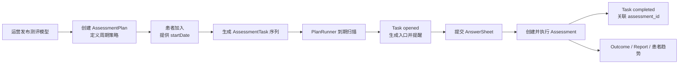

# Plan 模块

> 状态：**本轮重建完成**。模块入口、领域模型、核心设计、关键链路与活动重构台账已经按当前源码复核。本文只承担模块导航职责，不再承载全部实现细节。

## 1. 30 秒结论

Plan 解决的不是“定时执行一个后台任务”，而是：

> 把“一个患者在一个时间段内，持续填写一种测评”的治疗随访要求，转化为一组可安排、可开放、可填写、可完成和可追踪的测评任务。

业务口径是：**治疗方案预先配置周期，患者加入相应 Plan**。当前代码把这一口径实现为三层事实：

1. `AssessmentPlan` 定义测什么、按什么周期测、每次在什么时间开放；
2. 患者加入时，`PlanEnrollment` 根据患者开始日期生成该患者的 `AssessmentTask` 序列；
3. 内建调度器到期开放 Task、生成填写入口并触发提醒；患者提交 AnswerSheet 后，测评执行链创建 Assessment，再将 Task 标记为 completed。



Plan 是 qs-server 的核心业务支撑能力：它不改变测评算法，却决定持续测评怎样发生，也把一次性测评平台扩展为能够支撑治疗观察和诊后随访的平台。

## 2. 为什么需要 Plan

### 2.1 一次性入口无法解决持续随访

门诊二维码和医生主动推送解决的是“一次测评怎样发生”。治疗周期还需要回答：

- 患者在治疗后的第几天、第几周需要再次测评；
- 一个周期内总共需要完成几次；
- 任务什么时候开放、什么时候过期；
- 患者或家长怎样收到提醒和填写入口；
- 某次 AnswerSheet 是否履约了计划中的某个 Task；
- 暂停、终止或恢复计划时，尚未执行的 Task 怎样处理；
- 多次结果如何归属于同一受试者并进入患者级趋势。

如果这些规则只存在于医生记忆、运营推送脚本或定时任务配置中，系统只能“定时发链接”，不能表达随访计划、任务状态和履约事实。Plan 将这些规则建模为可验证的领域对象和状态迁移。

### 2.2 三类真实峰值

Plan 也会形成运行质量压力。项目当前面对过三类集中流量：

1. Plan 在相近时间集中开放和推送任务；
2. 学校筛查活动中，同一学校大量用户同时进入；
3. 线上直播推送测评后产生瞬时峰值。

Plan 本身主要承受第一类压力，但它打开的入口会继续影响小程序查询、AnswerSheet 提交、Worker 消费和报告查询。因此，Plan 的业务建模必须与调度批次、通知送达和下游可靠受理共同理解。

## 3. 模块负责什么

| 职责 | Plan 保护的业务语义 |
| --- | --- |
| 周期策略 | 测什么、按天/周/固定日期/自定义周次怎样重复测 |
| 患者加入 | 从患者开始日期计算期望 Task，并保护重复加入幂等 |
| Task 生命周期 | pending、opened、completed、expired、canceled 的合法迁移 |
| 到期调度 | 在正确机构和时间窗口内开放 Task |
| 填写入口 | 为 opened Task 生成入口信息和过期窗口 |
| 提醒协作 | 发布 task.opened 等事件，触发小程序提醒 |
| 测评归因 | 将 AnswerSheet/Assessment 与明确的 Task、Plan 关联 |
| 履约事实 | 保存 Task 被哪个 Assessment 完成以及完成时间 |
| 读侧支持 | 为患者任务、运营工作台和 Statistics 提供查询事实 |

## 4. 模块不负责什么

| 问题 | 真值模块 | Plan 只保存或消费什么 |
| --- | --- | --- |
| 谁是患者、家长或医生 | Actor / IAM | `testee_id` 与授权结果 |
| 问卷有哪些题目 | Survey | 不复制 Questionnaire |
| 测评模型怎样计分和判定 | ModelCatalog / Calculation | 当前只保存 `scale_code` |
| AnswerSheet 是否可靠受理 | Survey | 可选 `task_id` 提交上下文 |
| Assessment 怎样执行 | Evaluation | 完成后引用 `assessment_id` |
| 报告怎样生成和授权 | Interpretation | 不保存报告正文或状态 |
| 多次结果怎样统计和展示 | Statistics / 查询读侧 | 提供 Task 履约事实 |
| 治疗方案的完整医学内容 | 外部治疗业务流程 | 只承接已经确定的周期要求 |

边界可以概括为：

> Plan 决定“何时为谁安排哪一种测评”，不决定“问什么、怎样计算、怎样解释”。

Plan 状态变化不能推进 Evaluation 或 Interpretation 的内部状态机；Evaluation 也不能反向修改 Plan 的周期定义。

## 5. 两条核心业务链路

Plan 有一条管理链路和一条运行链路。拆分文档时必须保持这两条线分开。

### 5.1 管理链路

```text
创建 AssessmentPlan
  -> 校验已发布测评模型
  -> 患者加入并提供 startDate
  -> 生成或对账 AssessmentTask
  -> 暂停 / 恢复 / 结束 Plan
  -> 或终止单个患者的参与
```

这条链路主要关心领域规则、任务生成、重复请求幂等和跨聚合数据一致性。

### 5.2 运行链路

```text
PlanRunner 扫描到期 Task
  -> 生成入口并将 Task 置为 opened
  -> best-effort 发布 task.opened
  -> Worker 触发小程序提醒
  -> 患者提交 AnswerSheet
  -> 创建并提交 Assessment
  -> 回写 Task completed
  -> Statistics 读取履约事实
```

这条链路主要关心调度、入口、通知、跨模块归因和最终一致性。

## 6. 三个必须先理解的边界

### 6.1 AssessmentPlan 是模板，不是患者治疗实例

业务语言常说“一个患者加入一个 Plan”，但当前 `AssessmentPlan` 不保存 testeeID 和患者开始日期。它是机构内可复用的周期策略模板，同一 Plan 可以为多个患者生成各自的 Task。

### 6.2 Enrollment 当前是隐含事实

代码中有 `PlanEnrollment` 领域服务，却没有 Enrollment 聚合或数据表。当前“某患者已经加入某 Plan”由 `(plan_id, testee_id)` 下存在的 Task 集合表达。

这使当前实现足够简洁，但也意味着加入状态、原始开始日期、终止原因和重新加入轮次没有独立事实。详细分析见[领域模型](./10-领域模型.md)。

### 6.3 Plan 保存模型族 code，不冻结未来版本

Plan 和 Task 当前只保存 `scale_code`，不保存模型发布版本。每次作答真正使用的 Questionnaire 和 AssessmentModel 版本在作答与测评链路中确定，并由 AnswerSheet、Assessment 和发布快照冻结。

因此，新版本发布不会修改历史结果，但可能影响未来尚未作答的 Task。这是已经确认的业务选择，不是遗漏版本字段。

## 7. 当前实现状态

| 能力 | 状态 | 说明 |
| --- | --- | --- |
| 四种周期策略 | 已实现 | by_week、by_day、fixed_date、custom |
| 已发布模型准入 | 已实现 | 当前只接受 ModelCatalog 的 scale 模型 |
| 患者加入和批量生成 Task | 已实现 | 一次生成全部任务，by_day/by_week 最大 100 次 |
| 重复加入幂等与任务对账 | 已实现 | 领域对账 + `(plan_id,testee_id,seq)` 唯一键 |
| 独立 Enrollment 生命周期 | 未实现 | 当前由 Task 集合隐式表达 |
| 内建多实例安全调度 | 已实现 | PlanRunner + Redis 租约 |
| Task 入口与过期 | 部分实现 | 生成 token/URL 和 7 天窗口；token 尚无服务端解析契约 |
| 小程序提醒 | 部分实现 | task.opened best-effort，可漏发，无送达账本 |
| AnswerSheet 显式 Task 归因 | 已实现 | SubmissionContext 传递 task_id |
| Task 完成可靠收敛 | 部分实现 | CompleteTask 错误被忽略，无专项调和 |
| Plan 与多条 Task 原子迁移 | 未实现 | 暂停、恢复、结束、终止可能部分保存 |
| 多模型类型 Plan | 未实现 | 当前固定 KindScale / scale_code |
| 时区建模 | 未实现 | 当前依赖进程 `time.Local` |

“部分实现”和“未实现”不会在 README 展开为改造方案，统一进入后续 `90-设计问题与重构清单.md`。

## 8. 文档地图

本模块采用“领域模型 → 核心设计 → 关键链路 → 重构清单”的阅读顺序。

| 顺序 | 文档 | 状态 | 核心问题 |
| --- | --- | --- | --- |
| 10 | [领域模型](./10-领域模型.md) | 已重写 | Plan、隐式 Enrollment、Task 如何表达持续测评 |
| 20 | [核心设计：周期策略与任务生成](./20-核心设计-周期策略与任务生成.md) | 已重写 | 周期、开始日期、triggerTime、任务生成与对账 |
| 21 | [核心设计：状态、幂等与数据一致性](./21-核心设计-状态、幂等与数据一致性.md) | 已重写 | 双状态机、唯一约束、命令幂等、跨聚合提交与并发冲突 |
| 22 | [核心设计：测评引用与版本语义](./22-核心设计-测评引用与版本语义.md) | 已重写 | code 晚绑定、active 准入、精确版本冻结和跨版本趋势 |
| 23 | [核心设计：任务调度、入口与提醒](./23-核心设计-任务调度、入口与提醒.md) | 已重写 | PlanRunner、租约、入口、事件、提醒和背压 |
| 30 | [关键链路：计划创建、患者加入与终止](./30-关键链路-计划创建、患者加入与终止.md) | 已重写 | 管理侧命令链怎样执行 |
| 31 | [关键链路：从任务开放到测评履约](./31-关键链路-从任务开放到测评履约.md) | 已重写 | Task 怎样从 opened 经 AnswerSheet 和 Assessment 走到 completed |
| 90 | [设计问题与重构清单](./90-设计问题与重构清单.md) | 已重写 | 已发现问题、优先级、实施顺序和验收边界 |

本轮 Plan canonical 文档已经全部建立。后续重构关闭问题时，应同步更新对应专题和 `90-设计问题与重构清单.md`，避免“代码已治理、文档仍描述旧缺口”。

## 9. 与其他文档的阅读衔接

- 系统后台调度：[后台任务与调度](../../01-运行时/06-后台任务与调度.md)；
- AnswerSheet 可靠受理：[Survey](../10-survey/README.md)；
- 模型发布与版本：[ModelCatalog](../20-model-catalog/README.md)；
- Assessment 执行：[Evaluation](../30-evaluation/README.md)；
- 受试者与访问范围：[Actor](../50-actor/README.md)；
- 任务履约统计：[Statistics](../70-statistics/README.md)。

## 10. 事实源与验证

| 主题 | 当前事实源 |
| --- | --- |
| Plan、Task 与领域服务 | [`domain/plan`](../../../internal/apiserver/domain/plan/) |
| 创建、加入、生命周期和调度用例 | [`application/plan`](../../../internal/apiserver/application/plan/) |
| 内建调度器 | [`runtime/scheduler/plan_scheduler.go`](../../../internal/apiserver/runtime/scheduler/plan_scheduler.go) |
| Task 入口生成 | [`infra/plan/entry_generator.go`](../../../internal/apiserver/infra/plan/entry_generator.go) |
| MySQL 持久化 | [`infra/mysql/plan`](../../../internal/apiserver/infra/mysql/plan/) |
| 表与唯一约束 | [`migrations/mysql`](../../../internal/pkg/migration/migrations/mysql/) |
| AnswerSheet 到 Plan 归因 | [`assessmentintake/service.go`](../../../internal/apiserver/application/journey/assessmentintake/service.go) |
| REST 能力与授权 | [`routes_plan.go`](../../../internal/apiserver/transport/rest/routes_plan.go) |
| task 事件 delivery | [`configs/events.yaml`](../../../configs/events.yaml) |
| task.opened 消费 | [`worker/handlers/task_handler.go`](../../../internal/worker/handlers/task_handler.go) |

快速验证：

```bash
go test ./internal/apiserver/domain/plan
go test ./internal/apiserver/application/plan
go test ./internal/apiserver/infra/mysql/plan
go test ./internal/apiserver/runtime/scheduler
go test ./internal/apiserver/application/journey/assessmentintake
make docs-hygiene
make docs-facts
```

文档校验只能证明结构、链接和部分契约名没有漂移；生产 Redis 租约、微信通知送达和真实任务规模仍需运行环境验证。
