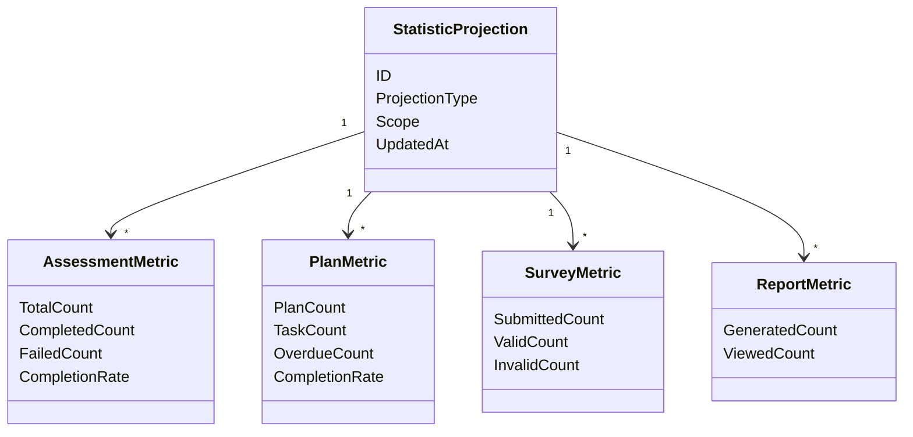

# Statistics 领域模型

## 1. 模块核心概念

Statistics 只表达读侧投影。它保存的是为了查询和分析聚合后的视图，不是核心业务事实源。

---

## 2. 领域模型图

---

## 3. 聚合根与实体

| 类型 | 对象 | 说明 |
| ---- | ---- | ---- |
| 读模型 | `StatisticProjection` | 某个范围内的统计投影 |
| 指标 | `AssessmentMetric` | 测评服务指标 |
| 指标 | `PlanMetric` | 计划任务指标 |
| 指标 | `SurveyMetric` | 答卷指标 |
| 指标 | `ReportMetric` | 报告指标 |

---

## 4. 值对象

| 值对象 | 说明 |
| ------ | ---- |
| `StatisticScope` | 组织、受试者、时间窗口等范围 |
| `TimeWindow` | today、7d、30d 等窗口 |
| `MetricValue` | 计数、比例、趋势 |
| `ProjectionType` | 投影类别 |

---

## 5. 领域服务

| 服务 | 职责 |
| ---- | ---- |
| Event Projector | 消费事件更新读侧投影 |
| Aggregator | 聚合指标 |
| Trend Analyzer | 计算趋势 |
| Query Cache | 缓存查询视图 |

---

## 6. 领域事件

Statistics 处理业务事件，并由后台扫描器处理行为旅程事实，包括：

- `behavior_journey_scan`（入口日志、接入日志、答卷、测评、报告）
- `answersheet.submitted`
- `assessment.interpreted`
- `assessment.failed`
- `report.generated`
- `task.*`

---

## 7. 模型边界与反例

| 反例 | 说明 |
| ---- | ---- |
| `StatisticProjection` 不是事实源 | 它是可重建读侧视图 |
| `AssessmentMetric` 不是测评结果 | 它是聚合指标 |
| `PlanMetric` 不是任务状态机 | 它是任务事件的统计结果 |
| 统计查询不是报告查询 | 报告正文属于 `interpretation` |
