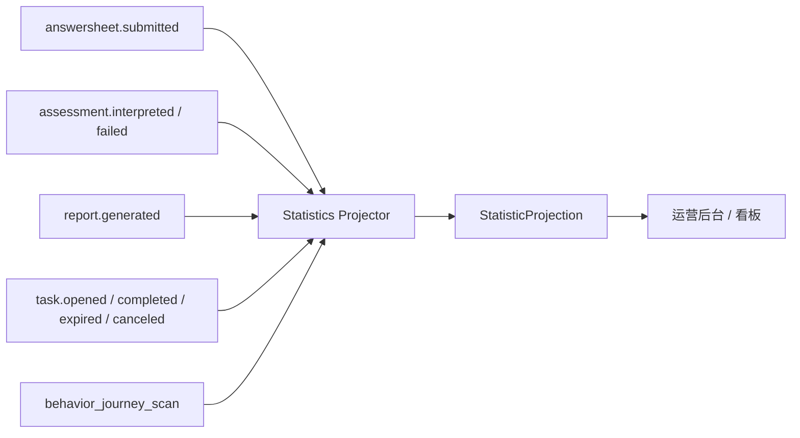

# 事件投影链路

## 1. 业务目标

消费业务事件，更新统计读模型，使运营后台可以查询接入、测评、报告和计划表现。

---

## 2. 流程图

---

## 3. 关键规则

- 投影可以重放或修复。
- 投影失败不回滚核心业务事实。
- 事件重复消费必须幂等。
- 查询视图可以缓存，但必须标注口径和窗口。

---

## 4. 异常处理

| 场景 | 处理 |
| ---- | ---- |
| 事件重复 | 幂等更新 |
| 事件延迟 | 查询侧接受最终一致 |
| 投影失败 | 补偿重放或定时修复 |
| 口径变更 | 新增或迁移读模型，不静默改变历史解释 |
