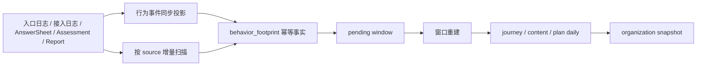

# 事件投影链路

Statistics 同时支持主链路同步投影与后台补偿扫描，两条路径最终写入同一组 journey/content/plan/snapshot 投影。

## 当前扫描源

扫描器按 source 保存 watermark，拉取事实后逐条执行幂等投影。一次扫描返回 scanned、projected、skipped、failed，并记录 source 维度指标；部分失败日志包含 org/source，但 Prometheus 标签不包含 org ID。

## 关键契约

- 相同来源事实重复到达不得重复累计。
- footprint、pending 与 watermark 的事务失败必须回滚。
- pending reconciliation 只重建已到期窗口，失败项保留供下次补偿。
- scheduler 记录成功结果，不丢弃 `ScanDue` 返回值。
- assessment 完成事件与实时兜底均使用 `evaluated`，不使用旧 `interpreted` 状态。
