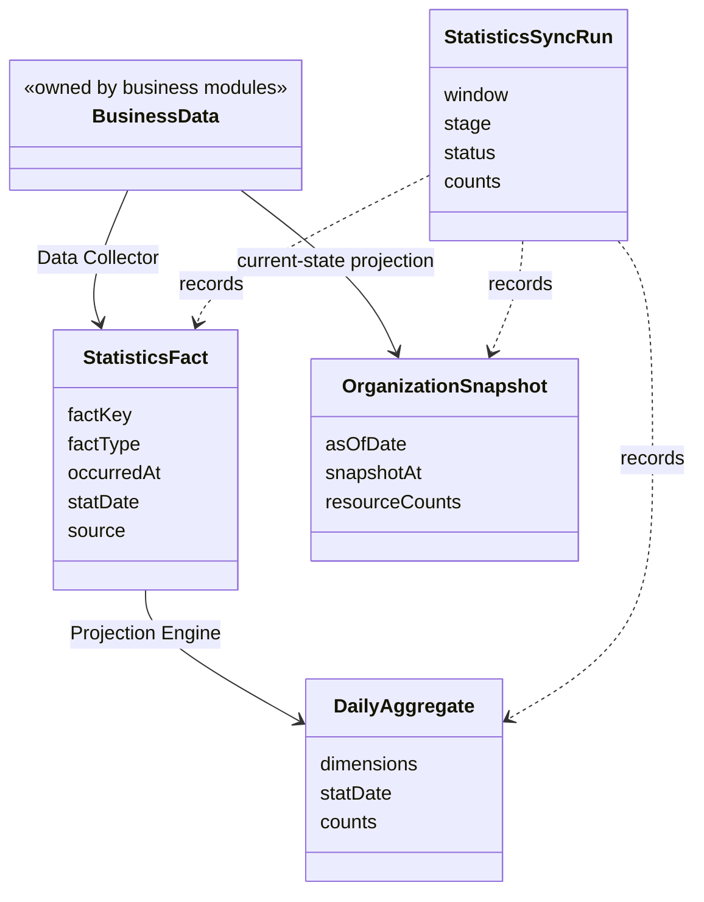
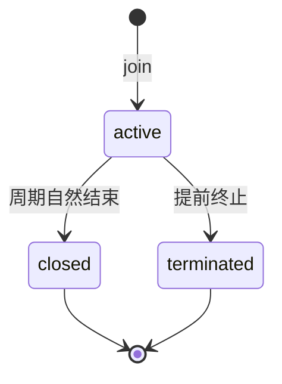
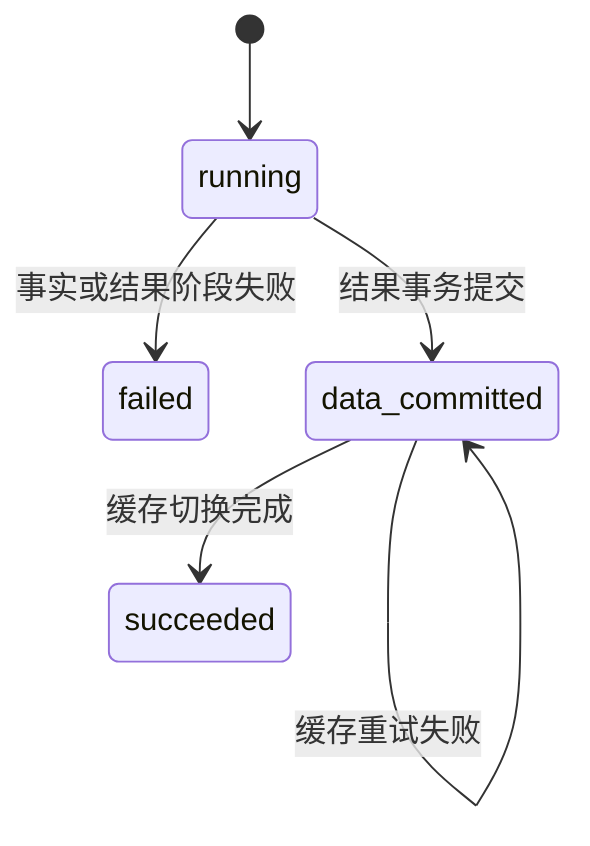

# Statistics 领域模型

> 状态：**目标模型已定稿，代码规划改造**。本文定义 Statistics V2 的概念、身份、生命周期和不变量；当前 `BehaviorFootprint`、`AssessmentEpisode`、Checkpoint 与 Pending 只作为迁移来源，不属于 V2 目标模型。

## 1. 本文回答

1. Statistics 为什么没有传统业务聚合根；
2. Business Data、Data Collector、Fact、Projection、Daily、Snapshot、SyncRun 分别是什么；
3. 三类 Fact 的身份和业务含义是什么；
4. Plan Activity 与 Fulfillment 为什么必须拆开；
5. 历史归属、时间和可重建性由哪些不变量保护。

## 2. 30 秒结论

Statistics 是跨业务模块的派生读侧，不拥有患者、答卷、测评、报告或任务的业务状态。它的核心模型不是一个巨大的 `StatisticsAggregate`，而是五类职责不同的对象：

```text
Business Data   各模块权威真值
Fact            已发生、可构建、可追溯的统计事实
Daily           Fact 按维度和上海自然日形成的物化结果
Snapshot        最近一次机构资源与累计量观察
SyncRun         一次 T+1 采集、投影和发布的运行账本
```



Data Collector 和 Projection Engine 不是新的数据层，而是应用行为：

- Data Collector 决定如何从权威业务数据构建 Fact；
- Projection 拥有一张结果表的统计口径；
- Projection Engine 只负责统一调用 Projection，不拥有指标规则。

## 3. 为什么没有 StatisticsAggregate

传统聚合保护一个写模型事务中的业务不变量，例如：

- AnswerSheet 是否可以最终提交；
- Assessment 是否允许从 submitted 进入 evaluated；
- PlanEnrollment 是否允许终止；
- Task 是否允许从 opened 进入 completed。

Statistics 不决定这些状态。它读取已经成立的事实并派生结果。如果创建一个同时包含机构、医生、入口、内容、测评和 Plan 的大聚合，就会产生错误的所有权：

- Statistics 需要反向加载多个业务模块；
- 统计失败可能被误认为业务提交失败；
- 新增一个维度会迫使修改巨大对象；
- 业务模块可能开始读取统计状态做写侧判断。

因此，Statistics 的领域设计重点不是聚合一致性，而是：

> 事实身份、归属冻结、时间口径、结果可重建性和运行可解释性。

## 4. Business Data：业务权威数据

Business Data 不属于 Statistics，但它是所有统计结果的最终依据。

| 业务模块 | 权威对象 | Statistics 读取的意义 |
| --- | --- | --- |
| Actor | Testee、Clinician、AssessmentEntry、关系 | 当前资源、接入归属和授权范围 |
| Survey | AnswerSheet、Admission | 最终提交与受理时归属 |
| Evaluation | Assessment、Outcome | 测评创建、成功、失败和内容身份 |
| Interpretation | InterpretReport | 报告真实生成或失败 |
| Plan | PlanEnrollment、AssessmentTask | 周期参与、任务活动和履约 |

业务数据与 Statistics 的冲突处理原则是：

1. 先以业务数据为准；
2. 判断 Fact 是否漏采、重复或归属错误；
3. 必要时重建 Fact 或 Daily；
4. 禁止反向修改业务状态来对平统计。

## 5. Data Collector 与 Projection：可扩展行为

### 5.1 Data Collector

Data Collector 是 Statistics 的事实构建组件。它不保存中间数据，而是接收统一采集请求，读取自己负责的业务来源，并幂等写入一类 Fact。

```text
FactCollectionRequest
  orgID
  window
  asOfDate
  runID
  mode(normal/dry-run/backfill)

FactCollectionResult
  sourceCount
  insertedCount
  existingCount
  conflictCount
  factTypeCounts
```

V2 首批包含：

```text
AccessFactCollector
AssessmentFactCollector
PlanFactCollector
```

可扩展性使用两个层次：

1. 同一 Fact 家族新增业务来源时，为现有 Collector 增加强类型 Source Reader/Mapper；
2. 出现新的事实家族时，实现新 Collector、Fact Store 和必要 Projection，再在组合根显式注册。

不使用反射、包扫描或运行时脚本动态发现 Collector。“可扩展”意味着新能力有稳定接口和局部修改点，不意味着建设通用数据平台。

### 5.2 Projection 与 Engine

每个 Projection 拥有一个明确结果：

```text
AccessDailyProjection             -> statistics_access_daily
AssessmentDailyProjection         -> statistics_assessment_daily
PlanActivityDailyProjection       -> statistics_plan_activity_daily
PlanFulfillmentProjection         -> statistics_plan_fulfillment_daily
OrganizationSnapshotProjection    -> statistics_org_snapshot
```

Engine 按固定计划执行它们。Projection 可以扩展，但新增必须伴随结果粒度、指标口径、事务边界和合同测试，不允许在 Engine 中通过 `if metric == ...` 堆叠指标。

## 6. StatisticsFact：标准化统计事实

### 6.1 定义

Statistics Fact 是：

> 从业务权威数据或持久行为记录中提取的、具有稳定身份和发生时间、可以作为统计输入的最小事实。

Fact 不是业务聚合的复制品。它只保留统计需要长期稳定使用的内容：

- 事实类型；
- 发生时间和上海业务日；
- 组织与必要维度；
- 业务对象身份；
- 事实来源；
- 必要的归属与版本快照。

### 6.2 通用事实头

三类 Fact 共享：

```text
FactIdentity
  id
  factKey
  factType

FactTime
  occurredAt
  statDate

FactSource
  sourceType
  sourceRef
  schemaVersion

FactScope
  orgID
```

`fact_key` 是技术幂等身份，不是医疗业务概念。它由稳定的业务来源身份构成，不使用随机请求时间或扫描批次号。

### 6.3 Fact 的可变性

正常业务路径只追加 Fact，不覆盖事实发生时间和身份。

但 Fact 不是合规审计账本，业务仍是权威来源。历史迁移或数据修复可以在明确组织和窗口内重建 Fact，前提是：

- 通过受控工具执行；
- 写入 `StatisticsSyncRun`；
- 重建范围明确；
- 重建后执行来源、Fact 和 Daily 对账。

## 7. AccessFact：接入过程事实

Access Fact 描述用户怎样通过 AssessmentEntry 进入系统，以及接入过程中是否建档、建立或转移服务关系。

核心维度：

```text
orgID
clinicianID
sourceClinicianID
entryID
testeeID
targetType
targetCode
```

事实词汇：

| FactType | 业务含义 | 典型来源 |
| --- | --- | --- |
| `entry_opened` | 一次 Entry 被成功解析/打开 | Resolve Log |
| `intake_confirmed` | 用户完成一次接纳确认 | Intake Log |
| `testee_created` | 本次 Intake 新建受试者 | Intake Log |
| `care_relationship_established` | 本次 Intake 建立服务关系 | Intake Log / 关系事实 |
| `care_relationship_transferred` | 服务归属发生转移 | 关系变更事实 |

这些指标首先是**动作次数**，不是独立人数。一次 Intake Log 可以派生多个 Fact，它们使用同一个 `source_ref`，但各自有不同 `fact_key`。

## 8. AssessmentFact：测评交付阶段事实

### 8.1 为什么按阶段建模

一次测评不是一个瞬间完成的动作：

```text
AnswerSheet submitted
  -> Assessment created
  -> Outcome committed / Assessment failed
  -> Report generated / Report failed
```

每个阶段有独立业务意义、发生时间和失败可能，因此必须分别计数。V2 不再用“Assessment evaluated”同时近似 Outcome 和 Report。

### 8.2 身份与内容

Assessment Fact 可以携带：

```text
testeeID / fillerID
answerSheetID / assessmentID / outcomeID / reportID
questionnaireCode / questionnaireVersion
modelKind / modelCode / modelVersion
```

Questionnaire 身份与 AssessmentModel 身份正交：

- 独立 Questionnaire 只有 AnswerSheet 事实；
- 绑定模型后才产生 Assessment、Outcome 和 Report；
- 医学量表、人格、行为评定和认知测验通过 `model_kind` 区分；
- 版本保留在 Fact 中，Daily 第一阶段按 code 聚合。

### 8.3 AttributionSnapshot

归属回答“这次作答通过什么业务入口进入系统”，包括：

```text
originType / originID
clinicianID / entryID
planID / enrollmentID / taskID
```

新数据在 AnswerSheet 可靠受理时冻结。归属质量由以下值表达：

| AttributionMode | 含义 |
| --- | --- |
| `frozen` | 新链路在受理时冻结，后续不得重新推导 |
| `derived_legacy` | 历史数据根据存量关系尽力恢复 |
| `unknown` | 无法可靠归属，字段保持空值 |

不变量是：

> 新数据的统计归属不能因为医生、Entry 或服务关系后来变化而改变。

## 9. PlanFact：参与和任务事实

### 9.1 PlanEnrollment

目标 Plan 模型正式引入持久化 `PlanEnrollment`：

> 一个 Enrollment 表示一个患者参与一个 Plan 的一轮周期。

身份：

```text
enrollmentID
orgID
planID
testeeID
round
```

状态：



`closed` 表示这轮参与自然结束，不表示所有 Task 都成功完成。履约质量由 Task 统计，而不是 Enrollment 状态代替。

第一版将自然关闭条件定义为：该 Enrollment 的期望 Task 集合已经生成、没有未来待生成任务，并且全部 Task 已进入终态。显式终止命令进入 `terminated`，不能被自动关闭逻辑覆盖。具体状态推进由 Plan 模块负责，Statistics 只消费结果事实。

### 9.2 Task Fact

Task Fact 记录：

```text
task_created
task_opened
task_completed
task_expired
task_canceled
```

每条 Task 归属于一个 Enrollment。`planned_at`、`due_at`、`completed_at` 分别承担不同时间语义，不能用 `updated_at` 代替。

V2 第一阶段不统计“重排次数”。新一轮参与应创建新 Enrollment 和新 Task；如果同一 Enrollment 内确实支持调整时间，Plan 必须持久化 Schedule Revision，Statistics 不使用 `updated_at` 猜测重排。

## 10. DailyAggregate：日聚合结果

Daily 是按稳定维度和上海自然日形成的可重建结果，不是新事实。

| Daily | 核心问题 |
| --- | --- |
| AccessDaily | 某天发生多少入口打开、Intake、建档和关系建立 |
| AssessmentDaily | 某天提交多少 AnswerSheet、创建多少 Assessment、产生多少 Outcome/Report |
| PlanActivityDaily | 某天发生多少加入、开放、完成、过期和终止动作 |
| PlanFulfillmentDaily | 某天计划或到期的任务最终履约得怎样 |

Daily 的通用不变量：

- 四类 Daily 只由 Fact 派生；OrganizationSnapshot 可以读取明确的当前业务状态；
- 相同窗口重复重建结果相同；
- 一个指标只有一个所有者表；
- 比率查询时计算，不重复保存；
- 删除并重建窗口必须处于一个 MySQL 事务。

## 11. Activity 与 Fulfillment

这是 Plan 统计最容易混淆的边界。

Activity 按事件发生时间回答：

```text
昨天创建、开放、完成或过期了多少任务？
```

Fulfillment 按计划/到期 cohort 回答：

```text
昨天应当履约的任务，最终有多少完成、按时完成或逾期？
```

一个任务可能在 7 月 1 日到期、7 月 3 日才完成：

- `task_completed` Activity 归属 7 月 3 日；
- Fulfillment 仍归属 7 月 1 日，并记为逾期完成。

这也是第一版对 Plan Fulfillment 按机构全量重建，而不是只修复最近几天的原因。

## 12. OrganizationSnapshot：机构当前观察

Snapshot 保存最近一次同步时观察到的机构资源和累计量：

```text
testee / clinician / active clinician
entry / active entry
active enrollment
answersheet / assessment / report / content
```

两个时间字段不可混淆：

- `snapshot_at`：实际读取当前业务状态的时间；
- `as_of_date`：Daily 已经完整覆盖的最后一个上海自然日。

Snapshot 不是严格的历史维表。当前 Actor 或 Entry 状态查询仍可直接读取业务表；Statistics 不为当前体量复制一套完整资源维度状态层。

## 13. StatisticsSyncRun：运行账本

SyncRun 不是业务事实，而是 Statistics 的运行治理实体。它回答：

- 哪个机构在处理哪个窗口；
- 当前停在事实采集、Projection 执行还是缓存切换；
- 来源、Fact 和结果各有多少行；
- MySQL 是否已经提交；
- 是否只剩缓存闭环；
- 失败原因和人工触发原因是什么。

状态：



`data_committed` 是必要状态：缓存失败不能回滚已经正确提交的 MySQL 统计结果。

## 14. 时间模型

Statistics 统一采用 `Asia/Shanghai`：

```text
BusinessDay       上海自然日
InstantRange      [from, to)
DailyDateRange    [fromDate, toDateExclusive)
AsOfDate          最后一个完整统计日
```

规则：

- `stat_date` 由 `occurred_at` 在上海时区下计算；
- MySQL `DATETIME(3)` 统一解释为上海时间；
- 代码显式加载 `Asia/Shanghai`，不依赖机器的隐式本地时区；
- 历史 DATETIME 是否需要转换必须逐表核实，不能统一加减八小时。

## 15. 核心不变量

### 15.1 所有权

- Statistics 不修改业务聚合；
- Statistics 数据不能成为 Survey、Evaluation、Interpretation 或 Plan 写侧前置条件；
- 查询授权仍以 IAM/Actor 和业务资源范围为准。

### 15.2 事实

- `fact_key` 在同一事实语义下唯一；
- 新 Assessment 归属必须是 `frozen`；
- 无法确认的历史归属使用空值，不伪造 ID；
- 同一来源反复扫描不增加 Fact 数量。

### 15.3 结果

- Daily 可以删除并重建；
- 相同输入和 `as_of_date` 必须产生相同结果；
- Activity 与 Fulfillment 不混算；
- Snapshot 必须同时返回 `snapshot_at` 和 `as_of_date`。

### 15.4 恢复

- 统计失败不回滚业务主链路；
- 单机构失败不污染其他机构；
- 结果事务失败必须整体回滚；
- 缓存失败保留 `data_committed`，可单独重试；
- 修复必须从业务数据或 Fact 重建，不手工改最终数字。

## 16. 当前模型到 V2 的替换关系

| 当前对象 | V2 去向 |
| --- | --- |
| Resolve/Intake Log | 保留为 Access Fact 来源 |
| `BehaviorFootprint` | 被三类 Fact 取代，切换后归档 |
| `AssessmentEpisode` | 被 Assessment Fact 阶段模型取代 |
| `StatisticsJourneyMutation` | 不进入 V2 领域模型 |
| Scanner Checkpoint | T+1 重跑后删除 |
| Pending | T+1 整批失败/重跑后删除 |
| `statistics_journey_daily` | 拆为 AccessDaily 与 AssessmentDaily |
| `statistics_plan_daily` | 拆为 ActivityDaily 与 FulfillmentDaily |
| `statistics_org_snapshot` | 扩充并明确两个时间字段 |

## 17. 代码事实与后续验证

当前实现入口：

- [`domain/statistics/journey.go`](../../../internal/apiserver/domain/statistics/journey.go)
- [`domain/statistics/v1_types.go`](../../../internal/apiserver/domain/statistics/v1_types.go)
- [`application/statistics/sync_service.go`](../../../internal/apiserver/application/statistics/sync_service.go)
- [`infra/mysql/statistics/po.go`](../../../internal/apiserver/infra/mysql/statistics/po.go)
- [`infra/mysql/statistics/po_journey.go`](../../../internal/apiserver/infra/mysql/statistics/po_journey.go)
- [`domain/plan/plan_enrollment.go`](../../../internal/apiserver/domain/plan/plan_enrollment.go)

V2 实施后至少需要验证：

- Fact 唯一键和重复扫描；
- 上海零点边界；
- 新旧归属切换点；
- PlanEnrollment 多轮参与；
- Daily 确定性重建；
- Fulfillment 旧 cohort 变化；
- SyncRun 失败与缓存恢复。
