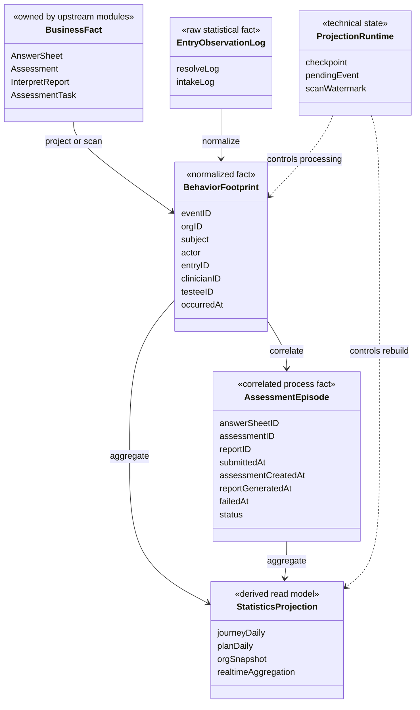
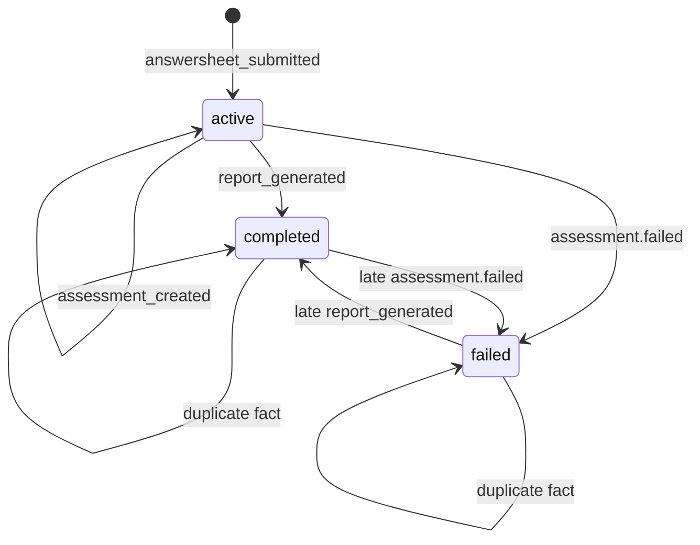
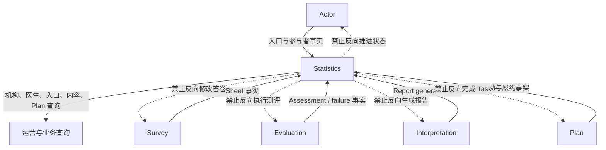

# Statistics 领域模型

> 状态：**已重写**。本文以 `internal/apiserver/domain/statistics`、应用投影服务、MySQL 持久化与当前查询模型为事实基础，说明 Statistics 的三层模型、核心对象和一致性边界。技术执行细节将在后续专题展开。

## 1. 本文回答

本文重点回答：

- Statistics 为什么是业务模块，却没有传统意义上的业务聚合根；
- 业务数据、统计事实和统计结果为什么必须分层；
- `BehaviorFootprint` 与普通日志有什么区别；
- `AssessmentEpisode` 表达的是一次测评、一次问诊，还是完整患者旅程；
- 日聚合、查询 DTO 和 Redis 缓存是否属于领域事实；
- 扫描水位、checkpoint 和 pending event 应放在领域模型的什么位置；
- 为什么统计数据可以最终一致，却不能接受无法解释的错误；
- Statistics 与 Actor、Survey、Evaluation、Interpretation、Plan 之间如何保持单向依赖。

本文不逐项定义指标计算公式，也不展开扫描调度、补偿退避和重建 SQL。它先建立理解后续文档所需的概念骨架。

## 2. 30 秒结论

Statistics 不是以“一个聚合根保护一次业务命令”为中心的写模型，而是以“从多业务边界观察过程，并形成稳定查询语义”为中心的读侧领域。

当前模型可以分为四组对象：

| 对象组 | 代表对象 | 性质 |
| --- | --- | --- |
| 上游业务事实 | AnswerSheet、Assessment、InterpretReport、AssessmentTask 等 | 由其他模块拥有的权威事实，Statistics 只读 |
| 统计过程事实 | 入口 resolve/intake 日志、`BehaviorFootprint`、`AssessmentEpisode` | Statistics 为过程观察、关联和重放维护的事实 |
| 统计结果模型 | `StatisticsJourneyDaily`、`StatisticsPlanDaily`、`StatisticsOrgSnapshot`、查询 DTO | 由事实按维度、窗口和口径派生的读模型 |
| 投影运行时状态 | `ScanWatermark`、analytics checkpoint、`AnalyticsPendingEvent` | 保证投影可推进、幂等、补偿和恢复的技术状态 |



最重要的领域边界是：

> Statistics 中的事实用于解释和重建统计结果，不得被上游模块拿来替代业务真值；Statistics 中的结果用于回答查询，不得反向驱动业务状态迁移。

## 3. 为什么 Statistics 没有传统聚合根

### 3.1 写模型聚合解决什么问题

Survey、Evaluation、Interpretation 和 Plan 中的聚合通常围绕一次业务命令保护不变式：

- AnswerSheet 的最终提交必须满足问卷和答案契约；
- Assessment 必须沿合法状态机执行并冻结输入；
- InterpretReport 必须在冻结 Outcome 上幂等生成；
- AssessmentTask 只能沿合法状态完成或过期。

这类聚合会拒绝非法命令，并在事务内决定新的权威状态。

### 3.2 Statistics 解决的是派生与观察问题

Statistics 不决定用户能否提交答卷，也不决定报告是否生成。它接收已经发生的事实，然后回答：

- 这个事实属于哪个机构、医生、入口、受试者或内容；
- 它处在接入漏斗或测评服务过程的哪一步；
- 应该按哪一个发生时间归入哪一天；
- 重复到达时是否已经处理；
- 前置事实尚未到达时应该等待还是跳过；
- 当前结果是否可以从事实重新计算。

因此 `domain/statistics` 中存在领域语言、值对象、过程事实和查询模型，但这不意味着每个类型都是聚合根。Statistics 的核心不变量主要由“事实不可反向污染、投影幂等、口径稳定、结果可恢复”构成，而不是由一个大聚合的事务边界构成。

### 3.3 为什么不能创建一个 StatisticsAggregate

如果把机构所有统计都放进一个 `StatisticsAggregate`，会造成：

- 一个机构的每次入口打开、答卷提交和报告生成都竞争同一个版本；
- 聚合会随时间无限增长；
- 任意指标新增都要求修改同一个巨大对象；
- 重建一个时间窗口必须加载整个机构历史；
- 医生、入口、内容和 Plan 维度无法独立扩展；
- 查询模型和业务写模型重新耦合。

当前采用“追加事实 + 小型过程关联 + 按维度物化投影”的方式，更符合统计读侧的访问和恢复模式。

## 4. 三层数据语义

### 4.1 第一层：业务数据层

业务数据层保存业务模块自己的权威事实。

| 事实 | 所有者 | Statistics 可以做什么 | Statistics 不能做什么 |
| --- | --- | --- | --- |
| Testee、Clinician、关系、AssessmentEntry | Actor | 查询资源规模、入口归属和访问范围 | 创建关系、改变入口状态或重做授权决策 |
| Questionnaire、AnswerSheet | Survey | 读取提交时间、受试者和内容身份 | 修改答案、补算基础分或判定提交有效性 |
| Assessment、Outcome | Evaluation | 观察创建、失败和完成状态 | 执行算法、改变 Outcome 或触发业务重试 |
| InterpretReport | Interpretation | 观察报告实际生成 | 修改模板、正文、Audience 或报告状态 |
| AssessmentPlan、AssessmentTask | Plan | 统计活动、到期 cohort 和履约 | 开放、完成、过期或取消 Task |

当 Statistics 与业务数据不一致时，不能为了让报表数字好看而直接修改业务对象。正确方向是判断：

1. 上游业务数据是否正确；
2. 统计是否漏采了事实；
3. 事实是否被重复或错误归因；
4. 聚合窗口或指标公式是否错误；
5. 缓存是否仍在返回旧结果。

### 4.2 第二层：统计事实层

统计事实层不是业务数据的完整副本，而是为了回答统计问题而保存的最小过程信息。

当前进一步分为三种形态：

| 形态 | 当前对象 | 作用 |
| --- | --- | --- |
| 原始观察日志 | `assessment_entry_resolve_log`、`assessment_entry_intake_log` | 保存入口被解析、接纳成功等不能从最终状态反推的行为 |
| 标准化行为事实 | `BehaviorFootprint` | 用统一事件名、主体、行为者和业务标识表达跨模块行为节点 |
| 关联过程事实 | `AssessmentEpisode` | 将 AnswerSheet、Assessment、Report 和可选入口/医生归因关联为一次测评服务过程 |

统计事实与上游业务事实的差别是：

- AnswerSheet 证明“一份最终答卷已经提交”；
- `answersheet_submitted` footprint 证明“统计投影观察到了这次提交，并记录了用于统计的维度”；
- AssessmentEpisode 证明“这次提交在统计视角下如何继续关联到 Assessment、Report 或失败”；
- 日聚合则回答“某天某维度累计发生了多少次”。

后面三者都不能反过来证明 AnswerSheet 在 Survey 中合法存在。

### 4.3 第三层：统计结果层

结果层是按查询需求组织的派生模型，不要求与一个写侧聚合一一对应。

| 结果模型 | 主要维度 | 回答的问题 |
| --- | --- | --- |
| `statistics_journey_daily` | org / clinician / entry + date | 接入和测评服务各节点每天发生多少次 |
| `statistics_plan_daily` | org + plan + date | Task 创建、开放、完成、过期和活跃受试者情况 |
| `statistics_org_snapshot` | org | 机构资源与维度概览快照 |
| 实时 SQL 聚合 | org、clinician、entry、content、testee、window | 不适合或尚未物化的当前查询结果 |
| API 查询 DTO | 页面/调用方所需组合 | 将多个结果来源组合为稳定查询契约 |

结果层数据可以删除后重建的前提是：

- 构建它所需的业务事实和统计事实仍然保留；
- 指标口径、时间范围和维度定义仍然可追溯；
- 重建程序能够覆盖目标范围；
- 重建完成后有对账和查询验证。

“派生数据”不等于“可以无审计地删表”。在线 API 仍依赖这些结果，删除或重建会影响可用性和新鲜度。

## 5. BehaviorFootprint：标准化行为事实

### 5.1 它解决什么问题

入口、Actor、Survey、Evaluation 和 Interpretation 各自使用不同对象和存储。如果每个统计指标都直接理解所有业务表，统计代码会重复处理：

- 事件名称；
- 机构和受试者身份；
- 医生和入口归属；
- AnswerSheet、Assessment、Report 之间的关联；
- 发生时间和扩展属性。

`BehaviorFootprint` 把这些差异规范为统一事实：

```text
谁在什么机构
  -> 围绕哪个 subject
  -> 以什么 actor 身份
  -> 在哪个入口/医生/受试者上下文
  -> 对哪份 AnswerSheet/Assessment/Report
  -> 发生了什么行为
  -> 发生在什么时候
```

### 5.2 当前行为词汇

当前领域枚举包含：

| 行为 | 含义 |
| --- | --- |
| `entry_opened` | 测评入口被打开或解析 |
| `intake_confirmed` | 入口接纳流程完成 |
| `testee_profile_created` | 创建受试者档案 |
| `care_relationship_established` | 建立看护/服务关系 |
| `care_relationship_transferred` | 关系发生转移 |
| `answersheet_submitted` | AnswerSheet 最终提交 |
| `assessment_created` | 基于 AnswerSheet 创建 Assessment |
| `report_generated` | Interpretation 报告实际生成 |

这里必须区分“领域词汇已经声明”和“投影链路已经完整支持”：

- `care_relationship_transferred` 已存在于 `BehaviorEventName` 枚举，但当前 `behaviorEventRouter` 没有对应分支，不能视为已经接入的统计节点；
- Assessment 失败会进入 Episode 和 Journey 失败指标，但它使用 Evaluation 的失败事件类型进入路由，当前并未定义为 `BehaviorEventName` 中的独立 footprint 名称。

后续指标文档必须同时核对枚举、路由、持久化和重建 SQL，不能只根据一个常量名称推断能力已经实现。

### 5.3 身份与幂等

`BehaviorFootprint.ID` 使用来源事件的稳定标识；扫描生成的事实使用 `scan:<event_name>:<source_id>` 形式的稳定 ID。MySQL 写入以主键冲突 `DoNothing` 保护追加幂等。

这解决的是“同一个事实重复投影”问题，但不自动解决所有统计重复问题：

- 如果同一个业务动作产生了两个不同来源 ID，仍可能被视为两个事实；
- 如果 footprint 已存在而日聚合事务没有一起成功，需要依赖事务回滚或重建恢复；
- 如果实时投影和扫描使用不一致的事件 ID 规则，需要额外对账。

因此幂等必须结合事务、checkpoint、扫描水位和窗口重建理解，不能只看一张表的唯一键。

## 6. AssessmentEpisode：一次测评服务过程

### 6.1 领域定义

`AssessmentEpisode` 表达：

> 从一份 AnswerSheet 已提交开始，到对应 Assessment 被创建，最终生成报告或进入失败状态的一次测评服务过程；它还可以关联此前的入口接纳与医生归因。

它不是：

- 患者的一次完整门诊；
- 一段治疗周期；
- 一个 Plan；
- 患者跨多次测评的长期趋势；
- 医学诊断过程。

如果业务未来需要表达完整问诊或治疗旅程，应创建更高层的业务或分析模型，不能继续向 AssessmentEpisode 塞入所有医疗流程。

### 6.2 为什么以 AnswerSheet 为起点

当前 Episode 使用 AnswerSheetID 作为稳定关联起点：

- AnswerSheet 是一次最终作答事实；
- 一个 Assessment 由该 AnswerSheet 继续创建；
- 一个 Report 再关联到该 Assessment；
- 同一 AnswerSheet 对应的 Episode 可以在异步事件乱序时被继续补全。

入口打开和接纳可能发生在 AnswerSheet 之前，但它们不一定最终产生答卷，因此不适合作为每个 Episode 的必需起点。Episode 会在可用时记录最近接纳事实的 `entry_id`、`clinician_id` 和 `attributed_intake_at`。

### 6.3 当前状态机



| 状态 | 业务含义 | 关键时间 |
| --- | --- | --- |
| `active` | AnswerSheet 已提交，测评服务尚未形成报告或失败终态 | `submitted_at`，可选 `assessment_created_at` |
| `completed` | 当前最后处理的关键事实表明报告已经生成 | `report_generated_at` |
| `failed` | 当前最后处理的关键事实表明对应 Assessment 失败 | `failed_at`、`failure_reason` |

这里的 `completed` 是 Statistics 对“一次测评服务过程完成”的定义，不等同于 Evaluation 中某个状态名称。尤其要区分：

- Assessment 已完成计分或提交 Outcome；
- Interpretation 报告已经实际生成；
- Episode 完成。

当前 Episode 以报告生成作为完成节点。指标命名必须明确使用哪个节点，不能把“测评已评估”和“报告已生成”混成同一个完成数。

还需要注意：当前代码没有把 `completed` 和 `failed` 实现成不可逆终态。晚到的 Assessment 失败事实可以把 completed 改为 failed，晚到的报告事实也可以把 failed 改为 completed。这是当前投影的“后到事实继续修正过程状态”语义，同时也暴露出终态优先级尚未显式建模的问题；后续应在重构清单中单独评估。

### 6.4 乱序与延迟归因

异步链路中的事实可能不是严格按业务顺序到达：

- `assessment_created` 到达时，对应 AnswerSheet Episode 可能尚未投影；
- `report_generated` 到达时，对应 Assessment 可能尚未写入 Episode；
- 入口接纳事实可能晚于 AnswerSheet 扫描进入 Statistics。

当前模型使用两种方式收敛：

1. 找不到 Episode 的后续事实进入 pending，稍后重试；
2. 后到的 intake 可以在归因窗口内回绑 Episode，并对医生/入口日聚合做负向撤销和正向重分配。

这说明 `entry_id` 和 `clinician_id` 是 Episode 的统计归因，而不是 AnswerSheet 的业务所有权。归因调整可以改变统计维度，但不能改变 Survey、Actor 或 Evaluation 的权威事实。

## 7. StatisticsJourneyMutation：投影命令，不是领域事实

`StatisticsJourneyMutation` 表达某个事实对日聚合产生的增量：

```text
org / clinician / entry / statDate
  + entryOpenedCount
  + intakeConfirmedCount
  + answerSheetSubmittedCount
  + assessmentCreatedCount
  + reportGeneratedCount
  + failedCount
  ...
```

它是从事实到投影的内部命令对象，具有三个特点：

1. 它可以包含正增量，也可以在归因修正时包含负增量；
2. 它本身不是独立持久化的业务事实；
3. 最终结果通过 `(org_id, subject_type, subject_id, stat_date)` 等唯一维度累加到日聚合。

因此不能只保存 mutation 而删除 footprint/episode，再声称事实仍可追溯。Mutation 说明“这次准备怎样改读模型”，Footprint/Episode 才说明“为什么要这样改”。

## 8. 统计查询模型

### 8.1 Query Model 不是聚合

`StatisticsOverview`、`ClinicianStatistics`、`AssessmentEntryStatistics`、`ContentBatchStatisticsResponse` 和 `TesteePeriodicStatisticsResponse` 都是面向调用方的查询模型。

它们允许：

- 组合不同表和不同统计层次；
- 同时包含快照、窗口和趋势；
- 对缺失日期补零；
- 计算完成率等派生值；
- 根据访问范围裁剪数据；
- 为某个页面设计稳定字段。

但它们不拥有状态机，也不能作为其他模块写入业务事实的输入。

### 8.2 三种时间语义必须区分

统计模型至少存在三种时间归属：

| 时间语义 | 示例 | 回答的问题 |
| --- | --- | --- |
| 事件发生时间 | opened_at、submitted_at、report_generated_at | 某天实际发生了多少动作 |
| 计划/截止 cohort | planned_at、expire_at | 某个应履约窗口的完成情况怎样 |
| 快照时间 | snapshot_at | 截至某次刷新，机构资源有多少 |

Plan 的 `activity` 使用事件发生时间，`fulfillment` 使用计划/截止 cohort。两者即使字段看起来都叫“completed”，分母、归属日期和业务问题也不同。

所有时间窗口在应用查询中应按半开区间 `[from, to)` 理解。日期型 `to` 会规范化到次日零点；当前实现依赖进程 `time.Local`，尚未形成机构级时区模型。指标文档需要把这一点写进每个涉及日期的口径。

### 8.3 完成率只是口径结果

`CompletionRate(total, completed)` 当前只执行：

```text
completed / total * 100
```

真正困难的不是除法，而是确定：

- total 到底是提交数、计划数、到期数还是创建数；
- completed 指 Assessment 完成、Report 生成还是 Task 完成；
- 是否限定机构、医生、入口、内容类型和时间窗口；
- 分子和分母是否使用同一种 cohort。

所以完成率必须属于指标口径文档，不能只凭函数名理解业务含义。

## 9. 投影运行时状态

### 9.1 为什么它们不属于统计事实层

`ScanWatermark`、analytics checkpoint 和 `AnalyticsPendingEvent` 都很重要，但它们记录的是“Statistics 怎样处理事实”，而不是“业务发生了什么”。

| 运行时状态 | 回答的问题 | 不能证明什么 |
| --- | --- | --- |
| `ScanWatermark` | 某机构某来源扫描到哪个 ID/时间、当前是否失败 | 上游事实一定完整 |
| analytics checkpoint | 某事件是否开始、pending 或完成投影 | 业务事件本身一定合法 |
| `AnalyticsPendingEvent` | 哪个乱序事件需要何时重试、已尝试几次 | 对应业务过程已经失败 |

把它们单独列为运行时状态有两个好处：

1. 清理或迁移运行时表时，不会误把它们当成可有可无的缓存；
2. 业务人员看到 pending 时，不会误解为患者测评失败。

### 9.2 Checkpoint 与 Watermark 的区别

- checkpoint 按事件 ID 保护单个投影幂等和处理状态；
- watermark 按 `(org, source)` 推进增量扫描位置；
- pending event 保存因为前置 Episode 缺失等原因尚不能完成的单个事实。

三者解决不同问题，不能用一个“最后处理时间”字段替代。

## 10. 聚合边界与事务边界

Statistics 没有一个覆盖全模块的事务，但局部写入仍需要清晰的原子边界。

### 10.1 单个行为事实的投影事务

一次行为投影通常需要在同一 MySQL 事务内完成：

```text
检查/创建 event checkpoint
  -> 追加 BehaviorFootprint
  -> 创建或更新 AssessmentEpisode
  -> 更新 statistics_journey_daily
  -> 标记 completed 或写入 pending
```

如果中间失败，已写 footprint 却未更新聚合，或聚合已增加但 checkpoint 未完成，都会破坏重试语义。当前 application projector 通过 transaction runner 保护这一局部一致性边界。

### 10.2 跨存储扫描不是单一事务

AnswerSheet 在 MongoDB，Assessment 和多数统计表在 MySQL。扫描无法把“读取 MongoDB”与“写入 MySQL 投影”放进一个分布式事务。

因此这里依赖：

- 稳定 source ID；
- 重叠 lookback 窗口；
- 每个来源/机构的 watermark；
- MySQL 内部投影事务；
- 重复写幂等；
- 必要时窗口重建。

这是最终一致性设计，不是跨库强一致事务。

### 10.3 结果重建事务

日聚合重建以机构和有界日期窗口为边界；机构快照和 Plan 聚合也分别重建。它们不需要与上游业务写入锁在同一个事务，但需要明确重建期间的读取语义和完成后的验证。

## 11. 核心不变量

### 11.1 所有权不变量

1. Statistics 不创建或修改 AnswerSheet、Assessment、InterpretReport 和 AssessmentTask；
2. 统计投影不作为上游业务命令的准入条件；
3. 统计归因变化不能改变 Actor 关系或入口归属真值；
4. API 查询模型不能被写侧模块当作共享聚合。

### 11.2 事实不变量

1. 每个标准化事实必须包含机构和稳定来源身份；
2. 同一来源事实重复到达不能重复创建 footprint；
3. Episode 必须以 AnswerSheet 作为稳定关联起点；
4. 后续事实缺少前置 Episode 时不能伪造前置事实，应进入 pending 或等待扫描；
5. 事实时间和系统处理时间不能混为一个指标时间。

### 11.3 结果不变量

1. 每个指标必须明确事实来源、维度、时间归属、分子和分母；
2. 同一指标的实时查询与物化聚合必须使用相同业务口径；
3. 结果层可以重建，但重建不能修改业务数据层；
4. 缓存结果不能比持久化读模型拥有更高权威性；
5. 机构和资源授权必须先于结果返回，不能因统计聚合泄露跨租户数据。

### 11.4 恢复不变量

1. 可以判断扫描停在何处、哪个来源失败；
2. 可以判断事件是 completed、pending 还是尚未投影；
3. 可以对有界窗口重新计算聚合；
4. 重建后必须能通过事实数、聚合数或 API 结果对账；
5. 删除事实前必须确认下游重建能力和保留要求，不能把“可派生”误写成“可随时删除”。

## 12. 与其他模块的关系



Statistics 对上游的依赖应是读取、事件投影或扫描适配，不应让上游聚合依赖 Statistics 才能完成业务命令。唯一允许的反向使用是业务展示或运营决策读取统计结果，而不是用统计结果替代业务状态。

## 13. 当前模型的优势与限制

### 13.1 当前优势

- 将跨模块行为标准化为 footprint，避免每个查询重复理解所有业务存储；
- 用 Episode 表达 AnswerSheet 到 Report 的测评服务过程；
- 同时支持按事件增量投影和按来源扫描补偿；
- 使用 checkpoint、pending 和 watermark 分别解决幂等、乱序和扫描推进；
- 日聚合按机构、医生和入口维度复用同一模型；
- 允许物化结果与实时查询并存，避免所有指标都强行进入一张统计表；
- 业务写侧不依赖统计成功，保护核心测评链路可用性。

### 13.2 当前限制

- `AssessmentEpisode` 只覆盖单次测评服务过程，不能直接表达完整门诊或治疗周期；
- 事实采集同时存在直投入口和扫描路径，需要持续核对来源身份与重复语义；
- 当前查询是混合读模型，不同指标可能来自快照、日聚合或实时表，必须建立统一指标词典；
- “Assessment 已评估”“Report 已生成”“Task 已完成”等完成概念容易发生命名碰撞；
- 当前增量投影在 `report_generated` 时同时增加 `assessment_created_count`，而窗口重建按 `assessment_created_at` 统计，两条路径的时间归属可能不一致；
- `care_relationship_transferred` 已声明领域词汇但尚未进入当前投影路由；
- Episode 的 completed/failed 缺少明确的终态优先级规则；
- 当前时间范围依赖 `time.Local`，缺少机构级时区语义；
- 统一的投影延迟、数据新鲜度和对账 SLO 尚未固化为领域契约。

这些限制将在 `90-设计问题与重构清单.md` 中形成可执行台账；本文只定义问题发生在哪一层，不提前给出重构方案。

## 14. 代码落点与验证

| 概念 | 当前代码位置 |
| --- | --- |
| BehaviorFootprint、AssessmentEpisode、Journey mutation | [`journey.go`](../../../internal/apiserver/domain/statistics/journey.go) |
| 扫描来源事实与 watermark | [`scan.go`](../../../internal/apiserver/domain/statistics/scan.go) |
| Overview、医生、入口、内容和 Plan 查询模型 | [`v1_types.go`](../../../internal/apiserver/domain/statistics/v1_types.go) |
| 完成率和基础值对象 | [`aggregator.go`](../../../internal/apiserver/domain/statistics/aggregator.go)、[`types.go`](../../../internal/apiserver/domain/statistics/types.go) |
| Episode 投影与 pending 编排 | [`application/statistics`](../../../internal/apiserver/application/statistics/) |
| footprint、episode 和 runtime 持久化 | [`infra/mysql/statistics`](../../../internal/apiserver/infra/mysql/statistics/) |
| Statistics ReadModel | [`readmodel`](../../../internal/apiserver/infra/mysql/statistics/readmodel/) |
| 表结构与唯一约束 | [`migrations/mysql`](../../../internal/pkg/migration/migrations/mysql/) |

定向验证：

```bash
go test ./internal/apiserver/domain/statistics
go test ./internal/apiserver/application/statistics
go test ./internal/apiserver/infra/mysql/statistics/...
make docs-hygiene
make docs-facts
```

验证时不能只看测试通过，还应回答：同一事实重复投影是否只计一次、乱序事实是否进入 pending、事务失败是否回滚 footprint/episode/聚合、窗口重建是否能重新得到相同口径结果。
