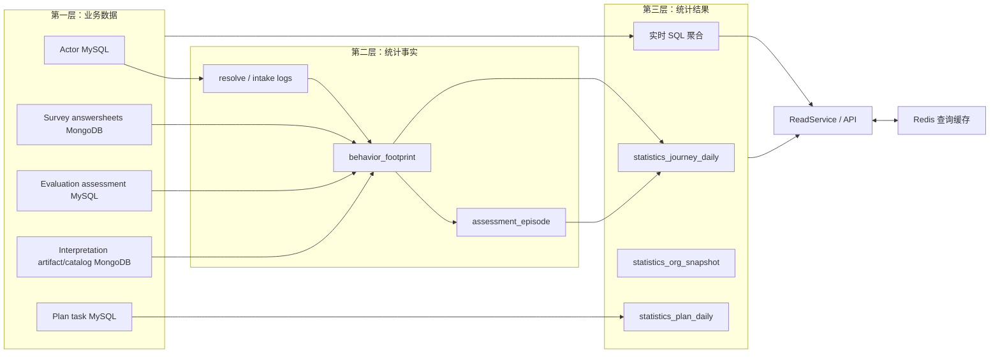
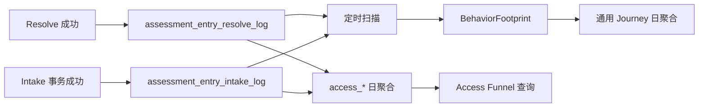
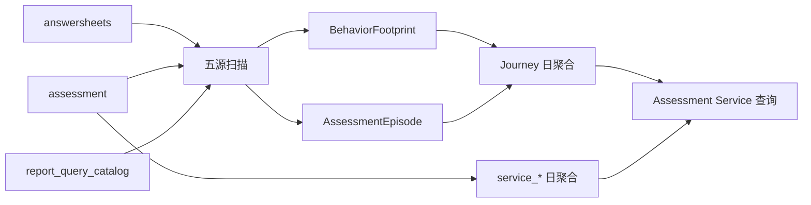
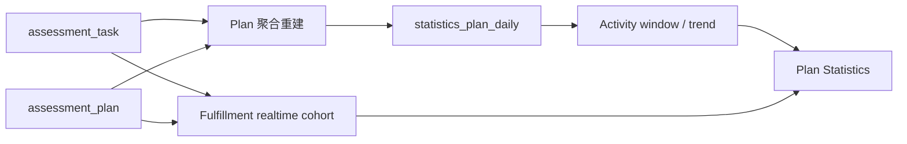

# 核心设计：业务数据、事实与统计分层

> 状态：**已重写**。本文以当前业务模块持久化、Statistics 扫描源、MySQL 事实/聚合表、ReadModel SQL 和生产配置为事实基础，说明三层数据的所有权、写入路径、查询用途与重建边界。

## 1. 本文回答

本文重点回答：

- “业务数据”“统计事实”“统计结果”分别是什么，为什么不能混用；
- AnswerSheet、Assessment、Report 和 Task 为什么仍由原模块拥有；
- 入口 resolve/intake 日志为什么属于事实层，而不是普通调试日志；
- `BehaviorFootprint` 与 `AssessmentEpisode` 是怎样从多个存储中形成的；
- `statistics_journey_daily`、`statistics_plan_daily` 和 `statistics_org_snapshot` 分别从哪里重建；
- 为什么当前 ReadModel 同时读取业务表、事实表和统计表；
- 哪些数据可以安全重建，哪些数据删除后无法从最终状态恢复；
- checkpoint、pending、watermark 和 Redis 为什么不属于三层业务真值；
- 当前实现中有哪些分层语义尚未完全对齐。

投影批次、扫描水位推进、pending 退避和事务实现将在下一篇文档展开；本文先把每一层的数据身份和所有权讲清楚。

## 2. 30 秒结论

Statistics 的三层模型不是按数据库划分，而是按**权威性与用途**划分：

| 层次 | 回答的问题 | 谁拥有 | 能否反向驱动业务 |
| --- | --- | --- | --- |
| 业务数据层 | 业务事实上是什么 | Actor、Survey、Evaluation、Interpretation、Plan | 可以，它本身就是业务真值 |
| 统计事实层 | Statistics 观察到了哪些过程，以及怎样关联这些过程 | Statistics | 不可以，只能支持统计解释与重建 |
| 统计结果层 | 按指定维度、窗口和口径计算出什么结果 | Statistics ReadModel | 不可以，只能用于查询与运营观察 |



最关键的边界是：

> 业务数据决定事实是否成立；统计事实决定 Statistics 怎样观察和重放过程；统计结果决定查询怎样高效回答。下游层可以从上游层派生，但不能反过来修改上游真值。

## 3. 先统一“事实”这个词

### 3.1 业务事实

业务事实是所属模块已经接受并持久化的权威状态，例如：

- Survey 已经可靠受理一份 AnswerSheet；
- Evaluation 已经创建一个 Assessment；
- Interpretation 已经生成一份不可变报告成品；
- Plan 已经把某个 Task 标记为 completed；
- Actor 已经建立医生与受试者的有效关系。

当业务事实与统计数字冲突时，优先相信业务事实，再检查采集和投影。

### 3.2 原始统计事实

原始统计事实是为了观察过程而在动作发生时留下的记录。它通常不改变业务决策，却保存最终状态无法回答的信息。

例如 `assessment_entry` 当前是否有效，无法回答这个入口历史上被打开过多少次；`clinician_relation` 当前存在，也无法回答这次 intake 是否新建了关系。因此需要：

- `assessment_entry_resolve_log`；
- `assessment_entry_intake_log`。

这两张表不是调试日志，而是漏斗统计的原始事实源。

### 3.3 标准化统计事实

标准化统计事实把来自不同模块和存储的数据转换成统一统计语言：

- `BehaviorFootprint` 表达一个可归属、可计数的行为节点；
- `AssessmentEpisode` 表达一份 AnswerSheet 到 Assessment、Report 或失败的一次测评服务过程。

它们属于 Statistics，但仍不是业务真值的副本。

### 3.4 统计结果

统计结果是经过维度、时间和口径运算后的答案，例如：

- 最近 30 天某入口被打开多少次；
- 某机构每天生成多少份报告；
- 某个 Plan 有多少任务开放、完成和过期；
- 某种内容累计提交与完成多少次。

结果可以物化到统计表，也可以查询时从业务数据实时计算。

### 3.5 运行时状态与缓存

以下数据不应塞进前三类：

- `runtime_checkpoint` 的 `analytics_projector` scope；
- `analytics_pending_event`；
- `analytics_scan_watermarks`；
- Redis Overview 缓存、版本令牌与 hotset。

它们回答的是“投影处理到哪一步”和“查询如何加速”，既不证明业务发生，也不直接表达指标结果。

## 4. 第一层：业务数据层

### 4.1 所有权矩阵

| 模块 | 当前权威对象 | 主要存储 | Statistics 使用的身份/时间 | 所有权边界 |
| --- | --- | --- | --- | --- |
| Actor | Testee、Clinician、ClinicianRelation、AssessmentEntry | MySQL：`testee`、`clinician`、`clinician_relation`、`assessment_entry` | org、clinician、entry、testee、关系、有效状态、创建/过期时间 | Statistics 不能创建关系、激活入口或重新授权 |
| Survey | AnswerSheet | MongoDB：`answersheets` | domain_id、org_id、testee_id、questionnaire identity、filled_at | Statistics 不能修改答案、问卷版本或提交语义 |
| Evaluation | Assessment | MySQL：`assessment` | answer_sheet_id、testee_id、model/questionnaire identity、status、submitted/evaluated/failed time | Statistics 不能执行算法或改变 Assessment 状态 |
| Interpretation | InterpretReport、ReportCatalog | MongoDB：`interpret_report_artifacts`、`report_query_catalog` | assessment_id、report id、org/testee、generated sort time | Statistics 不能生成或修改报告成品 |
| Plan | AssessmentPlan、AssessmentTask | MySQL：`assessment_plan`、`assessment_task` | plan、testee、status、created/open/planned/expire/completed time | Statistics 不能开放、完成、过期或取消 Task |

ModelCatalog 当前不是 Statistics 的主要计数事实源。内容统计优先使用 Assessment 中已经冻结的 `evaluation_model_kind/code` 和 `questionnaire_code`，避免运营后来修改模型标题或发布版本时改变历史内容身份。

### 4.2 为什么业务数据不能直接搬进 Statistics

复制完整业务对象会造成四类问题：

1. **双写一致性**：业务事务成功但统计副本失败，两个“真值”立即分叉；
2. **所有权模糊**：Statistics 开始判断入口有效性、Assessment 状态或报告版本；
3. **历史漂移**：如果统计查询回查当前 Questionnaire/ModelCatalog，历史版本语义可能被新发布版本覆盖；
4. **扩展成本**：任一业务字段变化都要求同步修改统计副本和回填程序。

Statistics 只保留统计所需的稳定标识、发生时间、归因维度和最小扩展属性，不复制完整问卷、答案、Outcome 或报告正文。

### 4.3 Assessment 为什么是重要的实时查询源

当前 ReadModel 有意识地把 `assessment` 作为多个运营指标的稳定来源：

- 机构 Assessment 总数；
- Overview 中的累计和今日“答卷提交数”（实际按 `assessment.submitted_at` 统计）；
- 机构已使用内容数量；
- Questionnaire / Scale 批量提交与完成数量；
- 机构快照中的 Assessment 数及当前名为 ReportCount 的计数。

这样做的优点是：

- MySQL 可以直接执行机构、状态、内容身份和窗口聚合；
- Assessment 已冻结 Questionnaire/Model identity，历史分类较稳定；
- 内容提交与完成可以在同一个数据集合上使用一致过滤条件。

但它也带来必须明确的语义：

- `AnswerSheetSubmissionCount` 并不是直接统计 MongoDB `answersheets`；
- `ReportCount` 当前按 `assessment.status = evaluated` 与 `evaluated_at` 计算，不等同于确认 `report_query_catalog` 中存在报告；
- 没有创建 Assessment 的独立 Questionnaire AnswerSheet 不会进入基于 Assessment 的内容统计。

这些不是数据库实现细节，而是指标口径的一部分，后续必须在指标词典中逐项说明。

### 4.4 跨存储读取的边界

AnswerSheet 和 Interpretation 报告在 MongoDB，Assessment、Actor、Plan 和统计表在 MySQL。Statistics 没有分布式快照事务，不能保证一次跨库扫描看到严格同一时刻的状态。

因此跨存储数据流依赖：

- 上游对象使用稳定 domain ID；
- 扫描按机构、来源、ID 和时间推进；
- 重叠 lookback 吸收边界延迟；
- MySQL 内部投影使用本地事务；
- 结果层允许有界最终一致；
- 必要时按窗口重新计算。

## 5. 第二层：统计事实层

### 5.1 入口原始观察日志

#### Resolve 日志

`assessment_entry_resolve_log` 保存：

- org_id；
- clinician_id；
- entry_id；
- resolved_at。

Actor 的 `AssessmentEntryService.Resolve` 在 MySQL transaction runner 中完成入口解析并写入这条日志。入口不存在、失效或过期时不会记录成功 resolve。

#### Intake 日志

`assessment_entry_intake_log` 保存：

- org_id、clinician_id、entry_id、testee_id；
- intake_at；
- `testee_created`；
- `assignment_created`。

Actor intake 在同一个 MySQL 事务中完成受试者创建/解析、关系建立和日志写入。因此成功 intake 的业务变化与原始统计事实具有本地事务一致性。

一条 intake 日志在标准化时最多产生三个 footprint：

```text
intake_confirmed
  + testee_profile_created        当 testee_created = true
  + care_relationship_established 当 assignment_created = true
```

#### 为什么不能从当前 Actor 状态重建

Actor 当前状态只能告诉我们“现在有什么”，不能完整告诉我们“历史动作发生了几次”：

- 同一个入口可以被解析多次；
- 同一个受试者可以多次进入 intake；
- 当前关系存在不代表每次 intake 都新建关系；
- 入口失效或软删除不应抹掉历史访问事实。

因此原始观察日志具有独立保留价值，不能因为已存在 `BehaviorFootprint` 就立即删除。

### 5.2 扫描来源事实 DTO

`EntryResolveFact`、`EntryIntakeFact`、`AnswerSheetSubmittedFact`、`AssessmentCreatedFact` 和 `ReportGeneratedFact` 是扫描适配器输出的内存结构，不是独立持久化层。

| 扫描来源 | 实际存储 | 提取的稳定 ID | 发生时间 |
| --- | --- | --- | --- |
| `entry_resolve_log` | MySQL `assessment_entry_resolve_log` | log ID | `resolved_at` |
| `entry_intake_log` | MySQL `assessment_entry_intake_log` | log ID | `intake_at` |
| `answersheet` | MongoDB `answersheets` | AnswerSheet domain_id | `filled_at` |
| `assessment` | MySQL `assessment` | Assessment ID | `created_at` |
| `report` | MySQL evaluated Assessment + MongoDB `report_query_catalog` | Report source_id | catalog `sort_at`，必要时退回 evaluated_at |

Report 扫描不会仅凭 Assessment 已 evaluated 就声称报告生成。它先选出 evaluated Assessment，再要求 `report_query_catalog` 中存在 assessment-level catalog 项，从而获得真实 Report ID 和生成排序时间。

### 5.3 BehaviorFootprint

`behavior_footprint` 是追加式标准化事实表。它把不同来源统一到：

- event_name；
- subject_type / subject_id；
- actor_type / actor_id；
- org、entry、clinician、testee；
- answersheet、assessment、report；
- occurred_at；
- properties_json。

扫描生成稳定 ID：

```text
scan:<event_name>:<source_id>
```

Repository 对主键冲突执行 `DoNothing`，使相同扫描事实重复出现时不会重复插入 footprint。

Footprint 的作用不是替代上游数据，而是统一“统计看到的行为”。例如 `answersheet_submitted` footprint 只证明 Statistics 已观察到一份 AnswerSheet 提交；AnswerSheet 是否合法、使用哪个问卷版本，仍以 Survey 为准。

### 5.4 AssessmentEpisode

`assessment_episode` 以 AnswerSheetID 为关联起点，逐步补齐：

```text
AnswerSheet submitted
  -> Assessment created
  -> Report generated
  或 -> Assessment failed
```

它还会在 30 天归因窗口内寻找最近的 intake footprint，附加 entry、clinician 与 `attributed_intake_at`。

Episode 与 Footprint 的区别：

| 对象 | 粒度 | 更新方式 | 主要用途 |
| --- | --- | --- | --- |
| BehaviorFootprint | 一个行为节点 | 追加，稳定 ID 幂等 | 行为计数、来源追踪和归因证据 |
| AssessmentEpisode | 一次测评服务过程 | 随后续事实补全或修正 | 串联 AnswerSheet、Assessment、Report、失败和入口归因 |

Episode 是可更新的关联事实，不是严格不可变事件。后到 intake 可以修改归因，后到报告或失败事实也会更新状态。

### 5.5 当前常规事实生成路径

生产配置明确把 `behavior_journey_scan` 定义为 `behavior_footprint` 的常规写入路径，并明确不使用 Event/Outbox/MQ 驱动行为轨迹。

当前流程是：

```text
五类来源数据
  -> BehaviorJourneyScanRunner
  -> 按 org/source 读取 watermark
  -> 提取来源 Fact DTO
  -> 写 BehaviorFootprint / AssessmentEpisode
  -> 更新 watermark
  -> 可选窗口重算
```

代码仍保留内部 gRPC `ProjectBehaviorEvent` 和事件式 projector，但当前仓库中没有找到生产调用方；它是已注册能力，不能仅凭“仓库内无调用”断言线上绝对无人使用。不过现行生产配置的常规路径以扫描为准。

### 5.6 为什么运行时状态不是事实

| 数据 | 当前存储 | 作用 | 删除风险 |
| --- | --- | --- | --- |
| analytics projector checkpoint | `runtime_checkpoint`，scope=`analytics_projector` | 保护单事件投影状态与幂等 | 可能导致事件被重新接受或失去处理证据 |
| pending event | `analytics_pending_event` | 保存前置 Episode 缺失等乱序事实 | 可能永久丢失尚未完成的投影 |
| scan watermark | `analytics_scan_watermarks` | 保存每个 org/source 的扫描位置和失败状态 | 重置后可能大范围重扫；错误前移会漏数据 |

这些表可以参与恢复，但不能代替原始事实。如果来源数据已经删除，把 watermark 调回过去也扫描不出已经消失的事实。

## 6. 第三层：统计结果层

### 6.1 `statistics_journey_daily`

该表统一承载 org、clinician、entry 三种 subject 的日聚合，唯一维度为：

```text
(org_id, subject_type, subject_id, stat_date)
```

当前列分成三组：

1. 通用 Journey 列：`entry_opened_count`、`answersheet_submitted_count`、`report_generated_count` 等；
2. 接入漏斗列：`access_entry_opened_count`、`access_intake_confirmed_count` 等；
3. 测评服务列：`service_answersheet_submitted_count`、`service_assessment_created_count` 等。

通用列主要从 `BehaviorFootprint` 和 `AssessmentEpisode` 重建；接入列从 resolve/intake 原始日志重建；service 列当前直接从 `assessment` 重建。

这意味着同一张表承载了不同事实来源和不同口径，不能因为字段名称相似就认为它们语义相同。

### 6.2 `statistics_plan_daily`

该表按 `(org_id, plan_id, stat_date)` 保存 Task 活动：

- created_at 对应 task_created_count；
- open_at 对应 task_opened_count；
- completed_at 对应 task_completed_count；
- expire_at 且状态为 expired 对应 task_expired_count；
- enrolled/active testees 由相应 Task 集合去重得到。

它可以从 `assessment_task` 与 `assessment_plan` 全量重建。

但 Plan fulfillment 不读取该日表，而是直接按 `planned_at`、`expire_at`、`completed_at` 和当前状态查询 Task。原因是 fulfillment 回答 cohort 问题，需要同时判断计划窗口、截止窗口、按时完成和逾期状态。

### 6.3 `statistics_org_snapshot`

该表每个机构保留一份资源快照，当前从 MySQL 原始表重建：

- Testee、Clinician 与有效 AssessmentEntry 数；
- Assessment 数；
- 当前以 evaluated Assessment 计算的 `report_count`；
- 医生、入口和已使用内容维度数量；
- snapshot_at。

ReadModel 有快照时优先读取主要资源计数；快照不存在时回退业务表实时查询。内容数量和 AnswerSheet submission 数仍会实时从 `assessment` 补充。

### 6.4 实时聚合也是结果层

不是只有 `statistics_*` 表才属于统计结果。以下查询也是结果层：

- Content batch 从 `assessment` 按 typed content identity 实时分组；
- Plan fulfillment 从 Task cohort 实时计算；
- 医生可访问受试者、入口元信息和部分 snapshot 从 Actor/Assessment 数据实时组合；
- Testee periodic 从 Plan 数据实时形成专用查询模型。

它们不持久化，但仍然是派生查询结果，不是上游聚合。

### 6.5 API 查询模型

`ReadService` 将结果层拆为四类窄 Reader：

- OverviewReader；
- ClinicianStatisticsReader；
- EntryStatisticsReader；
- ContentStatisticsReader。

Overview 再把机构资源、Access Funnel、Assessment Service、Dimension Analysis、Plan Activity 和 Plan Fulfillment 组合为一个响应。

查询 DTO 可以组合不同来源，但每个字段仍必须追溯到明确事实和口径，不能因为最终出现在同一个 JSON 中就假设具有同样新鲜度。

### 6.6 Redis 在结果层之外

Overview 使用 `overview:v2` 查询缓存，同时配合 load guard、hotset、版本令牌和预热。Redis 只保存已经组合好的查询副本：

- 缓存丢失不应导致统计事实丢失；
- 缓存可以失效和重建；
- 缓存命中不能绕过能力与机构范围；
- 缓存新鲜度不能高于构建它的统计结果；
- 统计修复后需要失效或预热，避免继续返回修复前结果。

## 7. 三条数据链路

### 7.1 入口接入漏斗



这条链路中，原始日志是不可由当前状态完整恢复的第一手事实；Footprint 是标准化副本；日聚合是查询结果。

### 7.2 从 AnswerSheet 到 Report



Report 扫描通过 catalog 确认实际报告；但当前 service 聚合中的 `report_generated` 仍按 evaluated Assessment 计算。两条路径的“报告”语义尚未统一。

### 7.3 Plan 活动与履约



Activity 回答“动作什么时候发生”，Fulfillment 回答“窗口内应履约任务完成得怎样”，所以一个使用物化聚合，一个直接查询 cohort。

## 8. 写入权与读取权

| 数据 | 允许写入者 | 主要读取者 | 禁止用途 |
| --- | --- | --- | --- |
| 业务聚合 | 所属业务模块 Repository / Application Service | 所属模块、Statistics ReadModel/Scanner | Statistics 直接修正业务状态 |
| resolve/intake log | Actor 用例通过注入的 log writer，在本地事务中写入 | Statistics scanner/rebuilder | 作为 Actor 当前状态替代品 |
| BehaviorFootprint | Statistics projector/scanner | Episode 归因、Journey rebuild、审计分析 | 反向证明 AnswerSheet/Report 合法 |
| AssessmentEpisode | Statistics projector/scanner/专项重建 | Journey rebuild、归因与过程分析 | 推进 Assessment 或 Report 状态 |
| statistics_* | Statistics rebuild writer / mutation writer | Statistics ReadModel | 直接作为业务命令准入 |
| runtime state | projector、scanner、reconcile runner | 调度与治理 | 作为业务失败结论 |
| Redis cache | Statistics cache/warmup | Statistics query | 作为唯一统计副本 |

## 9. 可重建性矩阵

“能否重建”必须同时考虑来源是否保留、重建代码是否覆盖和指标语义是否稳定。

| 数据 | 当前重建来源 | 可重建性 | 关键限制 |
| --- | --- | --- | --- |
| Actor / AnswerSheet / Assessment / Report / Task | 无，它们本身就是业务真值 | 不适用 | 只能由所属模块的备份、恢复和业务补偿治理 |
| resolve/intake log | 动作发生时同步记录 | 通常不可从最终状态完整重建 | 删除后丢失访问次数和当次创建标记 |
| BehaviorFootprint | 五类扫描源；也保留内部 projector | 部分可重建 | 常规 scanner 未覆盖 assessment failure；来源保留期决定可恢复范围 |
| AssessmentEpisode | AnswerSheet、Assessment、Report；专项脚本可从来源补建更多字段 | 可重建但有条件 | 常规 scanner 与专项重建覆盖范围不同，失败状态需特别验证 |
| statistics_journey_daily | Footprint、Episode、入口日志、Assessment | 可按日期窗口重建 | 通用列、access 列、service 列使用不同来源和重建函数 |
| statistics_plan_daily | AssessmentPlan + AssessmentTask | 可全量重建 | 重建期间在线 activity 查询会受影响 |
| statistics_org_snapshot | Actor + Assessment 当前表 | 可重建 | 只表达刷新时点快照，历史快照未保留 |
| 实时查询结果 | 每次从业务/统计数据计算 | 天然重算 | 受当前源数据、查询压力和事务可见性影响 |
| Redis Overview | Statistics ReadService | 可失效和预热 | 重建后必须处理旧 key 或版本令牌 |
| checkpoint/pending/watermark | 处理过程产生 | 不能无条件重建 | 重置会改变幂等、重扫和待处理语义 |

### 9.1 “结果可重建”需要满足的前提

至少同时满足：

1. 原始业务数据和不可再生观察日志仍在；
2. 来源 ID、机构身份和发生时间仍可解释；
3. 当前重建代码覆盖目标指标和目标时间范围；
4. 指标定义没有在历史期间发生无法回溯的变化；
5. 重建过程中有明确的读取、缓存和回滚方案；
6. 重建完成后有来源数、事实数、聚合数与 API 结果对账。

## 10. 数据保留与删除边界

### 10.1 业务数据

Statistics 无权因为“统计已经聚合”就缩短业务数据保留期。AnswerSheet、Assessment 和 Report 还承担医疗辅助结果追溯、历史版本解释和用户查询职责。

### 10.2 原始观察日志

resolve/intake 日志应根据业务需要的最长趋势、审计和重建窗口定义保留期。删除前必须确认：

- 对应时间窗口是否仍需要重算；
- Footprint 是否完整且已经过对账；
- 是否接受失去重新解释入口漏斗的能力；
- 归档存储是否可用于离线恢复。

### 10.3 标准化事实

Footprint 与 Episode 是聚合重建和归因修正的重要来源。即使日聚合存在，也不能在没有保留策略和恢复演练的情况下直接清空。

### 10.4 统计结果

统计表可以在受控流程中重建，但删除或重建前需要：

- 确认具体消费者；
- 限定机构和时间范围；
- 先 dry-run 或查询影响范围；
- 明确在线查询降级方式；
- 分阶段执行聚合与缓存预热；
- 完成后验证 API 与事实来源。

### 10.5 运行时状态

checkpoint、pending 和 watermark 不是可随意清理的临时数据。它们可能体积不大，却决定重复处理、漏扫和补偿能否继续。

## 11. 为什么采用混合读模型

### 11.1 不全部实时查询

如果所有 Overview 和趋势都实时扫描业务表：

- MongoDB 与 MySQL 跨库查询无法由一条 SQL 完成；
- 高频 Overview 会反复聚合长时间窗口；
- 入口、医生和日期维度组合会放大查询成本；
- K6 压测下的并发查询链会把压力传回业务库。

所以 Journey trend、Plan activity 和组织资源快照适合物化。

### 11.2 不全部预聚合

如果所有指标都预聚合：

- 每新增一个筛选维度都需要新表或高维宽表；
- Plan fulfillment 的 cohort 语义难以用单一事件日聚合表达；
- 内容 identity 和权限组合变化会增加大量投影；
- 实时资源状态可能被快照延迟掩盖。

所以内容批量、Plan fulfillment 和部分访问范围查询适合实时计算。

### 11.3 当前折中

当前策略是：

> 高频、跨时间、可稳定定义的趋势优先物化；需要当前状态、复杂 cohort 或请求时权限范围的查询保留实时聚合；ReadService 负责组合两者，Redis 只缓存最热点的最终结果。

这个折中成立的前提是每个字段都记录来源和新鲜度，否则混合读模型容易让调用方误以为所有数字来自同一时点。

## 12. 当前实现中需要特别标注的边界

### 12.1 Scanner 与 nightly sync 的重建范围不同

生产扫描启用 `window_recalc=true`。扫描后的 `RebuildJourneyDailyWindow` 当前只重建通用 Journey 列；夜间 `RebuildDailyStatistics` 除通用列外，还重建 `access_*` 与 `service_*` 列。

而 Overview 的 Access Funnel 和 Assessment Service 读取的是 `access_*` 与 `service_*`。因此同一张日表存在两个完整度不同的刷新路径。这属于当前实现的重要一致性风险，后续应进入重构清单并由测试锁定。

### 12.2 “报告生成”存在两个事实来源

- 通用 Journey 的 `report_generated_count` 来自 Episode 中真实 `report_generated_at`；
- service 聚合的 `service_report_generated_count` 当前来自 `assessment.status=evaluated` 与 `evaluated_at`；
- org snapshot 的 `report_count` 也来自 evaluated Assessment。

如果报告生成异步失败或延迟，这三个数字可能不同。文档和 API 不能继续只用相同中文名称掩盖这种差异。

### 12.3 常规扫描未覆盖 Assessment failure source

常规 scanner 的五类来源没有独立 Assessment failure source。失败日聚合可以在 nightly service rebuild 中直接从 `assessment.failed_at` 得到，但 Episode 失败状态和通用失败 Journey 的完整重建依赖其他入口或专项脚本。

因此不能笼统宣称 `BehaviorFootprint` 与 `AssessmentEpisode` 已经可以由常规扫描完整重建。

### 12.4 内部 gRPC projector 不是当前常规生产路径

`ProjectBehaviorEvent` 已注册并有 application projector，但生产配置明确使用扫描生成行为事实，仓库内也没有找到常规生产调用方。后续应确认该 gRPC 能力是保留的修复入口、外部调用契约还是可清理的旧路径。

### 12.5 历史统计表不属于当前活跃模型

- `statistics_content_daily` 在历史 migration/物理结构中仍可能存在，但当前运行时内容统计直接读取 `assessment`；
- `analytics_projection_org_daily`、`analytics_projection_clinician_daily`、`analytics_projection_entry_daily` 等旧 read model 已由后续 migration 清理；
- 文件名中的 `v1_types.go` 只是当前查询 DTO 文件名，不能仅凭 `v1` 判断为废弃。

## 13. 分层不变量

### 13.1 权威性

1. 下游层不能修改上游层；
2. 统计结果冲突时回查来源，而不是修改业务对象对数；
3. 缓存不能拥有高于持久化结果的权威性；
4. 统计事实不能替代 Survey、Evaluation、Interpretation 或 Plan 的合法性判断。

### 13.2 可追溯性

1. 每个统计字段必须能定位到来源层；
2. 每个物化结果必须说明重建函数和时间归属；
3. 每个扫描事实必须包含稳定来源 ID；
4. 每个跨模块身份必须携带 org 边界；
5. 同名指标使用不同来源时必须显式区分。

### 13.3 可恢复性

1. 原始行为日志的保留期必须覆盖承诺的重建范围；
2. 重建程序必须声明覆盖哪些列，而不能只写“重建该表”；
3. 重建不能依赖 Redis 中的唯一数据；
4. 水位、checkpoint 和 pending 的修复要与事实重放一起设计；
5. 全量和增量路径应产生相同口径结果，差异必须有专项对账。

## 14. 设计评审检查表

新增一个 Statistics 指标前，至少回答：

1. 它要回答什么业务问题；
2. 权威业务事实属于哪个模块；
3. 是否需要记录最终状态无法还原的过程动作；
4. 使用原始日志、Footprint、Episode、业务表还是新投影；
5. 维度、窗口、事件时间和 cohort 怎样定义；
6. 是否需要物化，实时查询成本是多少；
7. 怎样处理重复、乱序和迟到数据；
8. 是否能重建，来源保留多久；
9. 查询需要什么机构、角色和资源授权；
10. 缓存如何失效、预热和降级；
11. 如何对账，怎样证明增量与全量结果一致；
12. 代码、migration、指标词典和运维文档需要同步哪些内容。

## 15. 代码落点与验证

| 主题 | 当前事实源 |
| --- | --- |
| 三层领域对象 | [`domain/statistics`](../../../internal/apiserver/domain/statistics/) |
| 扫描与标准化投影 | [`behavior_scan.go`](../../../internal/apiserver/application/statistics/behavior_scan.go)、[`journey_episode_lifecycler.go`](../../../internal/apiserver/application/statistics/journey_episode_lifecycler.go) |
| Actor 原始日志写入 | [`assessmententry`](../../../internal/apiserver/application/actor/assessmententry/)、[`assessment_entry_*_log_repository.go`](../../../internal/apiserver/infra/mysql/statistics/) |
| AnswerSheet 扫描 | [`scan_source.go`](../../../internal/apiserver/infra/mongo/answersheet/scan_source.go) |
| Assessment 与入口日志扫描 | [`scan_repository.go`](../../../internal/apiserver/infra/mysql/statistics/scan_repository.go) |
| Report 扫描 | [`report_scan_source.go`](../../../internal/apiserver/infra/statistics/report_scan_source.go) |
| 事实与聚合持久化 | [`infra/mysql/statistics`](../../../internal/apiserver/infra/mysql/statistics/) |
| 混合查询模型 | [`readmodel/read_model.go`](../../../internal/apiserver/infra/mysql/statistics/readmodel/read_model.go) |
| 生产扫描口径 | [`apiserver.prod.yaml`](../../../configs/apiserver.prod.yaml) |
| 表结构与历史迁移 | [`migrations/mysql`](../../../internal/pkg/migration/migrations/mysql/) |
| 一次性事实修复 | [`rebuild_statistics_facts_from_sources`](../../../scripts/oneoff/rebuild_statistics_facts_from_sources/) |
| 聚合与缓存重建 | [`rebuild_statistics_aggregates_and_cache`](../../../scripts/oneoff/rebuild_statistics_aggregates_and_cache/) |

定向验证：

```bash
go test ./internal/apiserver/application/actor/assessmententry
go test ./internal/apiserver/application/statistics
go test ./internal/apiserver/infra/mongo/answersheet
go test ./internal/apiserver/infra/mysql/statistics/...
go test ./internal/apiserver/infra/statistics
go test ./internal/apiserver/runtime/scheduler
make docs-hygiene
make docs-facts
```

这些测试可以验证接口、SQL 契约、事务回滚和扫描水位行为。真实机构数据上的来源保留期、统计延迟、全量/增量对账与重建耗时仍需要运行环境证据。
