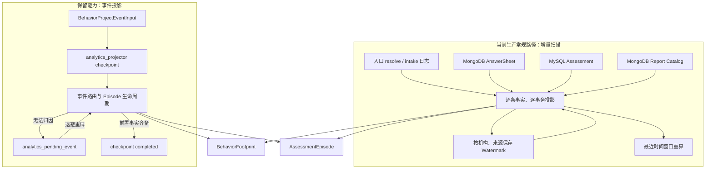
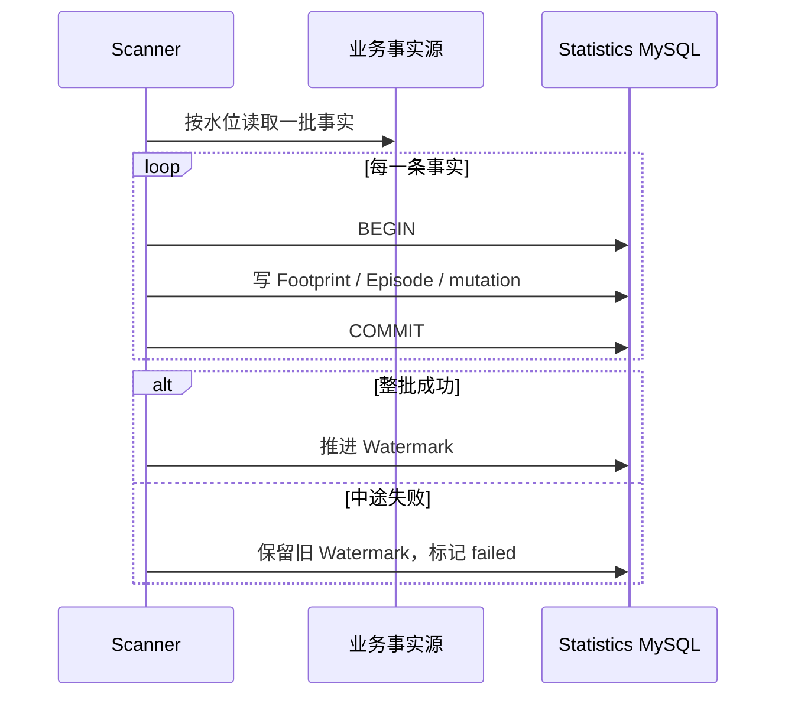
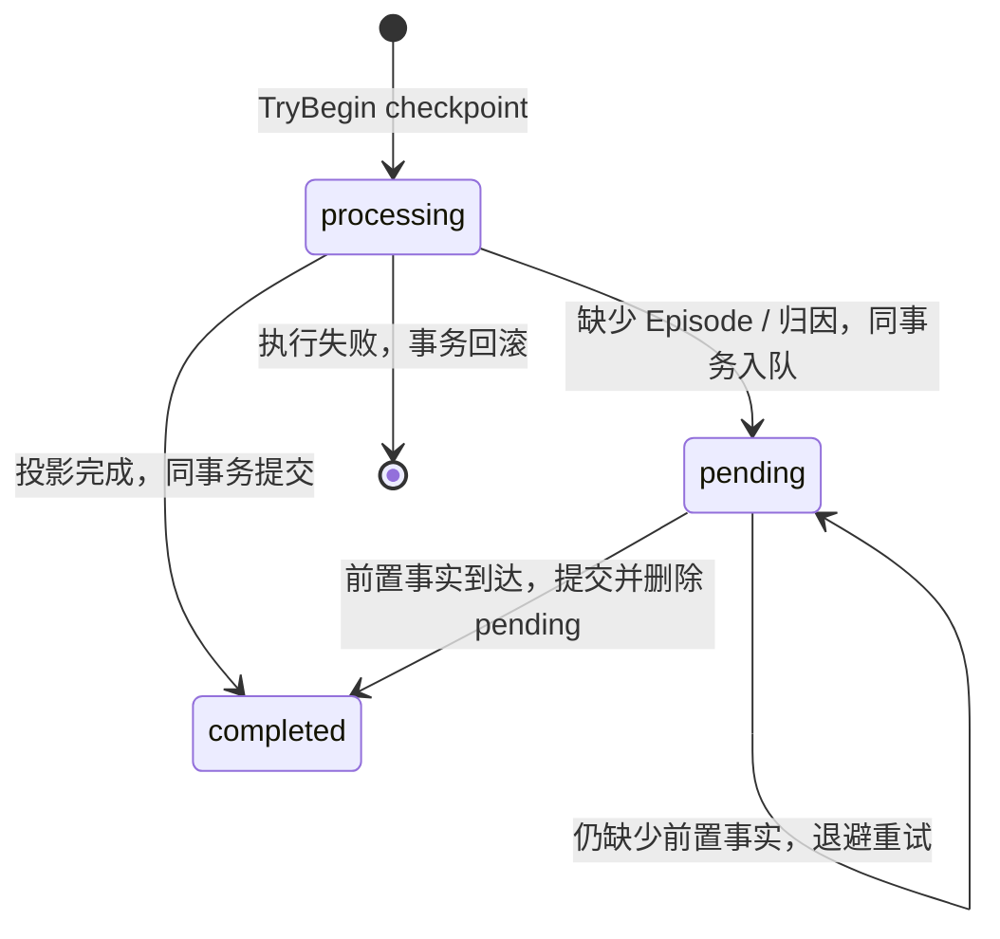

# 核心设计：投影、扫描、幂等与补偿

> 状态：**已重写**。本文以当前生产配置、Statistics Application Service、调度器、MySQL Repository、MongoDB 扫描源和测试契约为事实基础，说明 Statistics 怎样把分散的业务事实转化为统计事实，并在重复、乱序、遗漏和局部失败下恢复。

## 1. 本文回答

本文重点回答：

- Statistics 为什么同时保留扫描投影和事件投影两条路径；
- 当前生产环境究竟以哪条路径作为常规事实写入路径；
- 五类扫描源怎样排序，扫描水位怎样初始化、推进和失败回退；
- 为什么扫描批次不是一个大事务，而每条事实单独提交；
- checkpoint、Footprint 主键、Episode 唯一身份、水位和窗口重算分别解决哪一种重复；
- 事件先于前置事实到达时，pending 队列怎样延迟归因；
- Redis 分布式锁、幂等约束和数据库事务为什么不能互相替代；
- 自动重试、扫描补投、窗口重算和人工重建分别适用于什么故障；
- 当前扫描路径与事件路径有哪些能力不对称和一致性风险。

本文讨论的是**事实层写入与补偿机制**。日聚合、组织快照、Plan 聚合、缓存预热和全量重建的执行顺序将在《同步、重建与最终一致性》中继续展开。

## 2. 30 秒结论

当前 Statistics 不是只依赖 MQ 事件，也不是每次查询都回扫业务库。它保留两套事实投影入口：

1. **生产常规路径是增量扫描**：定时从入口日志、AnswerSheet、Assessment 和报告目录读取业务事实，写入 `BehaviorFootprint`、`AssessmentEpisode`，再重算最近窗口；
2. **事件投影路径仍然存在**：它通过 checkpoint、事务和 pending 队列处理事件幂等与乱序，但当前仓库内没有发现生产调用方，不能把它写成生产主路径。



无论从哪条路径进入，都必须保护同一组不变量：

1. Statistics 只能派生读侧事实，不能改变 AnswerSheet、Assessment 或 Report 的业务真值；
2. 同一来源事实重复出现时，事实层不能产生多个逻辑副本；
3. 前置事实尚未到达时，应等待、补扫或重建，不能凭空创建错误归因；
4. 投影失败不能阻塞业务提交，但必须留下可观察、可恢复的状态；
5. 幂等不是“加一个唯一索引”，而是由来源身份、checkpoint、事实主键、水位和确定性重算共同组成。

## 3. 这不是 Event Sourcing

Statistics 会接收事件、保存过程足迹、支持重放，因此容易被误解成 Event Sourcing。当前实现并不是事件溯源架构，原因是：

- AnswerSheet、Assessment、InterpretReport、AssessmentTask 仍是各业务模块的权威状态；
- `BehaviorFootprint` 只保存统计需要的最小过程事实，并不完整表达业务聚合的全部状态变化；
- 系统允许通过扫描当前业务存储补投事实，而不是要求所有状态只能由事件日志还原；
- `AssessmentEpisode` 和日聚合都是统计读模型，可以删除后重建；
- Statistics 的事件失败不能决定业务事务是否成立。

更准确的定义是：

> Statistics 使用事件投影与增量扫描构建可重建的统计读模型；业务真值仍由原业务聚合和数据库记录保护。

这个边界很重要。它意味着统计故障的修复方向是“重新观察并重建”，而不是修改业务记录来配平统计数字。

## 4. 为什么需要两条投影路径

### 4.1 事件投影的价值

事件投影适合在业务事实产生后尽快形成统计事实：

- 延迟低，不必等下一轮扫描；
- 一个 `event_id` 可以自然形成投影 checkpoint；
- 前置事实未到达时，可以把完整输入放入 pending 队列；
- 单个事件的 checkpoint、Footprint、Episode、日聚合 mutation 和 pending 状态可以放在同一个 MySQL 事务中。

但它也有工程前提：事件必须可靠发布、可靠消费，事件 schema 必须长期兼容，所有事实来源都要接入，消费延迟和死信还要被治理。只实现一个投影函数，不等于生产链路已经事件化。

### 4.2 扫描投影的价值

扫描直接以已经落库的业务事实为输入：

- 不依赖每个业务模块都完整发布统计事件；
- 可以补回发布、消费或部署期间遗漏的事实；
- 可以跨 MySQL 与 MongoDB 统一建立统计过程；
- 可通过 lookback 重叠扫描吸收延迟写入和时间边界抖动；
- 在事实投影损坏时，扫描源仍可作为恢复依据。

代价是统计有固定延迟、需要持续访问业务存储，并且跨来源顺序、批次失败和水位推进更难处理。

### 4.3 当前项目的实际选择

`configs/apiserver.prod.yaml` 已把 `behavior_journey_scan` 定义为 `behavior_footprint` 的唯一常规写入路径，并明确不使用 Event、Outbox 或 MQ 驱动这组事实。生产参数当前包括：

- 启用扫描；
- 首次延迟 2 分钟；
- 每 10 分钟运行；
- 单来源批次 1000 条；
- 回看最近 2 小时；
- 使用 25 分钟 Redis 锁租约；
- 开启 `window_recalc`；
- 按 resolve、intake、AnswerSheet、Assessment、Report 的顺序扫描。

因此文档必须区分“代码具有事件投影能力”与“生产流量实际经过事件投影”。当前应以扫描为事实主线，事件投影作为保留能力分析，不能为了架构叙事把后者写成已经启用的实时主链路。

## 5. 增量扫描主路径

### 5.1 五类来源与固定顺序

Scanner 默认依次处理：

| 顺序 | 来源 | 权威存储 | 标准化事实 |
| --- | --- | --- | --- |
| 1 | `entry_resolve_log` | MySQL 入口解析日志 | `entry_opened` |
| 2 | `entry_intake_log` | MySQL 入口接纳日志 | `intake_confirmed`，以及可选的建档、关系建立足迹 |
| 3 | `answersheet` | MongoDB `answersheets` | `answersheet_submitted`，并创建 Episode 主体 |
| 4 | `assessment` | MySQL `assessment` | `assessment_created`，补充 Assessment 身份和内容归属 |
| 5 | `report` | MySQL Assessment 候选 + MongoDB `report_query_catalog` | `report_generated`，完成报告阶段 |

这个顺序表达了业务上的因果期待：入口先于接纳，AnswerSheet 先于 Assessment，Assessment 先于 Report。它可以减少常见乱序，却不是事务级顺序保证：

- 每个来源有独立水位和批次上限；
- MongoDB 与 MySQL 不共享快照；
- 上游写入可能延迟；
- 前一来源本轮只处理了 1000 条，后一来源却可能已经读到更晚记录。

因此“按顺序扫描”是一种降低乱序概率的调度策略，不能替代 pending 或可重建机制。

### 5.2 水位不是一个全局 offset

`analytics_scan_watermarks` 按 `(source_name, org_id)` 保存扫描进度。每个来源、每个机构拥有独立状态，核心字段包括：

- `last_seen_id`：上次完整成功批次的最后来源标识；
- `last_seen_time`：上次完整成功批次的最后发生时间；
- `scan_window_start` / `scan_window_end`：本轮声明的扫描窗口；
- `status`：`running`、`idle` 或 `failed`；
- `last_error`：最近失败原因。

独立水位带来两个好处：某个机构或来源失败不会阻止其他来源继续；不同来源可以使用各自合适的 ID 和时间字段。但观察系统也必须按“机构 + 来源”展示滞后，不能只报告一个模糊的“统计同步成功”。

### 5.3 首次扫描只覆盖 lookback

如果某个机构、来源还没有水位，Scanner 不会从历史第一条记录开始，而是把起点设为 `now - lookback`。当前生产 lookback 为 2 小时。

这是一个主动的运行保护：首次启用不会突然把全部历史数据压向业务库和统计库。但它也意味着：

> Scanner 首次启动只负责建立近期增量基线，不能自动完成历史全量回填。

启用 Statistics 或新增机构时，如果需要历史数据，必须先评估并执行一次性事实回填或结果重建，不能仅仅打开扫描开关。

### 5.4 ID 水位与时间回看共同查漏

来源查询并非只使用 `id > last_seen_id`，而是同时考虑来源 ID 和发生时间。其基本语义是：

```text
source_id > last_seen_id
OR occurred_at >= since_time
```

其中 `since_time` 至少会回看 `now - lookback`，若已保存的 `last_seen_time` 更晚，则使用后者。AnswerSheet 使用 `domain_id` 与 `filled_at`，Assessment 和入口日志使用各自数据库 ID 与业务时间。

这样设计是为了吸收：

- 数据写入时间晚于业务发生时间；
- 扫描进程重启；
- 同一时间窗口内的重复读取；
- 单独依赖时间或 ID 时可能发生的边界遗漏。

它同时要求来源标识大体单调，业务时间不能无约束地回拨。lookback 之外才补写、或发生时间被改成很早的记录，仍可能越过常规扫描，需要人工回填。

### 5.5 水位只在整个来源批次成功后推进

Scanner 读取一个来源批次后，逐条投影。只有全部事实都成功时，才把水位推进到批次最后一条；任意一条失败时：

- 水位状态标记为 `failed`；
- 保存错误信息；
- `last_seen_id` 和 `last_seen_time` 保持在旧位置；
- 下一轮会重新读取这一批次。

这条原则避免了“前 500 条成功、第 501 条失败，却把水位推进到第 1000 条”造成永久遗漏。测试明确保护了完整批次成功才推进和失败保留旧水位的契约。

### 5.6 为什么每条事实单独使用事务

一个扫描批次不是一个包含 1000 条事实的大事务。当前实现为每条事实单独开启 MySQL 事务：



优点是事务短、锁范围小，单批量增大时不会长期占用连接和行锁；已经完成的事实也不必因为后一条失败而全部回滚。

代价是已经成功的前半批会在下一轮被重新投影。于是必须进一步区分：

- Footprint 插入是否幂等；
- Episode 更新是否幂等；
- 计数 mutation 是否幂等。

“水位不推进”保护了不遗漏，却不能单独保护不重复。

### 5.7 `dry_run` 的真实语义

`dry_run=true` 时 Scanner 会读取并统计候选事实，但不会：

- 写入 Footprint 或 Episode；
- 保存或推进水位；
- 重算日聚合窗口。

它适合验证来源读取、机构范围、批次规模和权限配置，不是“先写临时表再回滚”。开发配置当前默认开启 dry-run，生产配置关闭。

### 5.8 `window_recalc` 为什么是生产默认

生产开启 `window_recalc` 后，逐条事实投影仍写 Footprint 和 Episode，但跳过逐事件的日统计 mutation；一个机构的全部来源扫描结束后，再删除并重算最近 lookback 覆盖的自然日窗口。

这相当于把“重复扫描的增量计数”转化为“从事实确定性重算”：

- 重复读取同一事实不会因为重复执行 `+1` 而永久放大；
- 延迟到达的事实可以进入当前窗口的重算；
- 失败重跑最终会收敛到事实层当前状态。

如果关闭 `window_recalc`，Scanner 会在投影每条事实时直接更新日统计。此时中途失败会形成一个风险：前半批已提交、旧水位未推进，下一轮重复处理时，即使 Footprint 依靠主键没有重复插入，日统计的增量 mutation 仍可能再次执行并重复计数。

因此对当前实现而言，`window_recalc=true` 不只是性能选项，也是扫描重放下的重要正确性保护。

## 6. 事件投影路径

### 6.1 输入契约与事件路由

事件投影入口接收 `BehaviorProjectEventInput`，包含：

- `event_id`、`event_type`；
- org、clinician、entry、testee；
- AnswerSheet、Assessment、Report 标识；
- failure reason；
- `occurred_at`。

当前 Router 支持：

- `entry_opened`；
- `intake_confirmed`；
- `testee_profile_created`；
- `care_relationship_established`；
- `answersheet_submitted`；
- `assessment_created`；
- `report_generated`；
- Evaluation 的 `assessment.failed`。

领域枚举中虽存在 `care_relationship_transferred`，当前 Router 并未处理它。新增事件枚举不等于统计路径已经支持，必须同步检查路由、Episode 语义、指标 mutation、扫描补偿和测试。

### 6.2 checkpoint 保护一次事件投影

`ProjectBehaviorEvent` 在事务内先以 `event_id` 作为 resource identity，在 `analytics_projector` scope 下尝试创建 checkpoint；`event_type` 作为 checkpoint 元数据保存，而不是幂等键的一部分：

- 首次处理：创建 processing 状态并继续路由；
- 已经 completed：直接返回，不再次投影；
- 已经 pending：返回 pending，不重复入队；
- 投影成功：在同一事务内标记 completed；
- 暂时无法归因：在同一事务内写 pending 事件并标记 pending；
- 投影报错：整个事务回滚，checkpoint、事实和统计 mutation 都不留下半成品。



checkpoint 只回答“这个事件投影是否处理过”，它不能替代业务事件自己的可靠发布，也不能证明 Assessment 或 Report 业务已经成功。

### 6.3 pending 处理的是乱序归因，不是业务重试

`analytics_pending_event` 保存完整投影输入、事件类型、下次尝试时间、尝试次数和最近错误。它用于这类情况：

- `assessment_created` 已到达，但对应 AnswerSheet Episode 尚未建立；
- `report_generated` 已到达，但对应 Assessment/AnswerSheet 过程尚无法定位；
- `assessment.failed` 先于可归因 Episode 到达。

这类事件并非业务失败，Statistics 只是暂时不知道应把它附着在哪个 Episode 上。因此 pending 队列不能被描述为“重新执行测评”或“重新生成报告”。

### 6.4 退避与事务边界

pending 调和器按 `next_attempt_at` 升序取到期记录，默认退避从 10 秒开始指数增长，最大 5 分钟：

```text
10s -> 20s -> 40s -> 80s -> ... -> 5m
```

一次调和有三种结果：

| 结果 | 数据处理 |
| --- | --- |
| 前置事实齐备 | 同一事务完成投影、删除 pending、checkpoint 改为 completed |
| 仍无法归因 | 原投影事务不写半成品，另起事务增加 attempt 并设置下次时间 |
| 投影或 payload 失败 | 先回滚投影事务，再用独立事务保存错误和重试时间 |

“失败后另起事务记录重试”是有意设计。如果把 reschedule 放在已经失败的事务里，它会跟随回滚，系统反而看不到失败和下一次执行时间。

当前 pending 没有最大尝试次数、Dead Letter 状态或人工终止/强制处理治理；它会在 5 分钟上限持续重试。这保证暂时乱序最终可恢复，但永久脏数据会形成长期积压，后续应补充队列深度、最老年龄、失败分类和人工治理。

## 7. 幂等是分层机制，不是单个唯一键

Statistics 面对的重复来源不同，不能靠一种机制全部解决：

| 层次 | 当前机制 | 解决的问题 | 不能解决的问题 |
| --- | --- | --- | --- |
| 业务来源 | AnswerSheet、Assessment、日志、Report 的稳定 ID | 确认两个输入是否来自同一业务事实 | 不能阻止 Scanner 重复读取 |
| 事件入口 | `analytics_projector` checkpoint | 同一 `event_id` 不重复执行事件投影 | 不保护两个不同事件 ID 表达同一业务事实 |
| Footprint | 稳定 Footprint ID；扫描使用 `scan:<event_name>:<source_id>`；冲突时不重复插入 | 同一来源事实只保存一条行为足迹 | 插入 no-op 后，外围增量 mutation 仍可能执行 |
| Episode | 以 AnswerSheet 为过程身份并执行 upsert | 同一测评过程不会创建多个 Episode | 不保证每个字段更新天然满足交换律与顺序无关 |
| Pending | `event_id` 主键和 upsert | 同一待处理事件只有一个队列项，并持续记录尝试 | 不判断永久失败，也不做业务补偿 |
| Scanner | `(org_id, source_name)` 水位 + lookback | 正常轮次不从头读取，并回看近期迟到数据 | 批次中途失败时必然重读已经提交的前半批 |
| 日聚合 | `(org, subject_type, subject_id, date)` 唯一行 | 同一维度每天只有一行 | `+1` mutation 本身并不幂等 |
| 结果恢复 | 删除窗口后从事实确定性重算 | 重复运行最终得到同一结果 | 前提是事实层完整、重建口径完整 |
| 多实例调度 | Redis lease lock | 同一时刻尽量只有一个实例扫描或调和 | Redis 锁不是事实唯一约束，锁过期后仍可能重入 |

由此可以得到一个重要判断：

> “Footprint 已有唯一键”只能证明事实不会重复落两行，不能证明所有由投影触发的计数都不会重复增加。

当前生产通过 `window_recalc=true` 跳过逐条增量计数并重算窗口，补上了 Scanner 批次失败重放的关键一环。未来如果恢复增量 mutation，必须让 mutation 以“首次插入 Footprint 成功”为前提，或建立独立的 projection ledger，不能只依赖表行唯一键。

## 8. 乱序、迟到与归因补偿

### 8.1 事件路径的乱序策略

事件路径在缺少 Episode 时明确返回 `pending`，保存输入后延迟处理。这适合“后置事件先到、前置事件稍后到”的情况。

这里的原则不是强行按事件时间排序，而是：

1. 能确定归因时立即投影；
2. 不能确定归因时不猜测；
3. 保存足够输入以便重试；
4. 前置事实到达后让投影收敛；
5. 全过程使用同一 `event_id` 保持幂等。

### 8.2 扫描路径主要依赖来源顺序和重复窗口

Scanner 使用五类来源的固定顺序与 lookback 回看降低乱序概率。但当前代码存在能力差异：

- 扫描 `assessment_created` 时，如果 Episode 不存在，生命周期逻辑会返回 pending 语义；Scanner 当前没有把它写入 `analytics_pending_event`，仍可能把该来源批次视为成功；
- 扫描 Report 时，如果 Episode 不存在，当前实现同样不会建立 pending 记录；
- 水位一旦推进，后续只能依靠前置来源再次扫描、窗口重建或人工事实重建收敛。

所以目前不能声称“扫描路径已经与事件路径拥有相同的乱序补偿能力”。固定顺序在多数正常写入时有效，但批次截断、跨库延迟或历史回填仍可能留下缺口。

合理的后续方向有两种：

1. 让 Scanner 遇到 pending 时不推进相应事实，或复用同一 pending 队列；
2. 将 Scanner 设计为只产生统一投影输入，统一交给一套 projector/checkpoint/pending 内核处理。

第二种能减少两条路径重复实现生命周期语义，但需要重新设计事件 ID、checkpoint 与批量吞吐，不能只做函数复用。

### 8.3 迟到事实的边界

常规扫描只能自动吸收 lookback 范围内的迟到数据。以下场景需要额外治理：

- 超过 2 小时后才补写入口日志或 AnswerSheet；
- 业务时间被修正到水位时间之前；
- 新启用机构需要导入更早历史；
- Report 目录在较长故障后才完成回填；
- 历史来源 ID 与时间不再满足当前扫描假设。

此时应明确扩大回看窗口、重置受控水位或运行一次性事实回填，而不是悄悄修改 `last_seen_id`。任何水位操作都应记录机构、来源、旧值、新值、时间窗口、原因和验证结果。

### 8.4 归因变化与反向修正

Statistics 中的组织、医生、入口和受试者归因可能在后续事实到达后更完整。例如 AnswerSheet 先建立 Episode，后续 intake 才补充入口或医生归属。此类修正不能只给新维度 `+1`，还要考虑旧维度已经产生的结果。

当前生命周期代码包含对归因修正的 mutation 语义，但扫描生产路径依赖窗口重算来获得更可靠的最终结果。所有新的归因字段都必须回答：

- 字段来源是否权威；
- 后到事实能否覆盖旧值；
- 旧统计桶如何撤销；
- 新统计桶如何增加；
- 窗口外历史怎样重算；
- 多次执行是否仍能收敛。

## 9. 故障与补偿矩阵

| 故障场景 | 常规影响 | 自动机制 | 仍需人工介入的条件 |
| --- | --- | --- | --- |
| 单条来源事实投影失败 | 本来源批次停止，水位保留旧值 | 下一轮重新扫描整批；窗口重算抑制重复累计 | 永久数据错误反复阻塞同一批次 |
| Scanner 进程重启 | 本轮未完成 | 从持久化水位和 lookback 继续 | 水位与事实已人为破坏 |
| Redis/锁不可用 | Scanner 和 pending 调和器不启动 | 恢复 Redis 后下轮继续 | 故障超过 lookback，需扩大窗口或回填 |
| 重复扫描同一事实 | 可能再次执行投影 | Footprint 稳定 ID、Episode upsert、生产窗口重算 | `window_recalc=false` 且增量计数已重复 |
| Assessment/Report 事件先到 | 暂时不能归入 Episode | 事件路径进入 pending 并退避重试 | 永久缺少前置事实或 payload 无法修复 |
| Assessment/Report 扫描先于 Episode | 可能丢失阶段归因 | 来源顺序和 lookback 提供有限补偿 | 当前无统一 pending，需事实重建或代码修复 |
| 事件 payload 无法解析 | pending 无法投影 | 保存错误并指数退避 | 当前无死信上限，需要人工修复数据/代码 |
| 事实表完整、日聚合错误 | 查询数字错误 | 最近窗口重算、夜间同步 | 窗口外历史或重建口径不完整 |
| Footprint/Episode 损坏 | 无法只靠结果表修复 | 无常规自动全量恢复 | 运行 `rebuild_statistics_facts_from_sources` 并核对来源覆盖 |
| 聚合与缓存均损坏 | API 返回旧值或错误值 | 结果重建后清理/预热缓存 | 需要按发布步骤执行并验证版本切换 |

这里要严格区分三种“重试”：

- **业务重试**：Evaluation 或 Interpretation 重新执行失败任务，不属于 Statistics；
- **投影重试**：对同一业务事实重新建立 Statistics 事实，不能改变业务状态；
- **结果重建**：从已有事实重新计算聚合和缓存，不应重新触发业务流程。

## 10. 多实例调度与降载边界

### 10.1 Redis 锁只负责选出当前执行者

Scanner 和 pending 调和器在多实例 apiserver 中使用 Redis lease lock。拿不到锁的实例跳过本轮，避免多个实例同时扫描同一批来源或重复调和 pending。

当前调度器采用 fail-closed：没有锁管理器或 Redis 锁不可用时，不启动扫描和调和。这种选择保护业务数据库不被多实例重复回扫，也降低重复投影风险，但代价是统计延迟会持续扩大。

因此 Redis 故障不能只观察 API 缓存命中率，还要观察 Scanner 和 pending 是否停止。

### 10.2 锁不提供 exactly-once

锁租约可能过期，进程可能在提交后、续租前失联，新实例也可能重新执行同一批次。正确性仍必须依赖数据库层的幂等与重建：

```text
Redis Lock = 降低并发重复执行
Checkpoint / Stable ID / Upsert = 保护事实写入
Watermark = 记录扫描进度
Window Rebuild = 让结果收敛
```

把锁当成幂等机制，会在超时、网络分区或进程停顿时暴露重复计数。

### 10.3 批次、间隔和 lookback 的三角关系

扫描吞吐取决于：

- 单次每来源可处理的 `batch_size`；
- 扫描 `interval`；
- 每个来源的新增速率；
- 单条事实事务成本；
- 窗口重算成本；
- lookback 带来的重复读取量。

如果 10 分钟内某来源持续新增超过 1000 条，而每轮只执行一次单批扫描，水位可能长期追不上。扩大 lookback 只能减少迟到遗漏，不能解决吞吐不足，反而会增加重复查询。容量治理应同时观察来源积压、每轮批次是否打满和水位年龄，而不是只调大一个参数。

## 11. 可观察性与验收

### 11.1 当前已有指标

当前 Application 层记录：

- `apiserver_statistics_behavior_scan_items_total{source,result}`：按来源统计 scanned、projected、skipped、failed；
- `apiserver_statistics_behavior_scan_duration_seconds`：扫描耗时；
- `apiserver_statistics_behavior_pending_reconcile_items_total{result}`：pending 完成、继续等待、错误重排和失败数量；
- `apiserver_statistics_behavior_pending_reconcile_duration_seconds`：调和耗时；
- `apiserver_statistics_behavior_projection_rebuild_total{result}`：窗口重建结果；
- `apiserver_statistics_behavior_projection_rebuild_duration_seconds`：窗口重建耗时。

Scanner 还会为每个来源记录部分失败日志，调度器记录执行结果。这些信号能够说明“本轮做了多少工作”，但还不足以证明统计已经追上业务。

### 11.2 仍需补充的运行指标

至少还需要：

| 指标 | 回答的问题 |
| --- | --- |
| 每机构、来源水位年龄 | 这个来源距离当前时间落后多久 |
| 每轮是否持续打满 batch | 当前处理能力是否追不上新增速度 |
| pending 队列深度与最老年龄 | 乱序只是短暂等待，还是形成永久积压 |
| pending 按错误类型分布 | 是缺前置事实、payload 破坏还是数据库故障 |
| Scanner/调和器最近成功时间 | Redis 锁或调度器是否已经停止工作 |
| 业务源与事实层抽样差异 | 是否存在水位已推进但事实未完整落库 |
| 事实层与结果层窗口差异 | 聚合重建是否完整覆盖全部指标列 |

### 11.3 最小验收场景

修改投影机制后，至少验证：

1. 同一事实连续投影两次，Footprint、Episode 和日结果不重复；
2. 批次第 N 条失败时，水位不推进，前 N-1 条重放后结果仍收敛；
3. Assessment 先于 AnswerSheet 到达，前置事实补齐后最终进入同一 Episode；
4. Report 先到、投影失败、再重试时，不留下半份 Footprint 或部分计数；
5. 两个实例同时调度时，只有一个获得执行权；锁过期重入仍不破坏事实；
6. dry-run 不产生水位、事实和聚合写入；
7. Scanner 停止超过 lookback 后，有明确回填流程恢复缺口；
8. 窗口重算前后，通用 Journey、接入漏斗和测评服务指标都与事实层一致。

## 12. 当前设计缺口

### 12.1 Scanner 与事件投影没有共享完整的 pending 语义

事件路径可以把缺少 Episode 的 Assessment、Report 和失败事件写入 pending；Scanner 目前只按来源顺序尽量规避乱序，没有把 pending 状态持久化。水位仍可能在事实未完成归因时推进。

这是当前最重要的事实层一致性缺口之一。修复时应统一投影内核，而不是再给每个扫描函数追加一套私有补偿逻辑。

### 12.2 Scanner 未覆盖 Assessment 失败来源

事件 Router 支持 `assessment.failed`，常规 Scanner 的五类来源却没有独立失败来源。现有夜间结果重建可以从 `assessment.failed_at` 计算部分失败指标，一次性事实重建也能恢复更完整的 Episode 失败状态，但常规 Footprint/Episode 扫描并不能完整补回失败过程。

所以当前不能承诺“所有事件路径事实都能被 Scanner 自动兜底”。

### 12.3 最近窗口重算与夜间全口径重建不完全等价

Scanner 的 `RebuildJourneyDailyWindow` 当前只重建通用 Journey 列；夜间 `RebuildDailyStatistics` 还会重建 `access_*` 接入漏斗列和 `service_*` 测评服务列。Overview 又会读取这些专用列。

这意味着 Scanner 每 10 分钟执行的窗口重算可能先删除窗口行，再只写回通用列，使专用指标暂时回到默认值，直到夜间全口径同步再次补齐。`window_recalc` 虽然解决了增量重复计数，却暴露了重建入口口径不统一的问题。

应让“指定窗口 Journey 重建”与“夜间 Journey 重建”复用同一套完整 projection plan，并用合同测试保护全部列，而不是继续维护两套相似 SQL。

### 12.4 `window_recalc=false` 时存在重复 mutation 风险

Footprint 冲突时虽然插入 no-op，生命周期代码仍可能继续执行日统计 mutation。批次中途失败、旧水位重放时，增量计数可能重复。

当前生产开启窗口重算，降低了实际风险，但配置开关暴露的另一条路径仍应正确。否则一次配置调整就可能改变数据正确性语义。

### 12.5 pending 缺少终止与人工治理

pending 只有指数退避上限，没有最大尝试、dead-letter、错误分类、人工确认重试或忽略审计。永久坏数据会无限重排，既污染告警，也无法形成明确处理责任。

补充人工治理时必须保持边界：管理员只能修复或重放统计投影，不能通过 Statistics 改写 Assessment 或 Report 业务状态。

### 12.6 水位配置和运行状态验证仍不足

当前未知 `source` 配置不会显式报错，而可能以空批次成功结束；系统也缺少水位年龄和积压深度的直接指标。配置拼写错误或来源长期停滞可能表现为“调度成功但没有数据”。

应在启动期校验来源白名单，并把每个机构、来源的最新成功时间、水位时间、状态和错误暴露到运维查询或指标中。

## 13. 设计原则与评审清单

后续新增来源或修改投影时，应逐项回答：

### 13.1 来源身份

- 权威业务事实存在哪里；
- 稳定来源 ID 是什么；
- 业务发生时间是哪一个字段；
- ID 与时间是否满足增量扫描假设；
- 超过 lookback 的迟到事实如何补回。

### 13.2 投影身份

- Footprint ID 怎样稳定生成；
- Episode 归属于哪一份 AnswerSheet；
- 两个不同事件是否可能表达同一来源事实；
- 重复投影时，哪些写入是 no-op，哪些是覆盖，哪些是增量；
- 增量 mutation 是否只在首次应用时发生。

### 13.3 顺序与补偿

- 缺少哪一个前置事实时必须 pending；
- pending 输入是否足够日后重试；
- Scanner 与 Event 是否共享相同处理语义；
- 永久缺失怎样停止自动重试并进入人工治理；
- 事实修复后怎样验证结果层已经收敛。

### 13.4 事务与调度

- 单条事实要在一个事务中提交哪些对象；
- 批次失败时水位能否错误越过失败事实；
- 重试状态为什么需要独立事务；
- Redis 锁失效或租约重入时数据库约束能否兜底；
- 批次上限与运行间隔能否覆盖峰值输入速率。

### 13.5 重建

- 该事实是否能从业务源重新扫描；
- 原始过程日志删除后还能否恢复；
- 结果重建是否覆盖所有指标列；
- 重建是否可重复、可分窗口、可审计；
- 回填和重建期间如何避免缓存返回混合版本。

## 14. 代码事实索引

### 14.1 Application 与领域

- `internal/apiserver/application/statistics/behavior_scan.go`：来源循环、水位语义、逐事实事务、dry-run 与窗口重算；
- `internal/apiserver/application/statistics/behavior_scan_ports.go`：扫描输入、结果与来源 Port；
- `internal/apiserver/application/statistics/journey.go`：事件投影事务、checkpoint 与 pending 调和；
- `internal/apiserver/application/statistics/journey_router.go`：事件类型路由；
- `internal/apiserver/application/statistics/journey_episode_lifecycler.go`：Episode 生命周期、归因和统计 mutation；
- `internal/apiserver/application/statistics/journey_writer.go`：Footprint 与日统计写入编排；
- `internal/apiserver/application/statistics/journey_pending_queue.go`：pending 序列化、退避、重排和删除；
- `internal/apiserver/application/statistics/metrics.go`：扫描、调和与重建指标；
- `internal/apiserver/domain/statistics/journey.go`：Footprint、Episode、Watermark 和 pending 领域对象。

### 14.2 基础设施与调度

- `internal/apiserver/infra/mysql/statistics/scan_repository.go`：MySQL 来源扫描与水位持久化；
- `internal/apiserver/infra/mysql/statistics/journey_repository.go`：Footprint、Episode、pending 与 checkpoint Repository；
- `internal/apiserver/infra/mysql/statistics/rebuild_writer.go`：Journey 窗口和日聚合重建；
- `internal/apiserver/runtime/scheduler/behavior_journey_scan.go`：Scanner 周期调度与 Redis lease；
- `internal/apiserver/runtime/scheduler/behavior_pending_reconcile.go`：pending 调和调度；
- `internal/pkg/migration/migrations/mysql/000021_add_journey_projection_runtime.up.sql`：pending 与扫描水位表；
- `configs/apiserver.prod.yaml`：生产扫描、pending 调和和窗口重算口径；
- `configs/apiserver.dev.yaml`：开发 dry-run 配置。

### 14.3 恢复工具

- `scripts/oneoff/rebuild_statistics_facts_from_sources`：仅在 Footprint/Episode 事实层损坏或历史缺失时，从业务源重建事实；
- `scripts/oneoff/rebuild_statistics_aggregates_and_cache`：事实完整时重建结果层与缓存，不应代替事实修复。

### 14.4 关键测试契约

- `behavior_scan_test.go`：完整批次成功才推进水位、失败保留水位、dry-run 不写入；
- `journey_test.go`：事件事务、缺少 Episode 入 pending、失败回滚后独立重排、成功重试只提交一次；
- `behavior_pending_reconcile_test.go`：多实例锁、批次限制、未获锁跳过和错误处理；
- `rebuild_writer_test.go`：Journey 各类聚合的来源与重建 SQL 契约。

## 15. 小结

Statistics 当前采用的是“扫描主导、事件能力保留、结果窗口重算收敛”的事实投影方案：

- Scanner 用按机构、来源保存的水位持续观察业务库；
- lookback 与稳定来源 ID 允许近期事实重复读取而不遗漏；
- checkpoint、Footprint 主键、Episode upsert 和 pending 分别保护不同层次的重复与乱序；
- 每条事实独立事务控制锁范围，水位仅在完整批次成功后推进；
- 生产开启窗口重算，避免扫描失败重放造成增量计数持续放大；
- Redis 锁只控制多实例并发，不能替代持久化幂等；
- 事件路径的 pending 能力、扫描路径的来源顺序和一次性重建共同构成补偿体系，但当前尚未完全统一；
- Scanner 缺少失败来源、pending 语义不完整、窗口重建口径分叉，是后续最值得优先治理的设计问题。

最终要达到的不是形式上的 exactly-once，而是：

> 任一业务事实即使被重复观察、乱序到达或经历局部失败，Statistics 仍能判断处理位置，保留恢复依据，并通过幂等投影与确定性重建收敛到可解释的统计结果。
