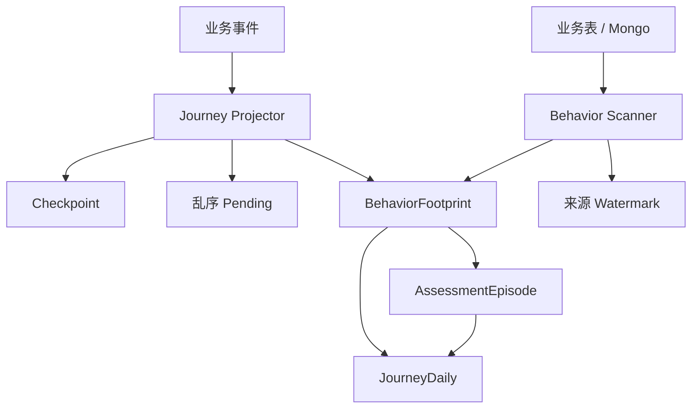
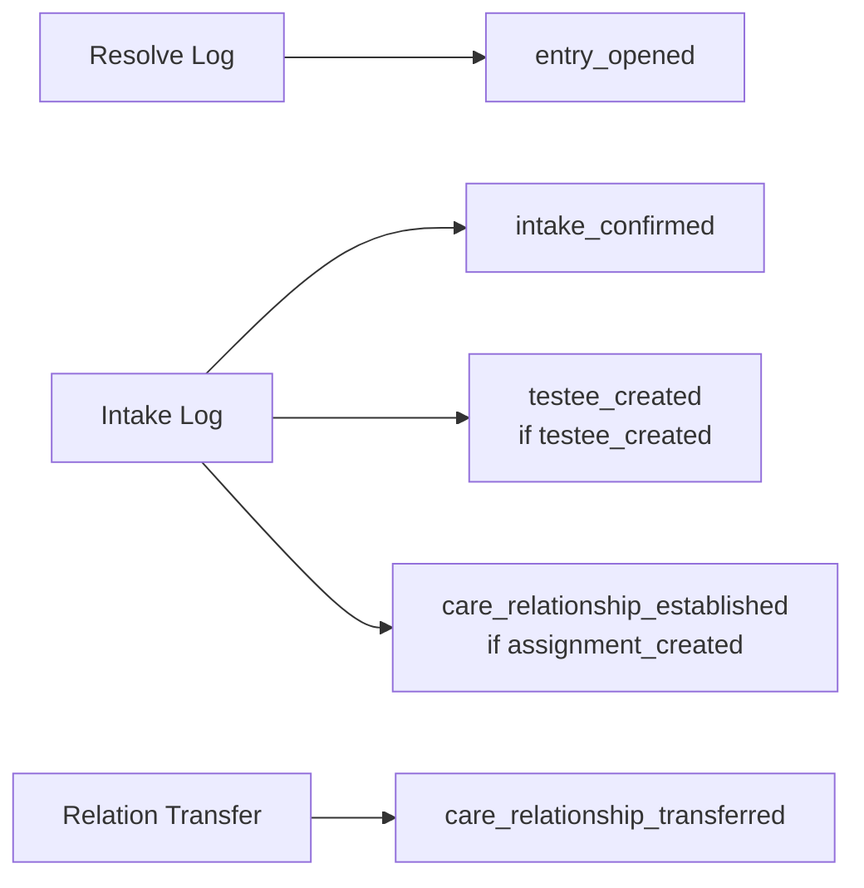

# 核心设计：数据采集、幂等与补偿

> 状态：**V2 目标设计及核心实现**。可扩展 CollectorSet、三类 Collector、FactKey 冲突检测、validate-only 与小窗口回填工具已经实现；真实数据回填和冲突演练仍待执行。V2 不再建设常驻实时 Projector、Checkpoint 或 Pending。

## 1. 本文回答

1. 当前实时事件投影和 Scanner 为什么会形成复杂度；
2. 为什么 V2 选择 T+1 Data Collector，Collector 如何扩展；
3. 三类来源怎样被幂等构建为 Fact；
4. 迟到、乱序、部分失败和历史缺口怎样补偿；
5. 删除 Checkpoint、Pending、Dead Letter 后怎样保证可恢复。

## 2. 30 秒结论

当前 Statistics 同时维护事件投影、业务源扫描、Checkpoint、Pending、窗口重算和夜间重建。它能够提供更低延迟，但要求多条路径共享相同事实身份、归属和聚合语义，工程成本已经高于当前业务对实时性的需要。

V2 采用更直接的方案：

```text
每天按机构扫描一个明确窗口
  -> 由可扩展 Data Collector 构建三类 Fact
  -> 依靠 fact_key 去重
  -> 对来源、Fact 做数量核对
  -> 交给 Projection Engine 确定性重建结果
  -> 整批失败就整批重跑
```

这不是取消可靠性，而是把可靠性从“持续消费中的游标、乱序队列和局部补偿”改为“稳定来源、可扩展采集、幂等 Fact 和批量重建”。

## 3. 当前投影体系为何不再作为目标

当前大致存在两条事实形成路径：



要让两条路径长期正确，必须同时证明：

- Event 与 Scanner 对同一事实生成相同身份；
- 事件乱序时 Pending 最终能够收敛；
- Watermark 不会越过迟到数据；
- 最近窗口重算和夜间重建列集合一致；
- 重复事实只应用一次 Mutation；
- 缓存能在任一入口修复后同步切换。

这些问题并非不可解决，但当前业务并不要求为秒级统计支付这套持续复杂度。

## 4. V2 的 Data Collector

### 4.1 定义

Data Collector 是一个 T+1 事实构建组件：

> 它按明确机构和时间范围读取权威来源，把每一条可统计事实转换成某一类 Fact，并使用稳定 `fact_key` 幂等写入。

它不是领域事件消费者，不推进业务状态，也不生成 Daily、Snapshot 或缓存。

### 4.2 共同合同

Collector 共享尽可能小的运行合同：

```go
type FactCollector interface {
    Name() CollectorName
    Collect(context.Context, FactCollectionRequest) (FactCollectionResult, error)
}
```

```text
FactCollectionRequest
  orgID
  window[from,to)
  asOfDate
  runID
  mode(normal/dry-run/backfill)

FactCollectionResult
  sourceCount
  insertedCount
  existingCount
  conflictCount
  factTypeCounts
```

共同合同只统一运行边界，不统一业务载荷。`AccessFact`、`AssessmentFact`、`PlanFact` 仍使用独立类型、Store 和索引，不能把 Collector 接口做成 `map[string]any` 埋点容器。

### 4.3 三个首批 Collector

```text
AccessFactCollector
AssessmentFactCollector
PlanFactCollector
```

三者共享：

- 上海时间组件；
- FactKey 构造约定；
- 批量写入和唯一冲突处理；
- 来源计数和 Fact 计数；
- SyncRun 阶段记录；
- Dry-run/对账能力。

它们不共享领域字段解析器，避免再次形成一个巨大的通用埋点处理器。

### 4.4 扩展方式

Data Collector 必须可扩展，但扩展是**编译时、强类型、显式装配**的。

#### 同一 Fact 家族新增来源

例如 Assessment 以后新增一种报告生成来源：

```text
AssessmentFactCollector
  <- AnswerSheetSource
  <- AssessmentSource
  <- OutcomeSource
  <- ReportSource
  <- NewReportSource
```

新源通过强类型 Source Reader 和 Mapper 加入现有 Collector，不修改 SyncCoordinator，也不新增事实表。

#### 新增 Fact 家族

只有当新业务事实拥有独立身份、时间和查询维度，才新建 Collector：

```text
1. 定义 Fact 词汇和稳定身份
2. 建立独立 Fact Store 与 migration
3. 实现 FactCollector
4. 在 CollectorSet 显式注册
5. 增加幂等、冲突和对账合同测试
6. 如果需要结果，再增加明确 Projection
```

`CollectorSet` 只保存已装配 Collector 的确定顺序，并检查名称重复：

```text
Access -> Assessment -> Plan
```

这个顺序用于运维解释，不表示三个 Collector 存在业务依赖。

### 4.5 明确禁止的扩展方式

- 不通过反射或包扫描自动发现 Collector；
- 不从数据库动态加载 Collector 或采集 SQL；
- 不允许 Collector 跨越自己的 Fact Store 直接写结果表；
- 不为了复用而把三种 Fact 强行合并成一个 JSON 大表；
- 不允许新 Collector 绕过 SyncRun、时间窗口和对账。

## 5. 扫描窗口

### 5.1 常规窗口

每天默认处理最近七个完整上海自然日：

```text
[today-7d 00:00:00, today 00:00:00)
```

七天是迟到修复窗口，不是数据保留期。它容纳：

- 异步 Assessment 或 Report 延迟完成；
- 前一次同步部分失败；
- 短期部署或基础设施故障；
- 新归属字段稍晚补齐。

### 5.2 手工回填窗口

运维工具可以指定：

```text
org_id
start_date
end_date_exclusive
run_reason
dry_run
```

长窗口按自然日分片提交，避免单个事务覆盖过多 Fact 或 Daily。窗口必须设上限或要求显式确认。

### 5.3 为什么不再需要扫描 Checkpoint

V2 扫描由日期窗口驱动，而不是“从上次 ID 继续”。相同七天每天都会被重新读取：

- 已存在 Fact 由 `fact_key` 去重；
- 新出现的迟到事实被补入；
- 结果窗口随后重建；
- 失败不会推进不可逆游标。

代价是重复读取一小段业务数据，但当前规模下更容易理解和验证。

## 6. FactKey 设计

### 6.1 基本公式

```text
fact_key = source_type + source_ref + fact_type [+ stable sub-identity]
```

示例：

```text
entry_resolve:{resolve_log_id}:entry_opened
entry_intake:{intake_log_id}:testee_created
answersheet:{answersheet_id}:submitted
assessment:{assessment_id}:created
outcome:{outcome_id}:committed
report:{report_id}:generated
enrollment:{enrollment_id}:joined
task:{task_id}:completed
```

### 6.2 禁止使用的身份

不能使用：

- 当前扫描批次 ID；
- 写入 Fact 的当前时间；
- 随机 UUID；
- 仅由可变字段拼接的摘要；
- `org_id + stat_date + fact_type` 这种会合并多个真实事件的键。

### 6.3 事实冲突

相同 `fact_key` 再次出现时：

| 情况 | 处理 |
| --- | --- |
| 核心字段完全相同 | 幂等跳过 |
| 只增加允许的非核心补充属性 | 按明确版本策略补充或跳过 |
| occurred_at、org、业务身份不同 | 记录数据契约冲突并让批次失败 |

不能用无条件 Upsert 静默覆盖历史事实。

## 7. Access 采集

Access Data Collector 以日志主键作为来源身份：



一个 Intake 派生多个 Fact 是正常的。来源计数与 Fact 计数不要求相等，SyncRun 应记录每种事实类型数量，避免只看总数误判。

## 8. Assessment 采集

### 8.1 新数据

新数据使用 AnswerSheet Admission 中的 `AttributionSnapshot`：

```text
AnswerSheet submitted
  -> 读取 frozen attribution
  -> 写 answersheet_submitted Fact

Assessment / Outcome / Report
  -> 按相同 answersheet/assessment 关联
  -> 原样携带 attribution
  -> 写各阶段 Fact
```

如果入口语义要求 Entry、Task 等必需归属，但业务数据中缺失，应在业务受理阶段拒绝或记录契约错误，而不是由 Statistics 猜测。

### 8.2 历史数据

历史首次回填允许尽力推导：

```text
现有 origin
  -> Task/Plan
  -> Entry/Intake
  -> Actor 当前/历史关系
```

回填后写成 `derived_legacy`。以后的 Daily 重建只读 Fact，不再次运行历史归属推导。

### 8.3 独立问卷

没有绑定 AssessmentModel 的 AnswerSheet：

- 产生 `answersheet_submitted`；
- 不等待 Assessment；
- 不进入 Pending；
- 不因没有 Outcome/Report 被判定为不完整。

## 9. Plan 采集

Plan Data Collector 依赖持久化 Enrollment 与完整 Task 时间：

```text
Enrollment: joined_at / closed_at / terminated_at
Task: created_at / open_at / completed_at / expired_at / canceled_at
```

V2 不应使用 `updated_at` 猜测具体动作。无法恢复的历史时间可以标记为迁移估算，但新数据必须由 Plan 写模型保存。V2 第一阶段不统计重排次数；如果保留同一 Enrollment 内重排，Plan 必须先持久化 Schedule Revision。

Task 的每一个生命周期 Fact 都携带 `enrollment_id`，从而支持：

- 同一患者多轮加入同一 Plan；
- 每轮参与的履约；
- 提前终止与自然结束区分；
- Task 不再依赖 `(plan,testee)` 猜测参与关系。

## 10. 幂等分层

V2 的幂等不是一个唯一键解决全部问题：

| 层次 | 机制 | 防止什么 |
| --- | --- | --- |
| Business | 各模块业务唯一键/状态机 | 业务对象重复创建 |
| Fact | `UNIQUE(fact_key)` | 同一事实被重复采集 |
| Daily | 唯一维度键 + 窗口替换 | 同一窗口重复累计 |
| SyncRun | `UNIQUE(batch_key, attempt)` | 识别同一调度意图的多次尝试 |
| Scheduler | 机构/日期租约锁 | 多实例同时执行同一批次 |
| Cache | 机构 Generation | 新旧结果混用 |

租约锁不提供 exactly-once；真正保证可重跑的是 Fact 和 Daily 的确定性。

## 11. 迟到与乱序

### 11.1 迟到事实

AnswerSheet 在某日提交，Report 可能数分钟或数小时后生成。各阶段按照自己的 `occurred_at` 归日，不要求同一天，也不要求节点数量单调。

最近七天重复扫描会发现迟到 Outcome/Report，并重建其发生日期。

### 11.2 跨七天迟到

超过自动修复窗口的迟到事实：

- 通过人工回填或定期扩展检查发现；
- 指定窗口执行；
- 写明原因；
- 完成 Fact、Daily、API 三层对账。

第一版不为低概率超长迟到建立常驻 Pending 表。

### 11.3 Plan Fulfillment 的旧日期变化

Task 可能在到期日之后完成或取消，这会改变很早以前的 due cohort。为避免依赖复杂的影响日期追踪，第一版每夜按机构全量重建 Plan Fulfillment。

## 12. 失败与补偿

| 失败 | 当前批次 | 下次处理 |
| --- | --- | --- |
| 某来源读取失败 | Run failed，不进入结果提交 | 重跑同一窗口 |
| Fact 批量写部分失败 | 事务回滚该批；已有 Fact 保持 | 唯一键幂等重跑 |
| 数据契约冲突 | Run failed，记录 source_ref | 修复来源或 Collector 后重跑 |
| Daily 重建失败 | 结果事务整体回滚 | 重跑结果阶段 |
| Snapshot 失败 | 与 Daily 同事务回滚 | 重跑 |
| 缓存切换失败 | MySQL 保留，Run=data_committed | 单独重试缓存闭环 |

补偿永远指向：

```text
修复读取/采集逻辑
  -> 重扫权威来源
  -> 重建 Fact/Daily
```

禁止直接修改最终计数。

## 13. 为什么不需要 Pending 与 Dead Letter

当前实时投影必须逐条处理乱序事件，因此 Pending 有明确价值。V2 的输入是每日业务状态和持久事实扫描：

- 前置对象暂时未出现时，整个事实可以在下一批次重新发现；
- 一条坏数据会让来源阶段失败并记录 source_ref；
- 修复后重跑相同窗口即可；
- 不存在必须 ACK/NACK 的持续消费游标。

只有未来重新提出实时 SLO，并且证明整批失败影响不可接受时，才重新评估细粒度 Pending/Dead Letter。

## 14. 对账

每个 SyncRun 至少记录：

```text
source row count
fact inserted count
fact existing count
fact conflict count
daily row count
snapshot row count
```

对账不是简单要求来源行数等于 Fact 行数。例如一个 Intake 可以派生三个 Fact，一个独立 Questionnaire 不会产生后续 Assessment Fact。正确方式是按来源类型和事实类型建立预期关系。

## 15. 测试场景

- 同一窗口连续执行两次，Fact 和 Daily 不变化；
- 同一 Intake 派生多个 Fact，但不重复；
- 相同 fact_key 出现不同 org/occurred_at 时批次失败；
- 新 AnswerSheet 使用 frozen attribution；
- 历史 AnswerSheet 标记 derived_legacy/unknown；
- 独立问卷不等待 Assessment；
- Report 延迟到第二天时分别按阶段归日；
- Plan Task 逾期完成会修正旧 due cohort；
- 某来源中途失败不会发布不完整结果；
- 缓存失败只停在 data_committed。
- 新增同家族 Source Reader 不需要修改 SyncCoordinator；
- 新增 Collector 后执行顺序确定、名称唯一，且不能绕过 SyncRun；
- Collector 不能直接写 Daily/Snapshot。

## 16. 当前实现的迁移边界

| 当前能力 | 迁移期间 | V2 稳定后 |
| --- | --- | --- |
| Behavior Projector | 继续服务 V1 | 停止 |
| Behavior Scanner | 继续补偿 V1 | 由 Data Collector 取代 |
| Checkpoint | 继续保护 V1 | 删除/归档 |
| Pending | 继续保护 V1 乱序 | 删除/归档 |
| BehaviorFootprint | 作为历史来源 | 只读观察后归档 |
| AssessmentEpisode | 作为历史来源 | 由 AssessmentFact 取代 |

迁移期必须双轨运行，不能先停旧链路再验证新结果。

## 17. 代码事实入口

- 当前 Scanner：[`application/statistics/behavior_scan.go`](../../../internal/apiserver/application/statistics/behavior_scan.go)
- 当前事件投影：[`application/statistics/journey.go`](../../../internal/apiserver/application/statistics/journey.go)
- 当前 Pending：[`application/statistics/journey_pending_queue.go`](../../../internal/apiserver/application/statistics/journey_pending_queue.go)
- 当前 Journey：[`domain/statistics/journey.go`](../../../internal/apiserver/domain/statistics/journey.go)
- 当前扫描 DTO：[`domain/statistics/scan.go`](../../../internal/apiserver/domain/statistics/scan.go)
- 当前事实 PO：[`infra/mysql/statistics/po_journey.go`](../../../internal/apiserver/infra/mysql/statistics/po_journey.go)
