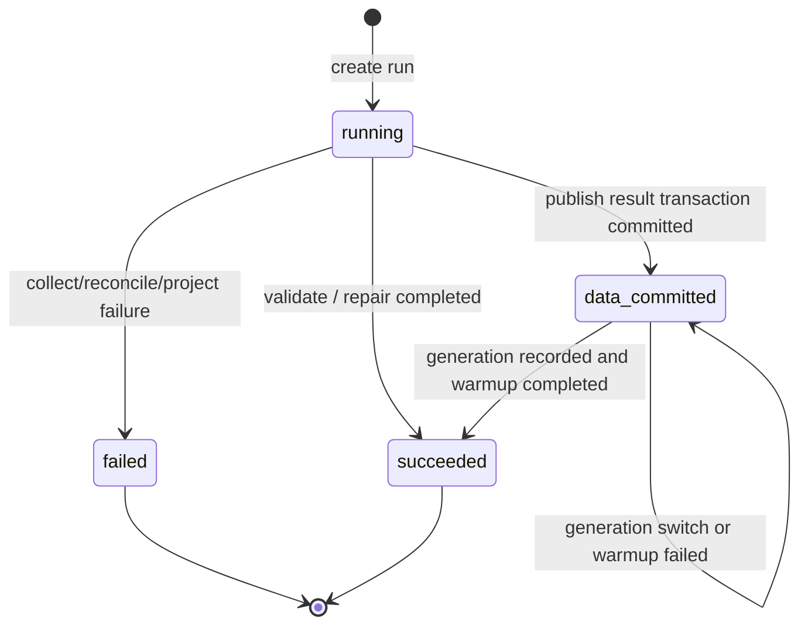

# 核心设计：Projection Engine、同步与最终一致性

> 状态：**当前唯一运行设计**。Typed Projection Engine、T+1 批次、结果事务、SyncRun、Cache Generation 和 `resume-cache` 已实现；Scheduler 只调用 canonical Statistics Coordinator。

## 1. 本文回答

1. T+1 到底同步什么、同步到哪个日期；
2. Projection Engine 与五个 Projection 分别拥有什么责任；
3. Fact、Daily、Snapshot 哪些步骤处在同一事务；
4. 为什么 Plan Fulfillment 第一版全量重建；
5. MySQL 已提交但缓存失败时怎样表达；
6. 如何证明一次同步真正完成，而不是只看日志成功。

## 2. 30 秒结论

Statistics 每天按机构执行一个可重跑批次：

```text
获取租约
  -> 创建 SyncRun
  -> Data Collector 构建三类 Fact
  -> 对账来源与 Fact
  -> Projection Engine 在单事务内执行五个 Projection
  -> 标记 data_committed 并提交
  -> 切换机构缓存 Generation
  -> 标记 succeeded
```

Daily 完整到前一个上海自然日；OrgSnapshot 表达同步时看到的当前状态。统计允许最终一致，但必须用 `as_of_date`、`snapshot_at` 和 SyncRun 明确说明“落后到哪里、停在哪一步”。

## 3. 七个术语

### 3.1 采集

由 Data Collector 从权威业务来源构建标准 Fact。采集可以重复执行，依靠 `fact_key` 幂等。

### 3.2 Projection

拥有一张结果表的粒度、指标和计算口径，在外部事务上下文中执行，自己不提交事务。

### 3.3 Projection Engine

以固定计划调用强类型 Projection，统一传递窗口、截止日和事务上下文，但不包含指标计算分支。

### 3.4 重建

删除明确范围内的派生结果，再从 Fact 重新计算。重建不修改业务数据。

### 3.5 修复

对正常修复窗口之外的指定日期执行采集和重建。修复必须提供受保护的机构作用域、日期范围、原因、确认和操作者审计。

### 3.6 快照

在 `snapshot_at` 读取业务当前状态形成机构资源观察。它不是严格历史时点维表。

### 3.7 最终一致

业务提交先成功，Statistics 在后续批次追上；但延迟必须有界、可观察、可恢复，而不是无限期“以后会一致”。

## 4. Typed Projection Engine

### 4.1 为什么需要 Engine

当前统计重建由多个 Service 和综合 RebuildWriter 分别驱动，一次同步中 Daily、Plan、Snapshot 并没有统一结果发布边界。Engine 的目的是把“从标准事实生成统计结果”收敛为唯一执行方式，而不是建设动态指标平台。

### 4.2 组件关系

```text
ProjectionEngine
  AccessDailyProjection
  AssessmentDailyProjection
  PlanActivityDailyProjection
  PlanFulfillmentProjection
  OrganizationSnapshotProjection
```

调用方向必须是：

```text
Engine -> Projection -> Result Store
```

而不是：

```text
Projection -> Engine -> Result Store
```

Projection 本身完成计算和写入；Engine 只提供统一执行策略。

### 4.3 ProjectionRequest

```text
ProjectionRequest
  runID
  orgID
  window[from,to)
  asOfDate
  cutoffAt
  snapshotAt
```

`cutoffAt` 由 Coordinator 在批次开始时固定，Plan Fulfillment 不能在 Projection 内再读取 `time.Now()`。

### 4.4 三种 Projection 语义

| 类型 | Projection | 输入 | 语义 |
| --- | --- | --- | --- |
| 窗口事实 | Access / Assessment / PlanActivity | 指定日期窗口 Fact | 事件发生量 |
| 截止日 cohort | PlanFulfillment | 全量 Plan Fact + 固定 cutoff | 应履约与逾期 |
| 当前状态快照 | OrganizationSnapshot | 当前 MySQL 资源状态 + Fact 累计 | 最近机构观察 |

OrganizationSnapshot 是明确例外：它可以直接读取当前业务状态，但不在结果事务中扫描 MongoDB，也不为形式统一提前增加 Resource Fact。

### 4.5 Engine 与 Projection 的扩展边界

- Engine 使用显式构造函数装配，执行计划在编译时确定；
- 新 Projection 必须先定义独立粒度和结果所有权；
- 新 Projection 必须有确定性 Fixture 和事务回滚测试；
- Engine 不支持数据库配置 SQL、Metric DSL、脚本动态加载或反射发现；
- 不允许为了减少 Projection 数量而把不同粒度结果合并进一张宽表。

### 4.6 事务所有权

Engine 和 Projection 都不自行开启或提交事务。`StatisticsSyncCoordinator` 在外层开启结果事务，把事务上下文传给 Engine，并在同一事务中标记 SyncRun `data_committed`。

## 5. 上海时间契约

### 5.1 固定时区

唯一业务时区：

```text
Asia/Shanghai
```

禁止只依赖操作系统或容器的 `time.Local`。Go 显式加载 Location；qs-server 使用 `component-base v0.6.8`，MySQL DSN 的 `location` 固定为 `Asia/Shanghai`，连接 session time zone 固定为 `+08:00`。

### 5.2 时间窗口

所有精确时间窗口使用半开区间：

```text
[from, to)
```

例如处理 7 月 20 日：

```text
[2026-07-20 00:00:00+08:00,
 2026-07-21 00:00:00+08:00)
```

这避免 `23:59:59.999` 精度争议和相邻窗口重复。

### 5.3 两个完成时间

```text
as_of_date  Daily 完整覆盖到的最后一个上海自然日
snapshot_at 机构当前资源实际扫描时间
```

二者不能合并。T+1 批次在 7 月 21 日执行时：

- `as_of_date` 通常是 7 月 20 日；
- `snapshot_at` 是 7 月 21 日实际运行时刻。

### 5.4 历史数据

当前仓库同时存在 `time.Local`、UTC 和 MySQL `DATETIME`。迁移时不能假定所有旧数据都是 UTC 并统一加八小时。必须逐表抽样：

- 应用写入时的 Location；
- DSN `loc`；
- 数据库 session time zone；
- 事件是否带 offset；
- 零点附近真实业务记录。

### 5.5 三种 Run 模式

Statistics 明确区分三种运行意图，不能再用一个日期窗口同时表达“修复数据”和“发布当前水位”：

| 模式 | 写 Fact | 重建 Daily | 重建 Fulfillment/Snapshot | 切换 Cache Generation |
| --- | --- | --- | --- | --- |
| `validate` | 否 | 否 | 否 | 否 |
| `repair` | 是 | 是 | 否 | 否 |
| `publish` | 是 | 是 | 是 | 是 |

`window_start/window_end` 只定义 Collector 和 Daily 的处理范围。`as_of_date` 由服务端根据运行时刻计算为前一上海完整自然日，不再由手工窗口的 `to_date` 推导。

因此，修复较早窗口不会把已经发布的 Snapshot 倒退。需要对外发布新水位时，必须再执行一次当前完整日 Publish。

## 6. 默认批次范围

### 6.1 Fact 和 Activity Daily

默认修复最近七个完整自然日：

```text
start = todayStart - 7 days
end   = todayStart
```

七天窗口允许迟到事实和短期故障自动收敛。

### 6.2 Plan Fulfillment

第一版按机构全量重建所有 cohort。原因是当前任务状态会在计划/到期日期之后变化：

- 很早以前到期的任务今天完成；
- 已到期任务后来取消；
- opened 任务在当前批次被判定 overdue。

只重建最近七个 cohort 日期不能保证正确。

未来只有在全量耗时获得生产瓶颈证据后，才改为：

```text
最近状态变化 Task
  -> 计算受影响 planned/due dates
  -> 只重建影响日期集合
```

### 6.3 OrgSnapshot

每次成功批次刷新当前机构快照，不做七天窗口。

## 7. SyncRun 状态机



`stage` 使用：

```text
collecting_access
collecting_assessment
collecting_plan
facts_ready
projecting_access_daily
projecting_assessment_daily
projecting_plan_activity_daily
projecting_plan_fulfillment
projecting_organization_snapshot
data_committed
publishing_cache
completed
```

Run 必须记录：

- `window_start/window_end/as_of_date`；
- 来源、Fact、结果计数；
- 当前阶段；
- 错误码和摘要；
- 手工运行的操作者与原因；
- `data_committed_at/finished_at`；
- `run_mode`；
- `cache_generation/cache_published_at`；
- 缓存恢复次数、最后一次恢复摘要，以及每次恢复的追加式审计记录。

## 8. 单机构同步流程

### 8.1 获取租约

使用机构级租约：

```text
statistics:v2:{org_id}
```

它避免同一机构的不同历史窗口与 Publish 并发执行。不同机构仍可独立运行；租约丢失或进程退出后，后续实例依靠幂等机制重跑。

### 8.2 创建 Run

Run 在结果事务之外创建为 `running`，否则进程失败时无法留下执行痕迹。

相同调度意图使用稳定 `batch_key`，失败后使用递增 `attempt` 创建新 Run。推荐唯一键是 `UNIQUE(batch_key, attempt)`，不是禁止重试的 `UNIQUE(run_key)`。手工重新执行必须关联原窗口和原因。

### 8.3 采集 Fact

按顺序执行：

```text
Access -> Assessment -> Plan
```

顺序主要为了运维可读性，不是跨领域因果依赖。每一类 Fact 可以分批事务写入；任一阶段失败则不进入结果发布。

### 8.4 事实对账

至少检查：

- source count；
- inserted/existing/conflict Fact count；
- 新数据 frozen attribution 覆盖率；
- unknown 历史归属数量；
- Plan Task 是否都能关联 Enrollment；
- 时间是否落在合法窗口。

### 8.5 Projection 结果事务

`repair` 的同一 MySQL 事务内：

1. Coordinator 开启 MySQL 结果事务；
2. Engine 调用 AccessDailyProjection；
3. Engine 调用 AssessmentDailyProjection；
4. Engine 调用 PlanActivityDailyProjection；
5. Coordinator 将 SyncRun 标记为 `succeeded`；
6. Coordinator 提交。

`publish` 在上述三个 Daily Projection 之后继续：

1. 锁定当前机构 Snapshot 并校验水位只能单调前进；
2. Engine 调用 PlanFulfillmentProjection；
3. Engine 调用 OrganizationSnapshotProjection；
4. Coordinator 将 SyncRun 标记为 `data_committed`；
5. Coordinator 提交。

结果事务只能保证数据库内部没有半套结果。`repair` 提交后 Daily 已改变但没有发布新 Generation，因此读服务继续尝试上一代缓存；缓存未命中时快速返回 `statistics_publication_in_progress`，禁止回源读取尚未发布的 MySQL 结果。允许回源时，读服务在查询前后两次校验可见 Publish Run；若查询过程中发布版本发生变化，则丢弃本次结果并返回 `statistics_publication_changed`，不能把跨版本结果写入缓存。完成最终 `publish` 后数据库结果才重新成为可回源的正式版本。

### 8.6 缓存闭环

事务提交后：

1. bump 机构级 Statistics Generation；
2. 将实际 Generation 和切换时间写回 SyncRun；
3. 按新 Generation 预热常用范围；
4. 记录预热结果；
5. Run 更新为 `succeeded`。

若 Redis 不可用：

- MySQL 不回滚；
- Run 保持 `data_committed`；
- Generation 尚未切换时只允许返回旧缓存，冷请求快速拒绝；
- Generation 已切换但预热失败时，MySQL 与当前代际一致，可以在 LoadGuard 下受控回源；
- 后续任务只需完成缓存切换。

## 9. Daily 重建算法

### 9.1 窗口替换

```text
DELETE result
WHERE org_id = ?
  AND stat_date >= start
  AND stat_date < end

INSERT INTO result (...)
SELECT ... FROM fact
WHERE org_id = ?
  AND stat_date >= start
  AND stat_date < end
GROUP BY dimensions
```

删除与插入必须在一个事务中。

### 9.2 不使用增量加减

Statistics 不维护 `count += 1` Mutation，因为：

- 重复应用需要额外幂等状态；
- 迟到归属会要求反向扣减旧维度；
- 部分失败容易留下半更新；
- 窗口重算已经足够快且更容易证明正确。

### 9.3 比率不落库

Daily 保存整数分子和分母。完成率查询时计算，并统一处理分母为零：

```text
denominator = 0 -> rate = 0, has_sample = false
```

如果 API 暂时没有 `has_sample`，文档和前端必须知道 `0` 可能表示无样本。

## 10. Plan Fulfillment 的确定性时间

Overdue 判断不能直接使用每次查询的 `time.Now()`，否则同一批次和同一 API 在不同时间可能得到不同结果。

T+1 重建使用固定截止时刻：

```text
cutoff = as_of_date 次日 00:00:00 上海时间
```

对于 due cohort：

```text
completed on time: completed_at <= due_at
completed overdue: completed_at > due_at
uncompleted overdue: due_at < cutoff
```

查询只读取已物化结果，不再次用当前时间改判。

## 11. 查询新鲜度

Statistics 响应应携带：

```json
{
  "as_of_date": "2026-07-20",
  "snapshot_at": "2026-07-21T02:15:00+08:00"
}
```

预设建议：

```text
latest_complete_day
7d
30d
custom
```

`7d/30d` 的结束日是 `as_of_date`，均包含结束日。系统不提供实时 `today` 预设。

## 12. 缓存模型

### 12.1 Query Identity

Cache、LoadGuard 和 Hotset 必须使用同一个 identity：

```text
api_version
org_id
query_type
filters
from_date
to_date
as_of_date
generation
```

### 12.2 机构级 Generation

当前统计按机构整体重建，机构级 Generation 是最小且足够的失效单位：

```text
stats:v2:{org}:{generation}:{query_identity}
```

不逐 Key 删除，旧 Generation 等 TTL 回收。

### 12.3 降级

Redis 整体不可用时不能让无限流量直接打向 MySQL：

- LoadGuard 合并并发查询；
- 限流和背压控制回源；
- 必要时返回最近成功 Generation 的陈旧结果并明确 `as_of_date`；
- 补数或 Publish 尚未形成可见 Generation 时，禁止冷请求读取已改变但未发布的结果表；
- 无可用旧结果且数据库保护触发时快速拒绝；
- 不伪造实时数字。

## 13. 手工校验、修复与重建

手工操作必须提供：

```text
mode: validate / repair / publish
date window
reason
confirm
validate_only
```

流程：

机构从受保护作用域获取，操作者从认证身份获取，不接受 body 指定任意跨机构运行。

流程：

1. 使用 `validate` 读取、映射、校验和计数；
2. 明确确认后按最多 31 天的小窗口执行 `repair`；
3. 完成来源、Fact、Daily 和 API 对账；
4. 需要对外发布新水位时执行 `publish`；
5. 保存 SyncRun、操作原因和操作者审计。

`resume-cache` 只允许作用于 `publish + data_committed` Run，必须再次提供操作原因和明确确认，且不重新执行 Collector 或 Projection。

不得提供“直接修改某个 count”的运维入口。

## 14. 多机构失败语义

调度器逐机构执行：

- 一个机构失败不回滚其他机构；
- 整轮调度必须汇总成功、失败、data_committed 数量；
- 不能因为部分成功就无条件报告成功；
- 新机构来源应来自机构权威注册，不依赖多处静态 `org_ids`；
- 连续失败和落后自然日数必须可告警。

Scheduler 只有一个 Statistics Coordinator，不存在版本模式或影子分支。整轮在继续处理其他机构后返回结构化 partial failure。

## 15. 最终一致状态

| 状态 | 业务数据 | Fact | MySQL Result | Cache | 对外含义 |
| --- | --- | --- | --- | --- | --- |
| fresh | 已发生 | 已采集 | 已覆盖 as_of | 新 generation | 正常 |
| collecting | 已发生 | 部分更新 | 旧结果 | 旧缓存 | 继续返回旧 as_of |
| failed | 已发生 | 可能部分存在 | 旧结果 | 旧缓存 | Run 失败，可重跑 |
| data_committed，generation=0 | 已发生 | 已采集 | 新结果但不可回源 | 旧 generation | 继续旧缓存；冷请求快速拒绝 |
| data_committed，generation>0 | 已发生 | 已采集 | 新结果可受控回源 | 新 generation，可能未完全预热 | 数据已发布，缓存待闭环 |
| succeeded | 已发生 | 已采集 | 新结果 | 新 generation | 批次完成 |

## 16. 验收标准

### 16.1 时间

- 上海零点前后 Fact 进入正确 `stat_date`；
- 相邻窗口无重复和遗漏；
- 7d/30d 包含 `as_of_date`；
- 数据修复不得未经验证统一加减八小时。

### 16.2 幂等

- 相同窗口执行两次 Fact 数量不增长；
- Daily 逐字段一致；
- 并发相同批次只有一个执行者，另一个安全退出；
- 进程在任一阶段退出后可以重跑。

### 16.3 事务

- Daily 任一步失败时全部结果回滚；
- OrgSnapshot 不会单独提前发布；
- Run 与结果提交状态一致；
- 缓存失败不回滚 MySQL。

### 16.4 对账

- 来源、Fact、Daily、API 可抽样贯通；
- 独立问卷不会被判为缺少 Assessment；
- Outcome 和 Report 不再使用同一阶段近似；
- Plan Activity 和 Fulfillment 分别对账。
- Engine 只调度 Projection，不包含指标分支；
- 五个 Projection 共用同一外层事务，任一失败均不发布部分结果。

## 17. 当前实现入口

- 同步服务：[`application/statistics/sync_service.go`](../../../internal/apiserver/application/statistics/sync_service.go)
- Scheduler：[`runtime/scheduler/statistics_sync.go`](../../../internal/apiserver/runtime/scheduler/statistics_sync.go)
- 当前重建 SQL：[`infra/mysql/statistics/rebuild_writer.go`](../../../internal/apiserver/infra/mysql/statistics/rebuild_writer.go)
- 当前 ReadModel：[`infra/mysql/statistics/readmodel/read_model.go`](../../../internal/apiserver/infra/mysql/statistics/readmodel/read_model.go)
- 缓存：[`cache/statistics`](../../../internal/apiserver/cache/statistics/)
- 锁租约：[`internal/pkg/resilience/locklease`](../../../internal/pkg/resilience/locklease/)

Statistics 复用现有事务 Runner、LockLease 和缓存治理能力，但不得重新引入已经退役的实时投影语义。
