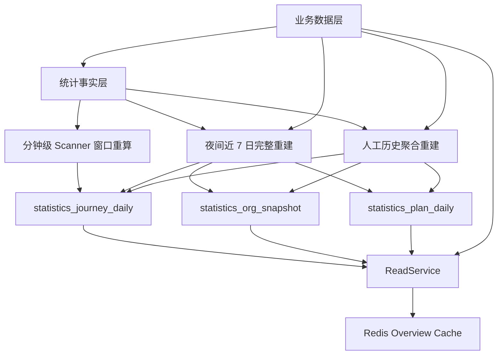
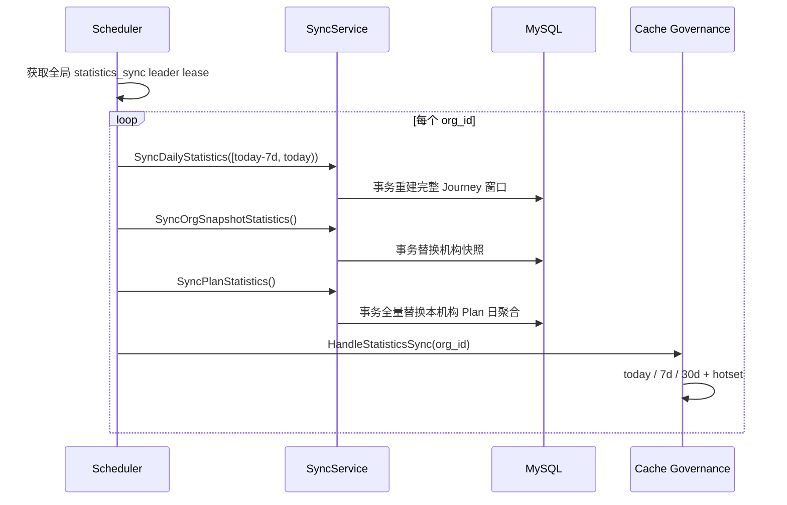
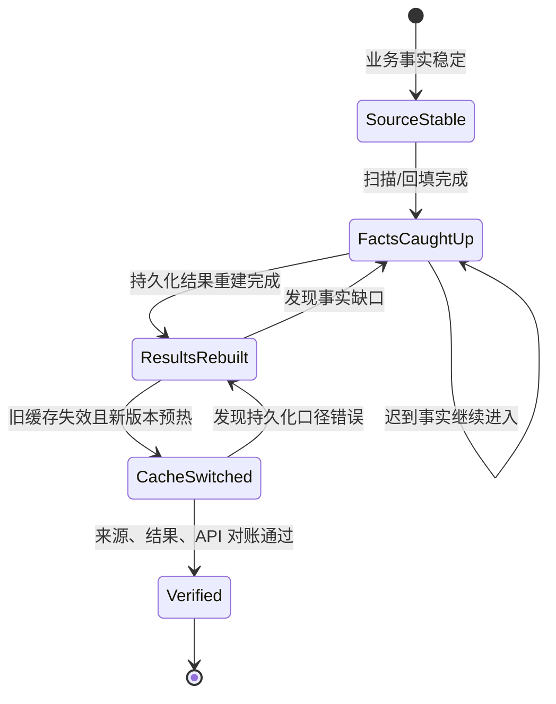

# 核心设计：同步、重建与最终一致性

> 状态：**已重写**。本文以当前 Statistics SyncService、夜间调度器、MySQL 重建 SQL、缓存治理、生产配置、内部 REST 接口和一次性脚本为事实基础，说明统计结果怎样从事实层同步、重算并最终收敛。文中会明确区分已实现能力、当前运行语义和仍未闭合的设计问题。

## 1. 本文回答

本文重点回答：

- “同步”“重建”“回填”“预热”和“最终一致性”分别指什么；
- Scanner 的最近窗口重算与每天 00:30 的夜间同步怎样分工；
- `statistics_journey_daily`、`statistics_org_snapshot` 和 `statistics_plan_daily` 分别从什么来源重建；
- 为什么日聚合按窗口重建，机构快照按当前状态替换，而 Plan 聚合当前按机构全量重建；
- 删除旧结果再插入新结果时，事务怎样避免暴露已提交的半成品；
- 多机构、多阶段同步发生局部失败时，哪些结果已经提交、哪些阶段会跳过；
- 最近 7 天修复窗口能解决什么，为什么不能替代历史回填；
- 聚合完成后 Redis 缓存应该怎样失效、切换和预热；
- 一次性事实重建与一次性聚合/缓存重建应按什么顺序执行；
- 怎样判断系统真正达到最终一致，而不是只看到调度任务执行成功。

上一篇已经解释事实怎样被投影、扫描和补偿。本文从“事实层已经可信”开始，聚焦统计结果层与查询缓存的恢复。

## 2. 30 秒结论

Statistics 当前有三种结果刷新节奏：

1. **分钟级最近窗口重算**：Behavior Scanner 每 10 分钟扫描事实后，重算 lookback 覆盖的 Journey 自然日窗口；
2. **日级修复同步**：生产每天 00:30 对配置机构重建最近 7 个已完成自然日的完整 Journey 聚合，然后刷新机构快照、全量 Plan 日聚合和 Overview 缓存；
3. **人工历史重建**：当历史事实、指标口径或聚合结果发生缺口时，使用内部同步接口或一次性脚本按机构和日期窗口恢复。



当前设计的核心不是让所有统计表在任意时刻都拥有同一个时间戳，而是让不同投影按各自节奏重复计算并收敛：

> 业务真值先成立，Statistics 事实允许异步追上，结果投影允许按窗口重算，缓存必须在结果更新后失效或重新生成；只有四层都完成并通过对账，才能称为最终一致。

当前 MySQL 重建已经具备事务化替换和可重复执行的基础；但缓存失效、同步运行状态、Scanner 与 nightly 的重建口径统一以及结果对账仍未完全闭合。

## 3. 先统一五个术语

### 3.1 同步

同步是正常运行期间，周期性地把上游事实刷新为下游结果。它关注的是**持续收敛**，不是首次导入全部历史。

本模块中的典型同步是：

- Scanner 重算最近时间窗口；
- 夜间任务重建最近 7 个完整自然日；
- 夜间刷新机构快照和 Plan 聚合；
- 同步完成后触发热点查询预热。

### 3.2 重建

重建不是在旧计数上继续 `+1`，而是在限定作用域内：

1. 删除旧的派生结果；
2. 从权威业务数据或统计事实重新计算；
3. 在事务中提交一套新的结果。

只要来源和计算口径不变，同一重建重复执行应得到相同结果。因此重建是 Statistics 从增量误差、迟到数据和算法调整中恢复的核心机制。

### 3.3 回填

回填解决的是“目标层从来没有这段数据”或“常规窗口已经覆盖不到”问题。例如：

- 新启用机构需要补入一年前的历史；
- Scanner 首次启动只覆盖 2 小时 lookback；
- 历史 Footprint/Episode 缺失；
- 新增指标需要从保留的业务源补算旧时间段。

回填可能写事实层，也可能只写结果层。两者不能混用：事实层损坏时必须先补事实；事实完整而聚合错误时只重建结果。

### 3.4 预热

预热是主动执行热点查询并把结果写入 Redis，目的是降低真实用户首次访问的回源成本。它不生成新的业务事实，也不修复 MySQL 聚合。

预热成立的前提是：

- 持久化结果已经完成；
- 旧缓存已失效，或预热被保证绕过旧缓存；
- 预热目标与真实查询 cache key 完全一致；
- 预热失败不会被误报为聚合失败，但必须可观察。

### 3.5 最终一致性

最终一致性不是“数据迟早会对”这种无法验证的承诺。对 Statistics 而言，它至少要求：

1. 上游业务事实已经稳定；
2. 事实投影已追上声明的时间范围；
3. 结果重建覆盖了全部指标列；
4. Redis 不再返回重建前的旧版本；
5. 结果与来源对账通过；
6. 系统能报告最后成功时间和剩余滞后。

缺少其中任何一层，都只能说某个步骤执行完成，不能说 Statistics 已经一致。

## 4. 当前四类刷新入口

### 4.1 Scanner 最近窗口重算

Behavior Scanner 每轮完成一个机构的五类来源扫描后，如果 `window_recalc=true`，会把：

```text
start = now - lookback 所在自然日 00:00
end   = 当前自然日次日 00:00
```

作为窗口调用 `RebuildJourneyDailyWindow`。生产 lookback 为 2 小时，因此通常会重算今天；跨午夜时也会覆盖昨天。

这条路径的目标是尽快让近期 Footprint/Episode 进入日趋势，并通过确定性重算消除重复扫描产生的增量误差。它不是历史修复任务，也不刷新机构快照、Plan 聚合和 Redis 缓存。

当前实现还有一个重要限制：`RebuildJourneyDailyWindow` 只重建 Journey 通用列，没有重建同表中的 `access_*` 和 `service_*` 专用列。Scanner 重算后的结果并不等价于夜间完整重建，这一问题将在后文单独分析。

### 4.2 夜间同步

生产 `statistics_sync` 当前配置为：

| 配置 | 当前值 | 语义 |
| --- | --- | --- |
| `enable` | `true` | 启用夜间同步 |
| `org_ids` | `[1]` | 只处理显式配置的机构 |
| `run_at` | `00:30` | 按服务器本地时间每天执行 |
| `repair_window_days` | `7` | 重建最近 7 个已完成自然日 |
| `lock_key` | `qs:statistics-sync:leader` | 多实例 leader lease |
| `lock_ttl` | `30m` | 调度任务锁租约配置 |

对每个机构，调度器严格按以下顺序执行：



默认窗口是 `[today - 7 days, today)`，不包含正在变化的当天。选择完整自然日可以避免 00:30 重建过程中把当天未完成数据误当成最终日值；设计上当天数据主要由 Scanner 和实时查询承担，下一次夜间任务会把它作为完整的昨天重新计算。当前 Scanner 对专用列的重建不完整，因此这一设计意图尚未完全实现。

### 4.3 内部手工同步接口

qs-apiserver 暴露三类受 `OrgAdmin` 能力保护的内部接口：

| 接口 | 作用域 | 成功后的动作 |
| --- | --- | --- |
| `POST /internal/v1/statistics/sync/daily` | 当前受保护机构 + 可选日期区间 | 触发 Statistics Overview 预热 |
| `POST /internal/v1/statistics/sync/org-snapshot` | 当前受保护机构 | 触发 Statistics Overview 预热 |
| `POST /internal/v1/statistics/sync/plan` | 当前受保护机构 | 触发 Statistics Overview 预热 |

`daily` 接口的 `start_date` 与 `end_date` 对调用者都是包含边界；Handler 会把 `end_date` 加一天，再传给 Application 层的 `[start, end)` 窗口。Application Service 自身要求两端同时提供，或两端都不提供。

这些接口适合定点重算和运维恢复，不应由普通业务请求触发。它们执行同步数据库写入，在重建窗口过大时会持续占用数据库资源和请求连接。

### 4.4 一次性历史重建脚本

`scripts/oneoff/rebuild_statistics_aggregates_and_cache` 用于大范围历史结果恢复。它默认 dry-run，并支持：

- 单机构，或使用 `--all-orgs` 发现选定窗口内存在来源数据的机构；
- `[start-date, end-date)` 历史窗口；
- 只重建 MySQL 聚合；
- 只处理 Redis 缓存；
- 同时处理聚合和缓存；
- Query Redis 与 Meta/Version Redis 分离配置。

它把 Journey 历史窗口切成最多 31 天的子窗口，每个子窗口独立事务提交。这样避免一个跨年事务长期持锁，也允许失败后重新执行完整命令收敛。

一次性脚本不是 apiserver 的常规启动路径。生产执行必须先确认机构、时间范围、MySQL/Redis 地址、namespace、超时和回滚依据。

## 5. 三类持久化结果怎样重建

### 5.1 `statistics_journey_daily`：按日期窗口替换

完整 `RebuildDailyStatistics` 在一个 MySQL 事务中完成：

1. 删除机构在 `[start_date, end_date)` 内的全部 `statistics_journey_daily` 行；
2. 从 Footprint/Episode 重建通用 Journey 列；
3. 从 resolve/intake 原始日志重建 `access_*` 接入漏斗列；
4. 从 Assessment 重建 `service_*` 测评服务列；
5. 任一步失败则整个事务回滚。

| 列族 | 当前主要来源 | 代表语义 |
| --- | --- | --- |
| 通用 Journey | `behavior_footprint`、`assessment_episode` | 入口、接纳、建档、关系、答卷、测评、报告、失败和 Episode 状态 |
| `access_*` | `assessment_entry_resolve_log`、`assessment_entry_intake_log` | 接入漏斗真实动作 |
| `service_*` | `assessment` | 提交、创建、evaluated 和 failed 的服务结果 |

事务化的“先删后建”保证失败时不会提交一张空窗口；但三个列族来自不同事实源，同名概念仍可能因为语义差异而数值不同。例如通用 `report_generated` 观察真实报告足迹，`service_report_generated` 当前按 evaluated Assessment 计算。

### 5.2 `statistics_org_snapshot`：按当前状态整行替换

机构快照不是时间序列。每次重建都在事务中：

1. 删除该机构旧快照；
2. 从当前业务表重新计算一行；
3. 写入新的 `snapshot_at`。

当前快照包含：

- Testee 总数；
- active Clinician 数；
- 当前有效 AssessmentEntry 数；
- Assessment 总数；
- evaluated Assessment 数，字段名当前为 `report_count`；
- Clinician、Entry、Content 维度数量。

它表达“重建时刻的当前组织概览”，不是某一天的历史快照序列。重复执行会覆盖旧行，而不是保留每次快照版本。

因此：

- `snapshot_at` 只能说明这一行何时生成；
- 它不能证明 Journey、Plan 或 Redis 也在同一时刻完成；
- `report_count` 当前不等同于 MongoDB 中已确认存在的报告成品数；
- ReadModel 某些 Overview 字段仍会实时查询 Assessment，而不是完全相信快照。

### 5.3 `statistics_plan_daily`：按机构全量替换

常规 `SyncPlanStatistics` 当前不接收日期窗口，而是在一个事务中：

1. 删除该机构所有 `statistics_plan_daily`；
2. 从全部未删除 AssessmentTask 和有效 AssessmentPlan 重建日活动。

统计时间分别取：

- Task `created_at`；
- Task `open_at`；
- Task `completed_at`；
- expired Task 的 `expire_at`。

这张表表达 Plan activity，不完整承担 Plan fulfillment cohort；履约统计仍有按请求窗口实时查询的部分。

全量替换的优点是实现简单、历史更正可以自动收敛、不会遗漏日期窗口外的 Task 状态变化。代价是数据规模增长后，每晚删除和重算机构全部历史的成本会持续增加。

一次性聚合脚本的语义略有不同：它先调用全量 Plan 重建，再在同一事务中删除选定 `[start_date, end_date)` 之外的行，使脚本结果只保留请求窗口。运维时不能把脚本窗口误认为常规 SyncService 本身已经支持 Plan 增量重建。

## 6. 时间窗口与时间语义

### 6.1 统一使用半开区间

Application 和 SQL 统一采用：

```text
[start_date, end_date)
```

即开始时间包含，结束时间不包含。这可以让相邻窗口无重叠、无空隙：

```text
[2026-07-01, 2026-07-08)
[2026-07-08, 2026-07-15)
```

REST 为了让使用者按自然语言选择“包含结束日”，在 Handler 层把结束日期转换为次日 exclusive bound。脚本参数则直接使用 exclusive `--end-date`。两种入口语义不同，文档和操作命令必须写清楚。

### 6.2 本地时区是统计日边界

SyncService 通过 `time.Local` 归一化自然日。当前生产配置的 `00:30` 也按进程本地时区调度。

因此部署环境必须显式保证时区正确。服务器时区变化会同时影响：

- 夜间任务触发时间；
- `DATE(occurred_at)` 所属自然日；
- REST 日期窗口；
- `today`、`7d`、`30d` 缓存 key；
- Scanner 跨午夜窗口。

“数据库存 UTC、应用展示本地时间”并不能自动解决统计日归属，必须统一数据库 session、Go `time.Local` 和运维时区配置。

### 6.3 最近 7 天是修复窗口，不是保留期

每天重算最近 7 个完整自然日，主要用于吸收：

- 短期迟到事实；
- 最近部署或调度故障；
- 近期归因修正；
- Scanner 增量投影误差；
- 短时间内修正的业务时间。

它不能自动修复：

- 8 天以前才补写的数据；
- 更早的口径变更；
- 首次启用时缺失的全部历史；
- 被删除的原始过程日志；
- 历史 Footprint/Episode 损坏。

`repair_window_days` 决定正常同步愿意重复计算多远，不代表数据只保留 7 天，也不代表 7 天外一定正确。

## 7. 事务边界与阶段一致性

### 7.1 单个重建操作内部原子

Daily、OrgSnapshot 和 Plan 三个重建操作分别使用独立 MySQL 事务。每个事务内部的删除与插入要么一起提交，要么一起回滚。

这保护了：

- Daily 不会提交只删除未重建的窗口；
- OrgSnapshot 不会永久消失在 delete 与 insert 之间；
- Plan 重建失败时保留上一版完整结果。

### 7.2 三个阶段不是一个总事务

夜间一个机构的三个阶段彼此独立提交：

```text
Daily commit
  -> Snapshot commit
    -> Plan commit
      -> Cache warmup
```

如果 Snapshot 失败，已经成功的 Daily 不会回滚；如果 Plan 失败，Daily 与 Snapshot 仍然是新版本；如果 Cache 失败，MySQL 三个结果都已经提交。

这是合理的可用性折中：把所有结果和 Redis 放入一个跨存储大事务既不可行，也会扩大锁和故障范围。但它意味着查询可能在一段时间内组合不同刷新时点的数据。

### 7.3 同机构失败会短路后续阶段

夜间调度器对某个机构采用 fail-fast stage sequence：

- Daily 失败：跳过该机构 Snapshot、Plan 和 Warmup；
- Snapshot 失败：跳过该机构 Plan 和 Warmup；
- Plan 失败：跳过该机构 Warmup；
- Warmup 失败：MySQL 不回滚。

随后调度器继续处理下一个机构，避免一个机构阻塞全部租户。

当前 `runOnce` 对这些机构级阶段错误只写日志并继续，最终通常返回 `nil`。所以“scheduler tick 没有返回错误”不等于每个机构每个阶段都成功。运行状态必须按机构、阶段记录，不能只监控进程级 tick。

### 7.4 一次性脚本按窗口部分提交

历史 Journey 重建以最多 31 天为一个事务。如果第 5 个窗口失败，前 4 个窗口已经提交。重新运行相同命令是预期恢复方式，因为删除后重算具有可重复性。

这不是全历史原子切换。操作记录必须保留：

- 完整请求范围；
- 已完成的机构和窗口；
- 失败窗口；
- 错误原因；
- 重跑命令；
- 最终对账结果。

## 8. 分布式锁的两层职责

### 8.1 调度 leader lease

`StatisticsSyncRunner` 使用配置的 `statistics_sync_leader` 锁，确保多实例 apiserver 中只有一个实例启动本轮多机构同步。拿不到锁时，本轮直接跳过。

如果 Redis 锁管理器不可用，Runner 在构造阶段就不启动，属于 fail-closed。这样可以避免多个实例同时重建数据库，但也意味着 Redis 故障会停止夜间一致性修复。

### 8.2 单操作 lock

SyncService 还为具体操作创建作用域锁：

- Daily：`statistics:daily:<org>:<start>:<end>`；
- Snapshot：`statistics:org_snapshot:<org>:<today>`；
- Plan：`statistics:plan:<org>:<today>`。

它防止夜间调度、内部 REST 和其他调用方同时重建相同作用域。SyncService 没有 Redis lock manager 时直接返回错误，不会无锁执行。

### 8.3 锁不能代替事务和可重复重建

锁解决“谁现在执行”，事务解决“一个重建是否完整提交”，可重复重建解决“失败后能否再次运行”。三者不能互换：

| 机制 | 保护对象 | 失效后的兜底 |
| --- | --- | --- |
| leader lease | 整轮多机构调度 | 单操作锁、事务、重复执行 |
| 单操作 lease | 某机构某结果作用域 | 事务与确定性重建 |
| MySQL 事务 | 一次 delete + rebuild | 失败回滚 |
| 确定性重建 | 多次运行最终结果 | 来源事实与对账 |

锁租约、网络抖动或进程停顿都可能造成重入可能性，所以重建函数仍必须保持幂等。

## 9. 缓存刷新不是简单“再查一次”

### 9.1 当前只缓存 Overview

Statistics 的 typed cache Port 当前只有：

- `LoadOverview`；
- `StoreOverview`。

Clinician、Entry、Content 和 Testee Periodic 查询并没有通过这个 Port 写入 Redis。缓存预热目标当前也只有 Statistics Overview。

Overview 查询流程是：

1. 按机构、preset/日期窗口读取 versioned Redis key；
2. 命中时直接返回；
3. 未命中时通过 LoadGuard 合并并发回源；
4. 从快照、日聚合和实时业务查询组合结果；
5. 写回 Redis，并记录 today/7d/30d hotset。

生产 Statistics query capability 的 TTL 当前为 15 分钟；Overview 另外开启 Application 层请求合并和超时旧值保护，并配置 25 秒加载超时。缓存能力自身的 `singleflight` 当前关闭，不能把 Application LoadGuard 与 Redis cache policy 的 singleflight 混为同一个机制。

### 9.2 夜间同步后的预热目标

同步成功后，Cache Governance 会规划：

- 固定 `today`、`7d`、`30d` Overview；
- 配置的 Statistics seed targets；
- 同机构的 Overview hotset。

目标去重后逐个执行。单项失败会记录 warmup item 指标、日志和状态快照；执行器会继续其他目标。

### 9.3 当前缺少真正的 Statistics 缓存失效

StatisticsCache 已装配 VersionTokenStore，底层 Versioned cache 也支持 `Invalidate`/`Bump`，但 StatisticsCache 本身没有暴露 Overview invalidation，仓库内也没有找到同步完成后对 Statistics version key 执行 `Bump` 的调用。

当前 `HandleStatisticsSync` 所谓预热，本质上再次调用 `GetOverview`。如果旧 Overview key 尚未过期，这次调用会直接命中旧缓存，不会回源 MySQL，也不会写入新结果。

因此当前真实语义是：

> MySQL 聚合可以已经重建完成，但 Redis Overview 仍可能继续返回旧版本，直到 TTL 到期、缓存被其他手段删除，或 key 自然发生变化。

这也是一次性 `rebuild_statistics_aggregates_and_cache` 脚本的当前问题：它创建带 VersionTokenStore 的 StatisticsCache 并调用 Overview 查询，但没有先 bump version 或删除旧 key，所以“cache rebuild”不能保证覆盖已有缓存。

正确的目标链路应是：


如果采用每个完整 query key 的独立 version，需要逐个 bump today/7d/30d 与 hotset；如果采用机构级 generation token，则可一次切换该机构全部 Statistics query，但会扩大失效范围。选择哪一种需要结合缓存 key 数量和修复作用域设计。

### 9.4 Warmup 的部分失败没有向 Scheduler 形成失败结果

Cache Coordinator 会把单目标错误计入 `partial` 或 `error` 状态，却仍以 `nil error` 返回 `executeTargets`。`HandleStatisticsSync` 又丢弃结构化结果，只返回 error。

因此 Scheduler 通常无法通过返回值发现某些 warmup target 失败，只能依赖：

- `qs_cache_warmup_runs_total`；
- `qs_cache_warmup_items_total`；
- warmup status snapshot；
- 逐项失败日志。

这符合“缓存失败不回滚 MySQL”的边界，但不应把 warmup 记录成无条件成功。

## 10. 从故障到恢复的正确顺序

### 10.1 先判断损坏发生在哪一层

| 现象 | 优先核对 | 修复入口 |
| --- | --- | --- |
| 业务表正确，Footprint/Episode 缺失 | 扫描水位、来源覆盖、事实行 | 事实补扫或 `rebuild_statistics_facts_from_sources` |
| 事实完整，Journey 数字错误 | 指标 SQL、日期窗口、Daily 行 | `SyncDailyStatistics` 或聚合重建脚本 |
| 机构资源概览错误 | 当前业务表与 snapshot_at | `SyncOrgSnapshotStatistics` |
| Plan activity 错误 | AssessmentTask 与 PlanDaily | `SyncPlanStatistics` |
| MySQL 正确，API 仍返回旧值 | Redis key/version/TTL | 缓存失效后预热 |
| 多层均不可信 | 业务源、事实、结果、缓存逐层对账 | 按层顺序完整恢复 |

### 10.2 事实层损坏时

恢复顺序必须是：

```text
业务事实源
  -> 重建 Footprint / Episode
  -> 对账事实数量与归因
  -> 重建 Journey / Snapshot / Plan
  -> 失效并预热 Redis
  -> 验证 API
```

不能先重建聚合，再回填事实。否则聚合刚完成就已经基于不完整输入，后续还必须再跑一次。

`rebuild_statistics_facts_from_sources` 只应在事实层确实损坏时使用。它比聚合重建影响更大，也受原始日志和跨存储历史保留完整度约束。

### 10.3 只有结果层损坏时

事实完整时，应使用 `rebuild_statistics_aggregates_and_cache`，推荐分两阶段：

1. 先用 `--skip-cache` 重建 MySQL 聚合并完成 SQL/API 对账；
2. 再用 `--skip-aggregate` 处理缓存；
3. 在当前失效缺口修复前，缓存阶段还必须显式清理目标旧 key 或采用受控版本切换，不能只相信脚本名称。

先聚合后缓存使失败边界清楚：Redis 配置错误不会迫使重新执行长时间 MySQL 历史重建。

### 10.4 历史范围怎样选择

`--start-date` 至少覆盖最早受影响事实，`--end-date` 使用 exclusive 边界。范围过小会留下旧结果，范围过大会增加数据库压力和执行时间。

选择范围时应依据：

- 变更或故障最早发生时间；
- Scanner/夜间同步停摆时间；
- 迟到数据最早业务时间；
- 指标 SQL 变更影响的历史；
- 原始日志和事实层实际保留期。

## 11. 最终一致性的状态模型

可以把一个机构、一个时间范围的恢复看成以下状态：



这组状态当前还不是数据库中的正式 RepairRun 聚合，而是应当用于运维与设计评审的判定模型。

### 11.1 “完成”的最低证据

一次同步或修复至少应记录：

- repair/sync run ID；
- 机构与时间范围；
- 来源事实的最高时间或水位；
- 每个重建阶段开始、结束、耗时和结果；
- delete/insert/最终行数；
- 缓存 generation 或失效结果；
- 预热目标及逐项目标结果；
- 对账规则和差异数量；
- 操作人、原因与关联变更。

当前实现主要依赖日志、锁指标和 warmup 指标，没有持久化这样一份完整的同步运行记录。

### 11.2 有界延迟需要明确 SLO

“最终一致”还需要给出可接受的时间边界。例如：

- Scanner 水位最多落后多少分钟；
- 夜间同步最晚几点完成；
- pending 最老事件允许等待多久；
- MySQL 重建后缓存最多多久必须切换；
- 对账差异出现后多久进入人工处理。

当前代码和配置给出了 10 分钟扫描、00:30 夜间运行、7 天修复窗口和 15 分钟缓存 TTL，但尚未把它们组合成正式 freshness SLO。配置频率不是服务承诺。

## 12. 故障与一致性矩阵

| 故障点 | 已提交状态 | 当前自动行为 | 查询可能看到什么 | 需要的补救 |
| --- | --- | --- | --- | --- |
| Daily 事务失败 | 旧 Daily 保留 | 跳过该机构后续阶段，下一夜再试 | 全部仍是旧版本 | 修复原因并重跑 Daily |
| Snapshot 事务失败 | 新 Daily、旧 Snapshot | 跳过 Plan/Warmup | 混合刷新时点 | 重跑 Snapshot 后继续后续阶段 |
| Plan 事务失败 | 新 Daily/Snapshot、旧 Plan | 跳过 Warmup | Overview 内 Plan 可能旧 | 重跑 Plan，再失效缓存 |
| Warmup 单项目标失败 | MySQL 三阶段已提交 | 记录 partial/error，继续目标 | 缓存 miss 回源或旧 key | 失效后定点重跑 warmup |
| Redis 不可用 | MySQL 可保持旧值或手工同步失败 | Scheduler 不启动；SyncService 无锁报错 | 旧缓存/缓存 miss，夜间结果不刷新 | 恢复 Redis 锁和缓存后补跑 |
| 31 天历史窗口中途失败 | 已完成窗口已提交 | 脚本退出 | 部分日期新、部分日期旧 | 修复后用相同完整范围重跑 |
| 事实层不完整却重建聚合 | 新聚合基于缺失事实 | 无自动发现 | 数字稳定但错误 | 先修复事实，再再次重建 |
| MySQL 已更新但缓存未失效 | 新持久化结果、旧 Redis | 等 TTL 或自然 miss | API 继续返回旧 Overview | 显式 version bump/delete 后预热 |
| 新机构未加入 `org_ids` | 无夜间刷新 | Scheduler 不处理 | 依赖实时查询/Scanner，快照和 Plan 可能缺失 | 更新配置或自动发现机构 |

## 13. 当前设计缺口

### 13.1 Scanner 窗口重建不是完整 Daily 重建

`RebuildJourneyDailyWindow` 只恢复通用 Journey 列，`RebuildDailyStatistics` 才恢复通用、`access_*` 和 `service_*` 三组列。Scanner 每 10 分钟可能删除近期窗口并写回不完整列，夜间任务再补齐。

两条路径应复用同一个完整的 WindowRebuildPlan；如果出于成本考虑只重建部分列，也必须避免删除其他列，并在 schema 和查询层明确它是局部 projection。

### 13.2 Statistics 缓存版本只装配、未切换

VersionTokenStore 已存在，但 Sync、RepairComplete 和一次性聚合/缓存脚本都没有对 Statistics Overview version key 执行 bump。当前 warmup 可能命中旧值，无法证明缓存已经刷新。

这是结果层最终一致性当前最直接的缺口。修复应包含：

- 明确失效作用域；
- 持久化结果提交后再 bump；
- bump 成功后预热新版本；
- bump 失败时报告 repair 未完成；
- 合同测试证明旧 key 不再被读取。

### 13.3 同步缺少持久化 Run 与 freshness 状态

当前没有按机构、阶段保存的 SyncRun/RepairRun。调度器只写日志，机构级失败又通常不会让整轮返回错误。系统无法稳定回答：

- 机构 1 最近一次 Daily 成功是什么时候；
- Snapshot 与 Plan 是否来自同一轮；
- 哪个时间窗口失败；
- 最近一次插入了多少行；
- 缓存是否已经切换；
- 当前是否需要人工补偿。

应新增最小运行账本或等价的可查询状态，而不是只依赖日志检索。

### 13.4 Plan 每晚全机构历史重建的扩展成本

Plan 聚合没有窗口参数。随着 Task 历史增长，删除并重新扫描整个机构会放大事务、undo log、锁、CPU 和 I/O 成本。

在数据量尚小时全量重建简单可靠；超过容量阈值后，应转为分窗重建，或把 late-change window 与历史 immutable window 分开。重构前需先采集真实 Task 数量和重建耗时，不能只凭代码判断立即拆分。

### 13.5 新机构依赖静态配置接入

夜间任务只遍历 `statistics_sync.org_ids`。生产当前为 `[1]`，新机构不会因为业务表出现数据而自动加入夜间同步。

需要明确机构 onboarding 流程：更新配置、执行首次历史回填、建立 snapshot/Plan 基线、预热缓存并完成验收。更进一步可以使用受控机构目录发现，但必须避免误扫测试或停用机构。

### 13.6 一次性脚本声明的 warm scope 超过真实能力

`rebuild_statistics_aggregates_and_cache` 会发现 Questionnaire codes 和 Plan IDs，并输出 warm scope 数量；但当前 `rebuildCache` 实际只循环 today/7d/30d Overview，Statistics cache Port 也只有 Overview。

`--questionnaire-code`、`--plan-id`、`--max-questionnaires` 和 `--max-plans` 当前没有对应缓存写入效果。应删除误导参数，或真正实现相应 typed cache 后再恢复。

### 13.7 重建测试偏重 SQL 形状，缺少结果等价性

现有测试保护了事务上下文、窗口校验、调度顺序、多实例锁、入口漏斗使用原始日志等契约。但还缺少：

- Scanner WindowRebuild 与 Nightly Daily 的同窗口结果对比；
- 增量投影结果与全量重建结果对比；
- 重建前后缓存 version 切换；
- 部分阶段失败后的 freshness 状态；
- 大窗口分块重跑的最终等价性；
- 真实 MySQL fixture 下 delete + insert 的全部列核对。

## 14. 可观察性与验收

### 14.1 当前已有证据

当前可以观察：

- SyncService 的阶段开始、完成和失败日志；
- Scheduler 启动、锁跳过、机构阶段失败日志；
- Redis lock degraded 指标；
- warmup run/item counter；
- warmup status snapshot；
- Statistics cache hit/miss、loadguard 与 stale-served 指标；
- Scanner 和 projection rebuild 指标。

### 14.2 仍需补齐的指标

| 指标 | 目的 |
| --- | --- |
| `statistics_sync_runs_total{org,stage,result}` | 区分阶段成功、失败和跳过 |
| `statistics_sync_duration_seconds{org,stage}` | 发现重建时间接近锁租约或业务低峰窗口 |
| `statistics_sync_last_success_timestamp{org,stage}` | 直接计算 freshness |
| `statistics_rebuild_rows{org,projection,operation}` | 发现异常删除/插入规模 |
| `statistics_reconcile_diff{org,metric}` | 发现来源与结果不一致 |
| `statistics_cache_generation{org}` | 证明持久化完成后缓存已切换 |
| `statistics_cache_warmup_age{org,preset}` | 证明热点 key 已生成新值 |

不一定要把高基数 org ID 全部放进 Prometheus label；也可以把详细运行记录写入 MySQL，Prometheus 只暴露汇总和最老滞后。

### 14.3 最小验收场景

修改同步与重建机制后，至少验证：

1. Daily 任一 insert 失败时，已删除窗口完整回滚；
2. 同一窗口连续重建两次，所有结果完全相同；
3. Scanner 与 nightly 对同一窗口产生相同的完整列结果；
4. Snapshot 失败时，Daily 已提交但系统明确记录 Snapshot/Plan/Warmup 未完成；
5. Plan 全量重建失败时，旧 PlanDaily 仍可查询；
6. 多实例与手工同步并发时，同作用域只有一个执行者；
7. MySQL 重建提交后，旧 Overview version 立即不可见；
8. warmup 实际回源新结果，而不是命中旧 cache key；
9. 历史分块脚本中途失败后，完整重跑与一次成功结果相同；
10. 新机构 onboarding 后，Journey、Snapshot、Plan 和 Overview 都建立基线；
11. 业务源、事实层、聚合表和 API 四层抽样对账通过。

## 15. 设计评审清单

新增或修改一个物化统计结果时，应逐项回答：

### 15.1 来源与范围

- 来源是业务表、原始日志、Footprint 还是 Episode；
- 来源能否覆盖承诺的历史；
- 结果按机构、日期还是其他维度分区；
- 重建是窗口化、全量还是当前状态替换；
- late data 最远允许到达多久。

### 15.2 事务与失败

- delete 与 insert 是否在同一事务；
- 一个机构的哪些投影必须一起成功；
- 阶段失败后哪些结果已经提交；
- 重跑是否确定性收敛；
- 锁失效或进程重启是否会留下不可恢复状态。

### 15.3 时间

- 使用事件时间、状态时间还是同步时间；
- `[start, end)` 边界如何暴露给 API；
- 使用哪个时区和数据库 session；
- 今天是否参与重建；
- 历史修改怎样触发窗口外修复。

### 15.4 缓存

- 哪些 query key 受影响；
- 先失效还是先预热；
- 使用精确 key、机构 generation 还是 capability generation；
- version bump 失败怎样报告；
- 预热是否绕过旧缓存；
- 旧 key 怎样依赖 TTL 回收。

### 15.5 验证与运维

- 如何 dry-run 和估算行数；
- 如何记录 run、操作人和原因；
- 怎样按窗口恢复；
- 怎样对账事实与结果；
- 什么证据才允许宣告修复完成；
- 失败时能否安全重复执行。

## 16. 代码事实索引

### 16.1 同步编排

- `internal/apiserver/application/statistics/sync_service.go`：日期窗口、单操作锁和事务编排；
- `internal/apiserver/application/statistics/ports.go`：StatisticsRebuildWriter Port；
- `internal/apiserver/runtime/scheduler/statistics_sync.go`：00:30 夜间执行、多机构阶段顺序和 leader lease；
- `configs/apiserver.prod.yaml`：生产同步、缓存与预热配置；
- `internal/apiserver/options/validation.go`：同步配置启动校验。

### 16.2 结果重建

- `internal/apiserver/infra/mysql/statistics/rebuild_writer.go`：Daily、Snapshot、Plan 的 delete/rebuild SQL 与事务要求；
- `internal/apiserver/infra/mysql/statistics/readmodel/read_model.go`：持久化结果和实时查询的组合方式；
- `internal/apiserver/infra/mysql/statistics/rebuild_writer_test.go`：SQL 来源契约；
- `internal/apiserver/application/statistics/sync_service_test.go`：窗口和事务上下文；
- `internal/apiserver/runtime/scheduler/statistics_sync_test.go`：顺序、失败继续和多实例锁。

### 16.3 缓存与治理

- `internal/apiserver/cache/statistics/query.go`：versioned Statistics query cache；
- `internal/apiserver/cache/statistics/typed.go`：Overview cache key 与 typed 读写；
- `internal/apiserver/application/statistics/read_service_overview_query.go`：cache-aside、LoadGuard 与 Overview 组合查询；
- `internal/apiserver/cache/governance/signal_router.go`：同步完成后的 warmup targets；
- `internal/apiserver/cache/governance/target_planner.go`：seed 与 hotset 合并；
- `internal/apiserver/cache/governance/coordinator.go`：逐目标执行、状态和指标；
- `internal/apiserver/cache/governance/repair_runner.go`：RepairComplete 预热入口。

### 16.4 运维入口与工具

- `internal/apiserver/transport/rest/routes_statistics.go`：内部 Sync 与 Cache Governance 路由；
- `internal/apiserver/transport/rest/handler/statistics.go`：日期参数、机构保护和同步后 warmup；
- `scripts/oneoff/rebuild_statistics_facts_from_sources`：事实层确实损坏时的事实恢复；
- `scripts/oneoff/rebuild_statistics_aggregates_and_cache`：事实完整时的结果与缓存恢复；
- `scripts/oneoff/README.md`：一次性脚本执行约定。

## 17. 小结

Statistics 当前采用“近期重复重算 + 夜间修复窗口 + 人工历史重建”的结果收敛策略：

- Scanner 负责让近期 Journey 尽快可见；
- 夜间任务重建近 7 个完整自然日，并刷新 Snapshot、Plan 和热点查询；
- Daily 使用窗口事务替换，Snapshot 使用当前状态整行替换，Plan 当前使用机构全量替换；
- 多机构阶段独立失败，避免一个机构阻塞全部租户；
- 一次性脚本用 31 天分块恢复历史，允许失败后确定性重跑；
- Redis 只是查询副本，必须位于持久化结果之后失效和预热；
- 最终一致必须由事实追平、结果重建、缓存切换和对账共同证明。

当前最关键的不足不是“没有定时任务”，而是收敛闭环仍有断点：

- Scanner 与 nightly 的 Daily 重建范围不一致；
- Statistics version cache 没有在重建后真正切换；
- 部分机构/阶段失败没有形成可查询的运行状态；
- Plan 全量重建会随历史增长放大；
- 一次性脚本声明了尚未实现的 Questionnaire/Plan 缓存 warm scope；
- 缺少增量与全量、来源与结果之间的自动对账。

因此目标不应只是“每天跑一次 SQL”，而应是：

> 对任一机构和时间范围，系统能够说明事实追到了哪里、哪些结果已重建、缓存是否已切换、差异是否已归零，并能在任何阶段失败后从明确边界安全重跑。
