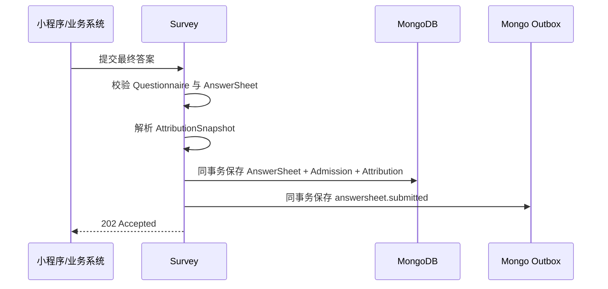
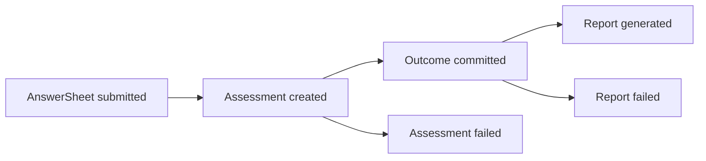
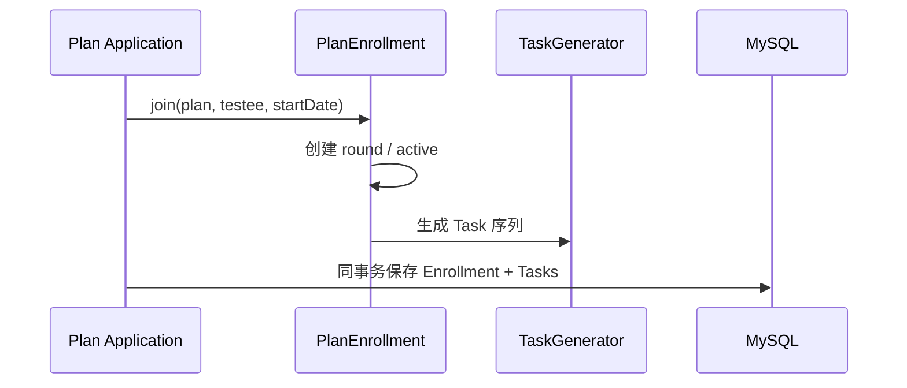
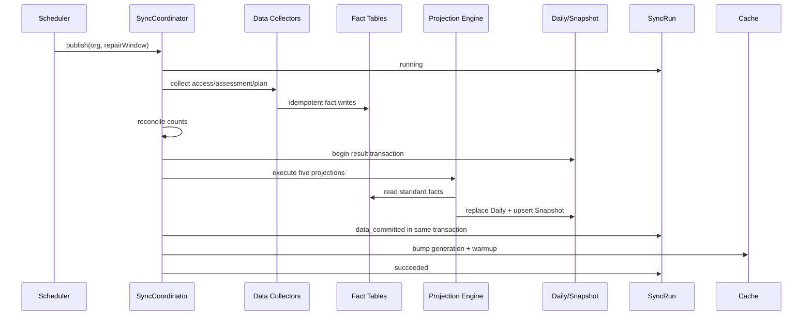

# 关键链路：从业务数据到统计查询

> 状态：**当前唯一链路**。Access、Assessment、Plan 的 Collector、Fact、Projection、缓存和 `/api/v2/statistics` 已串联；患者周期明细由 Plan Enrollment API 提供。

## 1. 本文回答

1. Entry 打开、Intake、测评交付和 Plan 履约怎样进入统计；
2. 哪些数据在业务提交时保存，哪些工作留到 T+1；
3. 查询为什么同时使用 Daily、Snapshot 和当前业务数据；
4. 授权、时间、新鲜度和降级在哪一层处理；
5. 怎样从一个 API 数字追溯到原始业务事实。

## 2. 30 秒结论

当前完整路径是：

```text
业务模块可靠保存自身真值
  -> T+1 Data Collector 按稳定来源身份构建 Fact
  -> Typed Projection Engine 在 MySQL 事务中执行五个 Projection
  -> 缓存切换到新 Generation
  -> ReadService 按授权组合查询模型
  -> API 返回指标和 as_of_date/snapshot_at
```

Statistics 不插入业务主事务，也不要求用户等待统计完成。唯一需要业务模块提前保存的是那些事后无法可靠恢复的业务上下文，例如 Assessment AttributionSnapshot 和 PlanEnrollment 生命周期时间。

## 3. 链路一：Access 接入漏斗

### 3.1 业务发生

```mermaid
sequenceDiagram
    participant User as 用户/小程序
    participant Entry as AssessmentEntry
    participant Actor as Actor Application
    participant Log as Resolve/Intake Log

    User->>Entry: 打开二维码或入口 Token
    Entry->>Actor: 解析 Entry 与归属
    Actor->>Log: 写 ResolveLog
    User->>Actor: 确认身份/接纳
    Actor->>Actor: 建档、建立必要关系
    Actor->>Log: 写 IntakeLog 与结果标志
```

Resolve/Intake 日志必须在业务动作成功后可靠保存，因为“打开过一次”和“这次 Intake 是否创建关系”无法从当前 Actor 状态完整恢复。

### 3.2 T+1 采集

```text
ResolveLog row
  -> entry_opened Fact

IntakeLog row
  -> intake_confirmed Fact
  -> testee_created Fact              if testee_created
  -> care_relationship_established    if assignment_created
```

每个 Fact 使用：

```text
org_id
clinician_id
entry_id
testee_id
occurred_at
source_ref = log_id
```

### 3.3 Daily 与查询

Access Fact 按：

```text
org + date + clinician + entry
```

聚合为 AccessDaily。查询可以通过过滤和求和回答：

- 机构总体漏斗；
- 某医生的 Intake；
- 某 Entry 的打开和转化；
- 7 天/30 天趋势。

Entry 名称、有效状态等当前属性仍从 Actor/Entry 业务表读取，不复制进 Daily。

## 4. 链路二：从 AnswerSheet 到 Report

### 4.1 可靠受理时冻结归属



冻结归属包括适用的：

```text
origin_type / origin_id
clinician_id / entry_id
plan_id / enrollment_id / task_id
```

Statistics 不参与这个事务，但依赖它保证新数据未来可以准确归属。

### 4.2 异步测评与报告



每个阶段由所属模块可靠持久化。独立 Questionnaire 没有绑定模型时，链路在 AnswerSheet 结束，不产生后续失败。

### 4.3 T+1 AssessmentFact

AssessmentFactCollector 通过强类型 Source Reader 分别读取 AnswerSheet、Assessment、Outcome、Report，写入独立阶段 Fact：

| 业务对象 | Fact | 统计时间 |
| --- | --- | --- |
| AnswerSheet | `answersheet_submitted` | submitted_at |
| Assessment | `assessment_created` | created_at |
| Outcome | `outcome_committed` | committed_at |
| Assessment failure | `assessment_failed` | failed_at |
| Report | `report_generated` | generated_at |
| Report failure | `report_failed` | failed_at |

所有阶段复制同一份冻结归属。新数据不能在夜间重新查询当前医生或 Entry。

### 4.4 AssessmentDaily

聚合维度：

```text
org + date
+ clinician + entry
+ origin_type
+ questionnaire_code
+ model_kind + model_code
```

这样同一张表可以服务：

- 机构测评交付；
- 医生/Entry 测评量；
- Questionnaire 提交；
- 医学量表、人格、行为评定、认知测验统计；
- 各阶段成功/失败趋势。

版本保留在 Fact，不进入第一版 Daily 粒度。

## 5. 链路三：Plan 参与、活动与履约

### 5.1 患者加入

目标链路：



重复相同加入请求返回原 Enrollment；终止后明确再次加入才创建下一轮。

### 5.2 Task 执行

```text
task_created
  -> task_opened
  -> task_completed
  |  task_expired
  |  task_canceled
```

Task 必须保存不可替代的业务时间，Statistics 不使用 `updated_at` 猜测动作。当前不统计重排次数；新一轮参与创建新 Enrollment 和 Task，同一 Enrollment 内如需重排，Plan 必须保存 Schedule Revision。

### 5.3 Activity

Plan Fact 按事件发生日进入 ActivityDaily：

- Enrollment joined/closed/terminated；
- Task created/opened/completed/expired/canceled；
- 去重参与患者。

它回答“某天发生了什么”。

### 5.4 Fulfillment

PlanFulfillmentProjection 根据 Task 生命周期 Fact，以固定 `as_of` cutoff 计算：

- planned cohort；
- due cohort；
- completed；
- on-time completed；
- overdue；
- canceled exclusion。

它回答“某个计划/到期 cohort 最终履约得怎样”。

Activity 和 Fulfillment 不能合并，因为完成动作发生日与任务到期日可能不同。

## 6. T+1 发布链路



API 在批次期间继续读取上一成功 Generation。只有 MySQL 结果提交后才允许切换缓存。

历史补跑使用同一个 Coordinator，但运行模式为 `repair`：只执行 Collector 和三个 Daily Projection，不执行 Fulfillment/Snapshot，也不切换缓存。全部历史窗口完成后，才允许执行一次当前完整日 `publish`。

Data Collector 的扩展不改变这条主链：

- 同 Fact 家族的新来源加入现有 Collector；
- 新 Fact 家族实现新 Collector 并在组合根显式注册；
- SyncCoordinator 仍只调用 CollectorSet，不包含新业务源的解析分支。

## 7. Organization Overview 查询

### 7.1 查询入口

```text
REST / gRPC
  -> 认证得到 org/actor
  -> Statistics ReadService
  -> Normalize DateRange against as_of_date
  -> L1 / L2 Cache
  -> ReadModel
```

机构 ID 来自可信认证和授权上下文，不能仅相信普通请求参数。

### 7.2 当前组合方式

| Overview 区域 | 来源 |
| --- | --- |
| 机构资源 | OrganizationSnapshot |
| Access Funnel | AccessDaily |
| Assessment Service | AssessmentDaily |
| Dimension Summary | Snapshot + AssessmentDaily |
| Plan Activity | PlanActivityDaily |
| Plan Fulfillment | PlanFulfillmentDaily |
| 新鲜度 | OrgSnapshot + 最近 succeeded SyncRun |

Read Service 不在一个 Overview 请求中串行执行多组实时业务大查询。

### 7.3 趋势补零

Daily 表只保存有事实的行，Application 按请求日期范围补零。补零只能发生在查询展示层，不能向数据库写入大量全零行。

## 8. Clinician 查询

Clinician Statistics 分成两部分：

```text
当前资源快照
  -> Actor 当前 Clinician 与关系表

窗口行为
  -> AccessDaily / AssessmentDaily
     WHERE clinician_id = ?
```

医生姓名、科室、职称、当前激活状态和可访问患者范围仍由 Actor 提供。Statistics 不保存一份可能过期的医生主数据。

授权先确定可见 clinician/testee/entry 范围，再查询统计；不能先聚合全机构数据再仅靠响应层隐藏敏感明细。

## 9. Entry 查询

```text
Entry 元信息
  -> AssessmentEntry 业务表

Entry 窗口/趋势
  -> AccessDaily + AssessmentDaily
     WHERE entry_id = ?
```

`last_resolved_at/last_intake_at` 可以从 AccessFact 求最大值，或者在专用查询中读取原始日志；不需要为了两个时间字段扩大 Daily 粒度。

## 10. Content 查询

内容身份使用：

```text
content_kind + content_code
```

推荐 kind：

```text
questionnaire
scale
typology
behavioral_rating
cognitive
```

Questionnaire 与 Model 身份正交：

- Questionnaire submission 统计 AnswerSheet；
- Model submission 统计进入相应模型执行的 Assessment；
- Model completion 统计 Outcome committed；
- 报告生成是另一个阶段，不等于 completion。

查询使用 AssessmentDaily，不再直接把所有非 scale 模型归为 questionnaire。

## 11. Testee Periodic 查询

患者周期任务明细是 Plan 业务视图：

```text
PlanEnrollment
  -> AssessmentTask
  -> linked Assessment
```

它需要展示每一轮 Enrollment、每个 Task 的计划/到期/完成时间和状态，不适合从日聚合反推。因此患者周期明细由 Plan Enrollment API 直接读取 Plan 业务读模型，并应用患者资源授权。

Statistics 可以提供汇总履约率，但不替代任务明细。

## 12. 时间范围

Statistics 预设：

```text
latest_complete_day
7d
30d
custom
```

处理规则：

- 所有日期均为上海自然日；
- `7d` 包含 `as_of_date`，向前共七天；
- custom 使用 `[from_date, to_date_exclusive)`；
- 请求不得超过配置的最大窗口；
- 请求结束日超过 `as_of_date` 时截断或明确拒绝，不能补出伪实时数字。

## 13. 缓存与降级

### 13.1 正常路径

```text
L1 hit
  -> return
L1 miss / L2 hit
  -> populate L1
L2 miss
  -> LoadGuard singleflight
  -> MySQL ReadModel
  -> populate L2/L1
```

### 13.2 Redis 故障

不能无界回源 MySQL：

- 使用并发合并、限流和背压；
- 允许返回最近成功 Generation 的旧结果，并保留旧 `as_of_date`；
- 高压且无可用旧结果时快速拒绝；
- 不返回固定虚假统计数字。

固定列表降级只适合非统计配置类接口，不适合需要真实业务数字的 Statistics API。

## 14. 数据追溯示例

如果 Overview 显示某日 `report_generated_count=120`，排查顺序是：

```text
API response + as_of_date
  -> cache generation
  -> statistics_assessment_daily 对应维度之和
  -> statistics_assessment_fact(report_generated)
  -> InterpretReport 业务记录
  -> 该批 StatisticsSyncRun
```

不从 Redis 数字直接反向判断业务表有问题。

## 15. 失败语义

| 位置 | 对业务主链路影响 | 对查询影响 |
| --- | --- | --- |
| AnswerSheet/Assessment/Report 写入失败 | 由业务模块处理 | 不产生相应 Fact |
| Collector 失败 | 无 | 继续返回上一 as_of |
| Projection 事务失败 | 无 | 旧结果保持完整 |
| Cache bump 失败 | 无 | Run=data_committed，旧缓存或受控回源 |
| ReadModel 失败 | 无 | stale fallback 或快速失败 |
| 授权失败 | 无 | 不返回统计结果 |

## 16. 关键验收场景

- Entry 打开一次但未 Intake，只增加 `entry_opened`；
- Intake 建档并建立关系时，一个来源派生三个事实；
- 独立问卷提交只增加 AnswerSheet；
- 新 Assessment 的医生/Entry 归属在关系变化后不漂移；
- Report 第二天生成时按第二天计数；
- 同一患者第二轮加入 Plan 时按新 Enrollment 统计；
- Task 到期后两天完成，Activity 归完成日，Fulfillment 归到期日；
- 同步失败时 API 仍显示上一 `as_of_date`；
- MySQL 提交而 Redis 失败时能够从 `data_committed` 恢复；
- 越权医生、Entry、患者查询被拒绝。
- 新增 Assessment 来源时只扩展 AssessmentFactCollector，不修改 SyncCoordinator；
- 任一 Projection 失败时五张结果表都不发布新批次。

## 17. 当前代码入口

- REST Handler：[`transport/rest/handler/statistics.go`](../../../internal/apiserver/transport/rest/handler/statistics.go)
- Application ReadService：[`application/statistics/read_service.go`](../../../internal/apiserver/application/statistics/read_service.go)
- Overview 编排：[`application/statistics/read_service_overview_query.go`](../../../internal/apiserver/application/statistics/read_service_overview_query.go)
- 当前 ReadModel：[`infra/mysql/statistics/readmodel/read_model.go`](../../../internal/apiserver/infra/mysql/statistics/readmodel/read_model.go)
- 当前同步：[`application/statistics/sync_service.go`](../../../internal/apiserver/application/statistics/sync_service.go)
- 当前缓存：[`cache/statistics`](../../../internal/apiserver/cache/statistics/)
