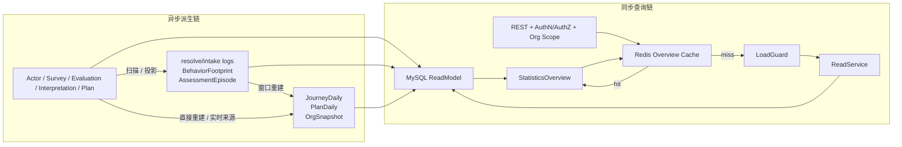
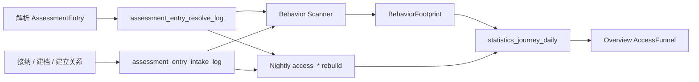
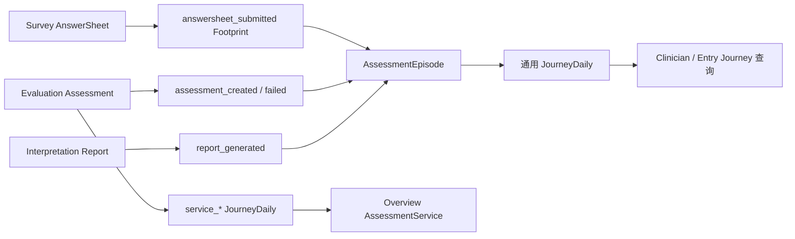
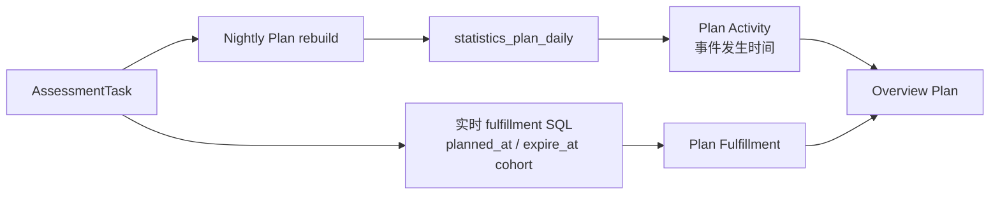
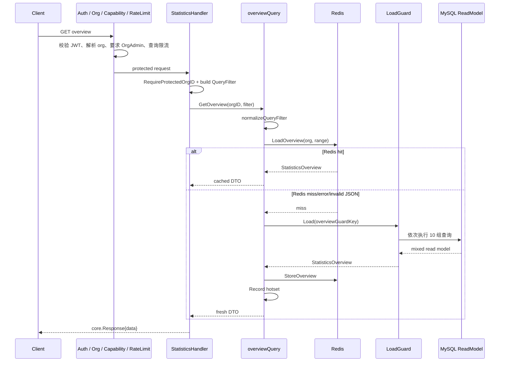

# 关键链路：从业务数据到统计查询

> 状态：**已重写**。本文以当前 Statistics REST 路由、权限中间件、Application ReadService、Redis Overview 缓存、LoadGuard、MySQL ReadModel、业务事实表和统计投影表为事实基础，完整追踪“业务数据怎样变成用户看到的统计结果”。

## 1. 本文回答

本文重点回答：

- Actor、Survey、Evaluation、Interpretation 和 Plan 的业务事实怎样进入 Statistics；
- 为什么同一份 Overview 同时读取业务表、事实表、聚合表和 Redis；
- `GET /api/v1/statistics/overview` 从认证到响应经历哪些步骤；
- Overview 中每个区域的真实数据来源和刷新节奏是什么；
- Statistics 怎样保护机构边界、当前医生范围、受试者访问范围和内容类型权限；
- `today`、`7d`、`30d` 与自定义时间范围怎样转换成查询窗口；
- 缓存命中、缓存失败、数据库失败和进程内 stale 各自怎样表现；
- Clinician、Entry、Content 和 Testee Periodic 为什么没有复用同一种读模型；
- 查询链路中哪些地方已经做了批量化、限流、背压和降级；
- 当前混合读模型有哪些时间语义、缓存和扩展性缺口。

本文以 Organization Overview 作为主链路，因为它组合的来源最多、最能体现 Statistics 的设计。其他查询族在此基础上分析差异，不重复展开前两篇已经说明的扫描与重建内部实现。

## 2. 30 秒结论

Statistics 查询不是“HTTP 请求到一条统计 SQL”，而是两段相互解耦的链路：

1. **异步派生链**：业务模块先持久化权威事实，Scanner/Projector 将其转换为 Footprint、Episode，定时同步再生成日聚合和快照；
2. **同步查询链**：REST 在机构和能力范围内读取 Redis；缓存未命中时，ReadService 组合物化结果与必要的实时 SQL，形成最终 DTO。



因此 Overview 不是同一数据库快照，也不是同一刷新时刻的数据。它是一个**按查询契约组合的读模型**：

- 机构资源优先来自 OrgSnapshot，缺失时回源业务表；
- Content 与 AnswerSheet submission 累计数实时读取 Assessment；
- Access Funnel 与 Assessment Service 读取 JourneyDaily 专用列；
- Plan Activity 组合 PlanDaily 和实时 Task 去重计数；
- Plan Fulfillment 直接实时读取 AssessmentTask；
- 最终结果只在 Overview 层进入 Redis 缓存。

这一折中降低了高频查询成本，也保留了复杂 cohort 的实时语义；代价是必须明确每个字段的来源、新鲜度和失败行为。

## 3. 一条统计链路从哪里开始

Statistics 不拥有业务动作。链路永远从业务模块已经接受的事实开始。

### 3.1 接入漏斗链路

患者扫描门诊二维码时：



这里必须区分两个用途：

- Footprint 保存统一行为节点，支持医生、入口和机构维度 Journey；
- resolve/intake 原始日志是 `access_*` 完整重建的权威过程来源。

只读取当前 AssessmentEntry 状态无法还原历史打开次数，因此入口日志不是普通调试日志。

### 3.2 测评服务链路

患者提交 AnswerSheet 后：



Overview 的 Assessment Service 当前不是直接读取 Footprint 通用列，而是读取 nightly 从 `assessment` 重建的 `service_*` 列。因此：

- `answersheet_submitted_count` 实际按 `assessment.submitted_at` 计算；
- `report_generated_count` 实际按 `assessment.status = evaluated` 与 `evaluated_at` 计算；
- 未绑定测评模型、没有创建 Assessment 的独立 Questionnaire AnswerSheet 不进入这组 Overview 指标；
- Interpretation 真正生成报告与 Assessment evaluated 之间的差异，可能造成同名指标不一致。

这些都属于当前查询契约，而不是前端展示细节。

### 3.3 Plan 履约链路

Plan 中产生 AssessmentTask 后：



同一个 Plan 区域故意保留两种语义：

- Activity 回答 Task 在窗口内何时创建、开放、完成、过期；
- Fulfillment 回答窗口内计划或到期的 Task 履约得怎样。

前者适合日聚合，后者依赖当前时间和截止状态，当前选择实时查询。

## 4. 查询入口与访问边界

### 4.1 当前查询 API

| 查询族 | 路由 | 主要访问约束 |
| --- | --- | --- |
| Organization Overview | `GET /api/v1/statistics/overview` | `OrgAdmin` capability + resolved org scope |
| Clinician List/Detail | `GET /statistics/clinicians`、`/:id` | `OrgAdmin` capability + org scope |
| Entry List/Detail | `GET /statistics/entries`、`/:id` | `OrgAdmin` capability + org scope |
| Current Clinician | `GET /statistics/clinicians/me/*` | 当前 JWT 用户必须映射到本机构 active Operator 和 Clinician |
| Testee Periodic | `GET /statistics/testees/:testee_id/periodic` | org/user scope + Actor TesteeAccess 校验 |
| Content Batch | `POST /statistics/contents/batch` | 至少一种内容管理能力，Application 再按每个 type 精确校验 |

所有这些路由都运行在受保护的 `apiV1` 上，并受 REST rate-limit budget 保护。除 Content Batch 当前使用 submit budget 外，其他统计查询使用 query budget。

### 4.2 机构 ID 不来自请求参数

Handler 使用 `RequireProtectedOrgID` 从 `ResolveOrgScopeMiddleware` 已解析的上下文读取 QS 业务机构 ID。客户端不能通过 query/body 自由指定任意 `org_id`。

这条边界保护所有 ReadModel 查询的第一层过滤：

```text
JWT / IAM snapshot
  -> resolve QS org scope
  -> capability middleware
  -> Handler RequireProtectedOrgID
  -> Application orgID
  -> SQL WHERE org_id = ?
```

Statistics 聚合不能因为“只读”绕过租户隔离。

### 4.3 Current Clinician 还要完成身份转换

`/clinicians/me/*` 不接受 clinician ID。ReadModel 根据：

1. 当前 org + JWT user ID 查 active Operator；
2. 当前 org + operator ID 查 active Clinician；
3. 使用得到的 clinician ID 查询 Journey 和关系统计。

这样可以防止医生把 URL 中的 clinician ID 改成其他医生。找不到 active Operator 或 active Clinician 时返回 permission denied。

### 4.4 Testee Periodic 使用资源级授权

Periodic 路由不要求 OrgAdmin，但在读 Task 前调用 Actor `ValidateTesteeAccess`：

- QS Admin 可以访问本机构 Testee；
- 普通 Operator 必须绑定 active Clinician；
- Clinician 必须与 Testee 存在 active access-grant relation；
- Testee 必须属于当前机构。

只有授权通过后，Statistics 才读取 AssessmentTask 与 Assessment title。

### 4.5 Content Batch 使用类型能力矩阵

路由层要求调用者至少具备 `manage_questionnaires` 或 `manage_assessment_models`。Application 再逐项校验：

- `questionnaire` 需要 Questionnaire 管理能力；
- `scale` 需要 AssessmentModel 管理能力；
- 混合请求必须同时具备两项能力；
- 任意一项无权限，整批返回 403，不返回部分数据。

这避免了批量接口借一个允许类型旁路查询另一个类型。

## 5. 时间范围怎样进入查询

### 5.1 默认与预设

`normalizeQueryFilter` 支持：

| 输入 | `From` | `To` |
| --- | --- | --- |
| 无参数 | 今天 00:00 往前 29 天 | 当前时刻 |
| `preset=today` | 今天 00:00 | 当前时刻 |
| `preset=7d` | 今天 00:00 往前 6 天 | 当前时刻 |
| `preset=30d` | 今天 00:00 往前 29 天 | 当前时刻 |

预设使用服务器 `time.Local`。不支持的 preset 返回 invalid argument。

### 5.2 自定义时间

只要 `from` 或 `to` 任一存在，就进入自定义解析：

- `from` 必须存在；
- `to` 可以省略，省略时使用当前时刻；
- 支持 RFC3339、日期时间和 `YYYY-MM-DD`；
- 日期格式的 `to` 会增加一天，形成包含结束日的 `[from, to)`；
- `from >= to` 被拒绝。

当前没有限制最大查询跨度。OrgAdmin 可以请求很长的历史窗口，物化表查询相对可控，但 Plan fulfillment、内容和其他实时 SQL 仍可能形成大范围数据库压力。

### 5.3 日聚合查询会把边界向下取整

JourneyDaily 与 PlanDaily 查询使用：

```text
stat_date >= beginningOfDay(from)
AND stat_date < beginningOfDay(to)
```

对于显式日期结束日，Handler/Application 已把 `to` 转成次日 00:00，语义正确。但 preset 的 `to` 是“今天当前时刻”，`beginningOfDay(to)` 会变成今天 00:00：

- `today` 形成 `[today 00:00, today 00:00)`，日聚合结果为 0；
- `7d` 和 `30d` 排除当天，只包含之前的完整自然日；
- `fillMissingDailyCounts` 也无法补回真实当天值，只会补零或不包含当天。

这可能是“物化趋势只展示完整日”的隐含意图，也可能与 API 中 `today` 的产品语义冲突。当前 DTO 和路由描述并没有声明“preset 排除当天”，因此应视为需要修正或明确契约的时间边界问题。

## 6. Overview 完整请求链

### 6.1 从 REST 到缓存

以请求：

```http
GET /api/v1/statistics/overview?preset=30d
```

为例：



Redis 读取错误和非法 JSON 都降级为 cache miss，不直接让请求失败。写缓存采用 best-effort 语义；即使没有成功写入，也不影响已经生成的查询响应。

### 6.2 Cache key

Overview 当前使用 `overview:v2` 契约 key：

```text
overview:v2:<org>:preset:<preset>:<from-day>:<to-day>
overview:v2:<org>:range:<from-day>:<to-day>
```

再由 query namespace 和 version token 组成最终 Redis key。preset 只有日期与预设完全匹配时才使用 preset key，否则使用 range key。

同一天内多次 `today/7d/30d` 请求通常共享一个 Redis key，因此第一个进入缓存的 payload 会在 TTL 内被后续请求复用。payload 中的 `time_range.to` 和实时字段也停留在首次生成时刻，不是每次请求重新刷新。

### 6.3 LoadGuard

Redis miss 后，Application LoadGuard 提供：

- 进程内 singleflight；
- 最长 25 秒的 load timeout；
- loader 失败时返回此前成功加载的进程内 stale；
- stale-served counter。

它与 Redis query cache 的 singleflight 不是同一层。生产 Statistics cache capability 自身关闭 singleflight，Overview 由 Application Guard 合并回源。

但当前 `overviewGuardKey` 包含 `timeRange.To` 的完整时间戳，而 preset 每次调用都会生成新的 `time.Now()`。这会导致看似相同的 30d 请求拥有不同 Guard key：

- 并发请求很难合并；
- 前一次 DB 成功记录的 stale 很难被下一次 preset 请求命中；
- Redis hit 路径也没有调用 `RememberStale`，只发生过 Redis hit 的进程没有 stale 副本。

因此 LoadGuard 的设计能力已经存在，但 preset key 归一化和 Redis-hit stale 记忆尚未与实际缓存 identity 对齐。

### 6.4 Cache miss 后的十组查询

`buildOverview` 当前按顺序执行：

1. `GetOrganizationOverview`；
2. `GetAccessFunnel`；
3. `GetAssessmentService`；
4. `GetDimensionAnalysisSummary`；
5. `GetPlanTaskOverview`；
6. `GetAccessFunnelTrend`；
7. `GetAssessmentServiceTrend`；
8. `GetPlanTaskTrend`；
9. `GetPlanTaskFulfillment`；
10. `GetPlanTaskFulfillmentTrend`。

这些调用当前串行执行。任意一步返回错误，整个 Overview 失败；不会返回带缺失字段的 partial response。

每个 ReadModel 方法单独获取共享 MySQL limiter permit，完成后释放。它可以保护数据库并发，却不把十组查询放入同一快照事务，因此每一步可能观察到略有不同的提交时刻。

### 6.5 趋势补零

ReadModel 只返回数据库中存在的日期行。Application 使用 `fillMissingDailyCounts` 给缺失日期补 `0`，使前端可以直接绘制连续时间序列。

补零表达的是“当前读模型中该日没有计数”，不能区分：

- 业务确实没有发生；
- 事实尚未扫描；
- 日聚合尚未重建；
- 该日行被错误删除；
- 查询时间边界排除了当天。

如果未来需要显示数据新鲜度，不能继续只返回补零后的数组。

## 7. Overview 字段来源矩阵

### 7.1 Organization Overview

| 字段 | 当前来源 | 刷新语义 |
| --- | --- | --- |
| `testee_count` | 优先 `statistics_org_snapshot`；无快照时实时 `testee` | 快照时刻或请求时刻 |
| `clinician_count` | 优先 Snapshot；无快照时 active `clinician` | 快照时刻或请求时刻 |
| `active_entry_count` | 优先 Snapshot；无快照时实时 active/non-expired entry | 快照时刻或请求时刻 |
| `assessment_count` | 优先 Snapshot；无快照时实时 `assessment` | 快照时刻或请求时刻 |
| `report_count` | 优先 Snapshot；无快照时 evaluated Assessment | 当前并非实际 ReportCatalog 计数 |
| `content_count` | 每次 cache miss 实时统计 Assessment 中 distinct typed content | 请求时刻 |
| `answer_sheet_submission_count` | 每次 cache miss 实时按 Assessment `submitted_at` 计数 | 请求时刻 |
| `today_answer_sheet_submission_count` | 每次 cache miss 实时按本地今日 Assessment `submitted_at` 计数 | 请求时刻 |

只要 Snapshot 存在，前五个字段不会自动回查当前业务表，即使 `snapshot_at` 已经很旧；后三个字段始终实时计算。因此同一个 `organization_overview` 内部也可能混合多个时点。

### 7.2 Access Funnel

Window 与 Trend 都读取 `statistics_journey_daily` 的机构维度 `access_*` 列：

- entry opened；
- intake confirmed；
- testee created；
- care relationship established。

这些列由夜间任务从 resolve/intake 日志完整重建。Scanner 当前的局部窗口重算不会完整恢复它们，因此其新鲜度主要取决于 nightly sync 和后续修复。

### 7.3 Assessment Service

Window 与 Trend 读取 `service_*` 列：

- AnswerSheet submitted；
- Assessment created；
- Report generated；
- Assessment failed。

完整重建直接读取 Assessment。它更像“测评执行服务漏斗”，不是 Survey/Interpretation 两个模块各自事实的精确计数。

### 7.4 Dimension Analysis

| 字段 | 来源 |
| --- | --- |
| Clinician count | 优先 OrgSnapshot dimension 字段，无快照时实时 Clinician |
| Entry count | 优先 OrgSnapshot dimension 字段，无快照时实时 AssessmentEntry |
| Content count | 始终实时按 Assessment 中 typed content 去重 |

当前 Content identity 只有 `questionnaire` 与 `scale` 两种。除 `evaluation_model_kind = scale` 外，其余模型种类都会落入 Questionnaire 分支。随着人格、行为评定、认知测验成为正式模型类型，这个二分身份已不能完整表达 ModelCatalog 类型体系。

### 7.5 Plan

| 区域 | 物化/实时 | 当前来源 |
| --- | --- | --- |
| Activity task counts | 物化 | `statistics_plan_daily` |
| Activity enrolled testees | 实时 | Task `created_at` 窗口内 distinct Testee |
| Activity active testees | 实时 | completed Task 的 `completed_at` 窗口 distinct Testee |
| Activity trend | 物化 | `statistics_plan_daily` |
| Fulfillment window | 实时 | Task `planned_at` / `expire_at` cohort |
| Fulfillment trend | 实时 | Task `planned_at` / `expire_at` cohort |

Plan 区域故意是混合查询，但 API 当前没有分别返回 `materialized_at` 和 `calculated_at`。

## 8. 其他四类查询链

### 8.1 Clinician Statistics

Clinician list 采用“先分页主体、再批量加载详情”的方式：

1. 实时统计本机构 Clinician 总数；
2. 分页读取 Clinician metadata；
3. 提取当前页 clinician IDs；
4. 一次批量查询关系、active entry、窗口入口创建量和 JourneyDaily；
5. 按 ID 组装当前页 DTO。

这样避免了每个 Clinician 单独执行一组查询的 N+1 问题。

字段来源仍是混合的：

- Clinician、关系、active entry 实时读取 Actor 表；
- `created_count` 实时按 Entry `created_at`；
- resolved/intake/assigned/assessment/report 读取 clinician 维度 JourneyDaily。

Clinician 查询当前不经过 Statistics Redis cache，也没有 Overview LoadGuard；其容量依赖分页、批量 SQL、REST query rate limit 和共享 MySQL limiter。

### 8.2 AssessmentEntry Statistics

Entry list 同样采用分页 metadata + 批量 detail：

- Entry 和 Clinician name 实时读取 Actor 表；
- Snapshot/Window 读取 entry 维度 JourneyDaily 通用列；
- `last_resolved_at`、`last_intake_at` 实时聚合 BehaviorFootprint；
- `clinician_id` 和 active status 作为列表过滤条件。

当前 `status` query 的 Handler 只判断字符串是否等于 `active`；任意其他非空值都会被当成 inactive，而不是拒绝非法枚举。这属于 REST 输入契约需要收紧的问题。

### 8.3 Content Batch Statistics

Content Batch 不读取 `statistics_content_daily`，而是按机构直接聚合 Assessment：

- Questionnaire：非 scale Assessment 按 `questionnaire_code` 分组；
- Scale：scale Assessment 按 `evaluation_model_code`，为空时回退 `questionnaire_code`；
- submission：Assessment 数；
- completion：`status = evaluated` 数；
- completion rate：completed/submitted；
- 输入按 `(type, code)` 去重，输出保持首次出现顺序；
- 没有数据的 ref 返回零值项。

这组统计是累计值，没有时间范围参数，也不经过 Redis。独立 Questionnaire 的 AnswerSheet 如果没有 Assessment，不会被计入所谓 Questionnaire submission。

### 8.4 Testee Periodic Statistics

Periodic 查询实际上是面向 Plan 的实时查询视图，不读取 Statistics 聚合表：

1. 验证 Testee 存在且属于当前 org；
2. 读取该 Testee 所有有效 Plan 下的 AssessmentTask；
3. 按 plan ID 分组，按 seq/planned_at 排序；
4. 批量读取已关联 Assessment 的 model title；
5. 计算总周数、完成周数、完成率、当前周、活动项目和日期范围；
6. 返回项目与 Task 明细。

它被放在 Statistics，是因为输出是面向观察的组合 DTO，而不是因为它依赖统计事实层。

## 9. 查询失败与降级语义

| 故障点 | 当前行为 | 是否返回旧值 |
| --- | --- | --- |
| Redis read error | 当作 miss，继续回源 MySQL | 可能由后续 Guard stale 提供 |
| Redis cached JSON 损坏 | 记录日志并当作 miss | 同上 |
| Redis write error | 查询结果正常返回，只是不缓存 | 本次返回新值 |
| MySQL limiter 拒绝 | ReadModel 返回错误 | Overview 只有命中相同 Guard stale 才降级 |
| 某个 Overview 子查询失败 | 整个 Overview 失败 | Guard 有同 key stale 时返回旧完整 DTO |
| OrgSnapshot 缺失 | 实时查询 Actor/Assessment 形成 fallback | 不需要 stale |
| Clinician/Entry/Content SQL 失败 | 整个对应请求失败 | 当前没有 Statistics cache stale |
| Periodic Testee 无权限 | 403 | 不返回任何业务数据 |

LoadGuard 的配置名是 `stale_on_timeout`，底层实际会在 loader 返回任意错误时尝试 stale，不只处理 timeout。文档和配置命名应避免让运维误以为数据库错误一定直接返回 5xx。

## 10. 性能与保护链

### 10.1 已有保护

| 层次 | 当前机制 | 保护对象 |
| --- | --- | --- |
| REST | query/submit rate-limit budget | 限制请求进入速度 |
| Redis | Overview cache-aside、15 分钟 TTL | 降低高频总览回源 |
| Application | Overview LoadGuard | 合并 cache miss、限制加载时间、stale fallback |
| ReadModel | 共享 MySQL limiter | 限制 Statistics 并发占用数据库 |
| List Query | 主体分页 + 批量 details | 避免 Clinician/Entry N+1 |
| SQL | 机构、时间和专用索引 | 限定扫描范围 |
| Warmup | today/7d/30d + hotset | 降低启动/同步后的热点 miss |

### 10.2 Overview 为什么仍然是重查询

一次 cache miss 会串行执行十组逻辑查询，其中部分方法内部还有多条 SQL：

- OrganizationOverview 可能读取 Snapshot，再实时查 Content 和 submission；
- Plan Activity 还会实时查询两组 distinct Testee；
- Plan Fulfillment window/trend 扫描 Task cohort；
- DimensionAnalysis 再次计算 Content count。

Content count 在同一次 Overview 中至少会被 OrganizationOverview 和 DimensionAnalysis 分别计算一次。这个重复查询和十阶段串行链路，是此前压测中需要缓存与保护的根本原因之一。

### 10.3 当前不应盲目并行化

把十个方法直接改成 goroutine 可以缩短单请求 wall time，却会把一个 cache miss 同时放大成更多数据库并发；在缓存击穿时可能加速耗尽连接池。

合理优化顺序应是：

1. 先统一时间与缓存 identity，确保 singleflight 真正工作；
2. 消除同请求重复 SQL；
3. 为稳定字段设计一次批量 ReadModel；
4. 观察 MySQL limiter、连接池和慢查询；
5. 再决定哪些独立查询可受控并行。

## 11. 一致性与可解释性

### 11.1 查询成功不代表所有来源同一时点

Overview 没有跨十组 SQL 的 read-only transaction，也跨越了：

- Snapshot 上次重建时刻；
- Daily 上次窗口重建时刻；
- Assessment/Task 当前提交时刻；
- Redis 首次填充时刻。

因此它保证的是“每个字段按自己的来源契约成功读取”，不是“整个响应来自同一个数据库快照”。

### 11.2 当前 DTO 缺少 freshness metadata

`StatisticsOverview` 只返回 `time_range`，没有：

- OrgSnapshot `snapshot_at`；
- JourneyDaily 最后重建时间；
- PlanDaily 最后重建时间；
- Scanner watermark；
- cache generated_at/version；
- realtime calculated_at。

调用方无法从响应判断某个零值是真实零还是同步尚未完成。后续可以增加统一 `data_freshness`，或为每个区域返回 source/fresh_at；不能只增加一个模糊的顶层更新时间。

### 11.3 查询层不能修复统计事实

ReadService 可以：

- fallback 到业务表；
- 补齐日期零值；
- 在故障时返回 stale；
- 组合实时和物化结果。

但它不能：

- 查询时顺手补写 Footprint；
- 发现 Daily 缺行后直接修改统计表；
- 把 Assessment evaluated 改成 Report generated；
- 因缓存旧值而修改业务状态。

任何数据修复必须回到 Scanner、SyncService 或受控重建流程。

## 12. 当前设计缺口

### 12.1 preset 的当前日边界与 API 语义不一致

`today/7d/30d` 把 `To` 设为当前时刻，Daily SQL 又把 `To` 向下取整并作为 exclusive bound，导致当天日聚合被排除。最直接的修复方向是把日表查询使用的上界转换为覆盖 `To` 所在自然日的 exclusive next-day bound，同时对历史精确时间查询明确只支持日粒度。

修复前必须增加 today、7d、30d 与自定义日期的 ReadModel 合同测试，避免改变已有前端趋势点数量却没有同步契约。

### 12.2 Redis key 与 LoadGuard key 使用不同 identity

Redis preset key按自然日稳定，Guard key 却包含纳秒级 `To`。两层对“同一个查询”的定义不同，使 singleflight 和 stale fallback 无法覆盖 Redis miss 下的相同 preset 请求。

应该提取统一的 `StatisticsQueryIdentity`，同时用于：

- Redis data/version key；
- LoadGuard key；
- hotset target；
- metrics label 中的低基数 preset；
- cache invalidation scope。

### 12.3 Redis hit 没有写入进程内 stale

LoadGuard 暴露了 `RememberStale`，但 Overview cache hit 直接返回，没有记忆该值。一个刚启动、持续命中 Redis 的实例在 Redis 随后故障且数据库超时时，无法使用曾经返回过的缓存结果降级。

是否要把 Redis hit 记为 stale，需要结合数据敏感性和内存上限决定；如果保留 stale-on-error 设计，当前行为至少应与配置说明一致。

### 12.4 Overview 缓存缺少同步后 version bump

上一文已确认，Sync/Warmup 只再次调用 Overview，没有先失效 version。缓存命中时查询链完全绕过新 MySQL 结果。缓存 identity 统一后，还需要补齐 rebuild commit → invalidate → warmup 的顺序。

### 12.5 混合读模型没有暴露来源和新鲜度

Snapshot、Daily、实时 Assessment、实时 Task 和 Redis 同时存在，却只返回一个 DTO。特别是：

- Snapshot 存在即优先使用，没有最大年龄；
- Content 和 submission 始终实时；
- Access/Service 依赖 materialized daily；
- Plan 同一区域混合 materialized 与 realtime。

这不是不能接受的设计，但必须让用户和运维知道“哪一块可能落后”。

### 12.6 Content identity 落后于 ModelCatalog 模型类型

Statistics 只支持 Questionnaire/Scale 二分，并把非 scale Assessment 归为 Questionnaire。人格测评、行为评定、认知测验无法作为独立内容类型统计。

后续应决定 Content Statistics 的身份究竟是：

- 输入资产：Questionnaire；
- 执行模型：Model kind + code；
- 运营产品分类：Scale/Typology/Behavioral/Cognitive；
- 或同时返回两组正交维度。

不能继续用 `else questionnaire` 隐式吞并新模型类型。

### 12.7 AnswerSheet 与 Report 命名大于真实来源

Overview 的 AnswerSheet submission 实际来自 Assessment，Report generated 实际来自 evaluated Assessment。独立问卷和异步报告失败都会造成命名与事实不一致。

指标词典需要选择：

- 保留当前来源并重命名为 Assessment submitted/evaluated；
- 或改为真正读取 AnswerSheet/ReportCatalog；
- 或同时提供“业务受理”“测评创建”“Outcome 完成”“报告成品生成”多个阶段。

### 12.8 自定义时间范围缺少容量上限

任意长窗口会放大 JourneyDaily、PlanDaily 和实时 Task cohort 查询。即使 REST 有 QPS 限流，单请求成本仍可能过高。

应结合业务场景设置最大在线窗口；更长历史使用异步导出或离线分析，而不是让一个 HTTP 请求占用数据库连接。

### 12.9 查询可观察性只覆盖局部

当前有 cache、MySQL limiter、stale-served 等基础指标，但缺少：

- Overview 各子查询耗时；
- cache miss 后总 SQL 数与总耗时；
- materialized/realtime 来源标签；
- 返回结果 freshness；
- time-range 长度分布；
- 内容类型和权限拒绝分布；
- preset today 零值异常检测。

## 13. 查询链路验收场景

### 13.1 权限与机构

1. 请求 body/query 不能覆盖 JWT 解析出的 org；
2. OrgAdmin 查询只能看到本机构 Clinician、Entry、Assessment 和 Task；
3. Current Clinician 无 active Operator/Clinician 时返回 403；
4. Periodic Testee 跨机构或无 relation 时返回 403；
5. Content 混合类型缺少任一能力时整批返回 403。

### 13.2 时间

1. today 包含当天已经物化的日统计；
2. 7d/30d 点数和日期边界稳定；
3. 自定义 date-only `to` 包含结束日；
4. RFC3339 的时间粒度语义明确；
5. 超出最大窗口被拒绝或进入异步路径；
6. 数据库 session 与 Go 本地时区一致。

### 13.3 缓存与降级

1. 相同 preset 使用同一 Redis、Guard 和 hotset identity；
2. 并发 miss 只触发一次受控回源；
3. Redis read error 正常降级数据库；
4. DB timeout 且存在 stale 时返回旧完整 DTO并计数；
5. 重建后旧 version 立即不可读；
6. warmup 必须回源并写入新 version；
7. 缓存 payload 携带可解释的生成时间。

### 13.4 来源与口径

1. 独立 Questionnaire AnswerSheet 是否进入 submission 指标有明确契约；
2. Assessment evaluated 与 ReportCatalog generated 分别对账；
3. Scanner 与 nightly 对当天专用列结果一致；
4. Plan Activity 与 Fulfillment 按各自时间语义对账；
5. 新 ModelCatalog kind 不会被静默归入 Questionnaire；
6. Snapshot 缺失 fallback 与已有 Snapshot 结果口径一致。

### 13.5 性能

1. Clinician/Entry 列表保持批量 detail，不产生 N+1；
2. Overview 同一次请求不重复计算 Content count；
3. cache miss SQL 次数和 p95 有预算；
4. MySQL limiter 拒绝、超时和 stale 降级可观测；
5. 长窗口请求不会拖垮业务数据库；
6. 并行化不会绕过 limiter 或放大连接池压力。

## 14. 设计评审检查表

新增一个 Statistics 查询或字段时，应逐项回答：

### 14.1 业务与来源

- 它回答什么业务问题；
- 权威事实属于哪个模块；
- 是当前状态、行为事实、日聚合还是 cohort；
- 是否需要物化；
- 没有模型、报告或关联对象时怎样处理。

### 14.2 身份与权限

- org 从哪里解析；
- 是否需要 OrgAdmin、当前 Clinician 或资源 relation；
- 批量接口怎样防止跨类型能力旁路；
- type/code 是否能覆盖现有领域类型；
- 列表和详情是否使用相同访问边界。

### 14.3 时间与一致性

- 事件时间和自然日怎样定义；
- `from/to` 是 inclusive 还是 exclusive；
- 是否包含今天；
- 数据最大延迟是多少；
- DTO 怎样表达 source/freshness；
- 缺行补零与未同步怎样区分。

### 14.4 查询与缓存

- 一次请求执行多少 SQL；
- 是否存在 N+1 或重复聚合；
- cache identity、Guard identity、hotset identity 是否一致；
- 结果更新后怎样失效；
- Redis 和 MySQL 分别失败时返回什么；
- stale 能否跨请求稳定命中。

### 14.5 验证

- Handler 参数和权限是否有测试；
- Application 组装顺序是否有合同测试；
- SQL 的 org/time/type 过滤是否有测试；
- 增量与全量结果是否对账；
- cache hit/miss/invalidate/stale 是否覆盖；
- 生产 p95、cache hit rate 和 limiter rejection 是否有验收。

## 15. 代码事实索引

### 15.1 REST 与授权

- `internal/apiserver/transport/rest/routes_statistics.go`：查询路由、capability middleware 和 rate-limit budget；
- `internal/apiserver/transport/rest/handler/statistics.go`：参数解析、org/user scope、内容能力映射和 Periodic 授权；
- `internal/apiserver/transport/rest/handler/base.go`：受保护 org/user identity；
- `internal/apiserver/application/actor/access/service.go`：Testee 访问范围。

### 15.2 Application 查询编排

- `internal/apiserver/application/statistics/read_service.go`：四类窄 Reader、时间范围和分页归一化；
- `read_service_overview_query.go`：Overview cache-aside、LoadGuard 和十组查询组装；
- `read_service_clinician_query.go`：Clinician 分页与批量详情；
- `read_service_entry_query.go`：Entry 分页与批量详情；
- `read_service_questionnaire_batch_query.go`：typed content normalization、授权与结果顺序；
- `periodic_service.go`：Testee Periodic 应用入口；
- `read_guard_options.go`：singleflight、timeout 和 stale 策略。

### 15.3 数据读取

- `internal/apiserver/infra/mysql/statistics/readmodel/read_model.go`：Overview、Clinician、Entry、Content 的混合 SQL；
- `internal/apiserver/infra/mysql/statistics/periodic_reader.go`：Plan Task 周期视图；
- `internal/apiserver/infra/mysql/statistics/rebuild_writer.go`：查询所依赖的物化结果来源；
- `internal/apiserver/domain/statistics/v1_types.go`：当前 REST 查询 DTO。

### 15.4 缓存与保护

- `internal/apiserver/cache/statistics/query.go`：versioned Redis query cache；
- `internal/apiserver/cache/statistics/typed.go`：Overview v2 key 与 JSON 读写；
- `internal/pkg/loadguard`：并发合并、load timeout 与进程内 stale；
- `internal/apiserver/container/modules/statistics/assemble.go`：ReadModel、Cache、Limiter 和 Service 装配；
- `configs/apiserver.prod.yaml`：Statistics cache、Overview guard 和治理配置。

### 15.5 关键测试

- `application/statistics/read_service_test.go`：时间归一化、cache-aside、批量查询、typed identity 和权限矩阵；
- `infra/mysql/statistics/readmodel/read_model_contract_test.go`：org scope、内容身份、Plan cohort 与 SQL 合同；
- `transport/rest/handler/statistics_read_test.go`：protected scope、参数、能力和 HTTP 错误映射；
- `cache/statistics/query_test.go`：namespace、TTL、Redis error fallback、JSON 损坏和 v2 key；
- `internal/pkg/loadguard/*_test.go`：singleflight、timeout 和 stale 基础契约。

## 16. 小结

从业务数据到统计查询，qs-server 采用的是一条“异步派生 + 同步组合”的读侧链路：

- 业务模块先保护自己的权威事实；
- Scanner、Projector 和 SyncService 把过程事实变成可重建投影；
- REST 从 IAM/JWT 上下文得到机构、用户和能力范围；
- ReadService 按查询族依赖窄 Reader，而不是让领域模块反向依赖 Statistics；
- Overview 在 cache miss 后组合 Snapshot、JourneyDaily、PlanDaily、Assessment 和 Task；
- Clinician/Entry 使用批量 detail 避免 N+1；
- Content 与 Periodic 保留实时查询，因为其身份、权限或 cohort 不适合当前聚合表；
- Redis、LoadGuard、REST 限流和 MySQL limiter 共同保护高频查询。

这条链路最大的设计价值，是在不污染业务写模型的前提下统一回答跨模块问题；最大的复杂度，也来自它不是单一来源：

- 同一 DTO 混合多个刷新时点；
- preset 时间上界目前排除了当天日聚合；
- Redis 与 Guard 对查询 identity 的定义不一致；
- 缓存重建后没有真正 version switch；
- AnswerSheet、Report 与 Content 的名称已超出实际来源语义；
- API 尚未向调用方暴露 freshness。

因此后续指标词典不能只解释字段中文名，还必须回答：

> 这个值来自哪一层、按哪个时间归属、多久更新、是否包含独立问卷或真实报告、缓存何时生成，以及什么条件下可以把零理解为真实零。
