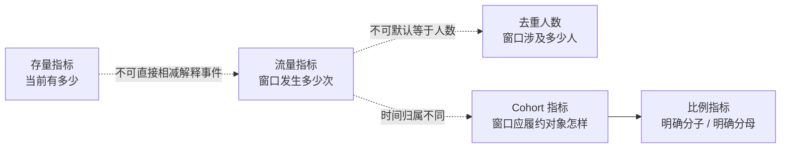
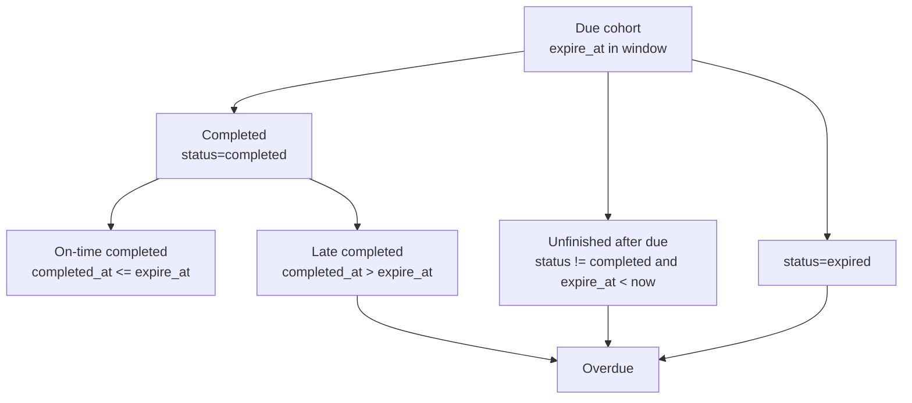

# Statistics 统计指标与口径

> 状态：**已重写**。本文以当前 Statistics DTO、MySQL ReadModel、日聚合重建 SQL、Actor 关系模型、Evaluation Assessment、Plan Task 和 Periodic 查询实现为事实基础，定义现行指标的统计对象、过滤条件、时间归属、计算公式、数据来源与已知语义偏差。

## 1. 本文回答

本文重点回答：

- 一个 Statistics 字段究竟统计“资源存量”“事件次数”“去重人数”“任务 cohort”还是“比例”；
- Overview 中哪些字段受查询时间范围影响，哪些始终是当前或累计值；
- “入口打开”“接纳完成”“受试者创建”“关系建立”分别统计什么动作；
- “答卷提交”“测评创建”“报告生成”当前是否真的分别来自 Survey、Evaluation 和 Interpretation；
- 医生可访问患者数为什么不能简单等于三类关系数量之和；
- Content submission/completion 的统计对象为什么实际上是 Assessment；
- Plan activity 与 fulfillment 为什么必须分开理解；
- `completion_rate`、`on_time_completion_rate` 和 Periodic 完成率的分子、分母及零分母语义；
- `today`、`7d`、`30d`、自定义窗口和日趋势怎样决定事件归属；
- 哪些字段名称与当前实现存在偏差，现阶段应该怎样解读；
- 新增或修改一个指标时，必须固化哪些合同并怎样对账。

本文是一份**现行指标词典**，不是产品指标规划。所有“建议调整”“待统一”内容都会与“当前实现”明确区分。

## 2. 30 秒结论

Statistics 当前并不存在一种通用的“统计数量”。API 中的指标至少分成六类：

| 指标类型 | 回答的问题 | 代表字段 |
| --- | --- | --- |
| 资源存量 | 查询或快照时点存在多少对象 | `testee_count`、`clinician_count`、`active_entry_count` |
| 累计事实量 | 历史上产生了多少业务记录 | `assessment_count`、Content `total_submissions` |
| 窗口事件量 | 某段时间发生了多少次动作 | `entry_opened_count`、`task_completed_count` |
| 窗口去重人数 | 某段时间至少发生过一次动作的人数 | `enrolled_testees`、`assessed_in_window_count` |
| Cohort 履约量 | 在窗口内计划或到期的一组任务表现怎样 | `due_task_count`、`overdue_task_count` |
| 派生比例 | 一个明确分子占明确分母的百分比 | `completion_rate`、`on_time_completion_rate` |

同名或近似名称不代表同一口径。例如：

- `organization_overview.report_count` 来自 `status=evaluated` 的 Assessment，不是 Interpretation 报告数；
- `assessment_service.report_generated_count` 也来自 Assessment `evaluated_at`；
- `clinician.window.completed_assessment_count` 却来自 `AssessmentEpisode.report_generated_at`，更接近真实报告事实；
- Content `total_submissions` 是 Assessment 数，不是 MongoDB AnswerSheet 数；
- Plan `task_expired_count` 按 `expire_at` 归日，而不是记录“状态变成 expired”的时间；
- Plan `overdue_task_count` 同时包含逾期完成和到期未完成，并不等于“未完成数”。

所以任何指标都必须至少携带五项语义：

```text
统计对象 + 过滤范围 + 时间归属 + 聚合方式 + 数据来源
```

如果缺少其中任何一项，就不能仅凭字段名进行业务解释或计算转化率。

## 3. 指标词典的统一阅读规则

### 3.1 每个指标必须回答八个问题

本文使用以下口径卡片：

| 维度 | 要回答的问题 |
| --- | --- |
| 业务问题 | 这个数用来观察什么，而不是字段叫什么 |
| 统计对象 | 统计 Testee、Entry、AnswerSheet、Assessment、Report、Task 还是事件 |
| 范围 | 机构、医生、入口、受试者、Plan 或 Content 怎样限定 |
| 时间归属 | 按 `created_at`、`occurred_at`、`submitted_at`、`evaluated_at`、`planned_at` 还是 `expire_at` |
| 聚合方式 | 行数、事件次数、`COUNT(DISTINCT ...)`、日求和、快照还是比例 |
| 数据来源 | 业务表、事实表、日聚合表、机构快照还是 Redis |
| 刷新语义 | 实时、夜间重建、窗口补算、快照或缓存 |
| 已知边界 | 哪些对象不包含、字段名是否准确、能否直接作为转化率节点 |

Redis 只影响“何时看到重新计算的值”，不改变指标定义，因此本篇把 Redis 标为查询缓存，而不把它写成指标权威来源。

### 3.2 存量、流量和 cohort 不能混算



必须遵守：

1. 一个用户重复打开三次入口，事件量可以是 `3`，人数只能是 `1`；
2. 当前 active Entry 数是存量，窗口内 Entry 创建数是流量，两者不能相除得到“激活率”；
3. `completed_at` 窗口内完成数是活动量，`expire_at` 窗口内完成数是到期 cohort 的完成情况；
4. 累计 Assessment 数与最近 30 天 evaluated 数不属于同一时间范围；
5. 只有分子、分母、范围和时间归属全部一致时，比例才成立。

### 3.3 `snapshot` 在不同 DTO 中不是同一种快照

当前代码里存在两种名为 snapshot 的语义：

- `statistics_org_snapshot` 是某次同步生成的机构级物化快照，具有 `snapshot_at`；
- `ClinicianStatisticsSnapshot` 是请求时实时读取当前关系和有效入口形成的“当前状态视图”；
- `AssessmentEntryStatistics.snapshot` 则是对该入口全部 `JourneyDaily` 历史行求和形成的“累计值”。

因此不能把所有 `snapshot` 都理解为“同一时刻冻结的数据”。

### 3.4 本篇怎样表达实现偏差

本文使用三种表述：

- **现行口径**：当前代码和 SQL 已经实现的行为；
- **业务解释边界**：当前值可以回答什么、不能回答什么；
- **待统一**：字段名、来源或模型身份存在明确不一致，但本文不擅自改写 API。

## 4. Organization Overview 指标

`organization_overview` 是机构资源和累计服务量摘要。虽然它位于带 `time_range` 的 `StatisticsOverview` 中，但这里的大部分字段**不受请求窗口影响**。

### 4.1 机构资源与累计量

| API 字段 | 现行口径 | 时间语义 | 当前来源 | 重要边界 |
| --- | --- | --- | --- | --- |
| `testee_count` | 本机构未删除 Testee 行数 | Snapshot 生成时；无 Snapshot 时为请求时 | `statistics_org_snapshot`；缺失时 `testee` | 不要求 Testee 当前有 active 医生关系或 Plan |
| `clinician_count` | 本机构 active 且未删除 Clinician 数 | Snapshot 生成时；无 Snapshot 时为请求时 | Snapshot；缺失时 `clinician` | 与 Dimension 的 clinician count 不同，后者包含 inactive |
| `active_entry_count` | active、未删除且未过期的 AssessmentEntry 数 | Snapshot 生成时，以当时 `now` 判断 | Snapshot；缺失时 `assessment_entry` | 无过期时间视为仍有效 |
| `assessment_count` | 本机构未删除 Assessment 总数 | Snapshot 生成时；无 Snapshot 时为请求时 | Snapshot；缺失时 `assessment` | 是累计测评执行记录，不受 Overview 窗口影响 |
| `report_count` | `status=evaluated` 且 `evaluated_at` 非空的 Assessment 数 | Snapshot 生成时；无 Snapshot 时为请求时 | Snapshot；缺失时 `assessment` | 名称不是实际 Interpretation Report 数 |
| `content_count` | Assessment 中出现过的 distinct `(content_type, content_code)` 数 | 每次 Overview 回源时实时计算 | `assessment` | 只统计产生过 Assessment 的内容，不是运营已发布内容总数 |
| `answer_sheet_submission_count` | `submitted_at` 非空的 Assessment 数 | 全历史累计，请求时实时计算 | `assessment` | 不统计未绑定模型、未创建 Assessment 的独立问卷答卷 |
| `today_answer_sheet_submission_count` | 本地自然日 `[00:00, 次日00:00)` 内 `submitted_at` 非空的 Assessment 数 | 请求所在“今天” | `assessment` | 不使用 Overview 的 `from/to`，只使用服务器本地今日 |

### 4.2 `content_count` 的身份公式

当前 Content identity 由 Assessment 推导：

```text
if evaluation_model_kind == "scale":
    content_type = "scale"
    content_code = evaluation_model_code，空时回退 questionnaire_code
else:
    content_type = "questionnaire"
    content_code = questionnaire_code
```

然后统计机构内 distinct `(content_type, content_code)` 数量。

这意味着：

- 同一个 code 在 `questionnaire` 和 `scale` 下可以计为两个内容；
- 从未执行过的已发布 Questionnaire 或 AssessmentModel 不计入；
- Personality、Behavioral Rating、Cognitive 等非 `scale` 模型会落入 Questionnaire 分支；
- Content 数回答“机构历史使用过多少种当前可识别的执行内容”，不回答“运营维护了多少业务资产”。

### 4.3 为什么这里不能直接计算机构转化率

`answer_sheet_submission_count / testee_count` 没有稳定业务含义：

- 分子是累计 Assessment submission 次数；
- 分母是当前或快照时点 Testee 存量；
- 同一 Testee 可以提交多次；
- 历史已删除 Testee 不在分母，却可能影响历史 Assessment 数据；
- 两者刷新时点可能不同。

如果需要“受试者覆盖率”，应该单独定义同一窗口内 distinct submitted Testee / eligible Testee cohort，而不是复用现有两个字段。

## 5. Access Funnel 指标

Access Funnel 观察门诊二维码等 AssessmentEntry 的接入过程。Overview 的 window 和 trend 都读取机构维度 `statistics_journey_daily.access_*` 专用列。

### 5.1 四个漏斗节点

| API 字段 | 统计对象 | 时间归属 | 完整重建来源 | 现行计算 |
| --- | --- | --- | --- | --- |
| `entry_opened_count` | 入口打开/解析发生次数 | `resolved_at` 所在自然日 | `assessment_entry_resolve_log` | 每日 `max(resolve log 数, intake log 数)` |
| `intake_confirmed_count` | 成功完成接纳的日志数 | `intake_at` 所在自然日 | `assessment_entry_intake_log` | 每条 intake log 计 `1` |
| `testee_created_count` | 接纳过程中确实新建 Testee 的次数 | `intake_at` 所在自然日 | intake log | `testee_created = true` 的日志数 |
| `care_relationship_established_count` | 接纳过程中确实新建服务关系的次数 | `intake_at` 所在自然日 | intake log | `assignment_created = true` 的日志数 |

`entry_opened_count` 使用 `GREATEST(opened, intake)` 是一个容错口径：即使历史 resolve 日志缺失，但存在成功 intake，也不会让当天“打开数”小于“接纳数”。因此它不是纯粹的 resolve log 原始计数。

### 5.2 这些是动作次数，不是独立人数

当前 Access Funnel 没有按 Testee、用户或 Entry 去重：

- 同一入口被同一个人多次解析，可以产生多次 opened；
- intake log 表示成功接纳事实，但指标本身仍按日志行计数；
- `testee_created_count` 只统计本次 intake 新建 Testee，不包含复用已有 Testee；
- `care_relationship_established_count` 只统计本次新建关系，不包含已经存在的有效关系。

因此 `testee_created_count` 或 `care_relationship_established_count` 下降，不一定代表接纳失败，也可能代表更多用户复用了已有档案或关系。

### 5.3 当前没有正式的漏斗转化率

API 只返回节点数量，没有返回：

- opened → intake 转化率；
- intake → testee created 比例；
- intake → relationship established 比例；
- 按唯一用户或唯一入口计算的转化率。

如果调用方自行计算 `intake / opened`，必须接受它是**事件量比例**，并且 opened 经过 `GREATEST` 修正。它不是严格的同一用户 cohort 转化率。

## 6. Assessment Service 指标

Assessment Service 观察一次测评执行在窗口内进入了哪些阶段。Overview 当前读取 `statistics_journey_daily.service_*` 专用列，这组列由夜间任务直接从 `assessment` 重建。

### 6.1 四个服务节点

| API 字段 | 现行统计条件 | 时间归属 | 当前权威来源 | 实际业务含义 |
| --- | --- | --- | --- | --- |
| `answersheet_submitted_count` | Assessment `submitted_at IS NOT NULL` | `submitted_at` 所在自然日 | `assessment` | 已进入 Evaluation 并带提交时间的测评次数 |
| `assessment_created_count` | 未删除 Assessment 行 | `created_at` 所在自然日 | `assessment` | 测评执行记录创建次数 |
| `report_generated_count` | `status=evaluated` 且 `evaluated_at IS NOT NULL` | `evaluated_at` 所在自然日 | `assessment` | Outcome/测评执行完成次数，不是实际报告成品数 |
| `assessment_failed_count` | `failed_at IS NOT NULL` | `failed_at` 所在自然日 | `assessment` | 曾记录测评执行失败时间的次数 |

### 6.2 这不是 Survey → Evaluation → Interpretation 的严格事实漏斗

当前实现有两个语义替代：

1. “AnswerSheet submitted” 使用 Assessment `submitted_at`，没有直接读取 MongoDB AnswerSheet；
2. “Report generated” 使用 Assessment `evaluated_at`，没有直接读取 Interpretation ReportCatalog。

所以：

- 独立 Questionnaire 的 AnswerSheet 不进入该漏斗；
- AnswerSheet 已可靠受理但 Assessment 尚未创建时，当前指标看不到这段延迟；
- Assessment 已 evaluated 但 Interpretation 仍失败时，`report_generated_count` 仍会增加；
- 真正 Report 已生成的过程事实只在通用 Journey/AssessmentEpisode 中表达，Overview 专用服务列没有使用它。

### 6.3 节点数不保证单调

这些节点按各自事件时间分别落入窗口。某个窗口内可能出现：

- 之前提交的 Assessment 在本窗口完成，导致 report count 大于 submission count；
- 重试后的 Assessment 在本窗口失败或完成；
- 边界日提交和次日完成被拆到不同趋势点。

因此不能要求每一天都满足：

```text
submitted >= created >= generated
```

只有基于同一批 Assessment 构造 cohort，才能得到严格的阶段转化率。

## 7. Dimension Analysis 指标

`dimension_analysis` 当前只是三类运营分析入口的资源数量，不是多维 OLAP 结果。

| API 字段 | 现行口径 | 来源 | 与 Organization Overview 的区别 |
| --- | --- | --- | --- |
| `clinician_count` | 本机构所有未删除 Clinician，包括 inactive | Snapshot dimension 字段；缺失时实时 Clinician | Organization Overview 只统计 active Clinician |
| `entry_count` | 本机构所有未删除 AssessmentEntry | Snapshot dimension 字段；缺失时实时 Entry | Organization Overview 只统计 active 且未过期 Entry |
| `content_count` | Assessment 中 distinct typed content | 每次回源实时 Assessment | 与 Organization Overview content 口径相同，当前会重复计算 |

这三个数用于告诉前端“有哪些可下钻维度和大致规模”，不能解释为窗口内新增量。

## 8. Clinician Statistics 指标

医生统计同时包含当前关系存量、窗口行为量和入口供给量。它们被放在一个 DTO 中，但不能混为同一漏斗。

### 8.1 Clinician Snapshot

| API 字段 | 现行口径 | 聚合方式 | 时间语义 |
| --- | --- | --- | --- |
| `primary_testee_count` | 当前 active `primary` 关系关联的 Testee | distinct Testee | 请求时实时 |
| `attending_testee_count` | 当前 active `attending` 关系关联的 Testee | distinct Testee | 请求时实时 |
| `collaborator_testee_count` | 当前 active `collaborator` 关系关联的 Testee | distinct Testee | 请求时实时 |
| `total_accessible_testees` | 当前 active `assigned/primary/attending/collaborator` 任一关系可访问的 Testee | 跨关系类型 distinct Testee | 请求时实时 |
| `active_entry_count` | 医生名下 active、未删除、未过期 Entry | Entry 行数 | 请求时实时 |

`total_accessible_testees` 不能用三个展示分类简单相加：

- total 还包含 `assigned` 关系；
- 同一 Testee 可能在多个允许关系类型中出现；
- total 在所有允许类型上统一去重。

因此以下公式不成立：

```text
total_accessible = primary + attending + collaborator
```

### 8.2 Clinician Window

| API 字段 | 现行口径 | 时间归属 | 来源 |
| --- | --- | --- | --- |
| `intake_count` | 归属该 Clinician 的 intake-confirmed 过程次数 | Footprint `occurred_at` / 日聚合日期 | clinician JourneyDaily |
| `assigned_count` | 归属该 Clinician 的 care-relationship-established 次数 | Footprint `occurred_at` | clinician JourneyDaily |
| `completed_assessment_count` | 归属该 Clinician 且 Episode 出现 `report_generated_at` 的次数 | `report_generated_at` | clinician JourneyDaily |

这里的 `completed_assessment_count` 比 Overview 的 `report_generated_count` 更接近实际报告生成事实，因为 clinician Journey 的通用列来自 AssessmentEpisode，而不是 Assessment `evaluated_at`。字段名仍然容易让人误以为它按 Assessment status 统计。

### 8.3 Clinician Funnel

| API 字段 | 现行口径 | 类型 |
| --- | --- | --- |
| `created_count` | 查询窗口内该医生创建的 Entry 数，按 `assessment_entry.created_at` | 供给侧资源流量 |
| `resolved_count` | 归属该医生的 Entry opened 次数 | 用户行为事件量 |
| `intake_count` | 归属该医生的 intake confirmed 次数 | 用户行为事件量 |
| `assigned_count` | 归属该医生的 relationship established 次数 | 用户行为事件量 |
| `assessment_count` | 归属该医生的 Assessment created 次数 | 服务过程事件量 |

`created_count` 表示“医生在窗口内创建了多少个入口”，其余字段表示用户使用入口和进入测评服务的过程。它们不是同一批对象，因此这个 Funnel 主要用于并列观察，不应直接计算 `resolved / created` 作为患者转化率。

### 8.4 Current Clinician Testee Summary

| API 字段 | 现行口径 | 时间语义 |
| --- | --- | --- |
| `total_accessible_testees` | 当前 active 允许关系下 distinct Testee | 请求时 |
| `primary/attending/collaborator_testee_count` | 当前相应关系下 distinct Testee | 请求时 |
| `key_focus_testee_count` | 当前可访问且 `testee.is_key_focus=true` 的 distinct Testee | 请求时，不受查询窗口影响 |
| `assessed_in_window_count` | 查询窗口内创建过 Assessment，且当前与医生存在 active 允许关系的 distinct Testee | Assessment `created_at` 窗口 |

`assessed_in_window_count` 不是“该医生亲自发起或执行的测评人数”。当前 SQL 使用 Testee 与医生的**当前可访问关系**限定 Assessment 的 Testee，并没有要求 Assessment 保存或匹配该 clinician ID。

## 9. AssessmentEntry Statistics 指标

Entry 查询回答“一个具体二维码/入口被怎样使用”。

### 9.1 Snapshot 与 Window

| API 字段 | `snapshot` | `window` | 来源 |
| --- | --- | --- | --- |
| `resolve_count` | 该 Entry 所有日聚合 opened 总和 | 查询窗口内 opened 总和 | entry JourneyDaily |
| `intake_count` | 所有日聚合 intake 总和 | 窗口内 intake 总和 | entry JourneyDaily |
| `assigned_count` | 所有日聚合 relationship established 总和 | 窗口内相同事件总和 | entry JourneyDaily |
| `assessment_count` | 所有日聚合 Assessment created 总和 | 窗口内相同事件总和 | entry JourneyDaily |

这里的 `snapshot` 是**累计事件量**，不是当前状态快照，也不受 `time_range` 限制。

### 9.2 最近行为时间

| API 字段 | 现行口径 | 来源 |
| --- | --- | --- |
| `last_resolved_at` | 该 Entry 的 `entry_opened` Footprint 最大 `occurred_at` | BehaviorFootprint 实时聚合 |
| `last_intake_at` | 该 Entry 的 `intake_confirmed` Footprint 最大 `occurred_at` | BehaviorFootprint 实时聚合 |

最近行为时间不从 JourneyDaily 推导，因为日聚合只能保留日期和数量，无法回答当天最后一次动作的精确时间。

### 9.3 Entry 转化率的限制

`intake_count / resolve_count` 可以作为入口事件级使用比，但不是唯一用户转化率；`assessment_count / intake_count` 还可能跨日、受异步执行影响。当前 API 没有返回正式 Entry conversion rate。

## 10. Content Batch 指标

Content Batch 按调用方给出的 `(type, code)` 返回机构内累计测评执行量。它直接读取 Assessment，不使用 `statistics_content_daily`，也没有时间范围参数。

### 10.1 Questionnaire

| 指标 | 现行口径 |
| --- | --- |
| Content identity | `type=questionnaire` + `questionnaire_code` |
| `total_submissions` | `evaluation_model_kind IS NULL OR != scale` 的 Assessment 总数 |
| `total_completions` | 上述 Assessment 中 `status=evaluated` 的数量 |
| `completion_rate` | `total_completions / total_submissions * 100` |

这里的 Questionnaire 不是“独立问卷答卷”口径，而是“非 scale Assessment 按 questionnaire code 分组”的兼容口径。人格、行为评定和认知测验同样可能进入该分支。

### 10.2 Scale

| 指标 | 现行口径 |
| --- | --- |
| Content identity | `type=scale` + `COALESCE(non-empty evaluation_model_code, questionnaire_code)` |
| `total_submissions` | `evaluation_model_kind=scale` 的 Assessment 总数 |
| `total_completions` | 上述 Assessment 中 `status=evaluated` 的数量 |
| `completion_rate` | `total_completions / total_submissions * 100` |

### 10.3 零值与去重

- 请求中的重复 `(type, code)` 会被去重；
- 返回顺序保持首次出现顺序；
- 合法但没有数据的 Content 返回全零项；
- `total_submissions=0` 时，`completion_rate=0`；
- 百分比返回 `0~100` 语义，不是 `0~1` 小数；
- 当前没有固定小数位舍入，JSON 直接输出 `float64` 计算结果。

### 10.4 该指标不能回答什么

当前 Content Batch 不能回答：

- 独立 Questionnaire 收到了多少 AnswerSheet；
- 某个模型发布版本的完成情况；
- Personality/Behavioral/Cognitive 各自的使用量；
- 某个日期窗口内的提交和完成；
- Assessment evaluated 后是否真正生成 Interpretation Report。

## 11. Plan Activity 指标

Plan Activity 观察 Task 事件在什么时候发生。Window 是日聚合求和与实时 distinct Testee 的组合，Trend 来自 `statistics_plan_daily`。

### 11.1 Task 事件量

| API 字段 | 统计条件 | 时间归属 | 来源 |
| --- | --- | --- | --- |
| `task_created_count` | 未删除 Task | `created_at` | PlanDaily |
| `task_opened_count` | `open_at IS NOT NULL` | `open_at` | PlanDaily |
| `task_completed_count` | `completed_at IS NOT NULL` | `completed_at` | PlanDaily |
| `task_expired_count` | `status=expired` 且 `expire_at IS NOT NULL` | `expire_at` | PlanDaily |

`task_expired_count` 按任务的截止时间归日。当前 Task 没有单独的 `expired_at` 统计时间，因此它回答“哪一天到期且最终处于 expired”，不严格等于“哪一天执行了过期状态迁移”。

### 11.2 Enrolled 与 Active Testees

| API 字段 | 现行口径 | 聚合方式 |
| --- | --- | --- |
| `enrolled_testees` | 窗口内至少创建过一个 Task 的 Testee | `created_at` 窗口内 distinct Testee |
| `active_testees` | 窗口内至少完成过一个 `status=completed` Task 的 Testee | `completed_at` 窗口内 distinct Testee |

两者都只计算属于未删除 Plan 的 Task。

`active_testees` 的“active”表示窗口内发生过完成行为，不表示 Testee 当前仍加入 active Plan，也不表示最近登录或打开任务。

### 11.3 Activity Trend

Trend 分别按 `created_at/open_at/completed_at/expire_at` 所在日期返回四条序列。不同序列中的同一个日期不是同一 cohort：当天完成的 Task 可能是在更早日期创建的。

## 12. Plan Fulfillment 指标

Plan Fulfillment 不问“事件何时发生”，而问“窗口内计划或到期的 Task 履约得怎样”。当前直接读取 AssessmentTask 实时计算。

### 12.1 两个基础 cohort

Fulfillment 同时构造两个集合：

```text
Planned cohort:
  org 匹配
  Task 和 Plan 未删除
  Task status != canceled
  planned_at in [from, to)

Due cohort:
  org 匹配
  Task 和 Plan 未删除
  Task status != canceled
  expire_at 非空
  expire_at in [from, to)
```

`planned_task_count` 来自 Planned cohort，其余完成和逾期指标来自 Due cohort。两组数量不能互相作为默认分母。

### 12.2 Window 指标与公式

| API 字段 | 现行口径 |
| --- | --- |
| `planned_task_count` | planned_at 落入窗口的非取消 Task 数 |
| `due_task_count` | expire_at 落入窗口的非取消 Task 数 |
| `completed_task_count` | Due cohort 中当前 `status=completed` 的 Task 数 |
| `on_time_completed_count` | Due cohort 中 completed 且 `completed_at <= expire_at` 的 Task 数 |
| `overdue_task_count` | Due cohort 中 status=expired，或完成时间晚于截止时间，或当前未 completed 且已经超过截止时间的 Task 数 |
| `completion_rate` | `completed_task_count / due_task_count * 100` |
| `on_time_completion_rate` | `on_time_completed_count / due_task_count * 100` |

零分母时两个比例都返回 `0`。

### 12.3 Completed、On-time 与 Overdue 的集合关系



必须注意：

- 逾期完成 Task 同时属于 `completed_task_count` 和 `overdue_task_count`；
- `overdue_task_count` 不是 `due - completed`；
- `on_time_completed_count` 是 completed 的子集；
- `completion_rate` 衡量最终是否完成，不衡量是否按时；
- `on_time_completion_rate` 才衡量 Due cohort 的按时履约比例。

### 12.4 Trend 的日期归属

| Trend 序列 | 日期归属 |
| --- | --- |
| `planned` | `DATE(planned_at)` |
| `due` | `DATE(expire_at)` |
| `completed` | 完成的 Due cohort，仍归到 `DATE(expire_at)` |
| `overdue` | 逾期的 Due cohort，仍归到 `DATE(expire_at)` |

因此 Fulfillment trend 的 completed 不是“当天完成数”，而是“当天到期的任务中，目前完成了多少”。随着迟到完成或状态变化，历史日期上的 completed/overdue 可以变化，这也是它选择实时计算而不是简单事件日聚合的原因。

## 13. Testee Periodic 指标

Testee Periodic 是面向单个 Testee 的 Plan Task 组合视图。它不读取 Statistics 日聚合，也不接受时间窗口。

### 13.1 Project 识别

当前按 `plan_id` 对该 Testee 的全部未删除 Task 分组：

- 有 Task 的 Plan 才会出现在 Projects；
- `total_projects = projects 数量`；
- `active_projects = 至少有一个 status=pending 或 opened Task 的 Project 数`；
- active 不直接读取 AssessmentPlan 当前状态。

### 13.2 Project 指标

| API 字段 | 现行口径 |
| --- | --- |
| `total_weeks` | Project 内 Task 总数，实际是任务次数，不验证一定按周生成 |
| `completed_weeks` | status=completed 的 Task 数 |
| `completion_rate` | `completed_weeks / total_weeks * 100`，零任务返回 0 |
| `current_week` | 按 seq 排序后第一个非 completed Task 的 seq；如果全部 completed，则取 Task 总数 |
| `start_date` | Project 内最早 `planned_at` |
| `end_date` | 最大 `expire_at`；Task 无 expire_at 时用 planned_at 参与最大值 |

字段继续沿用“week”，但 Plan 支持的调度未必都是自然周，所以业务上更准确的解释是“第几次计划任务”。

### 13.3 Task 状态投影

| AssessmentTask status | Periodic API status |
| --- | --- |
| `completed` | `completed` |
| `expired` | `overdue` |
| `canceled` | `canceled` |
| `pending`、`opened` 及其他值 | `pending` |

因此 Periodic API 不区分 pending 与 opened。当前 OpenAPI 的部分说明只列出 `completed/pending/overdue`，但实现还可能返回 `canceled`，应以当前代码为准并修订契约描述。

### 13.4 Project 与 Scale 名称

当前 `project_name` 和 `scale_name` 使用同一个值：

1. 按 Task 顺序找到第一个已关联 Assessment 且有 `evaluation_model_title` 的名称；
2. 否则使用 Task `scale_code`；
3. 仍为空时返回“未命名量表”。

这不是 Plan 自己的稳定标题，也没有表达最新模型版本。

## 14. 时间窗口与日趋势统一规则

### 14.1 请求窗口

| 输入 | Application 生成的范围 |
| --- | --- |
| 默认 / `30d` | 29 天前的本地 00:00 到当前时刻 |
| `today` | 本地今日 00:00 到当前时刻 |
| `7d` | 6 天前的本地 00:00 到当前时刻 |
| 自定义 date-only `to` | 将结束日期加一天，形成包含结束日的 `[from,to)` |
| 自定义时间 | 按输入精确时间形成 `[from,to)` |

所有窗口都采用左闭右开 `[from, to)`。

### 14.2 当前日聚合边界偏差

JourneyDaily 和 PlanDaily SQL 当前使用：

```text
stat_date >= beginningOfDay(from)
AND stat_date < beginningOfDay(to)
```

当 preset 的 `to` 是今天当前时刻时，上界被向下取整为今天 00:00：

- `today` 的日聚合窗口为空；
- `7d/30d` 不包含当天；
- 实时 SQL 仍可能包含今天，导致同一 Overview 的不同区域覆盖范围不同。

这是当前实现缺口，不应把它提升为理想口径。产品期望如果是“包含今天”，需要修复 ReadModel 边界并用趋势点数合同测试保护。

### 14.3 日趋势的零值

Application 会为数据库缺失日期补 `count=0`。这个零值只表示“返回的读模型中没有计数”，不能区分：

- 当天业务确实为零；
- Scanner 尚未推进；
- nightly 尚未重建；
- 日行缺失或损坏；
- 时间边界排除了数据。

在 API 提供 freshness metadata 之前，运营不能仅凭单个零点判断业务异常。

## 15. 比例指标统一约定

### 15.1 当前计算方式

Statistics 当前统一使用百分数语义：

```text
rate = completed / total * 100
if total == 0:
    rate = 0
```

适用于：

- Content completion rate；
- Plan fulfillment completion rate；
- Plan fulfillment on-time completion rate；
- Testee Periodic project completion rate。

### 15.2 `0` 的歧义

`completion_rate=0` 可能表示：

1. 分母为零，没有任何适用对象；
2. 分母大于零，但没有完成对象。

调用方必须同时查看分子和分母，不能只展示比例。若产品需要区分“无数据”与“0%”，未来应使用 nullable rate 或额外的 `has_data`，而不是改变现有公式。

### 15.3 不做默认舍入

当前领域函数直接返回 `float64`，没有约束保留位数。展示层可以格式化成一位或两位小数，但不得把格式化后的字符串反向当作统计事实。

## 16. 指标来源与刷新矩阵

| 指标组 | 主要来源 | 计算方式 | 刷新/可见性 |
| --- | --- | --- | --- |
| Organization resource | OrgSnapshot，缺失时业务表 | 存量/累计 | 快照刷新；Overview 再受 Redis TTL 影响 |
| Organization content/submission | Assessment | 实时累计 | Overview cache miss 时计算 |
| Access Funnel | resolve/intake logs → access daily | 日聚合求和 | nightly 完整重建后可见 |
| Assessment Service | Assessment → service daily | 日聚合求和 | nightly 完整重建后可见 |
| Clinician Journey | Footprint/Episode → generic daily | 日聚合求和 | 投影或窗口重建后可见 |
| Entry Journey | Footprint/Episode → generic daily | 累计/窗口日求和 | 投影或窗口重建后可见 |
| Content Batch | Assessment | 实时累计 | 请求时 |
| Plan Activity task count | AssessmentTask → PlanDaily | 日聚合求和 | Plan 全量重建后可见 |
| Plan Activity people | AssessmentTask | 实时 distinct | 请求时 |
| Plan Fulfillment | AssessmentTask | 实时 cohort | 请求时，历史日期可随状态变化 |
| Testee Periodic | AssessmentTask + Assessment title | 实时组合 | 请求时 |

Overview 命中 Redis 时，表中的“请求时”实际会退化成“缓存 payload 生成时”。当前 DTO 没有返回这个时间。

## 17. 指标对账规则

对账的目标不是强求所有相似名称相等，而是验证每个指标与自己的来源契约一致。

### 17.1 机构资源对账

```text
snapshot.testee_count
  == COUNT(testee WHERE org_id=? AND deleted_at IS NULL)

snapshot.clinician_count
  == COUNT(clinician WHERE active AND not deleted)

snapshot.active_entry_count
  == COUNT(entry WHERE active AND not deleted AND not expired at snapshot_at)
```

对账时必须使用 Snapshot `snapshot_at` 附近的状态，不能拿今天的业务表强求历史快照完全相等。

### 17.2 Access Funnel 对账

按机构和自然日分别核对：

```text
opened = max(resolve_log_count, intake_log_count)
intake = intake_log_count
testee_created = count(intake_log where testee_created=true)
relationship_established = count(intake_log where assignment_created=true)
```

### 17.3 Assessment Service 对账

按 `submitted_at/created_at/evaluated_at/failed_at` 各自日期对 Assessment 分组。不能用 `created_at` 一个字段给四个节点统一分日。

### 17.4 Plan 对账

必须分别验证：

- Activity：按四个事件时间分组；
- Planned cohort：按 `planned_at` 选取；
- Due cohort：按 `expire_at` 选取；
- Completed：Due cohort 的当前 completed status；
- On-time：Due cohort 且 `completed_at <= expire_at`；
- Overdue：expired、迟到完成或当前过期未完成的并集。

### 17.5 跨来源差异不能直接判错

下列差异当前可能是口径差异，不一定是数据损坏：

- Mongo AnswerSheet 数 > Assessment-based submission 数；
- Assessment evaluated 数 > Interpretation Report 数；
- Organization active clinician 数 < Dimension clinician 数；
- Clinician 分类人数之和 != total accessible；
- Plan completed + overdue > due，因为迟到完成同时属于 completed 和 overdue；
- Periodic active project 数与 active AssessmentPlan 数不同。

## 18. 当前指标语义问题

本节只列已由源码确认的语义缺口，后续在 `90-设计问题与重构清单.md` 中确定优先级和方案。

### 18.1 AnswerSheet 指标没有读取 AnswerSheet

机构累计 submission、Assessment Service submission 和 Content submission 都以 Assessment 为统计对象。独立问卷答卷和“已受理但尚未创建 Assessment”的阶段不可见。

### 18.2 Report 指标存在两套来源

- Organization/Assessment Service：Assessment evaluated；
- Clinician/Entry generic Journey：AssessmentEpisode report generated。

相同的“报告/完成”名称可能返回不同阶段的数量。

### 18.3 Content 类型只有 Questionnaire/Scale 二分

非 scale 模型被归入 Questionnaire，已经落后于 ModelCatalog 的 Scale、Personality、Behavioral Rating、Cognitive 类型体系。

### 18.4 Funnel 不是统一 cohort

Access、Clinician、Entry 和 Assessment Service 都返回阶段数量，但节点可能来自不同对象、不同发生时间和不同刷新链路。当前不应由前端自由计算并命名业务转化率。

### 18.5 Snapshot 名称不统一

同名字段分别表示物化时点、请求时当前状态和历史累计值，增加了 API 使用和面试讲解成本。

### 18.6 Plan 命名仍带历史业务假设

`enrolled_testees` 实际按 Task creation 去重，`active_testees` 实际按完成行为去重；Periodic 的 `week/scale_name` 也把通用 Plan 任务表达成按周医学量表。

### 18.7 时间窗口尚未统一包含今天

日聚合和实时查询在 preset 下可能覆盖不同日期范围，会让一个 Overview 内的区域不可直接横向比较。

### 18.8 API 缺少新鲜度

调用方看不到 Snapshot、Daily、实时计算和 Redis 分别生成于何时，也不能区分真实零与同步延迟。

## 19. 指标变更合同

新增或修改一个指标，必须先填写以下合同：

```text
指标名称：
业务问题：
统计对象：
机构/资源范围：
包含条件：
排除条件：
去重键：
事件时间字段：
窗口边界：[from, to)
分子：
分母：
零分母语义：
权威业务来源：
事实/投影来源：
刷新频率和最大可接受延迟：
缓存 identity 与失效时机：
授权要求：
对账 SQL/方法：
历史数据是否需要重建：
兼容字段和迁移计划：
```

### 19.1 变更顺序

1. 先确认业务问题和统计对象；
2. 再确认能否从现有权威事实稳定恢复；
3. 明确事件时间、去重键和窗口；
4. 决定实时查询、事实投影、日聚合或快照；
5. 写出分子、分母和空集语义；
6. 增加 SQL 合同测试和应用组装测试；
7. 评估历史重建与缓存 version switch；
8. 更新 OpenAPI、指标词典和运营展示文案；
9. 用至少一个机构、一个自然日窗口进行来源对账；
10. 上线后观察查询耗时、同步延迟和异常零值。

### 19.2 禁止的改法

- 只改字段中文名，不确认真实来源；
- 用当前状态表反推已经丢失的历史动作；
- 给两个时间语义不同的数字直接增加转化率；
- 为追平看板直接修改业务表或手工累计表；
- 在没有重建方案时改变历史指标定义；
- 把 Redis 缓存值当作唯一统计事实；
- 新增 ModelCatalog kind 后继续用 `else questionnaire` 静默归类。

## 20. 指标验收场景

### 20.1 Organization

1. inactive Clinician 不计入 organization clinician，但计入 dimension clinician；
2. 过期 Entry 不计入 active entry，但计入 dimension entry；
3. 从未执行的已发布模型不计入 content count；
4. 独立 Questionnaire AnswerSheet 不应被误报为 Assessment submission；
5. Snapshot 缺失 fallback 与 Snapshot 重建后的同口径字段一致。

### 20.2 Funnel 与 Service

1. resolve log 缺失但 intake 存在时，opened 不小于 intake；
2. 复用已有 Testee 的 intake 不增加 testee-created；
3. 复用已有关系的 intake 不增加 relationship-established；
4. evaluated Assessment 尚无 Report 时，当前 service report 指标的行为被合同测试固定；
5. 同一 Assessment 跨日提交、创建、完成时分别落到正确日期。

### 20.3 Clinician 与 Entry

1. 同一 Testee 有多个关系类型时 total accessible 只计一次；
2. assigned 关系只进入 total，不误入 primary/attending/collaborator；
3. assessed-in-window 只计算当前可访问 Testee；
4. Entry snapshot 是全历史累计，window 只覆盖所选自然日；
5. last resolved/intake 保留精确事件时间。

### 20.4 Content

1. 相同 code 的 Questionnaire 与 Scale 分开统计；
2. 无数据 ref 返回零项且保持请求顺序；
3. evaluated/total 的百分比使用 `0~100`；
4. 零分母返回 0；
5. 新模型 kind 不被无意吞入 Questionnaire。

### 20.5 Plan

1. Activity 的四个指标分别按自己的时间字段归日；
2. canceled Task 不进入 fulfillment cohort；
3. 逾期完成同时计入 completed 和 overdue；
4. 未到期 pending Task 不计 overdue；
5. 到期未完成在当前时间超过 expire_at 后计 overdue；
6. Trend completed 按 due date 而不是 actual completion date；
7. Periodic opened 映射为 pending、expired 映射为 overdue、canceled 保持 canceled。

## 21. 代码事实索引

### 21.1 指标 DTO 与公式

- `internal/apiserver/domain/statistics/v1_types.go`：全部 Statistics API 字段和分组；
- `internal/apiserver/domain/statistics/aggregator.go`：百分比公式和零分母行为；
- `internal/apiserver/domain/statistics/types.go`：日趋势点结构。

### 21.2 指标读取

- `internal/apiserver/infra/mysql/statistics/readmodel/read_model.go`：Organization、Funnel、Service、Clinician、Entry、Content 和 Plan 指标 SQL；
- `internal/apiserver/infra/mysql/statistics/periodic_reader.go`：Periodic Project、Week、状态和完成率；
- `internal/apiserver/application/statistics/read_service_overview_query.go`：Overview 指标组装；
- `read_service_clinician_query.go`、`read_service_entry_query.go`、`read_service_questionnaire_batch_query.go`：各查询族应用契约。

### 21.3 指标重建

- `internal/apiserver/infra/mysql/statistics/rebuild_writer.go`：Journey、Access、Service、PlanDaily 和 OrgSnapshot 的精确 SQL；
- `internal/apiserver/infra/mysql/statistics/po.go`：物化字段、日期和唯一键；
- `internal/apiserver/application/statistics/sync_service.go`：同步窗口和重建编排。

### 21.4 合同测试

- `internal/apiserver/infra/mysql/statistics/readmodel/read_model_contract_test.go`：机构范围、Content identity、Plan cohort 和 SQL 口径；
- `internal/apiserver/application/statistics/read_service_test.go`：时间、组装、权限和比例；
- `internal/apiserver/application/statistics/periodic_service_test.go`：当前只保护 Periodic Service 委托边界；`periodic_reader.go` 的状态映射、current week 和 project 汇总尚无直接单元测试；
- `internal/apiserver/infra/mysql/statistics/rebuild_writer_test.go`：重建事务和物化写入行为；
- `internal/apiserver/application/statistics/sync_service_test.go`：同步窗口与 writer 调用边界。

## 22. 小结

qs-server 的 Statistics 指标不是一组可以任意组合的数字，而是一组有明确对象和时间语义的读侧合同：

- Organization Overview 主要是当前/快照资源和累计 Assessment 量；
- Access Funnel 是入口接入动作次数，不是唯一用户 cohort；
- Assessment Service 当前以 Assessment 近似 AnswerSheet 和 Report 阶段；
- Clinician 同时呈现当前关系存量、入口供给和服务事件；
- Entry snapshot 是历史累计，window 才受查询范围影响；
- Content 是按 Assessment 统计的累计完成情况；
- Plan Activity 按事件时间观察发生量；
- Plan Fulfillment 按 planned/due cohort 观察履约；
- Periodic 是单患者全部 Plan Task 的实时组合视图；
- 所有完成率都是百分数，零分母返回 0。

真正稳定的指标解释不能停在“这个字段中文叫什么”，而必须能够完整说出：

> 它统计的是什么对象，在哪个机构或资源范围内，以哪个时间字段归属到哪个窗口，是否去重，分子和分母分别是什么，当前从哪张业务表或投影表读取，多久可见，以及哪些业务事实没有被包含。

只有做到这一点，Statistics 才能既服务运营观察，也经得起代码复核、数据对账和架构追问。
