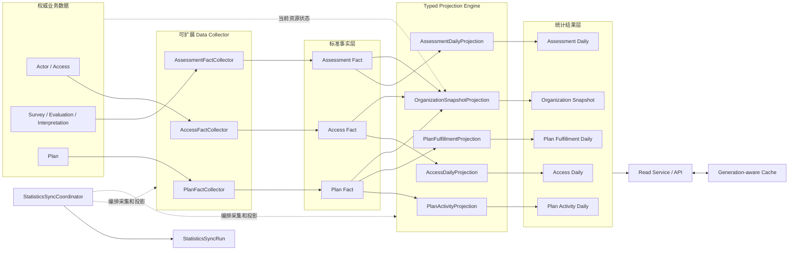
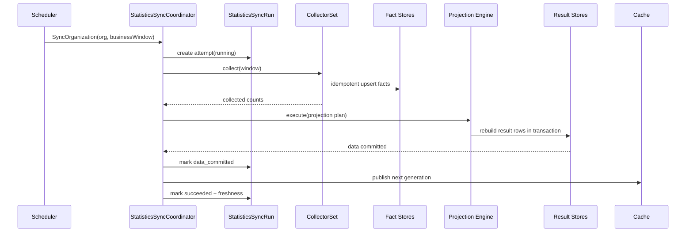

# Statistics V2 重构目标架构与完成定义

> 状态：**目标已定稿，核心代码已落地，生产迁移待验收**。本文定义 Statistics V2 重构完成后的唯一目标状态，以及判断重构是否真正完成的验收边界。V2 Schema、Collector、Projection、SyncRun、查询接口、PlanEnrollment、AttributionSnapshot 与调用方开关已经实现；历史回填、连续七天影子对账、生产切流和 V1 退役仍必须按门槛执行。具体证据和剩余任务见 [设计问题与重构清单](./90-设计问题与重构清单.md)。

## 1. 30 秒结论

Statistics V2 重构的最终目标不是“重写几条统计 SQL”，也不是“把旧表换成新表”，而是建立一条可以长期解释、反复重建和稳定扩展的统计生产线：

```text
权威业务数据
    -> 可扩展 Data Collector
    -> 标准事实层
    -> Typed Projection Engine
    -> 统计结果层
    -> Read Service / API
```

最终系统必须同时满足五个要求：

1. **真值唯一**：Actor、Survey、Evaluation、Interpretation、Plan 继续拥有业务真值，Statistics 不复制业务决策权；
2. **事实稳定**：不同数据库、模块和生命周期被归一为 Access、Assessment、Plan 三类可重建事实；
3. **口径唯一**：每张统计结果表只有一个强类型 Projection 负责计算，不再并存实时 SQL、Scanner 和多套聚合逻辑；
4. **运行可恢复**：每个机构、每个批次都能判断执行到哪一步，失败后可以安全重跑和对账；
5. **查询可解释**：每个指标都能追溯到来源、Fact、Projection、结果表和时间口径，调用方能识别数据新鲜度。

Statistics V2 采用上海时间下的 **T+1 批量统计**。当前业务不要求秒级实时数据，前一完整自然日的数据已经足以支持运营观察、机构管理、医生服务统计和 Plan 履约分析。

## 2. 本文在重构中的位置

Statistics 文档分成三种不同性质的事实：

| 文档 | 负责回答 | 不负责回答 |
| --- | --- | --- |
| [README](./README.md) | 模块是什么、为什么重建、怎样阅读 | 逐项证明重构已经完成 |
| **本文** | 重构完成后必须长什么样、什么条件下才算完成 | 具体先改哪个包、分几次上线 |
| [设计问题与重构清单](./90-设计问题与重构清单.md) | 从当前实现迁移到目标状态的任务、依赖与验收 | 重新发明目标架构 |

当三者发生冲突时，使用以下判断规则：

- 当前代码和数据库用于说明“系统现在是什么”；
- 本文用于说明“系统最终必须变成什么”；
- 90 文档用于记录“还差哪些工作”；
- 只有代码、migration、测试、数据对账和运行证据全部成立，目标条目才可以标记为已实现。

## 3. 最终架构



这张图包含两条必须分开的链路：

- **数据链路**负责把权威业务数据变成 Fact，再变成统计结果；
- **控制链路**由 `StatisticsSyncCoordinator` 组织批次、事务、状态和缓存切换。

Data Collector 和 Projection Engine 都不是新的数据层。Collector 是来源适配与事实归一组件，Projection Engine 是强类型统计计算组件。把组件画成层只是为了表达数据流，不意味着必须拆成独立服务。

## 4. 最终模块职责

### 4.1 Statistics 拥有的能力

重构完成后，Statistics 只拥有以下能力：

- 从业务权威源读取统计所需数据；
- 将异构来源归一为三类标准事实；
- 保存 Statistics 自己拥有的 Fact、结果和同步运行记录；
- 按统一业务日与固定指标口径产生五类结果；
- 对相同来源和相同窗口进行幂等采集与确定性重建；
- 向调用方提供稳定的查询模型和数据新鲜度；
- 在数据库、缓存或部分批次失败时提供可判断、可恢复的运行状态；
- 支持来源扩展、Fact 扩展和 Projection 扩展，但扩展必须显式注册、强类型和可测试。

### 4.2 Statistics 不拥有的能力

最终状态下，Statistics 不得承担以下职责：

- 不判断患者、医生、家长或组织关系是否合法；
- 不重新校验 AnswerSheet；
- 不重新计算问题得分、因子得分、Norm、Decision 或 Outcome；
- 不生成、修改或解释报告内容；
- 不推进 PlanEnrollment、Task、Assessment 或 InterpretReport 状态；
- 不以当前 Actor、Entry 或 Plan 关系覆盖已经冻结的历史归属；
- 不成为通用事件总线、通用数据仓库或自由 SQL 平台；
- 不让统计同步失败反向阻塞答卷受理、测评执行或报告生成。

最终边界可以概括为：

> Statistics 负责稳定地观察业务，而不重新定义业务。

## 5. 最终组件模型

### 5.1 StatisticsSyncCoordinator

`StatisticsSyncCoordinator` 是一次机构批次的唯一外层编排者。它负责：

1. 计算本次 T+1 业务日窗口；
2. 创建或恢复 `StatisticsSyncRun`；
3. 按显式顺序调用 Collector；
4. 在事实采集完成后调用 Projection Engine；
5. 控制结果写入事务；
6. 提交 MySQL 结果后切换机构缓存 Generation；
7. 记录阶段、行数、耗时、错误与最终新鲜度。

Coordinator 不编写来源映射，不包含指标 SQL，也不直接拼装 API 响应。它拥有的是运行控制权，而不是业务口径。

### 5.2 可扩展 Data Collector

第一版包含三个强类型 Collector：

- `AccessFactCollector`：收集 Entry 打开、Intake、建档和关系建立/转移等接入事实；
- `AssessmentFactCollector`：收集 AnswerSheet、Assessment、Outcome 和 Report 生命周期事实；
- `PlanFactCollector`：收集 Enrollment 与 Task 生命周期事实。

Collector 共享最小应用契约：

```go
type FactCollector interface {
    Name() string
    Collect(ctx context.Context, request CollectRequest) (CollectResult, error)
}
```

这个接口只统一运行协议，不把三类 Fact 抹平成通用 JSON。最终扩展规则是：

| 变化类型 | 扩展方式 |
| --- | --- |
| 已有 Fact 家族增加一个业务来源 | 在对应 Collector 内增加强类型 Source Reader / Mapper |
| 出现新的稳定 Fact 家族 | 新增 Collector、Fact 类型、Fact Store，并显式注册到 `CollectorSet` |
| 只增加统计维度 | 先判断是否属于已冻结业务快照，再修改对应 Fact 与 Projection |
| 只增加查询展示字段 | 优先扩展 Read Model，不反向污染 Fact |

Collector 扩展禁止采用反射扫描、运行时插件、动态 SQL 脚本或一张通用 JSON 事件表。qs-server 当前体量更需要可追踪的显式装配，而不是插件平台。

### 5.3 标准事实层

标准事实层只有三类事实：

- Access Fact；
- Assessment Fact；
- Plan Fact。

Fact 的职责不是缓存任意业务表，而是稳定回答：

- 发生了什么；
- 何时发生；
- 属于哪个组织、患者、医生、入口、内容或计划；
- 来源对象和来源版本是什么；
- 归属来自冻结快照、历史推导还是未知；
- 相同业务事实如何去重。

Fact 必须具有稳定业务键和来源追踪字段。重跑相同采集窗口时，只允许新增缺失事实或更新同一事实的确定字段，不得制造重复事实。

### 5.4 Typed Projection Engine

Projection Engine 统一五个 Projection 的执行协议、依赖顺序和结果报告：

- `AccessDailyProjection`；
- `AssessmentDailyProjection`；
- `PlanActivityProjection`；
- `PlanFulfillmentProjection`；
- `OrganizationSnapshotProjection`。

Engine 只负责“怎样执行 Projection”，具体 Projection 负责“指标怎样计算”。最终模型明确区分三种投影语义：

| 语义 | Projection | 时间解释 |
| --- | --- | --- |
| 窗口事实 | Access / Assessment / Plan Activity Daily | 统计 `[from,to)` 内发生的事实 |
| Cohort 结果 | Plan Fulfillment Daily | 按 planned/due cohort 归属，并在重建时判断履约 |
| 当前状态快照 | Organization Snapshot | 在 `snapshot_at` 观察当前资源，并组合 Fact 累计量 |

Engine 不引入 Metric Catalog、指标 DSL、运行时脚本或动态插件。新增 Projection 必须具有明确输入、输出表、时间语义、幂等键和对账方法，并通过编译期注册进入执行计划。

### 5.5 Read Service 与缓存

Read Service 只读取 V2 结果表和必要的当前业务读模型，不再临时跨 MongoDB、MySQL 与旧投影拼装同一指标。

每类响应至少表达：

- `as_of_date`：完整统计到哪个上海自然日；
- `snapshot_at`：当前资源快照生成时间；
- `is_stale`：结果是否超过产品允许的新鲜度；
- 查询范围和过滤条件；
- 指标值及必要的分子、分母。

Redis 使用机构级 Generation。MySQL 结果事务提交成功后才允许切换 Generation。缓存失败不能回滚已提交的统计结果；查询侧可以读取旧 Generation 或返回受保护的降级响应，但不能在高流量下无限制回源数据库。

## 6. 最终数据模型

Statistics V2 固定为九张主要表：

### 6.1 三张事实表

| 表 | 事实粒度 | 主要业务键 |
| --- | --- | --- |
| `statistics_access_fact` | 一次接入阶段事实 | 来源类型 + 来源 ID + 事实类型 |
| `statistics_assessment_fact` | 一次测评交付阶段事实 | AnswerSheet/Assessment 身份 + 阶段类型 |
| `statistics_plan_fact` | 一次 Enrollment/Task 生命周期事实 | Enrollment/Task 身份 + 事实类型 |

### 6.2 五张结果表

| 表 | 结果粒度 | Projection |
| --- | --- | --- |
| `statistics_access_daily` | 机构 × 日期 × 医生 × Entry | AccessDailyProjection |
| `statistics_assessment_daily` | 机构 × 日期 × 归属 × 内容 | AssessmentDailyProjection |
| `statistics_plan_activity_daily` | 机构 × 日期 × Plan | PlanActivityProjection |
| `statistics_plan_fulfillment_daily` | 机构 × Cohort 日期 × Plan | PlanFulfillmentProjection |
| `statistics_org_snapshot` | 每机构一行 | OrganizationSnapshotProjection |

### 6.3 一张运行表

`statistics_sync_run` 保存机构批次的运行事实。其身份采用 `batch_key + attempt`，至少包含：

- 机构、批次键和尝试次数；
- 业务日期窗口；
- `running / failed / data_committed / succeeded` 状态；
- 当前阶段；
- 各 Collector 和 Projection 的处理行数；
- 开始、提交、完成时间；
- 可重试分类、错误摘要和观察标识；
- 结果对应的 `as_of_date` 和缓存 Generation。

第一版不建设 Checkpoint、Pending、Dead Letter 和通用 Metric Catalog。T+1 窗口可以从权威源重新读取，增加一套细粒度运行时状态只会重新引入当前希望消除的复杂度。

## 7. 最终时间契约

Statistics V2 使用单一时间契约：

- 业务时区固定为 `Asia/Shanghai`；
- Daily 的日期是上海自然日；
- 采集和投影窗口统一使用半开区间 `[from,to)`；
- 默认每天处理最近 7 个已经结束的自然日，以吸收延迟到达数据；
- Plan Fulfillment 按组织全量重建其有效 cohort，第一版不做脆弱的增量推断；
- 数据库存储的 Instant 和业务 Date 必须显式区分；
- 禁止依赖部署机器的隐式 `time.Local` 决定统计口径。

“T+1”不是说同步只能执行一次，而是说对外完整性承诺截止到前一完整自然日。失败重试、人工补跑和扩大回看窗口不能改变指标口径。

## 8. 最终归属契约

### 8.1 AssessmentAttributionSnapshot

新 AnswerSheet 在可靠受理时必须冻结：

```text
origin_type / origin_id
clinician_id / entry_id
plan_id / enrollment_id / task_id
captured_at / version
```

它与 AnswerSheet 和 Outbox 一起在 `202 Accepted` 前持久化。后续 Evaluation、Interpretation 和 Statistics 只能复制该快照，不能根据当前关系重新计算。

历史数据允许尽力推导，并必须标记：

- `frozen`：受理时冻结的可信归属；
- `derived_legacy`：由历史数据推导，可能存在偏差；
- `unknown`：缺少足够证据，不能伪造归属。

### 8.2 PlanEnrollment

Plan 模块最终必须持久化 `PlanEnrollment`：

```text
一个患者 + 一个 Plan + 一轮参与
```

Enrollment 具有 `active / closed / terminated` 状态，Task 保存 `enrollment_id`。Statistics 只采集 Enrollment 和 Task 已经形成的业务事实，不通过 Task 集合反向发明参与关系。

同一 Enrollment 内若未来支持重排，Plan 必须持久化 Schedule Revision；Statistics 不得从 `updated_at` 猜测计划版本。

## 9. 最终运行链路

一次成功的机构 T+1 同步应当遵循以下链路：



关键顺序不可颠倒：

1. Fact 写入成功后才能执行依赖它的 Projection；
2. 所有结果表写入在同一机构批次结果事务内提交；
3. MySQL 提交成功后才能发布新缓存 Generation；
4. 缓存发布失败时，运行状态停在 `data_committed`，不得把数据库结果回滚或重新计数；
5. 重跑使用相同指标口径和幂等键，结果必须与一次成功执行一致。

## 10. 最终查询与指标契约

### 10.1 指标只有一个权威计算入口

任一正式指标必须能回答五个问题：

1. 它观察哪个业务事实；
2. 事实如何进入哪张 Fact 表；
3. 哪个 Projection 负责计算；
4. 写入哪张结果表、粒度是什么；
5. 哪个 Read Model/API 对外提供。

如果一个指标同时由夜间 Projection 和在线 SQL 分别计算，即使二者当前数值相同，也不满足最终目标。

### 10.2 比率不持久化

结果表保存可相加、可对账的分子和分母，不持久化完成率、转化率等派生比率。Read Service 在查询时计算比率，并统一处理：

- 分母为零；
- 精度和舍入；
- 百分比展示；
- 跨日、跨医生和跨入口聚合。

### 10.3 当前资源与历史事实分开

机构当前患者数、医生数、Entry 数等资源规模允许由 `OrganizationSnapshotProjection` 在同步时读取当前 MySQL 权威状态。这是明确的当前状态快照，不等同于历史事件事实。

第一版不增加 Resource Fact 或统计维度历史状态层。只有出现“查询任意历史日期的资源状态”这一明确需求时，才重新评估该设计。

## 11. 最终代码边界

最终代码组织不要求机械照搬以下目录名，但必须形成等价的责任边界：

```text
domain/statistics/
  fact / metric / syncrun          # 统计领域词汇、值对象和运行状态

application/statistics/
  collection/                      # Collector 契约、CollectorSet 与强类型映射
  projection/                      # Engine 契约、执行计划与 Projection 端口
  sync/                            # Coordinator 和批次用例
  query/                           # Read Service 与查询模型

infra/statistics/
  source/                          # MySQL/Mongo 权威源适配器
  fact/                            # 三类 Fact Store
  projection/                      # 五个 SQL Projection
  readmodel/                       # 结果查询适配器
  syncrun/                         # SyncRun Repository

container/modules/statistics/
                                    # 显式装配 Collector、Projection 与用例
```

必须保护以下依赖方向：

```text
domain <- application <- infrastructure/container
```

- Domain 不依赖 MongoDB、MySQL、Redis 或调度器；
- Application 依赖端口，不直接绑定数据库实现；
- Infrastructure 实现来源读取、Fact Store、Projection SQL 和查询；
- Container 显式选择启用哪些 Collector 与 Projection；
- Scheduler 只触发应用用例，不拥有统计业务逻辑。

## 12. 最终必须退出的旧机制

Statistics V2 只有在旧统计生产链路退出后才算完成。最终活动运行时不得继续依赖：

- `BehaviorFootprint` 作为正式统计事实；
- `AssessmentEpisode` 作为正式统计事实；
- `statistics_journey_daily`；
- `statistics_plan_daily`；
- Journey Projector、Scanner、Pending、Checkpoint、Watermark 等实时投影运行时；
- 多个彼此独立的 Statistics 同步入口；
- Plan 履约查询时实时扫描全部 `assessment_task`；
- 机构概览为同一指标混合 Snapshot、Daily 和在线业务 SQL；
- MongoDB 扫描与统计结果写入放在同一个长事务中；
- 无新鲜度字段、无法判断数据截止日期的统计响应。

退出活动运行时不等于立即物理删除。旧表和旧代码可以在影子对账、灰度和回滚观察期暂时保留，但必须满足：

- 新查询不再读取；
- 新同步不再写入；
- 监控确认无调用；
- 回滚窗口结束；
- 删除具有独立 migration 和恢复方案。

## 13. 明确不做什么

为了控制 qs-server 当前体量下的工程复杂度，Statistics V2 第一阶段明确不做：

- 秒级实时统计；
- Kafka/Flink 等流式计算平台；
- 独立 Statistics 微服务；
- 独立统计数据库实例；
- 通用数据仓库、Cube 或 OLAP 平台；
- Metric Catalog、指标 DSL 和运营动态配置公式；
- 反射式 Collector/Projection 插件发现；
- 任意历史时点的机构资源维度还原；
- 为所有旧数据追求无误差归属回填；
- 患者任务明细的过度物化；
- 在统计模块中补偿业务主链路状态。

这些不是永远禁止，而是当前没有足够业务证据支持其复杂度。出现明确容量、实时性或历史分析需求后，应以新的架构决策记录重新评估。

## 14. 重构完成定义

“代码可以编译”只代表局部实现完成。Statistics V2 只有同时通过以下八组门槛，才可以从“规划改造”标记为“已实现”。

### 14.1 架构完成

- [ ] 唯一活动数据链路符合“业务数据 → Collector → Fact → Projection → Result → Read Service”；
- [ ] Collector、Projection、Coordinator 和 Read Service 职责分离；
- [ ] 三个 Collector 和五个 Projection 均强类型、显式注册；
- [ ] Statistics 不夺取 Actor、Survey、Evaluation、Interpretation、Plan 的业务真值；
- [ ] 不存在为同一正式指标保留第二套在线计算逻辑。

### 14.2 领域前置完成

- [ ] PlanEnrollment 已持久化，Task 具有 `enrollment_id`；
- [ ] AnswerSheet Admission 已冻结 AttributionSnapshot；
- [ ] 新业务数据不再依赖 Statistics 夜间反推核心归属；
- [ ] 历史归属明确区分 `frozen / derived_legacy / unknown`。

### 14.3 数据模型完成

- [ ] 九张 V2 表 migration 完成并经过回滚/前滚验证；
- [ ] 三类 Fact 具有稳定业务键、来源追踪和幂等约束；
- [ ] 五类结果的粒度、唯一键和时间语义与指标文档一致；
- [ ] SyncRun 可以表达运行中、失败、数据已提交和最终成功；
- [ ] 上海时间、业务日期和 Instant 的存储契约经过边界测试。

### 14.4 运行可靠性完成

- [ ] 相同来源重复采集不会制造重复 Fact；
- [ ] 相同窗口重复投影得到相同结果；
- [ ] 任一 Collector、Projection、事务或缓存阶段失败后都能判断停点；
- [ ] `data_committed` 后缓存失败可以继续完成，而不重复计算或回滚 MySQL；
- [ ] 自动重跑与人工补跑使用相同应用入口并产生独立审计记录；
- [ ] Statistics 失败不影响答卷受理、Evaluation 或 Interpretation 主链路。

### 14.5 查询契约完成

- [ ] Organization、Clinician、Entry、Content、Plan Activity、Plan Fulfillment 查询全部切到 V2；
- [ ] 响应包含 `as_of_date`、`snapshot_at` 和 `is_stale`；
- [ ] 比率由统一 Read Service 根据分子/分母计算；
- [ ] API、OpenAPI、前端类型和空数据语义同步更新；
- [ ] 缓存不可用时具有容量受控的降级语义，不会把无限流量压向数据库。

### 14.6 数据迁移与对账完成

- [ ] 历史 Fact 回填可重复执行；
- [ ] 允许偏差的历史归属有标记、有数量统计、有说明；
- [ ] 来源 → Fact、Fact → Result、Result → API 三层均有对账工具；
- [ ] V1/V2 影子运行覆盖约定观察期；
- [ ] 差异能够按指标、机构、日期和来源定位；
- [ ] 业务方确认切换日、新鲜度和已知历史偏差。

### 14.7 旧系统退役完成

- [ ] V1 Projector、Scanner 和旧同步任务停止注册；
- [ ] 新运行时不再读写旧 Fact/Daily 表；
- [ ] 监控和日志证明观察期内没有旧链路调用；
- [ ] 旧缓存键停止生产并完成自然过期或安全清理；
- [ ] 旧表删除或归档具有单独批准、备份和恢复方案。

### 14.8 工程与运维完成

- [ ] 单元测试覆盖 Fact 映射、时间边界、幂等键和指标算法；
- [ ] 集成测试覆盖 Collector、Projection 事务、SyncRun 和重跑；
- [ ] 容量测试证明 T+1 窗口能在约定时间内完成；
- [ ] 指标覆盖同步延迟、失败阶段、处理行数、数据新鲜度和缓存切换；
- [ ] 告警、补跑、对账和回滚操作手册可执行；
- [ ] 本目录、接口文档、migration 说明与源码事实同步；
- [ ] `make docs-facts`、`make docs-hygiene`、相关测试和 `git diff --check` 通过。

## 15. 最终不变量

下面的不变量比具体类名和目录更稳定。后续实现可以调整命名，但不能破坏这些约束：

1. 权威业务数据只能由所属业务模块定义；
2. 一个业务事实在同一 Fact 家族中最多存在一条有效记录；
3. 一张统计结果表只有一个 Projection 负责写入；
4. 一个正式指标只有一套计算口径；
5. 所有 Daily 使用上海自然日和半开区间；
6. 新 Assessment 的历史归属来自受理时冻结快照；
7. Plan 履约基于持久化 Enrollment 和 Task，不凭当前状态猜测历史；
8. 重建同一输入必须得到同一结果；
9. MySQL 结果提交先于缓存 Generation 发布；
10. Statistics 的延迟或失败不能改变业务主链路结果；
11. 查询必须明确结果完整到何时；
12. 任何扩展都必须能够说明其来源、Fact、Projection、结果和对账方式。

## 16. 判断重构是否完成的最终问题

重构验收时，不应只问“新表有没有数据”，而要逐一回答：

- 对任意 API 指标，能否从响应一路追溯到结果表、Projection、Fact 和权威来源？
- 删除某一套旧 Projector 或实时 SQL 后，正式指标是否仍只有一个完整生产入口？
- 同一机构同一窗口执行两次，Fact 和结果是否保持一致？
- 任一步失败后，是否知道停在哪里、哪些数据已经提交、下一次应该从哪里恢复？
- 医生、Entry、患者关系或 Plan 当前状态变化后，新数据的历史归属是否仍然稳定？
- 缓存失败时，是否既不丢失已提交结果，也不会把流量无限压向 MySQL？
- 前端和运营是否清楚看到的是哪一天的完整数据？
- 旧表、旧任务和旧缓存是否已经退出活动运行时，而不只是“暂时没人注意到”？

只要其中任一关键问题无法用代码、测试、数据或运行证据回答，Statistics V2 就仍处于迁移阶段，而不是重构完成。

## 17. 后续实施入口

本文目标冻结后，所有施工工作进入 [设计问题与重构清单](./90-设计问题与重构清单.md)，并遵守以下顺序约束：

```text
先保存未来不可丢失的业务事实
  -> 再建立 V2 Schema
  -> 再实现 Collector 与 Projection
  -> 再影子回填和对账
  -> 再切换 API 与缓存
  -> 最后退役 V1
```

实施过程中如果发现目标本身需要改变，应先回到本文讨论并记录架构决策，不能通过某个局部 PR 静默改变最终口径。
